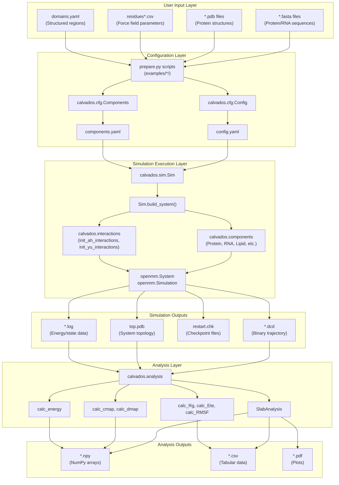

# Overview

<details>
<summary>Relevant source files</summary>

The following files were used as context for generating this wiki page:

- [README.md](README.md)
- [calvados/__init__.py](calvados/__init__.py)
- [examples/single_MDP/input/TIA1.pdb](examples/single_MDP/input/TIA1.pdb)
- [examples/slab_IDR/example_slab_analysis.ipynb](examples/slab_IDR/example_slab_analysis.ipynb)
- [setup.py](setup.py)

</details>


This document provides a high-level introduction to CALVADOS, a Python package for coarse-grained implicit-solvent simulations of biomolecules. It covers the package's purpose, architectural organization, workflow from input preparation to trajectory analysis, and key capabilities for simulating intrinsically disordered proteins, structured proteins, RNA, and multi-component phase separation systems.

For installation instructions, see [Installation & Setup](#1.1). For a detailed breakdown of individual modules and their interactions, see [System Architecture](#1.2). For hands-on tutorials, see [Quick Start Guide](#1.3).

## Purpose and Scope

CALVADOS is a coarse-grained force field and simulation package designed for studying biomolecular systems, particularly intrinsically disordered proteins (IDPs) and liquid-liquid phase separation (LLPS). The package implements a one-bead-per-residue coarse-grained model with implicit solvent, enabling efficient simulation of large systems over extended timescales.

The package provides:
- **Multiple force field variants**: CALVADOS2, CALVADOS3, C2RNA (for protein-RNA systems), and pCALVADOS2 (for pH-dependent simulations)
- **Diverse molecular components**: Proteins, RNA, lipids, crowders (e.g., PEG), cyclic peptides, and branched topologies
- **Specialized simulation geometries**: Slab configurations for phase separation studies, membrane systems, and standard periodic boxes
- **Comprehensive analysis tools**: Structural properties, contact maps, energy calculations, and sophisticated phase separation analysis via `SlabAnalysis`

The software is built on OpenMM for molecular dynamics integration and leverages MDAnalysis and mdtraj for trajectory processing.

**Sources**: [README.md:1-68](), [calvados/__init__.py:1-12]()

## Core Architecture and Workflow

CALVADOS implements a layered architecture with three primary phases: **configuration**, **simulation execution**, and **trajectory analysis**. The workflow is unidirectional with no circular dependencies, enabling reproducible computational pipelines.

### System Workflow Diagram



**Sources**: [calvados/__init__.py:1-12](), [README.md:1-68]()

### Code Entity Map

The following diagram maps the major functional systems to their implementing code entities, bridging natural language concepts to the actual Python modules, classes, and functions in the codebase.

```mermaid
graph TB
    subgraph Concepts["Functional Systems"]
        SEQ_ANAL["Sequence Analysis<br/>(charges, hydropathy, κ, SCD)"]
        SYS_BUILD["System Construction<br/>(placing molecules, adding forces)"]
        FF_PARAMS["Force Field Parameters<br/>(σ, λ, q values)"]
        MD_ENGINE["MD Integration<br/>(time stepping, energy minimization)"]
        TRAJ_PROC["Trajectory Processing<br/>(Rg, contacts, densities)"]
        PS_ANAL["Phase Separation Analysis<br/>(density profiles, partitioning)"]
    end
    
    subgraph CodeEntities["Code Entities"]
        SeqModule["calvados.sequence"]
        GetQs["get_qs()"]
        CalcSCD["calc_SCD()"]
        
        BuildModule["calvados.build"]
        PlaceFunc["place_molecules()"]
        BuildSys["build_system()"]
        
        ResCSV["residues_CALVADOS2.csv<br/>residues_CALVADOS3.csv<br/>residues_C2RNA.csv<br/>residues_pCALVADOS2.csv"]
        
        IntModule["calvados.interactions"]
        InitAH["init_ah_interactions()"]
        InitYU["init_yu_interactions()"]
        
        OMM["openmm.Simulation<br/>openmm.LangevinIntegrator"]
        
        AnalModule["calvados.analysis"]
        CalcRg["calc_Rg()"]
        CalcCmap["calc_cmap()"]
        CalcEnergy["calc_energy()"]
        
        SlabCls["SlabAnalysis class"]
        CalcProfiles["calc_profiles()"]
        CalcConc["calc_concentrations()"]
    end
    
    SEQ_ANAL --> SeqModule
    SEQ_ANAL --> GetQs
    SEQ_ANAL --> CalcSCD
    
    SYS_BUILD --> BuildModule
    SYS_BUILD --> PlaceFunc
    SYS_BUILD --> BuildSys
    
    FF_PARAMS --> ResCSV
    
    MD_ENGINE --> OMM
    
    TRAJ_PROC --> AnalModule
    TRAJ_PROC --> CalcRg
    TRAJ_PROC --> CalcCmap
    TRAJ_PROC --> CalcEnergy
    
    PS_ANAL --> SlabCls
    PS_ANAL --> CalcProfiles
    PS_ANAL --> CalcConc
```



**Sources**: [calvados/__init__.py:1-12](), [README.md:18-24]()

## Module Organization

CALVADOS is organized into several cohesive modules, each with specific responsibilities:

| Module | Primary Classes/Functions | Purpose |
|--------|---------------------------|---------|
| `calvados.cfg` | `Config`, `Components` | Configuration management: parsing YAML files, validating parameters, defining molecular components |
| `calvados.components` | `Component`, `Protein`, `RNA`, `Lipid`, `Crowder`, `Cyclic`, `Seastar`, `PTMProtein` | Molecular component definitions with type-specific behavior |
| `calvados.sequence` | `get_qs()`, `calc_Rg0()`, `calc_SCD()`, `calc_kappa()` | Sequence-derived property calculations |
| `calvados.build` | `place_molecules()`, `grid_placement()`, `slab_placement()` | Initial molecular placement strategies |
| `calvados.interactions` | `init_ah_interactions()`, `init_yu_interactions()`, `init_bonded_interactions()`, `init_restraints()` | Force field initialization for OpenMM |
| `calvados.sim` | `Sim` | Top-level simulation orchestration: system building, equilibration, production runs |
| `calvados.analysis` | `SlabAnalysis`, `calc_Rg()`, `calc_cmap()`, `calc_energy()` | Post-simulation trajectory analysis |

For detailed documentation of each module's internal structure, see [System Architecture](#1.2).

**Sources**: [calvados/__init__.py:1-12]()

## Key Capabilities

### Molecular Component Types

CALVADOS supports diverse molecular types through a polymorphic component hierarchy:

- **Proteins**: Structured proteins with PDB input, Go-model restraints, AlphaFold PAE-weighted confidence, and intrinsically disordered proteins without structure (see [Protein Components](#3.2))
- **RNA**: Two-bead-per-nucleotide model with angle potentials and base-base interactions (see [RNA Components](#3.3))
- **Lipids**: Membrane/bilayer components with specialized lipid-lipid and lipid-protein interactions
- **Crowders**: Generic excluded volume agents (e.g., PEG) to simulate crowding effects
- **Cyclic peptides**: Non-linear topologies with cyclic bonding (see [Cyclic & Branched Peptides](#6.4))
- **Branched topologies**: `Seastar` component for complex branched architectures
- **Post-translational modifications**: `PTMProtein` for modeling phosphorylation and other modifications (see [Post-Translational Modifications](#6.5))

Each component type is implemented as a subclass of the base `Component` class, inheriting common functionality while providing specialized methods for force initialization and property calculation.

**Sources**: [calvados/__init__.py:1-12]()

### Force Field Variants

Multiple force field parameter sets are provided to optimize different simulation contexts:

| Force Field | File | Target Systems | Key Reference |
|-------------|------|----------------|---------------|
| CALVADOS2 | `residues_CALVADOS2.csv` | Intrinsically disordered proteins | [DOI: 10.1073/pnas.2111696118](https://doi.org/10.1073/pnas.2111696118) |
| CALVADOS3 | `residues_CALVADOS3.csv` | Structured and multi-domain proteins | [DOI: 10.1002/pro.5172](https://doi.org/10.1002/pro.5172) |
| C2RNA | `residues_C2RNA.csv` | Mixed protein-RNA systems | - |
| pCALVADOS2 | `residues_pCALVADOS2.csv` | pH-dependent simulations, phosphorylated IDRs | - |

All force fields implement the same underlying functional forms (Ashbaugh-Hatch for hydrophobic interactions, Yukawa/Debye-Hückel for electrostatics) but with optimized parameters. For details on potential forms and parameterization, see [Force Field & Interaction Potentials](#3.4).

**Sources**: [README.md:12-16]()

### Simulation Types

CALVADOS supports multiple simulation geometries optimized for different research questions:

1. **Single molecule simulations** (`topology='center'`): Study conformational ensembles of individual proteins or RNA molecules in a spherical box
2. **Slab geometry** (`topology='slab'`): Simulate liquid-liquid phase separation with planar interfaces for accurate density profile analysis
3. **Grid placement** (`topology='grid'`): Regular lattice positioning for multi-molecule systems
4. **Membrane systems** (`topology='bilayer'`): Proteins interacting with lipid bilayers
5. **Random placement** (`topology='random'`): Unstructured initial configurations for multi-component systems

For preparing different simulation types, see [Preparation Scripts](#2.3). For examples of each simulation type, see sections [7.1](#7.1) through [7.5](#7.5).

**Sources**: [README.md:25-26]()

### Analysis Capabilities

The `calvados.analysis` module provides comprehensive trajectory analysis tools:

**Structural Properties**:
- Radius of gyration (`calc_Rg`)
- End-to-end distance (`calc_Ete`)
- RMSD and RMSF (`calc_rmsd`, `calc_RMSF`)
- Orientational correlation functions (`calc_OCF`)
- Scaling exponents (`calc_scaling_exponent`)

**Contact Analysis**:
- Contact maps (`calc_cmap`)
- Distance maps (`calc_dmap`)
- Weighted contact number (`calc_WCN`)
- Fraction of native contacts (`calc_FNC`)

**Phase Separation Analysis**:
- `SlabAnalysis` class for systematic phase separation studies
- Density profile calculations along slab axis
- Automated dense/dilute phase identification
- Multi-component partitioning analysis with reference and client molecules
- Statistical error estimation via block averaging

**Energy Calculations**:
- Post-hoc potential energy calculation from trajectories (`calc_energy`)
- Validation against OpenMM log files

For detailed documentation of analysis workflows, see [Trajectory Analysis](#5).

**Sources**: [examples/slab_IDR/example_slab_analysis.ipynb:1-132](), [README.md:25-26]()

## Usage Pattern

A typical CALVADOS workflow consists of three stages:

1. **Preparation** (see [Preparation Scripts](#2.3)): Write a `prepare.py` script that instantiates `Config` and `Components` objects, configures simulation parameters, and generates `config.yaml` and `components.yaml` files
   
2. **Execution** (see [Running Simulations](#4)): Run the simulation using the generated configuration files:
   ```bash
   python -m calvados.sim config.yaml
   ```
   This creates the OpenMM system, performs equilibration if specified, and runs the production simulation, outputting trajectory (`.dcd`), topology (`top.pdb`), and log files.

3. **Analysis** (see [Trajectory Analysis](#5)): Load trajectories and calculate properties using functions from `calvados.analysis`, either programmatically or through embedded analysis code in `config.yaml`

For hands-on examples demonstrating this workflow for different simulation types, see [Example Workflows](#7).

**Sources**: [README.md:25-51](), [examples/slab_IDR/example_slab_analysis.ipynb:1-132]()

## Dependencies and External Tools

CALVADOS relies on several external packages for core functionality:

**Primary Dependencies**:
- **OpenMM 8.2.0**: Molecular dynamics engine for system construction and integration
- **NumPy 1.24**: Numerical array operations
- **pandas 2.1.1**: Tabular data handling
- **MDAnalysis 2.6.1**: Trajectory loading and manipulation
- **mdtraj 1.10**: Trajectory processing and structural calculations

**Analysis Dependencies**:
- **numba 0.60**: Just-in-time compilation for performance-critical analysis functions
- **matplotlib 3.8**: Visualization
- **statsmodels 0.14**: Statistical analysis
- **BLOCKING**: Statistical error estimation via block averaging (automatically downloaded during installation)

**Sequence Analysis**:
- **BioPython 1.81**: Sequence manipulation
- **localcider 0.1.21**: Sequence charge decoration (SCD) calculations

The complete dependency list is managed in [setup.py:25-41]().

**Sources**: [setup.py:1-52]()

## Testing and Validation

CALVADOS includes a test suite to verify correct installation and behavior:

```bash
python -m pytest
```

The test suite includes:
- **Potential energy validation** (`test_potentials`): Simulates two free amino acids, calculates energies from trajectories using `calc_energy()`, and compares against OpenMM log values to verify force field implementation
- **Custom restraints tests**: Validates that user-defined harmonic restraints are correctly applied
- **RNA bond order tests**: Ensures correct bonding topology in RNA models

For details on test implementation and validation procedures, see [Testing & Validation](#8).

**Sources**: [README.md:46-52]()

## References and Citation

When using CALVADOS, please cite the relevant publications:

- **CALVADOS2**: G. Tesei, T. K. Schulze, R. Crehuet, K. Lindorff-Larsen. Accurate model of liquid-liquid phase behavior of intrinsically disordered proteins from optimization of single-chain properties. _PNAS_ (2021), 118(44):e2111696118. [DOI: 10.1073/pnas.2111696118](https://doi.org/10.1073/pnas.2111696118)

- **CALVADOS3**: F. Cao, S. von Bülow, G. Tesei, K. Lindorff-Larsen. A coarse-grained model for disordered and multi-domain proteins. _Protein Science_ (2024), 33(11):e5172. [DOI: 10.1002/pro.5172](https://doi.org/10.1002/pro.5172)

- **Software package**: S. von Bülow*, Y. Yasuda#, F. Cao#, T. K. Schulze#, A. I. Trolle#, A. S. Rauh#, R. Crehuet#, K. Lindorff-Larsen*, G. Tesei* (# equal contribution). Software package for simulations using the coarse-grained CALVADOS model, arXiv 2025. [DOI: 10.48550/arXiv.2504.10408](https://doi.org/10.48550/arXiv.2504.10408)

Earlier implementations are archived on [Zenodo](https://zenodo.org/search?q=metadata.subjects.subject%3A%22CALVADOS%22) ([DOI: 10.5281/zenodo.13754000](https://doi.org/10.5281/zenodo.13754000)).

**Sources**: [README.md:12-24]()

---