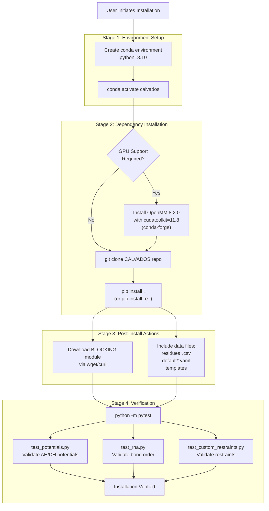
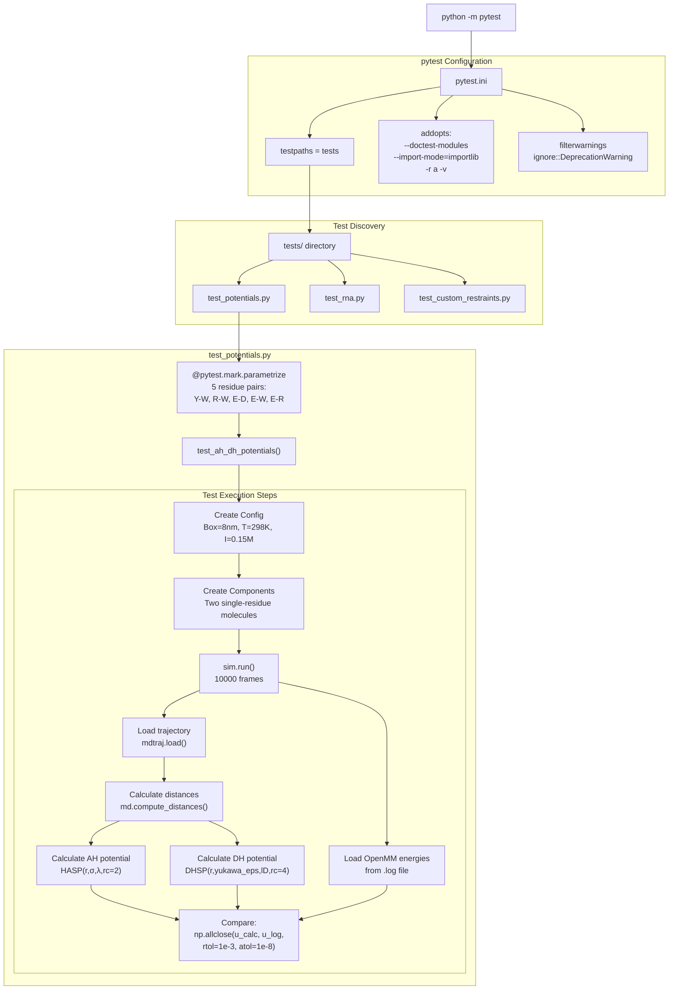

# Installation & Setup

<details>
<summary>Relevant source files</summary>

The following files were used as context for generating this wiki page:

- [README.md](README.md)
- [pytest.ini](pytest.ini)
- [setup.py](setup.py)
- [tests/data/residues_CALVADOS2.csv](tests/data/residues_CALVADOS2.csv)
- [tests/test_potentials.py](tests/test_potentials.py)

</details>


This document provides instructions for installing CALVADOS, configuring the runtime environment, and verifying the installation through automated tests. Installation involves creating a Python environment, installing dependencies (including OpenMM for molecular dynamics), and optionally configuring GPU acceleration.

For information about the overall system architecture and how modules interact, see [System Architecture](#1.2). For running your first simulation after installation, see [Quick Start Guide](#1.3).

---

## Overview of Installation Process

The CALVADOS installation follows a three-stage process: environment setup, dependency installation, and verification testing. The system requires Python 3.10 and relies on OpenMM as the core molecular dynamics engine.

**Installation Workflow**



**Sources:** [README.md:27-52](), [setup.py:4-10]()

---

## Prerequisites

CALVADOS requires the following system prerequisites:

| Requirement | Version/Specification | Notes |
|-------------|----------------------|-------|
| Operating System | Linux (POSIX) | Primary supported platform |
| Python | 3.10 | Specified in environment creation |
| conda/mamba | Latest stable | For environment management |
| git | Any recent version | For cloning repository |
| wget or curl | Standard | For downloading BLOCKING module |
| CUDA Toolkit | 11.8 (optional) | Only for GPU acceleration |

**Sources:** [README.md:29-36](), [setup.py:48-49]()

---

## Installation Steps

### Step 1: Create Conda Environment

Create an isolated Python environment with Python 3.10:

```bash
conda create -n calvados python=3.10
conda activate calvados
```

The environment name `calvados` is used by convention but can be customized.

**Sources:** [README.md:29-33]()

### Step 2: Install OpenMM (GPU Support - Optional)

For GPU-accelerated simulations, install OpenMM with CUDA support before installing CALVADOS. This step can be skipped for CPU-only usage:

```bash
conda install -c conda-forge openmm=8.2.0 cudatoolkit=11.8
```

This installs:
- `openmm` version 8.2.0 (required molecular dynamics engine)
- `cudatoolkit` version 11.8 (NVIDIA CUDA libraries)

If this step is skipped, `pip install` in Step 3 will install the CPU-only version of OpenMM.

**Sources:** [README.md:34-37](), [setup.py:26]()

### Step 3: Clone and Install CALVADOS

Clone the repository and install via pip:

```bash
git clone https://github.com/KULL-Centre/CALVADOS.git
cd CALVADOS
pip install .
```

For development installations that reflect source code changes without reinstallation:

```bash
pip install -e .
```

The `-e` flag creates an editable installation.

**Sources:** [README.md:38-44]()

---

## Dependency Architecture

The `setup.py` script defines all Python dependencies and their version constraints. During installation, the following actions occur:

**Dependency Installation Flow**

```mermaid
graph TB
    PIP["pip install ."]
    
    subgraph "setup.py Configuration"
        SETUP["setuptools.setup()"]
        PKG_FIND["find_packages()"]
        INSTALL_REQ["install_requires list"]
        PKG_DATA["package_data specification"]
    end
    
    subgraph "External Downloads"
        BLOCKING_MAIN["BLOCKING/main.py<br/>from fpesceKU/BLOCKING"]
        BLOCKING_TOOLS["BLOCKING/block_tools.py<br/>from fpesceKU/BLOCKING"]
    end
    
    subgraph "Core Dependencies"
        OPENMM["OpenMM 8.2.0<br/>MD Engine"]
        NUMPY["numpy 1.24<br/>Numerical Arrays"]
        PANDAS["pandas 2.1.1<br/>Data Structures"]
        MDANALYSIS["MDAnalysis 2.6.1<br/>Trajectory Analysis"]
        MDTRAJ["mdtraj 1.10<br/>Trajectory Processing"]
    end
    
    subgraph "Analysis & Scientific"
        NUMBA["numba 0.60<br/>JIT Compilation"]
        SCIPY["scipy 1.13<br/>Scientific Computing"]
        STATSMODELS["statsmodels 0.14<br/>Statistical Models"]
        LOCALCIDER["localcider 0.1.21<br/>IDP Analysis"]
    end
    
    subgraph "Utilities"
        BIOPYTHON["biopython 1.81<br/>Sequence Parsing"]
        JINJA2["Jinja2 3.1.2<br/>Template Rendering"]
        YAML["PyYAML 6.0<br/>Config Files"]
        MATPLOTLIB["matplotlib 3.8<br/>Plotting"]
        TQDM["tqdm 4.66<br/>Progress Bars"]
    end
    
    subgraph "Testing"
        PYTEST["pytest 8.3.3<br/>Test Framework"]
    end
    
    subgraph "Package Data"
        CSV_DATA["residues*.csv<br/>Force Field Parameters"]
        YAML_DATA["default*.yaml<br/>Config Templates"]
        TEMPLATES["templates/*<br/>Jinja2 Templates"]
    end
    
    PIP --> SETUP
    SETUP --> PKG_FIND
    SETUP --> INSTALL_REQ
    SETUP --> PKG_DATA
    
    SETUP -.wget/curl.-> BLOCKING_MAIN
    SETUP -.wget/curl.-> BLOCKING_TOOLS
    
    INSTALL_REQ --> OPENMM
    INSTALL_REQ --> NUMPY
    INSTALL_REQ --> PANDAS
    INSTALL_REQ --> MDANALYSIS
    INSTALL_REQ --> MDTRAJ
    INSTALL_REQ --> NUMBA
    INSTALL_REQ --> SCIPY
    INSTALL_REQ --> STATSMODELS
    INSTALL_REQ --> LOCALCIDER
    INSTALL_REQ --> BIOPYTHON
    INSTALL_REQ --> JINJA2
    INSTALL_REQ --> YAML
    INSTALL_REQ --> MATPLOTLIB
    INSTALL_REQ --> TQDM
    INSTALL_REQ --> PYTEST
    
    PKG_DATA --> CSV_DATA
    PKG_DATA --> YAML_DATA
    PKG_DATA --> TEMPLATES
```



**Sources:** [setup.py:12-51]()

### Key Dependencies

The table below lists critical dependencies and their roles in CALVADOS:

| Dependency | Version | Purpose |
|-----------|---------|---------|
| `OpenMM` | 8.2.0 | Core molecular dynamics simulation engine |
| `numpy` | 1.24 | Numerical array operations throughout codebase |
| `pandas` | 2.1.1 | Loading residue parameters from CSV files |
| `MDAnalysis` | 2.6.1 | Trajectory reading and analysis in `calvados.analysis` |
| `mdtraj` | 1.10 | Alternative trajectory processing and distance calculations |
| `numba` | 0.60 | JIT compilation for energy calculations in analysis |
| `scipy` | 1.13 | Scientific functions (optimization, special functions) |
| `biopython` | 1.81 | FASTA file parsing in `calvados.components` |
| `Jinja2` | 3.1.2 | Template rendering for config/component files |
| `PyYAML` | 6.0 | Reading/writing YAML configuration files |
| `localcider` | 0.1.21 | IDP sequence property calculations |
| `statsmodels` | 0.14 | Statistical modeling in analysis |
| `pytest` | 8.3.3 | Running test suite |

**Sources:** [setup.py:25-41]()

### External Module Download

During installation, `setup.py` downloads the BLOCKING module for block averaging error analysis:

```python
# From setup.py lines 4-10
subprocess.run(['wget','-O','calvados/BLOCKING/main.py','https://raw.githubusercontent.com/fpesceKU/BLOCKING/v0.1/main.py'])
subprocess.run(['wget','-O','calvados/BLOCKING/block_tools.py','https://raw.githubusercontent.com/fpesceKU/BLOCKING/v0.1/block_tools.py'])
```

This module is used by `calvados.analysis` for statistical error analysis of phase separation calculations.

**Sources:** [setup.py:4-10]()

### Package Data Inclusion

CALVADOS includes data files that are installed with the package:

| Data Category | File Pattern | Location | Purpose |
|--------------|--------------|----------|---------|
| Force Field Parameters | `residues*.csv` | `calvados/data/` | Per-residue parameters for different force fields |
| Default Configs | `default*.yaml` | `calvados/data/` | Template configuration files |
| Jinja2 Templates | `templates/*` | `calvados/data/templates/` | Config file generation templates |

**Sources:** [setup.py:44]()

---

## Verification Testing

After installation, run the test suite to verify correct installation and functionality:

```bash
python -m pytest
```

The pytest configuration is defined in `pytest.ini` with test discovery in the `tests/` directory.

**Sources:** [README.md:46-52](), [pytest.ini:1-15]()

### Test Structure

**Test Execution Workflow**



**Sources:** [pytest.ini:1-15](), [tests/test_potentials.py:1-127]()

### Test: Potential Energy Validation (`test_potentials.py`)

This test validates that the Ashbaugh-Hatch (AH) and Debye-Hückel (DH) potential implementations in OpenMM match analytical calculations.

**Test Methodology:**

1. **System Setup**: Creates a minimal two-residue system with specific residue pairs (Y-W, R-W, E-D, E-W, E-R)
2. **Simulation**: Runs 10,000 frame trajectory with 10-step saving interval
3. **Distance Extraction**: Uses `mdtraj.compute_distances()` to extract bead-bead distances
4. **Analytical Calculation**: Computes expected energies using mathematical formulas:
   - Ashbaugh-Hatch: `HASP(r,σ,λ,rc=2)` for hydrophobic interactions
   - Debye-Hückel: `DHSP(r,yukawa_eps,lD,rc=4)` for electrostatics
5. **Comparison**: Validates `np.allclose(u_calc, u_log, rtol=1e-3, atol=1e-8)`

**Key Parameters from Test:**

| Parameter | Value | Purpose |
|-----------|-------|---------|
| Box size | 8 nm | Cubic simulation box |
| Temperature | 298 K | Standard conditions |
| Ionic strength | 0.15 M | Physiological salt concentration |
| Frames | 10,000 | Trajectory length |
| AH cutoff | 2 nm | Ashbaugh-Hatch cutoff radius |
| DH cutoff | 4 nm | Debye-Hückel cutoff radius |
| Relative tolerance | 1e-3 | 0.1% accuracy requirement |
| Absolute tolerance | 1e-8 | Precision floor |

**Mathematical Formulas Used:**

The test implements the following potential energy functions:

```python
# From test_potentials.py lines 12-19
HALR = lambda r,s,l : 4*0.8368*l*((s/r)**12-(s/r)**6)
HASR = lambda r,s,l : 4*0.8368*((s/r)**12-(s/r)**6)+0.8368*(1-l)
HA = lambda r,s,l : np.where(r<2**(1/6)*s, HASR(r,s,l), HALR(r,s,l))
HASP = lambda r,s,l,rc : np.where(r<rc, HA(r,s,l)-HA(rc,s,l), 0)

DH = lambda r,yukawa_eps,lD : yukawa_eps*np.exp(-r/lD)/r
DHSP = lambda r,yukawa_eps,lD,rc : np.where(r<rc, DH(r,yukawa_eps,lD)-DH(rc,yukawa_eps,lD), 0)
```

**Sources:** [tests/test_potentials.py:11-127]()

### Test Data Requirements

The potential tests require specific input files:

| File | Location | Purpose |
|------|----------|---------|
| `residues_CALVADOS2.csv` | `tests/data/` | Force field parameters (σ, λ, q) for residues |
| `fastalib.fasta` | `tests/data/` | FASTA sequences for test residues |

The `residues_CALVADOS2.csv` file contains per-residue parameters:

```
one,three,MW,lambdas,sigmas,q,bondlength
R,ARG,156.19,0.730762476752,0.656,1,0.38
E,GLU,129.11,0.000693546096,0.592,-1,0.38
...
```

**Sources:** [tests/test_potentials.py:53-94](), [tests/data/residues_CALVADOS2.csv:1-22]()

### Other Tests

The test suite includes additional validation:

| Test File | Purpose |
|-----------|---------|
| `test_rna.py` | Validates bond order in RNA model (mentioned in README) |
| `test_custom_restraints.py` | Validates custom restraint functionality (mentioned in README) |

**Sources:** [README.md:52]()

---

## Verification Checklist

After installation, verify the following:

- [ ] `conda activate calvados` activates the environment without errors
- [ ] `python -c "import calvados"` imports successfully
- [ ] `python -c "import openmm"` imports OpenMM
- [ ] `python -m pytest` passes all tests (may take several minutes)
- [ ] For GPU installations: `python -c "import openmm; print(openmm.Platform.getPlatformByName('CUDA'))"` succeeds

---

## Common Installation Issues

### Issue: OpenMM GPU Platform Not Found

**Symptom:** Error when trying to use `platform = 'CUDA'` in simulations

**Solution:** Ensure CUDA-enabled OpenMM was installed via conda before pip install:
```bash
conda install -c conda-forge openmm=8.2.0 cudatoolkit=11.8
```

### Issue: BLOCKING Module Download Fails

**Symptom:** Installation completes but BLOCKING module missing

**Solution:** The `setup.py` script attempts both `wget` and `curl`. Ensure at least one is available:
```bash
# Check if wget or curl is available
which wget
which curl
```

Alternatively, manually download:
```bash
cd calvados/BLOCKING
wget https://raw.githubusercontent.com/fpesceKU/BLOCKING/v0.1/main.py
wget https://raw.githubusercontent.com/fpesceKU/BLOCKING/v0.1/block_tools.py
```

**Sources:** [setup.py:4-10]()

### Issue: Test Failures Due to Missing Data Files

**Symptom:** `test_potentials` fails with file not found errors

**Solution:** Ensure `pip install` included package data. Check that `calvados/data/` directory exists with CSV and YAML files. Reinstall if necessary:
```bash
pip install --force-reinstall .
```

**Sources:** [setup.py:44]()

---

## Post-Installation: Next Steps

After successful installation and verification:

1. **Explore Examples**: Navigate to `examples/` directory to see different simulation types
2. **Read Quick Start**: See [Quick Start Guide](#1.3) for your first simulation
3. **Review Architecture**: See [System Architecture](#1.2) to understand module organization
4. **Configure Simulations**: See [Config Class](#2.1) and [Components Class](#2.2) for setup details

**Sources:** [README.md:25]()

---