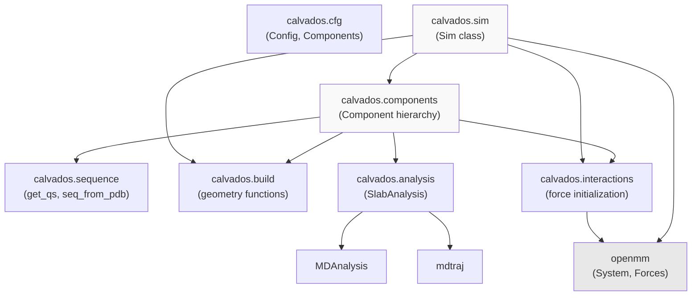
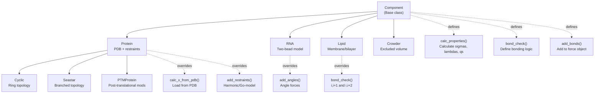
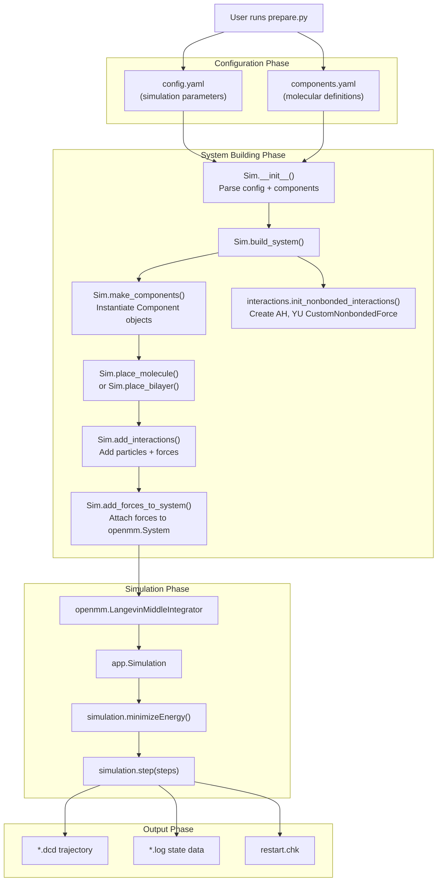
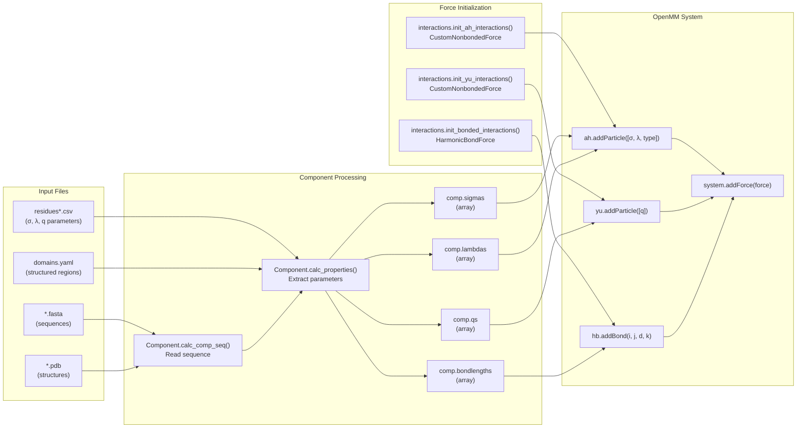
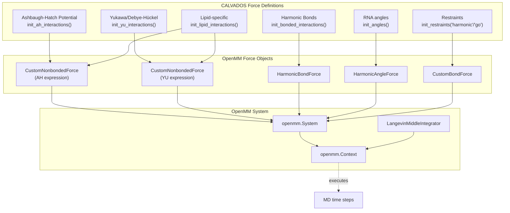
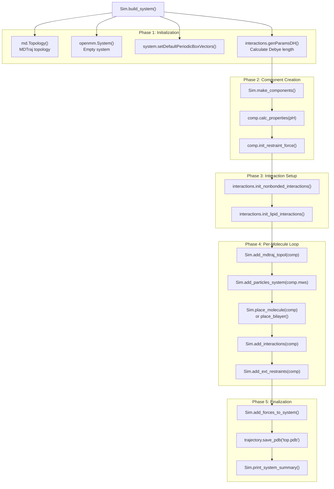
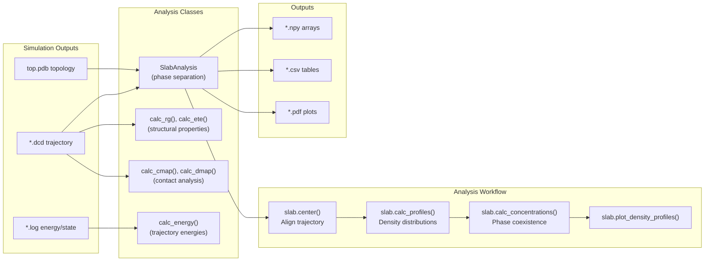

# System Architecture

<details>
<summary>Relevant source files</summary>

The following files were used as context for generating this wiki page:

- [calvados/__init__.py](calvados/__init__.py)
- [calvados/components.py](calvados/components.py)
- [calvados/sim.py](calvados/sim.py)
- [examples/single_MDP/input/TIA1.pdb](examples/single_MDP/input/TIA1.pdb)
- [examples/slab_IDR/example_slab_analysis.ipynb](examples/slab_IDR/example_slab_analysis.ipynb)

</details>


## Purpose and Scope

This document provides a high-level technical overview of the CALVADOS codebase architecture, describing how the core modules interact to enable coarse-grained molecular dynamics simulations. It covers the module structure, component type system, data flow, and integration patterns with OpenMM.

For step-by-step usage instructions, see [Quick Start Guide](#1.3). For detailed configuration parameters, see [Config Class](#2.1) and [Components Class](#2.2). For force field implementation details, see [Force Field & Interaction Potentials](#3.4).

---

## Module Organization

CALVADOS is organized into seven core modules, each with distinct responsibilities:

| Module | Primary Purpose | Key Classes/Functions |
|--------|----------------|----------------------|
| `calvados.cfg` | Configuration management | `Config`, `Components` |
| `calvados.components` | Molecular component definitions | `Component`, `Protein`, `RNA`, `Lipid`, `Crowder`, `Cyclic`, `Seastar`, `PTMProtein` |
| `calvados.sim` | Simulation orchestration | `Sim`, `run()` |
| `calvados.sequence` | Sequence-derived properties | `get_qs()`, `seq_from_pdb()`, `read_fasta()` |
| `calvados.build` | Geometry and placement | `build_spiral()`, `build_compact()`, `geometry_from_pdb()` |
| `calvados.interactions` | Force field initialization | `init_ah_interactions()`, `init_yu_interactions()`, `init_restraints()` |
| `calvados.analysis` | Post-simulation analysis | `SlabAnalysis`, structural property calculators |

**Sources:** [calvados/__init__.py:1-8]()

---

## Module Dependency Graph

The following diagram shows how modules depend on each other:



**Key observations:**
- `calvados.sim` serves as the main orchestrator, importing most other modules
- `calvados.components` depends on `sequence`, `build`, and `interactions` to construct molecular systems
- `calvados.cfg` is independent, only reading YAML configuration files
- External dependencies (OpenMM, MDAnalysis, mdtraj) are isolated to specific modules

**Sources:** [calvados/__init__.py:1-8](), [calvados/sim.py:1-18](), [calvados/components.py:1-3]()

---

## Component Type Hierarchy

CALVADOS uses a polymorphic component system where each molecular type inherits from a base `Component` class:



**Class instantiation pattern:**
The `Sim.make_components()` method acts as a factory, creating the appropriate subclass based on `molecule_type`:

```
if molecule_type == 'protein':
    comp = Protein(name, properties, defaults)
elif molecule_type == 'rna':
    comp = RNA(name, properties, defaults)
elif molecule_type in ['lipid', 'cooke_lipid']:
    comp = Lipid(name, properties, defaults)
...
```

**Sources:** [calvados/components.py:11-755](), [calvados/sim.py:50-99]()

---

## Simulation Execution Pipeline

The complete workflow from configuration to trajectory output:



**Key execution points:**

1. **Initialization** [calvados/sim.py:21-49](): Parse YAML files, set simulation parameters
2. **Component Creation** [calvados/sim.py:50-99](): Factory instantiation with pH-dependent calculations
3. **Force Initialization** [calvados/sim.py:145-165](): Create Ashbaugh-Hatch and Yukawa force objects
4. **Particle Placement** [calvados/sim.py:292-336](): Position molecules based on `topol` parameter
5. **System Assembly** [calvados/sim.py:225-264](): Attach all forces to `openmm.System`
6. **MD Integration** [calvados/sim.py:503-639](): Langevin dynamics with checkpoint/restart support

**Sources:** [calvados/sim.py:20-651]()

---

## Data Flow: Configuration to OpenMM System

This diagram shows how molecular definitions flow from input files through CALVADOS processing to OpenMM force objects:



**Per-particle data extraction:**
For each residue in a component's sequence, the following properties are extracted from `residues.csv`:
- `sigmas`: Lennard-Jones sigma (bead diameter)
- `lambdas`: Hydrophobicity scale (0-1)
- `MW`: Molecular weight for mass assignment
- `bondlength`: Equilibrium bond distance
- Charge is calculated via `get_qs()` with pH dependence

**Sources:** [calvados/components.py:32-55](), [calvados/sim.py:378-416](), [calvados/sequence.py]() (referenced in imports)

---

## Force Field Integration with OpenMM

CALVADOS implements a custom coarse-grained force field using OpenMM's `CustomNonbondedForce` and standard force objects:



**Force expressions:**
- **Ashbaugh-Hatch**: Modified Lennard-Jones with hydrophobicity scaling
  - Uses per-particle parameters: `[sigma, lambda, type]`
  - Type distinguishes proteins (1), lipids (0), crowders (-1)
- **Yukawa**: Screened electrostatics for ionic solutions
  - Uses per-particle parameters: `[q]` (charge)
  - Debye length (κ) is system-wide

**Exclusion handling:**
Bonded and restrained pairs are excluded from non-bonded interactions via `addExclusion()` calls in [calvados/sim.py:369-376]().

**Sources:** [calvados/interactions.py]() (module), [calvados/sim.py:145-165,225-264]()

---

## System Building Orchestration

The `Sim.build_system()` method coordinates all aspects of system construction:



**Loop iteration:**
The Phase 4 operations repeat for each molecule: `for cidx, comp in enumerate(self.components): for idx in range(comp.nmol):`

This nested loop ensures that:
1. Each copy of each component type gets added sequentially
2. Particle indices are tracked via `self.nparticles`
3. Exclusion maps are maintained correctly

**Sources:** [calvados/sim.py:130-223]()

---

## Molecule Placement Topologies

CALVADOS supports multiple initial placement strategies via the `topol` parameter:

| Topology | Description | Use Case | Implementation |
|----------|-------------|----------|----------------|
| `slab` | Dense slab in box center | Phase separation studies | `build.build_xyzgrid()` [calvados/sim.py:172-178]() |
| `grid` | Regular 3D grid | Multiple molecules | `build.build_xyzgrid()` [calvados/sim.py:179-180]() |
| `center` | Box center (single molecule) | Isolated protein | Direct assignment [calvados/sim.py:306-308]() |
| `shift_ref_bead` | Center specific bead | Aligned starting structure | Offset calculation [calvados/sim.py:309-312]() |
| `random` | Random non-overlapping | Equilibrated systems | `build.random_placement()` [calvados/sim.py:314]() |
| Bilayer | XY grid at box top/bottom | Membrane systems | `build.build_xygrid()` [calvados/sim.py:181-190]() |

**Placement coordinate calculation:**
Each component has `comp.xinit` (initial relative coordinates). The placement functions compute `xs = x0 + comp.xinit` where `x0` is the reference position for that topology type.

**Sources:** [calvados/sim.py:292-336](), [calvados/build.py]() (module)

---

## Analysis Module Integration

Post-simulation analysis is performed using the `calvados.analysis` module, which operates on trajectory files:



**SlabAnalysis workflow:**
The `SlabAnalysis` class implements a multi-stage pipeline for phase separation studies:

1. **Initialization**: Define reference chains (dense phase) and optional client chains
2. **Centering** [calvados/analysis.py]: Align slab center-of-mass to box center
3. **Profile calculation**: Compute density along z-axis
4. **Concentration extraction**: Fit profiles to identify dense/dilute phases
5. **Visualization**: Generate publication-quality plots

**Sources:** [examples/slab_IDR/example_slab_analysis.ipynb:1-131](), [calvados/analysis.py]() (module)

---

## Key Design Patterns

### 1. Factory Pattern
`Sim.make_components()` creates appropriate `Component` subclass instances based on `molecule_type` string.

**Rationale:** Enables extensibility—new molecule types can be added by creating new subclasses and updating the factory logic.

**Sources:** [calvados/sim.py:50-99]()

### 2. Template Method Pattern
`Component.calc_properties()` defines the overall algorithm, calling overridable methods like `calc_comp_seq()`, `calc_x_from_pdb()`.

**Rationale:** Shared logic for parameter extraction while allowing subclass-specific customization.

**Sources:** [calvados/components.py:43-55,168-189]()

### 3. Strategy Pattern
Different bonding topologies via `bond_check()` override: `Protein` (i, i+1), `Cyclic` (i, i+1 plus wrap-around), `Lipid` (i, i+1 and i, i+2).

**Rationale:** Bonding logic varies dramatically by molecule type—strategy pattern encapsulates this variation.

**Sources:** [calvados/components.py:211-216,684-690,609-613]()

### 4. Separation of Concerns
- `calvados.cfg`: Configuration I/O only
- `calvados.sequence`: Pure sequence analysis functions
- `calvados.build`: Geometry calculations
- `calvados.interactions`: Force object creation
- `calvados.sim`: Orchestration only

**Rationale:** Each module has a single, well-defined responsibility, improving maintainability and testing.

### 5. Dependency Injection
`Component.__init__()` receives both specific `properties` and shared `defaults` dictionaries, merging them.

**Rationale:** Allows system-wide defaults to be overridden per-component without tight coupling.

**Sources:** [calvados/components.py:14-24]()

---

## File Organization Summary

```
calvados/
├── __init__.py          # Module imports
├── cfg.py               # Config, Components classes (YAML I/O)
├── components.py        # Component hierarchy (8 classes)
├── sim.py               # Sim class (orchestration)
├── sequence.py          # Sequence analysis utilities
├── build.py             # Geometry and placement functions
├── interactions.py      # Force initialization functions
├── analysis.py          # Post-simulation analysis
└── utilities.py         # Helper functions

examples/
├── single_IDR/          # IDR simulation workflow
├── single_MDP/          # Structured protein workflow
├── slab_IDR/            # Phase separation workflow
├── single_RNA/          # RNA simulation workflow
└── ...                  # Additional example types
```

Each example directory typically contains:
- `prepare.py`: Configuration generation script
- `config.yaml`: Generated simulation parameters
- `components.yaml`: Generated molecular definitions
- Analysis notebooks (optional)

**Sources:** Repository structure

---