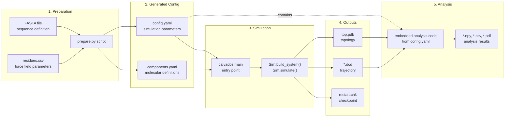
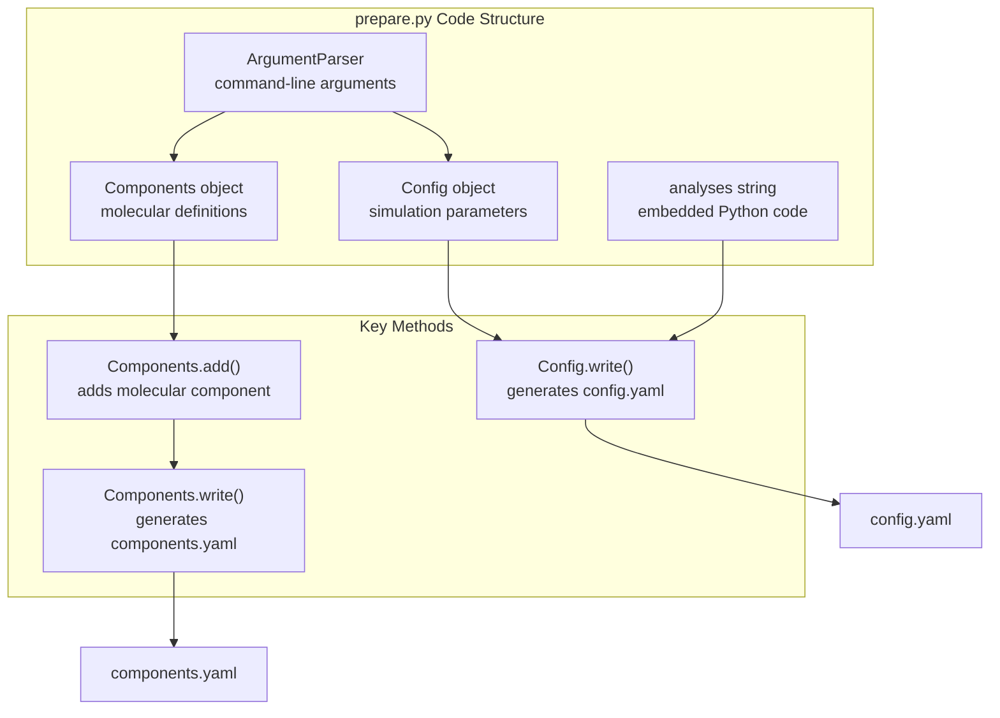
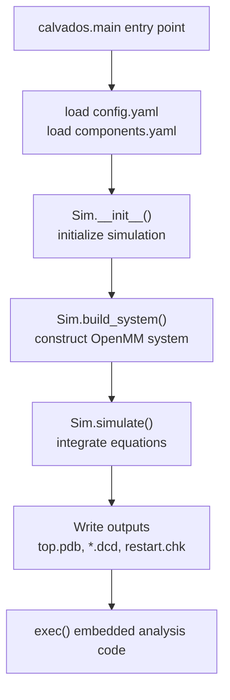
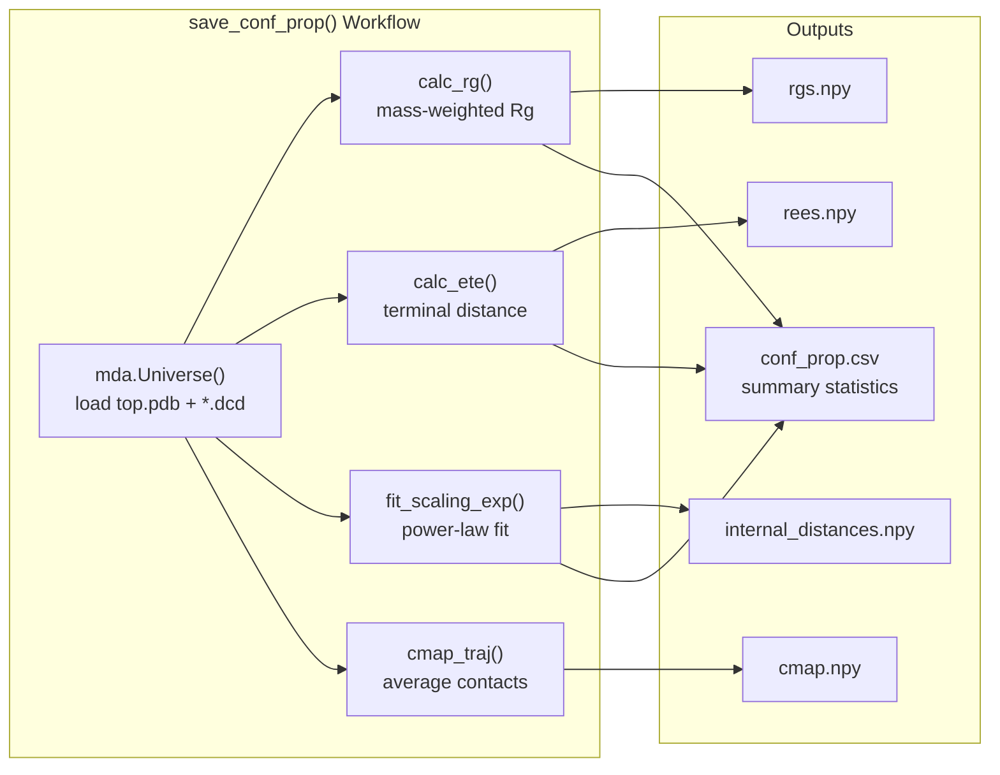
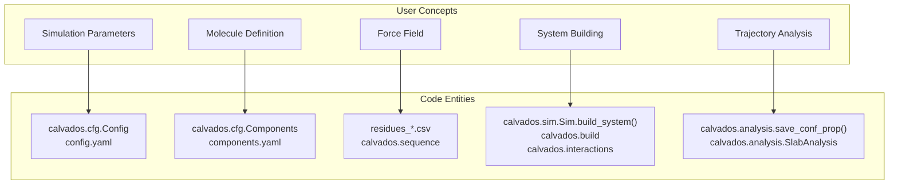
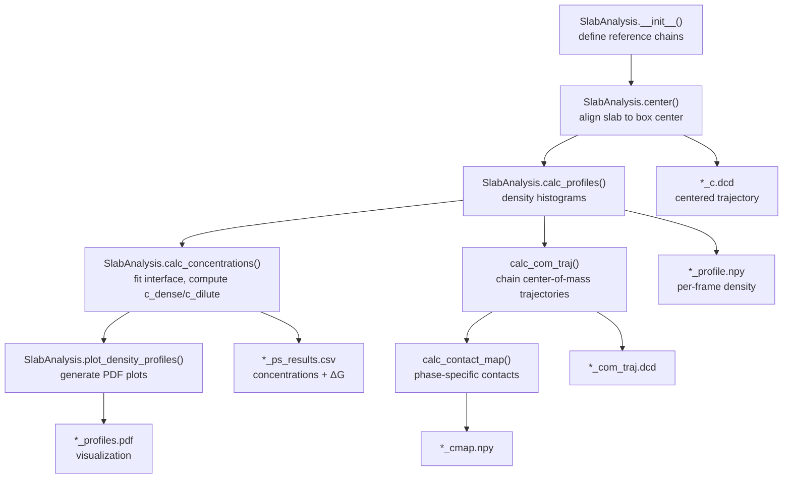

# Quick Start Guide

<details>
<summary>Relevant source files</summary>

The following files were used as context for generating this wiki page:

- [calvados/analysis.py](calvados/analysis.py)
- [examples/single_IDR/prepare.py](examples/single_IDR/prepare.py)
- [examples/single_MDP/prepare.py](examples/single_MDP/prepare.py)
- [examples/slab_IDR/prepare.py](examples/slab_IDR/prepare.py)
- [examples/slab_MDP/prepare.py](examples/slab_MDP/prepare.py)

</details>


## Purpose and Scope

This guide demonstrates the complete workflow for preparing, running, and analyzing a CALVADOS simulation. It covers the essential steps from defining input files to obtaining analysis results, using a single intrinsically disordered region (IDR) as a minimal working example.

For detailed information about specific components:
- Configuration parameters: see [Configuration File Reference](#9.1)
- Component definitions: see [Component Configuration Reference](#9.2)
- Simulation execution details: see [Running Simulations](#4)
- Analysis methods: see [Trajectory Analysis](#5)

## Workflow Overview

The CALVADOS workflow follows a three-stage pipeline: preparation → simulation → analysis.



**Sources:** [calvados/analysis.py:388-416](), [examples/single_IDR/prepare.py:1-74]()

## Step 1: Prepare Input Files

### Required Input Files

| File | Purpose | Example Location |
|------|---------|------------------|
| `*.fasta` | Amino acid sequence | `input/idr.fasta` |
| `residues_*.csv` | Force field parameters | `input/residues_CALVADOS2.csv` |

The FASTA file contains the amino acid sequence:
```
>my_protein
MADEEKTEEEKAKEAAAKEEAAKEEAAEKEAAKQEEAAK
```

The `residues_*.csv` file defines per-residue force field parameters (σ, λ, q, MW, bondlength). CALVADOS includes several variants:
- `residues_CALVADOS2.csv` - Standard protein force field
- `residues_CALVADOS3.csv` - Updated force field for structured proteins
- `residues_C2RNA.csv` - Protein-RNA interactions
- `residues_pCALVADOS2.csv` - pH-dependent charges

**Sources:** [examples/single_IDR/prepare.py:24](), [examples/single_IDR/prepare.py:68]()

## Step 2: Create Preparation Script

The `prepare.py` script generates configuration files by instantiating `Config` and `Components` objects.



**Sources:** [examples/single_IDR/prepare.py:1-74]()

### Config Object: Simulation Parameters

The `Config` object defines simulation box, thermodynamics, and runtime settings:

```python
config = Config(
  sysname = 'my_protein',
  box = [50, 50, 50],        # nm
  temp = 293.15,             # K
  ionic = 0.19,              # M
  topol = 'center',          # molecule placement
  wfreq = 7000,              # trajectory saving interval
  steps = 1010 * 7000,       # total simulation steps
  platform = 'CPU',          # or 'CUDA'
  restart = 'checkpoint',    # restart mode
)
```

**Sources:** [examples/single_IDR/prepare.py:26-43]()

### Components Object: Molecular Definitions

The `Components` object defines molecules and their properties:

```python
components = Components(
  molecule_type = 'protein',
  nmol = 1,
  restraint = False,
  charge_termini = 'both',
  fresidues = 'input/residues_CALVADOS2.csv',
  ffasta = 'input/idr.fasta',
)

components.add(name='my_protein')
```

The `add()` method registers a component with the specified name, which must match a sequence ID in the FASTA file.

**Sources:** [examples/single_IDR/prepare.py:59-73]()

### Embedded Analysis Code

The `Config.write()` method accepts an `analyses` parameter containing Python code to execute after simulation:

```python
analyses = f"""
from calvados.analysis import save_conf_prop

save_conf_prop(path="{path}",name="{sysname}",
  residues_file="{residues_file}",
  output_path="data",start=10,is_idr=True,select='all')
"""

config.write(path, name='config.yaml', analyses=analyses)
```

This code is embedded in `config.yaml` and executed post-simulation to calculate structural properties (Rg, Ree, ν, contact maps).

**Sources:** [examples/single_IDR/prepare.py:50-57]()

## Step 3: Execute Preparation Script

Run the preparation script to generate configuration files:

```bash
python prepare.py --name my_protein
```

This creates:
- `my_protein/config.yaml` - Simulation parameters
- `my_protein/components.yaml` - Component definitions

**Sources:** [examples/single_IDR/prepare.py:8-10]()

## Step 4: Run Simulation



**Sources:** [calvados/analysis.py:388-416]()

### Simulation Execution Commands

Execute the simulation from the directory containing `my_protein/`:

```bash
# Option 1: Using calvados command-line tool
calvados my_protein

# Option 2: Using Python module
python -m calvados my_protein
```

The simulation engine reads `config.yaml` and `components.yaml`, builds the OpenMM system via `Sim.build_system()`, and executes molecular dynamics via `Sim.simulate()`.

### Generated Output Files

| File | Description |
|------|-------------|
| `my_protein/top.pdb` | System topology with atom coordinates |
| `my_protein/my_protein.dcd` | Binary trajectory (DCD format) |
| `my_protein/restart.chk` | Checkpoint for restart |
| `my_protein/my_protein.log` | Energy and state log |

**Sources:** [examples/single_IDR/prepare.py:46-48]()

## Step 5: Analysis Execution

After simulation completes, the embedded analysis code executes automatically. The `save_conf_prop()` function calculates:

| Property | Symbol | Calculation Method |
|----------|--------|-------------------|
| Radius of gyration | Rg | `calc_rg()` with mass weighting |
| End-to-end distance | Ree | `calc_ete()` between terminal residues |
| Scaling exponent | ν | `fit_scaling_exp()` from distance map |
| Contact map | cmap | `cmap_traj()` with sigmoidal contacts |



**Sources:** [calvados/analysis.py:388-416]()

### Analysis Output Files

All analysis outputs are written to the `data/` directory:

| File | Content | Format |
|------|---------|--------|
| `rgs.npy` | Per-frame radius of gyration | NumPy array |
| `rees.npy` | Per-frame end-to-end distance | NumPy array |
| `internal_distances.npy` | Sequence separation vs. distance | NumPy arrays [ij, dij] |
| `cmap.npy` | Time-averaged contact map | NumPy 2D array |
| `conf_prop.csv` | Summary statistics with errors | CSV table |

The `conf_prop.csv` file contains mean values and block-averaged standard errors:

```
,value,error
Rg,2.45,0.03
Ree,8.12,0.15
nu,0.52,0.01
```

**Sources:** [calvados/analysis.py:388-416](), [examples/single_IDR/prepare.py:54]()

## Code Entity Mapping

This diagram maps user-facing concepts to specific code entities:



**Sources:** [examples/single_IDR/prepare.py:1-74]()

## Phase Separation Example

For slab simulations studying liquid-liquid phase separation, the workflow is similar but uses different topology and analysis:

### Differences from Single-Molecule Workflow

| Aspect | Single IDR | Slab LLPS |
|--------|------------|-----------|
| `topol` | `'center'` | `'slab'` |
| `nmol` | 1 | 100 |
| Box dimensions | Cubic (50×50×50) | Elongated (15×15×150) |
| Analysis | `save_conf_prop()` | `SlabAnalysis` |
| Special equilibration | None | `slab_eq=True` |

**Sources:** [examples/slab_IDR/prepare.py:21-43](), [examples/single_IDR/prepare.py:26-43]()

### Slab Analysis Workflow



**Sources:** [calvados/analysis.py:417-791](), [examples/slab_IDR/prepare.py:51-64]()

## Next Steps

After completing this quick start:

1. **Explore different simulation types**: See [Example Workflows](#7) for tutorials on structured proteins, RNA, phase separation, and crowding effects.

2. **Customize force field parameters**: See [Force Field & Interaction Potentials](#3.4) for details on the Ashbaugh-Hatch and Yukawa potentials.

3. **Add restraints**: See [Restraints System](#3.5) for harmonic and Go-model restraints on structured regions.

4. **Use different analysis methods**: See [Trajectory Analysis](#5) for contact analysis, energy calculations, and structural properties beyond the quick start.

5. **Run on GPU**: Modify `platform='CUDA'` in `Config` and specify `gpu_id` for GPU acceleration.

**Sources:** [examples/single_IDR/prepare.py:1-74](), [examples/slab_IDR/prepare.py:1-84]()

---