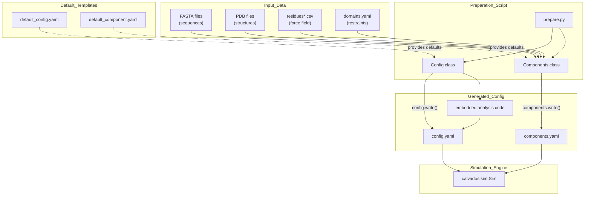
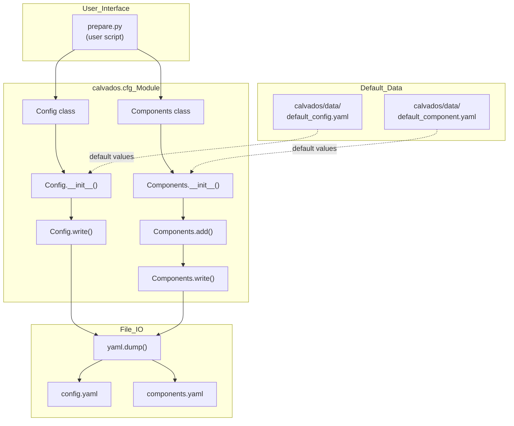
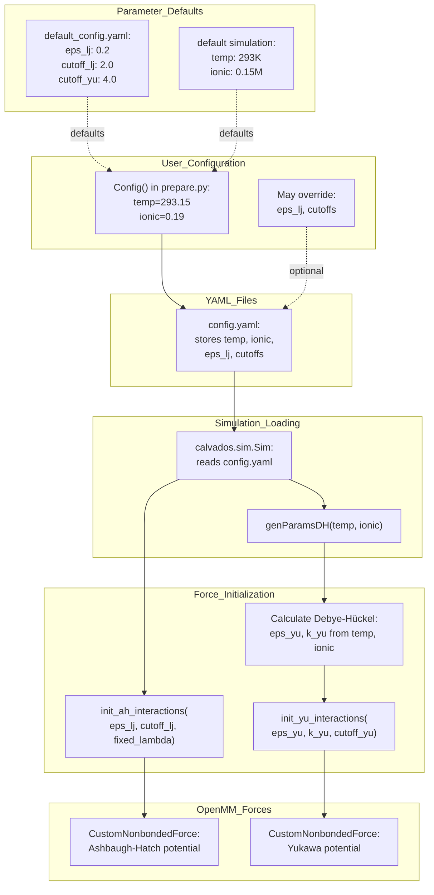

# Simulation Setup & Configuration

<details>
<summary>Relevant source files</summary>

The following files were used as context for generating this wiki page:

- [calvados/data/default_component.yaml](calvados/data/default_component.yaml)
- [calvados/data/default_config.yaml](calvados/data/default_config.yaml)
- [calvados/interactions.py](calvados/interactions.py)
- [examples/single_IDR/prepare.py](examples/single_IDR/prepare.py)
- [examples/single_MDP/prepare.py](examples/single_MDP/prepare.py)

</details>


This page provides an overview of the configuration system in CALVADOS, explaining how simulations are set up using the `Config` and `Components` classes to generate YAML configuration files. The configuration system is a two-layer architecture that separates simulation parameters (box size, temperature, runtime) from molecular definitions (sequences, restraints, force field parameters).

For detailed documentation of specific configuration options, see:
- [Config Class - Simulation Parameters](#2.1) for box dimensions, temperature, ionic strength, and runtime settings
- [Components Class - Molecular Definitions](#2.2) for defining molecules, sequences, and restraints
- [Preparation Scripts](#2.3) for writing `prepare.py` scripts that generate configurations
- [Input Data Files](#2.4) for formats of residue parameters, FASTA files, PDB structures, and restraint definitions

For information about how configurations are consumed during simulation execution, see [Sim Class & System Building](#4.1).

## Overview of the Configuration System

CALVADOS uses a **declarative configuration approach** where users define simulation parameters and molecular components in Python scripts (`prepare.py`), which then generate YAML files consumed by the simulation engine. This design separates the specification phase from the execution phase, enabling reproducibility and batch job submission.

The configuration system consists of four main components:

| Component | Purpose | Output |
|-----------|---------|--------|
| `calvados.cfg.Config` | Simulation parameters (box, temperature, runtime) | `config.yaml` |
| `calvados.cfg.Components` | Molecular definitions (sequences, restraints) | `components.yaml` |
| `prepare.py` scripts | User-facing interface for configuration generation | Both YAML files |
| Default templates | Baseline parameter values | `default_config.yaml`, `default_component.yaml` |

**Sources:** [calvados/data/default_config.yaml:1-40](), [calvados/data/default_component.yaml:1-37](), [examples/single_MDP/prepare.py:1-80](), [examples/single_IDR/prepare.py:1-75]()

## Configuration Workflow

The following diagram illustrates the complete workflow from input data to generated configuration files:



**Workflow Stages:**

1. **Input Data Collection**: User provides molecular data (FASTA sequences, PDB structures) and force field parameters
2. **Configuration Generation**: `prepare.py` script instantiates `Config` and `Components` objects with user-specified parameters
3. **YAML Writing**: Configuration objects generate YAML files in the simulation directory
4. **Simulation Execution**: `calvados.sim.Sim` reads YAML files and constructs the OpenMM system

**Sources:** [examples/single_MDP/prepare.py:1-80](), [examples/single_IDR/prepare.py:1-75]()

## The Two-File Configuration System

CALVADOS separates configuration into two distinct YAML files with different responsibilities:

### config.yaml: Simulation-Level Parameters

This file defines system-wide settings that apply to the entire simulation:

| Parameter Category | Examples | Default Source |
|-------------------|----------|----------------|
| System Geometry | `box`, `topol` (center/grid/slab) | user-specified |
| Thermodynamics | `temp`, `ionic`, `pH` | user-specified |
| Force Field | `eps_lj`, `cutoff_lj`, `cutoff_yu`, `fixed_lambda` | [default_config.yaml:5-8]() |
| Runtime | `steps`, `wfreq`, `platform`, `threads` | [default_config.yaml:10-13]() |
| Equilibration | `slab_eq`, `box_eq`, `pressure_coupling` | [default_config.yaml:19-26]() |
| Restraints | `custom_restraints`, `fcustom_restraints` | [default_config.yaml:38-40]() |

Example `config.yaml` generation:
```python
config = Config(
    sysname = 'myprotein',
    box = [50, 50, 50],  # nm
    temp = 293.15,        # K
    ionic = 0.19,         # molar
    topol = 'center',
    steps = 10000000,
    wfreq = 10000,
    platform = 'CPU'
)
config.write(path, name='config.yaml')
```

**Sources:** [examples/single_IDR/prepare.py:26-43](), [calvados/data/default_config.yaml:1-40]()

### components.yaml: Molecular-Level Parameters

This file defines individual molecular components and their properties:

| Parameter Category | Examples | Default Source |
|-------------------|----------|----------------|
| Component Type | `molecule_type` (protein/RNA/lipid) | [default_component.yaml:2]() |
| Copy Number | `nmol` | [default_component.yaml:3]() |
| Input Files | `ffasta`, `fresidues`, `pdb_folder` | user-specified |
| Restraints | `restraint`, `restraint_type`, `k_harmonic` | [default_component.yaml:10-14]() |
| AlphaFold Integration | `colabfold`, `pae_shift`, `pae_width` | [default_component.yaml:20-24]() |
| RNA Parameters | `rna_kb1`, `rna_ka`, `rna_nb_sigma` | [default_component.yaml:26-32]() |

Example `components.yaml` generation:
```python
components = Components(
    molecule_type = 'protein',
    nmol = 1,
    restraint = True,
    fresidues = 'residues_CALVADOS3.csv',
    pdb_folder = 'input',
    restraint_type = 'harmonic',
    k_harmonic = 700.
)
components.add(name='myprotein')
components.write(path, name='components.yaml')
```

**Sources:** [examples/single_MDP/prepare.py:60-78](), [calvados/data/default_component.yaml:1-37]()

## Configuration Classes: Code-Level Architecture

The following diagram maps the configuration workflow to actual code entities:



**Key Code Entities:**

- **`calvados.cfg.Config`**: Class that holds simulation-level parameters. Initialized with keyword arguments that override defaults from [default_config.yaml:1-40]()
- **`Config.write(path, name, analyses='')`**: Serializes configuration to YAML, optionally embedding analysis code
- **`calvados.cfg.Components`**: Class that holds molecular component definitions. Uses a builder pattern where defaults are set in `__init__()` and individual molecules added via `add()`
- **`Components.add(name)`**: Registers a molecular component with the given name, reading associated input files
- **`Components.write(path, name)`**: Serializes all added components to YAML

**Sources:** [examples/single_MDP/prepare.py:26-78](), [examples/single_IDR/prepare.py:26-73]()

## Preparation Script Structure

Preparation scripts follow a standard pattern across different simulation types:

```mermaid
graph TB
    subgraph "Script_Structure"
        IMPORTS["Import modules:<br/>calvados.cfg.Config<br/>calvados.cfg.Components"]
        ARGS["Parse command-line arguments:<br/>ArgumentParser"]
        PARAMS["Define simulation parameters:<br/>box size, frames, save interval"]
        RESIDUES["Specify residue file:<br/>residues_CALVADOS2.csv<br/>residues_CALVADOS3.csv"]
        CONFIG["Instantiate Config:<br/>system geometry, temperature,<br/>runtime settings"]
        MKDIR["Create directories:<br/>simulation path, data output"]
        ANALYSIS["Define embedded analysis:<br/>Python code as string"]
        WRITE_CFG["Write config.yaml:<br/>config.write()"]
        COMPONENTS["Instantiate Components:<br/>molecule type, restraints,<br/>input files"]
        ADD_COMP["Add molecular components:<br/>components.add()"]
        WRITE_COMP["Write components.yaml:<br/>components.write()"]
    end
    
    IMPORTS --> ARGS
    ARGS --> PARAMS
    PARAMS --> RESIDUES
    RESIDUES --> CONFIG
    CONFIG --> MKDIR
    MKDIR --> ANALYSIS
    ANALYSIS --> WRITE_CFG
    WRITE_CFG --> COMPONENTS
    COMPONENTS --> ADD_COMP
    ADD_COMP --> WRITE_COMP
```



**Standard Pattern:**

1. **Argument Parsing**: Use `ArgumentParser` to accept simulation-specific parameters [examples/single_MDP/prepare.py:8-10]()
2. **Parameter Definition**: Set box size, number of frames, save intervals [examples/single_MDP/prepare.py:16-22]()
3. **Config Creation**: Instantiate `Config` with system parameters [examples/single_MDP/prepare.py:26-44]()
4. **Directory Setup**: Create simulation and output directories using `subprocess` [examples/single_MDP/prepare.py:47-49]()
5. **Analysis Embedding**: Define post-simulation analysis as Python string [examples/single_MDP/prepare.py:51-56]()
6. **Config Writing**: Call `config.write()` with embedded analysis [examples/single_MDP/prepare.py:58]()
7. **Components Creation**: Instantiate `Components` with molecular definitions [examples/single_MDP/prepare.py:60-75]()
8. **Component Addition**: Call `components.add()` for each molecule [examples/single_MDP/prepare.py:76]()
9. **Components Writing**: Call `components.write()` [examples/single_MDP/prepare.py:78]()

**Sources:** [examples/single_MDP/prepare.py:1-80](), [examples/single_IDR/prepare.py:1-75]()

## Configuration Parameter Flow

The following diagram shows how parameters flow from defaults through user specification to force field initialization:



**Parameter Transformation Pipeline:**

1. **Default Values**: Baseline parameters from [default_config.yaml:5-8]()
2. **User Override**: `Config()` constructor accepts keyword arguments to override defaults
3. **YAML Serialization**: Parameters written to `config.yaml`
4. **Simulation Loading**: `calvados.sim.Sim` reads YAML files
5. **Physical Calculations**: Temperature and ionic strength converted to Bjerrum length and Debye length via `genParamsDH()` [calvados/interactions.py:4-15]()
6. **Force Initialization**: 
   - `init_ah_interactions()` creates Ashbaugh-Hatch force [calvados/interactions.py:26-44]()
   - `init_yu_interactions()` creates Yukawa electrostatics [calvados/interactions.py:46-60]()
7. **OpenMM System**: Force objects added to `openmm.System`

**Sources:** [calvados/interactions.py:4-60](), [calvados/data/default_config.yaml:5-8]()

## Configuration Patterns by Simulation Type

Different simulation types use different configuration patterns:

### Single IDR (Intrinsically Disordered Region)

**Characteristics:**
- No restraints
- Small box (50 nm)
- CALVADOS2 force field
- Center topology

**Key Configuration:**
```python
config = Config(
    topol = 'center',
    box = [50, 50, 50]
)
components = Components(
    restraint = False,
    fresidues = 'residues_CALVADOS2.csv',
    ffasta = 'idr.fasta'
)
```

**Sources:** [examples/single_IDR/prepare.py:26-73]()

### Single Structured Protein (MDP)

**Characteristics:**
- Harmonic or Go-model restraints
- Larger box (120+ nm)
- CALVADOS3 force field
- PDB input required
- Domains file for structured regions

**Key Configuration:**
```python
config = Config(
    topol = 'center',
    box = [123, 123, 123]
)
components = Components(
    restraint = True,
    restraint_type = 'harmonic',
    k_harmonic = 700.,
    fresidues = 'residues_CALVADOS3.csv',
    pdb_folder = 'input',
    fdomains = 'domains.yaml',
    colabfold = 1  # AlphaFold PAE format
)
```

**Sources:** [examples/single_MDP/prepare.py:26-78]()

### Slab Topology (Phase Separation)

**Characteristics:**
- Slab topology for liquid-liquid phase separation
- Slab equilibration mode
- Reference and client molecules
- Specialized analysis (SlabAnalysis)

**Key Configuration:**
```python
config = Config(
    topol = 'slab',
    slab_eq = True,
    slab_width = 100,
    slab_outer = 40,
    box = [L, L, L_slab]
)
```

For slab simulations, see detailed documentation at [Slab Simulation for Phase Separation](#7.3).

**Sources:** [calvados/data/default_config.yaml:19-32]()

## Embedded Analysis Code

A unique feature of the CALVADOS configuration system is the ability to embed analysis code directly in `config.yaml`:

```python
analyses = f"""
from calvados.analysis import save_conf_prop

save_conf_prop(
    path="{path:s}",
    name="{sysname:s}",
    residues_file="{residues_file:s}",
    output_path="data",
    start=10,
    is_idr=True,
    select='all'
)
"""

config.write(path, name='config.yaml', analyses=analyses)
```

This **deferred execution pattern** allows:
- Analysis specification at configuration time
- Analysis execution after simulation completion
- Analysis code versioning with simulation setup
- Batch processing of multiple simulations with consistent analysis

The embedded code is executed when the simulation completes (or manually later), with access to trajectory files and system parameters.

**Sources:** [examples/single_IDR/prepare.py:50-57](), [examples/single_MDP/prepare.py:51-58]()

## Summary: Configuration System Design Principles

The CALVADOS configuration system follows several key design principles:

| Principle | Implementation | Benefit |
|-----------|---------------|---------|
| **Separation of Concerns** | Two-file system (config vs components) | Independent modification of system vs molecular parameters |
| **Declarative Specification** | YAML configuration files | Human-readable, version-controllable, reproducible |
| **Default + Override** | Base templates with user overrides | Sensible defaults, minimal required specification |
| **Deferred Execution** | Embedded analysis code | Couples analysis specification with simulation setup |
| **Type Polymorphism** | Component type system | Unified interface for proteins, RNA, lipids, crowders |
| **Parameter Validation** | Default templates define schema | Catch configuration errors before expensive simulation |

For detailed documentation of specific configuration options, see the child pages [Config Class](#2.1), [Components Class](#2.2), [Preparation Scripts](#2.3), and [Input Data Files](#2.4).

---