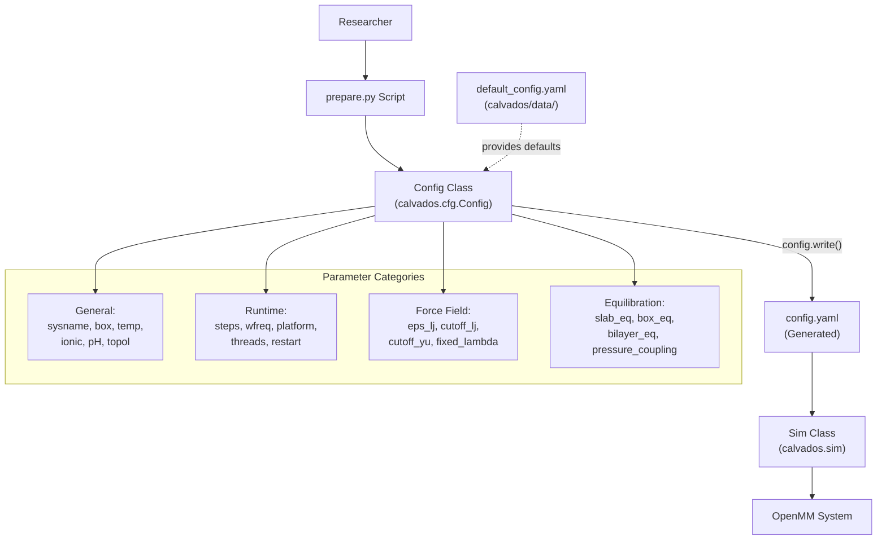
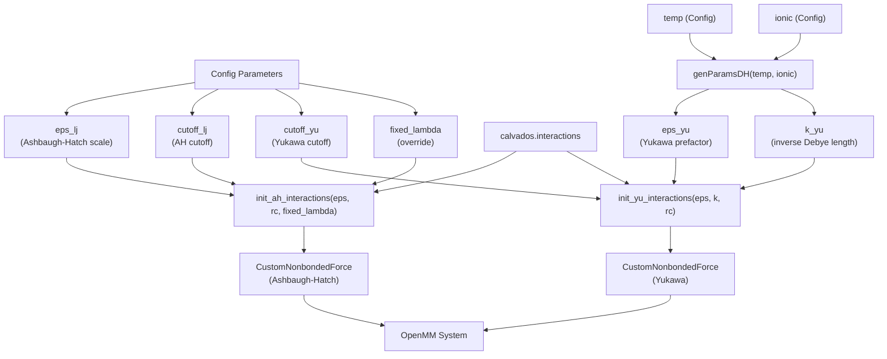
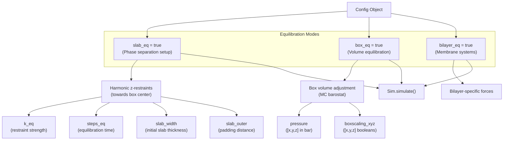
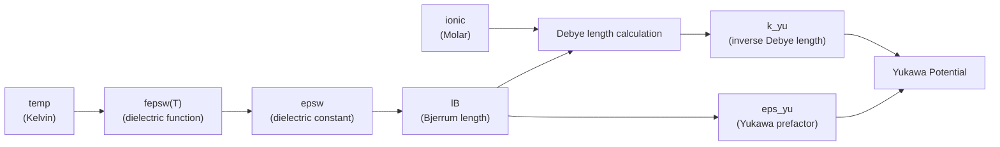
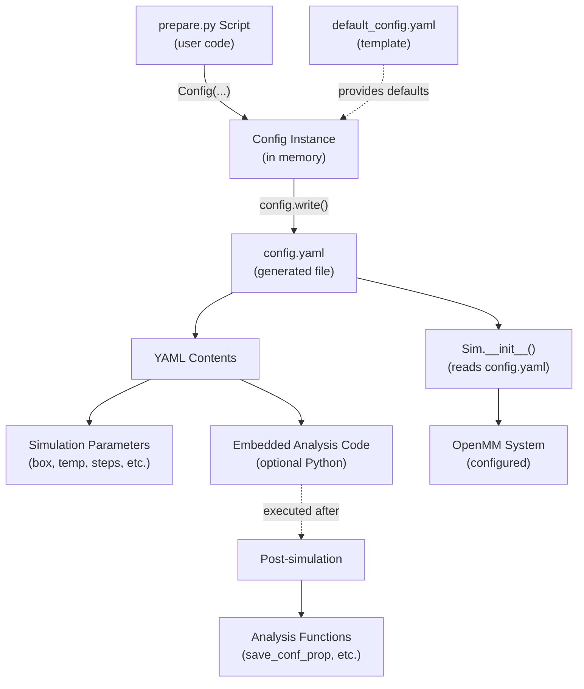

# Config Class - Simulation Parameters

<details>
<summary>Relevant source files</summary>

The following files were used as context for generating this wiki page:

- [calvados/data/default_config.yaml](calvados/data/default_config.yaml)
- [calvados/interactions.py](calvados/interactions.py)
- [examples/single_IDR/prepare.py](examples/single_IDR/prepare.py)
- [examples/single_MDP/prepare.py](examples/single_MDP/prepare.py)

</details>


## Purpose and Scope

This document describes the `Config` class in the `calvados.cfg` module, which defines all simulation parameters for CALVADOS molecular dynamics runs. The Config class is instantiated in `prepare.py` scripts and generates `config.yaml` files that control box geometry, thermodynamic conditions, runtime behavior, equilibration protocols, and force field settings.

For information about defining molecular components and sequences, see [Components Class - Molecular Definitions](#2.2). For details on writing preparation scripts that instantiate Config objects, see [Preparation Scripts (prepare.py)](#2.3).

---

## Config Class Workflow

The Config class serves as the primary interface for specifying simulation parameters. It follows a prepare-write-execute pattern where users instantiate Config objects with custom parameters, write them to YAML files, and the simulation engine reads these files at runtime.

### Workflow Diagram



**Sources**: [calvados/data/default_config.yaml:1-40](), [examples/single_IDR/prepare.py:26-43](), [examples/single_MDP/prepare.py:26-44]()

---

## General Simulation Parameters

These parameters define the basic simulation system and thermodynamic conditions.

| Parameter | Type | Default | Description |
|-----------|------|---------|-------------|
| `sysname` | string | `'default_simulation'` | Unique identifier for simulation system |
| `box` | list[float] | None | Box dimensions [x, y, z] in nanometers |
| `topol` | string | `'center'` | Initial molecule placement strategy |
| `temp` | float | None | Temperature in Kelvin |
| `ionic` | float | None | Ionic strength in molar |
| `pH` | float | None | pH value (used for pCALVADOS2) |

### Box Dimensions

The `box` parameter defines a rectangular simulation box with periodic boundary conditions. Box size affects system density and should be chosen based on molecule size and desired concentration. 

**Example from single_IDR**:
```python
config = Config(
    sysname = 'my_idr_sim',
    box = [50, 50, 50],  # nm
    temp = 293.15,        # K
    ionic = 0.19,         # M
    pH = 7.5,
    topol = 'center',
)
```

**Sources**: [examples/single_IDR/prepare.py:26-33](), [examples/single_MDP/prepare.py:26-34](), [calvados/data/default_config.yaml:2-3]()

### Topology Placement Strategies

The `topol` parameter controls initial molecule placement. Common values include:
- `'center'`: Place molecule(s) at box center
- `'grid'`: Arrange molecules on a 3D grid
- `'slab'`: Create slab geometry for phase separation studies
- `'random'`: Random placement

For details on placement algorithms, see [Molecule Placement Strategies](#4.2).

**Sources**: [calvados/data/default_config.yaml:3]()

---

## Runtime Settings

Runtime parameters control simulation duration, output frequency, and computational platform selection.

| Parameter | Type | Default | Description |
|-----------|------|---------|-------------|
| `steps` | int | 100000000 | Total integration steps (1 step = 10 fs) |
| `wfreq` | int | 100000 | DCD trajectory writing frequency (steps) |
| `runtime` | float | 0 | Runtime in hours (overrides `steps` if > 0) |
| `platform` | string | `'CPU'` | OpenMM platform: `'CPU'`, `'CUDA'`, `'OpenCL'` |
| `threads` | int | 1 | Number of CPU threads |
| `restart` | string | `'checkpoint'` | Restart mode: `'checkpoint'` or `'restart'` |
| `frestart` | string | `'restart.chk'` | Checkpoint file name |
| `verbose` | bool | false | Print detailed simulation progress |

### Simulation Duration

Two methods control simulation length:
1. **Step-based**: Set `steps` to define exact number of integration steps
2. **Time-based**: Set `runtime` (hours) to override `steps` 

The `wfreq` parameter determines trajectory output frequency. Frames saved = `steps / wfreq`.

**Example from single_MDP**:
```python
N_save = 8000    # saving interval
N_frames = 4000  # desired frames

config = Config(
    wfreq = N_save,
    steps = N_frames * N_save,  # 32,000,000 steps = 320 ns
    runtime = 0,                # disabled, use steps
    platform = 'CPU',
    threads = 4,
)
```

**Sources**: [examples/single_MDP/prepare.py:19-40](), [calvados/data/default_config.yaml:10-17]()

### Platform Selection

The `platform` parameter selects the OpenMM computation backend:
- `'CPU'`: Single-node CPU execution (set `threads` for parallelism)
- `'CUDA'`: NVIDIA GPU acceleration (requires CUDA toolkit)
- `'OpenCL'`: Cross-platform GPU support

For GPU platforms, specify `gpu_id` to select device (default = 0).

**Sources**: [calvados/data/default_config.yaml:12-13,36]()

### Checkpointing and Restart

CALVADOS supports checkpoint-restart for long simulations:
- Set `restart = 'checkpoint'` to enable periodic checkpoint saving
- Specify checkpoint file with `frestart = 'restart.chk'`
- Resume interrupted simulations by restarting from checkpoint file

**Sources**: [calvados/data/default_config.yaml:15-16](), [examples/single_IDR/prepare.py:40-42]()

---

## Force Field Parameters

These parameters control the coarse-grained force field potentials.

| Parameter | Type | Default | Description |
|-----------|------|---------|-------------|
| `eps_lj` | float | 0.2 | Ashbaugh-Hatch energy scale (kJ/mol) |
| `cutoff_lj` | float | 2.0 | Ashbaugh-Hatch cutoff distance (nm) |
| `cutoff_yu` | float | 4.0 | Yukawa electrostatic cutoff (nm) |
| `fixed_lambda` | float | 0 | Override lambda parameter (0 = disabled) |

### Force Field Parameter Flow



**Sources**: [calvados/data/default_config.yaml:5-8](), [calvados/interactions.py:4-15,26-60]()

### Ashbaugh-Hatch Potential

The Ashbaugh-Hatch potential models hydrophobic interactions with parameters:
- `eps_lj`: Energy scale in kJ/mol (typical: 0.2)
- `cutoff_lj`: Cutoff distance in nm (typical: 2.0)
- Per-residue `sigma` and `lambda` from `residues.csv`

The potential switches from fully repulsive (λ=0) to attractive (λ=1) based on residue hydrophobicity. The `fixed_lambda` parameter overrides per-residue lambda values when non-zero.

**Sources**: [calvados/interactions.py:26-44]()

### Debye-Hückel Electrostatics

The Yukawa potential represents screened electrostatics. The prefactor (`eps_yu`) and screening length (Debye length, via `k_yu`) are calculated from thermodynamic conditions:
- `temp`: Temperature in Kelvin
- `ionic`: Ionic strength in molar

The `genParamsDH()` function computes:
- Bjerrum length from dielectric constant (temperature-dependent)
- Debye length from ionic strength
- Yukawa potential parameters

**Sources**: [calvados/interactions.py:4-15,46-60]()

---

## Equilibration Settings

Equilibration parameters enable various pre-production protocols to prepare systems for data collection.

| Parameter | Type | Default | Description |
|-----------|------|---------|-------------|
| `slab_eq` | bool | false | Slab equilibration with z-restraints |
| `box_eq` | bool | false | Box volume equilibration |
| `bilayer_eq` | bool | false | Bilayer equilibration protocol |
| `pressure_coupling` | bool | false | Enable pressure coupling |
| `pressure` | list[float] | [0,0,0] | Target pressure [x,y,z] in bar |
| `boxscaling_xyz` | list[bool] | [true,true,true] | Enable box scaling per dimension |
| `k_eq` | float | 0.02 | Equilibration restraint strength (kJ/mol/nm) |
| `steps_eq` | int | 1000 | Equilibration duration (steps) |
| `ext_force` | bool | false | Apply external force expression |
| `ext_force_expr` | string | ... | Custom external force expression |

### Equilibration Protocol Selection



**Sources**: [calvados/data/default_config.yaml:19-28]()

### Slab Equilibration

Slab equilibration (`slab_eq = true`) applies harmonic restraints in the z-direction to maintain slab geometry during phase separation simulations:
- `k_eq`: Restraint force constant (kJ/mol/nm)
- `steps_eq`: Duration of equilibration phase
- `slab_width`: Initial slab thickness
- `slab_outer`: Padding region at box boundaries

This mode is essential for liquid-liquid phase separation studies. See [Slab Simulation for Phase Separation](#7.3) for complete workflow.

**Sources**: [calvados/data/default_config.yaml:19,25-27,31-32](), [calvados/interactions.py:123-133]()

### Box Equilibration

Box equilibration (`box_eq = true`) enables volume adjustment to reach target pressure:
- `pressure`: Target pressure per dimension [x,y,z] in bar
- `boxscaling_xyz`: Enable/disable scaling per dimension
- Typically combined with `pressure_coupling = true`

**Sources**: [calvados/data/default_config.yaml:22-24]()

---

## Advanced Options

Additional parameters for specialized simulation scenarios.

| Parameter | Type | Default | Description |
|-----------|------|---------|-------------|
| `random_number_seed` | int/null | null | RNG seed for reproducibility |
| `report_potential_energy` | bool | false | Log potential energy per force group |
| `logfreq` | int | 1000000 | Energy logging frequency (steps) |
| `friction_coeff` | float | 0.01 | Langevin friction coefficient (ps⁻¹) |
| `custom_restraints` | bool | false | Enable custom restraints from file |
| `custom_restraint_type` | string | `'harmonic'` | Restraint type: `'harmonic'` or `'go'` |
| `fcustom_restraints` | string | `'custom_restraints.txt'` | Custom restraints file path |

### Random Number Seed

Set `random_number_seed` to an integer for reproducible simulations. When null (default), system time initializes the RNG.

**Sources**: [calvados/data/default_config.yaml:33]()

### Energy Reporting

Enable detailed energy decomposition:
- `report_potential_energy = true`: Log energy by force group
- `logfreq`: Energy logging interval in steps
- Energy groups: 0=Ashbaugh-Hatch, 1=Yukawa, 2=Lipid, etc.

**Sources**: [calvados/data/default_config.yaml:34-35]()

### Custom Restraints

The custom restraints system allows user-defined harmonic or Go-model restraints:
- `custom_restraints = true`: Enable custom restraints
- `custom_restraint_type`: Choose `'harmonic'` or `'go'`
- `fcustom_restraints`: Path to restraints file

For restraints file format and usage, see [Custom Restraints](#6.1).

**Sources**: [calvados/data/default_config.yaml:38-40]()

---

## Config Instantiation and Writing

The typical workflow for using the Config class in prepare.py scripts:

### Instantiation Pattern

```python
from calvados.cfg import Config

config = Config(
    # General parameters
    sysname = 'my_simulation',
    box = [50, 50, 50],
    temp = 293.15,
    ionic = 0.19,
    pH = 7.5,
    topol = 'center',
    
    # Runtime settings
    wfreq = 7000,
    steps = 7070000,
    runtime = 0,
    platform = 'CPU',
    threads = 1,
    restart = 'checkpoint',
    frestart = 'restart.chk',
    verbose = True,
)
```

**Sources**: [examples/single_IDR/prepare.py:26-43]()

### Writing Configuration Files

The `Config.write()` method generates `config.yaml`:

```python
# Optional: embed analysis code
analyses = """
from calvados.analysis import save_conf_prop

save_conf_prop(path="./output", name="my_sim", 
               residues_file="residues.csv", 
               output_path="data", start=10)
"""

# Write config.yaml with embedded analysis
config.write(path='./simulation_dir', 
             name='config.yaml', 
             analyses=analyses)
```

The `analyses` parameter embeds Python code that executes post-simulation for deferred analysis. This pattern decouples simulation setup from analysis specification.

**Sources**: [examples/single_IDR/prepare.py:50-57](), [examples/single_MDP/prepare.py:51-58]()

---

## Default Configuration Template

The default configuration template is stored in `calvados/data/default_config.yaml`. Config objects inherit these defaults, which users override by passing parameters to the constructor.

### Default Values Table

| Category | Parameter | Default Value |
|----------|-----------|---------------|
| **General** | sysname | 'default_simulation' |
|  | topol | 'center' |
| **Force Field** | fixed_lambda | 0 |
|  | eps_lj | 0.2 |
|  | cutoff_lj | 2.0 |
|  | cutoff_yu | 4.0 |
| **Runtime** | steps | 100000000 |
|  | wfreq | 100000 |
|  | platform | 'CPU' |
|  | threads | 1 |
|  | runtime | 0 |
|  | restart | 'checkpoint' |
|  | frestart | 'restart.chk' |
|  | verbose | false |
| **Equilibration** | slab_eq | false |
|  | bilayer_eq | false |
|  | pressure_coupling | false |
|  | box_eq | false |
|  | pressure | [0,0,0] |
|  | boxscaling_xyz | [true,true,true] |
|  | k_eq | 0.02 |
|  | steps_eq | 1000 |
|  | ext_force | false |
| **Advanced** | friction_coeff | 0.01 |
|  | slab_width | 100 |
|  | slab_outer | 40 |
|  | random_number_seed | null |
|  | report_potential_energy | false |
|  | logfreq | 1000000 |
|  | gpu_id | 0 |
|  | custom_restraints | false |
|  | custom_restraint_type | 'harmonic' |
|  | fcustom_restraints | 'custom_restraints.txt' |

**Sources**: [calvados/data/default_config.yaml:1-40]()

---

## Parameter Dependencies and Interactions

### Temperature and Ionic Strength Effect on Electrostatics



The temperature and ionic strength parameters directly influence electrostatic interactions through:
1. Temperature affects dielectric constant (temperature-dependent water model)
2. Dielectric constant determines Bjerrum length
3. Ionic strength and Bjerrum length determine Debye screening length
4. These physical constants parameterize the Yukawa potential

This coupling means changing `temp` or `ionic` automatically adjusts electrostatic screening without manual force field parameter tuning.

**Sources**: [calvados/interactions.py:4-15]()

---

## Configuration File Generation Flow



**Sources**: [examples/single_IDR/prepare.py:26-57](), [examples/single_MDP/prepare.py:26-58]()

---