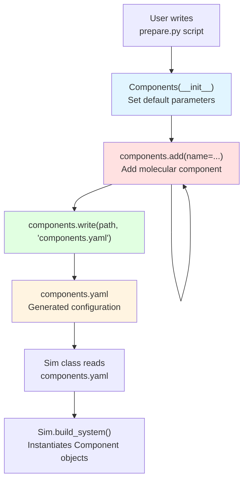
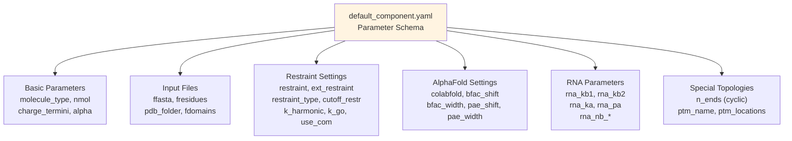
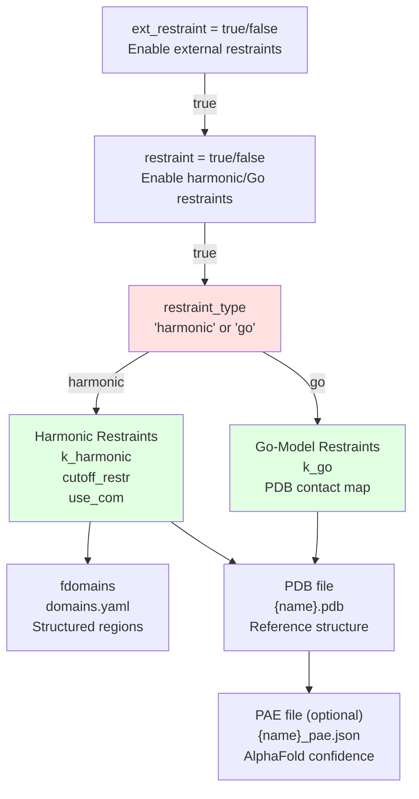

# Components Class - Molecular Definitions

<details>
<summary>Relevant source files</summary>

The following files were used as context for generating this wiki page:

- [calvados/data/default_component.yaml](calvados/data/default_component.yaml)
- [examples/single_IDR/prepare.py](examples/single_IDR/prepare.py)
- [examples/single_MDP/prepare.py](examples/single_MDP/prepare.py)

</details>


## Purpose and Scope

This page documents the `Components` class in `calvados.cfg`, which provides the user-facing API for defining molecular components in CALVADOS simulations. The `Components` class manages default parameters, accumulates component definitions, and generates the `components.yaml` configuration file consumed by the simulation engine.

For information about the underlying Component class hierarchy that implements different molecule types, see [Component Class Hierarchy](#3.1). For details on individual molecule types (Protein, RNA, etc.), see [Protein Components](#3.2) and [RNA Components](#3.3). For guidance on writing prepare.py scripts that use this class, see [Preparation Scripts](#2.3).

---

## Overview

The `Components` class serves as a configuration builder for molecular systems. It:

1. **Stores default parameters** that apply to all components unless overridden
2. **Accumulates component definitions** through the `add()` method
3. **Generates components.yaml** containing all component specifications
4. **Validates parameters** against the default_component.yaml template

Users interact with `Components` exclusively in prepare.py scripts to define the molecular composition of their simulation system.

**Workflow Diagram: Components Class in Simulation Setup**



Sources: [examples/single_IDR/prepare.py:59-73](), [examples/single_MDP/prepare.py:60-78]()

---

## Initialization and Default Parameters

The `Components` class is initialized with parameters that serve as defaults for all subsequently added components. Any parameter not specified in an `add()` call inherits the default value.

**Basic Initialization Pattern**

```python
components = Components(
    molecule_type = 'protein',
    nmol = 1,
    restraint = False,
    charge_termini = 'both',
    fresidues = 'residues_CALVADOS2.csv',
    ffasta = 'input/sequences.fasta'
)
```

### Default Parameter Template

All available parameters are defined in [calvados/data/default_component.yaml:1-37](). This file serves as the authoritative schema for component configuration.

**Parameter Categories Diagram**



Sources: [calvados/data/default_component.yaml:1-37]()

---

## Adding Molecular Components

Components are added to the system using the `add()` method. Each call creates a component entry with a unique name. Parameters specified in `add()` override the defaults set during initialization.

### The add() Method

**Signature**: `components.add(name=str, **kwargs)`

- **name** (required): Unique identifier for the component
- **kwargs**: Any parameter from default_component.yaml to override defaults

**Example: Single IDR Without Restraints**

```python
components = Components(
    molecule_type = 'protein',
    nmol = 1,
    restraint = False,
    charge_termini = 'both',
    fresidues = 'input/residues_CALVADOS2.csv',
    ffasta = 'input/idr.fasta'
)
components.add(name='IDR1')
```

Sources: [examples/single_IDR/prepare.py:59-73]()

**Example: Structured Protein With Restraints**

```python
components = Components(
    molecule_type = 'protein',
    nmol = 1,
    restraint = True,
    charge_termini = 'both',
    fresidues = 'input/residues_CALVADOS3.csv',
    fdomains = 'input/domains.yaml',
    pdb_folder = 'input',
    restraint_type = 'harmonic',
    use_com = True,
    colabfold = 1,
    k_harmonic = 700.
)
components.add(name='ProteinName')
```

Sources: [examples/single_MDP/prepare.py:60-78]()

### Multiple Components

Multiple components can be added with different configurations:

```python
# First component with default settings
components.add(name='Protein1')

# Second component overriding nmol
components.add(name='Protein2', nmol=10)

# Third component with different molecule type
components.add(name='RNA1', molecule_type='rna', ffasta='rna.fasta')
```

---

## Component Configuration Parameters

The following sections document all parameters available for component configuration, organized by functional category.

### Basic Molecular Properties

| Parameter | Type | Default | Description |
|-----------|------|---------|-------------|
| `molecule_type` | str | `'protein'` | Molecule type: `'protein'`, `'rna'`, `'lipid'`, `'crowder'`, `'cyclic'`, `'seastar'`, `'ptm'` |
| `nmol` | int | `1` | Number of molecules of this component to create |
| `charge_termini` | str | `'both'` | Charge N/C termini: `'both'`, `'N'`, `'C'`, or `'none'` |
| `alpha` | float | `0` | Reserved parameter for future features |

Sources: [calvados/data/default_component.yaml:2-5]()

### Input File Specifications

| Parameter | Type | Default | Description |
|-----------|------|---------|-------------|
| `ffasta` | str | `'fastabib.fasta'` | FASTA file containing sequence(s) |
| `fresidues` | str | (must specify) | CSV file with force field parameters (e.g., `residues_CALVADOS2.csv`) |
| `pdb_folder` | str | `'pdbs'` | Directory containing PDB and PAE files |
| `fdomains` | str | `'domains.yaml'` | YAML file defining structured domains for restraints |

The component name specified in `add(name=...)` is used to locate input files:
- FASTA sequence: looked up by name in the file specified by `ffasta`
- PDB structure: `{pdb_folder}/{name}.pdb`
- PAE file: `{pdb_folder}/{name}_pae.json`

Sources: [calvados/data/default_component.yaml:6-7,12,15](), [examples/single_MDP/prepare.py:68-69]()

### Bond Parameters

| Parameter | Type | Default | Description |
|-----------|------|---------|-------------|
| `kb` | float | `8033.0` | Harmonic bond force constant (kJ/mol/nm²) for backbone bonds |
| `periodic` | bool | `false` | Whether to apply periodic boundary conditions to this component |

Sources: [calvados/data/default_component.yaml:7,18]()

### Restraint Configuration

**Restraint Control Diagram**



| Parameter | Type | Default | Description |
|-----------|------|---------|-------------|
| `ext_restraint` | bool | `true` | Master switch for external restraints |
| `restraint` | bool | `false` | Enable harmonic or Go-model restraints |
| `restraint_type` | str | `'harmonic'` | Restraint type: `'harmonic'` or `'go'` |
| `cutoff_restr` | float | `0.9` | Distance cutoff (nm) for harmonic restraints within structured regions |
| `k_harmonic` | float | `700.0` | Force constant (kJ/mol/nm²) for harmonic restraints |
| `k_go` | float | `15.0` | Force constant (kJ/mol/nm²) for Go-model contact restraints |
| `use_com` | bool | `true` | Apply restraints to domain centers of mass instead of individual Cα atoms |

Sources: [calvados/data/default_component.yaml:9-17]()

### AlphaFold Integration Parameters

When using AlphaFold structures, confidence scores can weight restraint strengths.

| Parameter | Type | Default | Description |
|-----------|------|---------|-------------|
| `colabfold` | int | `0` | PAE file format: `0` (EBI AlphaFold), `1` (ColabFold v1), `2` (ColabFold v2) |
| `bfac_shift` | float | `0.8` | Threshold for B-factor based confidence weighting |
| `bfac_width` | float | `50.0` | Width parameter for B-factor sigmoid function |
| `pae_shift` | float | `0.3` | Threshold (nm) for PAE-based confidence weighting |
| `pae_width` | float | `15.0` | Width parameter (Å) for PAE sigmoid function |

These parameters control how AlphaFold confidence metrics (B-factors and PAE) modulate restraint force constants. See [Restraints System](#3.5) for details on the weighting functions.

Sources: [calvados/data/default_component.yaml:20-24]()

### RNA-Specific Parameters

Used when `molecule_type = 'rna'`.

| Parameter | Type | Default | Description |
|-----------|------|---------|-------------|
| `rna_kb1` | float | `8033.0` | Bond force constant (kJ/mol/nm²) for sugar-phosphate bonds |
| `rna_kb2` | float | `8033.0` | Bond force constant (kJ/mol/nm²) for sugar-base bonds |
| `rna_ka` | float | `7.24` | Angle force constant (kJ/mol/rad²) |
| `rna_pa` | float | `3.14` | Equilibrium angle (radians, π) |
| `rna_nb_sigma` | float | `0.4` | Sigma parameter (nm) for base-base interactions |
| `rna_nb_scale` | float | `15` | Energy scale (kJ/mol) for base-base interactions |
| `rna_nb_cutoff` | float | `0.6` | Cutoff distance (nm) for base-base interactions |

Sources: [calvados/data/default_component.yaml:26-32]()

### Special Topology Parameters

**Cyclic Peptides**

| Parameter | Type | Default | Description |
|-----------|------|---------|-------------|
| `n_ends` | int | `1` | Number of free chain ends (0 for fully cyclic, 1 for linear) |

Used with `molecule_type = 'cyclic'` to create ring topologies.

Sources: [calvados/data/default_component.yaml:34]()

**Post-Translational Modifications**

| Parameter | Type | Default | Description |
|-----------|------|---------|-------------|
| `ptm_name` | str | `'example_ptm'` | Name of PTM type |
| `ptm_locations` | list | `[]` | List of residue indices (0-based) where PTM is applied |

Used with `molecule_type = 'ptm'` to model modified residues.

Sources: [calvados/data/default_component.yaml:36-37]()

---

## Writing the Components Configuration

After adding all components, the configuration is written to a YAML file using the `write()` method.

**Signature**: `components.write(path, name='components.yaml')`

- **path**: Directory where the file will be written
- **name**: Filename (default: `'components.yaml'`)

**Example**

```python
# Setup
path = '/path/to/simulation'
components = Components(...)
components.add(name='Protein1')
components.add(name='Protein2', nmol=5)

# Generate components.yaml
components.write(path, name='components.yaml')
```

### Generated YAML Structure

The resulting `components.yaml` contains a list of component dictionaries, each with:
- All parameters from default_component.yaml
- Overrides specified in initialization or `add()` calls
- The unique component name

**Example Output Structure**

```yaml
- name: Protein1
  molecule_type: protein
  nmol: 1
  restraint: true
  fresidues: input/residues_CALVADOS3.csv
  ffasta: input/sequences.fasta
  pdb_folder: input
  # ... all other parameters ...

- name: Protein2
  molecule_type: protein
  nmol: 5
  restraint: true
  # ... all other parameters ...
```

This file is read by the `Sim` class during system building to instantiate the appropriate Component objects.

Sources: [examples/single_IDR/prepare.py:73](), [examples/single_MDP/prepare.py:78]()

---

## Complete Example: Structured Protein Simulation

This example demonstrates a complete `Components` setup for a structured protein with harmonic restraints, using CALVADOS3 force field parameters and AlphaFold confidence weighting.

```python
import os
from calvados.cfg import Components

cwd = os.getcwd()
protein_name = 'MyProtein'

components = Components(
    # Molecular properties
    molecule_type = 'protein',
    nmol = 1,
    charge_termini = 'both',
    
    # Input files
    fresidues = f'{cwd}/input/residues_CALVADOS3.csv',
    fdomains = f'{cwd}/input/domains.yaml',
    pdb_folder = f'{cwd}/input',
    
    # Restraint configuration
    restraint = True,
    restraint_type = 'harmonic',
    use_com = True,
    k_harmonic = 700.,
    cutoff_restr = 0.9,
    
    # AlphaFold integration
    colabfold = 1,  # ColabFold format
    bfac_shift = 0.8,
    bfac_width = 50.,
    pae_shift = 0.3,
    pae_width = 15.
)

# Add the component
components.add(name=protein_name)

# Write configuration
path = f'{cwd}/{protein_name}'
components.write(path, name='components.yaml')
```

**File Dependencies**

This configuration expects the following files:
- `input/residues_CALVADOS3.csv` - Force field parameters
- `input/domains.yaml` - Structured region definitions
- `input/MyProtein.pdb` - Reference structure
- `input/MyProtein_pae.json` - AlphaFold PAE matrix (optional)
- `input/sequences.fasta` - Must contain entry for "MyProtein"

Sources: [examples/single_MDP/prepare.py:60-78]()

---

## Parameter Inheritance Diagram

This diagram shows how parameters flow from defaults to final component configuration.

```mermaid
graph TB
    Template["default_component.yaml<br/>System defaults"]
    Init["Components(__init__)<br/>User defaults"]
    Add1["components.add(name='A')<br/>Component-specific overrides"]
    Add2["components.add(name='B', nmol=10)<br/>Component-specific overrides"]
    
    Final1["Component A config<br/>Inherits all defaults"]
    Final2["Component B config<br/>Overrides nmol=10"]
    
    YAML["components.yaml<br/>[{name: A, ...}, {name: B, nmol: 10, ...}]"]
    
    Template -->|"baseline defaults"| Init
    Init -->|"user defaults"| Add1
    Init -->|"user defaults"| Add2
    
    Add1 --> Final1
    Add2 --> Final2
    
    Final1 --> YAML
    Final2 --> YAML
    
    style Template fill:#fff4e1
    style Init fill:#e1f5ff
    style YAML fill:#e1ffe1
```



**Precedence Rules**:
1. Parameters in `add()` override initialization defaults
2. Initialization parameters override `default_component.yaml` values
3. Unspecified parameters inherit from `default_component.yaml`

Sources: [calvados/data/default_component.yaml:1-37](), [examples/single_IDR/prepare.py:59-73](), [examples/single_MDP/prepare.py:60-78]()

---