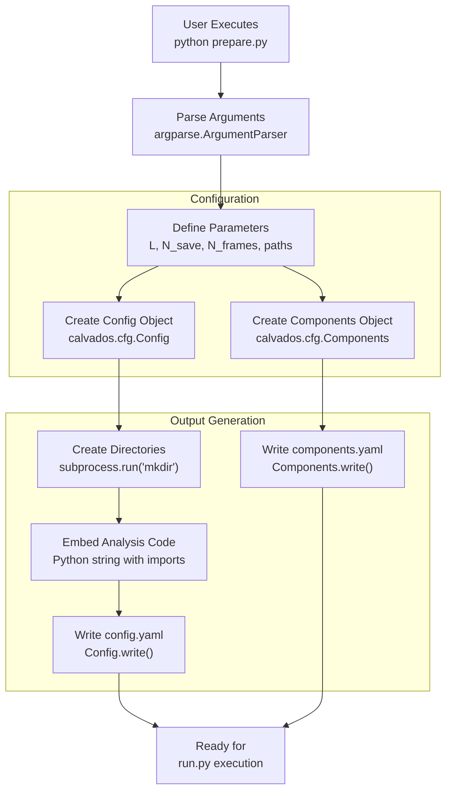
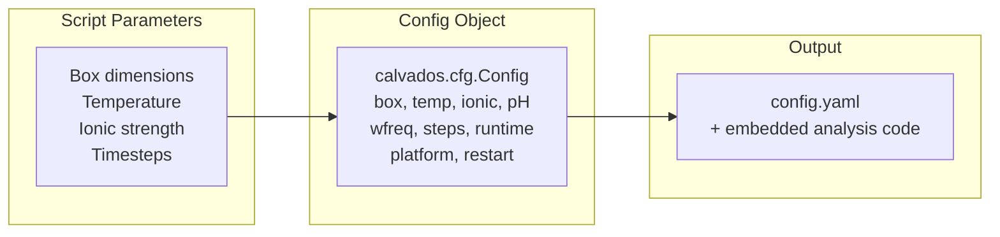
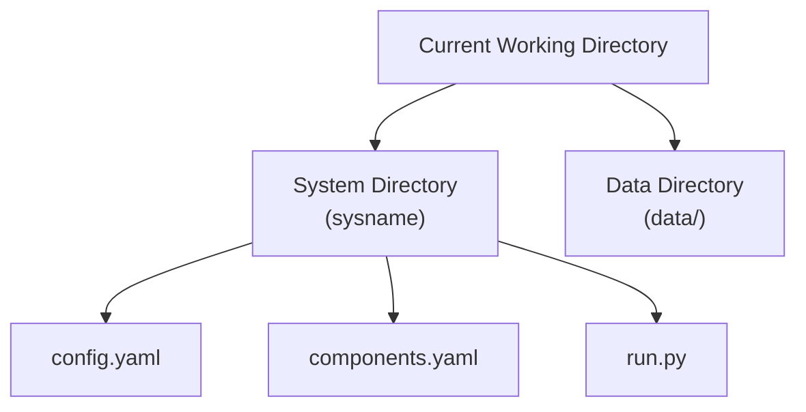
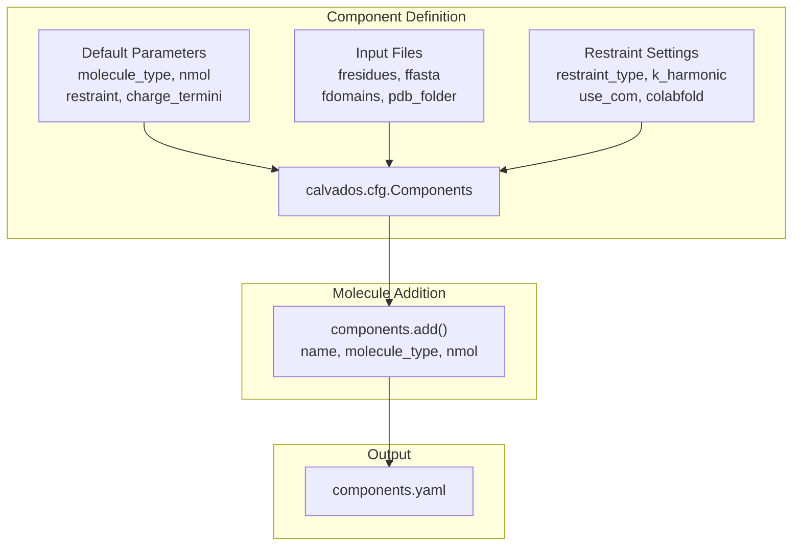
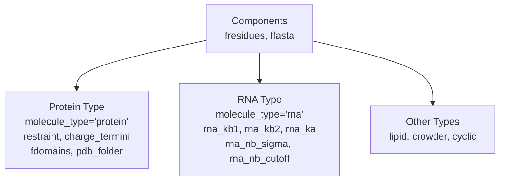
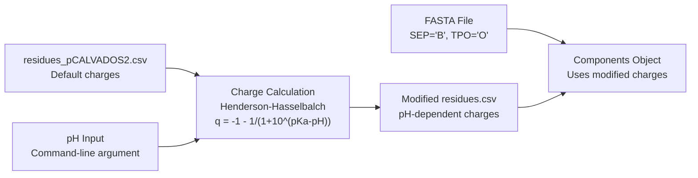
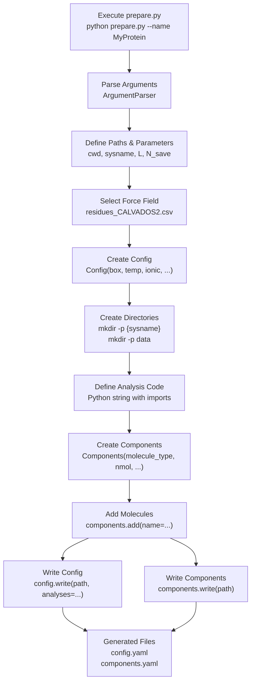

# Preparation Scripts (prepare.py)

<details>
<summary>Relevant source files</summary>

The following files were used as context for generating this wiki page:

- [examples/single_IDR/prepare.py](examples/single_IDR/prepare.py)
- [examples/single_MDP/prepare.py](examples/single_MDP/prepare.py)
- [examples/single_pIDR/README.md](examples/single_pIDR/README.md)
- [examples/single_pIDR/input/idr.fasta](examples/single_pIDR/input/idr.fasta)
- [examples/single_pIDR/input/residues_pCALVADOS2.csv](examples/single_pIDR/input/residues_pCALVADOS2.csv)
- [examples/single_pIDR/prepare.py](examples/single_pIDR/prepare.py)
- [examples/slab_mixed/prepare.py](examples/slab_mixed/prepare.py)

</details>


## Purpose and Scope

Preparation scripts are the primary user interface for setting up CALVADOS simulations. These scripts (typically named `prepare.py`) programmatically configure simulation parameters, define molecular components, and generate the YAML configuration files required to run simulations. Each simulation type (single IDR, structured protein, phase separation, etc.) has a specialized prepare.py script that handles its specific requirements.

This page covers the structure, common patterns, and variations across different prepare.py scripts. For details on the Config class parameters, see [Config Class - Simulation Parameters](#2.1). For Components class parameters, see [Components Class - Molecular Definitions](#2.2). For the generated YAML file formats, see [Configuration File Reference](#9.1) and [Component Configuration Reference](#9.2).

## Overview

Preparation scripts serve three main functions:
1. **Accept user input** via command-line arguments or hardcoded parameters
2. **Configure simulation settings** using the `Config` and `Components` classes
3. **Generate output files** (config.yaml, components.yaml) in the simulation directory

**Workflow Diagram: Preparation Script Execution**



Sources: [examples/single_IDR/prepare.py:1-75](), [examples/single_MDP/prepare.py:1-80](), [examples/slab_mixed/prepare.py:1-96]()

## Common Structure

### Standard Imports

All prepare.py scripts use a common set of imports:

```python
import os
import pandas as pd
from calvados.cfg import Config, Job, Components
import subprocess
import numpy as np
from argparse import ArgumentParser
```

**Import Purpose Table**

| Module | Purpose |
|--------|---------|
| `os` | Path operations and working directory |
| `pandas` | Reading/modifying residue parameter files (CSV) |
| `calvados.cfg.Config` | Simulation parameter configuration |
| `calvados.cfg.Components` | Molecular component definitions |
| `subprocess` | Directory creation via shell commands |
| `numpy` | Numerical calculations (when needed) |
| `argparse.ArgumentParser` | Command-line argument parsing |

Sources: [examples/single_IDR/prepare.py:1-6](), [examples/single_MDP/prepare.py:1-6](), [examples/slab_mixed/prepare.py:1-6]()

### Command-Line Arguments

Scripts requiring user input use `ArgumentParser` to accept parameters:

**Example: Single IDR with name argument**
```python
parser = ArgumentParser()
parser.add_argument('--name', nargs='?', required=True, type=str)
args = parser.parse_args()
sysname = f'{args.name:s}'
```
[examples/single_IDR/prepare.py:8-13]()

**Example: pH-dependent simulation with multiple arguments**
```python
parser = ArgumentParser()
parser.add_argument('--name', nargs='?', required=True, type=str)
parser.add_argument('--pH', nargs='?', required=True, type=float)
args = parser.parse_args()
```
[examples/single_pIDR/prepare.py:8-11]()

**Common Command-Line Argument Patterns**

| Argument | Type | Purpose | Example Scripts |
|----------|------|---------|-----------------|
| `--name` | str | System/protein name | single_IDR, single_MDP, single_pIDR |
| `--pH` | float | Solution pH for charge calculation | single_pIDR |

Sources: [examples/single_IDR/prepare.py:8-10](), [examples/single_MDP/prepare.py:8-10](), [examples/single_pIDR/prepare.py:8-11]()

### Parameter Definition

Scripts define key simulation parameters before creating Config objects:

**Box Dimensions**
- **Cubic boxes**: `L = 50` sets all three dimensions [examples/single_IDR/prepare.py:16]()
- **Slab geometry**: `Lx = 15; Lz = 80` defines rectangular box [examples/slab_mixed/prepare.py:12-13]()

**Trajectory Parameters**
```python
N_save = 7000      # Frames between saves (timesteps)
N_frames = 1010    # Total frames to save
```
[examples/single_IDR/prepare.py:19-22]()

**File Paths**
```python
cwd = os.getcwd()
residues_file = f'{cwd}/input/residues_CALVADOS2.csv'
```
[examples/single_IDR/prepare.py:12-24]()

Sources: [examples/single_IDR/prepare.py:12-24](), [examples/single_MDP/prepare.py:12-24](), [examples/slab_mixed/prepare.py:8-21]()

## Config Object Creation

The `Config` object encapsulates all simulation runtime parameters:

**Configuration Pattern Mapping**



**Typical Config Construction**

```python
config = Config(
  # GENERAL
  sysname = sysname,        # Simulation name
  box = [L, L, L],          # Box dimensions (nm)
  temp = 293.15,            # Temperature (K)
  ionic = 0.19,             # Ionic strength (M)
  pH = 7.5,                 # Solution pH
  topol = 'center',         # Topology: 'center', 'grid', 'slab'
  
  # RUNTIME SETTINGS
  wfreq = N_save,           # DCD write frequency
  steps = N_frames*N_save,  # Total simulation steps
  runtime = 0,              # Overwrites steps if > 0
  platform = 'CPU',         # 'CPU' or 'CUDA'
  restart = 'checkpoint',   # Restart mode
  frestart = 'restart.chk', # Checkpoint file
  verbose = True,           # Print progress
)
```
[examples/single_IDR/prepare.py:26-43]()

**Config Parameters by Category**

| Category | Parameters | Typical Values |
|----------|-----------|----------------|
| **Geometry** | `box`, `topol` | `[50,50,50]`, `'center'` |
| **Thermodynamics** | `temp`, `ionic`, `pH` | `293.15`, `0.19`, `7.5` |
| **Runtime** | `steps`, `wfreq`, `platform` | `7070000`, `7000`, `'CPU'`/`'CUDA'` |
| **Restart** | `restart`, `frestart` | `'checkpoint'`, `'restart.chk'` |
| **Equilibration** | `slab_eq`, `steps_eq` | `True`, `1000000` |

Sources: [examples/single_IDR/prepare.py:26-43](), [examples/single_MDP/prepare.py:26-44](), [examples/slab_mixed/prepare.py:23-45]()

### Topology-Specific Configurations

Different simulation types use different `topol` settings:

**Topology Options**

| Topology | Use Case | Box Shape | Example |
|----------|----------|-----------|---------|
| `'center'` | Single molecule centered | Cubic | single_IDR, single_MDP |
| `'slab'` | Phase separation | Rectangular (Lx × Lx × Lz) | slab_mixed |
| `'grid'` | Multiple non-interacting copies | Cubic with subdivisions | (not in examples) |
| `'random'` | Random placement | Any | (not in examples) |

**Slab-Specific Parameters**
```python
config = Config(
  box = [Lx, Lx, Lz],     # Non-cubic box
  topol = 'slab',         # Slab topology
  slab_eq = True,         # Enable slab equilibration
  steps_eq = 100*N_save,  # Equilibration steps
)
```
[examples/slab_mixed/prepare.py:23-41]()

Sources: [examples/single_IDR/prepare.py:33](), [examples/single_MDP/prepare.py:33](), [examples/slab_mixed/prepare.py:30-41]()

## Directory Management

Prepare scripts create output directories using subprocess:

```python
path = f'{cwd}/{sysname}'
subprocess.run(f'mkdir -p {path}', shell=True)
subprocess.run(f'mkdir -p {cwd}/data', shell=True)
```
[examples/slab_mixed/prepare.py:48-50]()

**Directory Structure Created**



Sources: [examples/single_IDR/prepare.py:46-48](), [examples/single_MDP/prepare.py:46-49](), [examples/slab_mixed/prepare.py:48-50]()

## Embedded Analysis Code

A distinctive feature of CALVADOS prepare scripts is embedding post-simulation analysis code as a Python string, which is written into config.yaml and executed after simulation completion:

**Analysis Embedding Pattern**

```python
analyses = f"""
from calvados.analysis import save_conf_prop

save_conf_prop(
    path="{path:s}",
    name="{sysname:s}",
    residues_file="{residues_file:s}",
    output_path="data",
    start=10,
    is_idr=True,
    select='all'
)
"""

config.write(path, name='config.yaml', analyses=analyses)
```
[examples/single_IDR/prepare.py:50-57]()

**Slab Analysis Embedding Example**
```python
analyses = f"""
from calvados.analysis import SlabAnalysis
slab_analysis = SlabAnalysis(
    name='mixed_system',
    input_path=f'{cwd}/mixed_system',
    output_path=f'{cwd}/data',
    input_pdb='top.pdb', 
    input_dcd=None,
    centered_dcd='traj.dcd',
    ref_chains=(0, 199),
    ref_name='FUS-RGG3',
    client_chain_list=[(200, 259)],
    client_names=['polyU40'],
    verbose=False
)
slab_analysis.center(start=250, center_target='all')
slab_analysis.calc_profiles()
slab_analysis.calc_concentrations()
"""
```
[examples/slab_mixed/prepare.py:52-73]()

**Common Analysis Functions**

| Function | Use Case | Parameters |
|----------|----------|------------|
| `save_conf_prop` | IDR/protein conformational properties | `path`, `name`, `residues_file`, `start`, `is_idr` |
| `SlabAnalysis` | Phase separation analysis | `ref_chains`, `client_chain_list`, centering methods |

Sources: [examples/single_IDR/prepare.py:50-55](), [examples/single_MDP/prepare.py:51-56](), [examples/slab_mixed/prepare.py:52-73]()

## Components Object Creation

The `Components` object defines all molecular components in the simulation:

**Components Configuration Flow**



### Single Protein Components

**IDR Without Restraints**
```python
components = Components(
  molecule_type = 'protein',
  nmol = 1,
  restraint = False,
  charge_termini = 'both',
  fresidues = residues_file,
  ffasta = f'{cwd}/input/idr.fasta',
)
components.add(name=args.name)
```
[examples/single_IDR/prepare.py:59-71]()

**Structured Protein With Restraints**
```python
components = Components(
  molecule_type = 'protein',
  nmol = 1,
  restraint = True,
  charge_termini = 'both',
  fresidues = residues_file,
  fdomains = f'{cwd}/input/domains.yaml',
  pdb_folder = f'{cwd}/input',
  restraint_type = 'harmonic',  # or 'go'
  use_com = True,
  colabfold = 1,  # PAE format: EBI AF=0, Colabfold=1&2
  k_harmonic = 700.,
)
components.add(name=args.name)
```
[examples/single_MDP/prepare.py:60-77]()

Sources: [examples/single_IDR/prepare.py:59-73](), [examples/single_MDP/prepare.py:60-78]()

### Multi-Component Systems

For systems with multiple molecule types (e.g., protein-RNA condensates):

```python
components = Components(
  fresidues = residues_file,
  ffasta = f'{cwd}/input/mix.fasta',
  # RNA-specific parameters
  rna_kb1 = 1400.0,
  rna_kb2 = 2200.0,
  rna_ka = 4.20,
  rna_pa = 3.14,
  rna_nb_sigma = 0.4,
  rna_nb_scale = 15,
  rna_nb_cutoff = 2.0
)

# Add protein component
components.add(
    name='FUS-RGG3', 
    molecule_type='protein', 
    nmol=200, 
    charge_termini='both'
)

# Add RNA component
components.add(
    name='polyU40', 
    molecule_type='rna', 
    nmol=60
)
```
[examples/slab_mixed/prepare.py:77-94]()

**Component Types and Their Parameters**



Sources: [examples/slab_mixed/prepare.py:77-94]()

## Specialized Patterns

### pH-Dependent Charge Modification

For phosphorylated IDRs, prepare.py scripts dynamically modify residue charges:

```python
# Set solution pH
pH = args.pH

# Calculate pH-dependent charges for phosphorylated residues
pKa_dict = dict(SEP=6.01, TPO=6.3)
df_residues = pd.read_csv(residues_file, index_col='three')

for pres in pKa_dict.keys():
    df_residues.loc[pres,'q'] = - 1 - 1 / (1 + 10**(pKa_dict[pres]-pH))

df_residues.reset_index().set_index('one').to_csv(residues_file)
```
[examples/single_pIDR/prepare.py:26-35]()

**Phosphorylation System Workflow**



**Phosphorylation Representation**
- Standard residues use one-letter codes (S, T)
- Phosphorylated residues use alternative codes: `B` = pSer (SEP), `O` = pThr (TPO)
- Charges calculated from Henderson-Hasselbalch equation: q = -1 - 1/(1 + 10^(pKa-pH))

Sources: [examples/single_pIDR/prepare.py:26-35](), [examples/single_pIDR/input/idr.fasta:1-5](), [examples/single_pIDR/README.md:1-9]()

### Force Field Selection

Different simulation types use different force field parameter files:

**Force Field Parameter Files**

| File | Use Case | Example Script |
|------|----------|----------------|
| `residues_CALVADOS2.csv` | Standard IDRs | single_IDR |
| `residues_CALVADOS3.csv` | Structured proteins | single_MDP |
| `residues_C2RNA.csv` | Protein-RNA systems | slab_mixed |
| `residues_pCALVADOS2.csv` | Phosphorylated proteins | single_pIDR |

```python
# Standard IDR
residues_file = f'{cwd}/input/residues_CALVADOS2.csv'

# Structured protein
residues_file = f'{cwd}/input/residues_CALVADOS3.csv'

# Protein-RNA
residues_file = f'{cwd}/input/residues_C2RNA.csv'

# Phosphorylated IDR
residues_file = f'{cwd}/input/residues_pCALVADOS2.csv'
```

Sources: [examples/single_IDR/prepare.py:24](), [examples/single_MDP/prepare.py:24](), [examples/slab_mixed/prepare.py:21](), [examples/single_pIDR/prepare.py:28]()

## Complete Workflow Example

**End-to-End Preparation Workflow**



Sources: [examples/single_IDR/prepare.py:1-75](), [examples/single_MDP/prepare.py:1-80]()

## Parameter Comparison Across Simulation Types

**Key Parameters by Simulation Type**

| Parameter | Single IDR | Single MDP | Slab Mixed | Single pIDR |
|-----------|-----------|-----------|------------|-------------|
| **Box** | `[50,50,50]` | `[123,123,123]` | `[15,15,80]` | `[34.4,34.4,34.4]` |
| **Topology** | `center` | `center` | `slab` | `center` |
| **N_save** | 7000 | 8000 | 100000 | 7000 |
| **N_frames** | 1010 | 4000 | 1000 | 1010 |
| **Temperature** | 293.15 K | 293 K | 293.15 K | 298 K |
| **Restraints** | False | True | N/A | False |
| **Force Field** | CALVADOS2 | CALVADOS3 | C2RNA | pCALVADOS2 |
| **nmol** | 1 | 1 | 200+60 | 1 |
| **Equilibration** | No | No | Yes (`slab_eq=True`) | No |

Sources: [examples/single_IDR/prepare.py:16-43](), [examples/single_MDP/prepare.py:16-44](), [examples/slab_mixed/prepare.py:12-45](), [examples/single_pIDR/prepare.py:17-54]()

## Best Practices

### 1. Parameter Organization
Group related parameters logically in your prepare.py script:
- Geometry parameters (box dimensions)
- Trajectory parameters (N_save, N_frames)
- File paths (residues_file, input directories)
- Thermodynamic parameters (temp, ionic, pH)

### 2. Path Handling
Use `os.getcwd()` and f-strings for robust path construction:
```python
cwd = os.getcwd()
path = f'{cwd}/{sysname}'
residues_file = f'{cwd}/input/residues_CALVADOS2.csv'
```

### 3. Analysis Code Formatting
Use triple-quoted strings with proper indentation for embedded analysis:
```python
analyses = f"""
from calvados.analysis import save_conf_prop

save_conf_prop(
    path="{path:s}",
    name="{sysname:s}",
    ...
)
"""
```

### 4. Force Field Selection
Choose the appropriate residues file for your system:
- CALVADOS2: Disordered proteins
- CALVADOS3: Structured proteins
- C2RNA: Protein-RNA systems
- pCALVADOS2: Phosphorylated proteins

### 5. Command-Line Arguments
Make scripts flexible by accepting key parameters as arguments:
```python
parser = ArgumentParser()
parser.add_argument('--name', required=True, type=str)
parser.add_argument('--pH', required=False, type=float, default=7.5)
```

Sources: [examples/single_IDR/prepare.py:8-75](), [examples/single_MDP/prepare.py:8-80](), [examples/slab_mixed/prepare.py:8-96](), [examples/single_pIDR/prepare.py:8-86]()

## Summary

Preparation scripts in CALVADOS follow a consistent pattern:
1. Parse command-line arguments (if applicable)
2. Define simulation parameters (box, timesteps, paths)
3. Create Config object with runtime settings
4. Create output directories
5. Embed analysis code as Python string
6. Create Components object with molecular definitions
7. Add molecules using `components.add()`
8. Write config.yaml and components.yaml files

The flexibility of this approach allows specialized scripts for different simulation types while maintaining a common structure. The embedded analysis pattern enables specifying post-processing at preparation time, creating a complete simulation-to-analysis workflow.

---