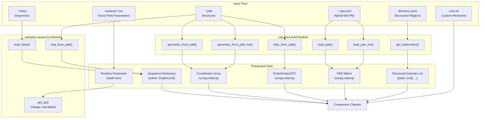
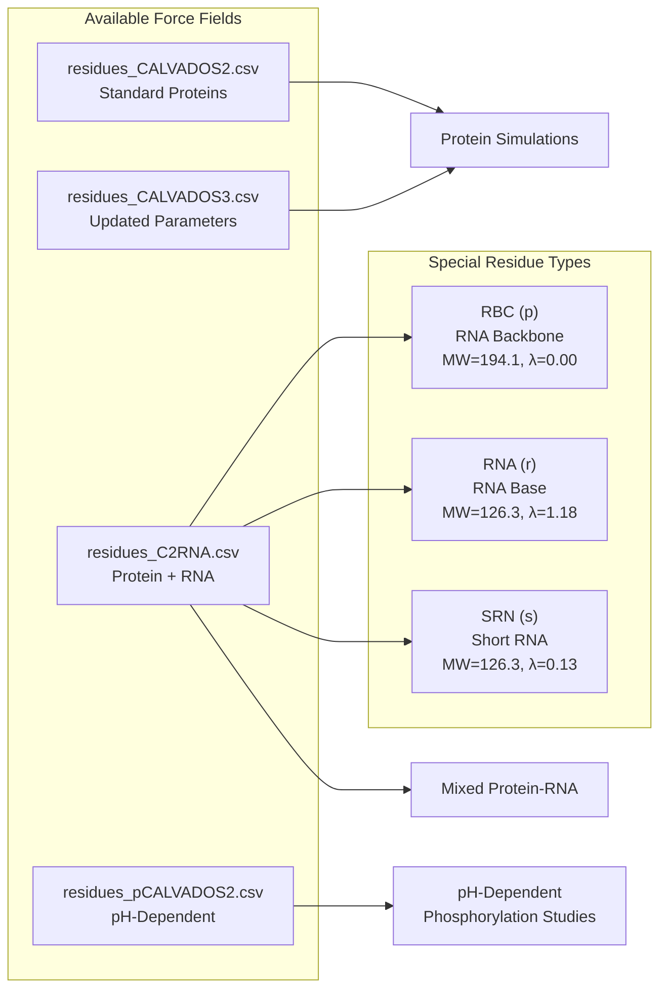
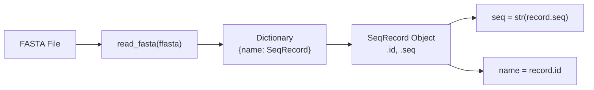
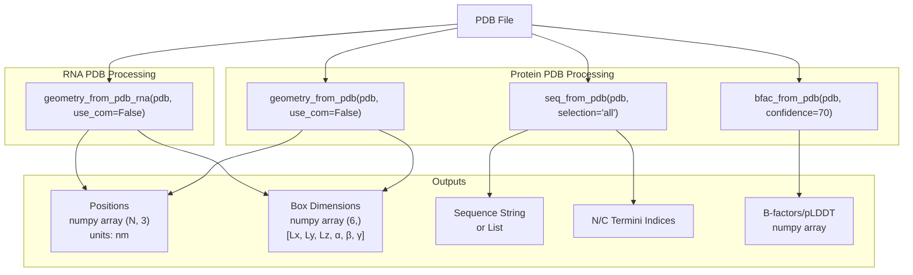
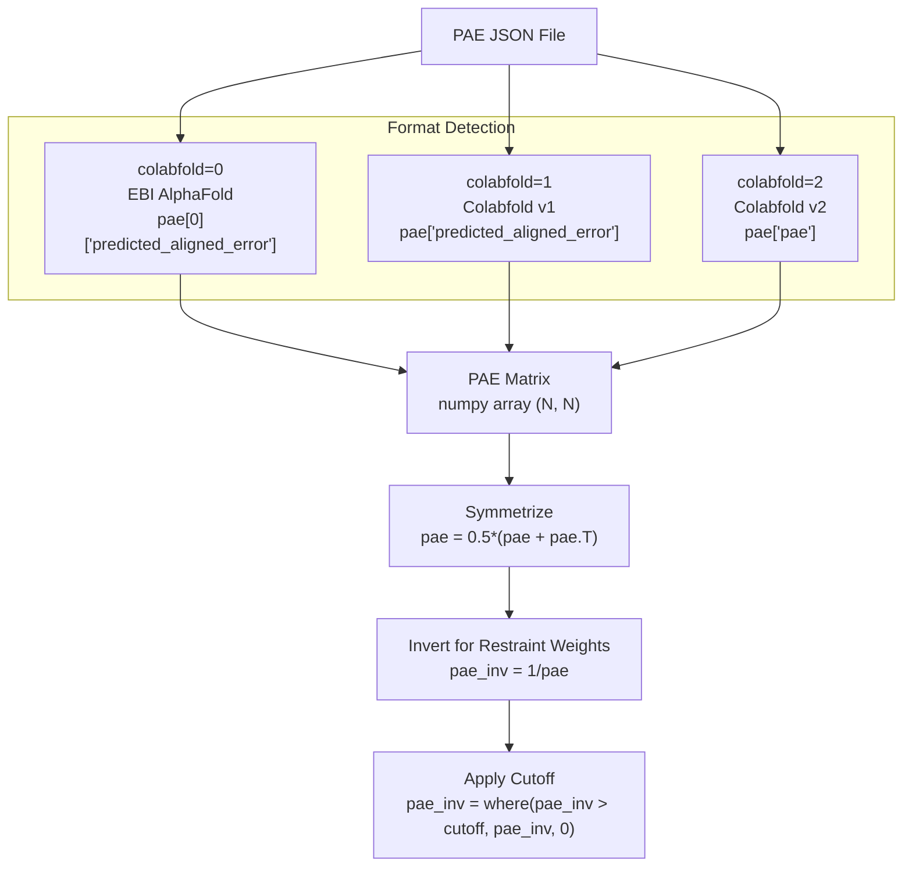
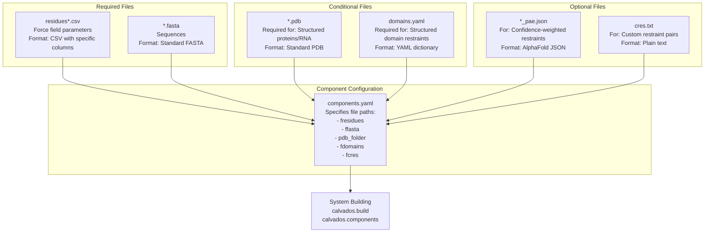

# Input Data Files

<details>
<summary>Relevant source files</summary>

The following files were used as context for generating this wiki page:

- [calvados/build.py](calvados/build.py)
- [calvados/sequence.py](calvados/sequence.py)
- [examples/single_RNA/residues_C2RNA.csv](examples/single_RNA/residues_C2RNA.csv)
- [examples/single_RNA/rna.fasta](examples/single_RNA/rna.fasta)
- [examples/single_dsRNA/input/domains.yaml](examples/single_dsRNA/input/domains.yaml)
- [examples/single_dsRNA/input/dspolyR12.pdb](examples/single_dsRNA/input/dspolyR12.pdb)
- [examples/single_dsRNA/input/fastalib.fasta](examples/single_dsRNA/input/fastalib.fasta)
- [examples/single_dsRNA/input/residues_C2RNA.csv](examples/single_dsRNA/input/residues_C2RNA.csv)
- [examples/single_dsRNA/prepare.py](examples/single_dsRNA/prepare.py)
- [examples/slab_mixed/input/mix.fasta](examples/slab_mixed/input/mix.fasta)
- [examples/slab_mixed/input/residues_C2RNA.csv](examples/slab_mixed/input/residues_C2RNA.csv)
- [residues.csv](residues.csv)

</details>


This page documents the input data file formats used by CALVADOS to define molecular systems. These files provide force field parameters, molecular sequences, structures, and restraint definitions that are consumed by the [Components Class](#2.2) during simulation setup.

For information about how these files are specified in configuration, see [Components Class - Molecular Definitions](#2.2). For details on how restraints are applied during simulation, see [Restraints System](#3.5).

## Overview

CALVADOS simulations require multiple input data files that define different aspects of the molecular system:

| File Type | Purpose | Required | Key Code Interface |
|-----------|---------|----------|-------------------|
| `residues*.csv` | Force field parameters per residue type | Yes | Loaded as pandas DataFrame |
| `*.fasta` | Amino acid/nucleotide sequences | Yes | `read_fasta()`, `seq_from_pdb()` |
| `*.pdb` | 3D structural coordinates | For structured proteins/RNA | `geometry_from_pdb()`, `geometry_from_pdb_rna()` |
| `domains.yaml` | Structured region definitions for restraints | For structured domains | `get_ssdomains()` |
| `*_pae.json` | AlphaFold PAE confidence matrices | For confidence-weighted restraints | `load_pae()`, `load_pae_inv()` |
| `cres.txt` | Custom pairwise restraints | Optional | Parsed by Components class |

## Input File Processing Pipeline



**Sources:** [calvados/sequence.py:30-88](), [calvados/build.py:297-433]()

## Residues CSV Files - Force Field Parameters

The residues CSV file defines per-residue force field parameters for the Ashbaugh-Hatch and Yukawa potentials. Different CSV files exist for different force field variants.

### File Format Specification

The CSV file must contain the following columns (order matters for reading):

| Column | Data Type | Description | Units |
|--------|-----------|-------------|-------|
| `three` or `one` | string | Three-letter or one-letter amino acid code | - |
| `one` or `three` | string | One-letter or three-letter amino acid code | - |
| `MW` | float | Molecular weight | Da (g/mol) |
| `lambdas` | float | Hydrophobicity parameter (λ) | dimensionless |
| `sigmas` | float | Van der Waals radius (σ) | nm |
| `q` | float | Charge | elementary charge units |
| `bondlength` | float | Equilibrium bond length | nm |

### Force Field Variants

CALVADOS provides multiple force field parameter sets:



### Example: Standard CALVADOS2 Format

From [residues.csv:1-22]():

```csv
one,three,MW,lambdas,sigmas,q,bondlength
R,ARG,156.19,0.730762476752,0.656,1,0.38
D,ASP,115.09,0.041604048061,0.558,-1,0.38
N,ASN,114.1,0.425585900979,0.568,0,0.38
E,GLU,129.11,0.000693546096,0.592,-1,0.38
K,LYS,128.17,0.179021173899,0.636,1,0.38
```

### Example: C2RNA Format with RNA Residues

From [examples/slab_mixed/input/residues_C2RNA.csv:1-23]():

```csv
three,one,MW,lambdas,sigmas,q,bondlength
ARG,R,156.19,0.7307624767517166,0.6559999999999999,1,0.38
...
RBC,p,194.1,0.00,0.6954,-1,0.59
RNA,r,126.3,1.18,0.6238,0,0.54
```

Note that RNA residues have different bondlengths (0.59 nm for backbone, 0.54 nm for bases) compared to protein (0.38 nm).

### Code Usage

The residues file is loaded as a pandas DataFrame and indexed by residue code:

```python
# Loaded by Components class
residues = pd.read_csv(fresidues).set_index('one')  # or 'three'

# Accessed by residue code
mw = residues.loc['R', 'MW']        # 156.19
lambda_val = residues.loc['R', 'lambdas']  # 0.730762...
sigma = residues.loc['R', 'sigmas']        # 0.656
charge = residues.loc['R', 'q']            # 1.0
```

The parameters are used to construct interaction potentials:
- **λ (lambda)**: Controls hydrophobicity in Ashbaugh-Hatch potential
- **σ (sigma)**: Van der Waals radius, determines contact distance
- **q (charge)**: Used in Yukawa/Debye-Hückel electrostatics

**Sources:** [residues.csv:1-22](), [examples/slab_mixed/input/residues_C2RNA.csv:1-23](), [calvados/sequence.py:92-108](), [calvados/sequence.py:237-246]()

## FASTA Files - Sequence Definitions

FASTA files define amino acid or nucleotide sequences for molecules in the simulation. Standard FASTA format is used with one-letter codes.

### Format Specification

Standard FASTA format with:
- Header line starting with `>` followed by sequence name
- Sequence on subsequent lines (can be multi-line)
- Multiple sequences separated by blank lines or new headers

### Example: Protein Sequences

From typical protein FASTA:
```fasta
>FUS-RGG3
RRGGRGGYDRGGYRGRGGDRGGFRGGRGGGDRGC
>PolyQ40
QQQQQQQQQQQQQQQQQQQQQQQQQQQQQQQQQQQQQQQQ
```

### Example: RNA Sequences

From [examples/single_RNA/rna.fasta:1-3]():
```fasta
>polyR30
rrrrrrrrrrrrrrrrrrrrrrrrrrrrrrrr
```

RNA sequences use lowercase `r` to distinguish from protein arginine `R`. The specific nucleotide type (A, U, G, C) is typically specified in the PDB file for structured RNA.

### Example: Mixed Protein-RNA Systems

From [examples/slab_mixed/input/mix.fasta:1-5]():
```fasta
>FUS-RGG3
RRGGRGGYDRGGYRGRGGDRGGFRGGRGGGDRGC
>polyU40
rrrrrrrrrrrrrrrrrrrrrrrrrrrrrrrrrrrrrrrr
```

### Code Interface

FASTA files are read using BioPython:



From [calvados/sequence.py:30-32]():
```python
def read_fasta(ffasta):
    records = SeqIO.to_dict(SeqIO.parse(ffasta, "fasta"))
    return records
```

The function returns a dictionary mapping sequence names to BioPython `SeqRecord` objects. Individual sequences are accessed as:
```python
records = read_fasta('sequences.fasta')
seq_str = str(records['FUS-RGG3'].seq)  # 'RRGGRGGY...'
```

### Creating FASTA Records Programmatically

From [calvados/sequence.py:81-88]():
```python
def record_from_seq(seq, name):
    record = SeqRecord(
        Seq(seq),
        id=name,
        name='',
        description=''
    )
    return(record)
```

This is used internally to create sequence records from PDB files or generated sequences.

**Sources:** [calvados/sequence.py:30-32](), [calvados/sequence.py:81-88](), [examples/single_RNA/rna.fasta:1-3](), [examples/slab_mixed/input/mix.fasta:1-5]()

## PDB Files - Structural Coordinates

PDB (Protein Data Bank) files provide 3D structural coordinates for proteins and RNA molecules. CALVADOS uses PDB files to:
1. Extract initial coordinates for structured regions
2. Determine sequences (if FASTA not provided)
3. Extract B-factors/pLDDT confidence scores (for AlphaFold structures)

### PDB Reading Functions



### Protein PDB Processing

From [calvados/build.py:297-314]():

```python
def geometry_from_pdb(pdb, use_com=False):
    """ positions in nm"""
    with catch_warnings():
        simplefilter("ignore")
        u = Universe(pdb)
    ag = u.atoms
    ag.translate(-ag.center_of_mass())
    if use_com:
        coms = []
        for res in u.residues:
            com = res.atoms.center_of_mass()
            coms.append(com)
        pos = np.array(coms) / 10.
    else:
        cas = u.select_atoms('name CA')
        pos = cas.positions / 10.
    box = np.append(u.dimensions[:3]/10., u.dimensions[3:])
    return pos, box
```

**Key behaviors:**
- Automatically centers structure at origin
- Extracts Cα positions by default (`use_com=False`)
- Can extract per-residue center-of-mass if `use_com=True`
- Converts Å to nm (division by 10)
- Returns box dimensions from PDB CRYST1 record

### RNA PDB Processing

RNA uses a two-bead-per-residue model, requiring special parsing from [calvados/build.py:316-353]():

```python
def geometry_from_pdb_rna(pdb, use_com=False):
    """ positions in nm"""
    backbone_atoms_name = [ "1H2'", "1H5'", "2H5'", "2HO'", "C1'",
                            "C2'",   "C3'",  "C4'",  "C5'", "H1'",
                            "H3'",   "H4'",  "O2'",  "O3'", "O5'",
                            "O4'",   "OP1",  "OP2",  "P"  ]
```

For each residue, the function extracts:
1. **Backbone bead**: Center of mass of backbone atoms (phosphate + sugar)
2. **Base bead**: Center of mass of base atoms, or specific atom (N1 for pyrimidines, N9 for purines)

### Sequence Extraction from PDB

From [calvados/sequence.py:34-64]():

```python
def seq_from_pdb(pdb, selection='all', fmt='string'):
    """ Generate fasta from pdb entries """
    with warnings.catch_warnings():
        warnings.simplefilter("ignore")
        u = Universe(pdb)

    # we do not assume residues in the PDB file are numbered from 1
    n_termini = [0]
    c_termini = [len(u.atoms.segments[0].residues)-1]
    for segment in u.atoms.segments[1:]:
        n_termini.append(c_termini[-1]+1)
        c_termini.append(c_termini[-1]+len(segment.residues))
```

This function:
- Converts 3-letter codes to 1-letter using MDAnalysis
- Handles multi-chain PDB files (multiple segments)
- Tracks N and C termini for terminal charge modification
- Replaces unknown residues with 'X'

### B-factor/pLDDT Extraction

AlphaFold models encode per-residue confidence (pLDDT) in the B-factor column. From [calvados/build.py:355-364]():

```python
def bfac_from_pdb(pdb, confidence=70.):
    """ get pLDDT encoded in pdb b-factor column """
    with catch_warnings():
        simplefilter("ignore")
        u = Universe(pdb)
    bfac = np.zeros((len(u.residues)))
    for idx, res in enumerate(u.residues):
        bfac[idx] = np.mean(res.atoms.tempfactors)  # average b-factor for residue
    bfac = np.where(bfac>confidence, bfac, 0.) / 100.  # high confidence filter
    return bfac
```

**Key behaviors:**
- Averages B-factors across atoms in each residue
- Applies confidence threshold (default 70)
- Normalizes to 0-1 range by dividing by 100
- Sets low-confidence residues to 0

### Example: Double-Stranded RNA PDB

From [examples/single_dsRNA/input/dspolyR12.pdb:1-10]() (excerpt):
```pdb
ATOM      1  P     G 1   1       2.907  -8.210   3.750     1     1
ATOM      2  OP1   G 1   1       3.090  -9.078   4.940     1     1
ATOM      3  OP2   G 1   1       1.737  -7.296   3.800     1     1
...
ATOM     13  N9    G 1   1       5.671  -4.305   1.390     1     1
...
TER
ATOM    384  P     G 2  13       2.950   8.195  27.160     1     1
```

Note the two chains (chain 1 and chain 2) separated by TER record, representing the two strands of the double helix.

**Sources:** [calvados/build.py:297-364](), [calvados/sequence.py:34-64](), [examples/single_dsRNA/input/dspolyR12.pdb:1-10]()

## Domains YAML - Structured Region Definitions

The `domains.yaml` file specifies structured regions within proteins that should have restraints applied. This is used for both harmonic restraints and Go-model restraints to maintain native-like structure.

### File Format Specification

YAML dictionary mapping protein names to lists of domain definitions:

```yaml
protein_name:
  - [start, end]          # Single continuous domain
  - [[start1, end1], [start2, end2]]  # Multi-segment domain

another_protein:
  - [start, end]
```

**Residue numbering:**
- 1-based indexing
- Inclusive on both ends (e.g., `[1, 10]` includes residues 1 through 10)
- Converted to 0-based internally by subtracting 1 from start position

### Example: Single Domain

From [examples/single_dsRNA/input/domains.yaml:1-3]():
```yaml
dspolyR12:
- [1,24]
```

This defines residues 1-24 as a single structured domain for the `dspolyR12` molecule.

### Example: Multi-Segment Domain

For a protein with discontinuous structured regions:
```yaml
protein_with_gaps:
- [[1, 50], [80, 120]]  # Domain with gap from 51-79
```

### Code Interface

Domains are loaded by [calvados/build.py:388-415]():

```python
def get_ssdomains(name, fdomains, dpam=False):
    if dpam:
        # Alternative format for DPAM database
        domains = []
        df_dpam = pd.read_csv(fdomains, delimiter='\t').set_index('uniprot')
        for key, val in df_dpam.iterrows():
            if key == name:
                rng = val['range'].split('-')
                domains.append([int(rng[0]), int(rng[1])])
    else:
        with open(f'{fdomains}', 'r') as f:
            stream = f.read()
            domainbib = safe_load(stream)
        domains = domainbib[name]

    print(f'Using domains {domains}')

    ssdomains = []
    for didx, domain in enumerate(domains):
        xs = []  # restraint residues of domain
        if isinstance(domain[0], list):
            for subdom in domain:
                for x in range(subdom[0]-1, subdom[1]):
                    xs.append(x)
        else:
            for x in range(domain[0]-1, domain[1]):
                xs.append(x)
        ssdomains.append(xs)  # use 0-based
    return ssdomains
```

The function returns a list of lists, where each inner list contains 0-based residue indices for one domain.

### Domain Checking

From [calvados/build.py:417-432]():

```python
def check_ssdomain(ssdomains, i, j, req_both=True):
    """
    Check if one (req_both == False) or both (req_both == True) of
    the residues are in a structured domain.
    0-based
    """
    ss = False
    for ssdom in ssdomains:
        if req_both:
            if (i in ssdom) and (j in ssdom):
                ss = True
        else:
            if (i in ssdom) or (j in ssdom):
                ss = True
    return ss
```

This is used during restraint construction to determine which residue pairs should be restrained:
- `req_both=True`: Both residues must be in the same domain
- `req_both=False`: At least one residue must be in any domain

**Sources:** [calvados/build.py:388-432](), [examples/single_dsRNA/input/domains.yaml:1-3]()

## PAE JSON Files - AlphaFold Confidence

Predicted Aligned Error (PAE) matrices from AlphaFold provide per-residue-pair confidence scores. These can be used to weight restraints based on structural confidence.

### PAE Matrix Format

PAE is stored as a 2D matrix where `PAE[i][j]` represents the expected error in Ångströms when aligning residue i with residue j as a reference. Lower values indicate higher confidence.

### JSON Format Variants

CALVADOS supports three PAE JSON formats, controlled by the `colabfold` parameter:



### Loading PAE

From [calvados/build.py:374-386]():

```python
def load_pae(input_pae, colabfold=0, symmetrize=True):
    """ pae as json file (AF2 format) """
    with open(input_pae) as f:
        pae = load(f)
        if colabfold == 0:
            pae = np.array(pae[0]['predicted_aligned_error'])
        elif colabfold == 1:
            pae = np.array(pae['predicted_aligned_error'])
        elif colabfold == 2:
            pae = np.array(pae['pae'])
    if symmetrize:
        pae = 0.5 * (pae + pae.T)
    return pae
```

### PAE Inversion for Restraint Weights

From [calvados/build.py:366-372]():

```python
def load_pae_inv(input_pae, cutoff=0.1, colabfold=0, symmetrize=True):
    """ pae as json file (AF2 format) """
    pae = load_pae(input_pae, colabfold=colabfold, symmetrize=True)
    pae = np.where(pae < 1., 1, pae)  # avoid division by zero (for i = j), min to 1
    pae_inv = 1/pae  # inverse pae
    pae_inv = np.where(pae_inv > cutoff, pae_inv, 0)
    return pae_inv
```

**Key behaviors:**
- Symmetrizes PAE matrix (optional)
- Inverts PAE so high confidence → high weight
- Sets diagonal (self-pairs) minimum to 1 to avoid infinity
- Applies cutoff threshold to filter low-confidence pairs

### Integration with Restraints

PAE-weighted restraints multiply the restraint force constant by the PAE inverse:

```
k_effective[i,j] = k_harmonic * pae_inv[i,j]
```

This allows high-confidence regions (low PAE) to have strong restraints while uncertain regions (high PAE) have weak or no restraints.

**Sources:** [calvados/build.py:366-386]()

## Custom Restraints File (cres.txt)

The `cres.txt` file allows specification of custom pairwise harmonic restraints between specific residue pairs. This is used for advanced restraint control beyond standard distance-based or Go-model restraints.

### File Format

Plain text file with one restraint per line. Each line specifies a residue pair:

```
residue_i residue_j
```

**Residue indexing:**
- 0-based indexing
- Space or tab-delimited
- Comments can be added with `#`

### Example Format

```txt
# Custom restraints for protein dimerization interface
45 102
46 103
47 104
# Another interface region
80 150
81 151
```

### Code Integration

The file is read by the Components class during initialization. Each pair `(i, j)` specified in `cres.txt` will have a harmonic restraint applied with the specified force constant (`k_harmonic`).

The restraints are typically combined with:
- Native distance from PDB structure as equilibrium distance
- User-specified force constant from components configuration
- Optional PAE weighting (if PAE file provided)

### Use Cases

Custom restraints are useful for:
1. Enforcing specific inter-domain contacts
2. Creating artificial crosslinks or tethers
3. Testing hypotheses about specific interactions
4. Restraining regions not covered by standard domain definitions

**Sources:** Referenced in system architecture diagrams and component documentation

## File Specification Summary



**Sources:** All sources from previous sections

## Best Practices

### File Organization

Typical directory structure for a simulation:
```
project/
├── input/
│   ├── residues_CALVADOS2.csv
│   ├── sequences.fasta
│   ├── protein_AF.pdb
│   ├── protein_AF_pae.json
│   └── domains.yaml
├── prepare.py
└── output/
    ├── config.yaml
    └── components.yaml
```

### Residue Code Consistency

Ensure consistency between:
- Residue codes in `residues*.csv` (column `one` or `three`)
- Sequence characters in FASTA files
- Residue names in PDB files

For RNA simulations, use:
- Lowercase `r` in FASTA for generic RNA
- Specific codes `p` (backbone) and `r` (base) in residues CSV
- Standard nucleotide codes (A, U, G, C) in PDB files

### PDB Preparation

Before using a PDB file:
1. Remove non-protein/RNA atoms (waters, ligands) unless needed
2. Ensure consistent atom naming for RNA (match `backbone_atoms_name` list)
3. For multi-chain proteins, verify segment/chain definitions
4. For AlphaFold structures, verify B-factors contain pLDDT scores (0-100 range)

### Force Field Selection

Choose the appropriate residues CSV:
- `residues_CALVADOS2.csv`: Standard protein simulations
- `residues_CALVADOS3.csv`: Updated parameters (check documentation)
- `residues_C2RNA.csv`: Mixed protein-RNA systems
- `residues_pCALVADOS2.csv`: pH-dependent or phosphorylation studies

**Sources:** General best practices derived from example directory structures

---