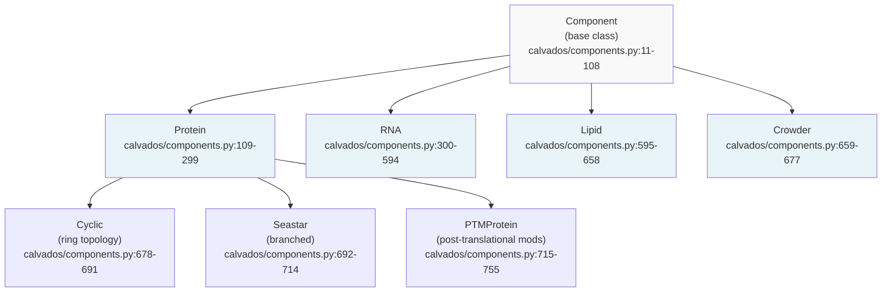
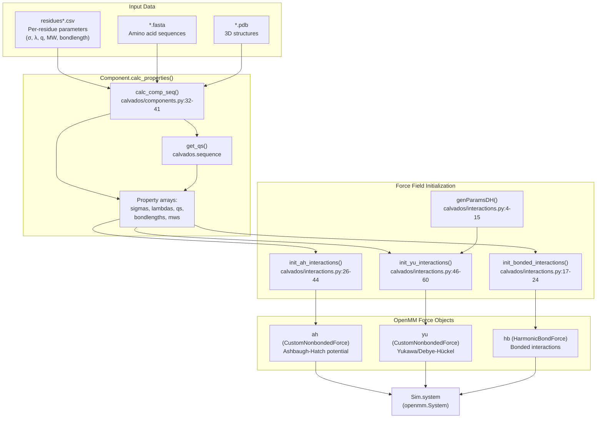
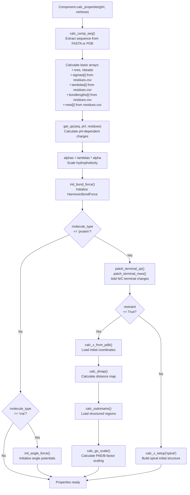
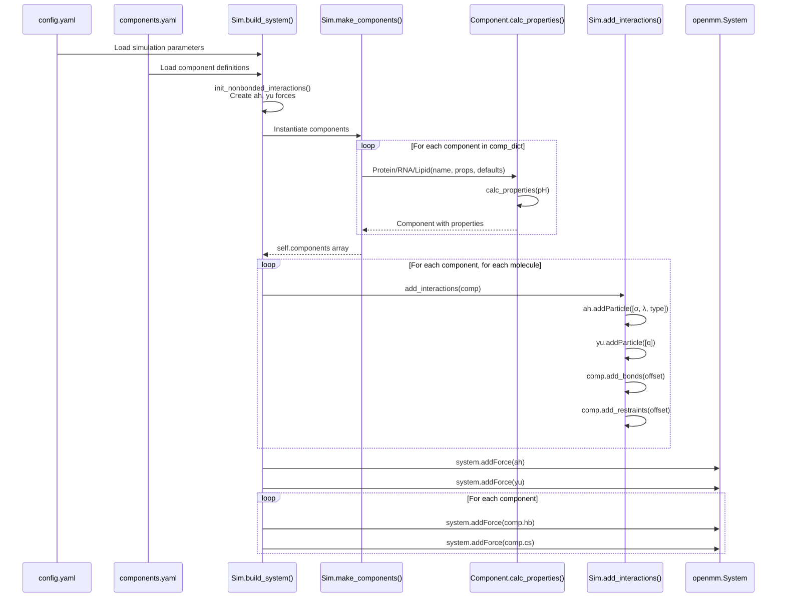

# Molecular Components & Force Fields

<details>
<summary>Relevant source files</summary>

The following files were used as context for generating this wiki page:

- [calvados/components.py](calvados/components.py)
- [calvados/data/default_config.yaml](calvados/data/default_config.yaml)
- [calvados/interactions.py](calvados/interactions.py)
- [calvados/sim.py](calvados/sim.py)

</details>


## Purpose and Scope

This page provides an overview of how CALVADOS represents different molecular components (proteins, RNA, lipids, crowders) and parameterizes the coarse-grained force field. It covers the component class hierarchy, force field parameter sources, and the calculation pipeline that transforms input data into simulation-ready molecular properties.

For detailed information about specific component types, see [Component Class Hierarchy](#3.1), [Protein Components](#3.2), and [RNA Components](#3.3). For force field theory and potential expressions, see [Force Field & Interaction Potentials](#3.4). For simulation setup workflows, see [Simulation Setup & Configuration](#2).

---

## Component Architecture

CALVADOS uses a polymorphic component architecture where all molecular entities inherit from a base `Component` class. Each component type implements specialized behavior while sharing common property calculation and interaction logic.

### Component Class Hierarchy



**Component Class Hierarchy Diagram**

Sources: [calvados/components.py:1-755]()

### Component Type Properties

| Component Type | molecule_type | Key Features | Primary Use Case |
|---------------|---------------|--------------|------------------|
| `Component` | generic | Base class with sequence processing, property calculation | Template for custom molecules |
| `Protein` | `'protein'` | PDB loading, Go-model/harmonic restraints, AlphaFold PAE | Structured/disordered proteins |
| `RNA` | `'rna'` | Two-bead model (phosphate+base), angle forces, base-base interactions | RNA molecules |
| `Lipid` | `'lipid'` or `'cooke_lipid'` | Cosine potential, charge-nonpolar interactions, bilayer assembly | Membrane simulations |
| `Crowder` | `'crowder'` | Simplified polymer, excluded volume only | Molecular crowding agents (e.g., PEG) |
| `Cyclic` | `'cyclic'` | Ring topology with bond between first and last residue | Cyclic peptides |
| `Seastar` | `'seastar'` | Star/branched topology with central hub | Branched polymers |
| `PTMProtein` | `'ptm_protein'` | Protein with attached post-translational modifications | Phosphorylated proteins, glycosylation |

Sources: [calvados/components.py:11-755](), [calvados/sim.py:50-98]()

---

## Force Field Parameterization

The CALVADOS force field combines coarse-grained potentials parameterized from residue-level data. The force field supports multiple variants optimized for different molecular types.

### Force Field Parameter Flow



**Force Field Parameter Flow Diagram**

Sources: [calvados/components.py:43-56](), [calvados/interactions.py:4-68](), [calvados/sim.py:130-155]()

### Force Field Variants

CALVADOS supports multiple force field parameter sets, each optimized for specific molecular types:

| Parameter File | Description | Target Molecules | Key Features |
|---------------|-------------|------------------|--------------|
| `residues_CALVADOS2.csv` | Original CALVADOS force field | Intrinsically disordered proteins (IDPs) | Standard parameters |
| `residues_CALVADOS3.csv` | Updated CALVADOS force field | Structured and disordered proteins | Improved structured protein modeling |
| `residues_C2RNA.csv` | RNA-protein interactions | Mixed protein-RNA systems | Two-bead RNA model parameters |
| `residues_pCALVADOS2.csv` | pH-dependent charges | Phosphorylated proteins | pKa-based charge states |

Each residue parameter file contains columns:
- **one**: Single-letter amino acid code
- **MW**: Molecular weight (amu)
- **sigmas**: Lennard-Jones size parameter (nm)
- **lambdas**: Hydrophobicity parameter (0=hydrophobic, 1=hydrophilic)
- **q**: Residue charge at reference pH
- **bondlength**: Equilibrium bond length (nm)

Sources: [calvados/components.py:26-31](), [calvados/data/]()

---

## Component Property Calculation

Each component calculates its molecular properties through a standardized pipeline implemented in `calc_properties()`. This method is overridden by specialized component types to add molecule-specific features.

### Property Calculation Pipeline



**Component Property Calculation Pipeline**

Sources: [calvados/components.py:43-56,168-189,325-351]()

### Key Methods in Component Lifecycle

| Method | Purpose | Called By | Returns |
|--------|---------|-----------|---------|
| `__init__(name, properties, defaults)` | Initialize component from YAML configuration | `Sim.make_components()` | Component instance |
| `calc_comp_seq()` | Extract sequence from FASTA or PDB | `calc_properties()` | Sets `self.seq`, `self.n_termini`, `self.c_termini` |
| `calc_properties(pH, verbose, comp_setup)` | Calculate all molecular properties | `Sim.make_components()` | Sets arrays (sigmas, lambdas, qs, etc.) |
| `init_bond_force()` | Create HarmonicBondForce object | `calc_properties()` | Sets `self.hb` |
| `bond_check(i, j)` | Determine if beads i,j should be bonded | `add_bonds()` | Boolean |
| `add_bonds(offset)` | Add bonds to force object | `Sim.add_interactions()` | Exclusion map |
| `get_forces()` | Collect all force objects for this component | `Sim.add_forces_to_system()` | Sets `self.forces` list |

Sources: [calvados/components.py:11-108](), [calvados/sim.py:50-98,378-423]()

---

## Integration with Simulation System

The `Sim` class orchestrates component instantiation and force field construction through the `build_system()` method:

### System Building Workflow



**System Building Workflow Sequence**

Sources: [calvados/sim.py:130-223,378-423]()

### Force Assignment Logic

The simulation adds particles to force objects based on component type:

```python
# From Sim.add_interactions() - calvados/sim.py:378-407
# Ashbaugh-Hatch type parameter:
if comp.molecule_type in ['lipid', 'cooke_lipid']:
    type_param = 0  # Lipid
elif comp.molecule_type == 'crowder':
    type_param = -1  # Crowder (excluded volume only)
else:  # protein, RNA
    type_param = 1  # Standard interactions
```

This `type` parameter controls how molecules interact through the `fixed_lambda` mechanism in the Ashbaugh-Hatch potential expression [calvados/interactions.py:32]().

Sources: [calvados/sim.py:378-407](), [calvados/interactions.py:26-44]()

---

## Summary

The molecular component and force field system in CALVADOS provides:

1. **Polymorphic Component Architecture**: Base `Component` class with specialized subclasses (`Protein`, `RNA`, `Lipid`, `Crowder`, `Cyclic`, `Seastar`, `PTMProtein`)
2. **Flexible Force Field Parameterization**: Multiple residue parameter sets (CALVADOS2, CALVADOS3, C2RNA, pCALVADOS2) for different molecular systems
3. **Standardized Property Calculation**: Common `calc_properties()` pipeline with molecule-specific extensions
4. **Modular Force Construction**: Separation between global forces (Ashbaugh-Hatch, Yukawa) and component-specific forces (bonds, restraints, angles)
5. **Type-Based Interaction Control**: Molecule type parameters enable selective interactions (e.g., crowder excluded volume, lipid-specific potentials)

For implementation details on specific component types, see [Protein Components](#3.2) and [RNA Components](#3.3). For force field theory and potential expressions, see [Force Field & Interaction Potentials](#3.4).

---