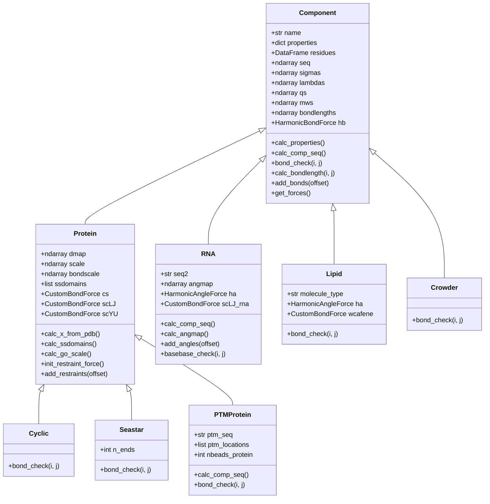
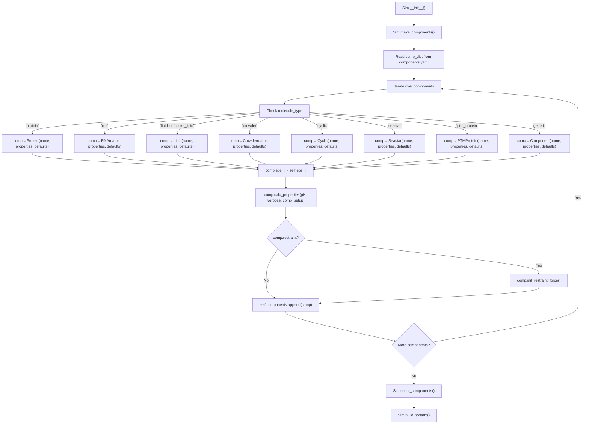

# Component Class Hierarchy

<details>
<summary>Relevant source files</summary>

The following files were used as context for generating this wiki page:

- [calvados/components.py](calvados/components.py)
- [calvados/sim.py](calvados/sim.py)

</details>


## Purpose and Scope

This page documents the component class hierarchy in CALVADOS, which provides a polymorphic system for representing different types of biomolecules (proteins, RNA, lipids, crowders) with specialized behaviors. The hierarchy is defined in [calvados/components.py]() and instantiated during system building in [calvados/sim.py]().

For information about setting up component definitions in configuration files, see [Components Class - Molecular Definitions](#2.2). For details on specific molecular types and their physics, see [Protein Components](#3.2) and [RNA Components](#3.3). For information on force field parameters, see [Force Field & Interaction Potentials](#3.4).

---

## Overview of Component Architecture

CALVADOS uses object-oriented polymorphism to represent diverse molecular types within a unified framework. All molecular components inherit from a base `Component` class, which provides common functionality for:

- Reading residue parameters from CSV files
- Calculating sequence-derived properties (charges, sigmas, lambdas, molecular weights)
- Managing bond topology through `bond_check` methods
- Initializing force objects for OpenMM
- Handling particle placement strategies

Specialized subclasses override key methods to implement molecule-specific behaviors, such as:
- Different bead representations (1-bead for proteins, 2-bead for RNA)
- Custom bonding patterns (cyclic, branched, post-translational modifications)
- Restraint systems (harmonic, Go-model)
- Specialized force field terms (RNA angles, lipid cosine potentials)

This design enables the `Sim` class to treat all components generically during system assembly while preserving molecule-specific physics.

**Sources:** [calvados/components.py:11-108](), [calvados/sim.py:50-98]()

---

## Class Hierarchy Diagram



**Sources:** [calvados/components.py:11-754]()

---

## Base Component Class

The `Component` class [calvados/components.py:11-108]() serves as the foundation for all molecular types in CALVADOS. It implements the core lifecycle of a component:

### Initialization

The constructor [calvados/components.py:14-30]() accepts:
- `name`: Component identifier matching keys in `components.yaml`
- `properties`: Component-specific settings from configuration
- `defaults`: Default values for unspecified properties

Properties are stored as instance attributes, with defaults applied for missing values. The residue parameter file (specified by `fresidues`) is loaded into a pandas DataFrame indexed by one-letter residue codes.

### Sequence and Property Calculation

The `calc_properties` method [calvados/components.py:43-55]() orchestrates:

1. **Sequence determination** via `calc_comp_seq()` [calvados/components.py:32-41]():
   - For restrained molecules: extract sequence from PDB file
   - For unrestrained molecules: read from FASTA file
   - Track N-termini and C-termini for proper bonding

2. **Per-residue property extraction** [calvados/components.py:47-52]():
   - `sigmas`: Lennard-Jones radii
   - `lambdas`: Hydrophobicity parameters for Ashbaugh-Hatch potential
   - `bondlengths`: Equilibrium bond lengths
   - `mws`: Molecular weights
   - `qs`: Charges (pH-dependent via `get_qs`)
   - `alphas`: Scaled lambdas for specialized interactions

3. **Bond force initialization** [calvados/components.py:55]()

### Bonding Logic

The `bond_check` method [calvados/components.py:73-75]() is a placeholder returning `False` by default. Subclasses override this to define bonding patterns (e.g., sequential backbone bonds for proteins, phosphate-base bonds for RNA).

The `add_bonds` method [calvados/components.py:85-96]() iterates over bead pairs, calling `bond_check` to determine which pairs should be bonded. For each bonded pair:
- Calculates equilibrium bond length via `calc_bondlength` [calvados/components.py:77-79]()
- Adds harmonic bond to `self.hb` (OpenMM `HarmonicBondForce`)
- Records bond in `self.bond_pairlist` for output
- Returns exclusion map for non-bonded forces

### Particle Placement

The `calc_x_setup` method [calvados/components.py:63-70]() generates initial coordinates:
- `'spiral'`: Helical spiral configuration [calvados/build.py]()
- `'compact'`: Compact random configuration
- `'linear'`: Extended linear chain

**Sources:** [calvados/components.py:11-108]()

---

## Protein Component

The `Protein` class [calvados/components.py:109-299]() extends `Component` with support for structured proteins using PDB input and restraints.

### Key Features

| Feature | Description | Lines |
|---------|-------------|-------|
| **PDB Loading** | Extract coordinates from PDB files via `calc_x_from_pdb()` | [115-119]() |
| **Restraint Systems** | Harmonic or Go-model restraints for structured regions | [231-272]() |
| **AlphaFold Integration** | PAE-based confidence weighting for Go-model restraints | [127-147]() |
| **Terminal Charges** | pH-dependent charge patching at termini | [174-177]() |
| **Distance Maps** | Pairwise distance matrix from PDB structure | [57-61]() |

### Harmonic Restraints

For proteins with defined structured domains (specified in `domains.yaml`), harmonic restraints [calvados/components.py:249-253]() are applied:
- `calc_ssdomains()` [122-125]() reads domain definitions
- Restraints applied only to residue pairs both within structured regions
- Force constant `k_harmonic` (typically 700 kJ/mol/nm²)
- Equilibrium distance from PDB structure

### Go-Model Restraints

The Go-model [calvados/components.py:254-271]() provides structure-based restraints weighted by confidence:

1. **B-factor confidence** [127-136](): 
   - Extracted from PDB B-factor column
   - Sigmoid transformation: `bfac_sigm = sigmoid(bfac_width * (bfac_map - bfac_shift))`
   - Default: `bfac_width=80`, `bfac_shift=0.1`

2. **PAE confidence** [138-141]():
   - Predicted aligned error from AlphaFold2
   - Sigmoid transformation: `pae_sigm = sigmoid(-pae_width * (pae/10 - pae_shift))`
   - Default: `pae_width=8`, `pae_shift=0.4`

3. **Combined scaling** [144]():
   - `scale[i,j] = bfac_sigm[i,j] * pae_sigm[i,j]`
   - Restraint force constant: `k = k_go * scale[i,j]`
   - Typical `k_go = 8373` kJ/mol/nm²

4. **Complementary non-bonded scaling** [146]():
   - For low-confidence pairs, reduce restraints but maintain non-bonded interactions
   - `bondscale[i,j] = sigmoid(-bscale_width * (scale[i,j] - bscale_shift))`
   - Creates smooth transition between restrained and unrestrained regions

### Bond Length Calculation

The overridden `calc_bondlength` method [calvados/components.py:190-209]() implements complex logic:
- **No restraints**: Standard average of neighboring bead sizes
- **Harmonic restraints**: PDB distance if both residues in same domain, else standard length
- **Go-model restraints**: Interpolation between PDB distance and standard length based on `bondscale`

### Bonding Pattern

The `bond_check` override [calvados/components.py:211-216]() ensures:
- Sequential backbone bonds: `j == i+1`
- No bonds across chain breaks: respects `n_termini` and `c_termini`

**Sources:** [calvados/components.py:109-299]()

---

## RNA Component

The `RNA` class [calvados/components.py:300-594]() implements a two-bead-per-nucleotide coarse-grained model with specialized forces.

### Two-Bead Representation

Each nucleotide is represented by two beads [calvados/components.py:368-394]():
- **Phosphate bead (p)**: Index `2*i` for nucleotide `i`
- **Base bead (r or s)**: Index `2*i+1`
  - `r`: Unstructured RNA regions
  - `s`: Structured RNA regions (from domains.yaml)

The sequence string `self.seq` contains single-bead codes (r/s), while `self.seq2` contains two-bead codes (pr, ps, etc.) used for property lookups.

### Specialized Force Terms

| Force Type | Implementation | Purpose |
|------------|----------------|---------|
| **Phosphate-Phosphate Bonds** | Harmonic bonds, `rna_kb1` | RNA backbone |
| **Phosphate-Base Bonds** | Harmonic bonds, `rna_kb2` | Connects base to backbone |
| **Base-Base Interactions** | Scaled LJ via `scLJ_rna` | Neighboring base stacking |
| **Angle Potentials** | Harmonic angles, `rna_ka` | Phosphate-phosphate-phosphate angles |

### Bond and Angle Checks

Three specialized check methods define RNA topology:

1. **bond_check** [calvados/components.py:449-459]():
   - Phosphate-phosphate: `i%2==0 and j==i+2`
   - Phosphate-base: `i%2==0 and j==i+1`
   - Respects chain termini

2. **basebase_check** [calvados/components.py:468-473]():
   - Neighboring bases: `i%2==1 and j==i+2`
   - Excluded across chain breaks

3. **angle_check** [calvados/components.py:461-466]():
   - Phosphate triplets: `i%2==0 and j==i+4`
   - Excluded at termini

### Angle Force Implementation

The `add_angles` method [calvados/components.py:511-525]() creates harmonic angle potentials:
- Angle formed by beads `(i, i+2, i+4)` where all are phosphates
- Equilibrium angle `rna_pa` (from PDB if restrained, else default)
- Force constant `rna_ka`
- Angles stored in `self.angle_list` for output

### RNA-Specific Restraints

For structured RNA [calvados/components.py:547-567]():
- Harmonic restraints applied to non-bonded pairs within structured domains
- `restraint_check` [531-545]() ensures restraints don't duplicate bond/angle/basebase terms
- Equilibrium distance from PDB structure

**Sources:** [calvados/components.py:300-594]()

---

## Lipid Component

The `Lipid` class [calvados/components.py:595-658]() represents membrane lipids with two variants:

### Molecule Types

| Type | Description | Bond Forces |
|------|-------------|-------------|
| `'lipid'` | Standard lipid model | Harmonic bonds + angle forces |
| `'cooke_lipid'` | Cooke model [Cooke et al. 2005] | FENE bonds + harmonic bending |

### Standard Lipid Model

For `molecule_type='lipid'` [calvados/components.py:638-656]():
- **Adjacent bonds** (i, i+1): Strong harmonic bonds with `k=1700` kJ/mol/nm²
- **Angle forces** [652-656]():
  - Head group angle (i=0): `2π/3` radians, `k=7/2` kJ/mol/rad²
  - Tail angles: `π` radians, `k=7` kJ/mol/rad²

### Cooke Lipid Model

For `molecule_type='cooke_lipid'` [calvados/components.py:632-650]():
- **FENE bonds** (i, i+1) via `wcafene` force [621](): 
  - Spring constant: `kfene = 30 * 3 * eps_lj / d²`
- **Bending restraints** (i, i+2): Harmonic with equilibrium `4*d`, `k = 30*eps_lj/d²`

### Bonding Pattern

The `bond_check` override [calvados/components.py:609-613]() allows:
- Adjacent bonds: `j == i+1`
- Next-nearest bonds: `j == i+2` (for angles)

Both models use specialized non-bonded interactions (cosine potential and charge-nonpolar terms) initialized in [calvados/sim.py:156-165]().

**Sources:** [calvados/components.py:595-658](), [calvados/sim.py:156-165]()

---

## Crowder Component

The `Crowder` class [calvados/components.py:659-677]() represents simple excluded-volume particles (e.g., PEG polymers) for studying crowding effects.

### Characteristics

- **Minimal implementation**: Only overrides `bond_check` [672-676]()
- **Sequential bonding**: `j == i+1` (simple linear chain)
- **No restraints**: Uses standard non-bonded interactions
- **Negative type flag**: `type=-1` in Ashbaugh-Hatch force [calvados/sim.py:390]() modulates interactions with other species

### Typical Usage

Crowders are placed outside the condensate region in slab simulations [calvados/sim.py:176-178]():
- Half above slab: `z > box[2]/2 + slab_outer`
- Half below slab: `z < box[2]/2 - slab_outer`

**Sources:** [calvados/components.py:659-677](), [calvados/sim.py:390]()

---

## Specialized Protein Variants

### Cyclic Peptides

The `Cyclic` class [calvados/components.py:678-690]() creates ring topologies by overriding `bond_check`:

```python
condition0 = (j == i+1)                      # Sequential bonds
condition1 = ((j == self.nbeads - 1) and i == 0)  # Closing bond
condition = condition0 or condition1
```

This creates a bond between the first and last residues, forming a closed loop.

### Seastar (Branched) Peptides

The `Seastar` class [calvados/components.py:692-713]() creates star-shaped branched structures:

- **Central bead** at index 0
- **Multiple branches** extending from center
- Branch count specified by `n_ends` attribute

The `bond_check` logic [calvados/components.py:698-713]():
1. Calculate branch length: `branch_length = (nbeads-1) / n_ends`
2. Sequential bonds within branches: `j == i+1` except at branch starts
3. Central bonds: Connect bead 0 to first bead of each branch

### PTM Proteins

The `PTMProtein` class [calvados/components.py:715-754]() adds post-translational modifications as additional beads attached to specific residues:

- **Protein sequence**: Read from FASTA as usual
- **PTM sequence**: Separate sequence for modification (e.g., phosphorylation group)
- **PTM locations**: List of 1-based residue indices [729]()

The modified sequence [calvados/components.py:729-730]():
```python
for ptm_idx in self.ptm_locations:
    self.seq = self.seq + self.ptm_seq
```

The `bond_check` override [calvados/components.py:735-754]() creates three bond types:
1. Protein backbone bonds (residue i to i+1)
2. Attachment bonds (residue to PTM)
3. PTM internal bonds (within modification chain)

**Sources:** [calvados/components.py:678-754]()

---

## Component Instantiation Flow

The following diagram shows how components are created during simulation setup:



### Implementation Details

The `make_components` method [calvados/sim.py:50-98]() implements this flow:

1. **Type dispatch** [55-84](): Uses `molecule_type` property to select appropriate class
2. **Setup strategy** [58-83](): Sets `comp_setup` based on molecule type:
   - Proteins, cyclic, seastar, PTM, crowders: `'compact'`
   - RNA: `'spiral'`
   - Lipids: `'linear'`
3. **Shared parameters** [86](): All components receive `eps_lj` from simulation config
4. **Property calculation** [87](): Calls `calc_properties` with pH and setup strategy
5. **Restraint initialization** [88-96]():
   - For Go-model: Pass LJ and Yukawa parameters [90-92]()
   - For harmonic: No additional parameters [95]()
   - Set `self.use_restraints` flag [96]()
6. **Component storage** [98](): Append to `self.components` array

The resulting array of components is then used in `build_system()` to:
- Add particles to OpenMM system [calvados/sim.py:197-198]()
- Place molecules in simulation box [202-206]()
- Add interactions and forces [207]()

**Sources:** [calvados/sim.py:50-98](), [calvados/sim.py:130-223]()

---

## Component Type Comparison Table

| Component | Inherits From | Key Methods Overridden | Specialized Forces | Typical Use Case |
|-----------|---------------|----------------------|-------------------|------------------|
| **Component** | — | — | Harmonic bonds | Generic molecules |
| **Protein** | Component | `calc_properties`, `bond_check`, `calc_bondlength`, `add_restraints` | Harmonic/Go restraints, scaled LJ/YU | Structured or disordered proteins |
| **RNA** | Component | `calc_comp_seq`, `calc_properties`, `bond_check`, `add_bonds` | Angles, base-base LJ, harmonic restraints | RNA molecules |
| **Lipid** | Component | `init_bond_force`, `bond_check`, `add_bonds` | Angles (standard), FENE+bending (Cooke), cosine, charge-nonpolar | Membranes, bilayers |
| **Crowder** | Component | `bond_check` | — | Excluded volume agents (PEG) |
| **Cyclic** | Protein | `bond_check` | Same as Protein | Cyclic peptides |
| **Seastar** | Protein | `bond_check` | Same as Protein | Branched peptides |
| **PTMProtein** | Protein | `calc_comp_seq`, `bond_check` | Same as Protein | Proteins with PTMs |

### Property Summary

| Property | Component | Protein | RNA | Lipid | Crowder |
|----------|-----------|---------|-----|-------|---------|
| **nbeads** | len(seq) | len(seq) | 2*len(seq) | len(seq) | len(seq) |
| **Restraints** | No | Optional | Optional | No | No |
| **PDB Input** | Optional | Optional | Optional | No | No |
| **Domains** | No | Optional | Optional | No | No |
| **Terminal Charges** | No | Yes | No | No | No |
| **Angles** | No | No | Yes | Yes (std) / No (Cooke) | No |

**Sources:** [calvados/components.py:11-754]()

---

## Integration with Simulation Workflow

The component hierarchy integrates with the broader simulation system through well-defined interfaces:

### During System Building

1. **make_components()** [calvados/sim.py:50-98](): Component objects created from YAML
2. **add_particles_system()** [456-460](): Masses added to OpenMM system
3. **add_mdtraj_topol()** [431-454](): MDTraj topology constructed
4. **place_molecule() / place_bilayer()** [292-336](): Initial coordinates assigned
5. **add_interactions()** [378-422](): Non-bonded parameters set
6. **add_bonds()** [338-342](): Bonded forces created
7. **add_restraints()** [350-355](): Restraints applied (if enabled)

### Key Polymorphic Behaviors

The `Sim` class calls component methods generically [calvados/sim.py:192-223]():
```python
for cidx, comp in enumerate(self.components):
    for idx in range(comp.nmol):
        self.add_mdtraj_topol(comp)      # Uses comp.seq, comp.bond_check
        self.add_particles_system(comp.mws)
        xs = self.place_molecule(comp)    # Uses comp.xinit
        self.add_interactions(comp)       # Uses comp.sigmas, comp.lambdas, comp.qs
```

Each component provides these properties/methods, but with molecule-specific implementations. The `Sim` class doesn't need to know component types—it simply calls the interface methods and each component responds according to its specialization.

**Sources:** [calvados/sim.py:130-223](), [calvados/sim.py:378-422]()

---