# Protein Components

<details>
<summary>Relevant source files</summary>

The following files were used as context for generating this wiki page:

- [calvados/components.py](calvados/components.py)
- [calvados/sim.py](calvados/sim.py)
- [examples/single_IDR/prepare.py](examples/single_IDR/prepare.py)
- [examples/single_MDP/prepare.py](examples/single_MDP/prepare.py)

</details>


## Purpose and Scope

This page provides detailed documentation of the `Protein` class and its specialized subclasses in CALVADOS. It covers how structured and disordered proteins are represented, how PDB structures are loaded, how restraints are applied (both harmonic and Go-model types), and how AlphaFold confidence data is integrated for structure-based modeling.

For information about:
- The base `Component` class and other molecule types, see [Component Class Hierarchy](#3.1)
- RNA-specific implementation details, see [RNA Components](#3.3)
- Restraint force calculations and parameters, see [Restraints System](#3.5)
- Sequence-based property calculations, see [Sequence Analysis & Properties](#3.6)

---

## Protein Class Overview

The `Protein` class is defined in [calvados/components.py:109-299]() and inherits from the base `Component` class. It is the primary class for representing protein molecules in CALVADOS simulations, supporting both intrinsically disordered regions (IDRs) and structured proteins with restraints.

**Key Capabilities:**
- Loading 3D structures from PDB files
- Applying harmonic restraints to structured regions
- Implementing Go-model restraints with AlphaFold confidence weighting
- Terminal charge patching for N- and C-termini
- Specialized bonding logic for polypeptide chains

**Class Hierarchy:**

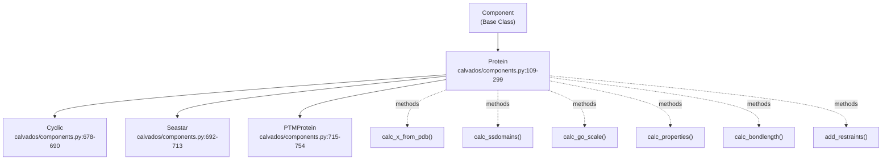

**Sources:** [calvados/components.py:109-299]()

---

## Initialization and Configuration

The `Protein` class is instantiated by the `Sim.make_components()` method based on the `molecule_type` field in the component configuration.

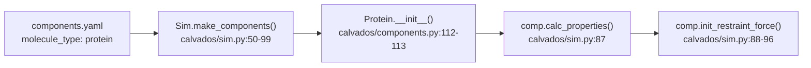

**Instantiation Flow:**

1. **Configuration Loading:** The `Components` class reads `components.yaml` containing protein definitions
2. **Class Selection:** [calvados/sim.py:56-59]() checks `molecule_type == 'protein'` and instantiates `Protein`
3. **Property Assignment:** [calvados/components.py:112-113]() calls parent `Component.__init__()` to set attributes
4. **Property Calculation:** [calvados/sim.py:87]() calls `calc_properties()` to compute molecular properties
5. **Restraint Initialization:** [calvados/sim.py:88-96]() conditionally initializes restraint forces

**Sources:** [calvados/components.py:109-113](), [calvados/sim.py:50-99]()

---

## Structure Loading from PDB

For proteins with `restraint = True`, CALVADOS loads initial coordinates from PDB files rather than generating them algorithmically.

### PDB Loading Workflow

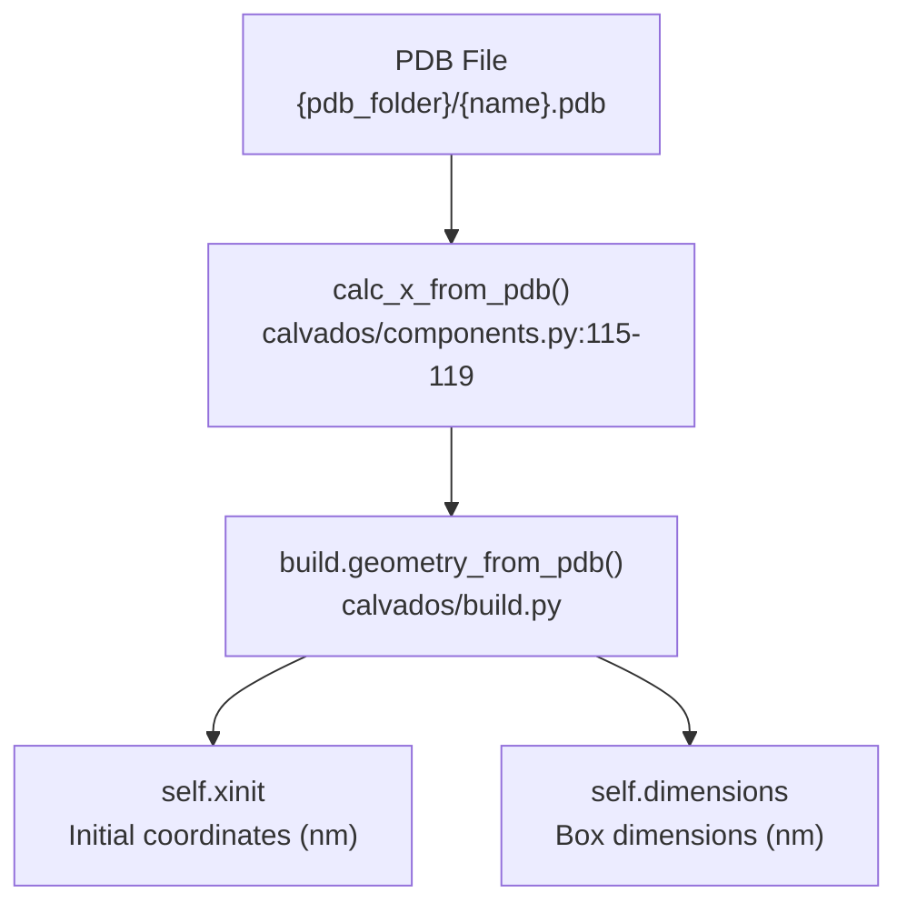

**Key Method: `calc_x_from_pdb()`**

[calvados/components.py:115-119]()
```python
def calc_x_from_pdb(self):
    """ Calculate protein positions from pdb. """
    
    input_pdb = f'{self.pdb_folder}/{self.name}.pdb'
    self.xinit, self.dimensions = build.geometry_from_pdb(input_pdb,use_com=self.use_com)
```

**Parameters:**
| Parameter | Type | Description |
|-----------|------|-------------|
| `pdb_folder` | str | Directory containing PDB and PAE files |
| `name` | str | Component name (matches PDB filename) |
| `use_com` | bool | Use center of mass for each residue instead of CA atom |

**Behavior:**
- Reads CA atom coordinates (or calculates center of mass if `use_com=True`)
- Returns array of shape `(nres, 3)` in nanometers
- Extracts box dimensions from PDB if present

**Sources:** [calvados/components.py:115-119](), [examples/single_MDP/prepare.py:72]()

---

## Restraint Systems

The `Protein` class supports two restraint types controlled by the `restraint_type` parameter: `'harmonic'` and `'go'`.

### Restraint Type Decision Flow

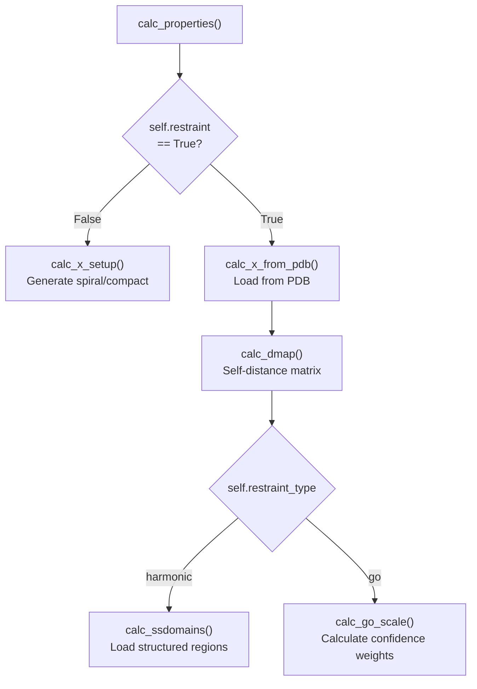

**Sources:** [calvados/components.py:168-188]()

---

### Harmonic Restraints

Harmonic restraints are applied to specific structured regions (secondary structure domains) defined in a `domains.yaml` file. Residue pairs within these domains are restrained to their PDB distances.

**Configuration Method: `calc_ssdomains()`**

[calvados/components.py:121-125]()
```python
def calc_ssdomains(self):
    """ Get bounds for restraints (harmonic). """
    
    self.ssdomains = build.get_ssdomains(self.name,self.fdomains)
```

**Domain Definition Format (`domains.yaml`):**
```yaml
protein_name:
  - [10, 50]   # First structured region: residues 10-50
  - [80, 120]  # Second structured region: residues 80-120
```

**Restraint Application Logic:**

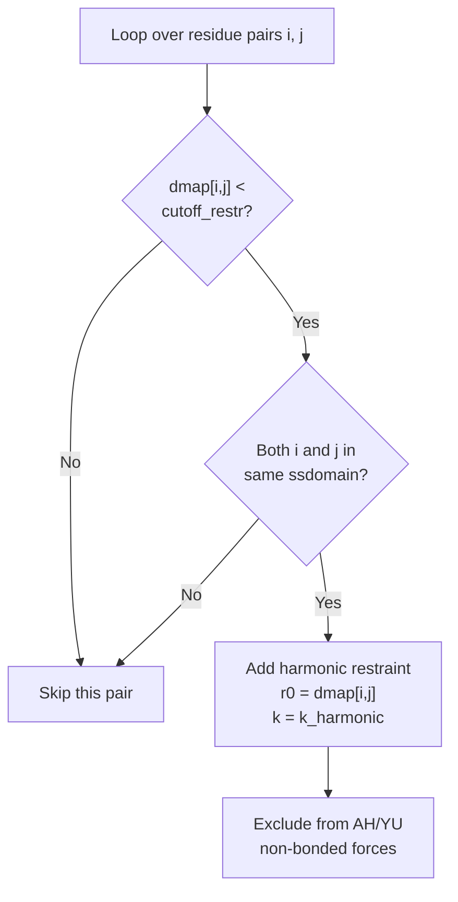

**Restraint Parameters:**
| Parameter | Default | Description |
|-----------|---------|-------------|
| `cutoff_restr` | varies | Maximum distance for restraints (nm) |
| `k_harmonic` | 700 | Force constant (kJ/mol/nm²) |

**Sources:** [calvados/components.py:121-125, 183-184, 249-253](), [examples/single_MDP/prepare.py:68-74]()

---

### Go-Model Restraints

Go-model restraints apply distance-dependent forces weighted by structure confidence metrics from AlphaFold. The weighting combines B-factors and Predicted Aligned Error (PAE) scores.

**Confidence Weighting Calculation: `calc_go_scale()`**

[calvados/components.py:127-147]()

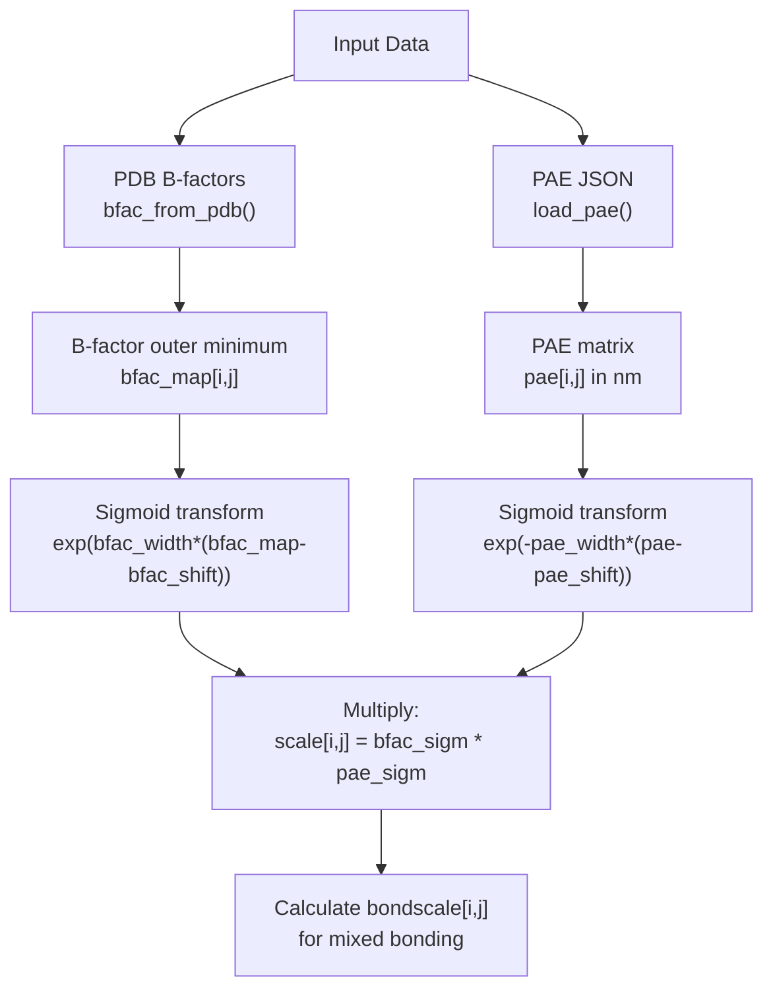

**Calculation Steps:**

1. **B-factor Matrix** [calvados/components.py:133-136](): 
   - Load B-factors from PDB (normalized 0-1)
   - Create pairwise minimum: `bfac_map[i,j] = min(bfac[i], bfac[j])`
   - Transform with sigmoid: `exp(width*(bfac_map - shift)) / (exp(...) + 1)`

2. **PAE Matrix** [calvados/components.py:139-141]():
   - Load PAE from AlphaFold JSON file
   - Symmetrize if needed
   - Convert from Ångström to nanometers (`/ 10`)
   - Transform with sigmoid: `exp(-width*(pae - shift)) / (exp(...) + 1)`

3. **Combined Scale** [calvados/components.py:144]():
   - `scale[i,j] = bfac_sigmoid * pae_sigmoid`
   - Range: [0, 1], where 1 = high confidence

4. **Bond Scale** [calvados/components.py:146]():
   - Controls mixing of default bonds vs. PDB distances
   - `bondscale[i,j]` = sigmoid that decreases as `scale[i,j]` increases

**Tunable Parameters:**
| Parameter | Default | Description |
|-----------|---------|-------------|
| `bfac_shift` | 0.1 | B-factor sigmoid center |
| `bfac_width` | 80 | B-factor sigmoid steepness |
| `pae_shift` | 0.4 | PAE sigmoid center (nm) |
| `pae_width` | 8 | PAE sigmoid steepness |
| `colabfold` | 0 | PAE format (0=EBI, 1/2=Colabfold) |
| `k_go` | varies | Go-model force constant |

**Sources:** [calvados/components.py:127-147](), [examples/single_MDP/prepare.py:72-74]()

---

### AlphaFold PAE Integration

The Predicted Aligned Error (PAE) from AlphaFold2 provides residue-pair confidence estimates. CALVADOS uses this to weight Go-model restraints.

**PAE File Format:**

AlphaFold outputs PAE as JSON:
```json
{
  "predicted_aligned_error": [
    [0.5, 2.3, ...],
    [2.1, 0.4, ...],
    ...
  ]
}
```

**Loading and Processing:**

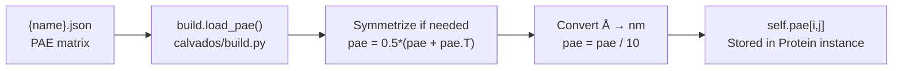

**PAE Matrix Properties:**
- Units: After conversion, stored in nanometers
- Symmetry: Enforced via `symmetrize=True` parameter
- Meaning: Lower values indicate higher confidence
- Usage: Fed into sigmoid transform with `pae_shift` and `pae_width`

**Sources:** [calvados/components.py:138-141]()

---

## Sequence and Property Calculation

The `calc_properties()` method orchestrates calculation of all protein-specific properties.

### Property Calculation Workflow

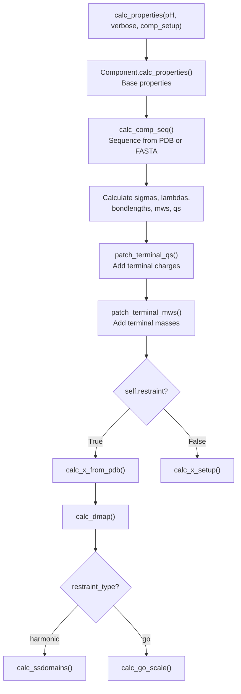

**Key Steps:**

1. **Base Property Calculation** [calvados/components.py:171](): Calls parent `Component.calc_properties()` which:
   - Determines sequence from PDB or FASTA
   - Extracts per-residue parameters (σ, λ, bondlength, MW, q)
   - Initializes bond force

2. **Terminal Charge Patching** [calvados/components.py:176]():
   ```python
   self.qs = patch_terminal_qs(self.qs, self.n_termini, self.c_termini, loc=self.charge_termini)
   ```
   - Adds +1 charge to N-termini
   - Adds -1 charge to C-termini
   - `charge_termini` can be `'N'`, `'C'`, `'both'`, or `None`

3. **Terminal Mass Adjustment** [calvados/components.py:177]():
   ```python
   self.mws = patch_terminal_mws(self.mws, self.n_termini, self.c_termini, loc=self.charge_termini)
   ```
   - Adjusts molecular weights for charged termini

**Terminal Handling Parameters:**
| Parameter | Options | Description |
|-----------|---------|-------------|
| `charge_termini` | `'N'`, `'C'`, `'both'`, `None` | Which termini to charge |
| `n_termini` | list[int] | Indices of N-terminal residues |
| `c_termini` | list[int] | Indices of C-terminal residues |

**Sources:** [calvados/components.py:168-188]()

---

## Bonding Logic

Proteins use specialized bonding rules that account for chain breaks and restraint-based bond length modifications.

### Bond Checking

[calvados/components.py:211-216]()
```python
def bond_check(self, i: int, j: int):
    """ Define bonded term conditions. """
    
    condition = (j == i+1)
    condition_termini = (i not in self.c_termini) and (j not in self.n_termini)
    return condition and condition_termini
```

**Bonding Rules:**
- Bond consecutive residues (`j == i+1`)
- **Skip chain breaks:** Don't bond C-terminus to next N-terminus
- Handles multi-chain proteins via `n_termini` and `c_termini` lists

### Bond Length Calculation with Restraints

The `calc_bondlength()` method returns different bond lengths depending on restraint type and confidence.

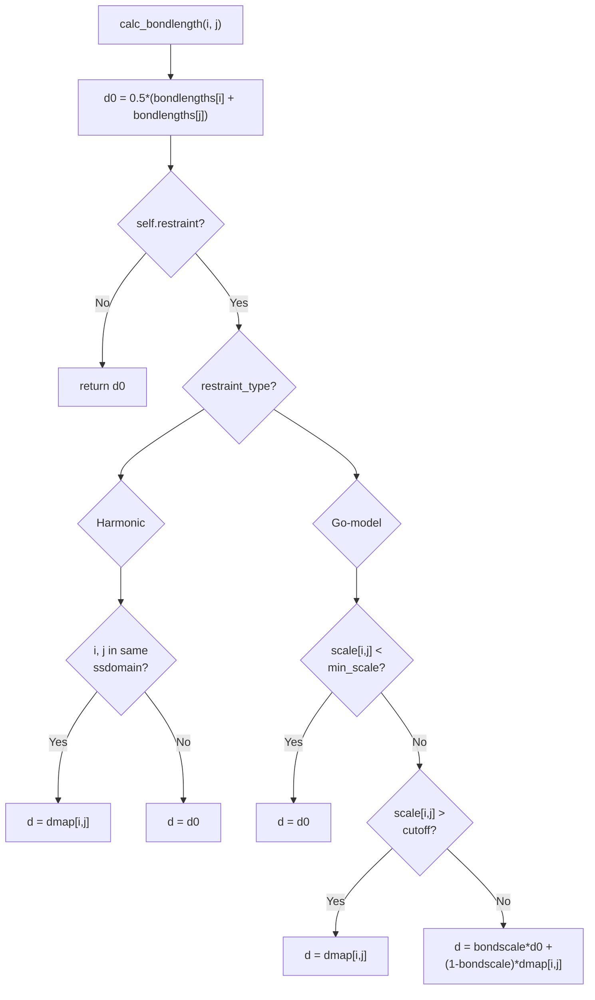

**Implementation** [calvados/components.py:190-209]():

```python
def calc_bondlength(self, i, j, min_scale = 0.05, cutoff_mix_in_LJYU = 0.15):
    d0 = 0.5 * (self.bondlengths[i] + self.bondlengths[j])
    if self.restraint:
        if self.restraint_type == 'harmonic':
            ss = build.check_ssdomain(self.ssdomains,i,j,req_both=False)
            d = self.dmap[i,j] if ss else d0
        elif self.restraint_type == 'go':
            if self.scale[i,j] < min_scale:
                d = d0
            elif self.scale[i,j] > cutoff_mix_in_LJYU:
                d = self.dmap[i,j]
            else:
                d = self.bondscale[i,j] * d0 + (1. - self.bondscale[i,j]) * self.dmap[i,j]
    else:
        d = d0
    return d
```

**Logic Summary:**
| Scenario | Bond Length |
|----------|-------------|
| No restraints | Default: `0.5*(σᵢ + σⱼ)` |
| Harmonic, in domain | PDB distance: `dmap[i,j]` |
| Harmonic, outside domain | Default |
| Go, low confidence | Default |
| Go, high confidence | PDB distance |
| Go, medium confidence | Linear interpolation |

**Sources:** [calvados/components.py:190-209, 218-229]()

---

## Restraint Force Assembly

Restraints are added to the simulation system via the `add_restraints()` method, which is called per molecule during system building.

### Restraint Addition Workflow

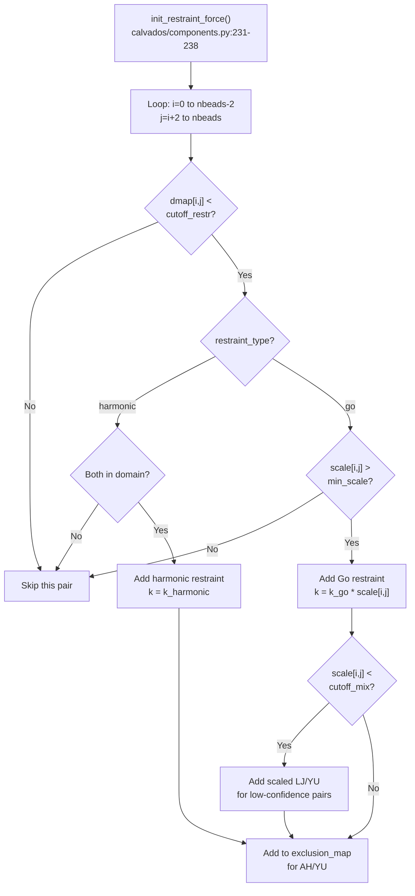

**Key Implementation Details:**

1. **Initialization** [calvados/components.py:231-238]():
   - Creates `HarmonicBondForce` for both restraint types
   - For Go-model: Also initializes scaled LJ and YU forces

2. **Restraint Loop** [calvados/components.py:240-272]():
   - Only considers pairs with `j >= i+2` (exclude bonds and angles)
   - Applies distance cutoff via `dmap[i,j] <= cutoff_restr`
   - Excludes restrained pairs from non-bonded forces

3. **Scaled Forces for Go-Model** [calvados/components.py:260-265]():
   - For low-confidence pairs (`scale < cutoff_mix_in_LJYU`), adds:
     - Scaled Lennard-Jones interactions
     - Scaled Yukawa electrostatics
   - Prevents "unphysical gaps" in low-confidence regions

**Output Files:**

The protein writes restraint details for debugging:
- `restr_{name}.txt`: List of restraints with distances and force constants
- `scaled_LJ_{name}.txt`: Scaled LJ interactions (Go-model only)
- `scaled_YU_{name}.txt`: Scaled Yukawa interactions (Go-model only)

**Sources:** [calvados/components.py:231-272, 274-291]()

---

## Force Assembly

The `get_forces()` method collects all force objects that will be added to the OpenMM system.

[calvados/components.py:293-298]()
```python
def get_forces(self):
    self.forces = [self.hb]
    if self.restraint:
        self.forces.append(self.cs)
        if self.restraint_type == 'go':
            self.forces.extend([self.scLJ, self.scYU])
```

**Force Objects:**

| Force | Type | Description |
|-------|------|-------------|
| `self.hb` | `HarmonicBondForce` | Backbone bonds |
| `self.cs` | `HarmonicBondForce` | Restraints (harmonic or Go) |
| `self.scLJ` | `CustomBondForce` | Scaled LJ (Go-model only) |
| `self.scYU` | `CustomBondForce` | Scaled Yukawa (Go-model only) |

**Integration with System:**

These forces are added to the OpenMM system in [calvados/sim.py:225-241]():
```python
def add_forces_to_system(self):
    # ... non-bonded forces first ...
    for comp in self.components:
        comp.get_forces()
        for force in comp.forces:
            self.system.addForce(force)
```

**Sources:** [calvados/components.py:293-298](), [calvados/sim.py:236-240]()

---

## Specialized Protein Types

CALVADOS provides three specialized protein subclasses for non-linear topologies.

### Class Comparison

| Class | Topology | Bond Pattern | Use Case |
|-------|----------|--------------|----------|
| `Protein` | Linear chain | `i→i+1` | Standard proteins/IDRs |
| `Cyclic` | Ring | `i→i+1`, `N→C` | Cyclic peptides |
| `Seastar` | Branched | Center→branches | Star polymers |
| `PTMProtein` | Branched | Protein + PTM chains | Post-translational modifications |

### Cyclic Peptides

[calvados/components.py:678-690]()

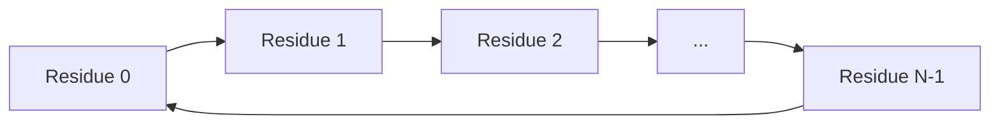

**Modified Bond Check:**
```python
def bond_check(self, i: int, j: int):
    condition0 = (j == i+1)
    condition1 = ((j == self.nbeads - 1) and i == 0)  # Close the ring
    condition = condition0 or condition1
    return condition
```

### Seastar Peptides

[calvados/components.py:692-713]()

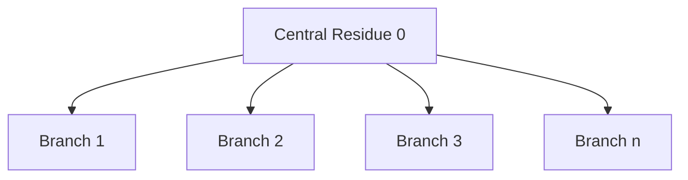

**Bonding Logic:**
- Central bead connects to first residue of each branch
- Within each branch: sequential bonding
- Parameter `n_ends` specifies number of branches

### PTM Proteins

[calvados/components.py:715-754]()

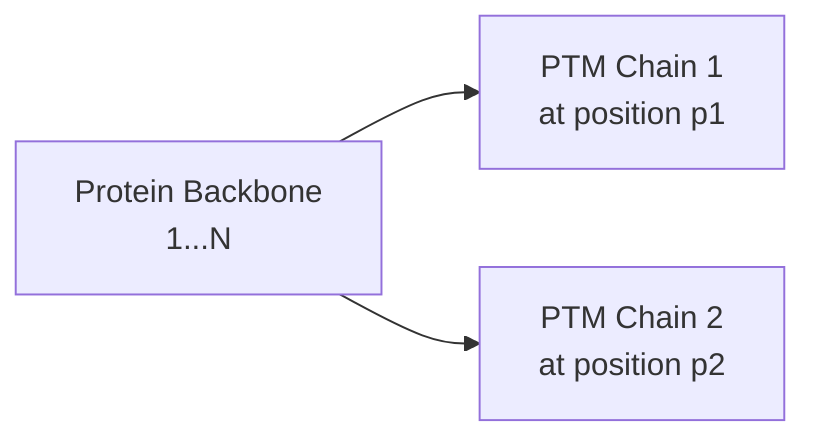

**Configuration:**
- `ffasta` contains both protein and PTM sequences
- `ptm_name`: Name of PTM sequence in FASTA
- `ptm_locations`: List of attachment sites (1-based)

**Bonding:**
- Protein backbone: `i→i+1` for `i < nbeads_protein`
- PTM attachment: Specified residue → first PTM bead
- PTM chains: Sequential bonding within each PTM

**Sources:** [calvados/components.py:678-754]()

---

## Summary of Key Methods

| Method | Purpose | Input | Output |
|--------|---------|-------|--------|
| `__init__()` | Initialize protein component | name, properties, defaults | Protein instance |
| `calc_properties()` | Calculate all properties | pH, verbose, comp_setup | Sets sigmas, qs, positions |
| `calc_x_from_pdb()` | Load PDB structure | - | Sets xinit, dimensions |
| `calc_ssdomains()` | Load structured regions | - | Sets ssdomains |
| `calc_go_scale()` | Calculate Go weights | - | Sets scale, bondscale, bfac_map, pae |
| `calc_bondlength()` | Get bond length | i, j | Bond length (nm) |
| `bond_check()` | Check if bonded | i, j | Boolean |
| `add_bonds()` | Add bonds to system | offset | exclusion_map |
| `init_restraint_force()` | Initialize restraint forces | eps_lj, cutoff_lj, eps_yu, k_yu | Sets cs, scLJ, scYU |
| `add_restraints()` | Add restraints to system | offset | exclusion_map |
| `get_forces()` | Collect force objects | - | Sets self.forces |

**Sources:** [calvados/components.py:109-299]()

---