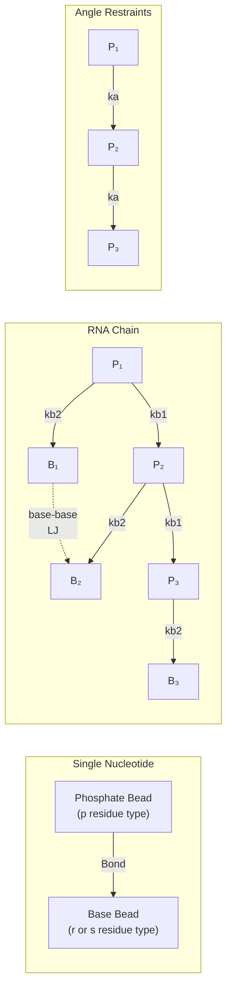
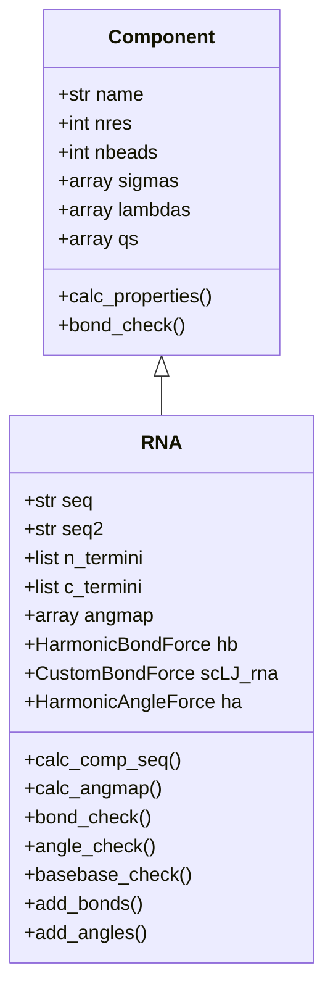
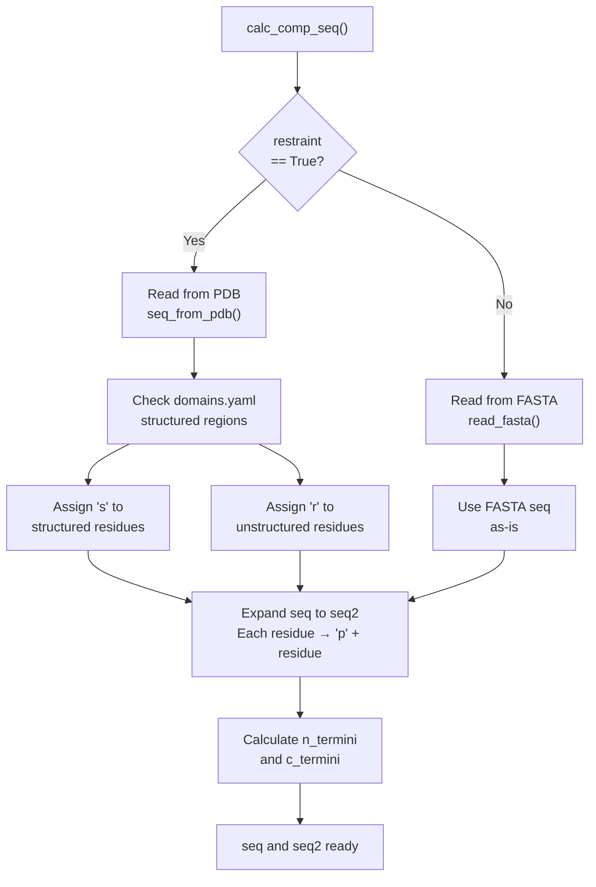
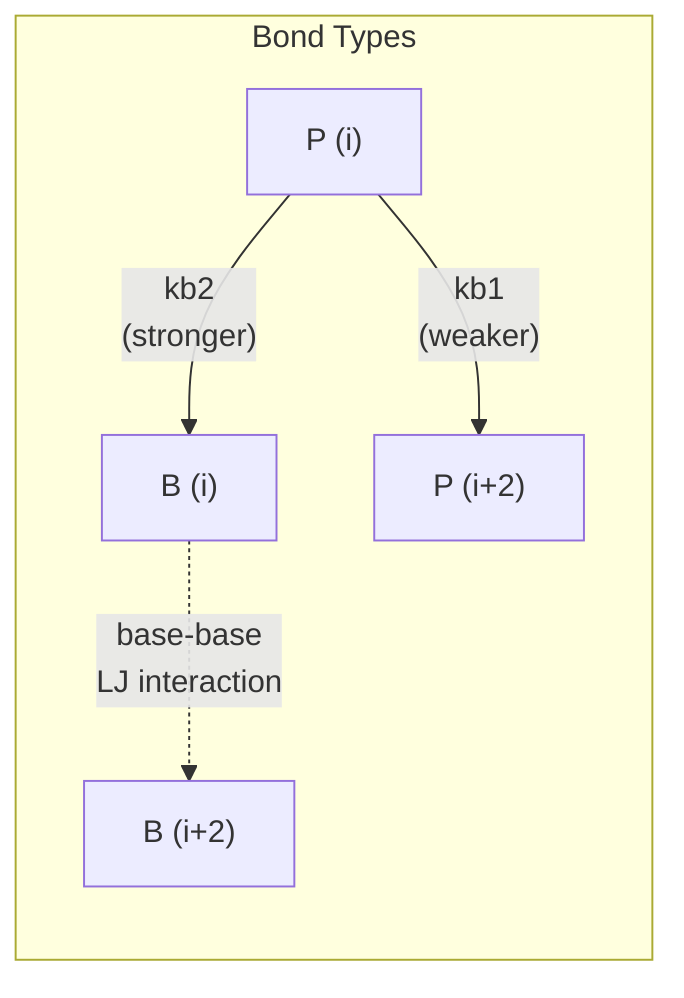
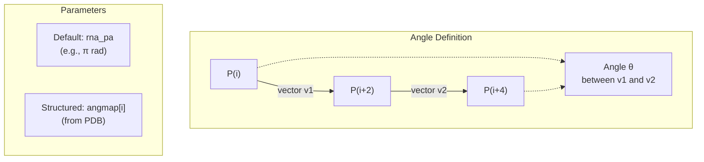
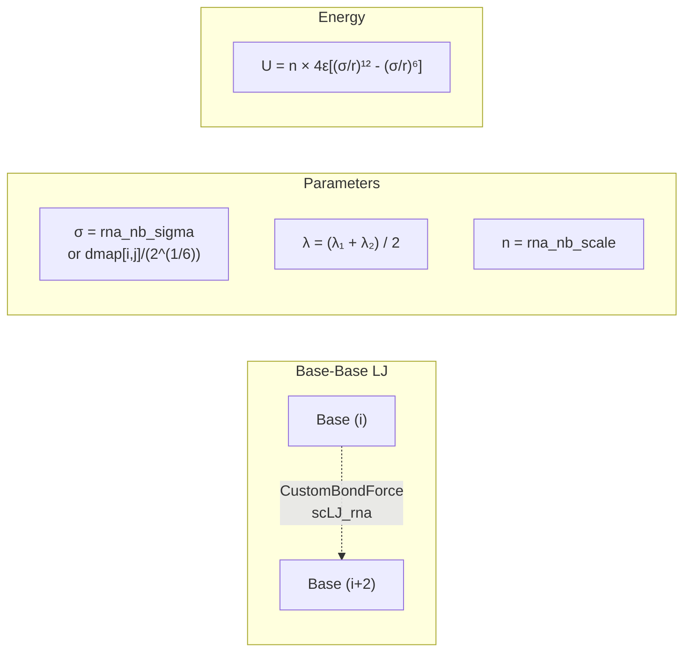
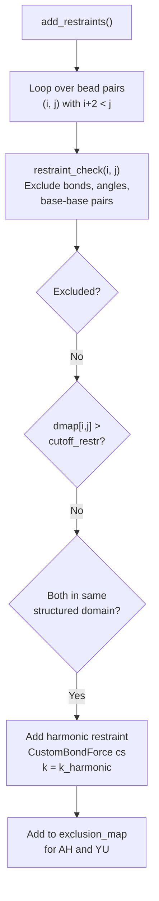
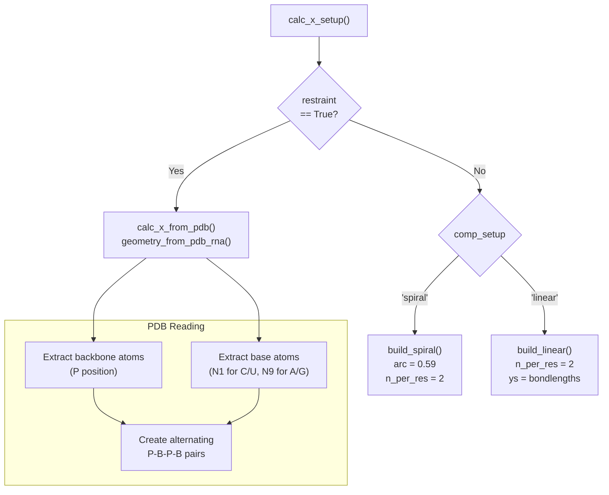
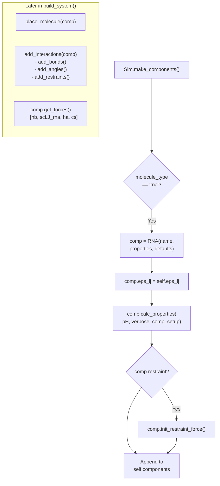

# RNA Components

<details>
<summary>Relevant source files</summary>

The following files were used as context for generating this wiki page:

- [calvados/build.py](calvados/build.py)
- [calvados/components.py](calvados/components.py)
- [calvados/sequence.py](calvados/sequence.py)
- [calvados/sim.py](calvados/sim.py)
- [examples/single_RNA/residues_C2RNA.csv](examples/single_RNA/residues_C2RNA.csv)
- [examples/single_RNA/rna.fasta](examples/single_RNA/rna.fasta)
- [examples/single_dsRNA/input/domains.yaml](examples/single_dsRNA/input/domains.yaml)
- [examples/single_dsRNA/input/dspolyR12.pdb](examples/single_dsRNA/input/dspolyR12.pdb)
- [examples/single_dsRNA/input/fastalib.fasta](examples/single_dsRNA/input/fastalib.fasta)
- [examples/single_dsRNA/input/residues_C2RNA.csv](examples/single_dsRNA/input/residues_C2RNA.csv)
- [examples/single_dsRNA/prepare.py](examples/single_dsRNA/prepare.py)
- [examples/slab_mixed/input/mix.fasta](examples/slab_mixed/input/mix.fasta)
- [examples/slab_mixed/input/residues_C2RNA.csv](examples/slab_mixed/input/residues_C2RNA.csv)

</details>


## Purpose and Scope

This page documents the RNA component implementation in CALVADOS, which uses a specialized two-bead coarse-grained model for RNA molecules. The `RNA` class extends the base `Component` class to handle RNA-specific features including phosphate-base representations, angle potentials, base-base interactions, and structured region restraints.

For general component features shared across all molecule types, see [Component Class Hierarchy](#3.1). For protein-specific components, see [Protein Components](#3.2). For RNA-protein interaction parameters, see [Force Field & Interaction Potentials](#3.4).

---

## Two-Bead Model Architecture

The RNA model represents each nucleotide with two beads:



**Sequence Encoding:**
- **One-bead sequence (`seq`)**: 'r' for unstructured, 's' for structured RNA residues
- **Two-bead sequence (`seq2`)**: Each residue becomes 'pr' or 'ps' (phosphate + base)

Sources: [calvados/components.py:300-395]()

---

## RNA Class Implementation

The `RNA` class hierarchy:



**Key attributes:**
- `nres`: Number of nucleotides (one-bead count)
- `nbeads`: Number of beads (two-bead count = 2 × nres)
- `seq`: One-bead sequence ('r' or 's' per nucleotide)
- `seq2`: Two-bead sequence ('pr' or 'ps' per nucleotide)

Sources: [calvados/components.py:300-305]()

---

## Sequence Processing

The RNA sequence processing differs based on input type:



**Example:**
- Input FASTA: `rrrr` (4 unstructured nucleotides)
- Output `seq`: `rrrr`
- Output `seq2`: `prprprpr` (8 beads total)

Sources: [calvados/components.py:368-395]()

---

## Force Field Parameters

RNA-specific residue parameters from `residues_C2RNA.csv`:

| Residue | Name | MW (Da) | λ | σ (nm) | q | bond length (nm) |
|---------|------|---------|---|--------|---|------------------|
| p | Phosphate | 194.1 | 0.00 | 0.6954 | -1 | 0.59 |
| r | Unstructured base | 126.3 | 1.18 | 0.6238 | 0 | 0.54 |
| s | Structured base | 126.3 | 0.13 | 0.6238 | 0 | 0.54 |

**Key differences:**
- Phosphate beads (`p`) are negatively charged (q = -1)
- Structured bases (`s`) have much lower hydrophobicity (λ = 0.13) than unstructured bases (`r`, λ = 1.18)
- Different bond lengths for phosphate-phosphate (0.59 nm) vs phosphate-base (0.54 nm) spacing

Sources: [examples/single_RNA/residues_C2RNA.csv:1-23](), [examples/slab_mixed/input/residues_C2RNA.csv:1-23]()

---

## Bond Forces

RNA molecules have two types of harmonic bonds with different force constants:



**Bond conditions** (from `bond_check()`):
1. **Phosphate-base bonds**: `i % 2 == 0` (i is phosphate) AND `j == i + 1`
2. **Phosphate-phosphate bonds**: `i % 2 == 0` AND `j == i + 2`
3. Exclude bonds across chain termini

**Default force constants:**
- `rna_kb1`: 1400 kJ/(mol·nm²) for phosphate-phosphate
- `rna_kb2`: 2200 kJ/(mol·nm²) for phosphate-base (stronger)

Sources: [calvados/components.py:449-460](), [calvados/components.py:482-508]()

---

## Angle Forces

Phosphate-phosphate-phosphate angles maintain RNA backbone geometry:



**Angle condition** (from `angle_check()`):
- `i % 2 == 0` (i is phosphate) AND `j == i + 4` (next phosphate)
- Exclude if middle phosphate is at terminus

**Default parameters:**
- `rna_ka`: 4.20 kJ/(mol·rad²)
- `rna_pa`: π radians (180°)

**For structured RNA:**
- Angles calculated from PDB geometry via `calc_angmap()`
- Stored in `self.angmap` array

Sources: [calvados/components.py:425-447](), [calvados/components.py:461-467](), [calvados/components.py:511-526]()

---

## Base-Base Interactions

Neighboring base beads interact through a scaled Lennard-Jones potential:



**Base-base condition** (from `basebase_check()`):
- `i % 2 == 1` (i is base) AND `j == i + 2` (next base)
- Exclude across chain termini

**Default parameters:**
- `rna_nb_sigma`: 0.4 nm (equilibrium distance)
- `rna_nb_scale`: 136 (energy scaling factor)
- `rna_nb_cutoff`: 2.0 nm
- `eps_lj`: Inherited from simulation settings

**For structured RNA:**
- σ adjusted to `dmap[i,j] / 2^(1/6)` to match PDB geometry

Sources: [calvados/components.py:353-358](), [calvados/components.py:412-424](), [calvados/components.py:468-474](), [calvados/components.py:498-507]()

---

## Restraints for Structured RNA

Harmonic restraints maintain structured regions:



**Restraint types:**
- Only `restraint_type == 'harmonic'` is supported for RNA
- Go-model restraints are not implemented

**Parameters:**
- `k_harmonic`: Force constant (e.g., 7000 kJ/(mol·nm²))
- `cutoff_restr`: Maximum distance for restraints (nm)

Sources: [calvados/components.py:527-567]()

---

## Initial Configuration

RNA molecules can be placed in different initial geometries:



**Default setup:**
- `comp_setup = 'spiral'` for RNA (set in [calvados/sim.py:68-71]())
- Uses `d = 0.59` nm and `n_per_res = 2` beads per residue
- For compact setup, falls back to linear

Sources: [calvados/components.py:306-310](), [calvados/components.py:475-481](), [calvados/build.py:316-353]()

---

## Integration with Simulation System

RNA components are instantiated and managed by the `Sim` class:



**RNA-specific handling:**
- `molecule_type = 'rna'` in components.yaml
- Angles added via `add_angles()` (unique to RNA)
- Force list includes angle force `ha` and base-base LJ `scLJ_rna`

Sources: [calvados/sim.py:68-71](), [calvados/sim.py:206](), [calvados/sim.py:411-412](), [calvados/components.py:363-367]()

---

## Complete Force Inventory

RNA molecules contribute multiple forces to the OpenMM system:

| Force Type | OpenMM Class | Added By | Purpose |
|------------|--------------|----------|---------|
| Phosphate-phosphate bonds | `HarmonicBondForce` | `add_bonds()` | kb1 = 1400 |
| Phosphate-base bonds | `HarmonicBondForce` | `add_bonds()` | kb2 = 2200 |
| Base-base LJ | `CustomBondForce` (scLJ_rna) | `add_bonds()` | Neighboring bases |
| P-P-P angles | `HarmonicAngleForce` | `add_angles()` | Backbone geometry |
| Structured restraints | `CustomBondForce` (cs) | `add_restraints()` | Harmonic restraints |
| Ashbaugh-Hatch | `CustomNonbondedForce` | `add_interactions()` | Global hydrophobic |
| Debye-Hückel | `CustomNonbondedForce` | `add_interactions()` | Global electrostatic |

**Force retrieval:**
```python
def get_forces(self):
    self.forces = [self.hb, self.scLJ_rna, self.ha]
    if self.restraint:
        self.forces.append(self.cs)
```

Sources: [calvados/components.py:363-367]()

---

## Example Usage

### Single RNA System

```yaml
# components.yaml
system:
  polyR30:
    molecule_type: rna
    nmol: 1
    restraint: False
```

FASTA file:
```
>polyR30
rrrrrrrrrrrrrrrrrrrrrrrrrrrrrr
```

This creates an unstructured 30-nucleotide RNA chain (60 beads total).

Sources: [examples/single_RNA/rna.fasta:1-3]()

---

### Structured RNA (Double-Stranded)

```yaml
# components.yaml
system:
  dspolyR12:
    molecule_type: rna
    nmol: 1
    restraint: True
    restraint_type: harmonic
    k_harmonic: 10
    cutoff_restr: 1.5
    use_com: False
```

With domains.yaml specifying structured region:
```yaml
dspolyR12:
- [1, 24]  # Residues 1-24 are structured
```

The PDB file contains the double-stranded geometry, and harmonic restraints maintain the structure.

Sources: [examples/single_dsRNA/prepare.py:1-100](), [examples/single_dsRNA/input/domains.yaml:1-4]()

---

### Mixed Protein-RNA System

```yaml
# components.yaml
system:
  FUS-RGG3:
    molecule_type: protein
    nmol: 100
  polyU40:
    molecule_type: rna
    nmol: 100
```

Uses C2RNA force field parameters for compatible protein-RNA interactions.

Sources: [examples/slab_mixed/input/mix.fasta:1-5]()

---

## Topology Representation

RNA chains are added to MDTraj topology with specific naming:

```python
# add_mdtraj_topol() for RNA
for idx, resname in enumerate(comp.seq):
    res = self.top.add_residue(resname, chain, resSeq=idx+1)
    self.top.add_atom(resname+"P", element=md.element.phosphorus, residue=res)
    self.top.add_atom(resname+"N", element=md.element.nitrogen, residue=res)
```

**Atom naming:**
- Phosphate: `{resname}P` (e.g., "rP" or "sP")
- Base: `{resname}N` (e.g., "rN" or "sN")

Sources: [calvados/sim.py:437-445]()

---

## Parameter Customization

RNA-specific parameters in `Components` defaults:

| Parameter | Default | Description |
|-----------|---------|-------------|
| `rna_kb1` | 1400.0 | P-P bond force constant (kJ/(mol·nm²)) |
| `rna_kb2` | 2200.0 | P-B bond force constant (kJ/(mol·nm²)) |
| `rna_ka` | 4.20 | Angle force constant (kJ/(mol·rad²)) |
| `rna_pa` | 3.14 | Default angle (radians) |
| `rna_nb_sigma` | 0.4 | Base-base LJ σ (nm) |
| `rna_nb_scale` | 136 | Base-base LJ energy scaling |
| `rna_nb_cutoff` | 2.0 | Base-base LJ cutoff (nm) |

These can be overridden in prepare.py scripts when creating `Components` objects.

Sources: [examples/single_dsRNA/prepare.py:82-89]()

---