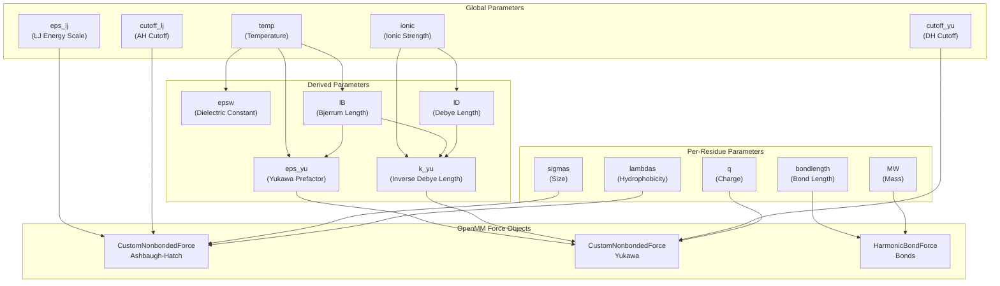
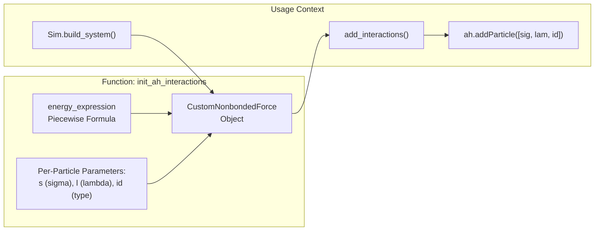
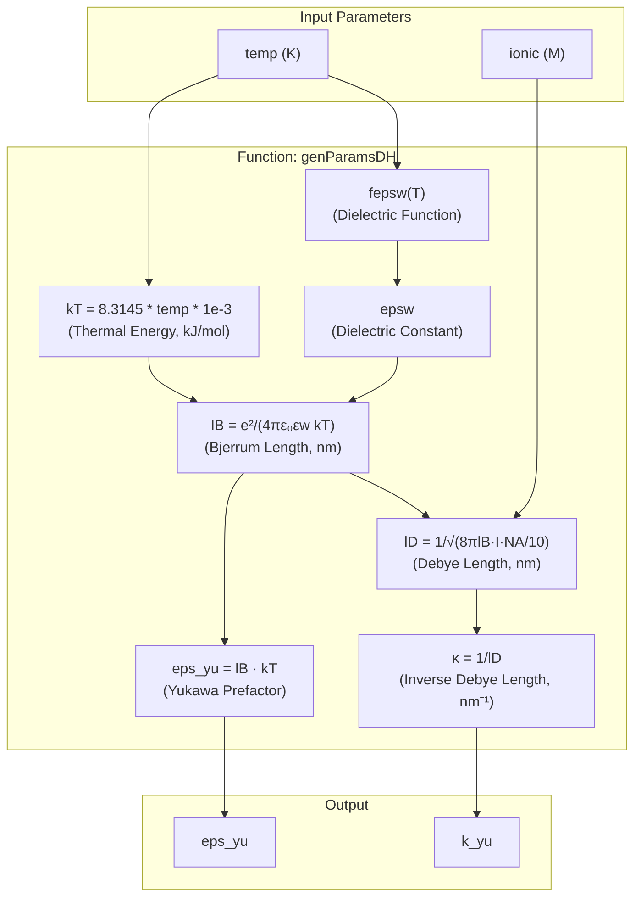
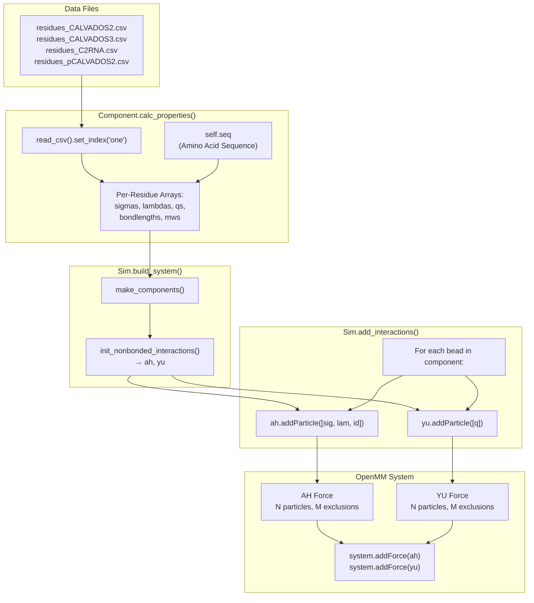
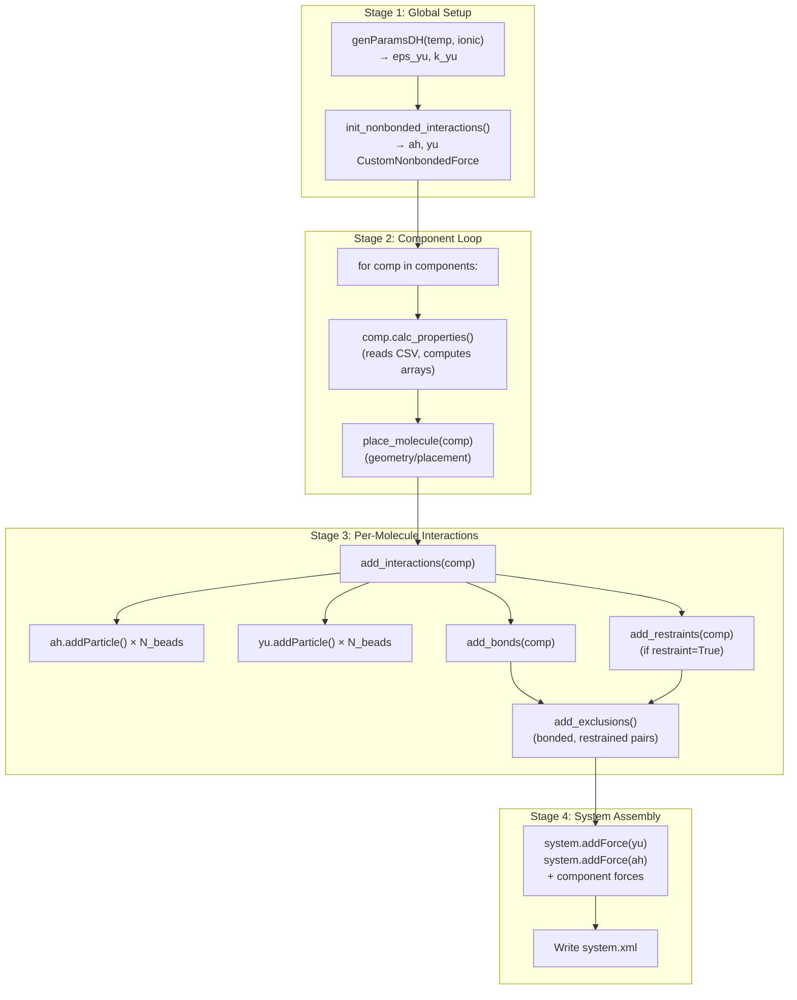

# Force Field & Interaction Potentials

<details>
<summary>Relevant source files</summary>

The following files were used as context for generating this wiki page:

- [calvados/components.py](calvados/components.py)
- [calvados/data/default_config.yaml](calvados/data/default_config.yaml)
- [calvados/interactions.py](calvados/interactions.py)
- [calvados/sim.py](calvados/sim.py)
- [pytest.ini](pytest.ini)
- [tests/data/residues_CALVADOS2.csv](tests/data/residues_CALVADOS2.csv)
- [tests/test_potentials.py](tests/test_potentials.py)

</details>


This page documents the coarse-grained force field used in CALVADOS simulations, focusing on the non-bonded interaction potentials, their physical basis, parameterization, and implementation in OpenMM. The force field consists primarily of two potentials: the Ashbaugh-Hatch (AH) potential for hydrophobic interactions and the Yukawa/Debye-Hückel (DH) potential for electrostatic interactions.

For information about bonded interactions and restraints, see [Restraints System](#3.5). For details on how different molecule types extend the base force field with specialized forces, see [Protein Components](#3.2) and [RNA Components](#3.3).

## Overview of the CALVADOS Force Field

The CALVADOS force field is a residue-level coarse-grained model where each amino acid is represented by a single bead centered at the Cα position. The force field balances:

1. **Hydrophobic interactions** via the Ashbaugh-Hatch potential, which modulates Lennard-Jones interactions based on residue hydrophobicity
2. **Electrostatic interactions** via screened Debye-Hückel electrostatics accounting for salt concentration
3. **Chain connectivity** via harmonic bonds between sequential residues
4. **Structural bias** via optional restraints (harmonic or Go-model)

The force field is defined globally through configuration parameters and per-residue through CSV parameter files.

**Key Force Field Components:**



Sources: [calvados/interactions.py:1-210](), [calvados/sim.py:130-223](), [calvados/data/default_config.yaml:1-40]()

## Ashbaugh-Hatch Potential

The Ashbaugh-Hatch (AH) potential is a modified Lennard-Jones interaction that smoothly interpolates between purely repulsive (hydrophilic) and attractive (hydrophobic) interactions based on a λ parameter.

### Mathematical Definition

The AH potential is defined piecewise:

**For r < 2^(1/6) σ (repulsive core):**
```
U_AH(r) = 4ε[(σ/r)^12 - (σ/r)^6] + ε(1-λ) - U_shift
```

**For r ≥ 2^(1/6) σ (attractive tail):**
```
U_AH(r) = 4ελ[(σ/r)^12 - (σ/r)^6] - U_shift
```

Where:
- `ε` is the energy scale (`eps_lj`, typically 0.2 kcal/mol = 0.8368 kJ/mol)
- `σ` is the interaction diameter (pairwise average: σ_ij = 0.5(σ_i + σ_j))
- `λ` is the hydrophobicity parameter (pairwise average: λ_ij = 0.5(λ_i + λ_j))
- `U_shift = 4ε[(σ/r_c)^12 - (σ/r_c)^6]` ensures continuity at cutoff r_c

The λ parameter ranges from 0 (purely repulsive, hydrophilic) to 1 (full LJ attraction, hydrophobic).

### Implementation

The AH potential is implemented as an OpenMM `CustomNonbondedForce`:



Sources: [calvados/interactions.py:26-44](), [calvados/sim.py:152-155](), [calvados/sim.py:385-397]()

The implementation uses the `select()` function to implement the piecewise definition:

[calvados/interactions.py:30-32]()

Key features:
- **Cutoff**: 2.0 nm by default (configurable via `cutoff_lj`)
- **Mixing rule**: Arithmetic mean for both σ and λ
- **Type-specific behavior**: The `id` parameter allows different behavior for different molecule types (proteins vs lipids vs crowders)
- **Fixed λ mode**: Setting `fixed_lambda` to a non-zero value forces all protein-lipid interactions to use that λ value

### Parameter Values

Per-residue σ and λ values are defined in `residues*.csv` files. Example values from CALVADOS2:

| Residue | λ (hydrophobicity) | σ (nm) | Description |
|---------|-------------------|---------|-------------|
| W (Trp) | 0.989 | 0.678 | Most hydrophobic |
| Y (Tyr) | 0.977 | 0.646 | Aromatic |
| F (Phe) | 0.867 | 0.636 | Aromatic |
| L (Leu) | 0.644 | 0.618 | Aliphatic |
| R (Arg) | 0.731 | 0.656 | Charged, large |
| E (Glu) | 0.001 | 0.592 | Charged, hydrophilic |
| G (Gly) | 0.706 | 0.450 | Small |

Sources: [tests/data/residues_CALVADOS2.csv:1-22](), [calvados/components.py:49-50]()

## Yukawa/Debye-Hückel Potential

The Yukawa potential (equivalent to screened Debye-Hückel electrostatics) accounts for electrostatic interactions between charged residues in a salt solution.

### Mathematical Definition

```
U_DH(r) = q_i q_j l_B k_B T [exp(-κr)/r - exp(-κr_c)/r_c]
```

Simplified form used in implementation:
```
U_DH(r) = ε_yu q_i q_j [exp(-κr)/r - shift]
```

Where:
- `q_i, q_j` are the charges on residues i and j
- `l_B` is the Bjerrum length (temperature-dependent)
- `κ = 1/l_D` is the inverse Debye screening length (salt-dependent)
- `ε_yu = l_B k_B T` is a prefactor combining physical constants
- `shift = exp(-κr_c)/r_c` ensures continuity at cutoff r_c (typically 4.0 nm)

### Physical Constants

The implementation derives physical constants from temperature and ionic strength:

**Diagram: Physical Constant Derivation**



Sources: [calvados/interactions.py:4-15](), [calvados/sim.py:146]()

The dielectric constant function is:
[calvados/interactions.py:9]()

This is an empirical fit to the temperature-dependent dielectric constant of water.

At 298 K and 150 mM ionic strength:
- `epsw ≈ 78.5`
- `l_B ≈ 0.71 nm`
- `l_D ≈ 0.78 nm`
- `κ ≈ 1.28 nm⁻¹`

### Implementation

The Yukawa potential is implemented as another `CustomNonbondedForce`:

[calvados/interactions.py:46-60]()

Key features:
- **Cutoff**: 4.0 nm by default (configurable via `cutoff_yu`)
- **Per-particle parameter**: Only charge `q` is per-particle; κ and ε_yu are global
- **Automatic exclusions**: Bonded and restrained pairs are excluded from both AH and YU forces

Sources: [calvados/interactions.py:46-60](), [calvados/sim.py:399-400]()

### Charge Assignment

Residue charges are determined by:

1. **Base charges** from `residues*.csv` (column `q`):
   - Acidic: D, E → -1
   - Basic: K, R → +1
   - Histidine: H → 0 (neutral at pH 7, but see `flexhis` option)
   - Others → 0

2. **Terminal charges** (optional, via `charge_termini`):
   - N-terminus: +1
   - C-terminus: -1
   - Can be disabled with `charge_termini='none'`

3. **pH-dependent charges** (pCALVADOS2):
   - Phosphorylated residues can have modified charges
   - See [pH-Dependent Simulations & Phosphorylation](#6.2)

Sources: [calvados/components.py:53](), [calvados/sequence.py](), [calvados/components.py:176-177]()

## Parameter Processing Pipeline

The force field parameters flow from CSV files through processing functions to OpenMM force objects.

**Diagram: Parameter Flow to Forces**



Sources: [calvados/components.py:27-55](), [calvados/sim.py:145-155](), [calvados/sim.py:378-416]()

### Residue Parameter File Format

The `residues*.csv` files define per-residue parameters:

| Column | Description | Units | Typical Range |
|--------|-------------|-------|---------------|
| `one` | Single-letter amino acid code | - | A-Z |
| `three` | Three-letter code | - | ALA, GLY, etc. |
| `MW` | Molecular weight | Da | 57-186 |
| `lambdas` | Hydrophobicity parameter | dimensionless | 0.0-1.0 |
| `sigmas` | Interaction diameter | nm | 0.45-0.68 |
| `q` | Charge | e | -1, 0, +1 |
| `bondlength` | Equilibrium bond length | nm | 0.38 |

Multiple force field variants exist:
- **CALVADOS2**: Standard protein force field
- **CALVADOS3**: Updated parameters (cite literature)
- **C2RNA**: RNA force field with phosphate and base beads
- **pCALVADOS2**: pH-dependent charges for phosphorylation studies

Sources: [tests/data/residues_CALVADOS2.csv:1-22](), [calvados/components.py:26-30]()

### Pairwise Mixing Rules

When two beads interact, their parameters are combined using **arithmetic averaging**:

```
σ_ij = 0.5 * (σ_i + σ_j)
λ_ij = 0.5 * (λ_i + λ_j)
```

This is implemented directly in the OpenMM energy expressions:

[calvados/interactions.py:32]()

For electrostatics, charges multiply:
```
q_ij = q_i * q_j
```

Sources: [calvados/interactions.py:30-32](), [calvados/interactions.py:50]()

## Force Initialization and Assembly

The force field is assembled in `Sim.build_system()` through a multi-stage process:

**Diagram: Force Assembly Process**



Sources: [calvados/sim.py:130-223](), [calvados/sim.py:378-423]()

### Exclusions

Pairs of particles that are bonded or restrained are **excluded** from non-bonded interactions (both AH and YU) to avoid double-counting:

[calvados/sim.py:369-377]()

Exclusions are collected from:
1. **Bonds**: Sequential residues in chains (`bond_check()` returns True)
2. **Restraints**: Residue pairs within structured domains or Go-model contacts
3. **Custom restraints**: User-defined restraints from `cres.txt`

Sources: [calvados/sim.py:338-377](), [calvados/components.py:85-96](), [calvados/components.py:218-229]()

### Molecule Type-Specific Behavior

Different molecule types have different interaction behaviors, controlled by the `id` parameter:

| Molecule Type | id Value | AH Behavior | Lipid Interactions |
|---------------|----------|-------------|-------------------|
| `protein` | 1 | Standard mixing | Charge-nonpolar attraction |
| `rna` | 1 | Standard mixing | Charge-nonpolar attraction |
| `crowder` | -1 | Standard mixing | - |
| `lipid` | 0 | Cosine potential with other lipids | Self-interaction |
| `cooke_lipid` | 0 | Cosine + FENE bonds | Self-interaction |

The `id` parameter appears in the AH force expression:
[calvados/interactions.py:32]()

The `select(id1+id2, ...)` function ensures:
- `id1=0, id2=0` (lipid-lipid): Cosine potential applies
- `id1=1, id2=1` (protein-protein): Standard AH mixing
- `id1=0, id2=1` (lipid-protein): Uses `fixed_lambda` if non-zero

Sources: [calvados/interactions.py:32](), [calvados/sim.py:386-392]()

## Global Force Field Settings

Key configuration parameters control force field behavior:

**From `default_config.yaml`:**

| Parameter | Default | Description |
|-----------|---------|-------------|
| `eps_lj` | 0.2 | LJ energy scale (kcal/mol, converted to 0.8368 kJ/mol) |
| `cutoff_lj` | 2.0 | AH potential cutoff (nm) |
| `cutoff_yu` | 4.0 | Yukawa potential cutoff (nm) |
| `temp` | - | Temperature (K), required |
| `ionic` | - | Ionic strength (M), required |
| `pH` | 7.0 | pH for charge assignment |
| `fixed_lambda` | 0 | Fixed λ for heterotypic interactions (0=disabled) |

**Force Field Selection:**

Different force fields are selected by specifying different `fresidues` files in components:

```yaml
# CALVADOS2 (standard proteins)
fresidues: 'calvados/data/residues_CALVADOS2.csv'

# CALVADOS3 (updated parameters)
fresidues: 'calvados/data/residues_CALVADOS3.csv'

# C2RNA (RNA systems)
fresidues: 'calvados/data/residues_C2RNA.csv'

# pCALVADOS2 (pH-dependent)
fresidues: 'calvados/data/residues_pCALVADOS2.csv'
```

Sources: [calvados/data/default_config.yaml:5-8](), [calvados/sim.py:36-39](), [calvados/components.py:26-30]()

## Validation and Testing

The force field implementation is validated through test simulations that compare computed potential energies against analytical expressions.

### Test Strategy

[tests/test_potentials.py:1-127]() implements parametrized tests that:

1. Simulate pairs of residues in isolation
2. Compute pairwise distances from trajectory
3. Load potential energies from OpenMM log
4. Calculate analytical potential from distances using Python formulas
5. Assert numerical agreement within tolerance

**Analytical Potential Definitions:**

[tests/test_potentials.py:12-19]()

These Python lambda functions implement the exact mathematical forms described above, including:
- Piecewise AH potential with shifting
- Exponential Yukawa potential with shifting

### Test Cases

The test suite covers diverse interaction types:

| Test Pair | Tests |
|-----------|-------|
| Y-W | Hydrophobic-hydrophobic (high λ) |
| R-W | Charged-hydrophobic |
| E-D | Charged-charged (repulsive) |
| E-W | Charged-hydrophobic |
| E-R | Charged-charged (attractive) |

Each test runs 10,000 frames with frequent saving to sample diverse distances.

**Validation Criterion:**

[tests/test_potentials.py:126]()

The test asserts that OpenMM-computed energies match analytical calculations within 0.1% relative error (and 1e-8 kJ/mol absolute error).

Sources: [tests/test_potentials.py:1-127]()

## Force Field Extensions

The base AH+YU force field is extended for specialized systems:

### Lipid Forces

Lipids use two additional potentials:
- **Cosine potential**: Attractive tail between lipid beads ([calvados/interactions.py:185-196]())
- **Charge-nonpolar**: Attraction between charged protein residues and nonpolar lipid tails ([calvados/interactions.py:198-209]())

See [calvados/interactions.py:75-81]() for initialization.

### RNA Forces

RNA molecules use:
- **Base-base interactions**: Scaled LJ between adjacent bases on the same strand
- **Angle potentials**: Harmonic angles to maintain backbone geometry
- **Two-bead model**: Phosphate (P) and nucleotide base (N) beads per residue

See [RNA Components](#3.3) for details.

### Scaled Interactions for Go Models

Protein structures with Go-model restraints use **scaled LJ and Yukawa** forces for residue pairs with weak restraints:

[calvados/interactions.py:100-111]() and [calvados/interactions.py:113-121]()

This allows smooth interpolation between fully restrained (structure-forming) and unrestrained (flexible) regions based on AlphaFold confidence scores.

Sources: [calvados/interactions.py:75-209](), [calvados/components.py:231-265]()

## Summary Table: Force Field Components

| Force Type | OpenMM Class | Parameters | Purpose |
|------------|--------------|------------|---------|
| Ashbaugh-Hatch | `CustomNonbondedForce` | σ, λ per particle; ε, r_c global | Hydrophobic interactions |
| Yukawa | `CustomNonbondedForce` | q per particle; κ, ε_yu global | Screened electrostatics |
| Harmonic Bond | `HarmonicBondForce` | d₀, k per bond | Chain connectivity |
| Harmonic Restraint | `HarmonicBondForce` | d₀, k per pair | Structure preservation |
| Go Restraint | `CustomBondForce` | d₀, k per pair | Native contact stabilization |
| Scaled LJ | `CustomBondForce` | σ, λ, scale per pair | Weak Go contacts |
| Scaled Yukawa | `CustomBondForce` | q, scale per pair | Weak Go contacts (charged) |
| Cosine | `CustomNonbondedForce` | σ, λ per particle; ε global | Lipid tail attraction |
| Charge-Nonpolar | `CustomNonbondedForce` | α, q, R³ per particle | Protein-lipid interaction |

Sources: [calvados/interactions.py:1-210](), [calvados/components.py:81-99](), [calvados/components.py:231-238]()

---