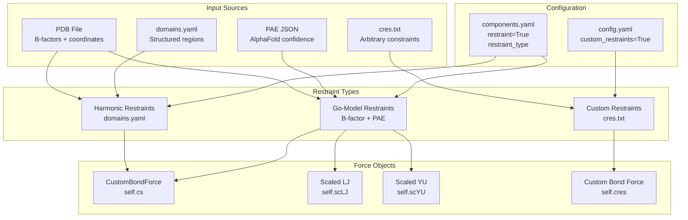
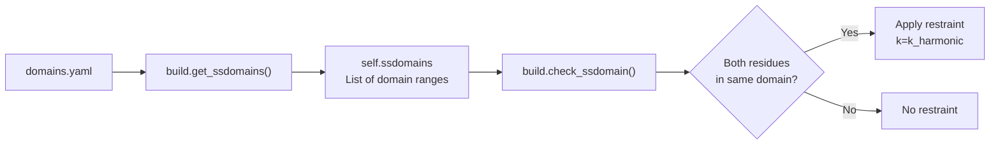
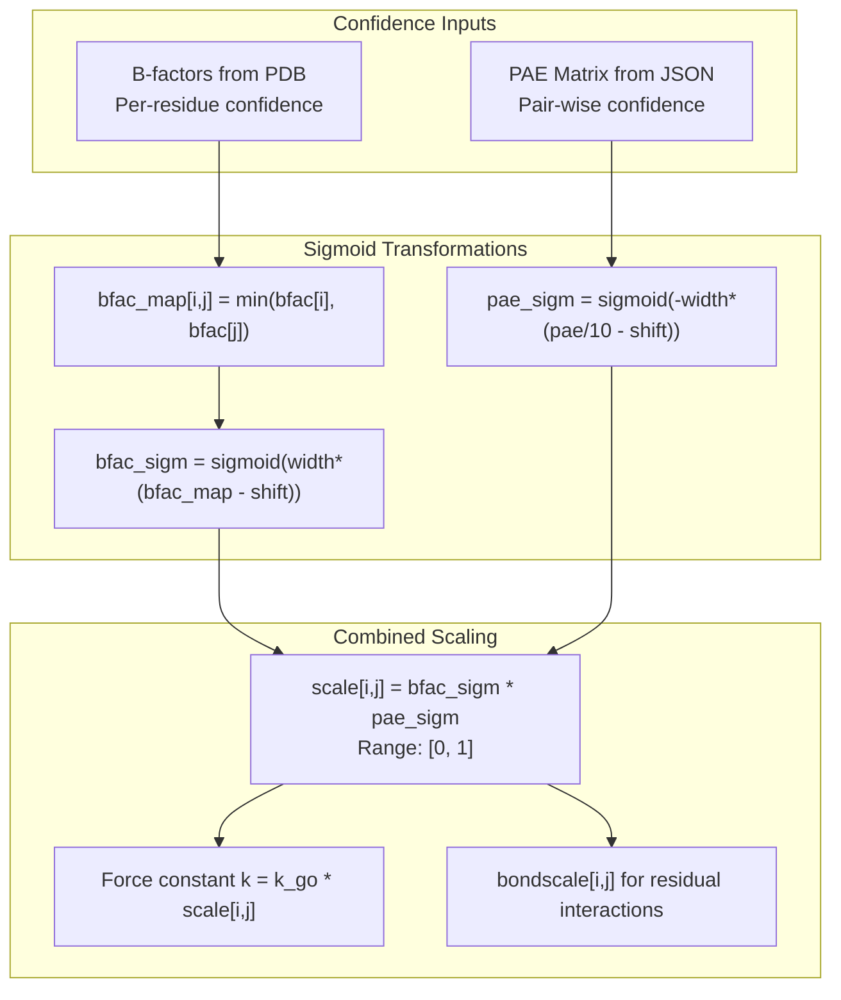
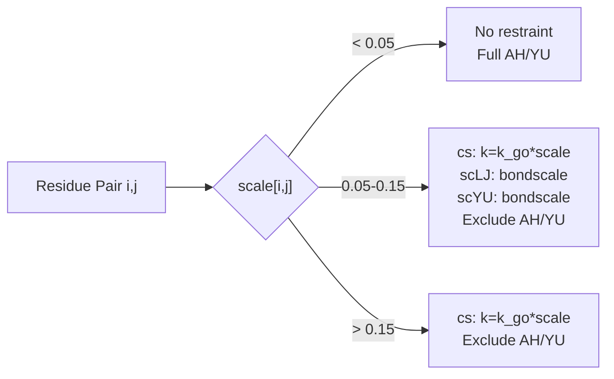
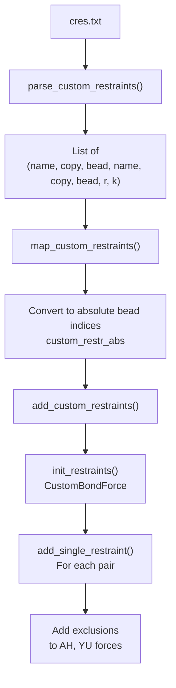
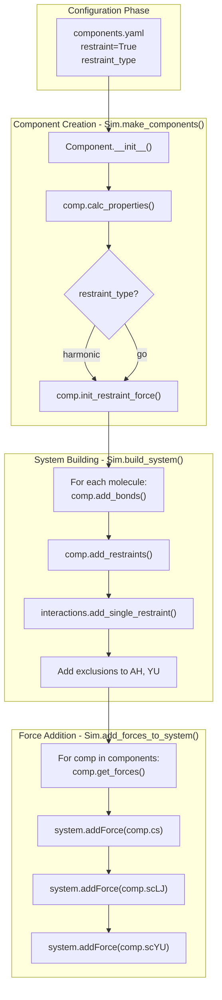

# Restraints System

<details>
<summary>Relevant source files</summary>

The following files were used as context for generating this wiki page:

- [calvados/components.py](calvados/components.py)
- [calvados/sim.py](calvados/sim.py)
- [examples/custom_restraints/prepare.py](examples/custom_restraints/prepare.py)
- [tests/data/cres.txt](tests/data/cres.txt)
- [tests/data/fastalib.fasta](tests/data/fastalib.fasta)
- [tests/data/residues_C2RNA.csv](tests/data/residues_C2RNA.csv)
- [tests/test_custom_restraints.py](tests/test_custom_restraints.py)

</details>


The restraints system in CALVADOS maintains structural information for proteins and RNA by applying distance-based forces that constrain relative positions of beads. This system supports three types of restraints: **harmonic restraints** based on structured domains, **Go-model restraints** with confidence-based weighting, and **custom restraints** for user-defined constraints. For information about bonded interactions between adjacent beads, see [Force Field & Interaction Potentials](#3.4).

## Overview of Restraint Types

CALVADOS implements multiple restraint mechanisms to maintain structural information at different levels of confidence:



**Restraint Type Comparison**

| Type | Use Case | Strength | Input Required | Excludes Non-bonded |
|------|----------|----------|----------------|---------------------|
| Harmonic | Well-defined structured regions | Uniform (`k_harmonic`) | domains.yaml, PDB | Yes |
| Go-model | AlphaFold predictions with varying confidence | Variable (PAE + B-factor weighted) | PDB, PAE JSON | Yes |
| Custom | Arbitrary user constraints | User-defined per pair | cres.txt | Yes |

Sources: [calvados/components.py:179-188](), [calvados/sim.py:88-96]()

## Harmonic Restraints

Harmonic restraints apply uniform force constants to residue pairs within structured domains. These are appropriate when you have high-confidence structured regions defined a priori.

### Configuration

Harmonic restraints are configured in `components.yaml`:

```yaml
restraint: true
restraint_type: 'harmonic'
k_harmonic: 700.0  # kJ/(mol·nm²)
cutoff_restr: 2.0  # nm, maximum distance to restrain
fdomains: 'input/domains.yaml'
pdb_folder: 'input'
use_com: true  # use center of mass instead of CA positions
```

### Domain Definition Format

The `domains.yaml` file specifies structured regions:

```yaml
protein_name:
  - [1, 50]    # residues 1-50 form domain 1
  - [60, 120]  # residues 60-120 form domain 2
```

Residue indices are 1-based. Only pairs where **both** residues are in the same structured domain receive restraints.

Sources: [calvados/components.py:122-125]()

### Implementation

The `Protein.calc_ssdomains()` method parses domain definitions:



For each residue pair (i, j) with i+2 ≤ j:
1. Check if distance `dmap[i,j]` < `cutoff_restr`
2. Check if both i and j are in the same structured domain
3. If both conditions met, add restraint with equilibrium distance `dmap[i,j]` and force constant `k_harmonic`

Sources: [calvados/components.py:249-253](), [calvados/components.py:183-184]()

### Bond Length Calculation

Harmonic restraints also affect bond lengths for adjacent residues. If residues i and i+1 are in a structured domain, the bond length is set to `dmap[i, i+1]` from the PDB rather than the default `bondlength`:

```python
# From calc_bondlength()
if self.restraint_type == 'harmonic':
    ss = build.check_ssdomain(self.ssdomains, i, j, req_both=False)
    d = self.dmap[i,j] if ss else d0  # d0 is default bondlength
```

Sources: [calvados/components.py:193-195]()

## Go-Model Restraints

Go-model restraints apply variable strength constraints based on AlphaFold confidence metrics. This allows maintaining well-predicted contacts strongly while loosely constraining uncertain regions.

### Configuration

Go-model restraints require both B-factor and PAE (Predicted Aligned Error) data:

```yaml
restraint: true
restraint_type: 'go'
k_go: 700.0  # Maximum force constant kJ/(mol·nm²)
cutoff_restr: 2.0  # nm
pdb_folder: 'input'  # Contains name.pdb and name.json
colabfold: 1  # PAE format: 0=EBI AlphaFold, 1/2=ColabFold
# B-factor sigmoid parameters
bfac_width: 50.0
bfac_shift: 0.8
# PAE sigmoid parameters
pae_width: 8.0
pae_shift: 0.4
```

Sources: [calvados/components.py:127-147]()

### Confidence-Based Scaling

The Go-model computes a scaling factor for each residue pair (i, j) combining two confidence metrics:



**Scaling Factor Calculation:**

1. **B-factor term**: Uses minimum B-factor of the pair  
   `bfac_sigm = 1 / (1 + exp(-width * (min(bfac[i], bfac[j]) - shift)))`

2. **PAE term**: Uses predicted aligned error in nm  
   `pae_sigm = 1 / (1 + exp(width * (pae[i,j]/10 - shift)))`

3. **Combined**: `scale[i,j] = bfac_sigm * pae_sigm`

Typical values range from 0 (no confidence) to 1 (high confidence).

Sources: [calvados/components.py:133-144]()

### Three-Regime Interaction Model

Go-model restraints implement a three-regime model based on the scale factor:

| Regime | Condition | Bond Interaction | Restraint | Non-bonded (AH/YU) |
|--------|-----------|------------------|-----------|-------------------|
| Low confidence | `scale < min_scale` (0.05) | Default `bondlength` | None | Full strength |
| Medium confidence | `min_scale ≤ scale < cutoff_mix` (0.15) | Mixed | Scaled | Scaled (weak) |
| High confidence | `scale ≥ cutoff_mix` | PDB distance | Scaled | Excluded |

**Medium confidence regime** uses scaled pseudo-interactions:
- Scaled LJ potential (`scLJ`) with strength `bondscale[i,j]`
- Scaled Yukawa potential (`scYU`) for charged pairs with strength `bondscale[i,j]`
- `bondscale[i,j] = 1 / (1 + exp(80*(scale[i,j] - 0.1)))` (inverted sigmoid)

Sources: [calvados/components.py:196-204](), [calvados/components.py:256-265]()

### Force Objects

Go-model restraints create three force objects:

1. **`self.cs`**: `CustomBondForce` for harmonic restraints with variable `k = k_go * scale[i,j]`
2. **`self.scLJ`**: Scaled Lennard-Jones for medium confidence pairs
3. **`self.scYU`**: Scaled Yukawa for charged medium confidence pairs



Sources: [calvados/components.py:231-238](), [calvados/components.py:254-265]()

### Bond Length in Go-Model

Bond lengths between adjacent residues are interpolated based on confidence:

```python
if self.scale[i,j] < min_scale:
    d = d0  # default bondlength
elif self.scale[i,j] > cutoff_mix_in_LJYU:
    d = self.dmap[i,j]  # PDB distance
else:
    # Linear interpolation
    d = self.bondscale[i,j] * d0 + (1 - self.bondscale[i,j]) * self.dmap[i,j]
```

Sources: [calvados/components.py:196-204]()

## Custom Restraints

Custom restraints allow users to specify arbitrary harmonic constraints between any bead pairs across molecules. This is useful for enforcing experimental distance constraints or testing specific structural hypotheses.

### Configuration

Enable custom restraints in `config.yaml`:

```yaml
custom_restraints: true
custom_restraint_type: 'harmonic'  # or 'go'
fcustom_restraints: 'input/cres.txt'
```

### File Format

The `cres.txt` file specifies restraints using the format:

```
component_name copy_number bead_index | component_name copy_number bead_index | distance force_constant
```

**Example:**
```
protein_A 1 10 | protein_A 1 50 | 1.5 700.0
protein_A 1 25 | protein_B 2 30 | 2.0 500.0
```

- **Component name**: As defined in `components.yaml`
- **Copy number**: 1-based molecule instance (first molecule of that type = 1)
- **Bead index**: 1-based residue index
- **Distance**: Equilibrium distance in nm
- **Force constant**: In kJ/(mol·nm²)

Sources: [calvados/sim.py:484-501](), [tests/data/cres.txt:1-1]()

### Implementation

Custom restraints are processed in three stages:



**Absolute Bead Index Calculation:**

Each component tracks its starting bead index in the system:
```python
comp.start_bead = sum of all beads in previous components
absolute_bead = comp.start_bead + (copy - 1) * comp.nbeads + (bead - 1)
```

Sources: [calvados/sim.py:462-482]()

### Integration with System

Custom restraints:
1. Are added after all component-specific restraints
2. Exclude non-bonded (AH, YU) interactions for restrained pairs
3. Share force type with component restraints (harmonic or go-type expression)
4. Can span across different molecules and components

Sources: [calvados/sim.py:213-215](), [calvados/sim.py:252-255]()

## RNA Restraints

RNA components support harmonic restraints for structured regions, with special handling for the two-bead-per-nucleotide model.

### Domain Mapping

RNA domains in `domains.yaml` are specified per nucleotide (1-based), but restraints apply to beads (phosphate and base):

```python
# domains.yaml: [1, 10] for nucleotides 1-10
# Becomes bead indices: [0, 1, 2, 3, ..., 19, 20, 21]
# (nucleotide i → beads 2*i and 2*i+1)
```

Sources: [calvados/components.py:311-323]()

### Restraint Exclusions

RNA restraints exclude pairs that are already bonded or angled:
- Phosphate-phosphate bonds (i, i+2)
- Phosphate-base bonds (i, i+1)
- Base-base interactions (i, i+2 for bases)
- Angle terms (i, i+2, i+4 for phosphates)

Only non-bonded pairs within structured domains and below `cutoff_restr` receive restraints.

Sources: [calvados/components.py:531-567]()

## Restraint Force Initialization Flow



Sources: [calvados/sim.py:88-96](), [calvados/sim.py:238-242](), [calvados/sim.py:414-416]()

## Output Files

The restraints system writes detailed information about applied restraints:

### Component Restraints

**`restr_{component_name}.txt`**: Lists all restraints for a component

Format:
```
i j d[nm] fc
1 5 0.8234 700.0000
2 8 1.2341 350.5000
...
```
- `i`, `j`: 1-based bead indices within the system
- `d`: Equilibrium distance (nm)
- `fc`: Force constant (kJ/(mol·nm²))

### Go-Model Specific Outputs

**`scaled_LJ_{component_name}.txt`**: Scaled LJ interactions

Format:
```
i+offset+1, j+offset+1, s, l, comp.bondscale[i,j]
15 23 0.618 0.644 0.8234
...
```

**`scaled_YU_{component_name}.txt`**: Scaled Yukawa interactions

Format:
```
i+offset+1, j+offset+1, comp.bondscale[i,j]
15 23 0.8234
...
```

Sources: [calvados/components.py:274-291]()

## Key Classes and Methods

| Class/Method | File | Purpose |
|--------------|------|---------|
| `Protein.calc_ssdomains()` | components.py:122-125 | Parse domains.yaml for harmonic restraints |
| `Protein.calc_go_scale()` | components.py:127-147 | Compute confidence scaling for Go-model |
| `Protein.init_restraint_force()` | components.py:231-239 | Initialize force objects (cs, scLJ, scYU) |
| `Protein.add_restraints()` | components.py:240-272 | Add restraint pairs to forces |
| `Protein.calc_bondlength()` | components.py:190-209 | Determine bond length using restraint info |
| `RNA.calc_ssdomains()` | components.py:311-323 | Map nucleotide domains to bead indices |
| `RNA.add_restraints()` | components.py:547-567 | Add RNA restraints excluding bonded pairs |
| `Sim.add_restraints()` | sim.py:350-356 | Add restraints for one molecule |
| `Sim.map_custom_restraints()` | sim.py:462-482 | Convert custom restraint format to absolute indices |
| `Sim.add_custom_restraints()` | sim.py:357-367 | Add custom restraints to system |
| `interactions.init_restraints()` | interactions.py | Create CustomBondForce for restraints |
| `interactions.add_single_restraint()` | interactions.py | Add one restraint to force object |
| `interactions.init_scaled_LJ()` | interactions.py | Create scaled LJ force for Go-model |
| `interactions.init_scaled_YU()` | interactions.py | Create scaled Yukawa force for Go-model |

## Exclusions and Non-bonded Interactions

All restraint types (harmonic, go, custom) exclude AH (Ashbaugh-Hatch) and YU (Yukawa) non-bonded interactions for restrained pairs by default. This prevents double-counting of interactions and ensures restraints dominate for those pairs.

The exclusion mechanism:
```python
# After adding each restraint
exclusion_map.append([i+offset, j+offset])

# Then in add_exclusions()
for excl in exclusion_map:
    self.ah = interactions.add_exclusion(self.ah, excl[0], excl[1])
    self.yu = interactions.add_exclusion(self.yu, excl[0], excl[1])
```

This can be controlled via the `exclude_nonbonded` parameter in `add_restraints()` and `add_custom_restraints()`, though it defaults to `True`.

Sources: [calvados/sim.py:354-355](), [calvados/sim.py:366-376]()

---