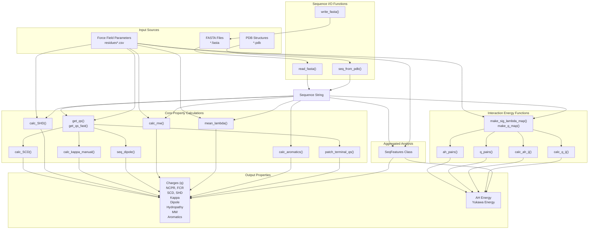
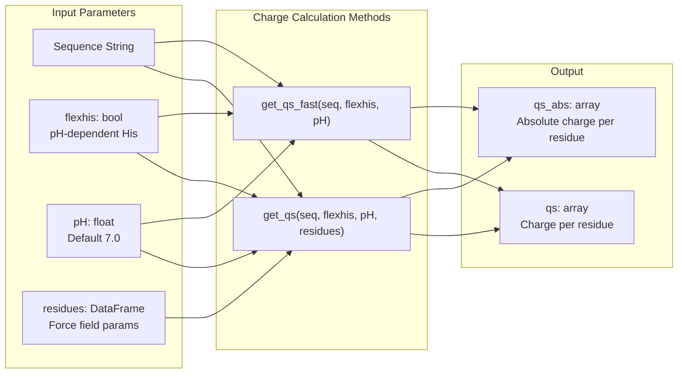
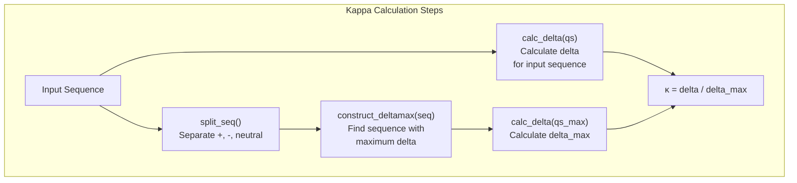
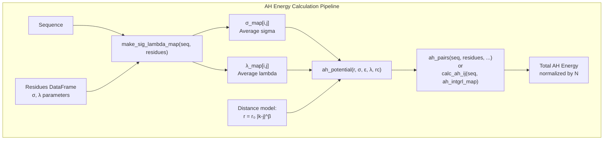
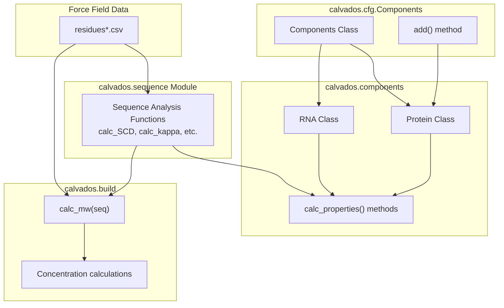

# Sequence Analysis & Properties

<details>
<summary>Relevant source files</summary>

The following files were used as context for generating this wiki page:

- [calvados/build.py](calvados/build.py)
- [calvados/sequence.py](calvados/sequence.py)
- [examples/single_dsRNA/input/domains.yaml](examples/single_dsRNA/input/domains.yaml)
- [examples/single_dsRNA/input/dspolyR12.pdb](examples/single_dsRNA/input/dspolyR12.pdb)
- [examples/single_dsRNA/input/fastalib.fasta](examples/single_dsRNA/input/fastalib.fasta)
- [examples/single_dsRNA/input/residues_C2RNA.csv](examples/single_dsRNA/input/residues_C2RNA.csv)
- [examples/single_dsRNA/prepare.py](examples/single_dsRNA/prepare.py)

</details>


This page documents the functions in the `calvados.sequence` module for analyzing protein and RNA sequences and calculating sequence-derived properties. These functions compute physical and chemical properties from amino acid sequences, including charges, hydropathy, sequence charge decoration (SCD), kappa values, dipole moments, and interaction energies. The calculated properties are used during system setup to characterize molecules and can also be used for post-hoc analysis of sequence features.

For information about how sequences are specified in simulation setup, see [Components Class - Molecular Definitions](#2.2). For details on the force field parameters that these calculations depend on, see [Force Field & Interaction Potentials](#3.4) and [Input Data Files](#2.4).

## Overview of Sequence Analysis Workflow

The sequence analysis system provides functions for three main purposes:
1. **Sequence I/O**: Reading sequences from FASTA files or PDB structures
2. **Property Calculation**: Computing physical properties from sequences (charges, hydropathy, SCD, kappa, etc.)
3. **Interaction Energy Prediction**: Estimating inter-residue interaction energies based on sequence



**Sequence Analysis Workflow**: This diagram shows how sequences from FASTA or PDB files are processed through various analysis functions to compute sequence properties and interaction energies. The `SeqFeatures` class provides a convenient interface for computing multiple properties at once.

Sources: [calvados/sequence.py:1-778]()

## Sequence I/O Operations

### Reading Sequences

The module provides functions to read sequences from different file formats:

| Function | Purpose | Returns |
|----------|---------|---------|
| `read_fasta(ffasta)` | Parse FASTA file using BioPython | Dictionary of SeqRecord objects keyed by ID |
| `seq_from_pdb(pdb, selection='all', fmt='string')` | Extract sequence from PDB file | Sequence string (or list), N-termini indices, C-termini indices |
| `record_from_seq(seq, name)` | Create SeqRecord from string | BioPython SeqRecord object |
| `write_fasta(new_records, fout)` | Write sequences to FASTA file | None (writes to file) |

The `seq_from_pdb()` function uses MDAnalysis to parse PDB structures and converts three-letter amino acid codes to one-letter codes. It handles multi-segment proteins by tracking N- and C-termini positions:

```python
# Example: Reading sequence from PDB
fastapdb, n_termini, c_termini = seq_from_pdb('protein.pdb', selection='all')
# fastapdb: 'MDSKGSSQK...'
# n_termini: [0] (start of first chain)
# c_termini: [99] (end of first chain, 100 residues)
```

Sources: [calvados/sequence.py:30-89]()

### Terminal Charge and Mass Corrections

Proteins have charged N-termini (NH3+) and C-termini (COO-) that must be accounted for:

| Function | Purpose | Details |
|----------|---------|---------|
| `patch_terminal_qs(qs, n_termini, c_termini, loc='both')` | Add terminal charges | +1 to N-terminus, -1 to C-terminus |
| `patch_terminal_mws(mws, n_termini, c_termini, loc='both')` | Adjust terminal masses | +2 Da (H2) to N-terminus, +16 Da (O) to C-terminus |

The `loc` parameter controls which termini to patch: `'N'`, `'C'`, or `'both'`.

Sources: [calvados/sequence.py:132-148]()

## Charge Calculations

### Basic Charge Functions

Charge calculations are central to many sequence properties. The module provides both a standard Python version and a Numba-accelerated version:



**Charge Calculation Flow**: The `get_qs()` function computes charge arrays from sequences, with optional pH-dependent histidine protonation.

**Charge Assignment Rules:**
- **Positive (+1)**: R (arginine), K (lysine)
- **Negative (-1)**: D (aspartate), E (glutamate), p (phosphorylated residue)
- **pH-dependent**: H (histidine) when `flexhis=True`: q = 1 / (1 + 10^(pH-6))
- **Neutral (0)**: All other residues

The fast version `get_qs_fast()` is decorated with `@nb.jit(nopython=True)` for performance-critical applications.

Sources: [calvados/sequence.py:92-130]()

### Derived Charge Properties

From the basic charge arrays, several properties can be computed:

| Property | Function | Formula | Meaning |
|----------|----------|---------|---------|
| **Total charge** | `np.sum(qs)` | Σq | Net charge |
| **NCPR** | - | Total charge / N | Net Charge Per Residue |
| **FCR** | `frac_charges()` | (f+ + f-) | Fraction of Charged Residues |
| **f+** | `frac_charges()` | N(+) / N | Fraction of positive residues |
| **f-** | `frac_charges()` | N(-) / N | Fraction of negative residues |

Sources: [calvados/sequence.py:698-720]()

## Sequence Charge Decoration (SCD)

The Sequence Charge Decoration (SCD) parameter quantifies the charge segregation along a sequence. It was introduced by Sawle & Ghosh (JCP 2015) and is calculated as:

**SCD = (1/N) Σᵢ Σⱼ<ᵢ qᵢ·qⱼ·√(i-j)**

where qᵢ and qⱼ are charges at positions i and j, and N is sequence length.

The implementation uses a Numba-accelerated function:

```python
@nb.jit(nopython=True)
def calc_SCD(qs):
    """ Sequence charge decoration, eq. 14 in Sawle & Ghosh, JCP 2015 """
    N = len(qs)
    scd = 0.
    for idx in range(1,N):
        for jdx in range(0,idx):
            s = qs[idx] * qs[jdx] * (idx - jdx)**0.5
            scd = scd + s
    scd = scd / N
    return scd
```

**Interpretation:**
- **Positive SCD**: Like-charged residues are clustered (blocky distribution)
- **Negative SCD**: Opposite charges are interspersed (alternating pattern)
- **Near-zero SCD**: Random charge distribution

Sources: [calvados/sequence.py:190-200]()

## Sequence Hydropathy Decoration (SHD)

The Sequence Hydropathy Decoration (SHD) parameter characterizes hydrophobic patterning, analogous to SCD but for hydrophobicity. Based on Zheng et al. (JPC Letters 2020):

**SHD = (1/N) Σᵢ Σⱼ>ᵢ λᵢⱼ · (j-i)^β**

where λᵢⱼ is the average hydropathy (lambda) of residues i and j, and β is typically -1.

```python
def calc_SHD(seq, lambda_map, beta=-1.):
    """ Sequence hydropathy decoration, eq. 4 in Zheng et al., JPC Letters 2020"""
    N = len(seq)
    shd = 0.
    for idx in range(0, N-1):
        seqi = seq[idx]
        for jdx in range(idx+1, N):
            seqj = seq[jdx]
            s = lambda_map[(seqi,seqj)] * (jdx - idx)**beta
            shd = shd + s
    shd = shd / N
    return shd
```

The `lambda_map` is created from residue parameters and contains pairwise average lambdas:

Sources: [calvados/sequence.py:202-218](), [calvados/sequence.py:497-506]()

## Kappa Parameter

The kappa (κ) parameter measures charge clustering and mixing, developed by Das & Pappu. It ranges from 0 to 1:
- **κ ≈ 0**: Perfectly mixed charges (alternating pattern)
- **κ ≈ 1**: Maximally segregated charges (blocky pattern)

### Kappa Calculation Algorithm

The calculation involves finding the maximum possible charge segregation for a given composition:



**Kappa Calculation Algorithm**: The kappa parameter is computed by comparing the actual charge segregation to the maximum possible for that composition.

The `calc_delta()` function computes a charge segregation metric using sliding windows:

```python
@nb.jit(nopython=True)
def calc_delta(qs):
    d5 = calc_delta_form(qs, window=5)
    d6 = calc_delta_form(qs, window=6)
    return (d5 + d6) / 2.

@nb.jit(nopython=True)
def calc_delta_form(qs, window=5):
    sig_m = calc_sigma(qs)
    nw = len(qs) - window + 1
    sigs = np.zeros((nw))
    for idx in range(0, nw):
        q_window = qs[idx:idx+window]
        sigs[idx] = calc_sigma(q_window)
    delta = np.sum((sigs - sig_m)**2) / nw
    return delta
```

The `construct_deltamax()` function efficiently searches for the sequence permutation with maximum delta by considering different arrangements of positive, negative, and neutral blocks.

Sources: [calvados/sequence.py:553-677](), [calvados/sequence.py:679-721]()

## Dipole Moment

The sequence dipole quantifies charge asymmetry along the chain:

```python
def seq_dipole(seq):
    """ 1D charge dipole along seq """
    qs, qs_abs = get_qs(seq)
    com = seq_com(qs_abs)  # center of charges
    dip = 0.
    for idx, q in enumerate(qs):
        dip += (com - idx) * q  # positive if positive towards N-term
    return com, dip
```

**Interpretation:**
- **Positive dipole**: Net positive charge toward N-terminus
- **Negative dipole**: Net positive charge toward C-terminus
- **Zero dipole**: Symmetric charge distribution

The `construct_maxdipseq()` function creates the sequence permutation with maximum dipole by placing all positive residues at one end and all negative at the other.

Sources: [calvados/sequence.py:150-172](), [calvados/sequence.py:261-282]()

## Hydropathy and Aromatic Content

### Mean Hydropathy

The mean lambda (λ) value characterizes overall hydrophobicity:

```python
def mean_lambda(seq, residues):
    """ Mean hydropathy """
    lambdas_sum = 0.
    for idx, x in enumerate(seq):
        lambdas_sum += residues.lambdas[x]
    lambdas_mean = lambdas_sum / len(seq)
    return lambdas_mean
```

Higher lambda values indicate more hydrophobic sequences.

### Aromatic Content

Aromatic residues (Y, F, W) play special roles in phase separation:

```python
def calc_aromatics(seq):
    """ Fraction of aromatics """
    seq = str(seq)
    N = len(seq)
    rY = len(findall('Y', seq)) / N  # Tyrosine
    rF = len(findall('F', seq)) / N  # Phenylalanine
    rW = len(findall('W', seq)) / N  # Tryptophan
    return rY, rF, rW
```

Total aromatic fraction: `f_aro = rY + rF + rW`

Sources: [calvados/sequence.py:220-235]()

## Molecular Weight

The `calc_mw()` function computes molecular weight from sequence:

```python
def calc_mw(fasta, residues=[]):
    seq = "".join(fasta)
    if len(residues) > 0:
        mw = 0.
        for s in seq:
            m = residues.loc[s, 'MW']
            mw += m
    else:
        mw = SeqUtils.molecular_weight(seq, seq_type='protein')
    return mw
```

If a residues DataFrame is provided, it uses custom molecular weights (e.g., for non-standard residues). Otherwise, it uses BioPython's built-in function.

Sources: [calvados/sequence.py:237-246]()

## Interaction Energy Calculations

The module provides functions to estimate inter-residue interaction energies based on sequence alone, using the same potentials as the simulation force field.

### Ashbaugh-Hatch (AH) Potential Energy

The Ashbaugh-Hatch potential captures hydrophobic interactions:



**AH Energy Calculation**: The `ah_pairs()` function computes total hydrophobic interaction energy by summing pairwise AH potentials over all residue triplets (i,k,j).

The AH potential implementation:

```python
@nb.jit(nopython=True)
def ah_potential(r, sig, eps, l, rc):
    if r <= 2**(1./6.) * sig:
        ah = lj_potential(r, sig, eps) - l * lj_potential(rc, sig, eps) + eps * (1 - l)
    elif r <= rc:
        ah = l * (lj_potential(r, sig, eps) - lj_potential(rc, sig, eps))
    else:
        ah = 0.
    return ah
```

Two approaches for calculating total AH energy:

1. **Direct summation** (`ah_pairs()`): Evaluates potential at specific distances assuming polymer scaling
2. **Integrated approach** (`calc_ah_ij()` with `make_ah_intgrl_map()`): Pre-integrates the potential over distance ranges

Sources: [calvados/sequence.py:361-413](), [calvados/sequence.py:452-519]()

### Electrostatic (Yukawa) Energy

Electrostatic interactions use the Yukawa/Debye-Hückel potential:

```python
def q_pairs(seq, residues, r0=0.6, beta=0.5, maxdist=100, temp=293, ionic=0.15, rc_yu=4.0):
    seq = list(seq)
    N = len(seq)
    
    # distances
    xs = np.arange(N+1)
    rs = r0 * xs**beta  # nm
    
    # q maps
    eps_yu, k_yu = interactions.genParamsDH(temp, ionic)
    q_map = make_q_map(seq, residues) * eps_yu**2
    
    U = ikj_loop_q(N, rs, q_map, k_yu, rc_yu, maxdist)
    return U
```

The `make_q_map()` creates a matrix of charge products:

```python
def make_q_map(seq, residues):
    seq = list(seq)
    qs = residues.loc[seq, 'q'].to_numpy()
    q_map = np.multiply.outer(qs, qs)
    return q_map
```

Like AH energy, electrostatic energy can be computed by direct summation or integration.

Sources: [calvados/sequence.py:415-450](), [calvados/sequence.py:521-551]()

### Distance Model for Energy Calculations

Both energy functions assume a polymer distance scaling model:

**r(|i-j|) = r₀ · |i-j|^β**

where:
- r₀ = 0.6 nm (typical bond length)
- β = 0.5 (Flory scaling exponent for ideal chain)

This provides a rough estimate of inter-residue distances without running a simulation.

## SeqFeatures Class

The `SeqFeatures` class provides a convenient interface for computing multiple sequence properties simultaneously:

```python
class SeqFeatures:
    def __init__(self, seq, residues=None, charge_termini=False, calc_dip=False,
                 nu_file=None, ah_intgrl_map=None, lambda_map=None, 
                 flexhis=False, pH=7.):
        # Computes and stores:
        # - self.qs, self.qs_abs (charges)
        # - self.charge (net charge)
        # - self.fpos, self.fneg (charge fractions)
        # - self.ncpr, self.fcr
        # - self.scd (sequence charge decoration)
        # - self.rY, self.rF, self.rW (aromatic fractions)
        # - self.faro (total aromatic fraction)
        # - self.lambdas_mean (mean hydropathy)
        # - self.shd (sequence hydropathy decoration)
        # - self.mw (molecular weight)
        # - self.ah_ij (AH interaction energy)
        # - self.kappa (if nu_file provided)
        # - self.nu_svr (predicted scaling exponent from ML model)
```

### Usage Example

```python
from calvados.sequence import SeqFeatures
import pandas as pd

# Load force field parameters
residues = pd.read_csv('residues_CALVADOS2.csv', index_col=0)

# Create SeqFeatures object
seq = "MSGRGKGGKGLGKGGAKRHRKVLRDNIQGITKPAIRRLARRGGVKRISGLIYEETRGVLKVFLENVIRDAVTYTEHAKRKTVTAMDVVYALKRQGRTLYGFGG"
features = SeqFeatures(seq, residues=residues, charge_termini=True, calc_dip=True)

# Access properties
print(f"Net charge: {features.charge:.2f}")
print(f"NCPR: {features.ncpr:.3f}")
print(f"FCR: {features.fcr:.3f}")
print(f"SCD: {features.scd:.3f}")
print(f"Kappa: {features.kappa:.3f}")
print(f"Mean lambda: {features.lambdas_mean:.3f}")
print(f"Dipole: {features.dip:.2f}")
print(f"MW: {features.mw:.1f} Da")
```

### Scaling Exponent Prediction

If a trained model file is provided via `nu_file`, the class can predict the scaling exponent (ν) from sequence features:

```python
features = SeqFeatures(seq, residues=residues, nu_file='model_nu.joblib')
print(f"Predicted nu: {features.nu_svr:.3f}")
```

The prediction uses features: `[scd_noflex, shd, kappa, fcr, mean_lambda]` and requires a pre-trained scikit-learn model.

Sources: [calvados/sequence.py:722-778]()

## Summary Table of Key Functions

| Category | Function | Input | Output | Performance |
|----------|----------|-------|--------|-------------|
| **I/O** | `read_fasta(ffasta)` | FASTA file path | Dict of SeqRecords | Standard |
| | `seq_from_pdb(pdb)` | PDB file path | Sequence string, termini indices | Standard |
| **Charges** | `get_qs(seq, ...)` | Sequence string | qs, qs_abs arrays | Standard |
| | `get_qs_fast(seq, ...)` | Sequence string | qs, qs_abs arrays | Numba JIT |
| | `patch_terminal_qs(qs, ...)` | Charge array, termini | Patched charge array | Fast |
| **Sequence Properties** | `calc_SCD(qs)` | Charge array | SCD value | Numba JIT |
| | `calc_SHD(seq, lambda_map)` | Sequence, lambda map | SHD value | Standard |
| | `calc_kappa_manual(seq)` | Sequence string | Kappa value (0-1) | Numba JIT |
| | `seq_dipole(seq)` | Sequence string | COM, dipole | Standard |
| | `mean_lambda(seq, residues)` | Sequence, DataFrame | Mean lambda | Fast |
| | `calc_aromatics(seq)` | Sequence string | rY, rF, rW | Fast |
| | `calc_mw(seq, residues)` | Sequence, DataFrame | MW in Da | Fast |
| **Energy** | `ah_pairs(seq, residues, ...)` | Sequence, params | Total AH energy | Numba JIT |
| | `q_pairs(seq, residues, ...)` | Sequence, params | Total Yukawa energy | Numba JIT |
| | `calc_ah_ij(seq, map)` | Sequence, integral map | Total AH energy | Fast |
| | `calc_q_ij(seq, map)` | Sequence, integral map | Total Yukawa energy | Fast |
| **Aggregated** | `SeqFeatures(seq, ...)` | Sequence, params | Object with all properties | Standard |

## Sequence Manipulation Utilities

The module also includes functions for sequence manipulation, primarily used for sequence design and Monte Carlo approaches:

| Function | Purpose |
|----------|---------|
| `shuffle_str(seq)` | Randomly shuffle sequence |
| `construct_maxdipseq(seq)` | Create max-dipole permutation |
| `split_seq(seq)` | Split into positive, negative, neutral residues |
| `single_swap(seq)` | Swap two random residues |
| `swap_pos(seq, i, j)` | Swap specific positions |
| `metropolis(u0, u1, a)` | Metropolis acceptance criterion |

These are useful for designing sequences with specific properties (e.g., target kappa or dipole).

Sources: [calvados/sequence.py:254-329]()

## Integration with Other Modules



**Integration with CALVADOS Modules**: The sequence analysis functions are used throughout the codebase for characterizing molecules and setting up simulations.

The `calvados.sequence` module is primarily used in:
- **Component initialization** ([calvados.components](#3.1)): Properties calculated during molecule setup
- **System building** ([calvados.build](#4.1)): Molecular weight for concentration calculations
- **Analysis** ([calvados.analysis](#5)): Post-simulation sequence-property correlations

Sources: [calvados/sequence.py:1-28](), [calvados/build.py:12]()

---