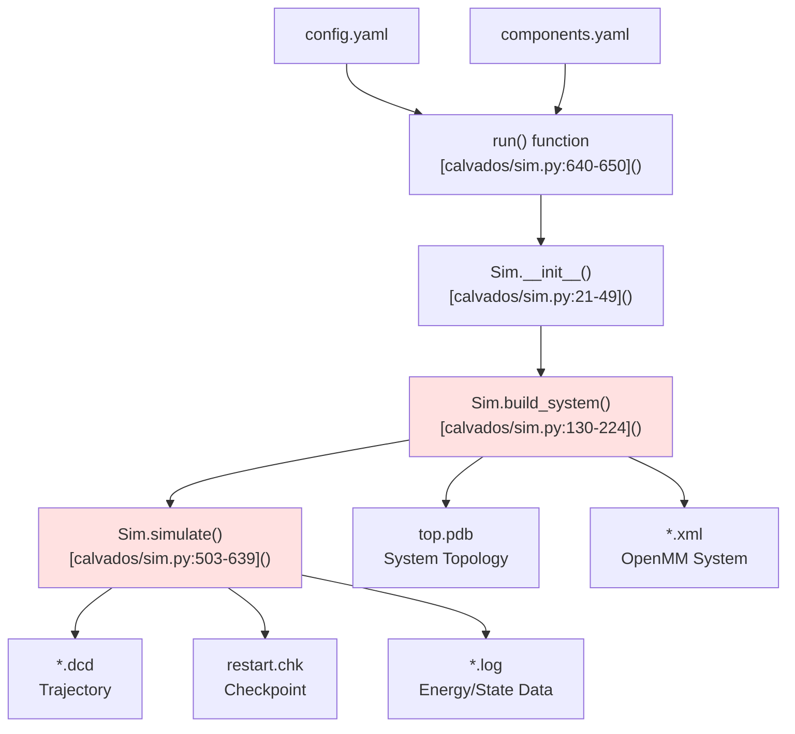
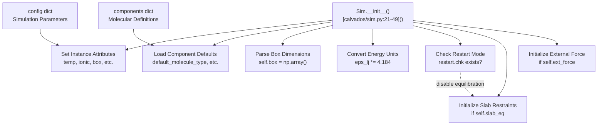
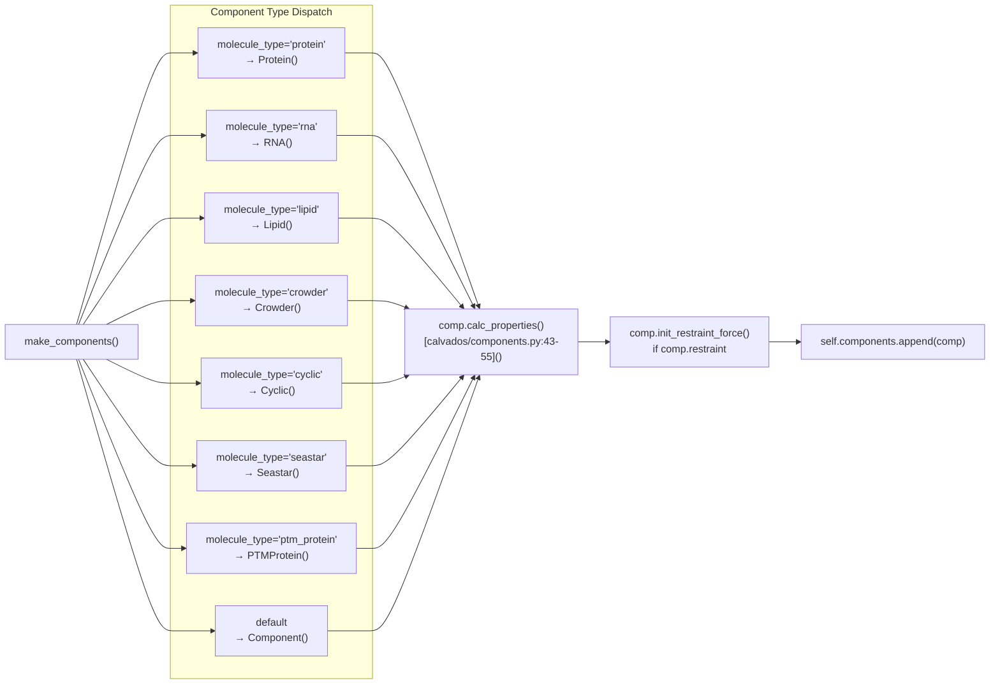
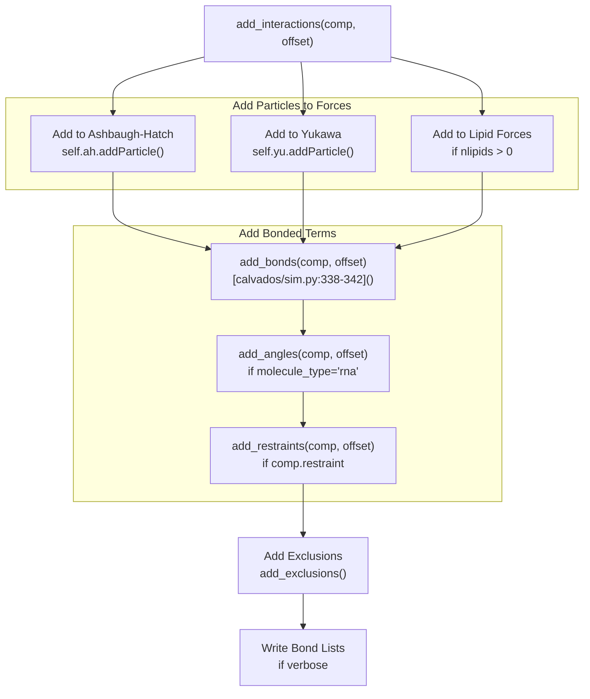
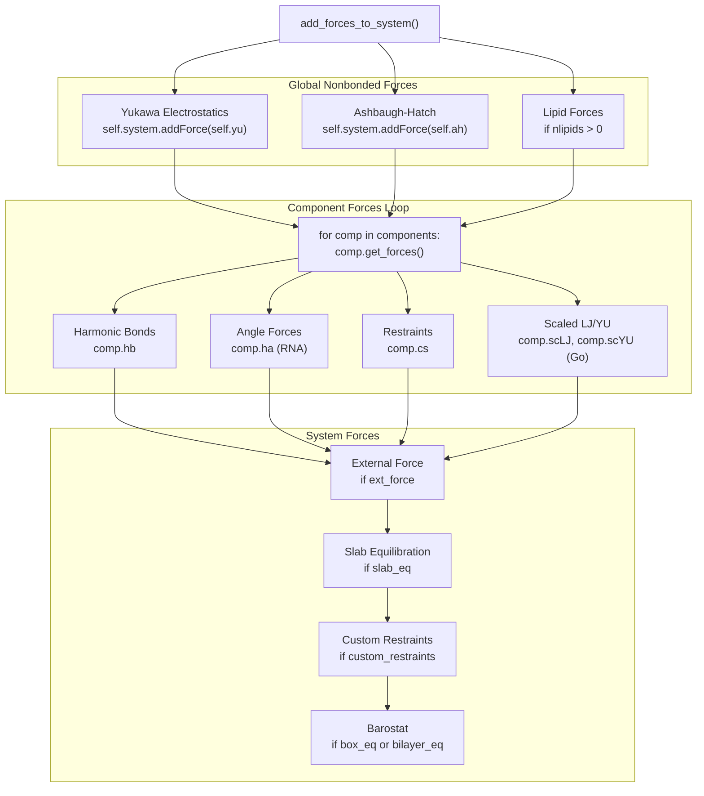
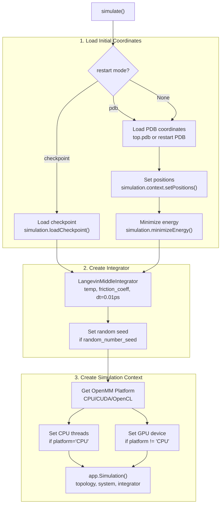
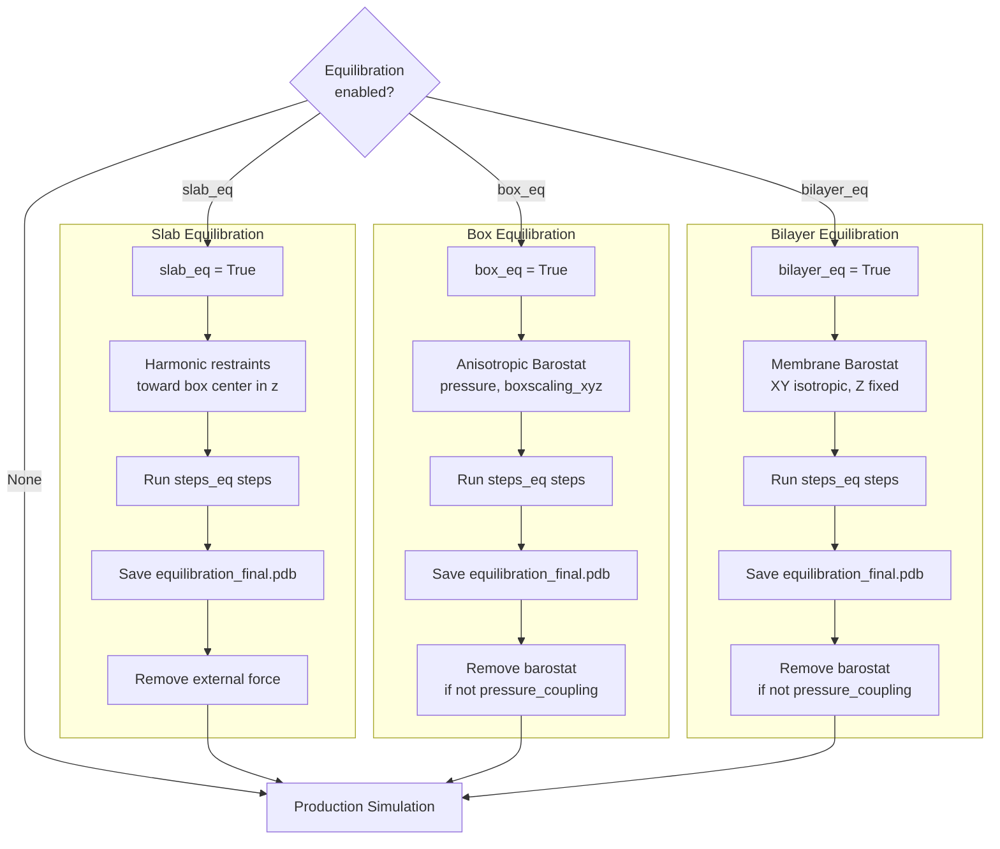
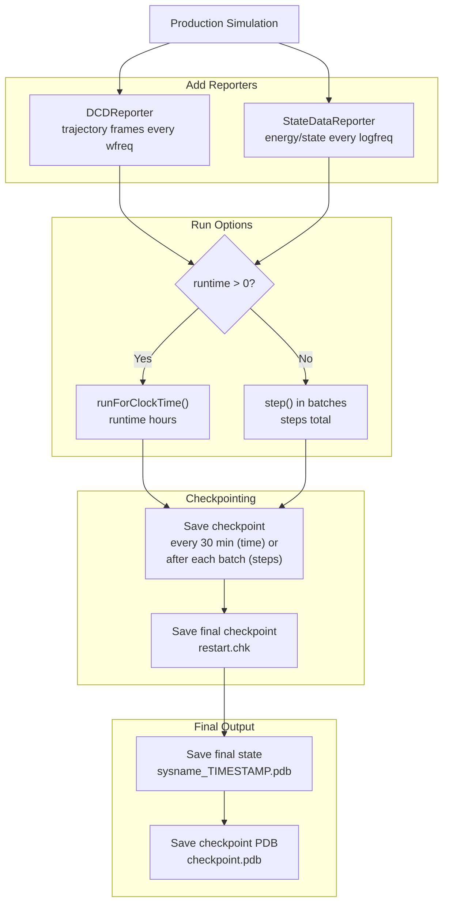

# Running Simulations

<details>
<summary>Relevant source files</summary>

The following files were used as context for generating this wiki page:

- [calvados/components.py](calvados/components.py)
- [calvados/data/default_config.yaml](calvados/data/default_config.yaml)
- [calvados/interactions.py](calvados/interactions.py)
- [calvados/sim.py](calvados/sim.py)

</details>


## Purpose and Scope

This page describes how CALVADOS simulations are executed, from reading configuration files to generating trajectory outputs. It covers the central role of the `Sim` class in orchestrating system construction and molecular dynamics integration, the workflow of building an OpenMM system from component definitions, and the mechanics of running production simulations with optional equilibration phases.

For information about configuring simulation parameters, see [Simulation Setup & Configuration](#2). For details on molecular component types and force field parameters, see [Molecular Components & Force Fields](#3). For post-simulation analysis, see [Trajectory Analysis](#5).

## Execution Overview

CALVADOS simulations follow a two-phase workflow: **system building** and **simulation execution**. The process is orchestrated by the `Sim` class in [calvados/sim.py]().



**Execution Flow**

The simulation execution flow consists of these stages:

1. **Initialization**: The `run()` function loads YAML configuration files and instantiates a `Sim` object
2. **System Building**: `Sim.build_system()` constructs the OpenMM system by instantiating components, placing particles, and initializing forces
3. **Simulation**: `Sim.simulate()` performs energy minimization, optional equilibration, and production MD integration
4. **Output**: Trajectory frames, checkpoint files, and state data are written during simulation

**Sources**: [calvados/sim.py:1-650]()

## The Sim Class

The `Sim` class in [calvados/sim.py:20-639]() is the central orchestrator for simulation execution. It manages all aspects of system construction and MD integration.

### Initialization



**Key Instance Attributes Set During Initialization**

| Attribute | Description | Default Source |
|-----------|-------------|----------------|
| `path` | Working directory for outputs | Function argument |
| `box` | Box dimensions [x, y, z] in nm | config.yaml |
| `temp` | Temperature in Kelvin | config.yaml |
| `ionic` | Ionic strength in M | config.yaml |
| `steps` | Number of simulation steps | config.yaml |
| `platform` | OpenMM platform (CPU/CUDA/OpenCL) | config.yaml |
| `topol` | Molecule placement topology | config.yaml |
| `slab_eq` | Enable slab equilibration | config.yaml |
| `comp_dict` | Dictionary of component definitions | components.yaml |
| `comp_defaults` | Default component parameters | components.yaml |

The initialization also handles restart logic: if `restart='checkpoint'` and a checkpoint file exists, equilibration phases are disabled to continue from the saved state.

**Sources**: [calvados/sim.py:21-49](), [calvados/data/default_config.yaml:1-40]()

## System Building Workflow

The `build_system()` method in [calvados/sim.py:130-224]() constructs the complete OpenMM system. This is where molecular components are instantiated, particles are positioned, and all force objects are initialized and assembled.

### Build System Pipeline

```mermaid
graph TB
    BUILD["Sim.build_system()<br/>[calvados/sim.py:130-224]()"]
    
    subgraph "1. Initialize System"
        TOPO["Create md.Topology<br/>self.top = md.Topology()"]
        SYS["Create openmm.System<br/>self.system = openmm.System()"]
        BOXVEC["Set Periodic Box Vectors<br/>build.build_box()"]
    end
    
    subgraph "2. Initialize Force Field"
        DH["Calculate DH Parameters<br/>genParamsDH(temp, ionic)"]
        NONBOND["Initialize Nonbonded Forces<br/>init_nonbonded_interactions()"]
        LIPID_F["Initialize Lipid Forces<br/>if nlipids > 0"]
    end
    
    subgraph "3. Create Components"
        MAKE["Sim.make_components()<br/>[calvados/sim.py:50-99]()"]
        COUNT["Sim.count_components()<br/>[calvados/sim.py:100-129]()"]
        GRIDS["Build Placement Grids<br/>slab/grid topology"]
    end
    
    subgraph "4. Add Molecules Loop"
        LOOP["for comp in components:<br/>  for idx in range(comp.nmol):"]
        ADDTOP["add_mdtraj_topol(comp)<br/>[calvados/sim.py:431-455]()"]
        ADDPART["add_particles_system(comp.mws)<br/>[calvados/sim.py:456-460]()"]
        PLACE["place_molecule(comp)<br/>[calvados/sim.py:292-318]()"]
        ADDINT["add_interactions(comp)<br/>[calvados/sim.py:378-423]()"]
        EXTRESTR["add_ext_restraints(comp)<br/>if slab_eq or ext_force"]
    end
    
    subgraph "5. Finalize System"
        CUSTOM["Add Custom Restraints<br/>if custom_restraints"]
        SAVEPDB["Save top.pdb<br/>md.Trajectory.save_pdb()"]
        ADDFORCES["add_forces_to_system()<br/>[calvados/sim.py:225-272]()"]
        SUMMARY["print_system_summary()<br/>[calvados/sim.py:273-291]()"]
    end
    
    BUILD --> TOPO
    TOPO --> SYS
    SYS --> BOXVEC
    
    BOXVEC --> DH
    DH --> NONBOND
    NONBOND --> LIPID_F
    
    LIPID_F --> MAKE
    MAKE --> COUNT
    COUNT --> GRIDS
    
    GRIDS --> LOOP
    LOOP --> ADDTOP
    ADDTOP --> ADDPART
    ADDPART --> PLACE
    PLACE --> ADDINT
    ADDINT --> EXTRESTR
    
    EXTRESTR --> CUSTOM
    CUSTOM --> SAVEPDB
    SAVEPDB --> ADDFORCES
    ADDFORCES --> SUMMARY
```



**Sources**: [calvados/sim.py:130-291]()

### Component Instantiation

The `make_components()` method in [calvados/sim.py:50-99]() reads component definitions from the `components.yaml` dictionary and instantiates the appropriate component class based on `molecule_type`:



Each component's `calc_properties()` method calculates sequence-derived parameters (charges, sigmas, lambdas, molecular weights) and initializes bond forces. For components with `restraint=True`, restraint forces are also initialized.

**Sources**: [calvados/sim.py:50-99](), [calvados/components.py:11-108]()

### Particle Placement

After components are instantiated, each molecule is placed in the simulation box according to the `topol` parameter. The placement strategy determines initial particle coordinates:

| Topology | Description | Placement Method |
|----------|-------------|------------------|
| `center` | Single molecule at box center | [calvados/sim.py:306-308]() |
| `slab` | Molecules in central slab geometry | [calvados/sim.py:297-301]() |
| `grid` | Molecules on 3D grid | [calvados/sim.py:302-305]() |
| `random` | Random non-overlapping placement | [calvados/sim.py:314]() |
| `shift_ref_bead` | Center specific reference bead | [calvados/sim.py:309-312]() |

For lipid components, a specialized bilayer placement algorithm is used via `place_bilayer()` in [calvados/sim.py:320-336]().

**Sources**: [calvados/sim.py:292-336]()

### Force Assembly

The `add_interactions()` method in [calvados/sim.py:378-423]() adds particles and bonded interactions for each molecule:



The `offset` parameter tracks the global particle index in the system, ensuring correct indexing as multiple molecules are added sequentially.

Each bonded interaction (bond, restraint) also generates an **exclusion** in the nonbonded force objects (AH, YU) to prevent double-counting interactions. This is handled by `add_exclusions()` in [calvados/sim.py:369-377]().

**Sources**: [calvados/sim.py:378-423](), [calvados/sim.py:338-377]()

### Adding Forces to System

After all components are processed, `add_forces_to_system()` in [calvados/sim.py:225-272]() registers all force objects with the OpenMM system:



Force objects are added in a specific order:
1. **Global nonbonded forces** (AH, YU, lipid cosine/charge-nonpolar)
2. **Component-specific forces** (bonds, angles, restraints, scaled interactions)
3. **System-level forces** (external forces, equilibration restraints, barostats)

**Sources**: [calvados/sim.py:225-272]()

## Running the Simulation

After system building completes, the `simulate()` method in [calvados/sim.py:503-639]() executes the molecular dynamics integration. This involves setting up the OpenMM simulation context, handling restart logic, performing optional equilibration, and running production MD.

### Simulation Setup



The integrator uses a **Langevin Middle** scheme with:
- Time step: 0.01 ps (fixed)
- Temperature: from `config.yaml`
- Friction coefficient: from `config.yaml` (default 0.01 ps⁻¹)

**Sources**: [calvados/sim.py:503-558]()

### Equilibration Phases

CALVADOS supports three equilibration modes, controlled by boolean flags in `config.yaml`. Each mode applies special forces or constraints before production simulation:



| Equilibration Type | Purpose | Force/Constraint | Output |
|-------------------|---------|------------------|--------|
| `slab_eq` | Condense molecules into slab | Harmonic restraint to z=box/2 | `equilibration_*.dcd` |
| `box_eq` | Adjust box size | Anisotropic barostat | `equilibration_*.dcd` |
| `bilayer_eq` | Equilibrate lipid bilayer | Membrane barostat (XY isotropic) | `equilibration_*.dcd` |

After equilibration completes, the system is reinitialized from the final configuration and the equilibration force/barostat is removed (unless `pressure_coupling=True`).

**Sources**: [calvados/sim.py:559-614]()

### Production Run

The production simulation runs for either a fixed number of steps or a specified wall-clock time:



**Runtime Modes**

1. **Clock-time mode** (`runtime > 0`): Runs for a specified number of hours, checkpointing every 30 minutes
2. **Step mode** (`runtime = 0`): Runs for `steps` total steps, checkpointing after each 10% batch

The trajectory is written to `{sysname}.dcd` and state data (energy, temperature, speed) to `{sysname}.log`. If restarting from a checkpoint, these files are appended to rather than overwritten.

**Sources**: [calvados/sim.py:615-639]()

### Restart Capabilities

CALVADOS supports three restart modes via the `restart` parameter in `config.yaml`:

| Restart Mode | Source File | Behavior |
|--------------|-------------|----------|
| `None` | top.pdb | Fresh start, minimize energy, overwrite trajectories |
| `'pdb'` | `frestart` (custom PDB) | Start from custom coordinates, minimize energy |
| `'checkpoint'` | `frestart` (restart.chk) | Resume from checkpoint, append to trajectory |

When restarting from a checkpoint:
- The simulation context state (positions, velocities, random number generator) is restored
- Equilibration phases are skipped
- Trajectory and log files are appended to
- No energy minimization is performed

**Sources**: [calvados/sim.py:506-558]()

## Output Files

A simulation run generates several output files in the working directory (`path`):

### During System Building

| File | Description | Format | Code Reference |
|------|-------------|--------|----------------|
| `top.pdb` | System topology with initial coordinates | PDB | [calvados/sim.py:217-220]() |
| `{sysname}.xml` | Serialized OpenMM system | XML | [calvados/sim.py:277-278]() |
| `bonds_{comp}.txt` | Bond list for each component | Text | [calvados/components.py:101-107]() |
| `restr_{comp}.txt` | Restraint list for each component | Text | [calvados/components.py:274-292]() |

### During Simulation

| File | Description | Format | Frequency | Code Reference |
|------|-------------|--------|-----------|----------------|
| `{sysname}.dcd` | Trajectory frames | Binary DCD | Every `wfreq` steps | [calvados/sim.py:616]() |
| `{sysname}.log` | Energy and state data | Text | Every `logfreq` steps | [calvados/sim.py:617-618]() |
| `restart.chk` | Checkpoint for restart | Binary | Every 30 min or 10% | [calvados/sim.py:622,628]() |
| `equilibration_{sysname}.dcd` | Equilibration trajectory | Binary DCD | Every `wfreq` steps | [calvados/sim.py:561,584]() |
| `equilibration_final.pdb` | Final equilibrated state | PDB | End of equilibration | [calvados/sim.py:564,587]() |

### After Simulation

| File | Description | Format | Code Reference |
|------|-------------|--------|----------------|
| `{sysname}_TIMESTAMP.pdb` | Final simulation state | PDB | [calvados/sim.py:635-636]() |
| `checkpoint.pdb` | Final state (generic name) | PDB | [calvados/sim.py:637-638]() |

The DCD trajectory file can be loaded with MDAnalysis or mdtraj for analysis. The log file contains tab-separated columns including step number, potential energy (if `report_potential_energy=True`), elapsed time, and simulation speed.

**Sources**: [calvados/sim.py:217-220,273-291,561-638]()

## Entry Point

The typical entry point for running a simulation is the `run()` function in [calvados/sim.py:640-650]():

```python
def run(path='.', fconfig='config.yaml', fcomponents='components.yaml'):
    with open(f'{path}/{fconfig}','r') as stream:
        config = safe_load(stream)
    
    with open(f'{path}/{fcomponents}','r') as stream:
        components = safe_load(stream)
    
    mysim = Sim(path, config, components)
    mysim.build_system()
    mysim.simulate()
    return mysim
```

This function:
1. Loads YAML configuration files
2. Instantiates a `Sim` object
3. Builds the OpenMM system
4. Runs the simulation
5. Returns the `Sim` object for inspection

The function can be called from Python scripts or used as a template for custom simulation workflows.

**Sources**: [calvados/sim.py:640-650]()

---