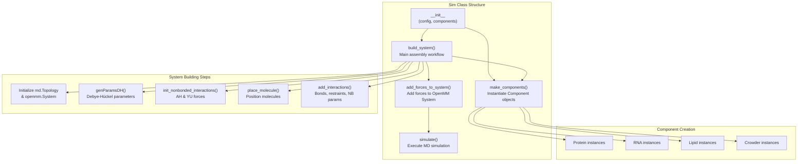
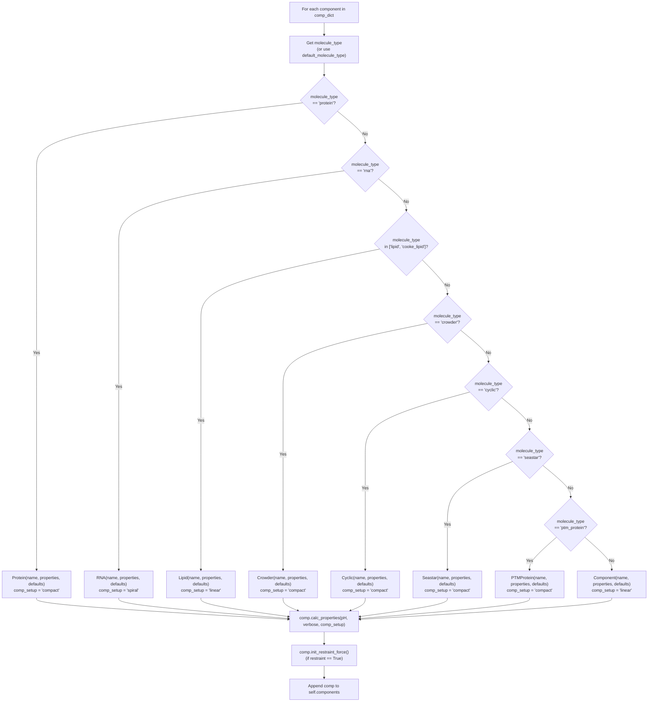
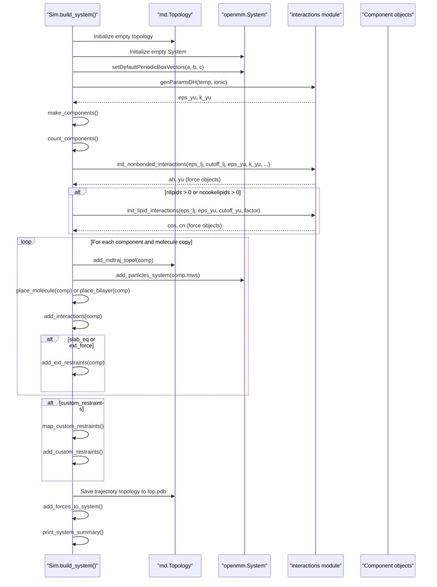
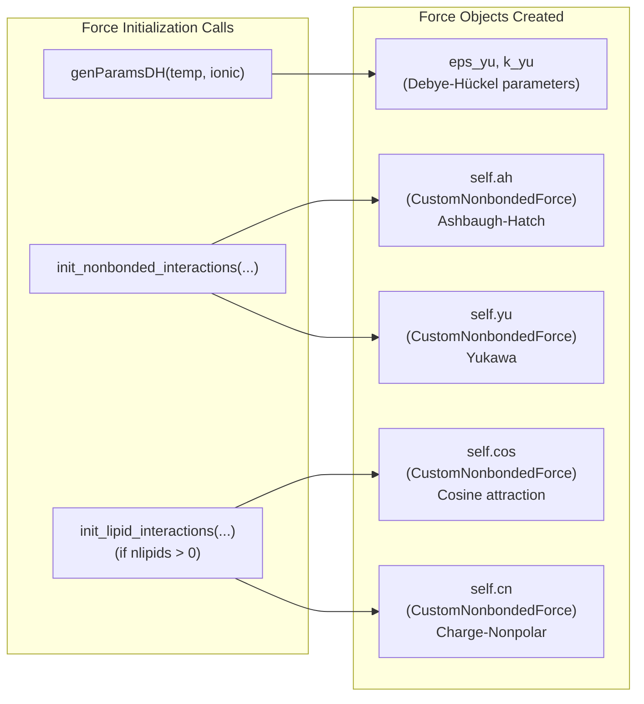
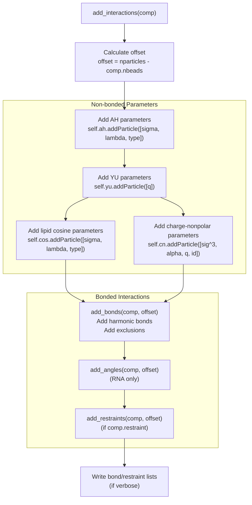
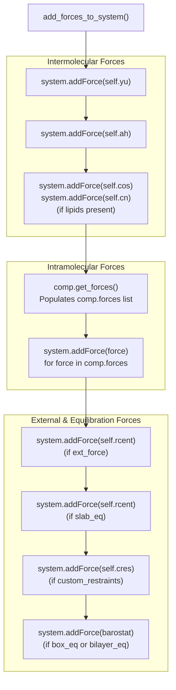

# Sim Class & System Building

<details>
<summary>Relevant source files</summary>

The following files were used as context for generating this wiki page:

- [calvados/components.py](calvados/components.py)
- [calvados/sim.py](calvados/sim.py)

</details>


## Purpose and Scope

This page documents the `Sim` class and its `build_system` method, which serve as the central orchestration layer for CALVADOS simulations. The `Sim` class is responsible for:

- Reading configuration and component specifications from YAML files
- Instantiating molecular components based on their types
- Initializing force field parameters and OpenMM force objects
- Placing molecules in the simulation box according to specified topologies
- Assembling bonded and non-bonded interactions
- Building the complete OpenMM System ready for simulation

For information about configuring simulation parameters, see [Config Class - Simulation Parameters](#2.1). For details on molecular component definitions, see [Components Class - Molecular Definitions](#2.2). For the component class hierarchy itself, see [Component Class Hierarchy](#3.1). For molecule placement algorithms, see [Molecule Placement Strategies](#4.2).

---

## Sim Class Overview

The `Sim` class is defined in [calvados/sim.py:20-639]() and serves as the main simulation orchestrator. It coordinates the entire workflow from configuration parsing to system construction to MD execution.

### Key Attributes

| Attribute | Type | Description |
|-----------|------|-------------|
| `path` | str | Working directory for simulation outputs |
| `box` | np.ndarray | Box dimensions [x, y, z] in nm |
| `system` | openmm.System | OpenMM System object containing all forces and particles |
| `top` | md.Topology | MDTraj topology for trajectory I/O |
| `components` | np.ndarray | Array of Component objects (Protein, RNA, Lipid, etc.) |
| `ah`, `yu` | CustomNonbondedForce | Ashbaugh-Hatch and Yukawa force objects |
| `nparticles` | int | Total number of beads in the system |
| `pos` | list | Positions of all particles (built incrementally) |

### Key Methods

| Method | Purpose |
|--------|---------|
| `__init__` | Parse configuration, initialize attributes |
| `make_components` | Instantiate Component objects based on molecule_type |
| `build_system` | Main workflow: assemble complete OpenMM System |
| `add_forces_to_system` | Add all force objects to the OpenMM System |
| `add_interactions` | Add interactions for a single component |
| `place_molecule` | Place a molecule in the simulation box |
| `simulate` | Execute the MD simulation |

**Sources:** [calvados/sim.py:20-639]()

---

## Sim Class Architecture



**Sources:** [calvados/sim.py:20-649]()

---

## Initialization: `__init__` Method

The `Sim.__init__` method [calvados/sim.py:21-49]() parses the configuration and components dictionaries loaded from YAML files.

### Configuration Processing

```python
def __init__(self, path, config, components):
    self.path = path
    # Parse config dictionary into attributes
    for key, val in config.items():
        setattr(self, key, val)
    
    # Parse component defaults
    for key, val in components['defaults'].items():
        setattr(self, f'default_{key}', val)
    
    self.comp_dict = components['system']
    self.comp_defaults = components['defaults']
```

Key operations:
1. **Path Setup**: Sets working directory for all output files
2. **Config Parsing**: Converts all config.yaml parameters to `Sim` attributes
3. **Component Defaults**: Stores default component properties with `default_` prefix
4. **Unit Conversion**: Converts `eps_lj` from kcal/mol to kJ/mol (line 38)
5. **Equilibration Setup**: Initializes slab or external force restraints if enabled (lines 40-48)

### Restart Logic

| Condition | Behavior |
|-----------|----------|
| `restart == 'checkpoint'` and checkpoint file exists | Disable slab_eq and bilayer_eq (continue from checkpoint) |
| `slab_eq == True` | Initialize `rcent` force for slab equilibration |
| `ext_force == True` | Initialize custom external force with user expression |

**Sources:** [calvados/sim.py:21-49]()

---

## Component Creation: `make_components` Method

The `make_components` method [calvados/sim.py:50-98]() instantiates molecular components based on their `molecule_type` property.

### Component Type Decision Tree



### Component Property Calculation

After instantiation, each component's `calc_properties` method is called [calvados/sim.py:87]():

```python
comp.eps_lj = self.eps_lj  # Share LJ epsilon with component
comp.calc_properties(pH=self.pH, verbose=self.verbose, comp_setup=comp_setup)
```

This triggers:
1. Sequence reading from FASTA or PDB
2. Property calculation (sigmas, lambdas, charges, masses)
3. Initial coordinate generation (spiral, linear, or compact)
4. Bond force initialization
5. For proteins with restraints: PDB loading, distance map calculation, Go-model scaling

### Restraint Force Initialization

For components with `restraint == True` [calvados/sim.py:88-96]():

```python
if comp.restraint:
    if comp.restraint_type == 'go':
        comp.init_restraint_force(
            eps_lj=self.eps_lj, cutoff_lj=self.cutoff_lj,
            eps_yu=self.eps_yu, k_yu=self.k_yu
        )
    else:
        comp.init_restraint_force()
    self.use_restraints = True
```

Go-model restraints require additional force objects for scaled LJ and YU interactions (see [Restraints System](#3.5)).

**Sources:** [calvados/sim.py:50-98](), [calvados/components.py:11-108]()

---

## System Building Workflow: `build_system` Method

The `build_system` method [calvados/sim.py:130-223]() is the main orchestration function that assembles the complete OpenMM System.

### Build System Sequence Diagram



### Workflow Steps

| Step | Line Range | Description |
|------|------------|-------------|
| 1. Initialize Topology & System | 139-142 | Create empty `md.Topology` and `openmm.System`, set periodic box vectors |
| 2. Calculate DH Parameters | 146 | Call `genParamsDH(temp, ionic)` to get electrostatic parameters |
| 3. Make Components | 149 | Call `make_components()` to instantiate all Component objects |
| 4. Count Components | 150 | Organize components by type, validate topology compatibility |
| 5. Initialize Non-bonded Forces | 153-165 | Create AH and YU force objects; create lipid forces if needed |
| 6. Place Molecules | 172-211 | Loop over components, place molecules, add to topology and system |
| 7. Add Interactions | 207 | Add bonded/non-bonded parameters for each molecule |
| 8. Custom Restraints | 213-215 | Parse and add user-defined restraints if specified |
| 9. Save Topology | 217-220 | Save initial configuration as `top.pdb` |
| 10. Add Forces | 222 | Call `add_forces_to_system()` to attach all forces |
| 11. Summary | 223 | Print system statistics and save XML |

**Sources:** [calvados/sim.py:130-223]()

---

## Force Initialization

Force initialization occurs in two stages: global force object creation and per-component parameter addition.

### Global Force Object Creation



#### Debye-Hückel Parameter Generation

[calvados/sim.py:146]() calls `interactions.genParamsDH(self.temp, self.ionic)`:

```python
self.eps_yu, self.k_yu = interactions.genParamsDH(self.temp, self.ionic)
```

This calculates:
- `eps_yu`: Prefactor for Yukawa potential based on temperature and dielectric constant
- `k_yu`: Inverse Debye screening length based on ionic strength

#### Non-bonded Force Initialization

[calvados/sim.py:153-154]() creates Ashbaugh-Hatch and Yukawa force objects:

```python
self.ah, self.yu = interactions.init_nonbonded_interactions(
    self.eps_lj, self.cutoff_lj, self.eps_yu, self.k_yu, self.cutoff_yu, self.fixed_lambda
)
```

These `CustomNonbondedForce` objects define the functional forms but contain no particles initially.

#### Lipid Force Initialization

If lipids are present [calvados/sim.py:156-165](), additional forces are created:

```python
if self.nlipids > 0:
    self.cos, self.cn = interactions.init_lipid_interactions(
        self.eps_lj, self.eps_yu, self.cutoff_yu, factor=1.9
    )
elif self.ncookelipids > 0:
    self.cos, self.cn = interactions.init_lipid_interactions(
        self.eps_lj, self.eps_yu, self.cutoff_yu, factor=3.0
    )
```

- `cos`: Cosine attraction between tail beads
- `cn`: Charge-nonpolar interaction between charged and nonpolar beads
- `factor`: Controls strength relative to eps_lj (1.9 for standard lipids, 3.0 for Cooke lipids)

**Sources:** [calvados/sim.py:146-165](), [calvados/interactions.py]()

---

## Particle and Topology Setup

For each molecule of each component, the system adds particles to both the MDTraj topology and the OpenMM System.

### Topology Grid Initialization

Before placing molecules, spatial grids are initialized based on topology type [calvados/sim.py:172-190]():

| Topology Type | Grid Initialization |
|---------------|---------------------|
| `'slab'` | `xyzgrid` for proteins/RNA in central slab region; additional grids for crowders in outer regions |
| `'grid'` | `xyzgrid` covering entire box for all molecules |
| Lipids present | `bilayergrid` for xy plane; `xyzgrid` for proteins/RNA in solution regions |

### Per-Molecule Loop

The main assembly loop [calvados/sim.py:192-211]():

```python
for cidx, comp in enumerate(self.components):
    for idx in range(comp.nmol):
        # 1. Add to MDTraj topology
        self.add_mdtraj_topol(comp)
        
        # 2. Add particles to OpenMM System
        self.add_particles_system(comp.mws)
        
        # 3. Place molecule in space
        if comp.molecule_type in ['protein','crowder','cyclic','seastar','ptm_protein']:
            xs = self.place_molecule(comp)
        elif comp.molecule_type in ['lipid','cooke_lipid']:
            xs = self.place_bilayer(comp)
        elif comp.molecule_type == 'rna':
            xs = self.place_molecule(comp)
        
        # 4. Add interactions
        self.add_interactions(comp)
        
        # 5. Add external restraints (if equilibrating)
        if (self.slab_eq or self.ext_force) and comp.ext_restraint:
            self.add_ext_restraints(comp)
```

### MDTraj Topology Construction

`add_mdtraj_topol(comp)` [calvados/sim.py:431-454]() creates a new chain in the topology with appropriate residues and bonds:

For **proteins/crowders**:
- Each residue → one CA atom
- Bonds added based on `comp.bond_check(i, i+1)`

For **RNA**:
- Each nucleotide → two atoms (phosphate "P" and base "N")
- Bonds added based on `comp.bond_check(i, j)`

### OpenMM Particle Addition

`add_particles_system(mws)` [calvados/sim.py:456-460]() adds particles with masses:

```python
for mw in mws:
    self.system.addParticle(mw*unit.amu)
```

Each particle is added sequentially, incrementing `self.nparticles`.

**Sources:** [calvados/sim.py:172-211, 292-336, 431-460]()

---

## Interaction Assembly: `add_interactions` Method

The `add_interactions` method [calvados/sim.py:378-422]() adds all interactions for a single molecule copy.

### Interaction Assembly Flow



### Non-bonded Parameter Addition

#### Ashbaugh-Hatch Parameters

[calvados/sim.py:385-397]() loops over component beads:

```python
for sig, lam in zip(comp.sigmas, comp.lambdas):
    if comp.molecule_type in ['lipid', 'cooke_lipid']:
        self.ah.addParticle([sig*unit.nanometer, lam, 0])  # type=0
    elif comp.molecule_type == 'crowder':
        self.ah.addParticle([sig*unit.nanometer, lam, -1]) # type=-1
    else:  # protein, RNA
        self.ah.addParticle([sig*unit.nanometer, lam, 1])  # type=1
```

The `type` parameter controls interaction selectivity:
- `type=1`: Proteins/RNA (fully interacting)
- `type=0`: Lipids (selective interactions)
- `type=-1`: Crowders (repulsive only)

#### Yukawa Electrostatic Parameters

[calvados/sim.py:399-400]():

```python
for q in comp.qs:
    self.yu.addParticle([q])
```

Each bead's charge is added directly.

#### Lipid-Specific Parameters

If lipids are present [calvados/sim.py:403-406]():

```python
if self.nlipids > 0 or self.ncookelipids > 0:
    id_cn = 1 if comp.molecule_type == 'protein' else -1
    for sig, alpha, q in zip(comp.sigmas, comp.alphas, comp.qs):
        self.cn.addParticle([(sig/2)**3, alpha, q, id_cn])
```

### Bonded Interaction Addition

#### Bonds

`add_bonds(comp, offset)` [calvados/sim.py:338-342]() calls `comp.add_bonds(offset)`:

1. Component determines bonded pairs via `comp.bond_check(i, j)`
2. For each bonded pair, adds to `comp.hb` (HarmonicBondForce)
3. Returns exclusion map for non-bonded forces
4. `add_exclusions(exclusion_map)` excludes bonded pairs from AH and YU

#### Angles (RNA only)

[calvados/sim.py:411-412]():

```python
if comp.molecule_type == 'rna':
    self.add_angles(comp, offset)
```

RNA components have angle forces between phosphate beads.

#### Restraints

[calvados/sim.py:415-416]():

```python
if comp.restraint:
    self.add_restraints(comp, offset)
```

Calls `comp.add_restraints(offset)` which adds:
- **Harmonic restraints**: Between residue pairs in structured domains
- **Go-model restraints**: Scaled by AlphaFold confidence and PAE
- **Scaled LJ/YU**: For weakly restrained pairs in Go-model

**Sources:** [calvados/sim.py:378-422](), [calvados/components.py:85-96, 218-229, 240-272]()

---

## Adding Forces to System: `add_forces_to_system` Method

After all components are assembled, `add_forces_to_system()` [calvados/sim.py:225-271]() adds all force objects to the OpenMM System.

### Force Addition Order



### Component Forces

Each component's `get_forces()` method [calvados/components.py:98-99, 293-298]() populates its `forces` list:

**Protein**:
- `comp.hb` (HarmonicBondForce)
- `comp.cs` (restraint force, if `restraint=True`)
- `comp.scLJ`, `comp.scYU` (scaled forces for Go-model)

**RNA**:
- `comp.hb` (bonds between phosphate-phosphate and phosphate-base)
- `comp.scLJ_rna` (base-base interactions)
- `comp.ha` (HarmonicAngleForce for phosphate angles)
- `comp.cs` (restraints, if `restraint=True`)

**Lipid**:
- `comp.hb` (bonds or WCA-Fene bonds)
- `comp.ha` (angles for branching, if `molecule_type=='lipid'`)

### Barostat Forces

For pressure equilibration [calvados/sim.py:257-271]():

| Equilibration Type | Barostat |
|--------------------|----------|
| `box_eq=True` | `MonteCarloAnisotropicBarostat` with directional scaling |
| `bilayer_eq=True` | `MonteCarloMembraneBarostat` with XY isotropic, Z fixed |

**Sources:** [calvados/sim.py:225-271](), [calvados/components.py:98-99, 293-298, 363-366]()

---

## System Summary and Output

After force addition, `print_system_summary()` [calvados/sim.py:273-290]() outputs system statistics and optionally writes the System to XML format.

### System Statistics Output

```
{nparticles} particles in the system
---------- FORCES ----------
ah: {n_particles} particles, {n_exclusions} exclusions
yu: {n_particles} particles, {n_exclusions} exclusions
```

Additional output for special cases:
- Slab equilibration: Number of particles with external restraints
- Bilayer equilibration: Notification of zero lateral tension
- Box equilibration: Which axes (X/Y/Z) are scaling
- Custom restraints: Number of custom restraint bonds
- Component restraints: Number of restraints per component

### XML Serialization

[calvados/sim.py:277-278]():

```python
with open(f'{self.path}/{self.sysname}.xml', 'w') as output:
    output.write(openmm.XmlSerializer.serialize(self.system))
```

This saves the complete OpenMM System including all forces, particles, and parameters for inspection or reloading.

**Sources:** [calvados/sim.py:273-290]()

---

## Summary: Data Flow Through build_system

The following table summarizes the complete data flow:

| Stage | Input | Processing | Output |
|-------|-------|------------|--------|
| **Initialization** | config.yaml, components.yaml | Parse YAML → Sim attributes | Configured Sim object |
| **Component Creation** | comp_dict, comp_defaults | Instantiate by molecule_type, calc_properties() | Array of Component objects |
| **Force Initialization** | temp, ionic, eps_lj, cutoffs | genParamsDH(), init_*_interactions() | Force objects (ah, yu, cos, cn) |
| **Topology Setup** | Components | Initialize empty md.Topology and openmm.System | Empty topology and system |
| **Molecule Placement** | Component initial coords, topology type | place_molecule() or place_bilayer() | Positioned molecules in self.pos |
| **Interaction Assembly** | Component parameters | add_interactions() → addParticle() for forces | Populated force objects with parameters |
| **Bonded Terms** | Component bond_check() logic | add_bonds(), add_angles(), add_restraints() | Bonded forces and exclusions |
| **Force Addition** | All force objects | add_forces_to_system() | Complete OpenMM System ready for simulation |
| **Topology Output** | self.pos, self.top | MDTraj save to top.pdb | Initial configuration PDB file |

**Sources:** [calvados/sim.py:130-223]()

---