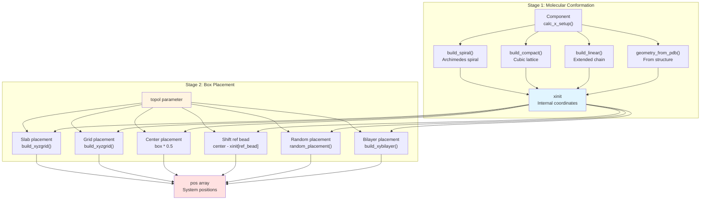
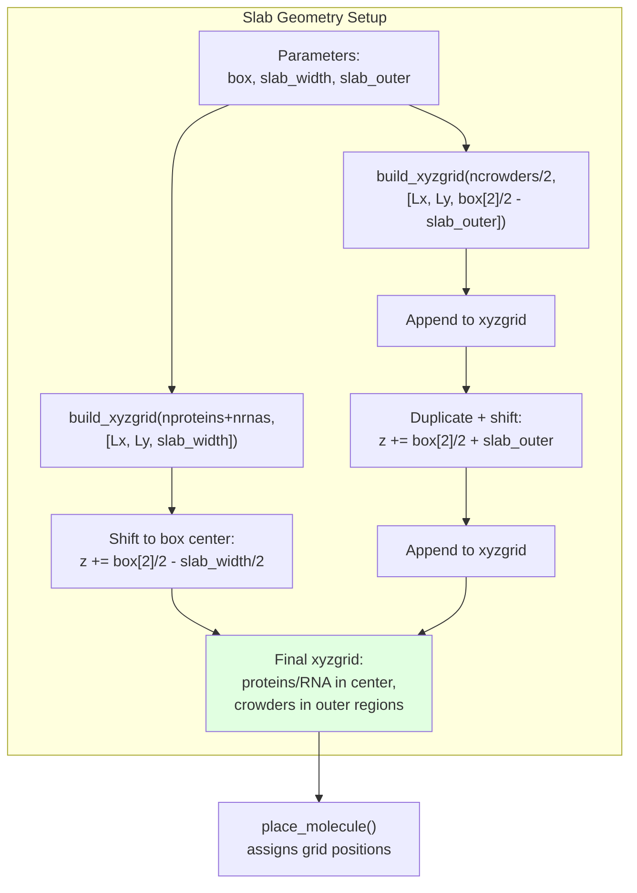
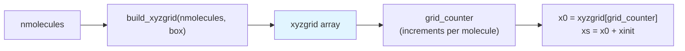
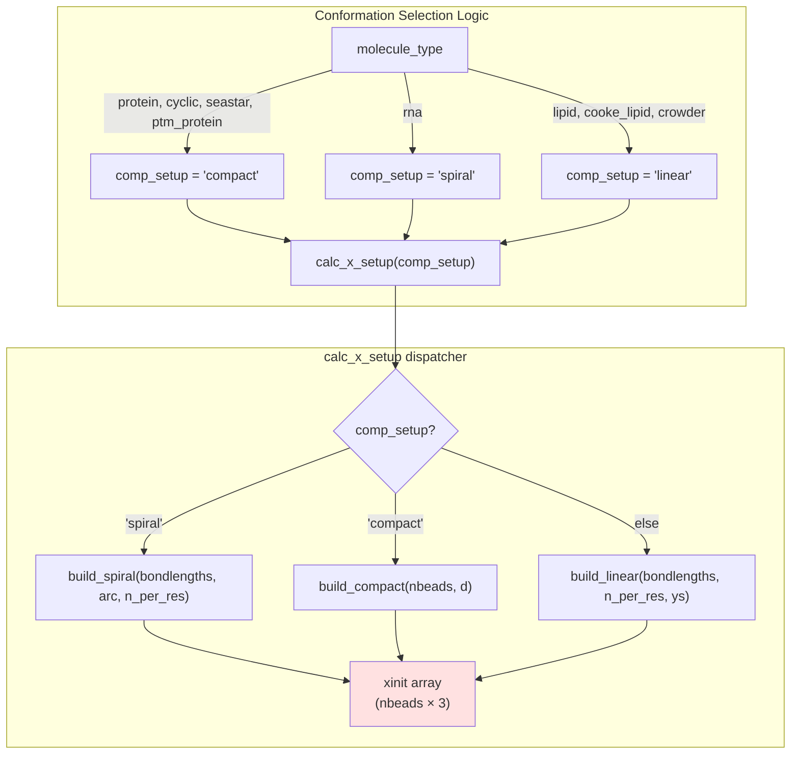
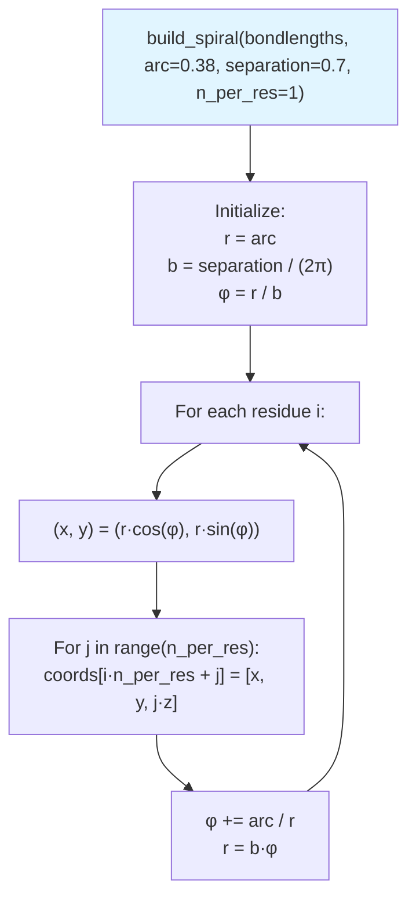
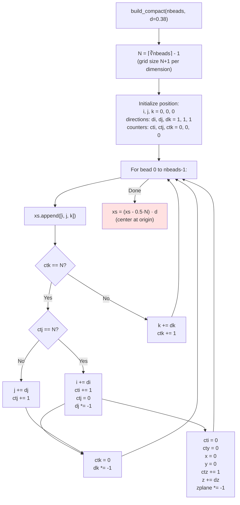
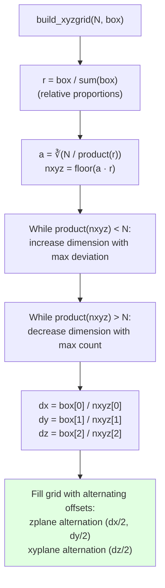
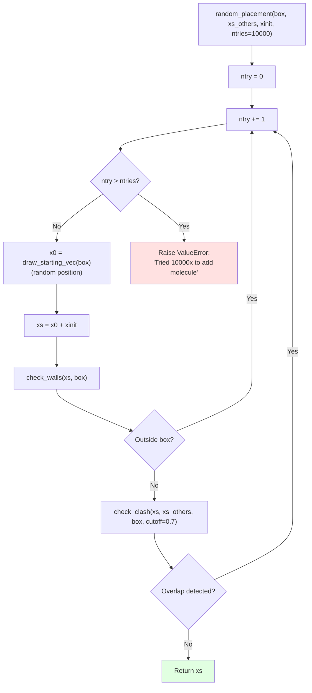
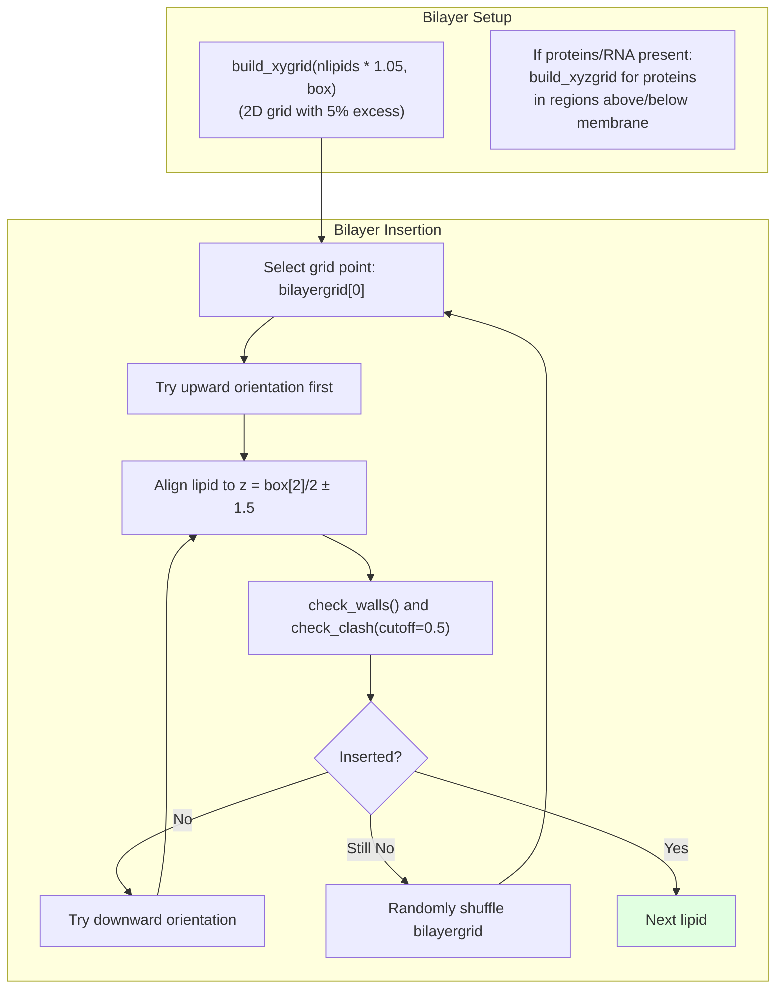
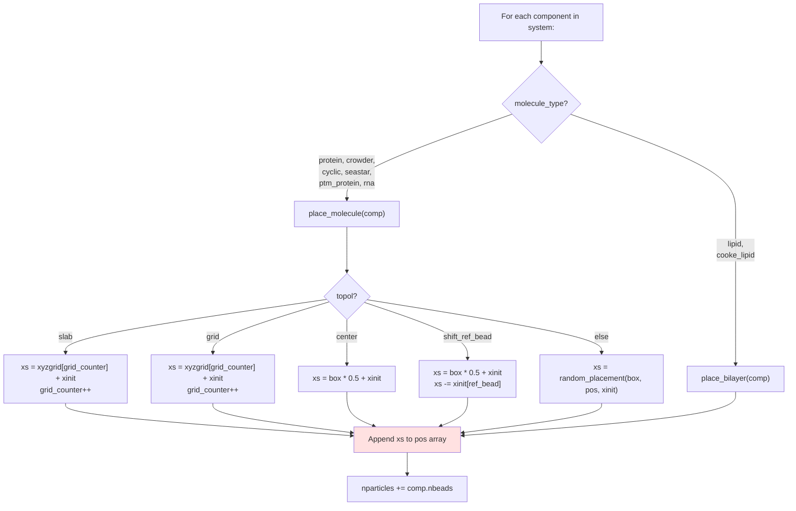

# Molecule Placement Strategies

<details>
<summary>Relevant source files</summary>

The following files were used as context for generating this wiki page:

- [calvados/build.py](calvados/build.py)
- [calvados/components.py](calvados/components.py)
- [calvados/sequence.py](calvados/sequence.py)
- [calvados/sim.py](calvados/sim.py)
- [examples/single_dsRNA/input/domains.yaml](examples/single_dsRNA/input/domains.yaml)
- [examples/single_dsRNA/input/dspolyR12.pdb](examples/single_dsRNA/input/dspolyR12.pdb)
- [examples/single_dsRNA/input/fastalib.fasta](examples/single_dsRNA/input/fastalib.fasta)
- [examples/single_dsRNA/input/residues_C2RNA.csv](examples/single_dsRNA/input/residues_C2RNA.csv)
- [examples/single_dsRNA/prepare.py](examples/single_dsRNA/prepare.py)

</details>


## Purpose and Scope

This page documents the algorithms and strategies used by CALVADOS to position molecules in the simulation box during system initialization. Molecule placement occurs during the `build_system` phase and determines the initial spatial configuration of all components before simulation begins. 

For information about system building workflow, see [Sim Class & System Building](#4.1). For details on simulation execution after placement, see [Equilibration & Production](#4.3). For component-specific properties and structure building, see [Component Class Hierarchy](#3.1).

---

## Placement Workflow Overview

Molecule placement in CALVADOS follows a two-stage process: first, each component builds its internal structure (molecular conformation), then the entire molecule is positioned in the simulation box according to the chosen topology.



**Sources:** [calvados/sim.py:292-336](), [calvados/components.py:63-70](), [calvados/build.py:84-294]()

---

## Topology Modes

The `topol` configuration parameter controls the overall placement strategy. Each mode is designed for specific simulation scenarios.

| Topology | Description | Use Case | Grid Function | Constraints |
|----------|-------------|----------|---------------|-------------|
| `slab` | Molecules in central slab region | Phase separation studies | `build_xyzgrid` | Crowders in outer regions |
| `grid` | Regular 3D grid placement | Multi-component systems | `build_xyzgrid` | All molecules on grid |
| `center` | Single molecule at box center | Single IDR simulations | None | Only 1 molecule |
| `shift_ref_bead` | Center with reference bead aligned | Folded protein analysis | None | Only 1 molecule |
| `random` | Random non-overlapping placement | Default fallback | None | Clash detection required |

**Sources:** [calvados/sim.py:121-122](), [calvados/sim.py:292-314]()

### Slab Topology

Designed for liquid-liquid phase separation simulations, the slab topology concentrates proteins/RNA in a central slab region while placing crowders in outer regions.



**Sources:** [calvados/sim.py:172-178]()

### Grid Topology

Standard 3D lattice placement for general multi-component systems.



The `build_xyzgrid` function distributes molecules as uniformly as possible across the box volume, accounting for different box aspect ratios.

**Sources:** [calvados/sim.py:179-180](), [calvados/sim.py:302-305]()

---

## Initial Molecular Conformations

Before placement in the box, each component builds its internal coordinate array (`xinit`). The conformation builder is selected automatically based on molecule type, or can be controlled via the `comp_setup` parameter.



**Sources:** [calvados/sim.py:50-87](), [calvados/components.py:63-70]()

### Spiral Conformation

Creates an Archimedes spiral, commonly used for unfolded proteins and RNA.



Parameters:
- `arc`: Distance between consecutive points along the spiral (default 0.38 nm)
- `separation`: Distance between consecutive turnings (default 0.7 nm)
- `n_per_res`: Number of beads per residue (1 for proteins, 2 for RNA)

**Sources:** [calvados/build.py:108-124]()

### Compact Conformation

Generates a cubic lattice arrangement, suitable for globular proteins or crowders.

The algorithm fills a 3D grid by alternating directions to create a space-filling path:



**Sources:** [calvados/build.py:126-152]()

### Linear Conformation

Builds an extended chain growing along the z-axis, used for lipids and membrane systems.

**Sources:** [calvados/build.py:84-100]()

---

## Grid Generation Algorithms

### 3D Grid (`build_xyzgrid`)

The 3D grid algorithm distributes N molecules uniformly across a box with dimensions `[Lx, Ly, Lz]`, accounting for non-cubic boxes.



Key features:
- Maintains aspect ratio of the box
- Uses alternating offsets between layers to improve uniformity
- Iteratively adjusts grid dimensions to match exact molecule count

**Sources:** [calvados/build.py:222-294]()

### 2D Grid (`build_xygrid`)

For bilayer and slab systems, the 2D grid distributes molecules across the xy-plane at a fixed z-coordinate.

**Sources:** [calvados/build.py:195-220]()

---

## Random Placement with Clash Detection

When no specific topology is set, molecules are placed randomly while avoiding overlaps.



### Clash Detection Algorithm

The `check_clash` function uses MDAnalysis distance calculations to detect particle overlaps:

```python
# Simplified logic from calvados/build.py:52-63
def check_clash(x, pos, box, cutoff=0.7):
    boxfull = np.append(box, [90,90,90])  # box + angles
    xothers = np.array(pos)
    if len(xothers) == 0:
        return False  # no other particles
    d = distances.distance_array(x, xothers, boxfull)
    if np.amin(d) < cutoff:
        return True  # clash detected
    else:
        return False  # no clash
```

**Sources:** [calvados/build.py:154-170](), [calvados/build.py:42-63]()

---

## Bilayer Systems

Lipid bilayers require specialized placement to create membrane structures.



The bilayer is constructed at the center of the box (z = box[2]/2) with lipids oriented perpendicular to the membrane plane. The 5% excess grid points provide flexibility when placement attempts fail due to steric clashes.

**Sources:** [calvados/sim.py:181-190](), [calvados/sim.py:320-336](), [calvados/build.py:172-193]()

---

## Placement Method Routing in Sim Class

The `Sim.build_system` method routes each component to the appropriate placement function based on molecule type:



**Sources:** [calvados/sim.py:192-207]()

---

## Configuration Example

Example showing how placement strategies are configured:

```yaml
# config.yaml
topol: 'slab'          # Topology mode
box: [25, 25, 100]     # Box dimensions [nm]
slab_width: 20.0       # Slab region width [nm]
slab_outer: 5.0        # Distance from slab to crowder regions [nm]
```

```yaml
# components.yaml
system:
  protein_A:
    molecule_type: 'protein'
    nmol: 50
    # Will be placed in central slab region
  
  crowder_PEG:
    molecule_type: 'crowder'
    nmol: 200
    # Will be placed in outer regions for slab topology
```

For a single molecule in the center:

```yaml
# config.yaml
topol: 'center'
box: [20, 20, 20]

# components.yaml
system:
  my_IDR:
    molecule_type: 'protein'
    nmol: 1
```

**Sources:** [calvados/sim.py:44](), [calvados/cfg.py]()

---

## Summary Table: Placement Strategy Selection

| Component Type | Default comp_setup | Recommended topol | Grid Used | Special Handling |
|----------------|-------------------|-------------------|-----------|------------------|
| Protein (unfolded) | `compact` | `slab`, `grid`, `random` | xyzgrid | None |
| Protein (restraints) | from PDB | `center`, `shift_ref_bead` | None | Uses PDB coordinates |
| RNA | `spiral` | `slab`, `grid` | xyzgrid | Two-bead model (n_per_res=2) |
| Lipid | `linear` | N/A | xygrid (bilayer) | Oriented perpendicular to membrane |
| Crowder | `compact` | `slab` (outer), `grid` | xyzgrid | Excluded volume particles |
| Cyclic | `compact` | `grid`, `random` | xyzgrid | Closed ring topology |

**Sources:** [calvados/sim.py:56-84](), [calvados/components.py:168-188]()

---