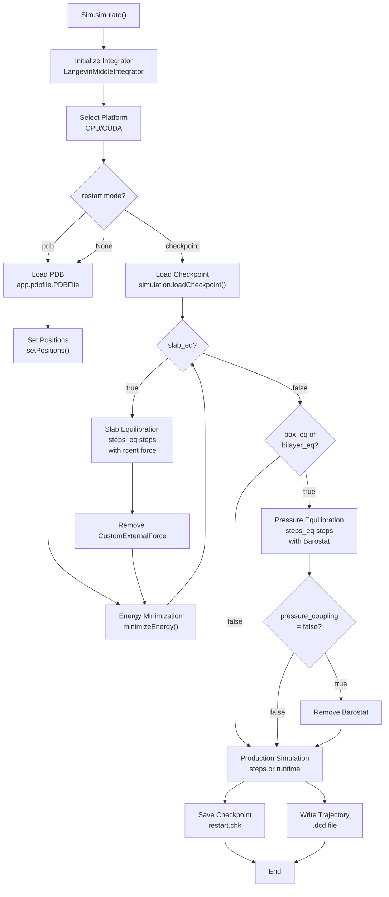
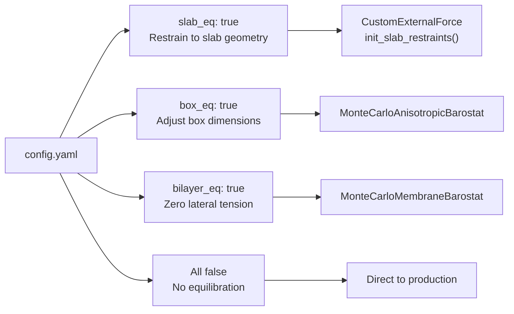
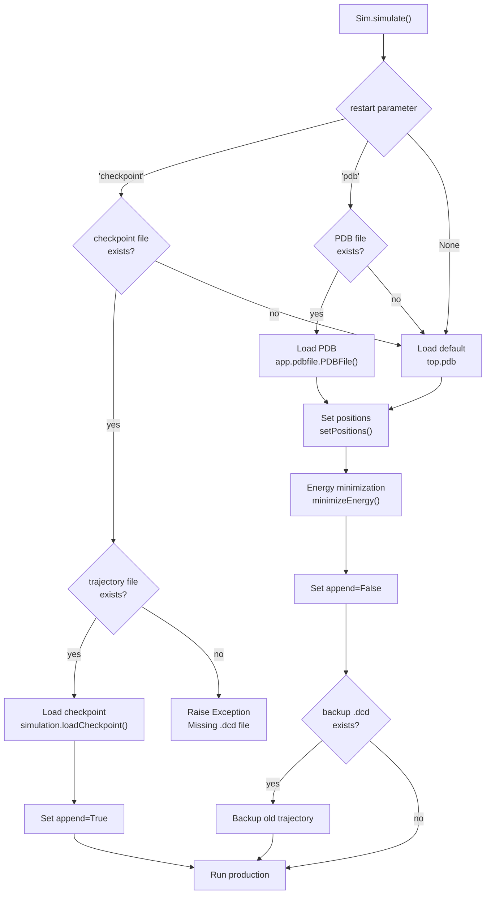

# Equilibration & Production

<details>
<summary>Relevant source files</summary>

The following files were used as context for generating this wiki page:

- [calvados/components.py](calvados/components.py)
- [calvados/data/default_config.yaml](calvados/data/default_config.yaml)
- [calvados/interactions.py](calvados/interactions.py)
- [calvados/sim.py](calvados/sim.py)

</details>


## Purpose and Scope

This page describes the equilibration and production phases of CALVADOS simulations. After system building ([see page 4.1](#4.1)) and molecule placement ([see page 4.2](#4.2)), the simulation undergoes energy minimization, optional equilibration, and then production dynamics. This page covers:

- Energy minimization procedures
- Three equilibration modes (slab, box, bilayer)
- Production simulation execution
- Checkpoint/restart mechanisms
- Integration parameters and reporters

For configuration of simulation parameters, see [page 2.1](#2.1). For post-simulation analysis, see [page 5](#5).

---

## Simulation Workflow Overview

The `Sim.simulate()` method orchestrates the complete simulation workflow from energy minimization through production. The workflow varies depending on the equilibration mode specified in the configuration.

**Diagram: Simulation Execution Workflow**



**Sources:** [calvados/sim.py:503-639]()

---

## Integration and Platform Setup

### Integrator Configuration

CALVADOS uses OpenMM's `LangevinMiddleIntegrator` for all simulations. This integrator implements the Langevin equation with middle scheme for temperature control.

| Parameter | Config Key | Default | Unit | Description |
|-----------|-----------|---------|------|-------------|
| Temperature | `temp` | — | K | System temperature |
| Friction | `friction_coeff` | 0.01 | ps⁻¹ | Langevin friction coefficient |
| Timestep | — | 0.01 | ps | Integration timestep (hardcoded) |
| Random Seed | `random_number_seed` | null | — | For reproducible dynamics |

The integrator is created at [calvados/sim.py:516]():

```python
integrator = openmm.openmm.LangevinMiddleIntegrator(
    self.temp*unit.kelvin,
    self.friction_coeff/unit.picosecond,
    0.01*unit.picosecond)
```

If `random_number_seed` is specified, it ensures reproducible trajectories:

```python
if self.random_number_seed is not None:
    integrator.setRandomNumberSeed(self.random_number_seed)
```

### Platform Selection

Simulations can run on CPU or CUDA platforms, specified by the `platform` configuration parameter:

| Platform | Config Value | Notes |
|----------|--------------|-------|
| CPU | `'CPU'` | Specify thread count with `threads` parameter |
| CUDA | `'CUDA'` | Specify GPU with `gpu_id` parameter or `CUDA_VISIBLE_DEVICES` |

The simulation object is created differently for each platform [calvados/sim.py:522-528]():

```python
platform = openmm.Platform.getPlatformByName(self.platform)
if self.platform == 'CPU':
    simulation = app.simulation.Simulation(
        pdb.topology, self.system, integrator, platform, 
        dict(Threads=str(self.threads)))
else:
    if os.environ.get('CUDA_VISIBLE_DEVICES') is None:
        platform.setPropertyDefaultValue('DeviceIndex',str(self.gpu_id))
    simulation = app.simulation.Simulation(
        pdb.topology, self.system, integrator, platform)
```

**Sources:** [calvados/sim.py:516-529](), [calvados/data/default_config.yaml:12-13](), [calvados/data/default_config.yaml:30](), [calvados/data/default_config.yaml:33](), [calvados/data/default_config.yaml:36]()

---

## Energy Minimization

All simulations begin with energy minimization to remove unfavorable contacts and relax the initial configuration. This occurs at [calvados/sim.py:556-557]():

```python
print(f'Minimizing energy.')
simulation.minimizeEnergy()
```

Energy minimization is performed:
1. **Before production** (always, unless restarting from checkpoint)
2. **After slab equilibration** (to relax system after removing restraints)
3. **After box/bilayer equilibration** (implicit in the workflow)

The minimization uses OpenMM's default L-BFGS algorithm and continues until convergence (default tolerance: 10 kJ/mol/nm).

**Sources:** [calvados/sim.py:555-557](), [calvados/sim.py:579-580]()

---

## Equilibration Modes

CALVADOS supports three mutually exclusive equilibration modes, controlled by boolean flags in the configuration. At most one should be enabled at a time.

**Diagram: Equilibration Mode Selection**



### Initialization of Equilibration Forces

Equilibration forces are initialized during `Sim.__init__()` [calvados/sim.py:40-48]():

```python
if self.restart == 'checkpoint' and os.path.isfile(f'{self.path}/{self.frestart}'):
    self.slab_eq = False
    self.bilayer_eq = False

if self.slab_eq:
    self.rcent = interactions.init_slab_restraints(self.box,self.k_eq)

if self.ext_force:
    self.rcent = openmm.CustomExternalForce(self.ext_force_expr)
```

Note that if restarting from checkpoint, equilibration is automatically disabled to avoid re-equilibrating an already-equilibrated system.

**Sources:** [calvados/sim.py:40-48](), [calvados/data/default_config.yaml:19-28]()

---

## Slab Equilibration

### Purpose

Slab equilibration is used for phase separation simulations with `topol: 'slab'`. It applies harmonic restraints to keep molecules near the center of the simulation box in the z-direction, allowing formation of a condensed slab while preventing molecules from spreading throughout the entire box volume.

### Configuration Parameters

| Parameter | Type | Default | Description |
|-----------|------|---------|-------------|
| `slab_eq` | bool | false | Enable slab equilibration |
| `k_eq` | float | 0.02 | Spring constant (kJ/mol/nm) |
| `steps_eq` | int | 1000 | Number of equilibration steps |

### Force Definition

The slab restraint force is defined in [calvados/interactions.py:123-133]():

```python
def init_slab_restraints(box,k):
    """ Define restraints towards box center in z direction. """
    
    mindim = np.amin(box)
    rcent_expr = 'k*abs(periodicdistance(x,y,z,x,y,z0))'
    rcent = openmm.CustomExternalForce(rcent_expr)
    rcent.addGlobalParameter('k',k*unit.kilojoules_per_mole/unit.nanometer)
    rcent.addGlobalParameter('z0',box[2]/2.*unit.nanometer) # center of box in z
    return rcent
```

The energy expression is `k*abs(periodicdistance(x,y,z,x,y,z0))`, which applies a linear potential (not harmonic!) restraining particles toward z-coordinate `z0` (box center).

### Execution Workflow

Slab equilibration occurs at [calvados/sim.py:559-580]():

1. **Run equilibration** with restraints active for `steps_eq` steps
2. **Save equilibration trajectory** to `equilibration_{sysname}.dcd`
3. **Save final structure** to `equilibration_final.pdb`
4. **Remove the external force** from the system
5. **Reinitialize integrator** and simulation context
6. **Minimize energy** again before production

The restraint is applied to all particles with `ext_restraint: true` in their component definition [calvados/sim.py:210-211]():

```python
if (self.slab_eq or self.ext_force) and comp.ext_restraint:
    self.add_ext_restraints(comp)
```

After equilibration, the restraint force is removed [calvados/sim.py:568-572]():

```python
for index, force in enumerate(self.system.getForces()):
    if isinstance(force, openmm.CustomExternalForce):
        print(f'Removing external force {index}')
        self.system.removeForce(index)
        break
```

**Sources:** [calvados/sim.py:559-580](), [calvados/interactions.py:123-133](), [calvados/sim.py:210-211](), [calvados/data/default_config.yaml:19](), [calvados/data/default_config.yaml:25-26]()

---

## Box Equilibration

### Purpose

Box equilibration adjusts the simulation box dimensions under constant pressure to reach equilibrium density. This is useful for:
- Equilibrating protein solution density
- Adjusting box size for optimal system size
- Preparing systems for production under NPT ensemble

### Configuration Parameters

| Parameter | Type | Default | Description |
|-----------|------|---------|-------------|
| `box_eq` | bool | false | Enable box equilibration |
| `pressure` | list[float] | [0,0,0] | Pressure tensor (bar) |
| `boxscaling_xyz` | list[bool] | [true,true,true] | Allow scaling in x,y,z |
| `steps_eq` | int | 1000 | Number of equilibration steps |
| `pressure_coupling` | bool | false | Keep barostat in production |

### Barostat Force

The `MonteCarloAnisotropicBarostat` is added to the system at [calvados/sim.py:258-263]():

```python
if self.box_eq:
    barostat = openmm.openmm.MonteCarloAnisotropicBarostat(
        [self.pressure[0]*unit.bar,self.pressure[1]*unit.bar,self.pressure[2]*unit.bar],
        self.temp*unit.kelvin,self.boxscaling_xyz[0],self.boxscaling_xyz[1],
        self.boxscaling_xyz[2],1000)
    self.system.addForce(barostat)
```

The `boxscaling_xyz` parameter controls which box dimensions can change:
- `[true, true, true]`: Isotropic scaling (equal in all directions)
- `[true, true, false]`: Anisotropic (only x,y can change)
- Other combinations for custom anisotropic scaling

### Execution Workflow

Box equilibration occurs at [calvados/sim.py:582-613]():

1. **Run equilibration** with barostat for `steps_eq` steps
2. **Save equilibration trajectory** to `equilibration_{sysname}.dcd`
3. **Save final structure** to `equilibration_final.pdb`
4. **Extract new box vectors** from the final state
5. **Optionally remove barostat** if `pressure_coupling: false`
6. **Reinitialize simulation** with new box vectors

After equilibration, if `pressure_coupling: false`, the barostat is removed [calvados/sim.py:595-604]():

```python
if not self.pressure_coupling:
    for index, force in enumerate(self.system.getForces()):
        if isinstance(force, openmm.openmm.MonteCarloAnisotropicBarostat):
            print(f'Removing barostat {index}')
            self.system.removeForce(index)
            break
```

**Sources:** [calvados/sim.py:582-613](), [calvados/sim.py:258-263](), [calvados/data/default_config.yaml:21-24]()

---

## Bilayer Equilibration

### Purpose

Bilayer equilibration is specialized for lipid bilayer simulations. It uses `MonteCarloMembraneBarostat` to maintain zero lateral tension (surface tension) while allowing the bilayer to find its equilibrium area per lipid.

### Configuration Parameters

| Parameter | Type | Default | Description |
|-----------|------|---------|-------------|
| `bilayer_eq` | bool | false | Enable bilayer equilibration |
| `pressure` | list[float] | [0,0,0] | `pressure[0]` used for lateral pressure |
| `steps_eq` | int | 1000 | Number of equilibration steps |
| `pressure_coupling` | bool | false | Keep barostat in production |

### Membrane Barostat Force

The `MonteCarloMembraneBarostat` is added at [calvados/sim.py:266-271]():

```python
if self.bilayer_eq:
    barostat = openmm.openmm.MonteCarloMembraneBarostat(
        self.pressure[0]*unit.bar,
        0*unit.bar*unit.nanometer, self.temp*unit.kelvin,
        openmm.openmm.MonteCarloMembraneBarostat.XYIsotropic,
        openmm.openmm.MonteCarloMembraneBarostat.ZFixed, 10000)
    self.system.addForce(barostat)
```

Parameters:
- **Lateral pressure**: `pressure[0]` (typically 1 bar)
- **Surface tension**: 0 (maintains zero surface tension)
- **XY scaling**: `XYIsotropic` (x and y scale together)
- **Z scaling**: `ZFixed` (z-dimension fixed)
- **Frequency**: Monte Carlo moves attempted every 10000 steps

### Execution Workflow

Bilayer equilibration follows the same workflow as box equilibration [calvados/sim.py:582-613](), with the membrane barostat instead of the anisotropic barostat.

**Sources:** [calvados/sim.py:266-271](), [calvados/sim.py:582-613](), [calvados/data/default_config.yaml:20-21]()

---

## Production Simulation

After equilibration (if any), the production simulation begins. This is the primary dynamics phase where scientifically meaningful data is collected.

### Runtime Control

CALVADOS offers two modes for controlling simulation length:

| Mode | Parameter | Unit | Description |
|------|-----------|------|-------------|
| **Time-based** | `runtime` | hours | Run for specified wall-clock time |
| **Step-based** | `steps` | steps | Run for specified number of MD steps |

**Time-based mode** (`runtime > 0`) [calvados/sim.py:621-622]():

```python
if self.runtime > 0: # in hours
    simulation.runForClockTime(self.runtime*unit.hour, 
        checkpointFile=fcheck_out, checkpointInterval=30*unit.minute)
```

Advantages:
- Predictable wall-clock time usage
- Automatic checkpointing every 30 minutes
- Ideal for batch job systems with time limits

**Step-based mode** (`runtime = 0`) [calvados/sim.py:623-628]():

```python
else:
    nbatches = 10
    batch = int(self.steps / nbatches)
    for i in tqdm(range(nbatches),mininterval=1):
        simulation.step(batch)
        simulation.saveCheckpoint(fcheck_out)
```

Advantages:
- Precise control over trajectory length
- Progress bar via `tqdm`
- Checkpointing after each batch (10 batches total)

### Reporters

Production simulations write two output files via OpenMM reporters:

#### Trajectory Reporter

DCD binary trajectory file [calvados/sim.py:616]():

```python
simulation.reporters.append(
    app.dcdreporter.DCDReporter(
        f'{self.path}/{self.sysname:s}.dcd',
        self.wfreq,
        append=append))
```

| Parameter | Config Key | Description |
|-----------|-----------|-------------|
| Filename | `sysname` | `{sysname}.dcd` |
| Frequency | `wfreq` | Write every `wfreq` steps |
| Append | — | True if restarting from checkpoint |

#### State Data Reporter

Log file with energies and timing [calvados/sim.py:617-618]():

```python
simulation.reporters.append(
    app.statedatareporter.StateDataReporter(
        f'{self.path}/{self.sysname}.log',
        self.logfreq,
        step=True, speed=True, elapsedTime=True,
        potentialEnergy=self.report_potential_energy,
        separator='\t', append=append))
```

| Column | Description |
|--------|-------------|
| Step | MD step number |
| Speed | Performance (ns/day) |
| Elapsed Time | Wall-clock time elapsed |
| Potential Energy | System energy (if `report_potential_energy: true`) |

**Note:** Potential energy reporting is disabled by default (`report_potential_energy: false`) for performance. Enable only when needed for energy analysis.

**Sources:** [calvados/sim.py:615-628](), [calvados/data/default_config.yaml:10-11](), [calvados/data/default_config.yaml:14](), [calvados/data/default_config.yaml:34-35]()

---

## Checkpoint and Restart Mechanism

CALVADOS supports robust checkpoint/restart to handle interrupted simulations and continuation of completed runs.

**Diagram: Restart Logic Flow**



### Restart Modes

Three restart modes are available via the `restart` parameter:

#### Mode 1: Checkpoint Restart

**Config:**
```yaml
restart: 'checkpoint'
frestart: 'restart.chk'
```

**Behavior** [calvados/sim.py:531-538]():
1. Check if checkpoint file exists
2. Check if trajectory DCD file exists (required for appending)
3. Load checkpoint state (positions, velocities, box vectors, step count)
4. Append new frames to existing trajectory
5. Skip equilibration (disabled automatically in `__init__`)

**Use case:** Continue interrupted simulation or extend completed simulation.

#### Mode 2: PDB Restart

**Config:**
```yaml
restart: 'pdb'
frestart: 'my_structure.pdb'
```

**Behavior** [calvados/sim.py:540-541]():
1. Load positions from specified PDB file
2. Initialize velocities from Maxwell-Boltzmann distribution
3. Perform energy minimization
4. Start trajectory from step 0 (backup old trajectory if exists)

**Use case:** Start new simulation from custom configuration.

#### Mode 3: New Simulation

**Config:**
```yaml
restart: null
```

**Behavior:**
1. Load positions from `top.pdb` (generated during `build_system()`)
2. Initialize velocities
3. Perform energy minimization
4. Start trajectory from step 0

**Use case:** Fresh simulation from algorithmically placed molecules.

### Checkpoint Files

Checkpoints are saved in two scenarios:

1. **Time-based runs**: Automatic every 30 minutes [calvados/sim.py:622]()
2. **Step-based runs**: After each batch (10 batches total) [calvados/sim.py:628]()
3. **End of simulation**: Always saved [calvados/sim.py:629]()

Checkpoint filename: `restart.chk` (binary format)

The checkpoint stores:
- Particle positions and velocities
- Box vectors
- Integrator state (step count, random number generator state)
- Thermostat state

### Trajectory Backup

When starting a new simulation (not restarting from checkpoint), existing trajectory files are backed up [calvados/sim.py:549-553]():

```python
if os.path.isfile(f'{self.path}/{self.sysname:s}.dcd'):
    now = datetime.now()
    dt_string = now.strftime("%Y%d%m_%Hh%Mm%Ss")
    print(f'Backing up existing {self.path}/{self.sysname:s}.dcd to {self.path}/backup_{self.sysname:s}_{dt_string}.dcd')
    os.system(f'mv {self.path}/{self.sysname:s}.dcd {self.path}/backup_{self.sysname:s}_{dt_string}.dcd')
```

Backup filename format: `backup_{sysname}_YYYYddMM_HHhMMmSSs.dcd`

**Sources:** [calvados/sim.py:506-558](), [calvados/sim.py:621-629](), [calvados/data/default_config.yaml:15-16]()

---

## Configuration Reference

### Complete Equilibration & Production Parameters

The following table summarizes all configuration parameters relevant to equilibration and production:

| Parameter | Type | Default | Description |
|-----------|------|---------|-------------|
| **Integration** | | | |
| `temp` | float | — | Temperature (K) |
| `ionic` | float | — | Ionic strength (M) |
| `friction_coeff` | float | 0.01 | Langevin friction (ps⁻¹) |
| `random_number_seed` | int\|null | null | Random seed for reproducibility |
| **Platform** | | | |
| `platform` | str | 'CPU' | 'CPU' or 'CUDA' |
| `threads` | int | 1 | CPU threads (CPU platform only) |
| `gpu_id` | int | 0 | GPU device index |
| **Equilibration** | | | |
| `slab_eq` | bool | false | Enable slab equilibration |
| `box_eq` | bool | false | Enable box equilibration |
| `bilayer_eq` | bool | false | Enable bilayer equilibration |
| `k_eq` | float | 0.02 | Slab restraint spring constant (kJ/mol/nm) |
| `steps_eq` | int | 1000 | Equilibration steps |
| `pressure` | list[float] | [0,0,0] | Pressure tensor (bar) |
| `boxscaling_xyz` | list[bool] | [true,true,true] | Allow box scaling in x,y,z |
| `pressure_coupling` | bool | false | Keep barostat in production |
| `ext_force` | bool | false | Enable custom external force |
| `ext_force_expr` | str | — | OpenMM expression for external force |
| **Production** | | | |
| `steps` | int | 100000000 | Number of MD steps |
| `runtime` | float | 0 | Max wall-clock time (hours, 0=disabled) |
| `wfreq` | int | 100000 | Trajectory write frequency |
| `logfreq` | int | 1000000 | Log write frequency |
| `report_potential_energy` | bool | false | Report energy in log file |
| **Restart** | | | |
| `restart` | str\|null | 'checkpoint' | Restart mode: 'checkpoint', 'pdb', or null |
| `frestart` | str | 'restart.chk' | Checkpoint or PDB filename |
| **Output** | | | |
| `sysname` | str | 'default_simulation' | System name (trajectory prefix) |

**Sources:** [calvados/data/default_config.yaml:1-40]()

---

## Common Workflow Examples

### Example 1: Standard Slab Phase Separation

```yaml
# config.yaml
sysname: 'my_slab_sim'
topol: 'slab'
box: [30, 30, 60]
temp: 300
ionic: 0.15

# Equilibration
slab_eq: true
k_eq: 0.05
steps_eq: 10000000

# Production
steps: 500000000
wfreq: 100000
platform: 'CUDA'
restart: 'checkpoint'
```

**Workflow:**
1. System built with slab topology ([page 4.2](#4.2))
2. Energy minimization
3. 10M steps slab equilibration (restraining molecules to center)
4. Remove restraints, minimize energy again
5. 500M steps production
6. Can restart from `restart.chk` to extend

### Example 2: Box Equilibration for Solution Density

```yaml
# config.yaml
sysname: 'protein_solution'
topol: 'random'
box: [20, 20, 20]
temp: 300
ionic: 0.15

# Equilibration
box_eq: true
pressure: [1, 1, 1]  # 1 bar isotropic
boxscaling_xyz: [true, true, true]
steps_eq: 5000000
pressure_coupling: false

# Production
steps: 100000000
wfreq: 50000
```

**Workflow:**
1. System built with random placement
2. Energy minimization
3. 5M steps NPT equilibration (adjusting box size)
4. Remove barostat
5. 100M steps NVT production at equilibrium density

### Example 3: Bilayer Assembly

```yaml
# config.yaml
sysname: 'lipid_bilayer'
topol: 'center'  # lipids placed via place_bilayer
temp: 300
ionic: 0.15

# Equilibration
bilayer_eq: true
pressure: [1, 0, 0]  # lateral pressure
steps_eq: 20000000

# Production
runtime: 24  # 24 hours
wfreq: 100000
platform: 'CUDA'
```

**Workflow:**
1. Lipids placed at z-interfaces
2. Energy minimization
3. 20M steps membrane equilibration (finding equilibrium area per lipid)
4. Production for 24 wall-clock hours
5. Automatic checkpointing every 30 minutes

### Example 4: Restart and Extend

**First run:**
```yaml
restart: null
steps: 100000000
```

**Extension run (in same directory):**
```yaml
restart: 'checkpoint'
frestart: 'restart.chk'
steps: 100000000  # Additional 100M steps
```

The simulation will:
1. Load state from `restart.chk`
2. Append frames to existing `.dcd` trajectory
3. Append lines to existing `.log` file
4. Continue from previous step count
5. Run for additional 100M steps

**Sources:** [calvados/data/default_config.yaml:1-40]()

---