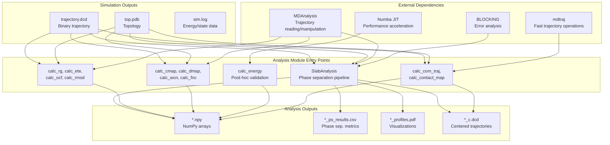
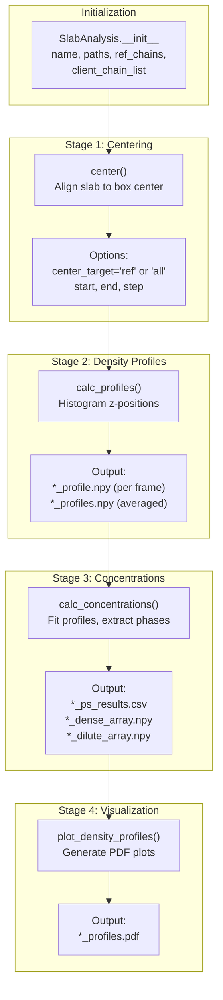
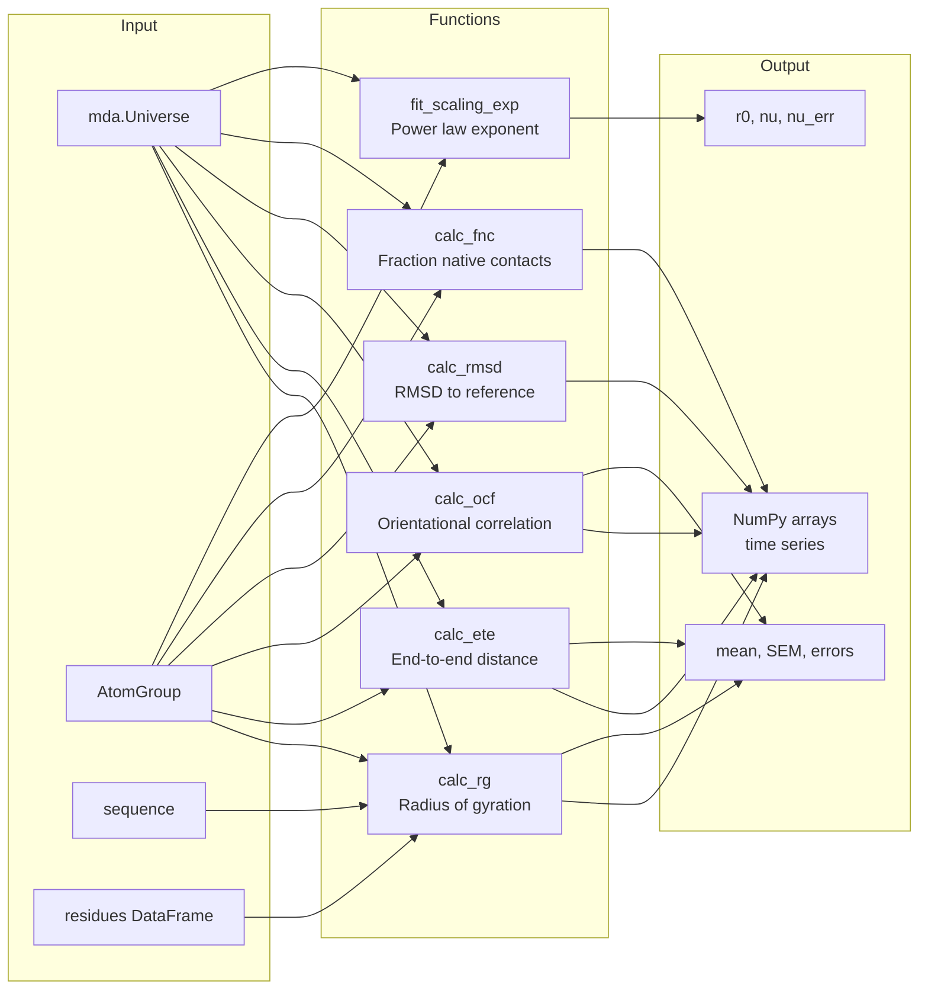

# Trajectory Analysis

<details>
<summary>Relevant source files</summary>

The following files were used as context for generating this wiki page:

- [calvados/__init__.py](calvados/__init__.py)
- [calvados/analysis.py](calvados/analysis.py)
- [examples/single_MDP/input/TIA1.pdb](examples/single_MDP/input/TIA1.pdb)
- [examples/slab_IDR/example_slab_analysis.ipynb](examples/slab_IDR/example_slab_analysis.ipynb)
- [examples/slab_IDR/prepare.py](examples/slab_IDR/prepare.py)
- [examples/slab_MDP/prepare.py](examples/slab_MDP/prepare.py)

</details>


## Purpose and Scope

This page provides an overview of trajectory analysis capabilities in CALVADOS, implemented primarily in the `calvados.analysis` module. After simulations generate trajectory files (`.dcd`), these functions enable post-processing to extract physical properties, calculate energies, and analyze phase separation behavior.

For detailed information on specific analysis types:
- Phase separation studies with slab geometries: see [SlabAnalysis](#5.1)
- Single-chain conformational properties: see [Structural Properties](#5.2)
- Inter-residue interactions and contact patterns: see [Contact & Distance Analysis](#5.3)
- Post-hoc energy validation: see [Energy Calculations](#5.4)
- Multi-chain systems and center-of-mass trajectories: see [Multi-Chain Analysis](#5.5)

## Analysis Execution Modes

CALVADOS supports two modes for trajectory analysis:

### Embedded Analysis (Deferred Execution)

Analysis code can be embedded in `config.yaml` during simulation preparation. The code is stored as a string and executed automatically after simulation completion.

```python
analyses = f"""
from calvados.analysis import SlabAnalysis

slab = SlabAnalysis(name="{sysname}", input_path="{path}",
                    output_path="{output_path}", verbose=True)
slab.center(start=400)
slab.calc_profiles()
slab.calc_concentrations()
slab.plot_density_profiles()
"""

config.write(path, name='config.yaml', analyses=analyses)
```

**Sources:** [examples/slab_IDR/prepare.py:51-64](), [examples/slab_MDP/prepare.py:49-64]()

### Programmatic Analysis

Analysis can be performed interactively or in standalone scripts after simulation completion:

```python
import calvados as cal

slab = cal.analysis.SlabAnalysis(
    name='system_0',
    input_path='system_0',
    output_path='data',
    ref_name='protein'
)

slab.center(start=600, step=10)
slab.calc_profiles()
slab.calc_concentrations()
```

**Sources:** [examples/slab_IDR/example_slab_analysis.ipynb:35-51]()

## Analysis Module Architecture

The `calvados.analysis` module is organized into functional categories:

| Category | Key Functions/Classes | Purpose |
|----------|----------------------|---------|
| **Phase Separation** | `SlabAnalysis` | Multi-stage pipeline for condensate analysis |
| **Structural Properties** | `calc_rg`, `calc_ete`, `calc_ocf`, `calc_rmsd` | Single-chain conformational metrics |
| **Contact Analysis** | `calc_cmap`, `calc_dmap`, `calc_wcn`, `calc_fnc` | Inter-residue distance/contact patterns |
| **Energy Calculations** | `calc_energy`, `ah_potential`, `yukawa_potential` | Post-hoc energy validation |
| **Multi-Chain Systems** | `calc_com_traj`, `calc_contact_map` | Center-of-mass trajectories and inter-chain contacts |
| **Trajectory Manipulation** | `center_traj`, `subsample_traj` | Basic trajectory preprocessing |
| **Scaling Analysis** | `fit_scaling_exp` | Power-law scaling exponents for polymers |

**Sources:** [calvados/analysis.py:1-970]()

## Trajectory Analysis Workflow



**Diagram: Trajectory analysis data flow from simulation outputs through analysis functions to results**

**Sources:** [calvados/analysis.py:1-28](), [calvados/analysis.py:417-792]()

## Key Dependencies

The analysis module relies on external libraries for trajectory processing:

### MDAnalysis
Used for trajectory reading, atom selections, coordinate transformations, and distance calculations. Most analysis functions operate on `mda.Universe` objects.

```python
u = mda.Universe('top.pdb', 'trajectory.dcd')
ag = u.select_atoms('protein')
```

**Sources:** [calvados/analysis.py:5-10]()

### mdtraj
Used for fast center-of-mass calculations and multi-chain systems. Particularly useful for large-scale contact map calculations.

**Sources:** [calvados/analysis.py:11](), [calvados/analysis.py:793-970]()

### Numba
JIT compilation for performance-critical energy calculations. The `@nb.jit(nopython=True)` decorator accelerates potential energy loops.

**Sources:** [calvados/analysis.py:2](), [calvados/analysis.py:48-105]()

### BLOCKING Module
Statistical error analysis using block averaging. Imported from a subdirectory for calculating standard errors with correlated data.

**Sources:** [calvados/analysis.py:24-27](), [calvados/analysis.py:779-791]()

## SlabAnalysis Class Structure

The `SlabAnalysis` class is the central component for phase separation analysis. It implements a multi-stage pipeline:



**Diagram: SlabAnalysis workflow showing the four-stage pipeline for phase separation analysis**

**Sources:** [calvados/analysis.py:417-792]()

## Analysis Function Categories

### Trajectory Manipulation Functions

| Function | Input | Output | Purpose |
|----------|-------|--------|---------|
| `center_traj` | PDB, DCD, slice params | `*_c.dcd` | Center trajectory at box center |
| `subsample_traj` | PDB, DCD, slice params | `*_sub.dcd` | Reduce trajectory frame count |

**Sources:** [calvados/analysis.py:29-46]()

### Energy Calculation Functions

| Function | Returns | Key Parameters |
|----------|---------|----------------|
| `calc_energy` | `u_ah`, `u_yu` (arrays) | `dmap`, `sig`, `lam`, `qmap`, `k_yu` |
| `ah_potential` | scalar energy | `r`, `sig`, `eps`, `l`, `rc` |
| `yukawa_potential` | scalar energy | `r`, `q`, `kappa_yu`, `rc_yu` |
| `lj_potential` | scalar energy | `r`, `sig`, `eps` |

These functions recalculate Ashbaugh-Hatch and Yukawa energies from trajectory coordinates for validation against OpenMM simulation outputs.

**Sources:** [calvados/analysis.py:48-105]()

### Distance and Contact Functions

| Function | Purpose | Key Parameters |
|----------|---------|----------------|
| `calc_dmap` | Distance matrix between atom groups | `domain0`, `domain1` (MDAnalysis AtomGroups) |
| `self_distances` | Self-distance matrix with PBC | `pos`, `box` (optional) |
| `calc_cmap` | Soft contact map (tanh switching) | `cutoff=1.0` (nm), width=0.3 nm |
| `calc_wcn` | Weighted contact number | `r0=0.7` (nm switching parameter) |
| `cmap_traj` | Time-averaged contact map | `start`, `end`, `step` |

The contact map uses a smooth switching function: `0.5 - 0.5*tanh((d-cutoff)/0.3)` instead of a hard cutoff.

**Sources:** [calvados/analysis.py:107-207]()

### Structural Property Functions



**Diagram: Structural property calculation functions and their data flow**

**Sources:** [calvados/analysis.py:264-387]()

### Multi-Chain Analysis Functions

#### calc_com_traj
Calculates center-of-mass trajectories for multi-chain systems. Produces:
- `*_com_top.pdb`: Topology with one atom per chain
- `*_com_traj.dcd`: Trajectory of chain COM positions
- `*_{component}_rg.npy`: Per-chain radius of gyration arrays

The function accepts a `chainid_dict` parameter to specify components:
```python
chainid_dict = {
    'protein': (0, 99),    # Chains 0-99
    'client': (100, 199)   # Chains 100-199
}
```

**Sources:** [calvados/analysis.py:793-878]()

#### calc_contact_map
Calculates contact maps between chain groups. Supports:
- Homotypic contacts (single component with itself)
- Heterotypic contacts (two different components)
- Slab-specific analysis (contacts involving central chains)

For slab systems with `is_slab=True`, the function:
1. Reads phase separation results from `*_ps_results.csv`
2. Identifies chains in dense vs dilute phases based on z-coordinate
3. Calculates contacts for central chains only
4. Saves phase-specific Rg arrays: `*_rg_dense.npy`, `*_rg_dilute.npy`

**Sources:** [calvados/analysis.py:879-970]()

## Analysis Output Files

The analysis module produces standardized output files:

| File Pattern | Content | Producer |
|--------------|---------|----------|
| `*_profile.npy` | Individual frame density profiles (frames × bins) | `SlabAnalysis.calc_profiles` |
| `*_profiles.npy` | Time-averaged profiles for all components | `SlabAnalysis.calc_profiles` |
| `*_ps_results.csv` | Phase separation metrics (concentrations, ΔG) | `SlabAnalysis.calc_concentrations` |
| `*_dense_array.npy` | Per-frame dense phase concentrations | `SlabAnalysis.calc_concentrations` |
| `*_dilute_array.npy` | Per-frame dilute phase concentrations | `SlabAnalysis.calc_concentrations` |
| `*_profiles.pdf` | Density profile visualization | `SlabAnalysis.plot_density_profiles` |
| `*_c.dcd` | Centered trajectory | `center_traj`, `SlabAnalysis.center` |
| `*_com_traj.dcd` | Center-of-mass trajectory | `calc_com_traj` |
| `*_cmap.npy` | Contact map array | `calc_contact_map` |
| `rgs.npy`, `rees.npy` | Structural property time series | `save_conf_prop` |
| `conf_prop.csv` | Mean values and block errors | `save_conf_prop` |

**Sources:** [calvados/analysis.py:388-416](), [calvados/analysis.py:545-607](), [calvados/analysis.py:656-680]()

## Reference vs Client Molecule Analysis

The `SlabAnalysis` class supports multi-component phase separation studies by distinguishing between:

- **Reference chains**: The primary condensate-forming component (specified by `ref_chains` tuple)
- **Client chains**: Additional species that partition into the condensate (specified by `client_chain_list` and `client_names`)

```python
slab = SlabAnalysis(
    name='system',
    ref_chains=(0, 99),        # Reference component: chains 0-99
    ref_name='protein',
    client_chain_list=[         # Client components
        (100, 119),             # First client: chains 100-119
        (120, 139)              # Second client: chains 120-139
    ],
    client_names=['RNA', 'crowder']
)
```

The reference component defines the slab interface positions via `fit_profile`, and client components are analyzed using the same dense/dilute phase cutoffs to calculate partitioning coefficients (Kp = c_dense / c_dilute).

**Sources:** [calvados/analysis.py:418-443](), [calvados/analysis.py:590-606]()

## Statistical Error Analysis

The analysis module uses block averaging for correlated time series data via the external `BLOCKING` module:

```python
block_rg = BlockAnalysis(rgs)
block_rg.SEM()
error = block_rg.sem
```

This approach accounts for temporal correlation in molecular dynamics trajectories, providing more accurate error estimates than standard error of the mean on uncorrelated data.

**Sources:** [calvados/analysis.py:779-791](), [calvados/analysis.py:394-404]()

---