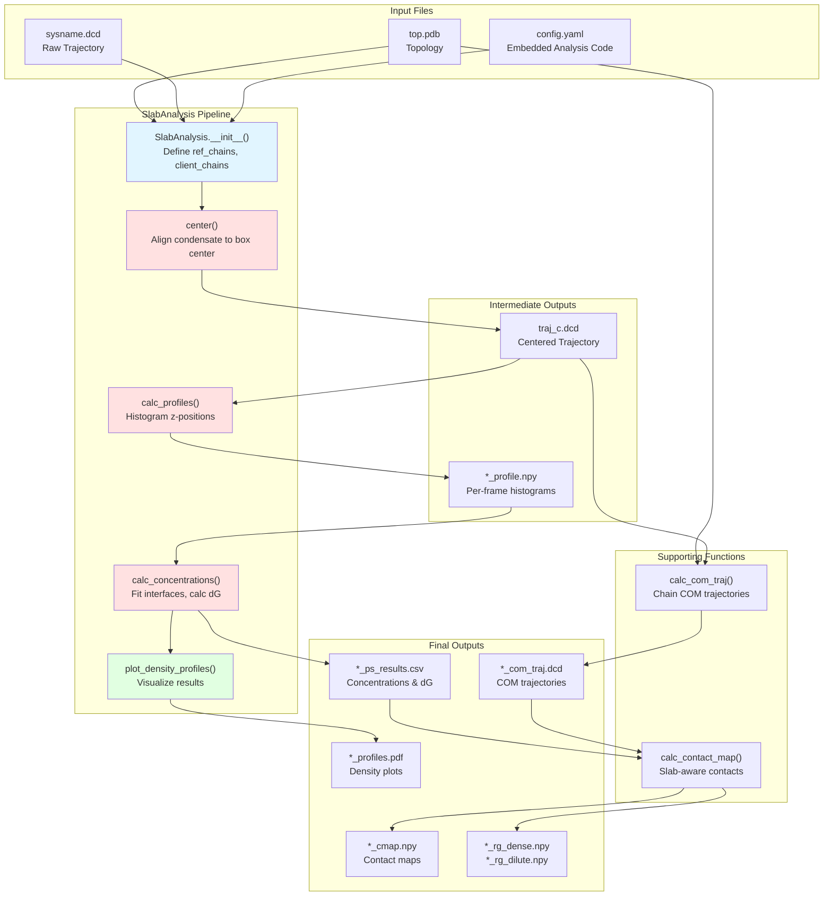
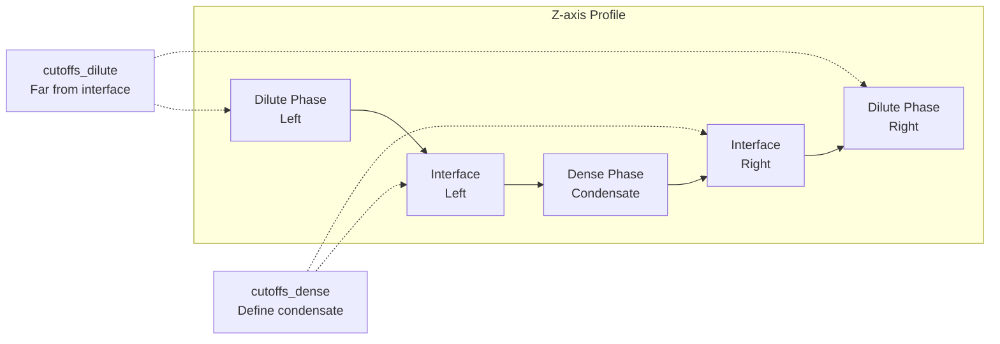
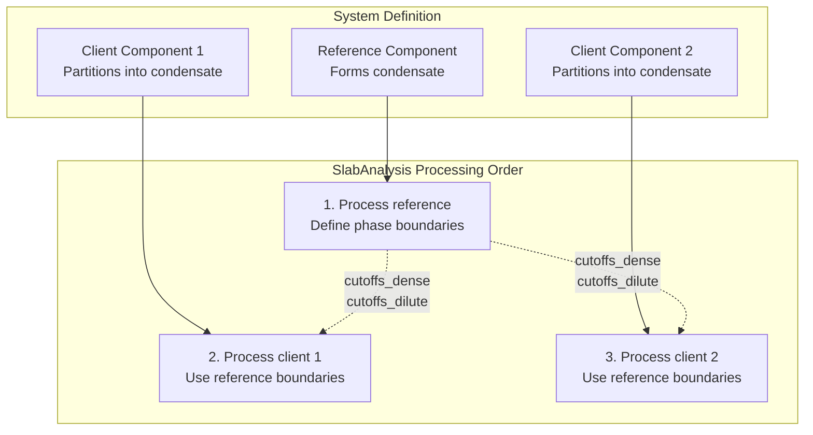
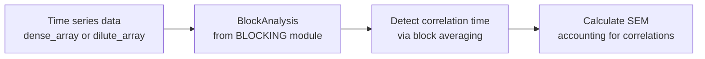
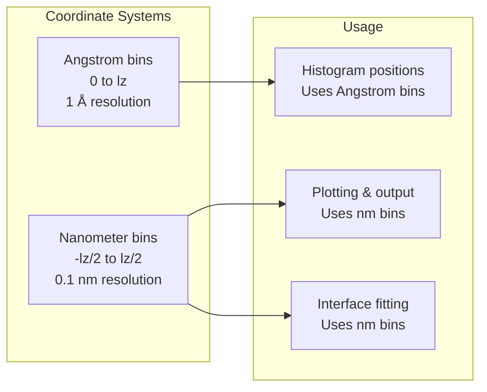
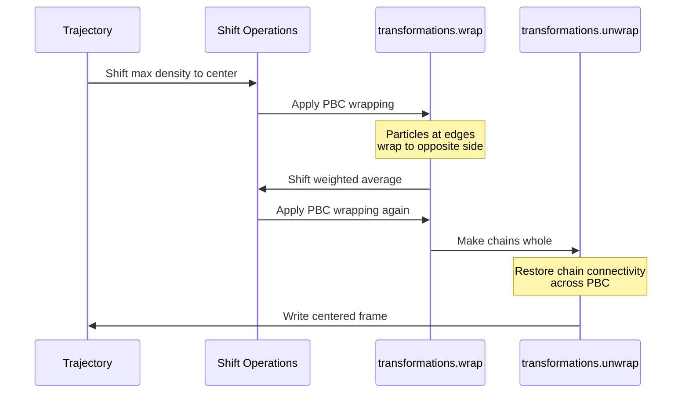

# SlabAnalysis - Phase Separation Studies

<details>
<summary>Relevant source files</summary>

The following files were used as context for generating this wiki page:

- [calvados/analysis.py](calvados/analysis.py)
- [examples/slab_IDR/prepare.py](examples/slab_IDR/prepare.py)
- [examples/slab_MDP/prepare.py](examples/slab_MDP/prepare.py)
- [examples/slab_mixed/example_slab_analysis.ipynb](examples/slab_mixed/example_slab_analysis.ipynb)

</details>


## Purpose and Scope

The `SlabAnalysis` class provides comprehensive tools for analyzing liquid-liquid phase separation (LLPS) in slab topology simulations. This system quantifies concentration differences between dense (condensed) and dilute phases, calculates partitioning free energies, and handles multi-component systems where "client" molecules partition into condensates formed by "reference" molecules.

For general trajectory analysis tools (structural properties, contact maps, energy calculations), see [Structural Properties](#5.2) and [Contact & Distance Analysis](#5.3). For information on setting up slab simulations, see [Molecule Placement Strategies](#4.2).

**Sources:** [calvados/analysis.py:417-792]()

---

## System Architecture

The SlabAnalysis system operates as a post-simulation analysis layer that processes centered trajectories to extract phase separation metrics.

### Architecture Diagram



**Sources:** [calvados/analysis.py:417-792](), [examples/slab_IDR/prepare.py:51-64]()

---

## Key Concepts

### Slab Geometry

Slab simulations use elongated box dimensions (e.g., 15×15×150 nm³) where molecules spontaneously form a condensed phase surrounded by dilute solution along the z-axis. The SlabAnalysis system assumes:
- Phase separation occurs along the z-axis
- The condensate forms a planar interface (not spherical droplets)
- Periodic boundary conditions in all dimensions

### Reference vs Client Chains

| Term | Definition | Purpose |
|------|-----------|---------|
| **Reference chains** | Primary condensate-forming molecules | Define the phase boundary, used for centering |
| **Client chains** | Additional molecule types | Measure partitioning behavior into the condensate |
| `ref_chains` | Tuple `(first, last)` of segment indices | Specifies reference molecule range |
| `client_chain_list` | List of tuples `[(first, last), ...]` | Specifies client molecule ranges |

**Sources:** [calvados/analysis.py:423-442]()

### Density Profiles and Phase Boundaries



The system fits hyperbolic tangent functions to identify interface positions and defines:
- **Dense phase cutoffs**: `pden` standard deviations from interface center (default: 2σ)
- **Dilute phase cutoffs**: `pdil` standard deviations from interface (default: 8σ)

**Sources:** [calvados/analysis.py:758-772]()

---

## SlabAnalysis Workflow

### Workflow Diagram

```mermaid
flowchart TD
    START["Start:<br/>Raw trajectory from simulation"]
    
    INIT["1. SlabAnalysis.__init__()<br/>- Load topology<br/>- Define ref_chains, client_chains<br/>- Calculate z-bins"]
    
    CENTER{"2. center()<br/>Iterative centering"}
    CENTER_MAX["Find z with max density<br/>Shift to box center"]
    CENTER_WRAP["Wrap particles<br/>via PBC"]
    CENTER_AVG["Calc weighted average<br/>Re-center"]
    CENTER_UNWRAP["Unwrap chains<br/>for output"]
    CENTER_OUT["Write traj_c.dcd"]
    
    PROFILES["3. calc_profiles()<br/>Loop over frames"]
    HIST["Histogram z-positions<br/>in 1 Å bins"]
    CONVERT["Convert to mM<br/>using volume & MW"]
    PROF_OUT["Save *_profile.npy"]
    
    CONC["4. calc_concentrations()<br/>Analyze reference first"]
    FIT["fit_profile()<br/>Fit tanh to interfaces"]
    CUT["Define cutoffs_dense<br/>and cutoffs_dilute"]
    CALC["Calculate c_dense, c_dilute<br/>for each component"]
    BLOCK["BlockAnalysis<br/>for error bars"]
    DG["calc_dG()<br/>Free energy"]
    CONC_OUT["Save *_ps_results.csv"]
    
    PLOT["5. plot_density_profiles()<br/>Visualize all components"]
    
    START --> INIT
    INIT --> CENTER
    CENTER --> CENTER_MAX
    CENTER_MAX --> CENTER_WRAP
    CENTER_WRAP --> CENTER_AVG
    CENTER_AVG --> CENTER_UNWRAP
    CENTER_UNWRAP --> CENTER_OUT
    CENTER_OUT --> PROFILES
    
    PROFILES --> HIST
    HIST --> CONVERT
    CONVERT --> PROF_OUT
    PROF_OUT --> CONC
    
    CONC --> FIT
    FIT --> CUT
    CUT --> CALC
    CALC --> BLOCK
    BLOCK --> DG
    DG --> CONC_OUT
    CONC_OUT --> PLOT
```



**Sources:** [calvados/analysis.py:456-679]()

### Step 1: Initialization

```python
slab = SlabAnalysis(
    name = 'system_name',
    input_path = 'path/to/sim',
    output_path = 'data',
    input_pdb = 'top.pdb',
    input_dcd = 'system.dcd',
    ref_chains = (0, 199),          # Reference: chains 0-199
    ref_name = 'protein',
    client_chain_list = [(200, 259)], # Client: chains 200-259
    client_names = ['RNA'],
    verbose = True
)
```

The `__init__` method:
- Loads topology to determine box dimensions
- Calculates z-axis bins (1 Å resolution in both Angstrom and nm coordinates)
- Stores chain identifiers for later processing

**Sources:** [calvados/analysis.py:417-450](), [examples/slab_mixed/example_slab_analysis.ipynb:34-40]()

### Step 2: Centering

```python
slab.center(start=400, step=1, center_target='ref')
```

The `center` method performs iterative alignment:

| Iteration | Operation | Purpose |
|-----------|-----------|---------|
| 1 | Shift max density bin to box center | Coarse alignment |
| 2 | Wrap particles via PBC | Ensure continuity |
| 3 | Calculate weighted average of density | Fine alignment |
| 4 | Re-center to weighted average | Final position |
| 5 | Unwrap chains | Restore chain connectivity for output |

**Key parameters:**
- `center_target='ref'`: Use only reference chains for centering (recommended)
- `center_target='all'`: Use all molecules for centering
- `start`, `end`, `step`: Frame slicing parameters

**Sources:** [calvados/analysis.py:456-512]()

### Step 3: Calculate Profiles

```python
slab.calc_profiles(save_individual_profiles=True)
```

For each component (reference and clients):
1. Loop over frames in centered trajectory
2. Wrap particles to box
3. Histogram z-positions into 1 Å bins
4. Convert bead counts to molar concentration using:
   ```
   conv = 10 / (6.02214 * n_beads * volume) * 1000  # to mM
   volume = box_x * box_y * bin_width / 1000  # nm³
   ```

**Output files:**
- `{name}_{component}_profile.npy`: Shape `(n_frames, n_bins)`, concentration in mM
- `{name}_profiles.npy`: Trajectory-averaged profiles for all components

**Sources:** [calvados/analysis.py:514-577]()

### Step 4: Calculate Concentrations

```python
slab.calc_concentrations(pden=2., pdil=8., dGmin=-10.)
```

#### Interface Fitting

The system fits the profile to a hyperbolic tangent function:
```
profile(z) = 0.5*(a+b) + 0.5*(b-a)*tanh((|z|-c)/d)
```
where:
- `a`, `b`: dilute and dense concentrations
- `c`: interface position
- `d`: interface width

**Sources:** [calvados/analysis.py:758-772]()

#### Concentration Extraction

| Quantity | Calculation | Definition |
|----------|-------------|-----------|
| `c_dense` | Mean in `cutoffs_dense` region | Average dense phase concentration (mM) |
| `c_dilute` | Mean in `cutoffs_dilute` region | Average dilute phase concentration (mM) |
| `c_dense_err` | Block averaging | Statistical error via BLOCKING module |
| `c_dilute_err` | Block averaging | Statistical error via BLOCKING module |
| `dG` | `log(c_dilute/c_dense)` | Partitioning free energy (kT) |
| `dG_err` | Error propagation | Via Monte Carlo sampling |

**Sources:** [calvados/analysis.py:617-654](), [calvados/analysis.py:724-755]()

### Step 5: Plotting

```python
slab.plot_density_profiles()
```

Generates a PDF with:
- Log-scale concentration vs z-position
- Vertical lines showing dense/dilute cutoffs
- All components overlaid for comparison

**Sources:** [calvados/analysis.py:656-679]()

---

## Multi-Component Systems

### Component Types and Their Roles



**Key design principle:** The reference component defines the phase boundaries (via `fit_profile`), which are then reused for all client components. This ensures consistent phase assignment across components.

**Sources:** [calvados/analysis.py:590-605]()

### Example: Protein-RNA System

```python
# Reference: Protein (chains 0-199)
# Client: RNA (chains 200-259)

slab = SlabAnalysis(
    name = 'FUS_polyU',
    ref_chains = (0, 199),
    ref_name = 'FUS',
    client_chain_list = [(200, 259)],
    client_names = ['polyU40']
)

slab.center()
slab.calc_profiles()
slab.calc_concentrations()

# Results contain:
# - FUS_polyU_FUS: FUS concentrations and dG
# - FUS_polyU_polyU40: polyU40 partitioning using FUS boundaries
```

**Sources:** [examples/slab_mixed/example_slab_analysis.ipynb:26-40]()

---

## Supporting Analysis Functions

### Center of Mass Trajectories

```python
calc_com_traj(
    path = 'simulation_dir',
    sysname = 'system_name',
    output_path = 'data',
    residues_file = 'residues.csv',
    chainid_dict = {'protein': (0, 99), 'RNA': (100, 199)},
    start = None, end = None, step = 1
)
```

**Functionality:**
- Unwraps chains to make them whole across PBC
- Calculates mass-weighted COM for each chain
- Computes per-frame radius of gyration for each chain
- Outputs reduced COM trajectory and Rg arrays

**Output files:**
- `{sysname}_com_top.pdb`: Topology with one atom per chain
- `{sysname}_com_traj.dcd`: Trajectory of chain COMs
- `{sysname}_{component}_rg.npy`: Shape `(n_chains, n_frames)` Rg values

**Sources:** [calvados/analysis.py:793-877]()

### Slab-Aware Contact Maps

```python
calc_contact_map(
    path = 'simulation_dir',
    sysname = 'system_name',
    output_path = 'data',
    chainid_dict = {'protein': (0, 99)},
    is_slab = True
)
```

**Slab-specific logic (when `is_slab=True`):**
1. Reads `*_ps_results.csv` to get dense/dilute boundaries
2. Reads `*_com_traj.dcd` to identify chain positions
3. For each frame, identifies the central chain (closest to z=0)
4. Calculates contacts between central chain and all surrounding chains
5. Separates Rg data into dense and dilute phases

**Output files:**
- `{sysname}_{comp1}_{comp2}_cmap.npy`: Average contact map
- `{sysname}_{component}_rg_dense.npy`: Rg values in dense phase
- `{sysname}_{component}_rg_dilute.npy`: Rg values in dilute phase

**Sources:** [calvados/analysis.py:879-969]()

---

## Output File Reference

### Primary Outputs

| File | Format | Content | Shape |
|------|--------|---------|-------|
| `{name}_c.dcd` | Binary DCD | Centered trajectory | `(n_frames, n_atoms, 3)` |
| `{name}_profiles.npy` | NumPy array | All trajectory-averaged profiles | `(n_components+1, n_bins)` |
| `{name}_ps_results.csv` | CSV table | Concentrations, errors, dG values | One row per component |
| `{name}_profiles.pdf` | PDF plot | Density profiles visualization | — |

### Component-Specific Outputs

| File | Format | Content | Shape |
|------|--------|---------|-------|
| `{name}_{component}_profile.npy` | NumPy array | Per-frame concentration profiles | `(n_frames, n_bins)` |
| `{name}_{component}_dense_array.npy` | NumPy array | Dense phase concentration per frame | `(n_frames,)` |
| `{name}_{component}_dilute_array.npy` | NumPy array | Dilute phase concentration per frame | `(n_frames,)` |

### Results CSV Structure

```python
df_results.columns = [
    'first_chain', 'last_chain',                    # Chain range
    'cutoffs_dense_right', 'cutoffs_dense_left',    # nm
    'cutoffs_dilute_right', 'cutoffs_dilute_left',  # nm
    'c_dilute', 'c_dilute_err',                     # mM
    'c_dense', 'c_dense_err',                       # mM
    'dG', 'dG_err'                                  # kT
]
```

**Sources:** [calvados/analysis.py:587-615]()

---

## Error Analysis and Statistical Rigor

### Block Averaging

The system uses the BLOCKING module for rigorous error estimation:



**Key characteristics:**
- Accounts for temporal autocorrelation in trajectory data
- Determines optimal block size automatically
- Provides statistically valid standard errors

**Sources:** [calvados/analysis.py:779-791](), [calvados/analysis.py:24-27]()

### Free Energy Error Propagation

```python
# Monte Carlo error propagation for dG = log(c_dilute/c_dense)
spread_dilute = np.random.normal(c_dilute, e_dilute, size=10000)
spread_dense = np.random.normal(c_dense, e_dense, size=10000)
spread_dGs = [log(dil/den) for dil, den in zip(spread_dilute, spread_dense) if dil>0 and den>0]
dG_error = np.std(spread_dGs)
```

**Edge cases handled:**
- `c_dilute=0, c_dense>0`: Sets `dG = dGmin` (default: -10 kT)
- `c_dense=0, c_dilute>0`: Sets `dG = -dGmin`
- Both zero or NaN: Sets `dG = NaN`
- `dG < dGmin`: Clamps to `dGmin` to avoid numerical issues

**Sources:** [calvados/analysis.py:724-755]()

---

## Integration with Config Files

SlabAnalysis is typically embedded in `config.yaml` for automatic execution after simulation:

```python
analyses = f"""
from calvados.analysis import SlabAnalysis, calc_com_traj, calc_contact_map

slab = SlabAnalysis(
    name="{sysname}", 
    input_path="{path}",
    output_path="{output_path}", 
    ref_name="{ref_name}", 
    verbose=True
)

slab.center(start=400, center_target='all')
slab.calc_profiles()
slab.calc_concentrations()
print(slab.df_results)
slab.plot_density_profiles()

calc_com_traj(path="{path}", sysname="{sysname}", 
              output_path="{output_path}", 
              residues_file="{residues_file}")
calc_contact_map(path="{path}", sysname="{sysname}", 
                 output_path="{output_path}", is_slab=True)
"""

config.write(path, name='config.yaml', analyses=analyses)
```

**Execution timing:** The analysis code in `config.yaml` is executed after the simulation completes, enabling automated post-processing pipelines.

**Sources:** [examples/slab_IDR/prepare.py:51-66](), [examples/slab_MDP/prepare.py:49-64]()

---

## Common Workflows

### Single-Component Slab

```python
# Homogeneous condensate
slab = SlabAnalysis(name='IDR', ref_name='IDR')
slab.center()
slab.calc_profiles()
slab.calc_concentrations()
```

### Two-Component Partitioning

```python
# Measure client partitioning into reference condensate
slab = SlabAnalysis(
    name='mixed',
    ref_chains=(0, 199), ref_name='scaffold',
    client_chain_list=[(200, 259)], client_names=['client']
)
slab.center(center_target='ref')  # Center on scaffold only
slab.calc_profiles()
slab.calc_concentrations()

# Compare dG values
print(f"Scaffold dG: {slab.df_results.loc['mixed_scaffold', 'dG']}")
print(f"Client dG: {slab.df_results.loc['mixed_client', 'dG']}")
```

### Multiple Clients

```python
# Multiple client types partitioning
slab = SlabAnalysis(
    name='system',
    ref_chains=(0, 99),
    ref_name='protein',
    client_chain_list=[(100, 149), (150, 199)],
    client_names=['RNA1', 'RNA2']
)
```

**Sources:** [examples/slab_mixed/example_slab_analysis.ipynb:1-106]()

---

## Technical Implementation Details

### Z-Axis Binning



**Implementation:**
- Angstrom bins: Used internally for histogramming during simulation (particle positions in Å)
- Nanometer bins: Used for profiles, fitting, and output (centered at z=0)

**Sources:** [calvados/analysis.py:682-695]()

### Concentration Units Conversion

The conversion from bead counts to molar concentration:

```
concentration [mM] = (beads / volume) * (1 / n_beads_per_molecule) * (1 mol / 6.02214e23) * 1e3
```

where:
- `volume = box_x * box_y * bin_width / 1000` (nm³)
- `bin_width = 1 Å = 0.1 nm`
- Factor of 10 accounts for units: 1 nm³ = 1e-24 L

**Sources:** [calvados/analysis.py:534-536]()

### PBC Handling in Centering

The centering algorithm must carefully manage periodic boundary conditions:



**Sources:** [calvados/analysis.py:488-510]()

---