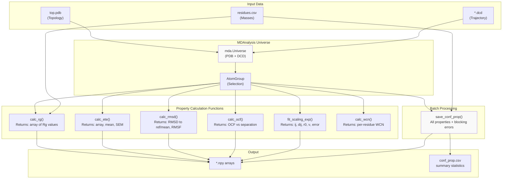
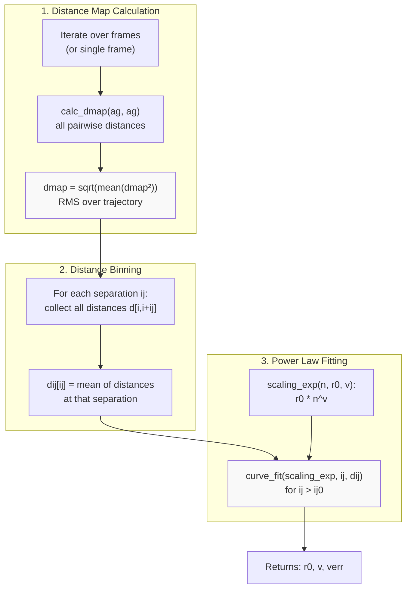
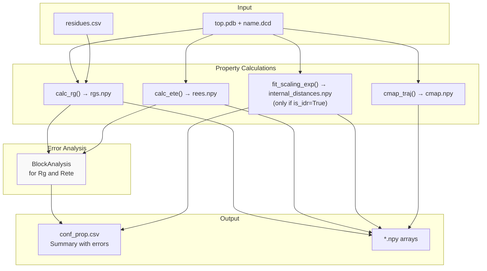
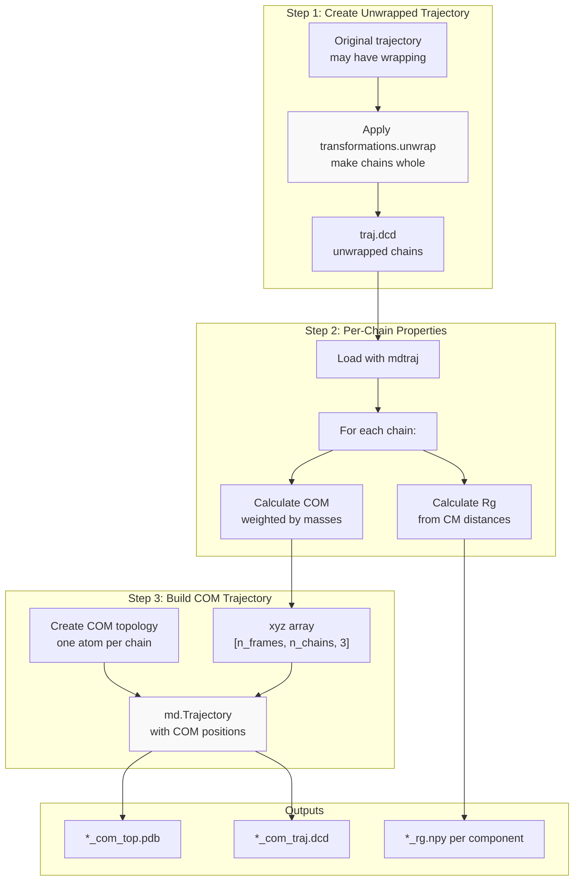
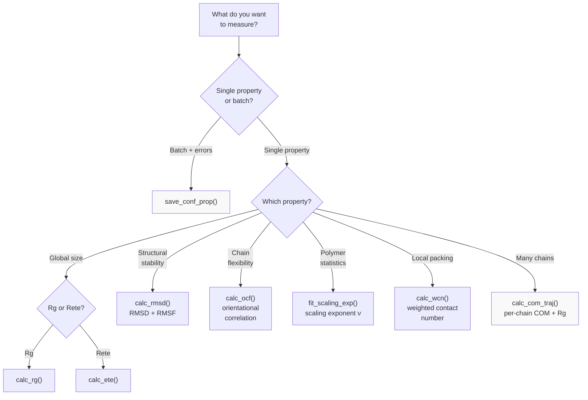

# Structural Properties

<details>
<summary>Relevant source files</summary>

The following files were used as context for generating this wiki page:

- [calvados/analysis.py](calvados/analysis.py)
- [examples/slab_IDR/prepare.py](examples/slab_IDR/prepare.py)
- [examples/slab_MDP/prepare.py](examples/slab_MDP/prepare.py)

</details>


## Purpose and Scope

This page documents the functions in `calvados.analysis` for calculating structural properties of biomolecules from simulation trajectories. These properties characterize the size, shape, and conformational behavior of proteins and other polymers.

For contact-based analysis (contact maps, distance maps, fraction of native contacts), see [Contact & Distance Analysis](#5.3). For energy calculations from trajectories, see [Energy Calculations from Trajectories](#5.4). For phase separation analysis, see [SlabAnalysis - Phase Separation Studies](#5.1).

## Overview of Available Properties

The following table summarizes the structural properties that can be calculated:

| Property | Function | Description | Typical Use Case |
|----------|----------|-------------|------------------|
| **Radius of Gyration (Rg)** | `calc_rg` | Root-mean-square distance of atoms from center of mass | Global chain compaction, IDR sizing |
| **End-to-End Distance (Rete)** | `calc_ete` | Distance between terminal residues | Chain extension, polymer statistics |
| **RMSD** | `calc_rmsd` | Root-mean-square deviation from reference | Structural stability, conformational drift |
| **RMSF** | `calc_rmsd` (returns RMSF) | Per-residue fluctuation amplitude | Local flexibility, dynamic regions |
| **Orientational Correlation** | `calc_ocf` | Correlation of bond vectors along chain | Chain persistence length, stiffness |
| **Scaling Exponent (ν)** | `fit_scaling_exp` | Power-law exponent for internal distances | Polymer conformation class (collapsed/ideal/swollen) |
| **Weighted Contact Number** | `calc_wcn` | Local packing density | Folding environment, burial |

Sources: [calvados/analysis.py:272-415]()

## Workflow: Calculating Structural Properties



**Structural Properties Calculation Workflow**

This diagram shows the general workflow for calculating structural properties. All functions operate on MDAnalysis `Universe` and `AtomGroup` objects created from topology and trajectory files. The `save_conf_prop` function provides batch processing for common analyses.

Sources: [calvados/analysis.py:237-415]()

## Radius of Gyration (Rg)

The radius of gyration measures the root-mean-square distance of atoms from the molecular center of mass, weighted by atomic masses:

$$R_g = \sqrt{\frac{\sum_i m_i |\mathbf{r}_i - \mathbf{r}_{COM}|^2}{\sum_i m_i}}$$

### Function Signature

```python
calc_rg(u, ag, seq=[], residues=[], start=None, stop=None, step=None)
```

**Parameters:**
- `u`: MDAnalysis Universe object
- `ag`: AtomGroup to analyze
- `seq`: List of residue names (optional, for mass calculation)
- `residues`: DataFrame with residue masses from `residues.csv` (optional)
- `start`, `stop`, `step`: Trajectory slicing parameters

**Returns:** NumPy array of Rg values (nm) for each frame

### Implementation Details

The function calculates masses from the residue composition if `seq` and `residues` are provided. Terminal residues receive mass corrections (+2 Da for N-terminus, +16 Da for C-terminus) to account for charged termini [calvados/analysis.py:264-270](). 

The Rg calculation uses Einstein summation notation for efficiency:
```python
rog_sq = np.einsum('i,i->',masses,np.einsum('ij,ij->i',pos,pos))/np.sum(masses)
```

This computes the mass-weighted sum of squared distances in a single vectorized operation [calvados/analysis.py:283]().

### Example Usage

```python
import MDAnalysis as mda
import pandas as pd
from calvados.analysis import calc_rg

# Load trajectory
u = mda.Universe('path/top.pdb', 'path/traj.dcd')
ag = u.select_atoms('all')

# Load residue parameters for masses
residues = pd.read_csv('input/residues_CALVADOS2.csv').set_index('three')

# Calculate Rg over trajectory
rgs = calc_rg(u, ag, ag.resnames.tolist(), residues, start=100)
print(f"Mean Rg: {rgs.mean():.2f} ± {rgs.std():.2f} nm")
```

Sources: [calvados/analysis.py:272-287](), [calvados/analysis.py:264-270](), [calvados/analysis.py:388-415]()

## End-to-End Distance (Rete)

The end-to-end distance measures the Euclidean distance between the first and last atoms in a chain. This is a key observable for polymer physics, particularly for IDRs.

### Function Signature

```python
calc_ete(u, ag, start=None, stop=None, step=None)
```

**Returns:** Tuple of `(etes, ete_m, ete_sem)`:
- `etes`: NumPy array of end-to-end distances (nm) for each frame
- `ete_m`: Mean value across trajectory
- `ete_sem`: Standard error of the mean

### Implementation

The function iterates over the trajectory and calculates:
```python
ete = np.linalg.norm(ag[0].position - ag[-1].position) / 10.
```
where division by 10 converts Ångstroms to nanometers [calvados/analysis.py:294]().

### Example Usage

```python
etes, mean_ete, sem_ete = calc_ete(u, ag, start=100)
print(f"<Rete> = {mean_ete:.2f} ± {sem_ete:.2f} nm")
```

Sources: [calvados/analysis.py:289-302]()

## RMSD and RMSF

Root-mean-square deviation (RMSD) and fluctuation (RMSF) quantify structural stability and per-residue flexibility, primarily used for structured proteins.

### Function Signature

```python
calc_rmsd(u, uref, select='all', f_out=None, step=1)
```

**Parameters:**
- `u`: MDAnalysis Universe (simulation trajectory)
- `uref`: Reference Universe (typically crystal structure or PDB model)
- `select`: Atom selection string (default: 'all')
- `f_out`: Optional output file for mean structure PDB
- `step`: Trajectory subsampling

**Returns:** Tuple of `(Rref_rmsd, Rmean_rmsd, RMSFmean)`:
- `Rref_rmsd`: RMSD to reference structure over time
- `Rmean_rmsd`: RMSD to trajectory mean structure over time
- `RMSFmean`: Per-atom RMSF values

### Two-Stage Alignment Process

The function performs a sophisticated two-stage alignment to handle conformational drift:

1. **First alignment**: Align trajectory to reference structure, calculate mean structure [calvados/analysis.py:239-245]()
2. **Second alignment**: Align trajectory to first mean structure, recalculate mean [calvados/analysis.py:248-252]()

This iterative approach ensures the mean structure is representative of the trajectory ensemble, not biased by the reference.

### Example Usage

```python
# Load simulation and reference
u = mda.Universe('top.pdb', 'traj.dcd', in_memory=True)
uref = mda.Universe('reference.pdb')

# Calculate RMSD and RMSF
Rref, Rmean, rmsf = calc_rmsd(u, uref, select='backbone', 
                               f_out='mean_structure.pdb', step=10)

# Rref.T and Rmean.T contain [time, rmsd] arrays
```

Sources: [calvados/analysis.py:237-262]()

## Orientational Correlation Function (OCF)

The orientational correlation function measures the correlation of bond vector orientations as a function of sequence separation. It characterizes chain stiffness and persistence length.

### Definition

For bond vectors $\mathbf{b}_i = \mathbf{r}_{i+1} - \mathbf{r}_i$, the OCF is:

$$C(|j-i|) = \langle \hat{\mathbf{b}}_i \cdot \hat{\mathbf{b}}_j \rangle$$

where $\hat{\mathbf{b}}$ denotes the unit bond vector.

### Function Signature

```python
calc_ocf(u, ag, start=None, stop=None, step=None)
```

**Returns:** Tuple of `(ocf, ocf_sem)`:
- `ocf`: Array of correlation values vs sequence separation
- `ocf_sem`: Standard error of the mean

### Implementation

The function computes normalized bond vectors between consecutive atoms, then calculates all pairwise dot products organized by separation [calvados/analysis.py:308-322]():

```python
xb = x[1:] - x[:-1]  # bond vectors
Lxb = np.linalg.norm(xb, axis=1)  # lengths
xbred = (xb.T / Lxb).T  # normalize

for idx0, xb0 in enumerate(xbred, start=0):
    for idx1, xb1 in enumerate(xbred[idx0:], start=idx0):
        dot = np.dot(xb0, xb1)
        ij = idx1 - idx0
        dots[ij].append(dot)
```

### Interpretation

- **Rapid decay**: Flexible chain (short persistence length)
- **Slow decay**: Stiff chain (long persistence length)
- **Exponential decay**: $C(s) \sim e^{-s/l_p}$ where $l_p$ is persistence length

Sources: [calvados/analysis.py:304-326]()

## Scaling Exponents

The scaling exponent $\nu$ characterizes polymer conformation through the relationship between mean internal distance and sequence separation:

$$\langle R(N) \rangle \sim N^\nu$$

| Conformation | ν | Example |
|--------------|---|---------|
| Collapsed globule | 0.33 | Strongly attractive IDR |
| Ideal chain | 0.50 | Theta-solvent conditions |
| Self-avoiding walk | 0.588 | Good solvent, swollen IDR |
| Rod | 1.00 | Stiff polymer |

### Function Signature

```python
fit_scaling_exp(u, ag, r0=None, traj=True, start=None, stop=None, 
                step=None, slic=[], ij0=5)
```

**Parameters:**
- `r0`: Bond length prefactor (if `None`, fitted)
- `traj`: If `True`, compute RMS distances over trajectory; if `False`, use single frame
- `ij0`: Minimum sequence separation for fitting (exclude short-range correlations)

**Returns:** Tuple of `(ij, dij, r0, v, verr)`:
- `ij`: Sequence separations
- `dij`: Mean internal distances
- `r0`: Fitted prefactor
- `v`: Scaling exponent ν
- `verr`: Fitting error on ν

### Implementation Workflow



**Scaling Exponent Calculation Workflow**

The function first computes RMS internal distances averaged over the trajectory, then bins them by sequence separation, and finally fits a power law to separations beyond `ij0` [calvados/analysis.py:334-386]().

### Example Usage

```python
# Analyze scaling for IDR
ij, dij, r0, nu, nu_err = fit_scaling_exp(u, ag, start=100, ij0=5)

print(f"Scaling exponent: ν = {nu:.3f} ± {nu_err:.3f}")
print(f"Bond length: r0 = {r0:.3f} nm")

# Plot scaling relationship
import matplotlib.pyplot as plt
plt.loglog(ij, dij, 'o', label='Data')
plt.loglog(ij, r0 * ij**nu, '-', label=f'Fit: ν={nu:.3f}')
plt.xlabel('Sequence separation')
plt.ylabel('Mean distance (nm)')
plt.legend()
```

Sources: [calvados/analysis.py:328-386]()

## Weighted Contact Number (WCN)

The weighted contact number quantifies the local packing density around each residue, often used to characterize the burial environment in structured proteins.

### Definition

$$\text{WCN}_i = \sum_{j \neq i} \frac{1 - (r_{ij}/r_0)^6}{1 - (r_{ij}/r_0)^{12}}$$

This switching function smoothly transitions from 1 (close contact) to 0 (far separation) around the cutoff distance $r_0$.

### Function Signature

```python
calc_wcn(comp, pos, fdomains=None, ssonly=True, r0=0.7)
```

**Parameters:**
- `comp`: Component object (for sequence information)
- `pos`: Atomic positions in nm
- `fdomains`: Domain definitions file (optional)
- `ssonly`: If `True`, only consider contacts within structured domains
- `r0`: Switching parameter (nm)

**Returns:** Array of WCN values per residue

### Domain-Specific Calculation

When `ssonly=True`, the function only counts contacts between residues that belong to the same structured domain as defined in the domains file [calvados/analysis.py:154-165](). This is useful for analyzing folding quality without contamination from inter-domain or disordered region contacts.

Sources: [calvados/analysis.py:144-170]()

## Batch Processing with save_conf_prop

The `save_conf_prop` function provides a convenient wrapper that calculates multiple structural properties with proper error analysis and saves results to disk.

### Function Signature

```python
save_conf_prop(path, name, residues_file, output_path, 
               start=0, is_idr=True, select='all', 
               cutoff=1.0, kmax=3)
```

**Parameters:**
- `path`: Directory containing `top.pdb` and `{name}.dcd`
- `name`: System name
- `residues_file`: Path to `residues.csv`
- `output_path`: Directory for output files
- `is_idr`: If `True`, calculate scaling exponent
- `kmax`: Number of diagonals to exclude from contact map

### Calculated Properties and Outputs

| Property | Output File | Error Analysis |
|----------|-------------|----------------|
| Rg trajectory | `rgs.npy` | Block averaging via BLOCKING module |
| Rete trajectory | `rees.npy` | Block averaging via BLOCKING module |
| Scaling exponent ν | `internal_distances.npy` | Fitting error from `curve_fit` |
| Contact map | `cmap.npy` | Time-averaged over trajectory |
| Summary statistics | `conf_prop.csv` | Mean and block errors |

### Implementation Details



**save_conf_prop Workflow**

The function automatically applies block averaging error analysis [calvados/analysis.py:394-404]() using the BLOCKING module to account for temporal correlations in the trajectory. This provides more reliable error estimates than simple standard errors.

### Example Usage

```python
from calvados.analysis import save_conf_prop

save_conf_prop(
    path='simulation_output',
    name='protein_A',
    residues_file='input/residues_CALVADOS2.csv',
    output_path='analysis_results',
    start=100,  # Skip equilibration
    is_idr=True,  # Calculate scaling exponent
    select='all',
    cutoff=1.0,  # nm for contact definition
    kmax=3  # Exclude ±3 diagonal contacts
)
```

The output `conf_prop.csv` will contain:

```
        value    error
Rg      3.45     0.12
Ree     8.21     0.34
nu      0.582    0.008
```

Sources: [calvados/analysis.py:388-415]()

## Multi-Chain Analysis with calc_com_traj

For systems containing many chains (e.g., phase separation simulations), analyzing individual chains becomes important. The `calc_com_traj` function calculates center-of-mass trajectories and per-chain Rg values for multi-chain systems.

### Function Signature

```python
calc_com_traj(path, sysname, output_path, residues_file, 
              chainid_dict={}, start=None, end=None, step=1, 
              input_pdb='top.pdb')
```

**Parameters:**
- `chainid_dict`: Dictionary mapping component names to chain IDs
  - Example: `{'protein_A': 0, 'protein_B': 1}` (single chains)
  - Example: `{'protein_A': (0, 99), 'protein_B': (100, 199)}` (chain ranges)
  - If empty, assumes single component with all chains

### Outputs

| File | Description |
|------|-------------|
| `{sysname}_com_top.pdb` | Topology with one atom per chain (COM) |
| `{sysname}_com_traj.dcd` | Trajectory of chain centers of mass |
| `{sysname}_{chain_name}_rg.npy` | Per-frame Rg for each chain (shape: `[n_frames, n_chains]`) |

### Implementation Workflow



**Multi-Chain COM Trajectory Workflow**

The function first creates an unwrapped trajectory where chains are made whole across periodic boundaries [calvados/analysis.py:812-826](). It then uses `mdtraj` to efficiently calculate per-chain centers of mass and radii of gyration [calvados/analysis.py:828-878]().

### Per-Chain Rg Calculation

For each chain, the Rg is calculated using mass-weighted positions:

```python
si = np.linalg.norm(t_chain.xyz - com[:,np.newaxis,:], axis=2)  # residue-CM distances
chain_rg = np.sqrt(np.sum(si**2*mws, axis=1)/mws.sum())  # mass-weighted Rg
```

This calculation is performed for every frame, producing a 2D array where rows are frames and columns are individual chains [calvados/analysis.py:865-868]().

### Example Usage

```python
from calvados.analysis import calc_com_traj

# Define chain ranges for multi-component system
chainid_dict = {
    'FUS': (0, 99),      # Chains 0-99 are FUS
    'hnRNPA1': (100, 149) # Chains 100-149 are hnRNPA1
}

calc_com_traj(
    path='slab_simulation',
    sysname='FUS_hnRNPA1_mix',
    output_path='analysis',
    residues_file='input/residues_CALVADOS2.csv',
    chainid_dict=chainid_dict,
    start=0,
    step=10
)

# Load per-chain Rg arrays
import numpy as np
fus_rgs = np.load('analysis/FUS_hnRNPA1_mix_FUS_rg.npy')
# Shape: [n_frames, 100]  - Rg for each of 100 FUS chains at each frame
```

### Integration with Slab Analysis

The COM trajectories generated by this function are used by `calc_contact_map` with `is_slab=True` to analyze contacts in phase-separated systems. The function identifies chains in the dense vs dilute phases based on COM z-positions and calculates phase-specific properties [calvados/analysis.py:879-969]().

Sources: [calvados/analysis.py:793-878](), [examples/slab_IDR/prepare.py:62](), [examples/slab_MDP/prepare.py:62]()

## Summary: Function Selection Guide



**Decision Tree for Structural Property Functions**

This decision tree helps users select the appropriate function based on their analysis goals. For standard IDR/MDP analysis, `save_conf_prop` provides a convenient all-in-one solution with proper error analysis. For multi-chain systems (e.g., phase separation), `calc_com_traj` efficiently processes hundreds of chains.

Sources: [calvados/analysis.py:237-878]()

---