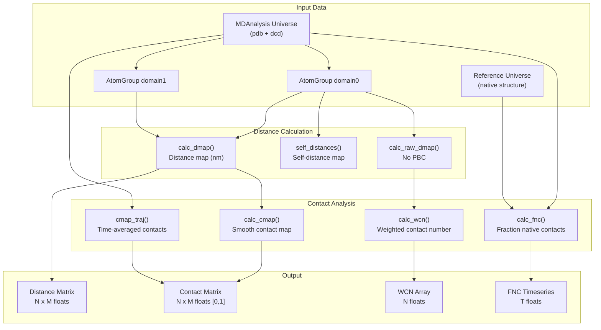
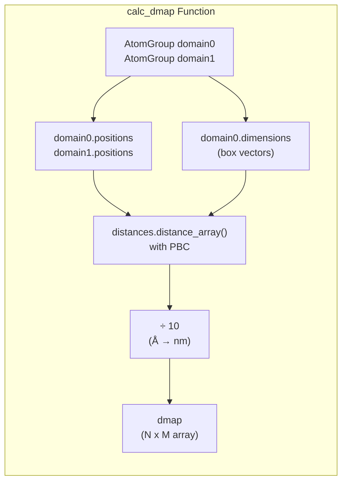
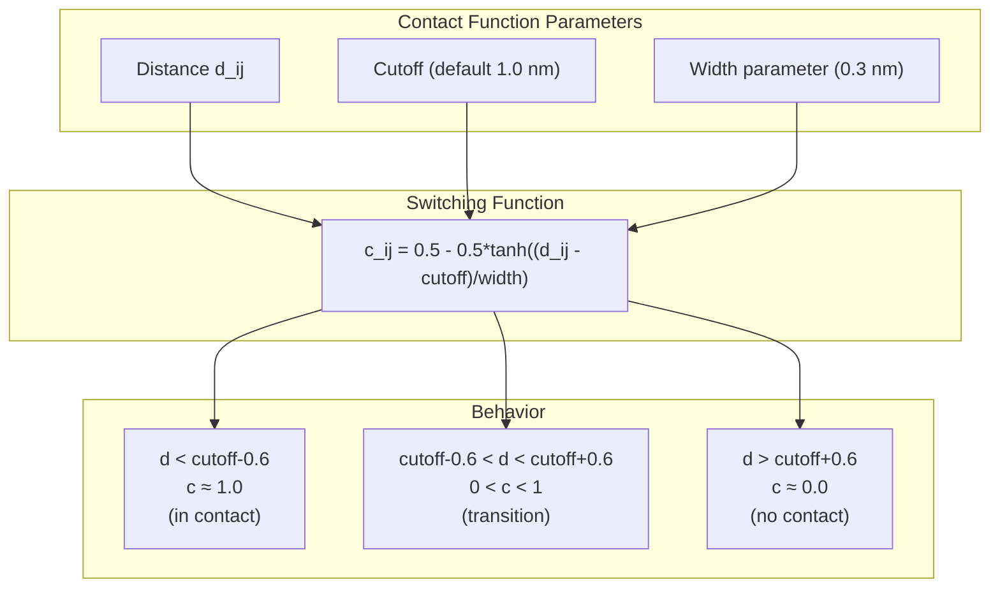
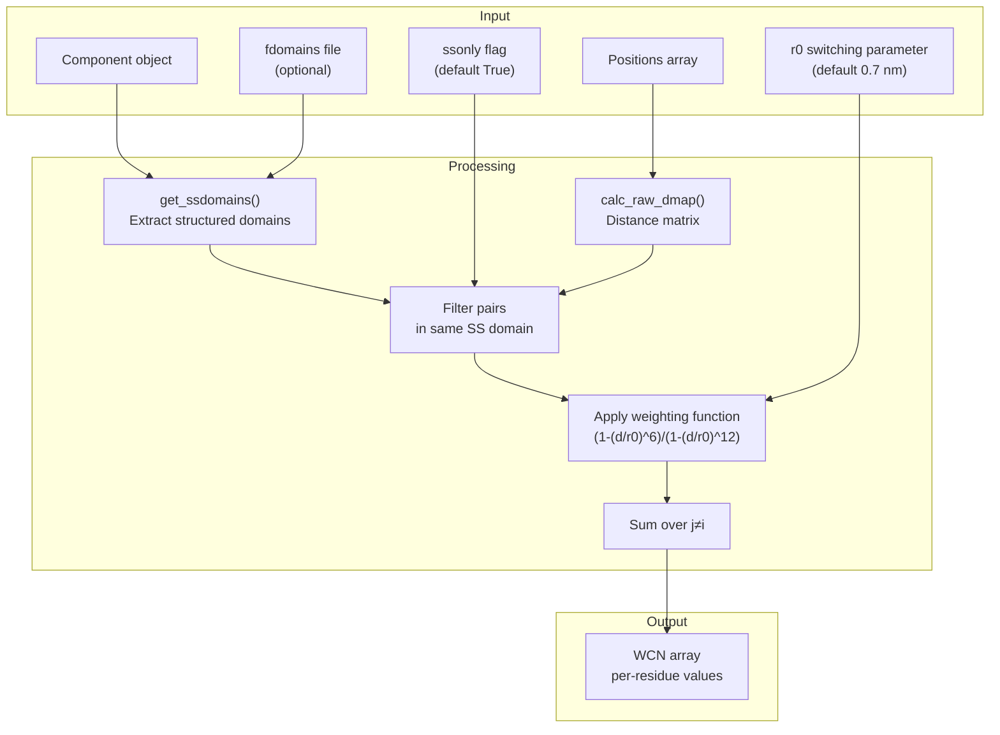
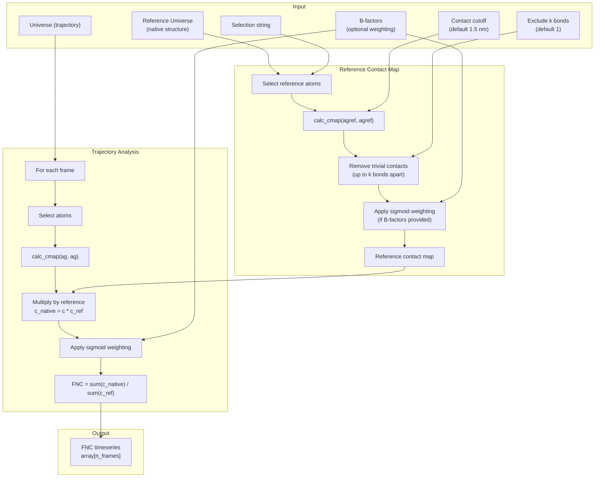

# Contact & Distance Analysis

<details>
<summary>Relevant source files</summary>

The following files were used as context for generating this wiki page:

- [calvados/analysis.py](calvados/analysis.py)
- [examples/slab_IDR/prepare.py](examples/slab_IDR/prepare.py)
- [examples/slab_MDP/prepare.py](examples/slab_MDP/prepare.py)

</details>


This page documents the functions for calculating distance maps, contact maps, weighted contact numbers (WCN), and fraction of native contacts (FNC) from simulation trajectories. These metrics quantify spatial relationships between residues or atoms at single timepoints or averaged over trajectories.

For structural properties like radius of gyration and end-to-end distance, see [Structural Properties](#5.2). For energy calculations from distance maps, see [Energy Calculations from Trajectories](#5.4). For multi-chain contact analysis in phase separation systems, see [Center of Mass & Multi-Chain Analysis](#5.5).

---

## Overview

Contact and distance analysis quantifies the spatial organization of molecular systems by computing pairwise distances between atoms or residues. CALVADOS provides several levels of analysis:

- **Distance maps**: Raw pairwise distances between atoms/residues
- **Contact maps**: Binary or smooth contact indicators based on distance cutoffs
- **Weighted contact number (WCN)**: Continuous measure of local packing density
- **Fraction of native contacts (FNC)**: Comparison of contacts to a reference structure

These metrics are used to characterize protein folding, conformational ensembles, and inter-molecular interactions in both single-chain and multi-chain systems.

**Workflow: Distance Analysis to Contact Metrics**



Sources: [calvados/analysis.py:107-235]()

---

## Distance Maps

Distance maps compute the pairwise Euclidean distances between atoms or residues, forming the foundation for all contact-based metrics.

### Single Configuration Distance Maps

The `calc_dmap` function computes distance maps between two atom groups for a single trajectory frame. It uses MDAnalysis's `distance_array` with periodic boundary conditions and converts distances from Angstroms to nanometers.



**Function Signature:**

```python
def calc_dmap(domain0, domain1):
    """ Distance map (nm) for single configuration
    
    Input: Atom groups
    Output: Distance map"""
    dmap = distances.distance_array(domain0.positions,  # reference
                                    domain1.positions,  # configuration
                                    box=domain0.dimensions) / 10.
    return dmap
```

**Usage Example:**

```python
import MDAnalysis as mda
from calvados.analysis import calc_dmap

u = mda.Universe('top.pdb', 'traj.dcd')
protein = u.select_atoms('protein')
dmap = calc_dmap(protein, protein)  # Self-distance map
```

Sources: [calvados/analysis.py:107-115]()

### Raw Distance Maps Without PBC

For analysis where periodic boundary conditions should not be applied (e.g., analyzing unwrapped trajectories), use `calc_raw_dmap`:

```python
def calc_raw_dmap(pos0, pos1):
    dmap = distances.distance_array(pos0, pos1)
    return dmap
```

This function operates directly on position arrays rather than AtomGroups and does not apply minimum image convention.

Sources: [calvados/analysis.py:117-119]()

### Self-Distance Maps

The `self_distances` function computes the self-distance map for a set of positions efficiently, optionally applying periodic boundary conditions:

```python
def self_distances(pos, box=None):
    """ Self distance map for matrix of positions
    
    If box dimensions are provided, distances are
    calculated using minimum image convention
    
    Input: Matrix of positions and (optional) box dimensions
    Output: Self distance map
    """
    N = len(pos)
    dmap = np.zeros((N,N))
    if box is not None:
        d = distances.self_distance_array(pos, box)
    else:
        d = distances.self_distance_array(pos)
    # Fill symmetric matrix from condensed array
    k = 0
    for i in range(N):
        for j in range(i + 1, N):
            dmap[i, j] = d[k]
            dmap[j, i] = d[k]
            k += 1
    return dmap
```

The condensed distance array is unpacked into a symmetric N×N matrix with zeros on the diagonal.

Sources: [calvados/analysis.py:121-142]()

---

## Contact Maps

Contact maps transform distance maps into binary or continuous contact indicators, typically using a distance cutoff to define whether residues are "in contact."

### Contact Definition with Smooth Switching Function

CALVADOS uses a **smooth hyperbolic tangent switching function** instead of a hard cutoff to define contacts:

```
cmap[i,j] = 0.5 - 0.5 * tanh((d[i,j] - cutoff) / 0.3)
```

This function:
- Returns ~1 when distance < cutoff (strong contact)
- Returns ~0 when distance > cutoff (no contact)
- Provides smooth transition over ~0.6 nm range
- Avoids discontinuities in trajectory averages

**Contact Map Switching Function**



Sources: [calvados/analysis.py:183-192]()

### Single Frame Contact Maps

The `calc_cmap` function computes the contact map for a single trajectory frame:

```python
def calc_cmap(domain0, domain1, cutoff=1.0):
    """ Contact map for single configuration
    
    Input: MDAnalysis Atom groups (can be the same or different)
    Output: Contact map
    """
    # Cutoff in nm
    dmap = calc_dmap(domain0, domain1)
    cmap = .5 - .5*np.tanh((dmap-cutoff)/.3)
    return(cmap)
```

**Parameters:**
- `domain0`, `domain1`: MDAnalysis AtomGroups (can be identical for self-contacts)
- `cutoff`: Distance cutoff in nm (default: 1.0 nm)

**Returns:**
- Contact map array with shape (len(domain0), len(domain1))
- Values range from 0 (no contact) to 1 (strong contact)

Sources: [calvados/analysis.py:183-192]()

### Trajectory-Averaged Contact Maps

The `cmap_traj` function computes time-averaged contact maps over a trajectory:

```python
def cmap_traj(u, domain0, domain1, cutoff=1.0, start=None, end=None, step=1):
    """ Average number of contacts along trajectory
    
    Input:
      * Universe
      * Atom groups
    Output:
      * Average contact map
    """
    cmap = np.zeros((len(domain0), len(domain1)))
    for ts in u.trajectory[start:end:step]:
        cmap += calc_cmap(domain0, domain1, cutoff)
    cmap /= len(u.trajectory)
    return cmap
```

**Usage Pattern:**

```python
u = mda.Universe('top.pdb', 'traj.dcd')
ag = u.select_atoms('protein')

# Calculate average contact map, excluding first 100 frames
cmap_avg = cmap_traj(u, ag, ag, cutoff=1.0, start=100)

# Exclude trivial contacts (bonded neighbors)
kmax = 3  # exclude up to 3 bonds apart
for k in range(-kmax, kmax+1):
    cmap_avg -= np.diag(np.diag(cmap_avg, k=k), k=k)

np.save('contact_map.npy', cmap_avg)
```

This approach is used in `save_conf_prop` to save contact maps along with structural properties.

Sources: [calvados/analysis.py:194-207](), [calvados/analysis.py:412-415]()

---

## Weighted Contact Number (WCN)

Weighted contact number quantifies the local packing density around each residue using a continuous weighting function rather than binary contacts. This is particularly useful for analyzing structured regions.

### WCN Formula

For each residue i, WCN is calculated as:

```
WCN[i] = Σ_j [(1 - (d_ij/r0)^6) / (1 - (d_ij/r0)^12)]
```

where:
- `d_ij` is the distance between residues i and j
- `r0` is the switching parameter (default: 0.7 nm)
- Sum is over all j ≠ i (excluding self-counting)

This function:
- Approaches 1 when d_ij << r0 (close contact)
- Approaches 0 when d_ij >> r0 (no contact)
- Provides smooth weighting of contact strength

**WCN Calculation Workflow**



### Function Implementation

```python
def calc_wcn(comp, pos, fdomains=None, ssonly=True, r0=0.7):
    """
    pos: positions [nm]
    r0: switching parameter [nm]
    """
    N = len(pos)
    dmap = calc_raw_dmap(pos, pos)
    
    if ssonly:
        ssdomains = get_ssdomains(comp.name, fdomains)
        wcn = np.zeros((N))
        for i in range(N-1):
            for j in range(i+1, N):
                ss = False
                if fdomains is not None:
                    for ssdom in ssdomains:
                        if (i in ssdom) and (j in ssdom):
                            ss = True
                if ss:
                    wcn[i] += (1 - (dmap[i,j]/r0)**6) / (1 - (dmap[i,j]/r0)**12)
    else:
        wcn = (1 - (dmap/r0)**6) / (1 - (dmap/r0)**12)
        wcn = np.sum(wcn, axis=1) - 1.  # subtract self-counting
    return wcn
```

**Parameters:**
- `comp`: Component object with `.name` attribute
- `pos`: Position array in nm
- `fdomains`: Path to domains.yaml file (optional)
- `ssonly`: If True, only count contacts within structured domains
- `r0`: Switching distance parameter in nm

**Returns:**
- Array of WCN values, one per residue

The `ssonly=True` option restricts WCN calculation to structured secondary structure domains defined in the domains.yaml file, which is useful for analyzing folded protein regions while ignoring disordered linkers.

Sources: [calvados/analysis.py:144-170]()

---

## Fraction of Native Contacts (FNC)

Fraction of native contacts measures how well a structure preserves the contact pattern of a reference structure (typically a crystal structure or AlphaFold prediction). This is used to quantify folding/unfolding or structural drift.

### FNC Calculation Workflow

**FNC Analysis Pipeline**



### Function Implementation

```python
def calc_fnc(u, uref, selstr, cutoff=1.5, kmax=1,
    bfac=[], sig_shift=0.8, width=50.):
    agref = uref.select_atoms(selstr)
    ag = u.select_atoms(selstr)
    
    # Optional B-factor based weighting
    if len(bfac) > 0:
        x0 = agref.indices[0]
        x1 = agref.indices[-1]+1
        bfac = bfac[x0:x1]
        bfacmat = np.add.outer(bfac, bfac) / 2.
        sigmoid = np.exp(width*(bfacmat-sig_shift)) / (np.exp(width*(bfacmat-sig_shift)) + 1.)
    else:
        sigmoid = 1.
    
    fnc = np.zeros((len(u.trajectory)))
    
    # Calculate reference contact map
    cref = calc_cmap(agref, agref, cutoff=cutoff)
    
    # Remove trivial contacts (self and bonded neighbors)
    for k in range(-kmax, kmax+1):
        cref -= np.diag(np.diag(cref, k=k), k=k)
    
    cref_sum = np.sum(cref*sigmoid)
    print('# native contacts:', cref_sum/2.)
    
    # Calculate FNC for each frame
    for t, ts in enumerate(u.trajectory):
        c = calc_cmap(ag, ag, cutoff=cutoff)
        cnat = c*cref  # Native contacts present in frame
        cnat_sum = np.sum(cnat*sigmoid)
        fnc[t] = cnat_sum/cref_sum
    
    return fnc
```

**Parameters:**
- `u`: MDAnalysis Universe (trajectory to analyze)
- `uref`: MDAnalysis Universe (reference structure)
- `selstr`: Atom selection string (e.g., 'protein')
- `cutoff`: Contact distance cutoff in nm (default: 1.5)
- `kmax`: Exclude contacts up to k bonds apart (default: 1)
- `bfac`: Array of B-factors for confidence weighting (optional)
- `sig_shift`: Sigmoid function shift parameter (default: 0.8)
- `width`: Sigmoid function width parameter (default: 50)

**Returns:**
- Array of FNC values, one per trajectory frame
- FNC ranges from 0 (no native contacts) to 1 (all native contacts preserved)

### AlphaFold Confidence Weighting

When B-factors (pLDDT scores from AlphaFold) are provided, a sigmoid weighting function down-weights contacts between low-confidence regions:

```
w_ij = exp(width*(B_ij - sig_shift)) / (exp(width*(B_ij - sig_shift)) + 1)

where B_ij = (B_i + B_j) / 2
```

This ensures FNC primarily measures preservation of high-confidence structural features.

Sources: [calvados/analysis.py:209-235]()

---

## Integration with Trajectory Analysis

Contact and distance analysis functions are commonly used together with other analysis tools in the workflow embedded in `config.yaml`:

**Typical Analysis Pattern:**

| Function | Purpose | Typical Usage |
|----------|---------|---------------|
| `calc_dmap` | Raw distances | Single-frame structural analysis |
| `calc_cmap` | Contact indicator | Single-frame contact identification |
| `cmap_traj` | Average contacts | Identifying persistent contacts over time |
| `calc_wcn` | Packing density | Characterizing folded region compactness |
| `calc_fnc` | Native structure preservation | Validating folded structures against reference |

**Example: Integrated Contact Analysis**

```python
# In save_conf_prop function
u = mda.Universe(f'{path:s}/top.pdb', f'{path:s}/{name:s}.dcd', in_memory=True)
ag = u.select_atoms(select)

# Calculate trajectory-averaged contact map
cmap = cmap_traj(u, ag, ag, cutoff=1.0, start=start)

# Exclude trivial contacts
for k in range(-kmax, kmax+1):
    cmap -= np.diag(np.diag(cmap, k=k), k=k)

np.save(output_path+'/cmap.npy', cmap)
```

For multi-chain contact analysis and slab-specific contacts, see [Center of Mass & Multi-Chain Analysis](#5.5), which uses `calc_contact_map` with `is_slab=True` to analyze contacts in the dense phase of phase-separated systems.

Sources: [calvados/analysis.py:388-415](), [examples/slab_IDR/prepare.py:62-63](), [examples/slab_MDP/prepare.py:62-63]()

---