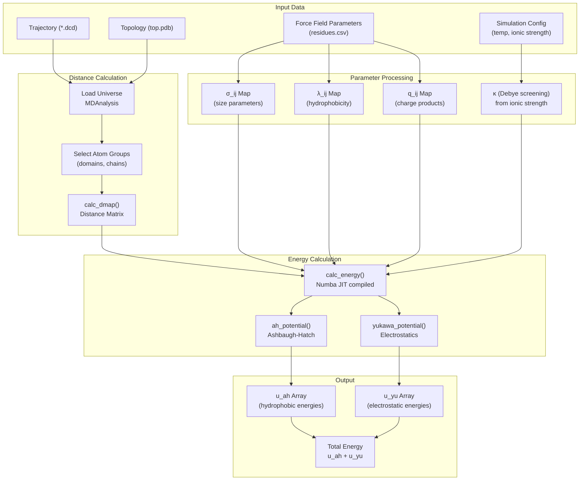
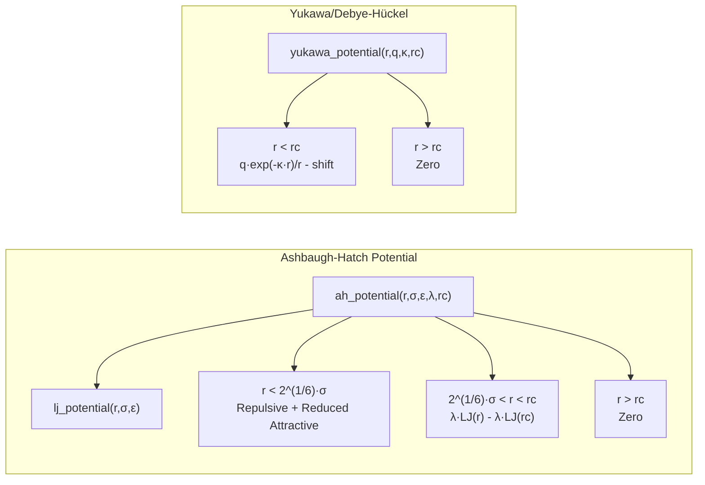
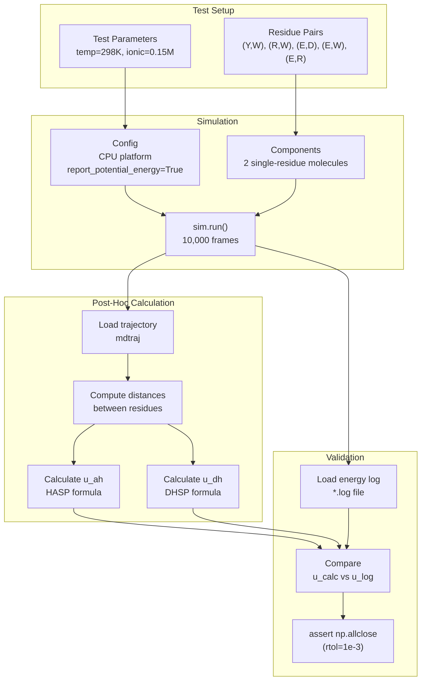
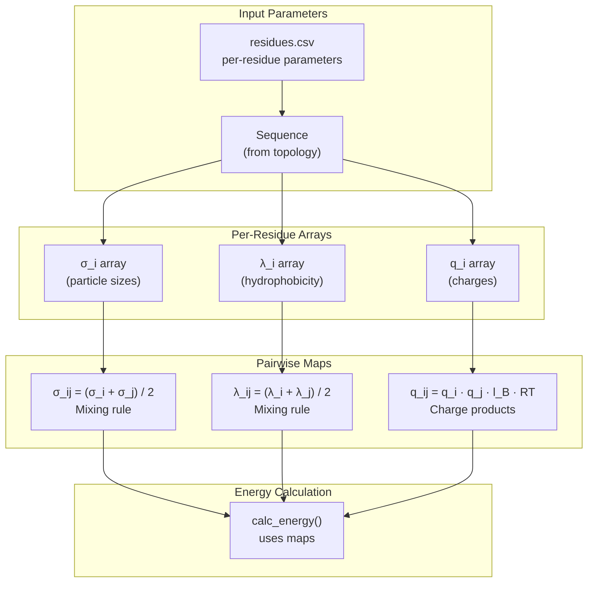

# Energy Calculations from Trajectories

<details>
<summary>Relevant source files</summary>

The following files were used as context for generating this wiki page:

- [calvados/analysis.py](calvados/analysis.py)
- [examples/slab_IDR/prepare.py](examples/slab_IDR/prepare.py)
- [examples/slab_MDP/prepare.py](examples/slab_MDP/prepare.py)
- [pytest.ini](pytest.ini)
- [tests/data/residues_CALVADOS2.csv](tests/data/residues_CALVADOS2.csv)
- [tests/test_potentials.py](tests/test_potentials.py)

</details>


## Purpose and Scope

This page documents the post-hoc energy calculation capabilities in CALVADOS, which allow users to compute Ashbaugh-Hatch (AH) and Yukawa potential energies from trajectory distance maps after a simulation has completed. These functions are primarily used for validation, energy decomposition analysis, and computing interaction energies between specific residue pairs or domains.

For structural property calculations (Rg, Ete, RMSD), see [Structural Properties](#5.2). For contact analysis, see [Contact & Distance Analysis](#5.3). For general trajectory analysis workflows, see [SlabAnalysis](#5.1).

---

## Overview

The energy calculation system provides tools to recompute interaction energies from saved trajectory frames using the same force field parameters that were used during the simulation. This is useful for:

- **Validation**: Comparing post-hoc calculations with OpenMM's reported energies
- **Energy decomposition**: Separating AH and Yukawa contributions
- **Pairwise analysis**: Computing energies between specific residue pairs or domains
- **Debugging**: Verifying force field implementations

The system uses Numba JIT compilation for performance and supports both intra-molecular and inter-molecular energy calculations.

Sources: [calvados/analysis.py:48-105]()

---

## Energy Calculation Workflow



**Diagram: Energy Calculation Pipeline**  
Shows the complete workflow from trajectory data through distance calculation, parameter processing, and energy computation to final output arrays.

Sources: [calvados/analysis.py:48-115](), [tests/test_potentials.py:96-126]()

---

## Core Functions

### calc_energy

The main energy calculation function that computes both AH and Yukawa energies from a distance map.

**Location**: [calvados/analysis.py:48-83]()

**Function Signature**:
```python
@nb.jit(nopython=True)
def calc_energy(dmap, sig, lam, rc_lj, eps_lj, qmap, k_yu, rc_yu=4.0, same_domain=False)
```

**Parameters**:

| Parameter | Type | Description |
|-----------|------|-------------|
| `dmap` | `ndarray` | Distance matrix between residue pairs (nm) |
| `sig` | `ndarray` | Sigma (σ) parameter matrix for LJ interactions |
| `lam` | `ndarray` | Lambda (λ) parameter matrix for hydrophobicity |
| `rc_lj` | `float` | Cutoff distance for AH potential (nm) |
| `eps_lj` | `float` | Energy prefactor for LJ interactions (kJ/mol) |
| `qmap` | `ndarray` | Charge product matrix (including prefactors) |
| `k_yu` | `float` | Inverse Debye length κ (nm⁻¹) |
| `rc_yu` | `float` | Cutoff distance for Yukawa potential (nm, default=4.0) |
| `same_domain` | `bool` | If True, skip adjacent residues (i-j ≤ 1) |

**Returns**:
- `u_ah`: Ashbaugh-Hatch energy matrix (kJ/mol)
- `u_yu`: Yukawa energy matrix (kJ/mol)

**Key Features**:
- Numba JIT compilation for ~100x speedup
- Loops over all residue pairs (i,j)
- Skips bonded neighbors when `same_domain=True`
- Applies cutoff distances for both potentials
- Returns separate energy components for analysis

Sources: [calvados/analysis.py:48-83]()

### calc_dmap

Calculates the distance matrix between two atom groups using MDAnalysis.

**Location**: [calvados/analysis.py:107-115]()

**Function Signature**:
```python
def calc_dmap(domain0, domain1)
```

**Parameters**:
- `domain0`: MDAnalysis atom group (reference)
- `domain1`: MDAnalysis atom group (configuration)

**Returns**:
- Distance matrix in nanometers (nm)

**Key Features**:
- Uses minimum image convention via box dimensions
- Converts Angstroms to nanometers (division by 10)
- Supports both intra- and inter-molecular distances

Sources: [calvados/analysis.py:107-115]()

---

## Potential Energy Functions



**Diagram: Potential Function Structure**  
Shows the hierarchical relationship between potential functions and their piecewise definitions.

Sources: [calvados/analysis.py:86-105]()

### Ashbaugh-Hatch Potential

The AH potential modulates the attractive part of the Lennard-Jones potential using the hydrophobicity parameter λ.

**Location**: [calvados/analysis.py:98-105]()

**Mathematical Form**:

For r < 2^(1/6)·σ (repulsive region):
```
U_AH(r) = LJ(r, σ, ε) - λ·LJ(rc, σ, ε) + ε·(1 - λ)
```

For 2^(1/6)·σ < r < rc (attractive region):
```
U_AH(r) = λ·[LJ(r, σ, ε) - LJ(rc, σ, ε)]
```

For r > rc:
```
U_AH(r) = 0
```

Where `LJ(r, σ, ε) = 4ε·[(σ/r)^12 - (σ/r)^6]`

**Key Parameters**:
- `σ`: Effective particle size (nm)
- `ε`: Energy scale, fixed at 0.8368 kJ/mol in CALVADOS
- `λ`: Hydrophobicity parameter (0 to 1)
- `rc`: Cutoff distance, typically 2.0 nm

Sources: [calvados/analysis.py:93-105]()

### Yukawa Potential (Electrostatics)

The Yukawa potential implements screened electrostatic interactions with Debye-Hückel screening.

**Location**: [calvados/analysis.py:86-90]()

**Mathematical Form**:

For r < rc:
```
U_YU(r) = q·[exp(-κ·r)/r - exp(-κ·rc)/rc]
```

For r > rc:
```
U_YU(r) = 0
```

**Key Parameters**:
- `q`: Charge product including Bjerrum length and temperature factors
- `κ`: Inverse Debye length (nm⁻¹), computed from ionic strength
- `rc`: Cutoff distance, typically 4.0 nm

**Screening Calculation**:
The Debye length is calculated from ionic strength:
```
κ = 1/λ_D = sqrt(8π·l_B·I·N_A/10)
```
where `I` is ionic strength (M) and `l_B` is the Bjerrum length (nm).

Sources: [calvados/analysis.py:86-90]()

---

## Validation Testing

### Test Framework

CALVADOS includes automated tests that validate energy calculations by comparing post-hoc calculations with OpenMM-reported energies during simulation.

**Location**: [tests/test_potentials.py]()



**Diagram: Validation Test Workflow**  
Shows how test_potentials.py validates energy calculations by comparing simulation output with post-hoc calculations.

Sources: [tests/test_potentials.py:21-127]()

### Test Implementation

The test function `test_ah_dh_potentials` validates five different residue pair combinations:

| Pair | Interaction Type |
|------|------------------|
| Y-W | Hydrophobic (high λ) |
| R-W | Charged-Hydrophobic |
| E-D | Charged-Charged (same sign) |
| E-W | Charged-Hydrophobic |
| E-R | Charged-Charged (opposite signs) |

**Test Procedure**:

1. **Setup**: Create two-residue system with specific pair
2. **Simulate**: Run 10,000 frames with energy logging enabled
3. **Extract**: Load distances from trajectory and energies from log
4. **Calculate**: Compute AH and DH potentials using validation formulas
5. **Compare**: Assert relative error < 0.1%

**Validation Formulas** [tests/test_potentials.py:12-19]():

```python
# Ashbaugh-Hatch with shifted potential
HASR = lambda r,s,l : 4*0.8368*((s/r)**12-(s/r)**6)+0.8368*(1-l)
HALR = lambda r,s,l : 4*0.8368*l*((s/r)**12-(s/r)**6)
HA = lambda r,s,l : np.where(r<2**(1/6)*s, HASR(r,s,l), HALR(r,s,l))
HASP = lambda r,s,l,rc : np.where(r<rc, HA(r,s,l)-HA(rc,s,l), 0)

# Debye-Hückel with shifted potential
DH = lambda r,yukawa_eps,lD : yukawa_eps*np.exp(-r/lD)/r
DHSP = lambda r,yukawa_eps,lD,rc : np.where(r<rc, DH(r,yukawa_eps,lD)-DH(rc,yukawa_eps,lD), 0)
```

Sources: [tests/test_potentials.py:11-127]()

---

## Usage Examples

### Example 1: Computing Energies from Trajectory

```python
import numpy as np
import MDAnalysis as mda
import pandas as pd
from calvados.analysis import calc_energy, calc_dmap

# Load trajectory and topology
u = mda.Universe('path/to/top.pdb', 'path/to/traj.dcd')

# Select domains/chains
domain0 = u.select_atoms('segid A')
domain1 = u.select_atoms('segid B')

# Load force field parameters
residues = pd.read_csv('residues_CALVADOS2.csv').set_index('three')

# Build parameter maps
seq0 = [r for r in domain0.resnames]
seq1 = [r for r in domain1.resnames]

sig0 = residues.loc[seq0, 'sigmas'].values
sig1 = residues.loc[seq1, 'sigmas'].values
sig_map = 0.5 * (sig0[:, np.newaxis] + sig1[np.newaxis, :])

lam0 = residues.loc[seq0, 'lambdas'].values
lam1 = residues.loc[seq1, 'lambdas'].values
lam_map = 0.5 * (lam0[:, np.newaxis] + lam1[np.newaxis, :])

q0 = residues.loc[seq0, 'q'].values
q1 = residues.loc[seq1, 'q'].values
# Include temperature and Bjerrum length factors
q_map = q0[:, np.newaxis] * q1[np.newaxis, :] * lB * RT

# Set physical parameters
temp = 293  # K
ionic = 0.15  # M
RT = 8.3145 * temp * 1e-3  # kJ/mol
lB = 0.7  # nm (approximate Bjerrum length)
kappa = 0.3  # nm^-1 (inverse Debye length)

# Calculate energies for each frame
energies_ah = []
energies_yu = []

for ts in u.trajectory:
    dmap = calc_dmap(domain0, domain1)
    u_ah, u_yu = calc_energy(
        dmap, sig_map, lam_map,
        rc_lj=2.0, eps_lj=0.8368,
        qmap=q_map, k_yu=kappa, rc_yu=4.0
    )
    energies_ah.append(np.sum(u_ah))
    energies_yu.append(np.sum(u_yu))

# Analyze results
energies_total = np.array(energies_ah) + np.array(energies_yu)
print(f"Mean total energy: {np.mean(energies_total):.2f} kJ/mol")
print(f"Mean AH contribution: {np.mean(energies_ah):.2f} kJ/mol")
print(f"Mean Yukawa contribution: {np.mean(energies_yu):.2f} kJ/mol")
```

Sources: [calvados/analysis.py:48-115]()

### Example 2: Validating Simulation Energy

```python
import numpy as np
import mdtraj as md
import pandas as pd

# Load simulation trajectory
traj = md.load('system.dcd', top='top.pdb')

# Compute all pairwise distances
n_atoms = traj.n_atoms
pair_indices = [(i, j) for i in range(n_atoms) for j in range(i+1, n_atoms)]
distances = md.compute_distances(traj, pair_indices)

# Load logged energies from OpenMM
energies_logged = np.loadtxt('system.log', usecols=(1))

# Calculate energies post-hoc using parameter maps
# (build sig_map, lam_map, q_map as in Example 1)
energies_calculated = []

for frame_idx in range(len(traj)):
    # Build distance map for this frame
    dmap = np.zeros((n_atoms, n_atoms))
    k = 0
    for i in range(n_atoms):
        for j in range(i+1, n_atoms):
            dmap[i,j] = distances[frame_idx, k]
            dmap[j,i] = distances[frame_idx, k]
            k += 1
    
    # Calculate energies
    u_ah, u_yu = calc_energy(
        dmap, sig_map, lam_map, 2.0, 0.8368,
        q_map, kappa, 4.0
    )
    energies_calculated.append(np.sum(u_ah) + np.sum(u_yu))

# Compare
energies_calculated = np.array(energies_calculated)
abs_error = np.abs(energies_calculated - energies_logged)
rel_error = abs_error / np.abs(energies_logged)

print(f"Max absolute error: {np.max(abs_error):.4f} kJ/mol")
print(f"Max relative error: {np.max(rel_error):.4f}")
print(f"Mean relative error: {np.mean(rel_error):.4f}")

# Should be very close (< 0.1% error)
assert np.allclose(energies_logged, energies_calculated, rtol=1e-3)
```

Sources: [tests/test_potentials.py:96-126]()

---

## Parameter Map Construction



**Diagram: Parameter Map Construction**  
Shows how per-residue parameters are processed into pairwise interaction maps.

### Mixing Rules

CALVADOS uses **arithmetic mean mixing rules** for σ and λ parameters:

```python
σ_ij = (σ_i + σ_j) / 2
λ_ij = (λ_i + λ_j) / 2
```

For charges, the **product rule** is used with additional physical factors:

```python
q_ij = q_i · q_j · l_B · RT
```

where:
- `l_B`: Bjerrum length (depends on temperature and dielectric constant)
- `RT`: Thermal energy (8.3145 × T × 10⁻³ kJ/mol)

Sources: [calvados/analysis.py:48-83](), [tests/test_potentials.py:108-116]()

---

## Performance Considerations

### Numba JIT Compilation

The `calc_energy` function uses Numba's `@nb.jit(nopython=True)` decorator for ~100x speedup:

**Benefits**:
- Compiled to machine code on first call
- No Python interpreter overhead
- Efficient loop execution
- Automatic parallelization possible

**Limitations**:
- First call has compilation overhead (~1 second)
- Limited to NumPy arrays and primitive types
- Cannot use Python objects inside JIT functions

### Computational Complexity

For N residues:
- Distance matrix calculation: O(N²) via MDAnalysis
- Energy calculation: O(N²) loop over all pairs
- Memory usage: O(N²) for distance and energy matrices

**Optimization Tips**:
- Pre-compile functions in setup phase
- Process trajectories in batches
- Use `same_domain=True` to skip bonded neighbors
- Consider domain-specific calculations for large systems

Sources: [calvados/analysis.py:48-83]()

---

## Cutoff Distances

The energy functions use two different cutoffs:

| Potential | Default Cutoff | Rationale |
|-----------|---------------|-----------|
| Ashbaugh-Hatch | 2.0 nm | Balances accuracy with computational cost |
| Yukawa | 4.0 nm | Electrostatics are longer-ranged |

**Shifted Potentials**: Both potentials are shifted to zero at the cutoff distance to ensure energy continuity:

```python
U_shifted(r) = U(r) - U(r_c)   if r < r_c
U_shifted(r) = 0                if r ≥ r_c
```

This prevents discontinuous energy jumps when particles cross the cutoff boundary.

Sources: [calvados/analysis.py:48-90](), [tests/test_potentials.py:12-19]()

---

## Related Functions

### Distance Calculation Functions

In addition to `calc_dmap`, the analysis module provides:

- **`calc_raw_dmap`** [calvados/analysis.py:117-119](): Simple distance matrix without box handling
- **`self_distances`** [calvados/analysis.py:121-142](): Self-distance map with optional minimum image convention

### Integration with Other Analysis

Energy calculations can be combined with:

- **Contact maps** (page 5.3): Identify which contacts contribute most to energy
- **Structural properties** (page 5.2): Correlate energies with conformational changes
- **SlabAnalysis** (page 5.1): Compute phase-specific interaction energies

Sources: [calvados/analysis.py:107-142]()

---