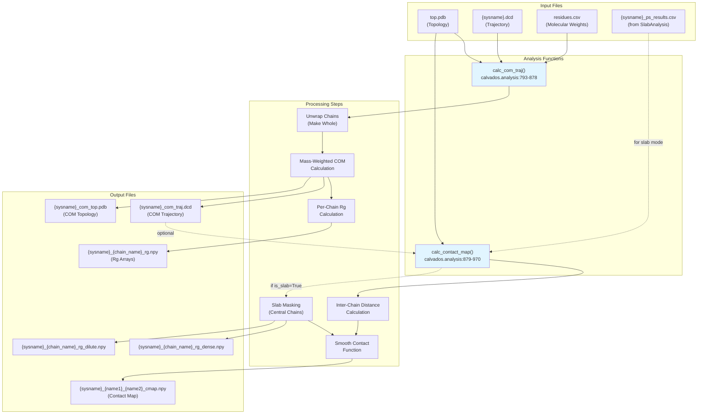
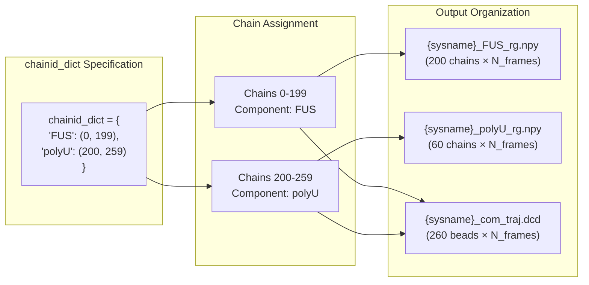
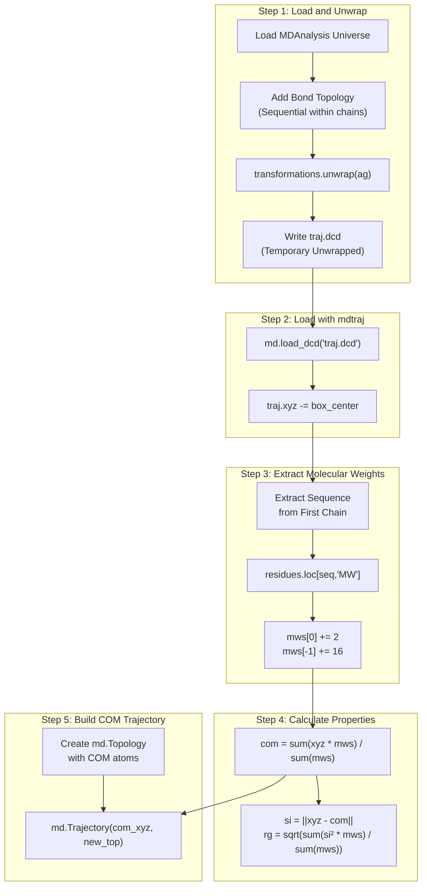
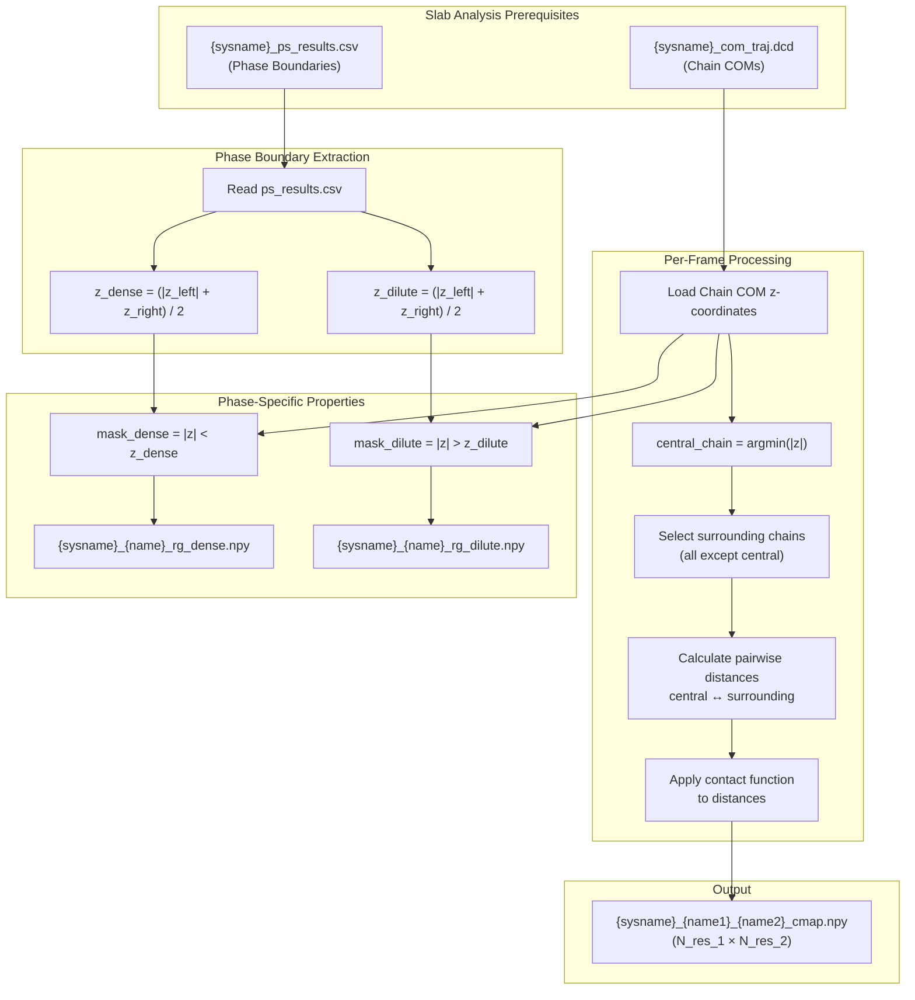

# Center of Mass & Multi-Chain Analysis

<details>
<summary>Relevant source files</summary>

The following files were used as context for generating this wiki page:

- [calvados/analysis.py](calvados/analysis.py)
- [examples/slab_IDR/prepare.py](examples/slab_IDR/prepare.py)
- [examples/slab_MDP/prepare.py](examples/slab_MDP/prepare.py)
- [examples/slab_mixed/prepare.py](examples/slab_mixed/prepare.py)

</details>


This page documents the center-of-mass trajectory analysis and multi-chain contact analysis functions in CALVADOS. These functions analyze systems containing multiple chains, calculating chain-level properties (center of mass positions, per-chain radii of gyration) and inter-chain contacts. They are particularly useful for studying phase separation systems with many molecules.

For analysis of single-chain structural properties (Rg, Ree, scaling exponents), see [5.2](#5.2). For slab-specific density profiles and phase separation analysis, see [5.1](#5.1). For intra-chain contact maps of individual molecules, see [5.3](#5.3).

## Overview

The primary analysis functions for multi-chain systems are:

- **`calc_com_traj`**: Reduces a many-chain all-atom trajectory to a coarse-grained trajectory where each chain is represented by its center of mass, and calculates per-frame Rg for each chain
- **`calc_contact_map`**: Calculates time-averaged contact maps between chains or sets of chains, with special handling for slab geometries

These functions are typically used together with `SlabAnalysis` to analyze phase separation simulations, but can be applied to any multi-chain system.



**Sources:** [calvados/analysis.py:793-970]()

## Center of Mass Trajectory Analysis

### Purpose

The `calc_com_traj` function converts an all-atom trajectory into a coarse-grained representation where each chain is represented by a single bead at its center of mass. This dramatically reduces data volume and enables efficient analysis of chain-level properties in systems with hundreds of chains.

### Function Signature

```python
calc_com_traj(path, sysname, output_path, residues_file, 
              chainid_dict={}, start=None, end=None, step=1, 
              input_pdb='top.pdb')
```

**Parameters:**

| Parameter | Type | Description |
|-----------|------|-------------|
| `path` | str | Directory containing input trajectory files |
| `sysname` | str | System name (used for file naming) |
| `output_path` | str | Directory for output files |
| `residues_file` | str | Path to residues CSV file (for molecular weights) |
| `chainid_dict` | dict | Maps component names to chain ID ranges (see below) |
| `start`, `end`, `step` | int | Trajectory slicing parameters |
| `input_pdb` | str | Topology file name (default: 'top.pdb') |

**Sources:** [calvados/analysis.py:793-811]()

### The chainid_dict Parameter

The `chainid_dict` parameter specifies which chains belong to which molecular components. It has a flexible format:

```python
# Format 1: Single chain per component
chainid_dict = {
    'protein_A': 0,
    'protein_B': 1
}

# Format 2: Range of chains per component
chainid_dict = {
    'protein_A': (0, 99),    # chains 0-99
    'protein_B': (100, 199)  # chains 100-199
}

# Format 3: Empty (single-component system)
chainid_dict = {}  # All chains treated as 'sysname'
```

When `chainid_dict` is empty, the function assumes a single-component system and processes all chains together.



**Sources:** [calvados/analysis.py:799-850](), [examples/slab_mixed/prepare.py:62]()

### Processing Workflow

The function performs the following steps:

1. **Chain Unwrapping**: Creates a temporary trajectory file (`traj.dcd`) where chains are made whole across periodic boundaries using MDAnalysis `transformations.unwrap`
2. **Center Coordinates**: Shifts trajectory so box center is at origin
3. **Mass-Weighted COM Calculation**: For each chain and each frame, calculates COM using molecular weights from `residues_file` (including terminal modifications: +2 Da for N-terminus, +16 Da for C-terminus)
4. **Rg Calculation**: Computes instantaneous radius of gyration for each chain using mass-weighted root-mean-square distance from COM
5. **COM Trajectory Output**: Creates a new mdtraj topology/trajectory where each chain is represented by a single bead



**Sources:** [calvados/analysis.py:812-878]()

### Output Files

| File | Content | Dimensions |
|------|---------|------------|
| `{sysname}_com_traj.dcd` | Trajectory of chain COMs | `(N_frames, N_chains, 3)` |
| `{sysname}_com_top.pdb` | Topology for COM trajectory | `N_chains` atoms |
| `{sysname}_{chain_name}_rg.npy` | Rg values per chain per frame | `(N_chains_in_component, N_frames)` |

The COM trajectory can be visualized with standard molecular viewers (VMD, PyMOL) or analyzed with MDAnalysis/mdtraj for collective properties like radial distribution functions.

**Sources:** [calvados/analysis.py:873-877]()

## Contact Map Analysis

### Purpose

The `calc_contact_map` function calculates time-averaged contact probabilities between chains. It supports both homotypic contacts (within a single component) and heterotypic contacts (between different components), with specialized handling for slab geometries where only contacts involving central chains are computed.

### Function Signature

```python
calc_contact_map(path, sysname, output_path, chainid_dict={}, 
                 is_slab=False, input_pdb='top.pdb')
```

**Parameters:**

| Parameter | Type | Description |
|-----------|------|-------------|
| `path` | str | Directory containing `traj.dcd` (unwrapped) |
| `sysname` | str | System name |
| `output_path` | str | Directory for output files |
| `chainid_dict` | dict | Maps component names to chain IDs |
| `is_slab` | bool | Enable slab-specific analysis (default: False) |
| `input_pdb` | str | Topology file name |

**Sources:** [calvados/analysis.py:879-903]()

### Contact Definition

Contacts are defined using a smooth function rather than a hard cutoff:

```
contact(r) = 0.5 - 0.5 * tanh((r - 1.0) / 0.3)
```

where `r` is the distance in nanometers. This function:
- Returns ~1.0 for r < 0.7 nm (strong contact)
- Returns ~0.5 for r = 1.0 nm (threshold)
- Returns ~0.0 for r > 1.3 nm (no contact)
- Provides smooth derivatives for numerical stability

**Sources:** [calvados/analysis.py:965]()

### Analysis Modes

#### Homotypic Contact Maps

When `chainid_dict` contains one component or when names match:

```python
chainid_dict = {'protein': (0, 99)}
# Calculates protein-protein contacts
```

The function calculates contacts between all pairs of chains within the component, averaging over all frames and all chain pairs.

#### Heterotypic Contact Maps

When `chainid_dict` contains two different components:

```python
chainid_dict = {
    'protein': (0, 199),
    'RNA': (200, 259)
}
# Calculates protein-RNA contacts
```

Computes contacts between chains from the first component and chains from the second component.

**Sources:** [calvados/analysis.py:907-924]()

### Slab-Specific Analysis

When `is_slab=True`, the function performs specialized analysis for phase-separated systems:

1. **Requires Prior Analysis**: Must have run `SlabAnalysis.calc_concentrations()` first to determine dense/dilute phase boundaries
2. **Identifies Central Chains**: For each frame, identifies which chain(s) are closest to the slab midplane (z=0)
3. **Calculates Restricted Contacts**: Only computes contacts between central chains and their surrounding chains
4. **Phase-Specific Rg**: Separates Rg values into dense and dilute phases based on chain COM positions



**Sources:** [calvados/analysis.py:928-970]()

### Contact Map Dimensions

The output contact map has dimensions `(N_residues_1, N_residues_2)` where:
- For homotypic: `N_residues_1 = N_residues_2` = residues per chain
- For heterotypic: Different dimensions for each component
- Each element `cmap[i,j]` represents the average contact probability between residue `i` of chains in component 1 and residue `j` of chains in component 2

The contact map is averaged over:
1. All frames in the trajectory
2. All chain pairs (or all central-surrounding pairs in slab mode)
3. All residue pairs at positions `(i,j)`

**Sources:** [calvados/analysis.py:955-969]()

## Integration with SlabAnalysis

These functions are commonly used in conjunction with `SlabAnalysis` for comprehensive phase separation analysis. The typical workflow in a preparation script:

```python
analyses = f"""
from calvados.analysis import SlabAnalysis, calc_com_traj, calc_contact_map

# Step 1: Slab density analysis
slab = SlabAnalysis(name="{sysname}", input_path="{path}",
                    output_path="{output_path}", 
                    ref_name="protein", verbose=True)
slab.center(start=400)
slab.calc_profiles()
slab.calc_concentrations()  # Creates ps_results.csv

# Step 2: COM trajectory (creates unwrapped traj.dcd)
calc_com_traj(path="{path}", sysname="{sysname}",
              output_path="{output_path}",
              residues_file="{residues_file}")

# Step 3: Contact map with slab-specific analysis
calc_contact_map(path="{path}", sysname="{sysname}",
                 output_path="{output_path}", is_slab=True)
"""
```

The order matters because:
1. `calc_concentrations()` creates the phase boundary file needed by slab-mode contact analysis
2. `calc_com_traj()` creates the unwrapped `traj.dcd` and COM trajectory needed by `calc_contact_map`
3. `calc_contact_map(is_slab=True)` uses outputs from both previous steps

**Sources:** [examples/slab_IDR/prepare.py:51-64](), [examples/slab_MDP/prepare.py:49-64]()

## Example Usage Patterns

### Single-Component System

For a system with 100 identical chains:

```python
# In prepare.py analyses string
calc_com_traj(path=path, sysname="protein_slab", 
              output_path="data",
              residues_file="residues_CALVADOS2.csv")

calc_contact_map(path=path, sysname="protein_slab",
                 output_path="data", is_slab=True)
# Automatically uses all chains
```

**Sources:** [examples/slab_IDR/prepare.py:62-63]()

### Multi-Component System

For a protein-RNA system:

```python
# Define component boundaries
chainid_dict = {
    'FUS-RGG3': (0, 199),   # 200 protein chains
    'polyU40': (200, 259)    # 60 RNA chains
}

calc_com_traj(path=path, sysname="mixed_system",
              output_path="data",
              residues_file="residues_C2RNA.csv",
              chainid_dict=chainid_dict)

calc_contact_map(path=path, sysname="mixed_system",
                 output_path="data",
                 chainid_dict=chainid_dict, is_slab=True)
```

This generates separate Rg arrays for each component and a heterotypic contact map showing protein-RNA interactions.

**Sources:** [examples/slab_mixed/prepare.py:52-73](), [examples/slab_MDP/prepare.py:61-63]()

## Output File Summary

| File Pattern | Source Function | Content |
|--------------|-----------------|---------|
| `{sysname}_com_traj.dcd` | `calc_com_traj` | Trajectory of chain centers of mass |
| `{sysname}_com_top.pdb` | `calc_com_traj` | Topology for COM trajectory (1 atom per chain) |
| `{sysname}_{component}_rg.npy` | `calc_com_traj` | Rg array: `(N_chains, N_frames)` |
| `{sysname}_{component}_rg_dense.npy` | `calc_contact_map` (slab) | Rg values in dense phase |
| `{sysname}_{component}_rg_dilute.npy` | `calc_contact_map` (slab) | Rg values in dilute phase |
| `{sysname}_{name1}_{name2}_cmap.npy` | `calc_contact_map` | Contact map: `(N_res_1, N_res_2)` |

All `.npy` files can be loaded with `numpy.load()` for further analysis or plotting.

**Sources:** [calvados/analysis.py:793-970]()

---