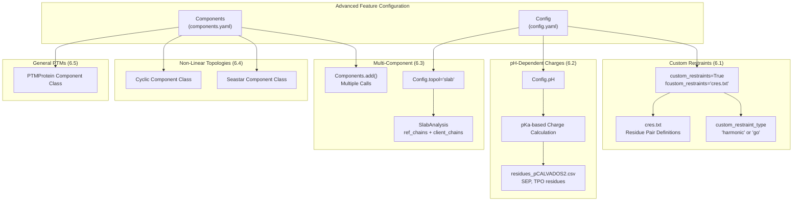
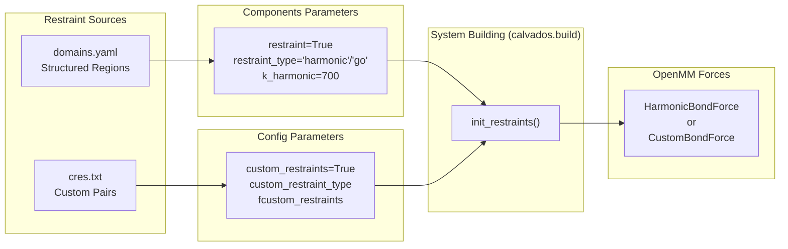
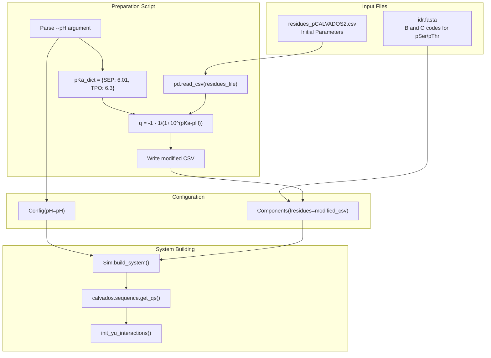
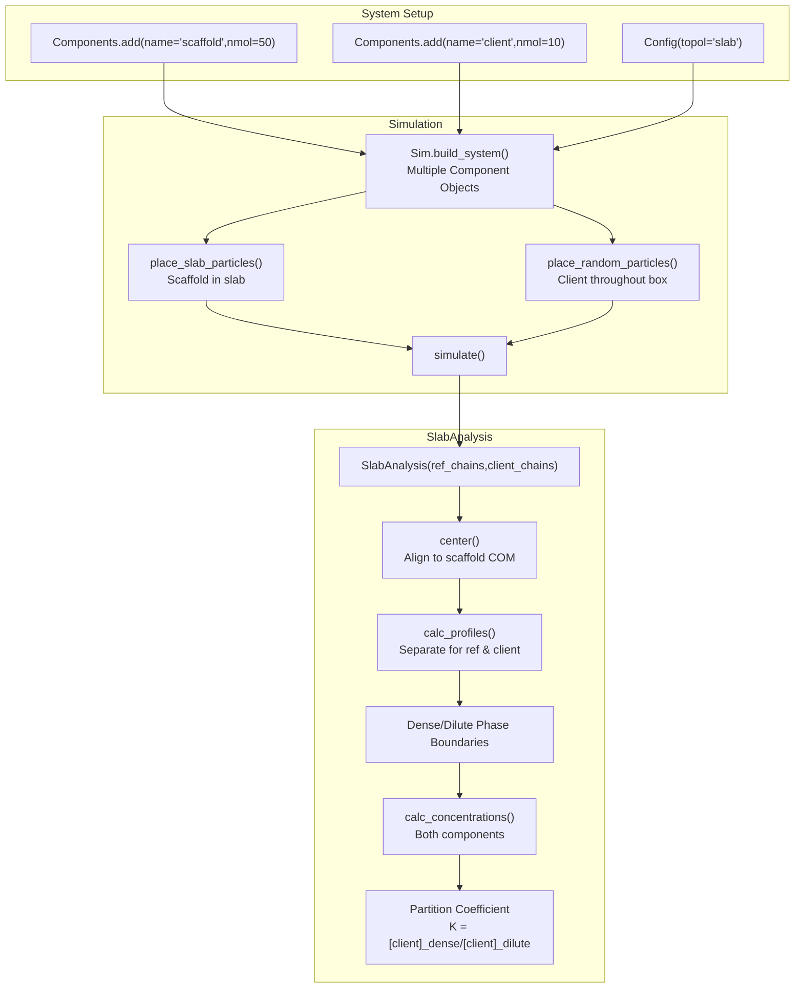
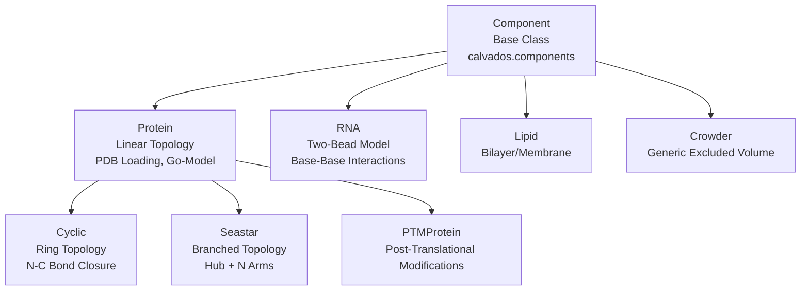
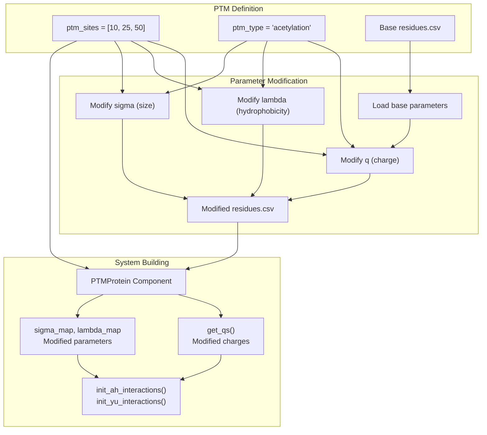

# Advanced Topics

<details>
<summary>Relevant source files</summary>

The following files were used as context for generating this wiki page:

- [examples/custom_restraints/prepare.py](examples/custom_restraints/prepare.py)
- [examples/single_pIDR/README.md](examples/single_pIDR/README.md)
- [examples/single_pIDR/input/idr.fasta](examples/single_pIDR/input/idr.fasta)
- [examples/single_pIDR/input/residues_pCALVADOS2.csv](examples/single_pIDR/input/residues_pCALVADOS2.csv)
- [examples/single_pIDR/prepare.py](examples/single_pIDR/prepare.py)

</details>


This page documents advanced features and specialized use cases in CALVADOS that extend beyond standard single-molecule simulations. These topics include custom restraint definitions, pH-dependent charge states for post-translational modifications, multi-component phase separation studies, non-linear topologies (cyclic and branched peptides), and general post-translational modification modeling.

For basic simulation setup, see [Simulation Setup & Configuration](#2). For standard molecular component types, see [Molecular Components & Force Fields](#3).

## Overview

CALVADOS provides several advanced capabilities for specialized research scenarios:

| Feature | Primary Classes/Parameters | Use Case |
|---------|---------------------------|----------|
| Custom Restraints | `Config.custom_restraints`, `fcustom_restraints` | User-defined harmonic restraints between arbitrary residue pairs |
| pH-Dependent Charges | `Config.pH`, modified `residues.csv` | Phosphorylated IDRs with pH-sensitive charge states |
| Multi-Component Systems | `Components.add()` with multiple entries | Phase separation with reference and client molecules |
| Non-Linear Topologies | `Cyclic`, `Seastar` component classes | Ring-closed and branched peptide structures |
| Post-Translational Modifications | `PTMProtein` component class | General PTM modeling framework |

These features are controlled through parameters in the `Config` and `Components` classes, often with specialized input files.



**Diagram: Advanced Feature Configuration Pathways**

The following sections detail each advanced feature category.

Sources: High-level architecture diagrams, [examples/single_pIDR/prepare.py:1-86](), [examples/custom_restraints/prepare.py:1-87]()

---

## Custom Restraints

Custom restraints allow users to define arbitrary harmonic or Go-model restraints between specific residue pairs, independent of structured domain definitions in `domains.yaml`. This is useful for imposing experimental constraints (e.g., from cross-linking, FRET) or testing specific structural hypotheses.

### Configuration

Custom restraints are enabled through three `Config` parameters:

```python
Config(
    custom_restraints = True,
    custom_restraint_type = 'harmonic',  # or 'go'
    fcustom_restraints = 'path/to/cres.txt',
)
```

The `custom_restraint_type` determines the potential form:
- `'harmonic'`: Simple harmonic restraint between residue pairs
- `'go'`: Go-model restraint (distance-dependent, mimicking native contacts)

Sources: [examples/custom_restraints/prepare.py:45-48]()

### File Format: cres.txt

The `cres.txt` file specifies which residue pairs receive restraints. The exact format depends on the restraint type and is processed during system building.

For standard use with protein components, restraints are typically defined between residue indices. The system reads this file and applies the specified restraint type to each listed pair.

### Interaction with Standard Restraints

Custom restraints are additive with standard restraints defined through:
- `Components.restraint = True` (domain-based restraints from `domains.yaml`)
- `Components.restraint_type` (harmonic or go for structured regions)

The custom restraints system provides fine-grained control beyond coarse domain definitions.



**Diagram: Custom Restraints Integration with Standard Restraints System**

Sources: [examples/custom_restraints/prepare.py:45-48](), [examples/custom_restraints/prepare.py:64-79]()

### Use Cases

1. **Experimental Constraints**: Impose restraints based on cross-linking mass spectrometry or FRET distance measurements
2. **Hypothesis Testing**: Test effects of specific residue-residue contacts on protein behavior
3. **Selective Restraints**: Apply restraints only to specific regions while leaving others flexible
4. **Non-Standard Topologies**: Define restraints for systems where automatic domain detection is insufficient

Sources: [examples/custom_restraints/prepare.py:1-87]()

---

## pH-Dependent Simulations & Phosphorylation

CALVADOS supports pH-dependent charge states for phosphorylated intrinsically disordered regions (pIDRs) using the pCALVADOS2 force field. This feature dynamically calculates residue charges based on pKa values and solution pH.

### Phosphorylated Residue Representation

Phosphorylated serine (pSer) and threonine (pThr) are represented with single-letter codes in FASTA files:
- `B`: Phosphoserine (SEP in three-letter code)
- `O`: Phosphothreonine (TPO in three-letter code)

Example FASTA entry:
```
>10pAsh1
SASSBPBPSOPTKSGKMRSRSSBPVRPKAYOPBPRBPNYHRFALDBPPQBPRRSSNSSITKKGSRRSSGSBPTRHTTRVCV
```

Sources: [examples/single_pIDR/input/idr.fasta:3-4]()

### pH-Dependent Charge Calculation

The charge on phosphorylated residues depends on solution pH through the Henderson-Hasselbalch equation:

```
q = -1 - 1 / (1 + 10^(pKa - pH))
```

This is implemented in the preparation script:

```python
pH = args.pH
pKa_dict = dict(SEP=6.01, TPO=6.3)

df_residues = pd.read_csv(residues_file, index_col='three')
for pres in pKa_dict.keys():
    df_residues.loc[pres,'q'] = - 1 - 1 / (1 + 10**(pKa_dict[pres]-pH))
df_residues.reset_index().set_index('one').to_csv(residues_file)
```

The script modifies the `residues_pCALVADOS2.csv` file in-place before system construction.

Sources: [examples/single_pIDR/prepare.py:25-35]()

### Force Field Parameters

The pCALVADOS2 force field (`residues_pCALVADOS2.csv`) includes parameters for phosphorylated residues:

| Residue | One-Letter | MW | lambdas | sigmas | q (pH-dependent) | bondlength |
|---------|------------|-----|---------|---------|------------------|------------|
| SEP | B | 165.04 | 0.0925 | 0.601 | calculated | 0.38 |
| TPO | O | 179.07 | 0.0013 | 0.635 | calculated | 0.38 |

The `q` column is overwritten by the prepare script based on input pH. At pH 7.0:
- pSer charge: -1.968654940548496
- pThr charge: -1.9406490568972323

Sources: [examples/single_pIDR/input/residues_pCALVADOS2.csv:22-23]()

### Workflow



**Diagram: pH-Dependent Charge Calculation Workflow for Phosphorylated Residues**

Sources: [examples/single_pIDR/prepare.py:10-35]()

### Configuration Example

```python
config = Config(
    sysname = 'phospho_idr',
    temp = 298,
    ionic = 0.19,
    pH = 7.0,  # Solution pH
    topol = 'center',
)

components = Components(
    molecule_type = 'protein',
    nmol = 1,
    restraint = False,  # IDRs typically have no restraints
    fresidues = 'residues_pCALVADOS2.csv',  # Modified with pH-dependent charges
    ffasta = 'idr.fasta',  # B and O codes for pSer/pThr
)
```

Sources: [examples/single_pIDR/prepare.py:37-84]()

### Command-Line Usage

```bash
python prepare.py --name 10pAsh1 --pH 7.0
python 10pAsh1/run.py --path 10pAsh1
```

The `--pH` argument controls the charge state calculation, enabling systematic studies of pH effects on pIDR behavior.

Sources: [examples/single_pIDR/README.md:1-8]()

### Analysis Considerations

When analyzing pIDR trajectories, the pH-dependent charge affects:
- Electrostatic screening (Yukawa potential)
- Net charge and dipole moment calculations
- Sequence charge decoration (SCD) and kappa parameters

The analysis functions in `calvados.analysis` read the modified `residues_pCALVADOS2.csv` file to ensure consistency:

```python
save_conf_prop(
    path=path,
    name=sysname,
    residues_file=residues_file,  # Points to modified CSV
    output_path=output_path,
    start=10,
    is_idr=True,
)
```

Sources: [examples/single_pIDR/prepare.py:61-66]()

---

## Multi-Component Phase Separation

Multi-component systems involve multiple molecular species with different copy numbers, enabling studies of:
- Partitioning behavior of client molecules into condensates
- Co-phase separation of multiple components
- Crowding effects on condensate properties

For detailed analysis workflows, see [SlabAnalysis - Phase Separation Studies](#5.1).

### Component Definition

Multiple components are added via sequential `Components.add()` calls:

```python
components = Components(
    molecule_type = 'protein',
    nmol = 50,  # Default copy number
    fresidues = 'residues_CALVADOS2.csv',
)

# Reference molecule (condensate-forming)
components.add(
    name = 'scaffold_protein',
    ffasta = 'scaffold.fasta',
)

# Client molecule (partitioning species)
components.add(
    name = 'client_protein',
    ffasta = 'client.fasta',
    nmol = 10,  # Different copy number
)
```

Each `add()` call can override default parameters (e.g., `nmol`, `restraint_type`, `charge_termini`).

### Slab Topology for Phase Separation

Multi-component phase separation studies typically use `topol='slab'` to create a two-phase system:

```python
config = Config(
    topol = 'slab',
    box = [15, 15, 30],  # Elongated z-dimension
    slab_width = 5.0,  # Initial slab thickness (nm)
)
```

The `slab_width` parameter controls the initial dense phase region centered at z=0. Reference molecules are placed in the slab, while client molecules are typically placed throughout the box.

### SlabAnalysis for Multi-Component Systems

The `SlabAnalysis` class distinguishes between reference and client chains:

```python
from calvados.analysis import SlabAnalysis

sa = SlabAnalysis(
    topology = 'top.pdb',
    trajectory = 'traj.dcd',
    ref_chains = [0, 1, 2],  # Scaffold protein chains (50 copies)
    client_chains = [50, 51, 52],  # Client protein chains (10 copies)
)

# Calculate density profiles for both components
sa.calc_profiles(nbins=100)

# Compute concentrations in dense and dilute phases
conc_ref, conc_client = sa.calc_concentrations()
```

The `ref_chains` define the condensate-forming component, while `client_chains` define partitioning species. The analysis calculates separate density profiles and concentrations for each component.

### Concentration Calculations

Concentrations are determined by:
1. Identifying dense and dilute phase boundaries from reference molecule density
2. Calculating average density of each component in each phase
3. Converting to molar concentrations using molecular weights

The partition coefficient is:
```
K_partition = [client]_dense / [client]_dilute
```

### Multi-Component Analysis Workflow



**Diagram: Multi-Component Phase Separation Analysis Pipeline**

Sources: High-level architecture diagrams (Diagram 4: Analysis & Post-Processing Ecosystem)

### Use Cases

1. **Client Partitioning Studies**: Measure how different client molecules partition into scaffold-formed condensates
2. **Co-Phase Separation**: Study cooperative or competitive interactions between multiple condensate-forming components
3. **Crowding Effects**: Add inert crowders (e.g., PEG) and measure effects on condensate properties
4. **Stoichiometry Studies**: Vary relative copy numbers of components to probe composition-dependent phase behavior

Sources: High-level architecture diagrams (Diagram 2: Simulation Preparation & Configuration System)

---

## Cyclic & Branched Peptides

CALVADOS supports non-linear topologies through specialized component classes that modify bonding patterns.

### Cyclic Component Class

The `Cyclic` class implements ring-closed topologies by adding a bond between the N- and C-termini:

```python
from calvados.components import Cyclic

components = Components(molecule_type='protein')
components.add(
    name = 'cyclic_peptide',
    component_class = Cyclic,  # Override default Protein class
    ffasta = 'peptide.fasta',
)
```

Key characteristics:
- Inherits from `Protein` base class
- Adds final bond between last and first residues
- Maintains standard bonded interactions (Ashbaugh-Hatch, Yukawa)
- No charged termini (closed ring)

### Seastar Component Class

The `Seastar` class implements branched topologies with a central hub and radiating arms:

```python
from calvados.components import Seastar

components = Components(molecule_type='protein')
components.add(
    name = 'branched_peptide',
    component_class = Seastar,
    ffasta = 'arms.fasta',  # Sequence of each arm
    n_arms = 4,  # Number of radiating arms
)
```

Topology:
- Central hub residue
- N arms radiating from the hub
- Each arm follows the sequence from the FASTA file
- Bonds connect hub to first residue of each arm
- Linear bonding within each arm

### Component Class Hierarchy



**Diagram: Component Class Hierarchy Including Non-Linear Topologies**

Sources: High-level architecture diagrams (Diagram 3: Core Component & Simulation System)

### Bonding Patterns

| Component Class | Bonding Pattern | Terminus Charges | Use Case |
|-----------------|-----------------|------------------|----------|
| Protein | Linear (residue i to i+1) | N and/or C termini | Standard proteins |
| Cyclic | Ring (i to i+1, plus N to C) | None | Cyclic peptides, stapled peptides |
| Seastar | Hub-and-spoke | N termini on each arm | Branched polymers, dendrimers |

### Configuration Notes

- `charge_termini` parameter should be set appropriately (typically `'none'` for Cyclic)
- Restraints can be applied to cyclic/branched structures using standard `domains.yaml` or custom restraints
- Force field parameters are identical to linear proteins

Sources: High-level architecture diagrams (Diagram 3: Core Component & Simulation System)

---

## Post-Translational Modifications

The `PTMProtein` class provides a general framework for modeling post-translational modifications beyond phosphorylation.

### PTMProtein Class

```python
from calvados.components import PTMProtein

components = Components(molecule_type='protein')
components.add(
    name = 'modified_protein',
    component_class = PTMProtein,
    ffasta = 'protein.fasta',
    ptm_sites = [10, 25, 50],  # Residue indices for PTMs
    ptm_type = 'acetylation',  # Type of modification
)
```

The class extends `Protein` with:
- Modification site tracking
- Modified force field parameters at PTM sites
- Custom residue properties (charge, hydrophobicity, size)

### Supported Modification Types

The framework supports any PTM that can be represented through modified residue parameters:

1. **Charge-Altering PTMs**:
   - Phosphorylation (pSer, pThr, pTyr)
   - Acetylation (neutralizes lysine charge)
   - Methylation (modifies charge state)

2. **Size/Hydrophobicity Modifications**:
   - Glycosylation (increased size, altered hydrophobicity)
   - Ubiquitination (large modifier)
   - SUMOylation (large modifier)

### Parameter Specification

PTM parameters are defined in the `residues.csv` file or dynamically modified:

```python
# Dynamic modification approach
ptm_residues = pd.read_csv('residues_CALVADOS2.csv', index_col='one')
ptm_residues.loc['K', 'q'] = 0.0  # Acetylated lysine (neutralized)
ptm_residues.loc['K', 'lambdas'] = 0.3  # Altered hydrophobicity
ptm_residues.to_csv('residues_acetylated.csv')
```

### Integration with Other Features

PTMs can be combined with:
- pH-dependent charges (for ionizable modifications)
- Custom restraints (to model conformational effects)
- Multi-component systems (studying PTM effects on phase separation)



**Diagram: PTMProtein Parameter Modification and System Building Workflow**

Sources: High-level architecture diagrams (Diagram 3: Core Component & Simulation System, Diagram 5: Force Field & Interaction Parameter System)

### Comparison with Phosphorylation Approach

| Aspect | pIDR (6.2) | PTMProtein |
|--------|------------|------------|
| PTM Types | Phosphorylation only | Any PTM |
| Charge Calculation | pH-dependent (Henderson-Hasselbalch) | User-defined |
| Force Field | residues_pCALVADOS2.csv | Custom residues.csv |
| FASTA Encoding | B, O codes | Standard codes + site list |
| Use Case | pH-dependent pIDR behavior | General PTM effects |

The pIDR approach (section 6.2) is specialized for pH-dependent phosphorylation, while `PTMProtein` provides a general framework for any modification type.

Sources: [examples/single_pIDR/prepare.py:1-86]()

---

## Summary

Advanced CALVADOS features extend the standard simulation framework to handle:

1. **Custom Restraints**: User-defined harmonic/Go-model restraints via `cres.txt` files
2. **pH-Dependent Phosphorylation**: Dynamic charge calculation for pIDRs using pCALVADOS2 force field
3. **Multi-Component Systems**: Multiple molecular species with `SlabAnalysis` for partitioning studies
4. **Non-Linear Topologies**: Cyclic and branched structures via `Cyclic` and `Seastar` classes
5. **General PTMs**: Framework for arbitrary post-translational modifications via `PTMProtein`

These features leverage the core CALVADOS architecture (Config, Components, Sim classes) while adding specialized parameters and processing logic. The modular design allows features to be combined (e.g., multi-component systems with PTMs and custom restraints) for complex research scenarios.

For implementation details of standard features, see:
- [Simulation Setup & Configuration](#2) for Config and Components classes
- [Molecular Components & Force Fields](#3) for base component classes
- [Running Simulations](#4) for system building and execution
- [Trajectory Analysis](#5) for post-simulation processing

Sources: [examples/single_pIDR/prepare.py:1-86](), [examples/custom_restraints/prepare.py:1-87](), High-level architecture diagrams

---