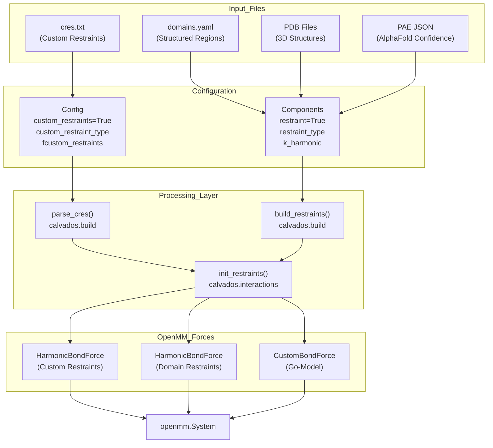
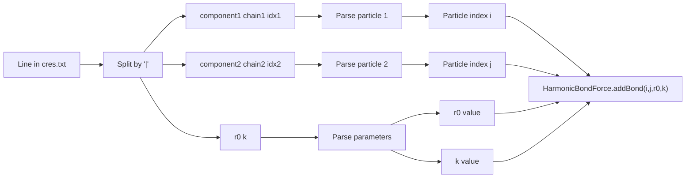
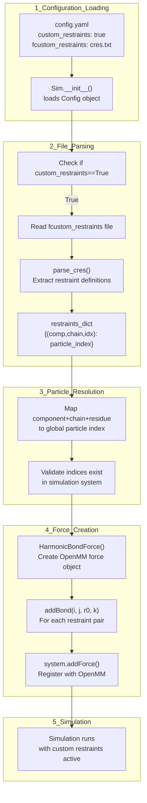
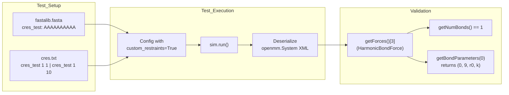
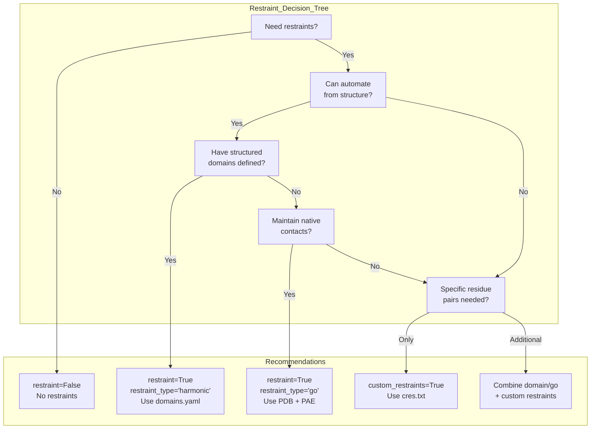

# Custom Restraints

<details>
<summary>Relevant source files</summary>

The following files were used as context for generating this wiki page:

- [examples/custom_restraints/prepare.py](examples/custom_restraints/prepare.py)
- [tests/data/cres.txt](tests/data/cres.txt)
- [tests/data/fastalib.fasta](tests/data/fastalib.fasta)
- [tests/data/residues_C2RNA.csv](tests/data/residues_C2RNA.csv)
- [tests/test_custom_restraints.py](tests/test_custom_restraints.py)

</details>


## Purpose and Scope

This page documents the custom restraints feature in CALVADOS, which allows users to define arbitrary harmonic restraints between specific residue pairs using a simple text file format. Custom restraints provide fine-grained control over which atoms or residues are restrained, complementing the automated restraint systems described in other sections.

For automated restraint generation from structured domains, see [Restraints System](#3.5). For component-level restraint configuration, see [Components Class](#2.2).

---

## Overview

Custom restraints enable users to manually specify harmonic potentials between any pair of particles in the simulation system. This feature is distinct from other restraint mechanisms in CALVADOS:

| Restraint Type | Definition Source | Automation Level | Use Case |
|---------------|------------------|------------------|----------|
| **Custom Restraints** | `cres.txt` file | Manual specification | Experimental validation, specific residue pairs |
| **Domain Restraints** | `domains.yaml` file | Semi-automated (domain definitions) | Structured regions within IDRs |
| **Go-Model Restraints** | PDB structures + PAE | Fully automated | Maintaining native structure |
| **Harmonic Restraints** | PDB structures | Fully automated | Simplified structured domain modeling |

Custom restraints are implemented as additional harmonic bond forces that coexist with other restraint types and standard bonded interactions.

**Sources:** [examples/custom_restraints/prepare.py:1-87](), [calvados/cfg.py (Config class)]()

---

## Restraints System Architecture

The following diagram shows how custom restraints integrate with CALVADOS' broader restraint system:



**Sources:** [examples/custom_restraints/prepare.py:26-48](), [calvados/build.py (parse_cres, build_restraints)](), [calvados/interactions.py (init_restraints)]()

---

## File Format Specification

Custom restraints are defined in a plain text file (typically `cres.txt`) with the following format:

### Format Structure

```
component_name chain_id residue_idx1 | component_name chain_id residue_idx2 | r0 k
```

### Field Definitions

| Field | Type | Description |
|-------|------|-------------|
| `component_name` | string | Name of the molecular component (must match Components definition) |
| `chain_id` | integer | Chain identifier (1-indexed, typically 1 for single-chain proteins) |
| `residue_idx1/2` | integer | Residue index (1-indexed, corresponds to sequence position) |
| `r0` | float | Equilibrium distance (nm) |
| `k` | float | Force constant (kJ/mol/nm²) |

### Example File

```
# Restrain first and last residues of protein A
proteinA 1 1 | proteinA 1 50 | 1.0 700.0

# Restrain specific loop region
proteinA 1 25 | proteinA 1 30 | 0.5 1000.0

# Empty lines and comments are allowed
```

### Parsing Details

The parser uses the pipe character (`|`) as a delimiter to separate particle specifications from restraint parameters. The format follows this pattern:



**Sources:** [tests/data/cres.txt:1-2](), [calvados/build.py (parse_cres function)]()

---

## Configuration Parameters

Custom restraints are controlled by three configuration parameters in the `Config` class:

### Config Parameters

```python
config = Config(
    custom_restraints = True,              # Enable custom restraints
    custom_restraint_type = 'harmonic',     # Type (currently only 'harmonic')
    fcustom_restraints = 'path/to/cres.txt' # Path to restraints file
)
```

| Parameter | Type | Default | Description |
|-----------|------|---------|-------------|
| `custom_restraints` | bool | `False` | Enable/disable custom restraint system |
| `custom_restraint_type` | str | `'harmonic'` | Restraint functional form (currently only harmonic supported) |
| `fcustom_restraints` | str | `None` | File path to custom restraints definition file |

### Integration with Component Restraints

Custom restraints work independently of component-level restraint settings and can be combined with them:

```python
# Component configuration
components = Components(
    restraint = True,                    # Enable domain/Go-model restraints
    restraint_type = 'harmonic',         # or 'go'
    k_harmonic = 700.0,                  # Force constant for domain restraints
    fdomains = 'domains.yaml'            # Domain definitions
)

# Config with custom restraints
config = Config(
    custom_restraints = True,            # Additional custom restraints
    fcustom_restraints = 'cres.txt'      # Custom restraint specifications
)
```

Both restraint systems will be applied simultaneously, with custom restraints supplementing the automated domain/Go-model restraints.

**Sources:** [examples/custom_restraints/prepare.py:26-48](), [examples/custom_restraints/prepare.py:64-82]()

---

## Implementation Workflow

The following diagram shows how custom restraints are processed from file to OpenMM force objects:



### Key Implementation Functions

The custom restraints system involves several key functions:

| Function | Module | Purpose |
|----------|--------|---------|
| `parse_cres()` | `calvados.build` | Parse cres.txt file and extract restraint definitions |
| `init_restraints()` | `calvados.interactions` | Create OpenMM HarmonicBondForce objects |
| `build_system()` | `calvados.sim.Sim` | Orchestrate restraint initialization during system building |

**Sources:** [calvados/build.py](), [calvados/interactions.py](), [calvados/sim.py]()

---

## Usage Example

The following example demonstrates a complete workflow for setting up a simulation with custom restraints:

### Directory Structure

```
project/
├── prepare.py
├── input/
│   ├── residues_CALVADOS3.csv
│   ├── cres.txt
│   ├── domains.yaml
│   └── protein.pdb
└── output/
```

### Preparation Script

```python
from calvados.cfg import Config, Components
import subprocess

# Define custom restraints file path
cres_file = 'input/cres.txt'

# Configure simulation with custom restraints
config = Config(
    sysname = 'my_protein',
    box = [40, 40, 40],
    temp = 293,
    ionic = 0.19,
    topol = 'center',
    wfreq = 8000,
    steps = 32000000,
    
    # Enable custom restraints
    custom_restraints = True,
    custom_restraint_type = 'harmonic',
    fcustom_restraints = cres_file
)

# Define components with domain restraints
components = Components(
    nmol = 1,
    restraint = True,
    restraint_type = 'harmonic',
    k_harmonic = 700.0,
    fresidues = 'input/residues_CALVADOS3.csv',
    fdomains = 'input/domains.yaml',
    pdb_folder = 'input'
)
components.add(name='my_protein')

# Write configuration
path = 'output'
subprocess.run(f'mkdir -p {path}', shell=True)
config.write(path, name='config.yaml')
components.write(path, name='components.yaml')
```

### Custom Restraints File (cres.txt)

```
# Restrain N-terminus to C-terminus
my_protein 1 1 | my_protein 1 100 | 3.0 700.0

# Restrain loop residues
my_protein 1 45 | my_protein 1 55 | 1.5 1000.0
```

**Sources:** [examples/custom_restraints/prepare.py:1-87]()

---

## Validation and Testing

The custom restraints system includes test cases to verify correct implementation:

### Test Validation



### Test Implementation

The test suite verifies that:

1. Custom restraints are correctly parsed from the file
2. The correct number of restraints are added to the system
3. Particle indices are correctly resolved (0-indexed in OpenMM vs 1-indexed in cres.txt)
4. Force parameters (r0, k) are correctly assigned

```python
# Extract from test
system = openmm.XmlSerializer.deserialize(open(f"{path}/{sysname}.xml").read())
force = system.getForces()[3]  # HarmonicBondForce for custom restraints
N = force.getNumBonds()
f = force.getBondParameters(0)
i, j = f[0], f[1]

assert (N == 1) and (i == 0) and (j == 9)  # Verifies 1-indexed -> 0-indexed conversion
```

**Sources:** [tests/test_custom_restraints.py:1-112](), [tests/data/cres.txt:1-2](), [tests/data/fastalib.fasta:13-14]()

---

## Use Cases and Best Practices

### When to Use Custom Restraints

Custom restraints are appropriate for:

- **Experimental validation**: Restraining distances measured from FRET, crosslinking, or other experiments
- **Tertiary contacts**: Enforcing specific long-range contacts not captured by domain definitions
- **Symmetry constraints**: Maintaining symmetry in multimeric complexes
- **Controlled unfolding**: Progressively removing restraints to study unfolding pathways

### Best Practices

| Practice | Rationale |
|----------|-----------|
| Use moderate force constants (500-1000 kJ/mol/nm²) | Avoid numerical instabilities while maintaining restraints |
| Set r0 based on experimental data or reference structures | Ensures physical relevance of restraints |
| Combine with equilibration | Allow system to relax with restraints before production |
| Document restraint choices | Include comments in cres.txt explaining each restraint |
| Validate restraint satisfaction | Monitor distances during simulation to verify compliance |

### Force Constant Guidelines

The force constant `k` determines restraint stiffness:

- **Weak restraints** (100-300 kJ/mol/nm²): Allow significant fluctuations
- **Moderate restraints** (500-1000 kJ/mol/nm²): Standard for maintaining structural features
- **Strong restraints** (>1500 kJ/mol/nm²): Tightly constrain distances, use cautiously

**Sources:** [examples/custom_restraints/prepare.py:78](), Domain knowledge from force field parameterization

---

## Relationship to Other Restraint Types

### Restraint Type Comparison



### Combined Restraint Strategy

Custom restraints can be used in combination with automated restraints:

```python
# Example: Structured protein with additional experimental constraints
components = Components(
    restraint = True,
    restraint_type = 'go',           # Go-model for native structure
    k_harmonic = 700.0,
    fdomains = 'domains.yaml'         # Structured regions
)

config = Config(
    custom_restraints = True,
    fcustom_restraints = 'cres.txt'   # Additional FRET-derived distances
)
```

This approach:
- Maintains native structural topology via Go-model
- Defines structured domains via domains.yaml
- Adds specific experimental constraints via cres.txt

**Sources:** [examples/custom_restraints/prepare.py:64-82]()

---

## Technical Notes

### Index Conversion

Custom restraint files use **1-indexed** residue numbering (matching PDB/FASTA conventions), while OpenMM uses **0-indexed** particle numbering. The `parse_cres()` function handles this conversion automatically:

```
cres.txt:        residue 1, residue 10
Internal:        particle 0, particle 9
```

### Force Object Placement

Custom restraints are added as a separate `HarmonicBondForce` object in the OpenMM system, typically registered after standard bonded interactions. The test case shows this is typically `system.getForces()[3]`, though the exact index may vary depending on the number of other forces present.

### Multi-Component Systems

For systems with multiple molecular components, the component name in cres.txt must exactly match the name specified in `Components.add(name=...)`. Chain identifiers distinguish between multiple copies of the same molecule.

**Sources:** [tests/test_custom_restraints.py:99-107](), [calvados/build.py (parse_cres)]()

---