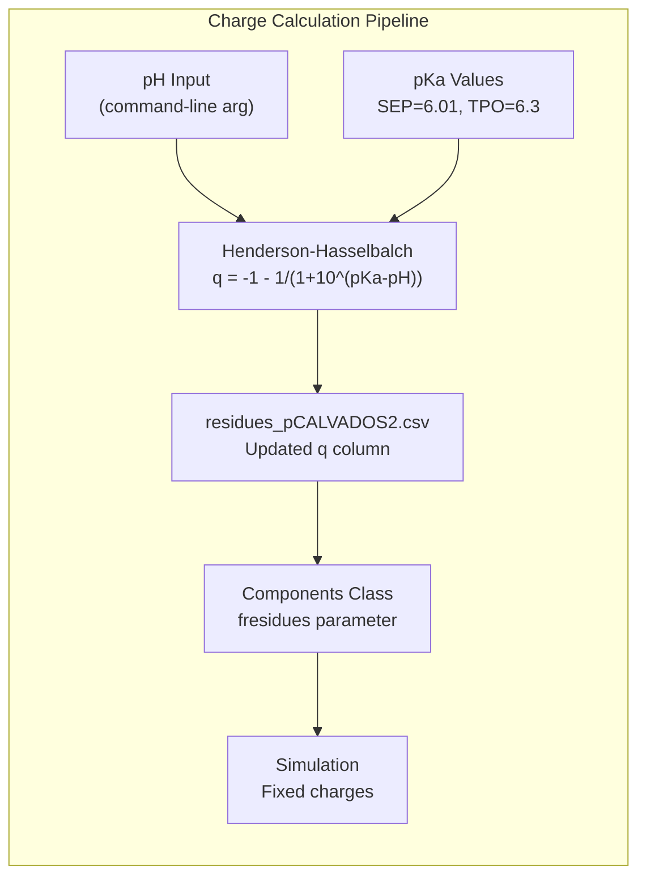
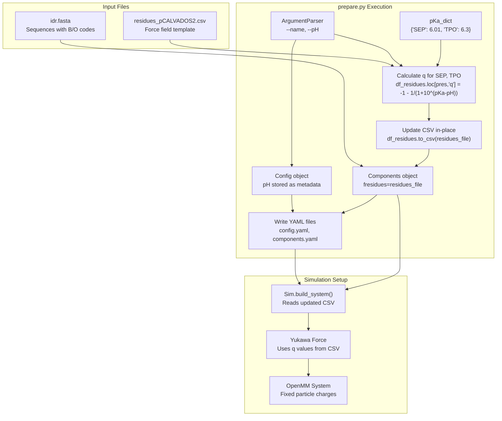
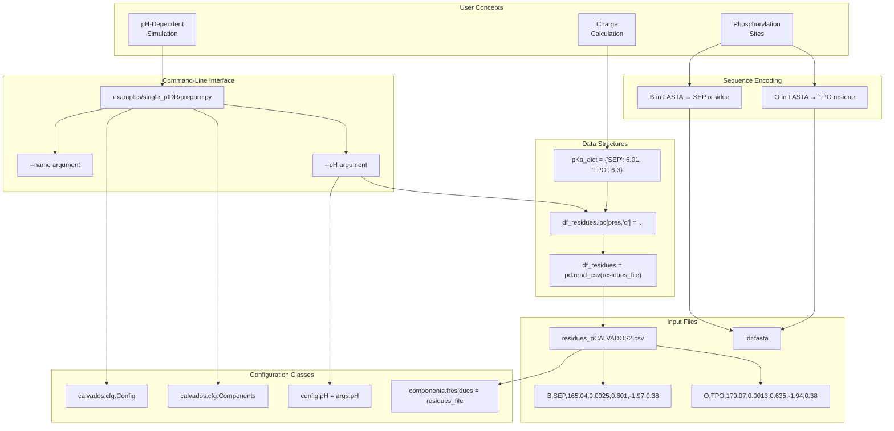

# pH-Dependent Simulations & Phosphorylation

<details>
<summary>Relevant source files</summary>

The following files were used as context for generating this wiki page:

- [examples/single_pIDR/README.md](examples/single_pIDR/README.md)
- [examples/single_pIDR/input/idr.fasta](examples/single_pIDR/input/idr.fasta)
- [examples/single_pIDR/input/residues_pCALVADOS2.csv](examples/single_pIDR/input/residues_pCALVADOS2.csv)
- [examples/single_pIDR/prepare.py](examples/single_pIDR/prepare.py)

</details>


## Purpose and Scope

This document describes how to simulate phosphorylated intrinsically disordered regions (pIDRs) with pH-dependent charge states using the **pCALVADOS2** force field. The system dynamically adjusts phosphoresidue charges based on solution pH and their pKa values, enabling studies of how phosphorylation and pH affect conformational properties and phase separation behavior.

For general IDR simulations without phosphorylation, see [Single IDR Simulation](#7.1). For post-translational modifications beyond phosphorylation, see [Post-Translational Modifications](#6.5). For force field parameters and interaction potentials, see [Force Field & Interaction Potentials](#3.4).

---

## pCALVADOS2 Force Field Overview

The **pCALVADOS2** force field extends the standard CALVADOS2 force field by adding parameterized phosphorylated residues with pH-tunable charges. The force field introduces two new residue types:

| One-Letter Code | Three-Letter Code | Full Name | pKa | MW (Da) | λ | σ (nm) | Bond Length (nm) |
|-----------------|-------------------|-----------|-----|---------|------|--------|-----------------|
| B | SEP | Phosphoserine | 6.01 | 165.04 | 0.0925 | 0.601 | 0.38 |
| O | TPO | Phosphothreonine | 6.3 | 179.07 | 0.0013 | 0.635 | 0.38 |

These residues carry **pH-dependent negative charges** calculated using the Henderson-Hasselbalch equation. At neutral pH (~7), both phosphoresidues carry approximately -2e charge (one from the phosphate group, one from ionization). The hydrophobicity parameters (λ) are significantly lower than their unphosphorylated counterparts, reflecting the hydrophilic nature of the phosphate moiety.

**Sources:** [examples/single_pIDR/input/residues_pCALVADOS2.csv:22-23]()

---

## Encoding Phosphorylated Residues in Sequences

### One-Letter Code Mapping

Phosphorylated residues use **non-standard one-letter codes** in FASTA sequences:

```
Standard Residue → Phosphorylated Residue
S (Serine)       → B (Phosphoserine, SEP)
T (Threonine)    → O (Phosphothreonine, TPO)
```

### Example FASTA Format

```
>Ash1
SASSSPSPSTPTKSGKMRSRSSSPVRPKAYTPSPRSPNYHRFALDSPPQSPRRSSNSSITKKGSRRSSGSSPTRHTTRVCV

>10pAsh1
SASSBPBPSOPTKSGKMRSRSSBPVRPKAYOPBPRBPNYHRFALDBPPQBPRRSSNSSITKKGSRRSSGSBPTRHTTRVCV
```

In the `10pAsh1` sequence, all serine (`S`) at phosphorylation sites are replaced with `B`, and threonine (`T`) sites are replaced with `O`. The CALVADOS system maps these one-letter codes to three-letter codes (SEP, TPO) via the residues CSV file.

**Sources:** [examples/single_pIDR/input/idr.fasta:1-4]()

---

## pH-Dependent Charge Calculation

### Theoretical Basis

Phosphorylated residues carry **two titratable groups**:
1. The backbone carboxyl/amino groups (same as standard residues)
2. The phosphate group with pKa ~ 6-6.3

The charge on phosphorylated residues at a given pH is calculated as:

```
q(pH) = q_base + q_phosphate(pH)
      = -1 + (-1 / (1 + 10^(pKa - pH)))
```

Where:
- `q_base = -1`: The fully ionized phosphate group at low pH
- `q_phosphate(pH)`: The pH-dependent ionization state
- `pKa_SEP = 6.01`: pKa of phosphoserine
- `pKa_TPO = 6.3`: pKa of phosphothreonine

### Charge-pH Relationship



**Charge behavior:**
- pH << pKa (acidic): q ≈ -1 (phosphate protonated)
- pH = pKa: q ≈ -1.5 (50% ionized)
- pH >> pKa (basic): q ≈ -2 (phosphate fully deprotonated)

At physiological pH (7.0-7.4), SEP and TPO carry approximately **-1.94 to -1.97 charge**, close to the fully ionized state of -2.

**Sources:** [examples/single_pIDR/prepare.py:30-35]()

---

## Setting Up pH-Dependent Simulations

### Workflow Diagram



### Step-by-Step Implementation

#### 1. Command-Line Arguments

The preparation script accepts pH as a required argument:

```python
parser = ArgumentParser()
parser.add_argument('--name', nargs='?', required=True, type=str)
parser.add_argument('--pH', nargs='?', required=True, type=float)
args = parser.parse_args()
```

**Sources:** [examples/single_pIDR/prepare.py:8-11]()

#### 2. Dynamic Charge Assignment

The script modifies the residues CSV file **in-place** based on input pH:

```python
pKa_dict = dict(SEP=6.01, TPO=6.3)
df_residues = pd.read_csv(residues_file, index_col='three')
for pres in pKa_dict.keys():
    df_residues.loc[pres,'q'] = - 1 - 1 / (1 + 10**(pKa_dict[pres]-pH))
df_residues.reset_index().set_index('one').to_csv(residues_file)
```

This approach:
- Reads the template CSV file
- Calculates pH-specific charges for SEP and TPO
- Overwrites the CSV file with updated charges
- Ensures the simulation uses the correct charge state

**Sources:** [examples/single_pIDR/prepare.py:30-35]()

#### 3. Configuration Object

The `Config` object stores pH as metadata (for documentation purposes):

```python
config = Config(
    sysname = sysname,
    box = [L, L, L],
    temp = 298,
    ionic = 0.19,
    pH = pH,  # Stored for reference
    topol = 'center',
    # ... other parameters
)
```

**Note:** The `pH` parameter in `Config` is **not** used during simulation; it serves only as metadata for tracking simulation conditions. The actual charges are fixed in the residues CSV file.

**Sources:** [examples/single_pIDR/prepare.py:37-54]()

#### 4. Components Configuration

The `Components` object references the modified residues file:

```python
components = Components(
    molecule_type = 'protein',
    nmol = 1,
    restraint = False,
    charge_termini = 'both',
    fresidues = residues_file,  # Points to updated CSV
    ffasta = f'{cwd}/input/idr.fasta',
)
components.add(name=args.name)
```

**Sources:** [examples/single_pIDR/prepare.py:70-82]()

---

## Complete Example Workflow

### Command-Line Usage

```bash
# Simulate Ash1 (unphosphorylated) at pH 7.0
python prepare.py --name Ash1 --pH 7.0
python Ash1/run.py --path Ash1

# Simulate 10pAsh1 (10 phosphorylation sites) at pH 6.0
python prepare.py --name 10pAsh1 --pH 6.0
python 10pAsh1/run.py --path 10pAsh1

# Compare behavior at different pH values
python prepare.py --name 10pAsh1 --pH 5.0
python 10pAsh1_pH5/run.py --path 10pAsh1_pH5

python prepare.py --name 10pAsh1 --pH 8.0
python 10pAsh1_pH8/run.py --path 10pAsh1_pH8
```

**Sources:** [examples/single_pIDR/README.md:3-6]()

### File Organization

```
examples/single_pIDR/
├── prepare.py                          # Setup script
├── input/
│   ├── residues_pCALVADOS2.csv        # Force field parameters (modified in-place)
│   └── idr.fasta                       # Sequences with B/O codes
└── <protein_name>/                     # Generated simulation directory
    ├── config.yaml
    ├── components.yaml
    └── run.py
```

---

## Key Implementation Details

### Charge State is Fixed During Simulation

Unlike constant-pH molecular dynamics methods, CALVADOS uses **fixed protonation states**. The pH-dependent charge calculation happens **once** during preparation, and charges remain constant throughout the simulation. This is computationally efficient but assumes:
1. Phosphoresidue pKa values don't shift significantly due to local environment
2. The timescale of protonation/deprotonation is faster than conformational dynamics

To study pH titration effects, run multiple simulations at different pH values and compare ensemble properties.

### In-Place CSV Modification

The script modifies `residues_pCALVADOS2.csv` directly:

```python
df_residues.reset_index().set_index('one').to_csv(residues_file)
```

**Implication:** Running multiple simulations with different pH values from the same directory will overwrite the CSV file. Best practice:
1. Use separate directories for each pH condition, OR
2. Restore the template CSV file after each simulation, OR
3. Generate pH-specific residue files (e.g., `residues_pH6.csv`, `residues_pH7.csv`)

**Sources:** [examples/single_pIDR/prepare.py:35]()

### Analysis Integration

The preparation script embeds analysis code to calculate conformational properties:

```python
analyses = f"""
from calvados.analysis import save_conf_prop

save_conf_prop(path="{path:s}", name="{sysname:s}", 
               residues_file="{residues_file:s}", 
               output_path="{cwd}/data", start=10, 
               is_idr=True, select='all')
"""
config.write(path, name='config.yaml', analyses=analyses)
```

This automatically computes radius of gyration (Rg), end-to-end distance (Ete), and other properties after simulation completion. The analysis uses the **same modified residues file** to ensure consistency between simulation and analysis charge states.

**Sources:** [examples/single_pIDR/prepare.py:61-68]()

---

## Comparison Table: Standard vs Phosphorylated Residues

| Property | Serine (S) | Phosphoserine (B/SEP) | Threonine (T) | Phosphothreonine (O/TPO) |
|----------|------------|----------------------|---------------|-------------------------|
| **MW (Da)** | 87.08 | 165.04 (+77.96) | 101.11 | 179.07 (+77.96) |
| **λ (hydrophobicity)** | 0.4625 | 0.0925 (↓80%) | 0.3713 | 0.0013 (↓99.6%) |
| **σ (nm)** | 0.518 | 0.601 (+16%) | 0.562 | 0.635 (+13%) |
| **q (pH 7)** | 0.0 | -1.94 | 0.0 | -1.94 |
| **Effect** | Polar, uncharged | Strongly hydrophilic, highly charged | Polar, uncharged | Strongly hydrophilic, highly charged |

Phosphorylation dramatically increases **size** (σ), **hydrophilicity** (reduced λ), and adds **negative charge** (q), leading to expanded conformations and altered interactions.

**Sources:** [examples/single_pIDR/input/residues_pCALVADOS2.csv:9,12,22-23]()

---

## Code Entity Reference Map

This diagram maps natural language concepts to specific code entities:



**Sources:** [examples/single_pIDR/prepare.py:8-11,28-35,37-54,70-82](), [examples/single_pIDR/input/residues_pCALVADOS2.csv:22-23](), [examples/single_pIDR/input/idr.fasta:1-4]()

---

## Technical Considerations

### Force Field Consistency

The pCALVADOS2 force field **must be used consistently** for both simulation and analysis. If `save_conf_prop()` or other analysis functions calculate sequence-dependent properties (e.g., net charge, SCD), they must use the same modified residues file:

```python
save_conf_prop(..., residues_file="{residues_file:s}", ...)
```

This ensures charge calculations in analysis match the simulation.

**Sources:** [examples/single_pIDR/prepare.py:65]()

### Limitations

1. **No dynamic protonation:** Protonation states are fixed during simulation
2. **Single-site ionization model:** Each phosphoresidue treated independently (no cooperativity)
3. **Mean-field electrostatics:** Debye-Hückel screening doesn't capture site-specific effects
4. **No conformational coupling:** pKa values assumed constant regardless of local structure

For systems where these approximations break down (e.g., dense clusters of phosphoresidues, unusual local environments), consider more sophisticated constant-pH methods or validate against experimental data.

### Extension to Other PTMs

The pH-dependent framework can be adapted for other ionizable PTMs:
- **Acetylation:** Neutralizes lysine charge (K+ → Kac, q = 0)
- **Methylation:** Retains lysine charge (K+ → Kme, q = +1, altered λ)
- **Ubiquitination:** Adds large polar moiety (complex parameterization)

For non-ionizable PTMs, see [Post-Translational Modifications](#6.5).

---

## Summary

**Key Points:**
1. pCALVADOS2 force field uses one-letter codes **B** (phosphoserine) and **O** (phosphothreonine)
2. Charges calculated via Henderson-Hasselbalch: `q = -1 - 1/(1 + 10^(pKa-pH))`
3. `prepare.py` modifies `residues_pCALVADOS2.csv` **in-place** based on input pH
4. Charge states are **fixed during simulation** (not dynamic constant-pH)
5. Multiple pH conditions require separate preparation steps
6. Analysis must use the **same modified residues file** for consistency

**Sources:** [examples/single_pIDR/prepare.py:1-86](), [examples/single_pIDR/input/residues_pCALVADOS2.csv:1-24](), [examples/single_pIDR/input/idr.fasta:1-4](), [examples/single_pIDR/README.md:1-9]()

---