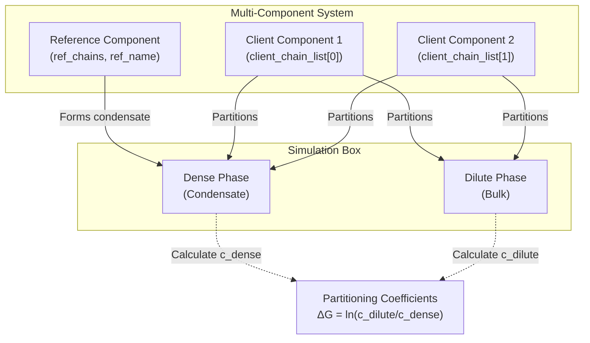
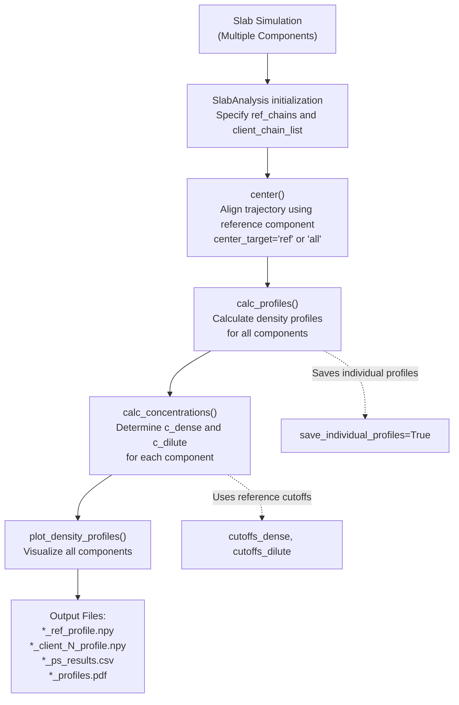
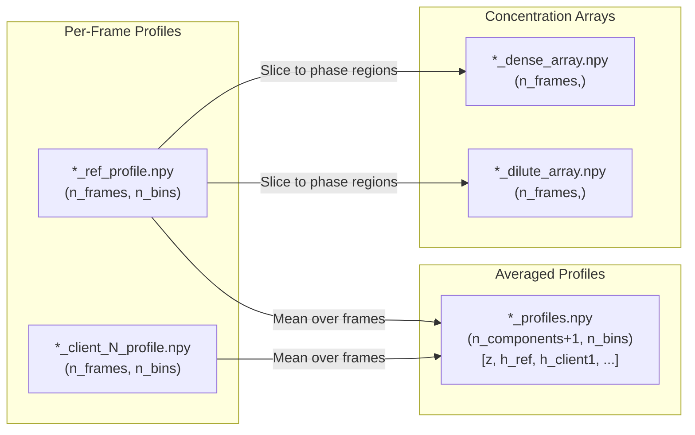
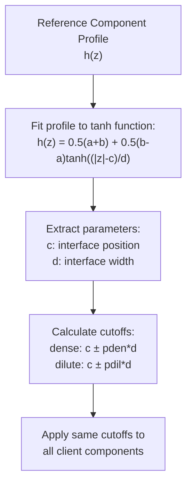

# Multi-Component Phase Separation

<details>
<summary>Relevant source files</summary>

The following files were used as context for generating this wiki page:

- [calvados/analysis.py](calvados/analysis.py)
- [examples/slab_IDR/prepare.py](examples/slab_IDR/prepare.py)
- [examples/slab_IDR_MDP/prepare.py](examples/slab_IDR_MDP/prepare.py)
- [examples/slab_IDR_PEG/prepare.py](examples/slab_IDR_PEG/prepare.py)
- [examples/slab_MDP/prepare.py](examples/slab_MDP/prepare.py)
- [examples/slab_mixed/prepare.py](examples/slab_mixed/prepare.py)

</details>


This page describes how to set up and analyze phase separation simulations with multiple molecular components in CALVADOS. Multi-component systems consist of a **reference component** (the primary condensate-forming molecule) and one or more **client components** (molecules whose partitioning behavior into the condensate is being studied).

For single-component phase separation simulations, see [Slab Simulation for Phase Separation](#7.3). For general analysis of phase separation, see [SlabAnalysis - Phase Separation Studies](#5.1).

## Overview

Multi-component phase separation simulations allow you to study:
- How client molecules partition between dense and dilute phases
- Preferential enrichment or exclusion of specific components
- Partitioning coefficients (ΔG values) for each component
- Competition between multiple species for condensate entry

The system uses slab geometry with molecules initially placed in a dense central region. During simulation, components can redistribute based on their interactions, allowing measurement of equilibrium concentrations in both phases.

**Sources:** [calvados/analysis.py:417-443]()

## Key Concepts

### Reference vs. Client Molecules



**Component Roles:**

| Component Type | Purpose | Chain Specification | Centering |
|----------------|---------|---------------------|-----------|
| **Reference** | Primary condensate former | `ref_chains=(first, last)` | Used for trajectory centering |
| **Client** | Test molecule partitioning | `client_chain_list=[(first, last), ...]` | Not used for centering |

**Sources:** [calvados/analysis.py:417-443](), [examples/slab_mixed/prepare.py:60-64]()

## SlabAnalysis Configuration for Multi-Component Systems

### Initialization Parameters

The `SlabAnalysis` class requires specification of reference and client components:

```python
SlabAnalysis(
    name='system_name',
    input_path='path/to/simulation',
    output_path='path/to/results',
    ref_chains=(0, 199),           # Reference chain indices (inclusive)
    ref_name='protein_name',        # Reference component name
    client_chain_list=[(200, 259)], # List of (first, last) tuples for clients
    client_names=['RNA'],           # Names for client components
    verbose=True
)
```

**Key Parameters:**

| Parameter | Type | Description |
|-----------|------|-------------|
| `ref_chains` | `tuple(int, int)` | Indices of first and last reference chains (0-based, inclusive) |
| `ref_name` | `str` | Name for reference component in output files |
| `client_chain_list` | `list[tuple]` | List of (first, last) chain index pairs for each client |
| `client_names` | `list[str]` | Names for client components (must match length of `client_chain_list`) |

**Sources:** [calvados/analysis.py:417-443](), [examples/slab_mixed/prepare.py:54-66]()

## Analysis Workflow



### Step-by-Step Analysis

#### 1. Center Trajectory

```python
slab.center(start=250, center_target='ref')
```

The `center_target` parameter determines which molecules are used for centering:
- `'ref'`: Center using only reference chains (recommended for multi-component systems)
- `'all'`: Center using all chains in the system

**Sources:** [calvados/analysis.py:456-512](), [examples/slab_mixed/prepare.py:67-70]()

#### 2. Calculate Density Profiles

```python
slab.calc_profiles(start=None, end=None, step=1, save_individual_profiles=True)
```

This method:
- Computes z-direction density profiles for reference and all clients
- Converts bead counts to molar concentrations (mM)
- Saves individual per-frame profiles if `save_individual_profiles=True`
- Saves trajectory-averaged profiles to `{name}_profiles.npy`

**Output Files:**
- `{name}_{ref_name}_profile.npy`: Per-frame reference profiles
- `{name}_{client_name}_profile.npy`: Per-frame client profiles  
- `{name}_profiles.npy`: All trajectory-averaged profiles

**Sources:** [calvados/analysis.py:514-577]()

#### 3. Calculate Concentrations

```python
slab.calc_concentrations(pden=2., pdil=8., dGmin=-10.)
```

This method:
- Uses reference component to determine dense/dilute phase boundaries
- Applies same boundaries to calculate client concentrations
- Computes partitioning coefficients: ΔG = ln(c_dilute / c_dense)
- Performs block error analysis for uncertainties

**Parameters:**

| Parameter | Default | Description |
|-----------|---------|-------------|
| `pden` | 2.0 | Number of interface widths inward from interface for dense phase |
| `pdil` | 8.0 | Number of interface widths outward from interface for dilute phase |
| `dGmin` | -10.0 | Minimum ΔG value for numerical stability |

**Sources:** [calvados/analysis.py:579-654]()

#### 4. Plot Profiles

```python
slab.plot_density_profiles()
```

Creates a publication-quality plot showing:
- All component density profiles on a single log-scale plot
- Vertical lines indicating dense/dilute phase boundaries
- Legend with component names

**Sources:** [calvados/analysis.py:656-679]()

## Configuration Patterns

### Example 1: Protein-RNA System

```python
# Two-component system: FUS-RGG3 protein + polyU40 RNA
components = Components(
    fresidues='residues_C2RNA.csv',
    ffasta='mix.fasta'
)

components.add(name='FUS-RGG3', molecule_type='protein', nmol=200, charge_termini='both')
components.add(name='polyU40', molecule_type='rna', nmol=60)
```

Analysis configuration:
```python
slab_analysis = SlabAnalysis(
    name='mixed_system',
    ref_chains=(0, 199),        # 200 protein chains: indices 0-199
    ref_name='FUS-RGG3',
    client_chain_list=[(200, 259)],  # 60 RNA chains: indices 200-259
    client_names=['polyU40']
)
```

**Sources:** [examples/slab_mixed/prepare.py:77-94](), [examples/slab_mixed/prepare.py:54-66]()

### Example 2: IDR with PEG Crowder

```python
# Two-component system: IDR protein + PEG crowder
components = Components(
    fresidues='residues_C2PEG.csv',
    ffasta='peg.fasta'
)

components.add(name='A1', molecule_type='protein', nmol=100)
components.add(name='PEG3000', molecule_type='crowder', nmol=N_PEG, charge_termini='none')
```

Analysis configuration:
```python
slab = SlabAnalysis(
    name=sysname,
    ref_name='A1', 
    ref_chains=(0, 99),                    # 100 protein chains
    client_names=['PEG3000'], 
    client_chain_list=[(100, 100+N_PEG-1)] # N_PEG crowder chains
)

slab.center(center_target='ref')  # Center only on protein, not crowder
```

**Sources:** [examples/slab_IDR_PEG/prepare.py:92-102](), [examples/slab_IDR_PEG/prepare.py:72-76]()

### Example 3: Two-Protein System (IDR + Structured)

```python
# Two-component system: Two different proteins
components = Components(
    fresidues='residues_CALVADOS3.csv',
    ffasta='idr.fasta',
    fdomains='domains.yaml',
    pdb_folder='input'
)

components.add(name='IDR_protein', restraint=False, nmol=100)  # IDR
components.add(name='Structured_protein', restraint=True, nmol=100)  # MDP
```

Analysis configuration:
```python
slab = SlabAnalysis(
    name=sysname,
    ref_name='IDR_protein',
    ref_chains=(0, 99),              # First 100 chains
    client_names=['Structured_protein'],
    client_chain_list=[(100, 199)]   # Second 100 chains
)
```

**Sources:** [examples/slab_IDR_MDP/prepare.py:75-97](), [examples/slab_IDR_MDP/prepare.py:52-55]()

## Output Data Structure

### Results DataFrame

The `calc_concentrations()` method produces a DataFrame saved as `{name}_ps_results.csv`:

| Column | Description | Units |
|--------|-------------|-------|
| `first_chain` | First chain index of component | index |
| `last_chain` | Last chain index of component | index |
| `cutoffs_dense_right` | Right dense phase boundary | nm |
| `cutoffs_dense_left` | Left dense phase boundary | nm |
| `cutoffs_dilute_right` | Right dilute phase boundary | nm |
| `cutoffs_dilute_left` | Left dilute phase boundary | nm |
| `c_dense` | Dense phase concentration | mM |
| `c_dense_err` | Dense phase concentration error | mM |
| `c_dilute` | Dilute phase concentration | mM |
| `c_dilute_err` | Dilute phase concentration error | mM |
| `dG` | Partitioning free energy | kT |
| `dG_err` | Partitioning free energy error | kT |

**Rows:** One row per component (`{name}_{ref_name}`, `{name}_{client_name}`, ...)

**Sources:** [calvados/analysis.py:586-616]()

### Profile Arrays



**Sources:** [calvados/analysis.py:545-575](), [calvados/analysis.py:609-615]()

## Phase Boundary Determination

The system uses hyperbolic tangent fitting to determine phase boundaries:



This ensures consistent phase definitions across all components in the system.

**Sources:** [calvados/analysis.py:757-772](), [calvados/analysis.py:628-636]()

## Partitioning Coefficient Calculation

For each component, the partitioning coefficient ΔG is calculated as:

**ΔG = ln(c_dilute / c_dense)**

Special cases handled:
- If `c_dilute = 0` and `c_dense > 0`: ΔG = dGmin (strong enrichment)
- If `c_dense = 0` and `c_dilute > 0`: ΔG = -dGmin (strong exclusion)
- If both are zero or NaN: ΔG = NaN (not converged)

Error propagation uses Monte Carlo sampling from normal distributions around measured concentrations.

**Sources:** [calvados/analysis.py:724-755]()

## Prepare Script Template

```python
from calvados.cfg import Config, Components
from calvados.analysis import SlabAnalysis

# Define system
config = Config(
    sysname='mixed_system',
    box=[15, 15, 80],
    topol='slab',
    slab_eq=True,
    steps_eq=100*N_save
)

# Define components
components = Components(fresidues='residues.csv')
components.add(name='reference', molecule_type='protein', nmol=200)
components.add(name='client', molecule_type='rna', nmol=60)

# Embedded analysis
analyses = f"""
from calvados.analysis import SlabAnalysis

slab = SlabAnalysis(
    name="{config.sysname}",
    input_path="{path}",
    output_path="{output_path}",
    ref_chains=(0, 199),
    ref_name='reference',
    client_chain_list=[(200, 259)],
    client_names=['client']
)

slab.center(start=250, center_target='ref')
slab.calc_profiles()
slab.calc_concentrations()
slab.plot_density_profiles()
"""

config.write(path, name='config.yaml', analyses=analyses)
components.write(path, name='components.yaml')
```

**Sources:** [examples/slab_mixed/prepare.py:1-95](), [examples/slab_IDR_PEG/prepare.py:1-103]()

## Common Workflows

### Multi-Chain Contact Analysis

For multi-component systems, you can calculate contact maps between different component types:

```python
from calvados.analysis import calc_com_traj, calc_contact_map

# Calculate center-of-mass trajectories
chainid_dict = {
    'protein': (0, 99),
    'RNA': (100, 159)
}
calc_com_traj(path=path, sysname=sysname, output_path=output_path, 
              residues_file=residues_file, chainid_dict=chainid_dict)

# Calculate heterotypic contact map (protein-RNA)
calc_contact_map(path=path, sysname=sysname, output_path=output_path,
                chainid_dict=chainid_dict, is_slab=True)

# Calculate homotypic contact map (protein-protein)
chainid_dict_homo = {'protein': (0, 99)}
calc_contact_map(path=path, sysname=sysname, output_path=output_path,
                chainid_dict=chainid_dict_homo, is_slab=True)
```

The `is_slab=True` parameter restricts contact calculations to chains in the dense phase.

**Sources:** [calvados/analysis.py:793-878](), [calvados/analysis.py:879-970](), [examples/slab_IDR_MDP/prepare.py:63-70]()

### Phase-Specific Structural Properties

You can analyze structural properties (Rg) separately for dense and dilute phases:

```python
# After running SlabAnalysis and calc_com_traj
import numpy as np

# Load phase-separated Rg data
rg_dense = np.load(f'{output_path}/{sysname}_protein_rg_dense.npy')
rg_dilute = np.load(f'{output_path}/{sysname}_protein_rg_dilute.npy')

print(f"Rg (dense):  {rg_dense.mean():.2f} ± {rg_dense.std():.2f} nm")
print(f"Rg (dilute): {rg_dilute.mean():.2f} ± {rg_dilute.std():.2f} nm")
```

**Sources:** [calvados/analysis.py:928-946]()

## Best Practices

1. **Chain Ordering**: Always place reference component chains first in the system, followed by client chains in order
2. **Centering**: Use `center_target='ref'` when studying client partitioning to avoid artificial effects from client motion
3. **Equilibration**: Ensure sufficient equilibration frames (typically 100-500) before starting analysis
4. **Error Analysis**: The system uses block averaging for concentration errors; ensure trajectories are long enough for convergence
5. **Multiple Clients**: You can study arbitrarily many client components; just extend `client_chain_list` and `client_names`

**Sources:** [calvados/analysis.py:456-478](), [examples/slab_mixed/prepare.py:67-73]()

---