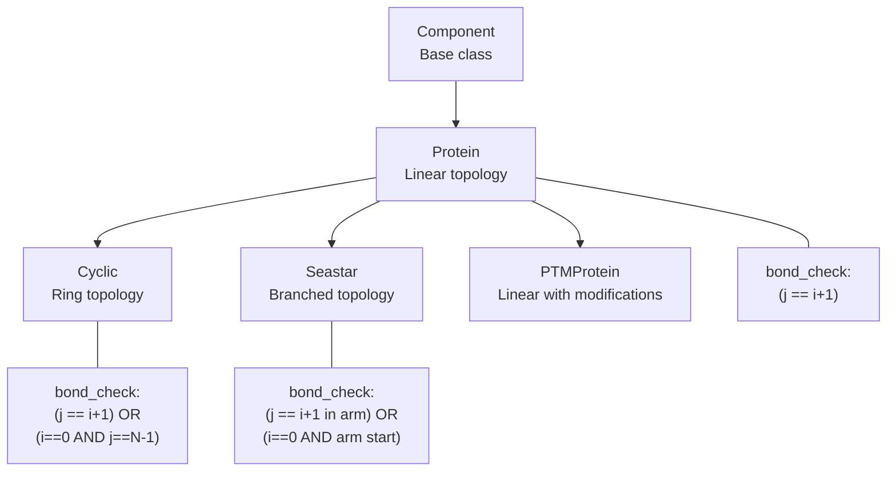
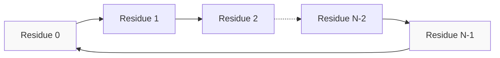
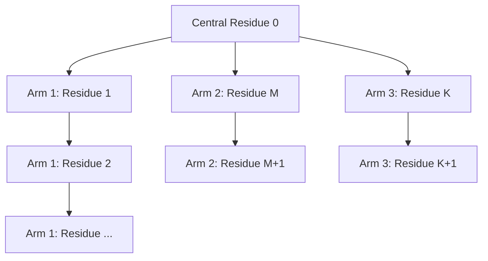
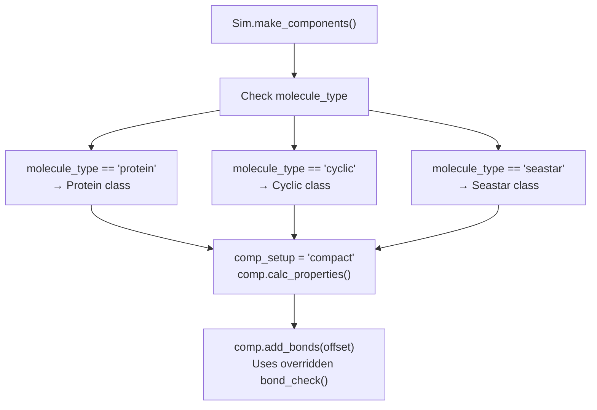
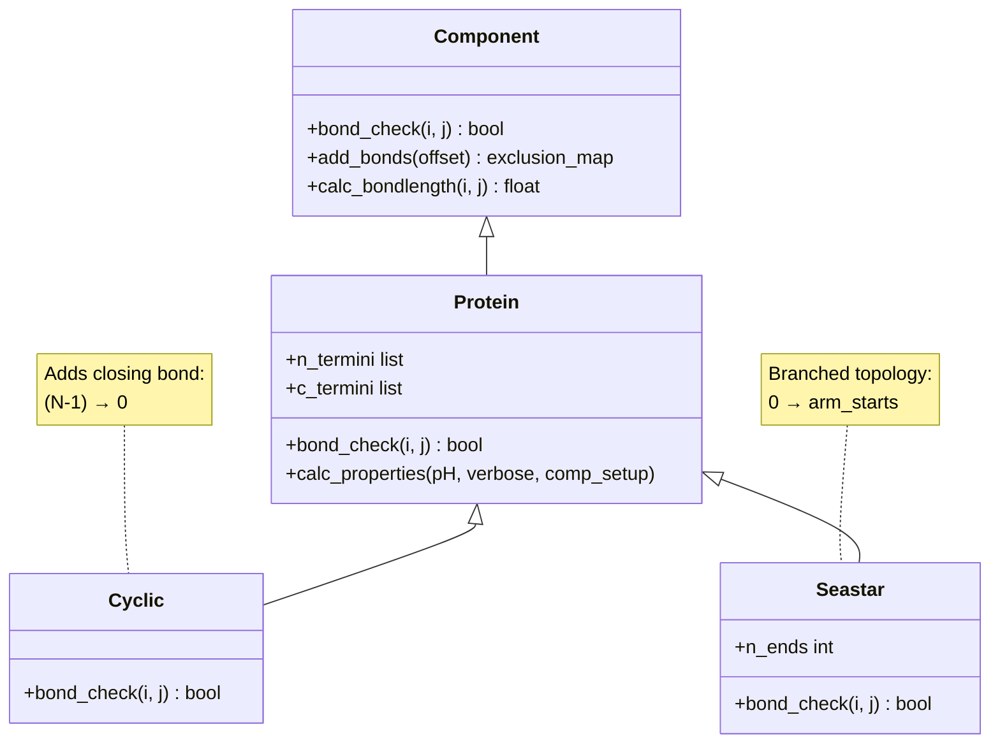

# Cyclic & Branched Peptides

<details>
<summary>Relevant source files</summary>

The following files were used as context for generating this wiki page:

- [calvados/components.py](calvados/components.py)
- [calvados/sim.py](calvados/sim.py)

</details>


This page documents CALVADOS support for non-linear peptide topologies through the `Cyclic` and `Seastar` component classes. These specialized protein components enable simulation of cyclic peptides (closed ring structures) and branched peptides (star-like architectures with multiple arms extending from a central core).

For standard linear protein simulations, see [Protein Components](#3.2). For general component architecture, see [Component Class Hierarchy](#3.1).

---

## Overview

CALVADOS provides two specialized component classes for non-linear peptide topologies:

| Component Class | Topology | Bond Pattern | Typical Use Case |
|----------------|----------|--------------|------------------|
| `Protein` | Linear chain | Sequential (i, i+1) | Standard proteins and IDRs |
| `Cyclic` | Closed ring | Sequential + (N-1, 0) closing bond | Cyclic peptides, macrocycles |
| `Seastar` | Branched star | Central hub with multiple arms | Dendrimers, branched polymers |

All three classes share the same underlying physics (Ashbaugh-Hatch, Yukawa electrostatics, restraints) and differ only in their bonding topology.

**Sources:** [calvados/components.py:109-299](), [calvados/components.py:678-713]()

---

## Component Hierarchy



**Diagram 1:** Inheritance hierarchy showing `Cyclic` and `Seastar` as specializations of `Protein` with modified bonding logic.

**Sources:** [calvados/components.py:109-114](), [calvados/components.py:678-713]()

---

## Cyclic Class

### Implementation

The `Cyclic` class creates closed-ring peptide topologies by adding a bond between the C-terminus and N-terminus of the sequence.



**Diagram 2:** Cyclic peptide bonding pattern. The dashed arrow indicates continuation of the chain, and the final bond closes the ring.

**Sources:** [calvados/components.py:678-690]()

### Bond Check Logic

The `bond_check` method determines which residue pairs are bonded:

```python
def bond_check(self, i: int, j: int):
    """ Define bonded term conditions. """
    
    condition0 = (j == i+1)                          # Sequential bonds
    condition1 = ((j == self.nbeads - 1) and i == 0) # Closing bond
    condition = condition0 or condition1
    return condition
```

**Key features:**
- Condition 0: Normal sequential bonding (i → i+1)
- Condition 1: Closing bond connecting last residue (N-1) back to first residue (0)
- No terminal charge modifications (no free N/C termini in a ring)

**Sources:** [calvados/components.py:684-690]()

### Usage in Simulations

To use cyclic peptides in a simulation:

**In `components.yaml`:**
```yaml
system:
  my_cyclic:
    molecule_type: cyclic
    nmol: 10
    ffasta: sequences.fasta
    fresidues: residues_CALVADOS2.csv
    restraint: false
```

**In `prepare.py`:**
```python
from calvados.cfg import Config, Components

comp = Components()
comp.add_component('my_cyclic', 
                   molecule_type='cyclic',
                   nmol=10,
                   ffasta='sequences.fasta',
                   fresidues='residues_CALVADOS2.csv',
                   restraint=False)
```

The simulation engine automatically recognizes `molecule_type: cyclic` and instantiates the `Cyclic` class with `comp_setup='compact'` for initial placement.

**Sources:** [calvados/sim.py:72-74](), [calvados/sim.py:50-98]()

---

## Seastar Class

### Implementation

The `Seastar` class creates branched peptides with multiple arms extending from a central residue (index 0). The `n_ends` parameter specifies the number of arms.



**Diagram 3:** Seastar branched peptide topology with three arms emanating from a central residue.

**Sources:** [calvados/components.py:692-713]()

### Bond Check Logic

The branching logic depends on the `n_ends` parameter:

```python
def bond_check(self, i: int, j: int):
    """ Define bonded term conditions. """
    
    if self.n_ends in [0,1,2]:
        return super().bond_check(i,j)  # Fallback to linear for ≤2 arms
    else:
        if (self.nbeads-1) % self.n_ends == 0:
            branch_length = int((self.nbeads-1) / self.n_ends)
        else:
            branch_length = int((self.nbeads-1) / self.n_ends) + 1
        
        condition0 = (j == i+1) and ((j-1) % branch_length != 0)  # Within-arm bonds
        condition1 = (i == 0) and ((j-1) % branch_length == 0)   # Center-to-arm bonds
        
        condition = condition0 or condition1
        return condition
```

**Branching algorithm:**
1. Calculate `branch_length = (nbeads - 1) / n_ends`
2. Residue 0 is the central hub
3. Each arm starts at positions: `1, branch_length+1, 2*branch_length+1, ...`
4. Within-arm bonds: sequential along each arm
5. Hub bonds: center (i=0) connects to start of each arm

**Sources:** [calvados/components.py:698-713]()

### Example: Three-Arm Seastar

For a 13-residue peptide with `n_ends=3`:
- Central residue: 0
- Branch length: (13-1)/3 = 4
- Arm 1: residues 1, 2, 3, 4
- Arm 2: residues 5, 6, 7, 8
- Arm 3: residues 9, 10, 11, 12

**Bond list:**
- Hub bonds: (0,1), (0,5), (0,9)
- Arm 1 bonds: (1,2), (2,3), (3,4)
- Arm 2 bonds: (5,6), (6,7), (7,8)
- Arm 3 bonds: (9,10), (10,11), (11,12)

**Sources:** [calvados/components.py:704-713]()

### Usage in Simulations

**In `components.yaml`:**
```yaml
system:
  branched_idr:
    molecule_type: seastar
    n_ends: 4              # Four arms
    nmol: 5
    ffasta: sequences.fasta
    fresidues: residues_CALVADOS2.csv
    restraint: false
```

The `n_ends` parameter is required for `seastar` components and must be ≥3 (otherwise it behaves as linear).

**Sources:** [calvados/sim.py:75-77](), [calvados/components.py:701-713]()

---

## System Building and Placement

### Recognition in Sim Class

The simulation engine recognizes cyclic and branched topologies through the `molecule_type` field:



**Diagram 4:** Flow chart showing how `Cyclic` and `Seastar` components are instantiated and processed during system building.

**Sources:** [calvados/sim.py:50-98](), [calvados/sim.py:130-223]()

### Initial Placement

Both cyclic and branched peptides use `comp_setup='compact'` by default:

| Topology | Placement Strategy | Implementation |
|----------|-------------------|----------------|
| `center` | Single molecule at box center | Used for single-chain studies |
| `grid` | Uniform grid spacing | Used for multi-molecule systems |
| `slab` | Within slab region | Used for phase separation |
| `random` | Random non-overlapping | Fallback for complex setups |

The `compact` setup for initial coordinates uses `build.build_compact()` which places beads in a roughly spherical arrangement, appropriate for both ring and branched topologies.

**Sources:** [calvados/sim.py:58-80](), [calvados/components.py:63-70]()

---

## Bonding and Exclusions

### Bond Force Addition

When bonds are added to the OpenMM system, the overridden `bond_check()` method determines the connectivity:

```mermaid
graph LR
    AddBonds["comp.add_bonds(offset)"]
    LoopPairs["Loop over (i,j) pairs"]
    BondCheck["comp.bond_check(i,j)"]
    
    CalcLength["calc_bondlength(i,j)"]
    AddForce["hb.addBond(i, j, d, kb)"]
    Exclude["Add to exclusion_map"]
    
    AddBonds --> LoopPairs
    LoopPairs --> BondCheck
    BondCheck -->|"True"| CalcLength
    CalcLength --> AddForce
    AddForce --> Exclude
    BondCheck -->|"False"| LoopPairs
```



**Diagram 5:** Bond addition workflow. The topology-specific `bond_check()` determines which pairs are bonded, then standard protein logic applies.

**Sources:** [calvados/components.py:85-96](), [calvados/components.py:218-229]()

### Non-Bonded Exclusions

Bonded pairs are automatically excluded from Ashbaugh-Hatch and Yukawa interactions to avoid double-counting:

```python
def add_bonds(self, comp, offset):
    """ Add bond forces. """
    
    exclusion_map = comp.add_bonds(offset)
    self.add_exclusions(exclusion_map)  # Exclude from ah, yu
```

This applies equally to linear, cyclic, and branched topologies.

**Sources:** [calvados/sim.py:338-342](), [calvados/sim.py:369-376]()

---

## Compatibility with Other Features

### Restraints

Both `Cyclic` and `Seastar` inherit full restraint functionality from `Protein`:

| Feature | Cyclic | Seastar | Notes |
|---------|--------|---------|-------|
| `restraint=true` | ✓ | ✓ | Requires PDB input |
| Harmonic restraints | ✓ | ✓ | Uses `domains.yaml` |
| Go-model restraints | ✓ | ✓ | Requires PDB + PAE JSON |
| AlphaFold confidence | ✓ | ✓ | Scales restraint strength |

The restraint logic in `add_restraints()` is topology-agnostic and works on distance maps.

**Sources:** [calvados/components.py:231-272](), [calvados/components.py:179-186]()

### Terminal Charges

**Important:** The `Cyclic` class does not call `patch_terminal_qs()` because rings have no termini. The `Seastar` class inherits terminal charge patching, applying it to:
- Central residue (index 0): treated as N-terminus
- Last residue in sequence: treated as C-terminus
- Arm endpoints are NOT charged (only bonded termini get charges)

**Sources:** [calvados/components.py:168-177]()

### Sequence Analysis

Sequence-derived properties (charges, hydropathy, etc.) are calculated identically for all topologies. The topology only affects bonding, not amino acid properties.

**Sources:** [calvados/components.py:43-55](), [calvados/sequence.py]() (referenced)

---

## Practical Considerations

### Sequence Design

**For Cyclic Peptides:**
- Sequence in FASTA file represents the ring starting from an arbitrary residue
- No special markers needed for ring closure
- Total charge should account for absence of terminal charges

**For Seastar Peptides:**
- First residue in FASTA is the central hub
- Remaining residues divided equally among arms
- If `(nbeads-1) % n_ends != 0`, some arms are longer by one residue

### Visualization

When viewing trajectories, cyclic and branched topologies are represented in the PDB topology file generated by `build_system()`:

- `top.pdb`: Contains bonds as CONECT records
- MDTraj topology: Includes bond information for visualization
- VMD/PyMOL will display bonds according to topology

**Sources:** [calvados/sim.py:217-220](), [calvados/sim.py:431-454]()

---

## Code Implementation Summary



**Diagram 6:** Class diagram summarizing the implementation. Only `bond_check()` differs between classes; all other functionality is inherited.

**Sources:** [calvados/components.py:11-96](), [calvados/components.py:109-229](), [calvados/components.py:678-713]()

---

## Example Workflow

**Step 1: Prepare sequence file (sequences.fasta)**
```fasta
>cyclic_peptide
GRGDSPK
>branched_peptide
KAAAAAAAAAAAAAA
```

**Step 2: Create configuration (prepare.py)**
```python
from calvados.cfg import Config, Components

# Cyclic peptide (7 residues, ring)
comp = Components()
comp.add_component('cyclic_peptide',
                   molecule_type='cyclic',
                   nmol=20,
                   ffasta='sequences.fasta',
                   fresidues='residues_CALVADOS2.csv')

# Branched peptide (15 residues, 3 arms of 4-5 residues each)
comp.add_component('branched_peptide',
                   molecule_type='seastar',
                   n_ends=4,
                   nmol=10,
                   ffasta='sequences.fasta',
                   fresidues='residues_CALVADOS2.csv')

comp.write('components.yaml')
```

**Step 3: Run simulation**
```bash
python prepare.py
python -m calvados.sim
```

The simulation will generate:
- `bonds_cyclic_peptide.txt`: Shows closing bond (6 → 0)
- `bonds_branched_peptide.txt`: Shows hub bonds (0 → 1, 0 → 5, 0 → 9, 0 → 13)

**Sources:** [calvados/components.py:101-107](), [calvados/sim.py:640-650]()

---

## Technical Notes

### Performance

Cyclic and branched topologies have the same computational cost as linear chains of equivalent length. The only difference is in the bond list, which is negligible compared to non-bonded force calculations.

### Limitations

1. **Restraints:** Go-model restraints are based on PDB distances, which may not correctly represent ring strain or branch points in AlphaFold predictions
2. **Termini:** `Seastar` applies terminal charges only to the sequence endpoints (residue 0 and N-1), not to arm endpoints
3. **Branching:** Only star topologies (all arms from one center) are supported; arbitrary branching requires custom component implementation

**Sources:** [calvados/components.py:698-713](), [calvados/components.py:168-177]()

---

**Key Files:**
- [calvados/components.py:678-713](): `Cyclic` and `Seastar` class definitions
- [calvados/sim.py:50-98](): Component instantiation logic
- [calvados/sim.py:338-356](): Bond addition and exclusion management
- [calvados/interactions.py](): Force initialization (referenced, not modified for topologies)

---