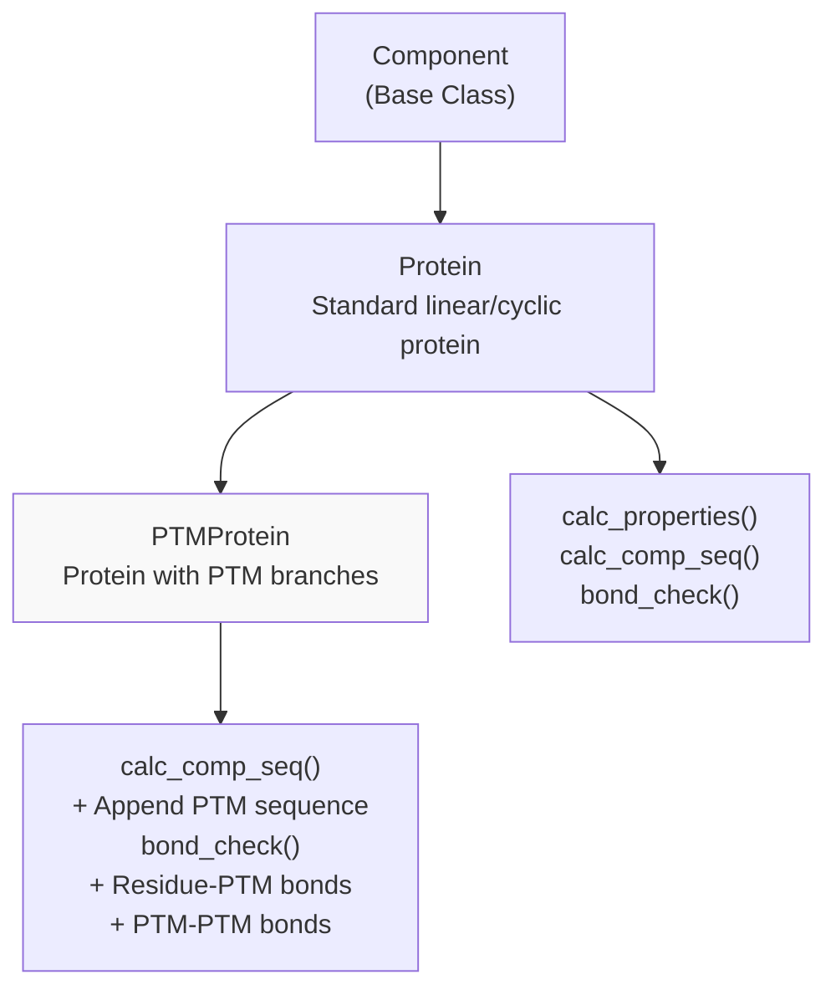
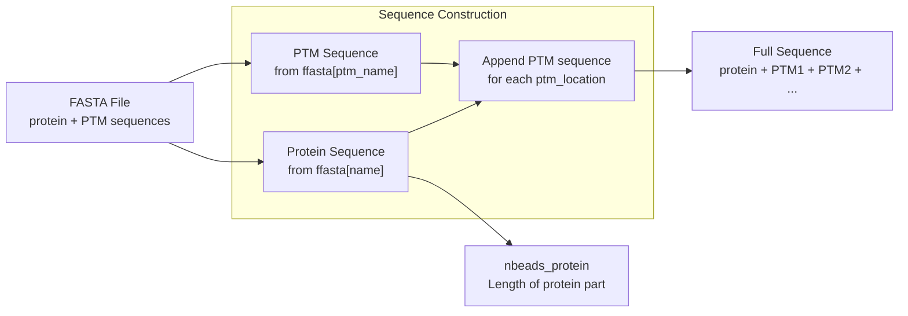
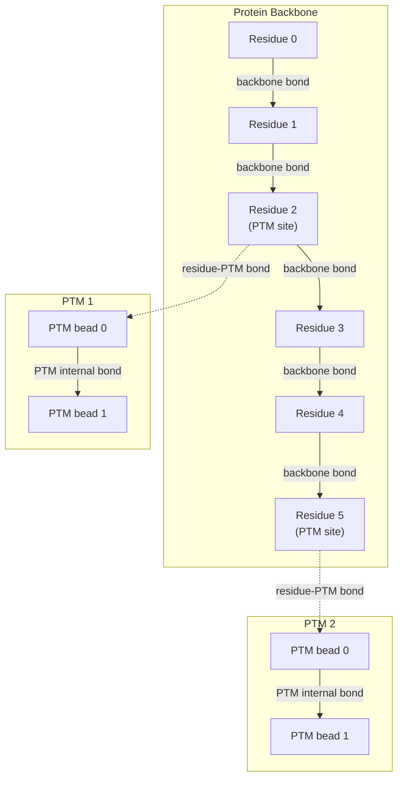
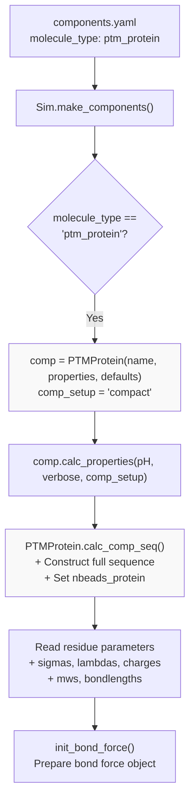
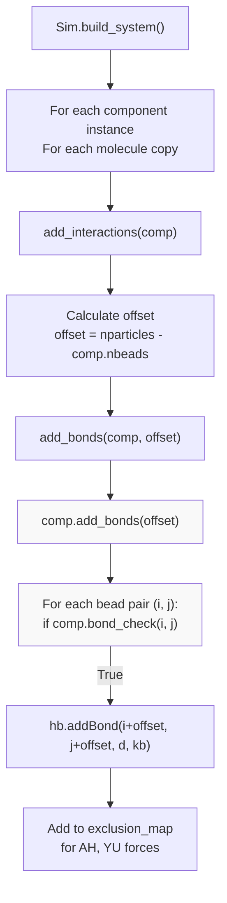

# Post-Translational Modifications

<details>
<summary>Relevant source files</summary>

The following files were used as context for generating this wiki page:

- [calvados/components.py](calvados/components.py)
- [calvados/data/default_component.yaml](calvados/data/default_component.yaml)
- [calvados/sim.py](calvados/sim.py)

</details>


## Purpose and Scope

This page documents the modeling of post-translational modifications (PTMs) in CALVADOS using the `PTMProtein` class. PTMs are chemical modifications to amino acid residues that occur after translation, such as phosphorylation, acetylation, methylation, ubiquitination, and glycosylation. These modifications can significantly alter protein behavior, including charge state, hydrophobicity, and interaction propensities.

The `PTMProtein` class enables simulations where PTM groups are represented as additional beads attached to specific residue positions on a protein backbone. For pH-dependent charge modifications like phosphorylation, see [pH-Dependent Simulations & Phosphorylation](#6.2), which uses the `pCALVADOS2` force field to dynamically adjust residue charges rather than adding explicit PTM beads.

**Sources:** [calvados/components.py:715-754]()

---

## PTMProtein Class Architecture

The `PTMProtein` class inherits from the `Protein` class and extends it to support branched topologies where PTM beads are grafted onto the protein backbone.



**Key Characteristics:**

| Aspect | Implementation |
|--------|----------------|
| **Inheritance** | Extends `Protein` class |
| **Topology** | Branched - PTMs attached to backbone residues |
| **Sequence Construction** | Protein sequence + concatenated PTM sequences |
| **Bonding** | Backbone bonds + residue-PTM bonds + PTM internal bonds |
| **Molecule Type** | `'ptm_protein'` in configuration |

**Sources:** [calvados/components.py:715-720](), [calvados/sim.py:78-80]()

---

## Sequence Construction

The `PTMProtein.calc_comp_seq()` method constructs the full system sequence by appending PTM sequences to the protein sequence.



**Sequence Assembly Algorithm** ([calvados/components.py:721-733]()):

1. Read protein sequence from FASTA file using `self.name` key
2. Store protein length as `self.nbeads_protein`
3. Read PTM sequence from FASTA file using `self.ptm_name` key
4. For each entry in `self.ptm_locations`:
   - Append the entire PTM sequence to the protein sequence
5. Set termini: N-terminus at position 0, C-terminus at final position

**Example Sequence Construction:**

```
Protein sequence: MKLAVR (6 residues)
PTM sequence: GG (2 residues, e.g., ubiquitin stub)
ptm_locations: [2, 5] (1-based, attach to K at position 2 and R at position 5)

Final sequence: MKLAVR GG GG (10 beads total)
                ^^^^^^ ^^ ^^
                protein PTM1 PTM2
                (beads 0-5) (6-7) (8-9)
```

**Sources:** [calvados/components.py:721-733]()

---

## Bonding Topology

The `PTMProtein.bond_check()` method defines three types of bonds in the system:



### Bond Type 1: Residue-Residue Bonds (Backbone)

Bonds between consecutive residues in the protein portion:

```python
if (i < self.nbeads_protein - 1) and (j == i+1):
    return True
```

**Condition:** Residue `i` and `i+1` are both within the protein portion (0 to `nbeads_protein-1`).

### Bond Type 2: Residue-PTM Bonds

Bonds connecting protein backbone residues to PTM attachment points:

```python
for idx, ptm_loc in enumerate(self.ptm_locations):
    ptm_seqloc = self.nbeads_protein + idx * len(self.ptm_seq)
    if (i == ptm_loc - 1) and (j == ptm_seqloc):
        return True
```

**Condition:** Residue `i` is at a PTM attachment site (`ptm_loc - 1`, converting from 1-based to 0-based), and `j` is the first bead of the corresponding PTM sequence.

### Bond Type 3: PTM Internal Bonds

Bonds between beads within a single PTM molecule:

```python
if i >= self.nbeads_protein:
    if (j == i+1) and (j not in ptm_seqlocs):
        return True
```

**Condition:** Both beads are in the PTM region (`i >= nbeads_protein`), are consecutive (`j == i+1`), and `j` is not the start of a different PTM (to prevent bonding between separate PTM molecules).

**Sources:** [calvados/components.py:735-754]()

---

## Configuration Parameters

PTM simulations require specific configuration in the `components.yaml` file:

### Required Parameters

| Parameter | Type | Description | Example |
|-----------|------|-------------|---------|
| `molecule_type` | string | Must be `'ptm_protein'` | `'ptm_protein'` |
| `ptm_name` | string | Key to identify PTM sequence in FASTA | `'ubiquitin'` |
| `ptm_locations` | list[int] | 1-based residue positions for PTM attachment | `[12, 45, 78]` |
| `ffasta` | string | Path to FASTA file containing both protein and PTM sequences | `'sequences.fasta'` |

### Default Parameters

The following defaults are defined in [calvados/data/default_component.yaml:36-37]():

```yaml
ptm_name: 'example_ptm'
ptm_locations: []
```

### Example Configuration

```yaml
system:
  myprotein:
    molecule_type: ptm_protein
    nmol: 1
    ffasta: 'sequences.fasta'
    ptm_name: 'ubiquitin'
    ptm_locations: [15, 48]  # Attach ubiquitin to K15 and K48 (1-based)
    fresidues: 'residues_CALVADOS2.csv'
    kb: 8033.0
    restraint: false
```

**Sources:** [calvados/data/default_component.yaml:36-37](), [calvados/sim.py:78-80]()

---

## FASTA File Format

The FASTA file must contain both the protein sequence and the PTM sequence as separate entries:

```
>myprotein
MKLAVRKSPQDEALMKLAVRKSPQDEALMKLAVRKSPQDEALMKLAVRKSPQDEAL

>ubiquitin
MQIFVKTLTGKTITLEVEPSDTIENVKAKIQDKEGIPPDQQRLIFAGKQLEDGRTLSDYNIQKESTLHLVLRLRGG
```

The `ptm_name` parameter identifies which FASTA entry to use for the PTM sequence.

**Sources:** [calvados/components.py:724-727]()

---

## Component Instantiation Flow



**Sources:** [calvados/sim.py:50-98](), [calvados/components.py:168-188]()

---

## Bond Addition During System Building

When the system is built, bonds are added through the following process:



The `bond_check()` method of `PTMProtein` determines which bead pairs should have bonds, implementing the three bond types described earlier.

**Sources:** [calvados/sim.py:378-423](), [calvados/components.py:85-96](), [calvados/components.py:735-754]()

---

## Practical Workflow Example

### Step 1: Prepare FASTA File

Create `sequences.fasta` with protein and PTM sequences:

```
>myIDR
MSRGGGGGEGGGGGGERGGSRGGGGGEGGGGGGERGGSRGGGGGEGGGGGGERGGG

>poly_S
SSSSSS
```

### Step 2: Create Components Configuration

In `components.yaml`:

```yaml
defaults:
  molecule_type: protein
  fresidues: residues_CALVADOS2.csv
  ffasta: sequences.fasta
  kb: 8033.0
  restraint: false

system:
  myIDR:
    molecule_type: ptm_protein
    nmol: 1
    ptm_name: poly_S
    ptm_locations: [10, 20, 30]  # Attach poly_S at positions 10, 20, 30
```

### Step 3: Verify Sequence Construction

The resulting sequence will be:

- Beads 0-56: `myIDR` protein sequence (57 residues)
- Beads 57-62: First `poly_S` PTM (6 residues)
- Beads 63-68: Second `poly_S` PTM (6 residues)
- Beads 69-74: Third `poly_S` PTM (6 residues)

Total: 75 beads

### Step 4: Verify Bonding Topology

- Backbone bonds: 0-1, 1-2, ..., 55-56 (56 bonds)
- Residue-PTM bonds: 9-57, 19-63, 29-69 (3 bonds, 1-based positions minus 1)
- PTM internal bonds: 57-58, 58-59, ..., 73-74 (18 bonds, 6 per PTM minus 1)

Total bonds: 56 + 3 + 18 = 77 bonds

**Sources:** [calvados/components.py:721-754]()

---

## Key Design Considerations

### Bead Indexing

- **Protein beads:** Indices 0 to `nbeads_protein - 1`
- **PTM beads:** Indices `nbeads_protein` and above
- The `nbeads_protein` attribute is critical for distinguishing protein from PTM beads in `bond_check()`

### PTM Location Format

- `ptm_locations` uses **1-based indexing** (matching biological convention)
- Internally converted to 0-based: `ptm_loc - 1` in [calvados/components.py:747]()

### Multiple PTMs

- Each PTM in `ptm_locations` gets a full copy of the PTM sequence
- PTMs are prevented from bonding to each other by checking `j not in ptm_seqlocs`
- The order in `ptm_locations` determines the order of PTM sequences in the full sequence

### Force Field Parameters

PTM residues must be defined in the residues CSV file (e.g., `residues_CALVADOS2.csv`) with their own `sigmas`, `lambdas`, `q`, `MW`, and `bondlength` values. Custom residue types can be created to represent modified amino acids.

**Sources:** [calvados/components.py:735-754](), [calvados/components.py:26-30]()

---