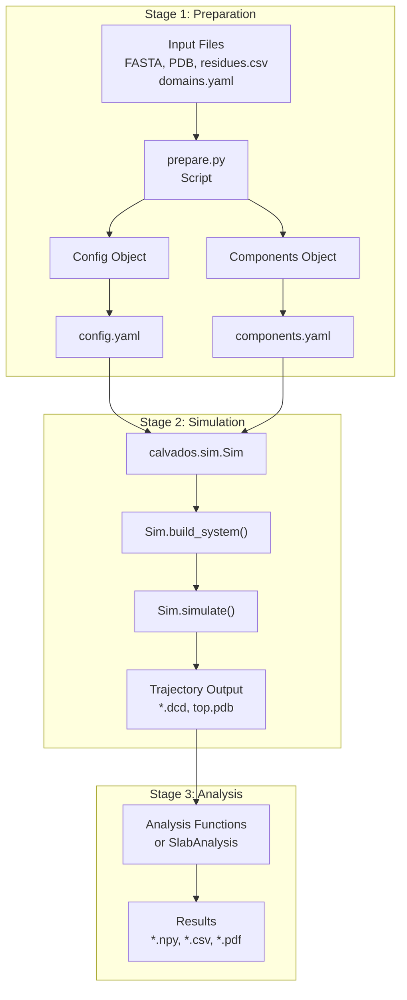
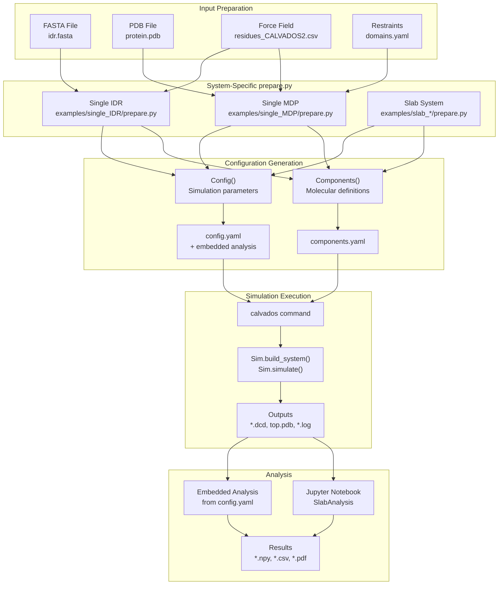

# Example Workflows

<details>
<summary>Relevant source files</summary>

The following files were used as context for generating this wiki page:

- [examples/single_IDR/prepare.py](examples/single_IDR/prepare.py)
- [examples/single_MDP/prepare.py](examples/single_MDP/prepare.py)
- [examples/slab_mixed/example_slab_analysis.ipynb](examples/slab_mixed/example_slab_analysis.ipynb)

</details>


## Purpose and Scope

This section provides step-by-step tutorials demonstrating common CALVADOS simulation and analysis workflows. Each example illustrates best practices for preparing simulations, running molecular dynamics, and analyzing results for different molecular systems and research questions.

These examples demonstrate the complete workflow from input data to analyzed results. For detailed documentation of individual components, see [Simulation Setup & Configuration](#2) and [Trajectory Analysis](#5). For reference material on configuration parameters, see [Reference](#9).

## Overview of CALVADOS Workflow Pattern

All CALVADOS simulations follow a consistent three-stage workflow:



**Sources:** [examples/single_IDR/prepare.py:1-73](), [examples/single_MDP/prepare.py:1-80]()

## Common Preparation Script Structure

All `prepare.py` scripts follow a standard pattern with four main sections:

### 1. Command-Line Arguments and Paths

```python
parser = ArgumentParser()
parser.add_argument('--name', nargs='?', required=True, type=str)
args = parser.parse_args()

cwd = os.getcwd()
sysname = f'{args.name:s}'
path = f'{cwd}/{sysname:s}'
```

The `--name` argument specifies the system name used for output directories and file naming.

**Sources:** [examples/single_IDR/prepare.py:8-13](), [examples/single_MDP/prepare.py:8-13]()

### 2. Config Object - Simulation Parameters

```python
config = Config(
    sysname = sysname,
    box = [L, L, L],  # nm
    temp = 293,       # K
    ionic = 0.19,     # molar
    pH = 7.0,
    topol = 'center',
    wfreq = N_save,
    steps = N_frames * N_save,
    platform = 'CPU',
    restart = 'checkpoint',
    frestart = 'restart.chk',
)
```

Key parameters:
- `box`: Simulation box dimensions in nanometers
- `temp`: Temperature in Kelvin
- `ionic`: Ionic strength in molar
- `topol`: Initial molecule placement strategy
- `wfreq`: DCD frame writing frequency (in integration steps)
- `steps`: Total number of integration steps (1 step = 10 fs)

**Sources:** [examples/single_IDR/prepare.py:26-43](), [examples/single_MDP/prepare.py:26-44]()

### 3. Embedded Analysis (Optional)

```python
analyses = f"""
from calvados.analysis import save_conf_prop

save_conf_prop(
    path="{path:s}",
    name="{sysname:s}",
    residues_file="{residues_file:s}",
    output_path="data",
    start=10,
    is_idr=True,
    select='all'
)
"""
config.write(path, name='config.yaml', analyses=analyses)
```

The `analyses` string contains Python code executed after simulation completion. This implements the **deferred execution pattern** where analysis is specified at preparation time but runs post-simulation.

**Sources:** [examples/single_IDR/prepare.py:50-57](), [examples/single_MDP/prepare.py:51-58]()

### 4. Components Object - Molecular Definitions

```python
components = Components(
    molecule_type = 'protein',
    nmol = 1,
    restraint = False,
    charge_termini = 'both',
    fresidues = residues_file,
    ffasta = f'{cwd}/input/idr.fasta',
)
components.add(name=args.name)
components.write(path, name='components.yaml')
```

The `Components` object defines molecular properties and input files. Different molecule types require different input files (FASTA for IDRs, PDB for structured proteins).

**Sources:** [examples/single_IDR/prepare.py:59-73](), [examples/single_MDP/prepare.py:60-78]()

## Workflow Comparison Table

| Workflow Type | Force Field | Input Files | Restraints | Typical Use Case |
|---------------|-------------|-------------|------------|------------------|
| Single IDR | CALVADOS2 | FASTA | None | Conformational ensembles of disordered proteins |
| Single MDP | CALVADOS3 | PDB, domains.yaml | Harmonic or Go-model | Structured protein dynamics with domain flexibility |
| Slab System | CALVADOS2/3 | Multiple FASTA/PDB | Optional | Liquid-liquid phase separation studies |
| Protein-RNA | C2RNA | FASTA (protein + RNA) | Optional | Protein-RNA condensate formation |
| Crowded Systems | CALVADOS2/3 | FASTA + crowder | None | Effects of macromolecular crowding |

**Sources:** [examples/single_IDR/prepare.py:24](), [examples/single_MDP/prepare.py:24]()

## Running Simulations

After preparation, simulations are executed using the `calvados` command-line tool:

```bash
cd <sysname>
calvados
```

This command:
1. Reads `config.yaml` and `components.yaml`
2. Instantiates `Sim` object
3. Calls `Sim.build_system()` to construct OpenMM system
4. Calls `Sim.simulate()` to run molecular dynamics
5. Executes embedded analysis code if present

The simulation produces:
- `top.pdb`: System topology file
- `<sysname>.dcd`: Binary trajectory file
- `<sysname>.log`: Energy and state information
- `restart.chk`: Checkpoint file for restart capability

**Sources:** Referenced in architecture diagrams

## Analysis Workflow Overview

Analysis can be performed in two ways:

### Embedded Analysis
Analysis code embedded in `config.yaml` executes automatically after simulation:

```python
analyses = f"""
from calvados.analysis import save_conf_prop
save_conf_prop(path="{path}", name="{sysname}", ...)
"""
```

**Sources:** [examples/single_IDR/prepare.py:50-55]()

### Post-hoc Analysis
Jupyter notebooks or scripts analyze trajectories separately:

```python
slab = cal.analysis.SlabAnalysis(
    name = name,
    input_path = 'mixed_system',
    output_path = 'data',
    ref_name = ref_name,
    ref_chains = ref_chains,
    client_chain_list = client_chain_list,
    client_names = client_names,
)
slab.center(start=250, step=1)
slab.calc_profiles()
slab.calc_concentrations()
slab.plot_density_profiles()
```

**Sources:** [examples/slab_mixed/example_slab_analysis.ipynb:25-90]()

## Example Workflow Diagram



**Sources:** [examples/single_IDR/prepare.py:1-73](), [examples/single_MDP/prepare.py:1-80](), [examples/slab_mixed/example_slab_analysis.ipynb:1-130]()

## Key Parameter Choices

### Box Size Selection

| System Type | Typical Box Size | Rationale |
|-------------|------------------|-----------|
| Single IDR | 50 nm | Sufficient for single chain conformational sampling |
| Single MDP | 100-150 nm | Larger for structured proteins with domains |
| Slab System | 100+ nm x-y, 200+ nm z | Extended z-dimension for phase separation |

**Sources:** [examples/single_IDR/prepare.py:16](), [examples/single_MDP/prepare.py:16]()

### Saving Interval and Total Frames

Simulations typically save frames at regular intervals:

```python
N_save = 7000    # Save every 7000 steps (70 ps)
N_frames = 1010  # Total frames to save
steps = N_frames * N_save  # ~7 μs total simulation time
```

For IDRs: shorter intervals (7000 steps) capture conformational dynamics.  
For structured proteins: longer intervals (8000 steps) reduce file size.

**Sources:** [examples/single_IDR/prepare.py:19-22](), [examples/single_MDP/prepare.py:18-22]()

## Detailed Workflow Examples

The following subsections provide complete tutorials for specific simulation types:

- [Single IDR Simulation](#7.1): Conformational sampling of intrinsically disordered regions
- [Single Structured Protein with Restraints](#7.2): Structured proteins with domain restraints
- [Slab Simulation for Phase Separation](#7.3): Liquid-liquid phase separation studies
- [Mixed Protein-RNA Systems](#7.4): Protein-RNA interactions and condensates
- [Crowding Effects with PEG](#7.5): Effects of molecular crowding on protein behavior
- [Analysis Workflow Example](#7.6): Complete SlabAnalysis tutorial with Jupyter notebook

Each subsection provides input file examples, parameter choices, and expected outputs for the specific workflow type.

---