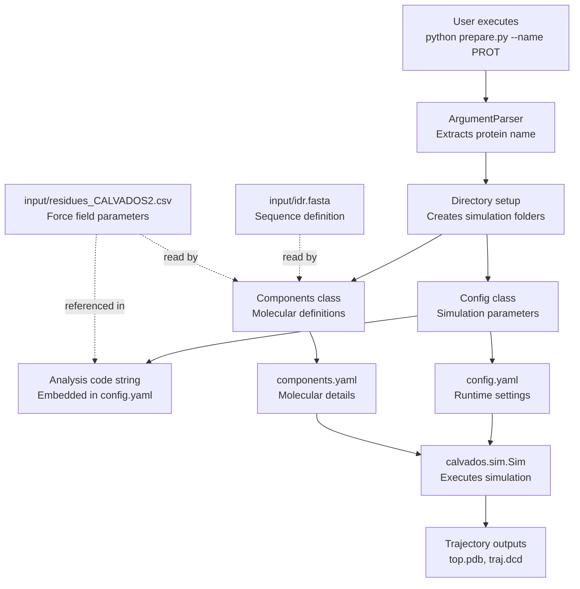
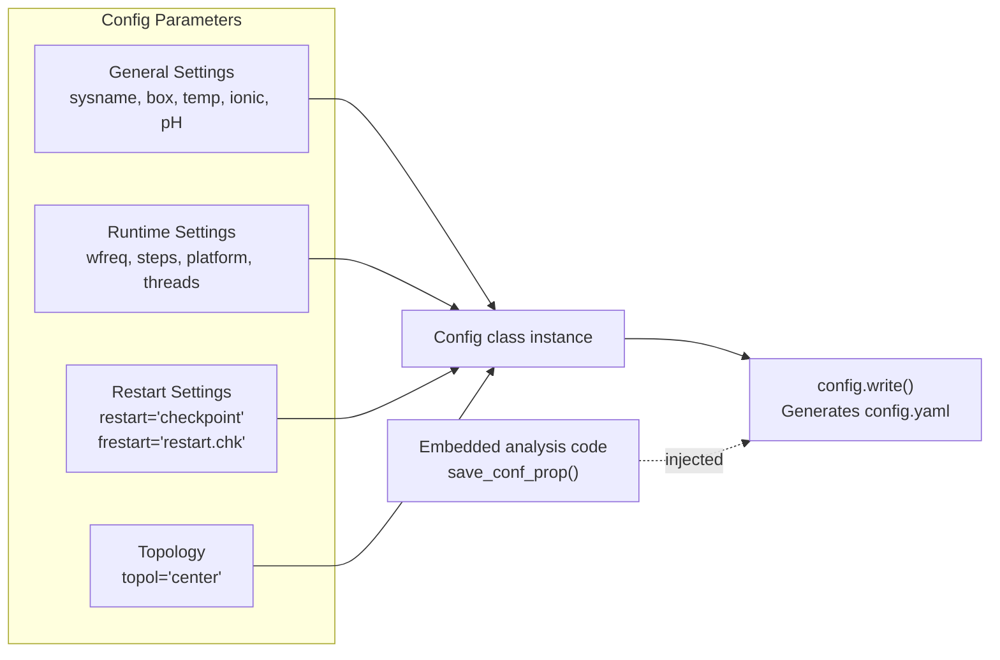
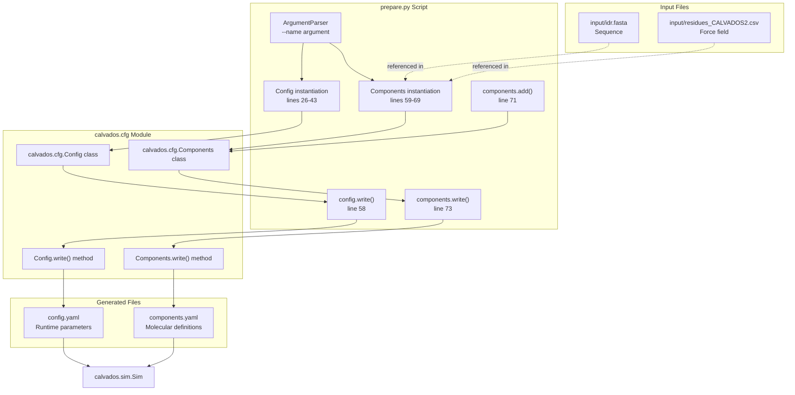

# Single IDR Simulation

<details>
<summary>Relevant source files</summary>

The following files were used as context for generating this wiki page:

- [examples/single_IDR/prepare.py](examples/single_IDR/prepare.py)
- [examples/single_MDP/prepare.py](examples/single_MDP/prepare.py)

</details>


## Purpose and Scope

This page documents the complete workflow for simulating a single intrinsically disordered region (IDR) or intrinsically disordered protein (IDP) using CALVADOS. This workflow is designed for unstructured proteins where no structural restraints are applied, and the sequence is defined by a FASTA file.

For simulations of structured proteins with restraints, see [Single Structured Protein with Restraints](#7.2). For phase separation studies involving multiple IDR molecules, see [Slab Simulation for Phase Separation](#7.3).

---

## Overview

Single IDR simulations model proteins that lack stable tertiary structure and sample a broad ensemble of conformations. Key characteristics:

- **No structural restraints**: Unlike structured proteins, IDRs are simulated without harmonic or Go-model restraints
- **FASTA input**: Sequence defined in a `.fasta` file rather than PDB structure
- **Small box size**: Typically 50 nm cubic box for a single molecule
- **CALVADOS2 force field**: Standard force field optimized for IDR properties
- **Conformational sampling**: Simulations capture radius of gyration (Rg), end-to-end distance, and scaling behavior

Sources: [examples/single_IDR/prepare.py:1-74]()

---

## Preparation Script Structure

The `prepare.py` script orchestrates the complete setup process. It generates two YAML configuration files (`config.yaml` and `components.yaml`) that drive the simulation.

### Workflow Diagram



Sources: [examples/single_IDR/prepare.py:1-73]()

---

## Command Line Interface

The preparation script accepts a single required argument:

```bash
python prepare.py --name <protein_name>
```

| Argument | Type | Required | Description |
|----------|------|----------|-------------|
| `--name` | string | Yes | Protein identifier, used for system naming and file paths |

The `--name` argument is parsed using `ArgumentParser` and becomes the `sysname` throughout the workflow.

Sources: [examples/single_IDR/prepare.py:8-10]()

---

## Simulation Parameters

### Box Configuration

```python
L = 50  # Side length in nm
```

A **50 nm cubic box** is typical for single IDR simulations. This provides sufficient space for the disordered protein to sample conformations without significant periodic boundary artifacts.

| Parameter | Value | Unit | Description |
|-----------|-------|------|-------------|
| Box dimensions | [50, 50, 50] | nm | Cubic simulation box |
| Topology | 'center' | - | Molecule placed at box center |

Sources: [examples/single_IDR/prepare.py:16-33]()

### Trajectory Saving

```python
N_save = 7000    # Integration steps between saves
N_frames = 1010  # Total frames to save
```

The simulation saves frames at regular intervals:
- **Writing frequency**: Every 7000 integration steps (70 ps, since 1 step = 10 fs)
- **Total simulation time**: 1010 frames × 7000 steps × 10 fs = 70.7 ns
- **Total integration steps**: 7,077,000 steps

Sources: [examples/single_IDR/prepare.py:18-22]()

### Thermodynamic Conditions

```python
temp = 293.15  # K
ionic = 0.19   # M (molar)
pH = 7.5
```

| Parameter | Value | Description |
|-----------|-------|-------------|
| Temperature | 293.15 K | Room temperature (20°C) |
| Ionic strength | 0.19 M | Physiological salt concentration |
| pH | 7.5 | Near-neutral pH for charge calculations |

These conditions determine:
- **Debye length** for electrostatic screening via Yukawa potential
- **Dielectric constant** of the implicit solvent
- **Residue charge states** based on pH and pKa values

Sources: [examples/single_IDR/prepare.py:26-32]()

---

## Config Class Setup

The `Config` class defines simulation runtime parameters:



Key `Config` instantiation parameters:

| Parameter | Value | Purpose |
|-----------|-------|---------|
| `sysname` | User-provided name | System identifier for output files |
| `box` | [50, 50, 50] | Simulation box dimensions |
| `temp` | 293.15 | Temperature for MD integration |
| `ionic` | 0.19 | Ionic strength for electrostatics |
| `topol` | 'center' | Initial placement strategy |
| `wfreq` | 7000 | DCD writing frequency |
| `steps` | 7,077,000 | Total integration steps |
| `platform` | 'CPU' | OpenMM platform selection |
| `restart` | 'checkpoint' | Enable checkpoint-based restart |
| `verbose` | True | Print simulation progress |

Sources: [examples/single_IDR/prepare.py:26-44]()

---

## Components Class Setup

The `Components` class defines molecular properties. For IDRs, the key distinction is **`restraint = False`**.

### IDR-Specific Configuration

```python
components = Components(
    molecule_type = 'protein',
    nmol = 1,
    restraint = False,  # Critical: no structural restraints
    charge_termini = 'both',
    fresidues = residues_file,
    ffasta = f'{cwd}/input/idr.fasta',
)
components.add(name=args.name)
```

| Parameter | Value | Description |
|-----------|-------|-------------|
| `molecule_type` | 'protein' | Component type (protein, RNA, lipid, etc.) |
| `nmol` | 1 | Single molecule in simulation |
| `restraint` | **False** | No harmonic/Go-model restraints applied |
| `charge_termini` | 'both' | Apply charges to N and C termini |
| `fresidues` | Path to CSV | Force field parameter file (CALVADOS2) |
| `ffasta` | Path to FASTA | Sequence definition file |

The `restraint = False` setting is the defining characteristic of IDR simulations, allowing the protein to sample its full conformational space without structural bias.

Sources: [examples/single_IDR/prepare.py:59-73]()

---

## Comparison: IDR vs Structured Protein Setup

The following table highlights key differences between single IDR and single structured protein (MDP) preparation:

| Aspect | IDR Simulation | Structured Protein (MDP) |
|--------|----------------|--------------------------|
| **Script** | `examples/single_IDR/prepare.py` | `examples/single_MDP/prepare.py` |
| **Box size** | 50 nm | 123 nm |
| **Restraints** | `restraint = False` | `restraint = True` |
| **Input format** | FASTA file (`ffasta`) | PDB file + domains.yaml |
| **Force field** | residues_CALVADOS2.csv | residues_CALVADOS3.csv |
| **Restraint type** | N/A | 'harmonic' or 'go' |
| **Analysis flag** | `is_idr=True` | `is_idr=False` |
| **N_save** | 7000 steps | 8000 steps |
| **N_frames** | 1010 | 4000 |
| **Use case** | Conformational ensembles | Stability, folding |

Sources: [examples/single_IDR/prepare.py:1-73](), [examples/single_MDP/prepare.py:1-78]()

---

## Code Entity Mapping: Prepare Script to CALVADOS Modules



Sources: [examples/single_IDR/prepare.py:3](), [examples/single_IDR/prepare.py:26-43](), [examples/single_IDR/prepare.py:59-73]()

---

## Embedded Analysis Code

The preparation script embeds analysis code directly into `config.yaml` using the **deferred execution pattern**:

```python
analyses = f"""

from calvados.analysis import save_conf_prop

save_conf_prop(path="{path:s}",name="{sysname:s}",residues_file="{residues_file:s}",output_path="data",start=10,is_idr=True,select='all')
"""

config.write(path,name='config.yaml',analyses=analyses)
```

### Analysis Function: `save_conf_prop`

This function calculates conformational properties from the trajectory:

| Parameter | Value | Description |
|-----------|-------|-------------|
| `path` | Simulation directory | Location of trajectory files |
| `name` | System name | Used for output file naming |
| `residues_file` | CSV path | Force field parameters for property calculations |
| `output_path` | "data" | Directory for analysis results |
| `start` | 10 | Skip first 10 frames (equilibration) |
| `is_idr` | **True** | Use IDR-specific analysis (e.g., scaling exponents) |
| `select` | 'all' | Analyze all atoms/residues |

The **`is_idr=True`** flag enables calculations specific to disordered proteins, such as:
- **Scaling exponent** (ν) from Rg vs N relationship
- **Ensemble averages** of Rg and end-to-end distance
- **SCD (sequence charge decoration)** correlations with dimensions

Sources: [examples/single_IDR/prepare.py:50-58]()

---

## Execution Workflow

### Step 1: Prepare Configuration Files

```bash
cd examples/single_IDR
python prepare.py --name myIDR
```

This generates:
- `myIDR/config.yaml` - Simulation parameters + embedded analysis
- `myIDR/components.yaml` - Molecular definitions

### Step 2: Run Simulation

```bash
cd myIDR
python -m calvados.run config.yaml
```

The `calvados.run` module:
1. Parses `config.yaml` and `components.yaml`
2. Instantiates `calvados.sim.Sim` class
3. Calls `Sim.build_system()` to construct OpenMM system
4. Runs MD integration
5. Saves trajectory to `traj.dcd` and topology to `top.pdb`

### Step 3: Execute Embedded Analysis

After simulation completes, the embedded analysis code in `config.yaml` is automatically executed, generating conformational property files in the `data/` directory.

Sources: [examples/single_IDR/prepare.py:46-58]()

---

## Output Files

### Simulation Outputs

| File | Type | Description |
|------|------|-------------|
| `top.pdb` | PDB | System topology with atom definitions |
| `traj.dcd` | DCD | Binary trajectory (coordinates over time) |
| `restart.chk` | CHK | OpenMM checkpoint for restart capability |
| `{sysname}.log` | Text | Energy, temperature, and state data per frame |

### Analysis Outputs

Located in `data/` directory (as specified by `output_path`):

| File Pattern | Content | Format |
|--------------|---------|--------|
| `*_rg.npy` | Radius of gyration per frame | NumPy array |
| `*_ete.npy` | End-to-end distance per frame | NumPy array |
| `*_properties.csv` | Summary statistics (mean Rg, Rete, etc.) | CSV table |

Sources: [examples/single_IDR/prepare.py:50-58]()

---

## Key Differences from Other Simulation Types

### vs. Structured Protein (MDP)

1. **No PDB input**: IDRs use FASTA sequences, not 3D structures
2. **No restraints**: `restraint = False` allows full conformational freedom
3. **Smaller box**: 50 nm vs 123 nm for structured proteins
4. **Different force field**: CALVADOS2 vs CALVADOS3
5. **Analysis focus**: Ensemble properties (Rg, scaling) vs structural stability (RMSD, FNC)

### vs. Slab Simulation

1. **Single molecule**: `nmol = 1` vs hundreds of molecules in slab
2. **Center topology**: `topol = 'center'` vs `topol = 'slab'`
3. **No phase separation**: Analyzes single-chain properties, not condensate formation
4. **Small box**: 50 nm cubic vs large slab geometries (e.g., 30×30×120 nm)

Sources: [examples/single_IDR/prepare.py:16-73](), [examples/single_MDP/prepare.py:16-78]()

---

## Typical Use Cases

Single IDR simulations are used to:

1. **Validate force field parameters** against experimental Rg measurements
2. **Predict ensemble dimensions** for proteins lacking structural data
3. **Study sequence-ensemble relationships** (e.g., effect of charge patterning on compaction)
4. **Calculate sequence-derived properties** (SCD, kappa, hydropathy) and correlate with conformations
5. **Generate training data** for machine learning models of IDR behavior

For multi-chain systems or phase separation studies, use the slab simulation workflow instead (see [Slab Simulation for Phase Separation](#7.3)).

---

## Summary Table: Configuration Parameters

| Configuration Class | Key Parameters for IDRs | Values |
|---------------------|-------------------------|--------|
| **Config** | `box` | [50, 50, 50] nm |
| | `topol` | 'center' |
| | `temp` | 293.15 K |
| | `ionic` | 0.19 M |
| | `wfreq` | 7000 steps |
| | `steps` | ~7 million |
| | `restart` | 'checkpoint' |
| **Components** | `molecule_type` | 'protein' |
| | `nmol` | 1 |
| | `restraint` | **False** |
| | `fresidues` | residues_CALVADOS2.csv |
| | `ffasta` | idr.fasta |
| | `charge_termini` | 'both' |
| **Analysis** | `is_idr` | **True** |
| | `start` | 10 frames |
| | `select` | 'all' |

Sources: [examples/single_IDR/prepare.py:1-73]()

---