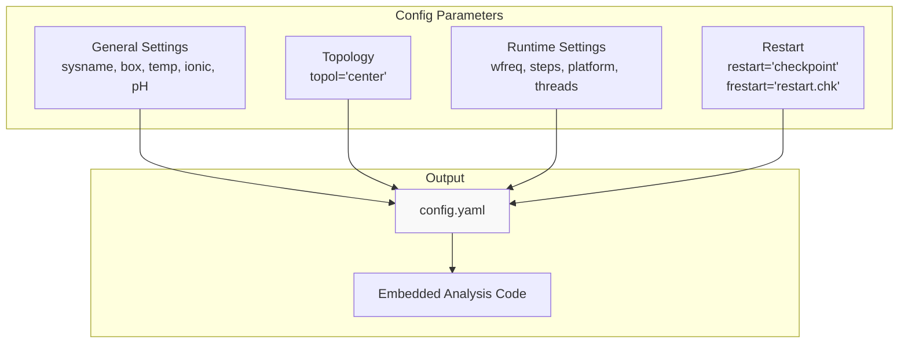
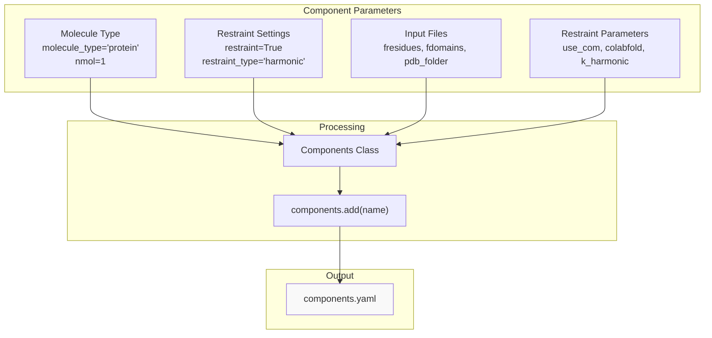
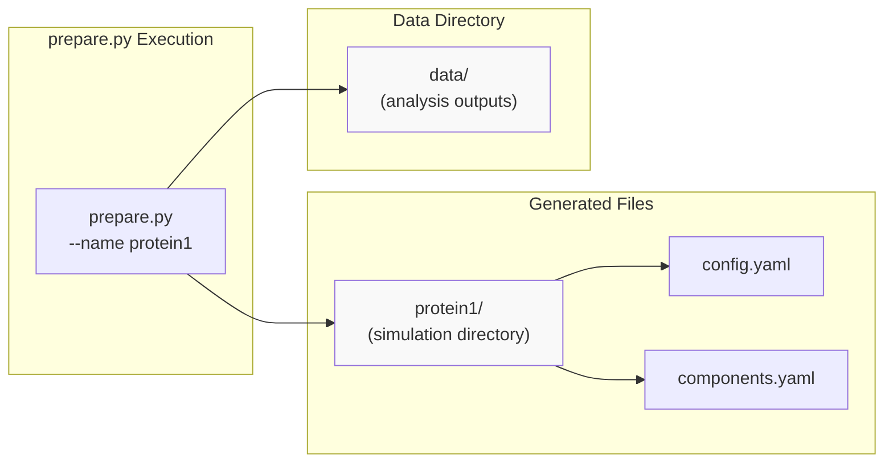
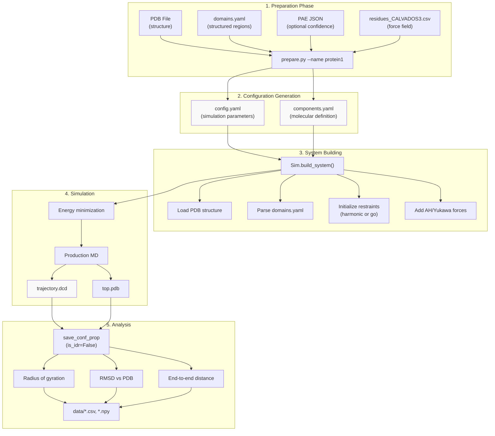
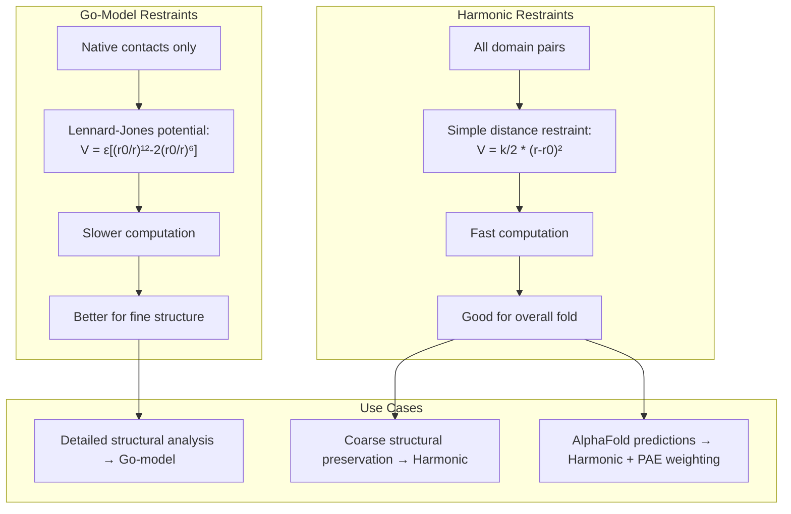

# Single Structured Protein with Restraints

<details>
<summary>Relevant source files</summary>

The following files were used as context for generating this wiki page:

- [examples/custom_restraints/prepare.py](examples/custom_restraints/prepare.py)
- [examples/single_IDR/prepare.py](examples/single_IDR/prepare.py)
- [examples/single_MDP/prepare.py](examples/single_MDP/prepare.py)

</details>


## Purpose and Scope

This page provides a complete workflow for simulating a **single structured protein** using CALVADOS with spatial restraints to maintain the protein's fold. This workflow is appropriate for globular proteins, domains with known structure, or AlphaFold-predicted structures where you want to preserve the tertiary structure during simulation.

**Key differences from other workflows:**
- For simulating **disordered proteins without restraints**, see [Single IDR Simulation](#7.1)
- For **custom restraint patterns** beyond domain-based restraints, see [Custom Restraints](#6.1)
- For **multi-protein systems** studying phase separation, see [Slab Simulation for Phase Separation](#7.3)

This workflow demonstrates:
1. Setting up a structured protein simulation with PDB input
2. Defining structured domains using `domains.yaml`
3. Configuring harmonic or Go-model restraints
4. Integrating AlphaFold confidence metrics (PAE files)
5. Post-simulation analysis for structured proteins

---

## Workflow Overview

The structured protein workflow differs from IDR simulations in several key aspects:

| Aspect | Structured Protein (MDP) | Disordered Protein (IDR) |
|--------|-------------------------|-------------------------|
| **Force Field** | CALVADOS3 (residues_CALVADOS3.csv) | CALVADOS2 (residues_CALVADOS2.csv) |
| **Input Files** | PDB structure required | FASTA sequence only |
| **Restraints** | `restraint=True` | `restraint=False` |
| **Domain Definition** | `fdomains` (domains.yaml) | Not used |
| **Confidence Weighting** | PAE files for AlphaFold | Not applicable |
| **Box Size** | Larger (e.g., 123 nm) | Smaller (e.g., 50 nm) |
| **Analysis** | `is_idr=False` | `is_idr=True` |

**Sources:** [examples/single_MDP/prepare.py:1-80](), [examples/single_IDR/prepare.py:1-75]()

---

## Input Files Required

### File Structure

```
examples/single_MDP/
├── prepare.py              # Setup script
└── input/
    ├── residues_CALVADOS3.csv   # Force field parameters
    ├── domains.yaml             # Structured domain definitions
    ├── <name>.pdb              # Protein structure
    └── <name>_PAE.json         # (Optional) AlphaFold confidence
```

### Domain Definition File (domains.yaml)

The `domains.yaml` file specifies which regions of the protein should be restrained. Format:

```yaml
<protein_name>:
  - [start_residue, end_residue]
  - [start_residue, end_residue]
```

Example:
```yaml
protein1:
  - [1, 50]
  - [80, 120]
```

This defines two structured domains: residues 1-50 and residues 80-120. Restraints will be applied to maintain distances within these regions.

**Sources:** [examples/single_MDP/prepare.py:68]()

---

## Preparation Script Breakdown

### Command-Line Interface

The prepare script accepts the protein name as a command-line argument:

```bash
python prepare.py --name <protein_name>
```

The name must match the PDB filename (e.g., `protein1.pdb`) and the entry in `domains.yaml`.

**Sources:** [examples/single_MDP/prepare.py:8-13]()

### System Parameters

```python
# Box configuration
L = 123  # Cubic box side length (nm)

# Trajectory settings
N_save = 8000      # Save every 8000 steps (80 ps)
N_frames = 4000    # Total frames to save

residues_file = f'{cwd}/input/residues_CALVADOS3.csv'
```

The larger box size (123 nm vs 50 nm for IDR) provides more space for the structured protein, which typically has a more compact, globular shape.

**Sources:** [examples/single_MDP/prepare.py:15-24]()

---

## Configuration Setup

### Config Object



**Configuration for Structured Proteins**

**Sources:** [examples/single_MDP/prepare.py:26-44]()

### Key Configuration Parameters

```python
config = Config(
    sysname = sysname,
    box = [L, L, L],        # nm
    temp = 293,             # K
    ionic = 0.19,           # molar
    pH = 7.0,
    topol = 'center',       # Place molecule at box center
    
    wfreq = N_save,         # Write frequency
    steps = N_frames*N_save,
    platform = 'CPU',
    threads = 4,
    restart = 'checkpoint',
    frestart = 'restart.chk',
    verbose = True,
)
```

The `topol='center'` parameter places the single protein molecule at the center of the simulation box.

**Sources:** [examples/single_MDP/prepare.py:26-44]()

---

## Component Configuration

### Components Object Setup



**Component Configuration Flow**

**Sources:** [examples/single_MDP/prepare.py:60-78]()

### Restraint Configuration Details

```python
components = Components(
    # Basic settings
    molecule_type = 'protein',
    nmol = 1,
    restraint = True,           # Enable restraints
    charge_termini = 'both',
    
    # Input files
    fresidues = residues_file,
    fdomains = f'{cwd}/input/domains.yaml',
    pdb_folder = f'{cwd}/input',
    
    # Restraint configuration
    restraint_type = 'harmonic',  # 'harmonic' or 'go'
    use_com = True,               # Use center-of-mass distances
    colabfold = 1,                # PAE format (0=EBI, 1-2=ColabFold)
    k_harmonic = 700.,            # Force constant (kJ/mol/nm²)
)
```

| Parameter | Options | Description |
|-----------|---------|-------------|
| `restraint_type` | `'harmonic'`, `'go'` | Harmonic restrains to PDB distances; Go-model uses native contact map |
| `use_com` | `True`, `False` | Apply restraints to domain centers-of-mass instead of individual C-alpha atoms |
| `colabfold` | `0`, `1`, `2` | PAE file format: 0=EBI AlphaFold, 1-2=ColabFold |
| `k_harmonic` | float | Restraint force constant; typical range 500-1000 kJ/mol/nm² |

**Sources:** [examples/single_MDP/prepare.py:60-78]()

---

## Restraint Types Comparison

### Harmonic Restraints

Harmonic restraints maintain distances between domain centers-of-mass (when `use_com=True`) or C-alpha atoms:

```
V = (k_harmonic/2) * (r - r0)²
```

Where:
- `r0` is the distance from the PDB structure
- `k_harmonic` is the force constant
- Applied to all pairs within defined domains

**Advantages:**
- Simple, computationally efficient
- Preserves overall domain arrangement
- Allows flexibility within domains

### Go-Model Restraints

Go-model restraints use a native contact map approach:

```
V = ε * [(r0/r)¹² - 2(r0/r)⁶]
```

Applied only to residue pairs in contact (typically < 0.8 nm) in the native structure.

**Advantages:**
- More detailed structural preservation
- Mimics protein folding energy landscape
- Better for fine structural details

**Sources:** Related to [calvados/interactions.py]() (restraint implementations)

---

## File Generation and Directory Structure



**Directory Creation and Output Organization**

**Sources:** [examples/single_MDP/prepare.py:46-49]()

The script creates:
1. **Simulation directory** (`{sysname}/`) containing configuration files
2. **Data directory** (`data/`) for analysis outputs

```python
path = f'{cwd}/{sysname:s}'
subprocess.run(f'mkdir -p {path}', shell=True)
subprocess.run(f'mkdir -p data', shell=True)
```

**Sources:** [examples/single_MDP/prepare.py:46-49]()

---

## Embedded Analysis

### Analysis Code Configuration

The prepare script embeds analysis code in `config.yaml` that executes after simulation completion:

```python
analyses = f"""
from calvados.analysis import save_conf_prop

save_conf_prop(
    path="{path:s}",
    name="{sysname:s}",
    residues_file="{residues_file:s}",
    output_path=f"{cwd}/data",
    start=100,           # Skip first 100 frames
    is_idr=False,        # Structured protein analysis
    select='all'
)
"""
config.write(path, name='config.yaml', analyses=analyses)
```

**Key Parameter:** `is_idr=False`

This tells the analysis system to use structured protein-specific calculations:
- RMSD relative to initial/reference structure
- Radius of gyration with appropriate scaling expectations
- End-to-end distance metrics relevant for folded proteins

**Sources:** [examples/single_MDP/prepare.py:51-58]()

---

## Complete Workflow Diagram



**End-to-End Workflow for Structured Protein Simulation**

**Sources:** [examples/single_MDP/prepare.py:1-80]()

---

## Running the Simulation

### Step 1: Prepare Configuration

```bash
cd examples/single_MDP
python prepare.py --name protein1
```

This generates:
- `protein1/config.yaml`
- `protein1/components.yaml`

### Step 2: Execute Simulation

```bash
cd protein1
calvados
```

The `calvados` command reads the YAML files and runs the simulation. Output files:
- `trajectory.dcd` - atomic coordinates over time
- `top.pdb` - topology file
- `restart.chk` - checkpoint for restart
- `log.txt` - energy and state information

### Step 3: Analysis

Analysis runs automatically after simulation if embedded in `config.yaml`. Output appears in the `data/` directory.

**Sources:** Related to [calvados/sim.py]() (simulation execution)

---

## Comparison: Harmonic vs Go-Model



**Restraint Type Selection Guide**

**Sources:** [examples/single_MDP/prepare.py:71]()

---

## Advanced Options

### AlphaFold PAE Weighting

When using AlphaFold-predicted structures, PAE (Predicted Aligned Error) files provide confidence metrics:

```python
components = Components(
    pdb_folder = f'{cwd}/input',  # Directory with protein1_PAE.json
    colabfold = 1,                 # PAE format version
    # ... other parameters
)
```

PAE files weight restraints based on prediction confidence:
- **Low PAE values** (high confidence) → stronger restraints
- **High PAE values** (low confidence) → weaker restraints

This allows flexible/uncertain regions to move more freely while maintaining well-predicted structure.

**Sources:** [examples/single_MDP/prepare.py:73]()

### Custom Restraint Files

For restraint patterns not captured by `domains.yaml`, use custom restraints:

```python
config = Config(
    custom_restraints = True,
    custom_restraint_type = 'harmonic',
    fcustom_restraints = f'{cwd}/input/cres.txt',
    # ... other parameters
)
```

See [Custom Restraints](#6.1) for details on the `cres.txt` format.

**Sources:** [examples/custom_restraints/prepare.py:45-47]()

---

## Troubleshooting

### Common Issues

| Issue | Cause | Solution |
|-------|-------|----------|
| "PDB file not found" | Filename mismatch | Ensure PDB filename matches `--name` argument |
| "Domain not defined" | Missing entry in domains.yaml | Add protein entry to domains.yaml |
| "Structure explodes" | Restraints too weak | Increase `k_harmonic` (try 1000-2000) |
| "Structure too rigid" | Restraints too strong | Decrease `k_harmonic` (try 300-500) |
| High energy at start | Poor initial structure | Check PDB for missing atoms/residues |

### Force Constant Selection

Recommended `k_harmonic` values:

- **Experimental structures (X-ray, NMR):** 500-700 kJ/mol/nm²
- **High-confidence AlphaFold:** 700-1000 kJ/mol/nm²
- **Medium-confidence AlphaFold:** 300-500 kJ/mol/nm²
- **Keeping shape but allowing flexibility:** 200-400 kJ/mol/nm²

**Sources:** [examples/single_MDP/prepare.py:74]()

---

## Summary

This workflow demonstrates simulating structured proteins with CALVADOS:

1. **Input:** PDB structure + domains.yaml + (optional) PAE confidence
2. **Configuration:** Set `restraint=True`, choose harmonic or Go-model
3. **Force Field:** Use CALVADOS3 (residues_CALVADOS3.csv)
4. **Restraints:** Configure force constant and restraint type
5. **Analysis:** Use `is_idr=False` for structured protein metrics

**Key Files:**
- [examples/single_MDP/prepare.py:1-80]() - Complete preparation script
- `config.yaml` - Generated simulation parameters
- `components.yaml` - Generated molecular definition

For related workflows, see:
- [Single IDR Simulation](#7.1) - Disordered proteins without restraints
- [Custom Restraints](#6.1) - Advanced restraint patterns
- [Restraints System](#3.5) - Detailed restraint mechanics

---