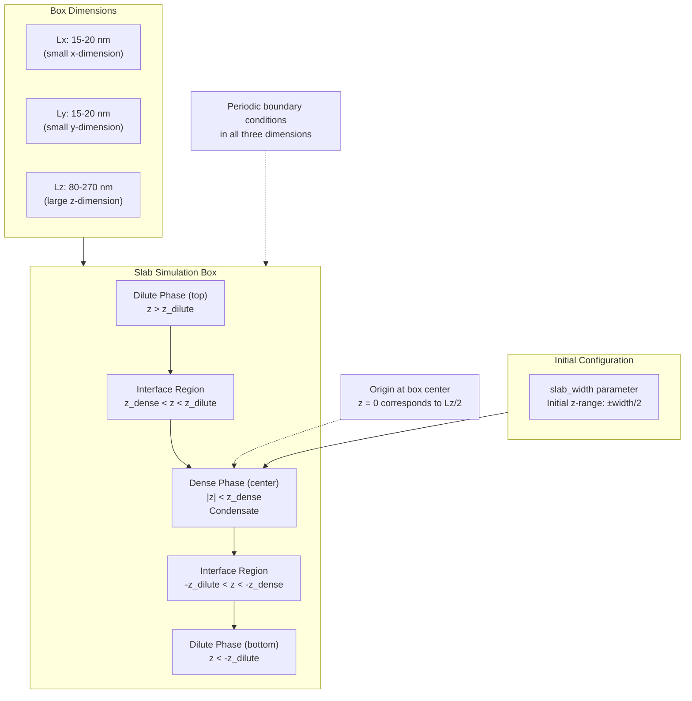
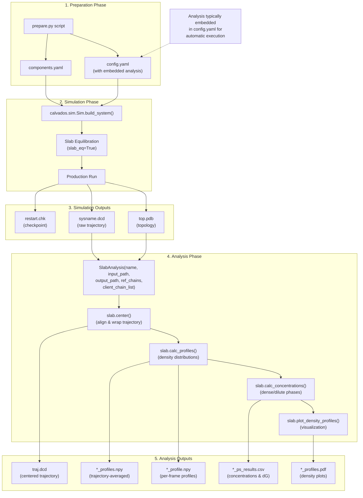
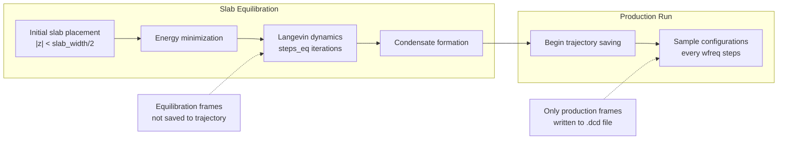
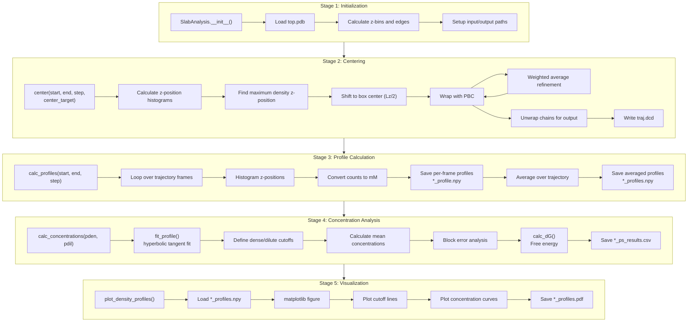
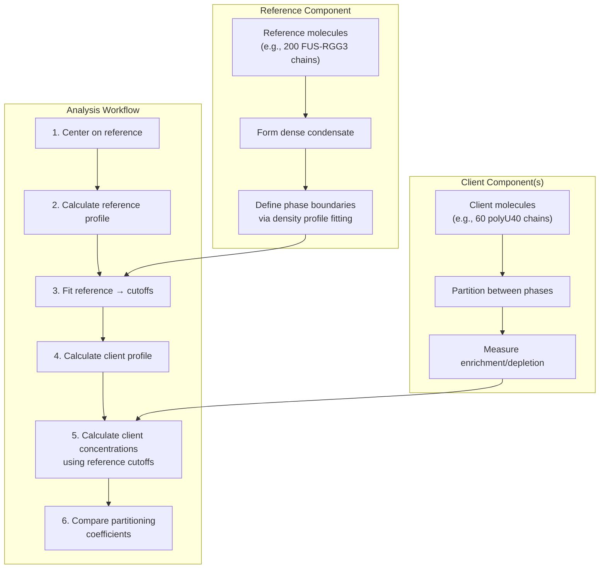

# Slab Simulation for Phase Separation

<details>
<summary>Relevant source files</summary>

The following files were used as context for generating this wiki page:

- [calvados/analysis.py](calvados/analysis.py)
- [examples/slab_IDR/prepare.py](examples/slab_IDR/prepare.py)
- [examples/slab_MDP/prepare.py](examples/slab_MDP/prepare.py)
- [examples/slab_mixed/example_slab_analysis.ipynb](examples/slab_mixed/example_slab_analysis.ipynb)
- [examples/slab_mixed/prepare.py](examples/slab_mixed/prepare.py)

</details>


## Purpose and Scope

This page provides a complete workflow for setting up, running, and analyzing slab topology simulations to study liquid-liquid phase separation (LLPS) in biomolecular systems. Slab simulations create a two-phase system where a dense condensate coexists with a dilute phase, enabling quantification of partitioning behavior, phase separation free energies, and concentration profiles.

For detailed documentation of the `SlabAnalysis` class and its methods, see [SlabAnalysis - Phase Separation Studies](#5.1). For general configuration and component setup, see [Config Class](#2.1) and [Components Class](#2.2).

## Slab Topology Overview

The slab topology creates an elongated simulation box with molecules initially placed in a narrow slab at the center along the z-axis. During equilibration, molecules spontaneously form a dense condensate that remains centered in the box, with dilute phases on both sides. This geometry enables calculation of concentration gradients and partitioning coefficients.

### Coordinate System and Box Geometry



**Sources:** [examples/slab_IDR/prepare.py:24-29](), [examples/slab_mixed/prepare.py:11-31](), [examples/slab_MDP/prepare.py:24-30]()

### Key Configuration Parameters

| Parameter | Typical Value | Purpose |
|-----------|--------------|---------|
| `box` | `[15, 15, 150]` | Box dimensions in nm (x, y, z) |
| `topol` | `'slab'` | Topology type for slab geometry |
| `slab_width` | `20-40` | Initial width of slab in nm |
| `slab_eq` | `True` | Enable slab equilibration mode |
| `steps_eq` | `100 * N_save` | Equilibration steps before production |
| `friction_coeff` | `0.01` or `0.001` | Friction for Langevin dynamics |

**Sources:** [examples/slab_IDR/prepare.py:21-42](), [calvados/analysis.py:417-450]()

## Complete Workflow Diagram



**Sources:** [examples/slab_IDR/prepare.py:1-84](), [calvados/analysis.py:417-680]()

## Setting Up a Slab Simulation

### Step 1: Create Config Object

The `Config` object specifies simulation parameters. Key settings for slab simulations:

```python
from calvados.cfg import Config

config = Config(
    sysname = 'protein_slab_1',
    box = [15, 15, 150.],  # Small xy, large z
    temp = 293,
    ionic = 0.15,
    pH = 7,
    topol = 'slab',        # Critical: enables slab geometry
    slab_width = 20,       # Initial placement width
    friction_coeff = 0.01,
    
    # Runtime
    wfreq = 50000,         # Save every 50k steps (500 ps)
    steps = 150000000,     # Total steps (1.5 µs)
    platform = 'CUDA',
    restart = 'checkpoint',
    frestart = 'restart.chk',
    
    # Equilibration
    slab_eq = True,        # Enable slab equilibration
    steps_eq = 5000000,    # 50 ns equilibration
)
```

**Sources:** [examples/slab_IDR/prepare.py:21-43](), [examples/slab_MDP/prepare.py:21-42]()

### Step 2: Define Molecular Components

For single-component systems:

```python
from calvados.cfg import Components

components = Components(
    molecule_type = 'protein',
    nmol = 1,
    restraint = False,  # No restraints for IDRs
    charge_termini = 'both',
    ffasta = 'input/fastalib.fasta',
    fresidues = 'input/residues_CALVADOS2.csv',
)

components.add(name='ProteinA', nmol=100)  # 100 chains
```

For multi-component systems (protein + RNA, or reference + client):

```python
components = Components(
    fresidues = 'input/residues_C2RNA.csv',
    ffasta = 'input/mix.fasta',
    # RNA-specific parameters
    rna_kb1 = 1400.0,
    rna_kb2 = 2200.0,
    rna_ka = 4.20,
    rna_pa = 3.14,
)

components.add(name='FUS-RGG3', molecule_type='protein', nmol=200)
components.add(name='polyU40', molecule_type='rna', nmol=60)
```

**Sources:** [examples/slab_IDR/prepare.py:68-82](), [examples/slab_mixed/prepare.py:77-94]()

### Step 3: Embed Analysis Code

Analysis code is embedded in `config.yaml` for automatic execution after simulation:

```python
analyses = f"""
from calvados.analysis import SlabAnalysis

slab = SlabAnalysis(name="{sysname}", 
                    input_path="{path}",
                    output_path="{output_path}", 
                    ref_name="{sysname}", 
                    verbose=True)

slab.center(start=400, center_target='all')
slab.calc_profiles()
slab.calc_concentrations()
slab.plot_density_profiles()
"""

config.write(path, name='config.yaml', analyses=analyses)
components.write(path, name='components.yaml')
```

**Sources:** [examples/slab_IDR/prepare.py:51-66](), [examples/slab_mixed/prepare.py:52-73]()

## Running the Simulation

### Equilibration Phase

When `slab_eq=True`, the simulation begins with equilibration where:
1. Initial slab configuration is placed at z=0
2. System evolves to form stable condensate
3. After `steps_eq` steps, production run begins

The `Sim` class handles this automatically:



**Sources:** [examples/slab_IDR/prepare.py:40-42]()

### Execution

```bash
# Run simulation
python prepare.py --name ProteinA --gpu_id 0 --replica 1
cd ProteinA_1
calvados config.yaml
```

**Sources:** [examples/slab_IDR/prepare.py:8-12]()

## SlabAnalysis Pipeline

The `SlabAnalysis` class provides methods to analyze phase separation behavior. The typical workflow has four stages:



**Sources:** [calvados/analysis.py:417-680]()

### Initialization Parameters

| Parameter | Type | Description |
|-----------|------|-------------|
| `name` | str | System name (must match `sysname` in config) |
| `input_path` | str | Directory containing `top.pdb` and `.dcd` files |
| `output_path` | str | Directory for analysis outputs |
| `input_pdb` | str | Topology filename (default: `'top.pdb'`) |
| `input_dcd` | str | Raw trajectory filename (default: `f'{name}.dcd'`) |
| `centered_dcd` | str | Centered trajectory filename (default: `'traj.dcd'`) |
| `ref_chains` | tuple | Reference chain indices `(first, last)` (0-based, inclusive) |
| `ref_name` | str | Name for reference component |
| `client_chain_list` | list | List of client chain tuples `[(first1, last1), ...]` |
| `client_names` | list | Names for client components |
| `verbose` | bool | Print progress messages |

**Sources:** [calvados/analysis.py:418-443]()

### Centering the Trajectory

The `center()` method aligns the dense phase to the box center:

```python
slab.center(
    start=400,           # Skip first 400 frames (equilibration)
    end=None,            # Process to end
    step=1,              # Use every frame
    center_target='all'  # 'all' or 'ref'
)
```

**Algorithm:**
1. For each frame, calculate z-position histogram
2. Find z-coordinate of maximum density
3. Translate all atoms to center maximum at Lz/2
4. Apply periodic boundary wrapping
5. Calculate weighted average of slab density
6. Translate to center weighted average at Lz/2
7. Wrap again
8. Unwrap chains for continuous output
9. Write centered trajectory to `traj.dcd`

**Sources:** [calvados/analysis.py:456-512](), [examples/slab_mixed/example_slab_analysis.ipynb:44-50]()

### Calculating Density Profiles

The `calc_profiles()` method computes concentration distributions along z:

```python
slab.calc_profiles(
    start=None,  # Start frame (use None if trajectory already cropped)
    end=None,
    step=1,
    save_individual_profiles=True
)
```

**Output files:**
- `{name}_{ref_name}_profile.npy`: Per-frame reference profiles, shape `(n_frames, n_bins)`, units: mM
- `{name}_{client_name}_profile.npy`: Per-frame client profiles (if applicable)
- `{name}_profiles.npy`: Trajectory-averaged profiles, shape `(n_components+1, n_bins)`, first row is z-coordinates in nm

**Conversion to molar concentration:**
```python
binwidth = 1  # Angstrom
volume = Lx * Ly * binwidth / 1e3  # nm^3
conv = 10 / 6.02214 / nbeads / volume * 1e3  # mM per bead in slice
```

**Sources:** [calvados/analysis.py:514-577]()

### Calculating Phase Concentrations

The `calc_concentrations()` method determines dense and dilute phase concentrations:

```python
slab.calc_concentrations(
    pden=2.,     # Dense phase cutoff: interface - pden*width
    pdil=8.,     # Dilute phase cutoff: interface + pdil*width
    dGmin=-10.,  # Minimum free energy (kT) for numerical stability
    write_conc_arrays=True,
    plot_profiles=True
)
```

**Fitting procedure:**
1. Load per-frame profiles from `.npy` files
2. Fit density profile to hyperbolic tangent function for each interface:
   ```
   profile(z) = 0.5*(a+b) + 0.5*(b-a)*tanh((|z|-c)/d)
   ```
   where `c` is interface position, `d` is interface width
3. Define cutoffs:
   - Dense: `c - pden*d` (both sides)
   - Dilute: `c + pdil*d` (both sides)
4. Average concentration in each region
5. Block error analysis for uncertainties
6. Calculate partitioning free energy: `dG = ln(c_dilute / c_dense)` in units of kT

**Output:** `{name}_ps_results.csv` with columns:
- `first_chain`, `last_chain`: Chain index range
- `cutoffs_dense_left`, `cutoffs_dense_right`: Dense phase boundaries (nm)
- `cutoffs_dilute_left`, `cutoffs_dilute_right`: Dilute phase boundaries (nm)
- `c_dense`, `c_dense_err`: Dense phase concentration ± error (mM)
- `c_dilute`, `c_dilute_err`: Dilute phase concentration ± error (mM)
- `dG`, `dG_err`: Partitioning free energy ± error (kT)

**Sources:** [calvados/analysis.py:579-655](), [calvados/analysis.py:758-772]()

## Multi-Component Systems

### Reference vs Client Molecules

Multi-component slab systems distinguish between:
- **Reference molecules**: Form the condensate, used for centering and defining phase boundaries
- **Client molecules**: Partition between phases, analyzed relative to reference-defined boundaries



**Sources:** [examples/slab_mixed/prepare.py:60-65](), [calvados/analysis.py:600-605]()

### Example: Protein-RNA System

```python
# In prepare.py
components.add(name='FUS-RGG3', molecule_type='protein', nmol=200)
components.add(name='polyU40', molecule_type='rna', nmol=60)

# In analysis
slab = SlabAnalysis(
    name='mixed_system',
    input_path='mixed_system',
    output_path='data',
    ref_chains=(0, 199),           # FUS-RGG3: chains 0-199
    ref_name='FUS-RGG3',
    client_chain_list=[(200, 259)], # polyU40: chains 200-259
    client_names=['polyU40']
)

# Center using reference component
slab.center(start=250, center_target='ref')  # or 'all'

# Calculate profiles for both components
slab.calc_profiles()

# Reference defines cutoffs, applied to client
slab.calc_concentrations()

# Results contain both reference and client partitioning
print(slab.df_results)
#                     c_dense  c_dilute    dG  ...
# mixed_system_FUS-RGG3   45.2     0.32  -5.05  ...
# mixed_system_polyU40    23.1     0.18  -4.86  ...
```

**Sources:** [examples/slab_mixed/prepare.py:52-73](), [examples/slab_mixed/example_slab_analysis.ipynb:26-40]()

## Additional Analysis Functions

### Center of Mass Trajectories

For multi-chain systems, calculate chain-by-chain center of mass trajectories:

```python
from calvados.analysis import calc_com_traj

calc_com_traj(
    path=path,
    sysname=sysname,
    output_path=output_path,
    residues_file=residues_file,
    chainid_dict={sysname: (0, 99)},  # All chains
    start=None, end=None, step=1
)
```

**Outputs:**
- `{sysname}_com_top.pdb`: Topology with one atom per chain
- `{sysname}_com_traj.dcd`: COM trajectory
- `{sysname}_{component}_rg.npy`: Per-chain, per-frame radius of gyration

**Sources:** [calvados/analysis.py:793-877](), [examples/slab_IDR/prepare.py:62]()

### Contact Maps in Slab Geometry

Calculate contact maps for chains in the dense phase:

```python
from calvados.analysis import calc_contact_map

calc_contact_map(
    path=path,
    sysname=sysname,
    output_path=output_path,
    chainid_dict={sysname: (0, 99)},
    is_slab=True  # Use slab-specific analysis
)
```

When `is_slab=True`:
1. Loads phase separation cutoffs from `*_ps_results.csv`
2. Identifies chains in dense vs dilute phases per frame
3. Calculates contacts between central chain and surrounding chains
4. Saves phase-specific Rg values: `*_rg_dense.npy`, `*_rg_dilute.npy`

**Outputs:**
- `{sysname}_{name1}_{name2}_cmap.npy`: Contact map
- `{sysname}_{component}_rg_dense.npy`: Rg in dense phase
- `{sysname}_{component}_rg_dilute.npy`: Rg in dilute phase

**Sources:** [calvados/analysis.py:879-969](), [examples/slab_IDR/prepare.py:63]()

## Complete Worked Example

### Single-Component IDR Slab

```python
# prepare.py
import os
from calvados.cfg import Config, Components

cwd = os.getcwd()
sysname = 'ProteinA_1'
N_save = 50000
N_frames = 3000

config = Config(
    sysname = sysname,
    box = [15, 15, 150.],
    temp = 293,
    ionic = 0.15,
    pH = 7,
    topol = 'slab',
    slab_width = 20,
    friction_coeff = 0.01,
    wfreq = N_save,
    steps = N_frames * N_save,
    platform = 'CUDA',
    slab_eq = True,
    steps_eq = 100 * N_save,
)

path = f'{cwd}/{sysname}'
output_path = f'{path}/data'

# Embedded analysis
analyses = f"""
from calvados.analysis import SlabAnalysis

slab = SlabAnalysis(
    name="{sysname}",
    input_path="{path}",
    output_path="{output_path}",
    ref_name="{sysname}",
    verbose=True
)

slab.center(start=400, center_target='all')
slab.calc_profiles()
slab.calc_concentrations(pden=2., pdil=8.)
print(slab.df_results)
slab.plot_density_profiles()
"""

config.write(path, name='config.yaml', analyses=analyses)

components = Components(
    molecule_type = 'protein',
    nmol = 1,
    restraint = False,
    charge_termini = 'both',
    ffasta = f'{cwd}/input/fastalib.fasta',
    fresidues = f'{cwd}/input/residues_CALVADOS2.csv',
)

components.add(name='ProteinA', nmol=100)
components.write(path, name='components.yaml')
```

### Running and Analyzing

```bash
# Prepare simulation
python prepare.py --name ProteinA --gpu_id 0 --replica 1

# Run simulation
cd ProteinA_1
calvados config.yaml

# Analysis runs automatically at end of simulation
# Or run manually:
python -c "exec(open('config.yaml').read().split('analyses: |')[1])"
```

### Expected Outputs

**Directory structure:**
```
ProteinA_1/
├── config.yaml
├── components.yaml
├── top.pdb                     # Topology
├── ProteinA_1.dcd              # Raw trajectory
├── restart.chk                 # Checkpoint
├── ProteinA_1.log              # Energy/state log
├── traj.dcd                    # Centered trajectory
└── data/
    ├── ProteinA_1_ProteinA_1_profile.npy      # Per-frame profiles
    ├── ProteinA_1_profiles.npy                # Averaged profiles
    ├── ProteinA_1_ps_results.csv              # Phase concentrations
    └── ProteinA_1_profiles.pdf                # Density plot
```

**Example results CSV:**
```csv
,first_chain,last_chain,cutoffs_dense_right,cutoffs_dense_left,cutoffs_dilute_right,cutoffs_dilute_left,c_dense,c_dense_err,c_dilute,c_dilute_err,dG,dG_err
ProteinA_1_ProteinA_1,0,99,12.3,-12.3,28.7,-28.7,42.5,1.2,0.35,0.08,-4.89,0.15
```

**Sources:** [examples/slab_IDR/prepare.py:1-84]()

## Troubleshooting

### Common Issues

| Issue | Cause | Solution |
|-------|-------|----------|
| Slab not centered | Insufficient equilibration | Increase `steps_eq` or skip more frames in `center(start=...)` |
| High dilute phase concentration | System not phase separated | Increase concentration, decrease temperature, or adjust ionic strength |
| `dG` set to `-10.0` | Dilute concentration ≈ 0 | Expected for strong phase separation; indicates `dG < dGmin` |
| Asymmetric cutoffs | Poor convergence | Check `center()` was run; increase sampling time |
| Missing `traj.dcd` | `center()` not called | Must run `center()` before other analysis methods |

### Validation Checks

```python
# Check centering quality
import numpy as np
profiles = np.load('data/system_profiles.npy')
z, h = profiles[0], profiles[1]
print(f"Maximum density at z = {z[np.argmax(h)]:.2f} nm")
# Should be ≈ 0.0 nm for good centering

# Check phase separation quality
results = pd.read_csv('data/system_ps_results.csv', index_col=0)
ratio = results.loc['system_ref', 'c_dense'] / results.loc['system_ref', 'c_dilute']
print(f"Dense/dilute ratio: {ratio:.1f}")
# Ratio > 10 indicates clear phase separation
```

**Sources:** [calvados/analysis.py:456-512](), [calvados/analysis.py:758-777]()

---