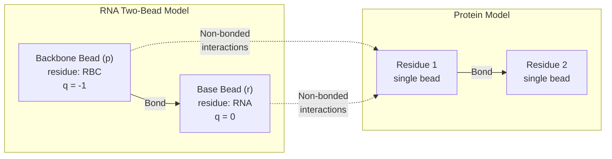
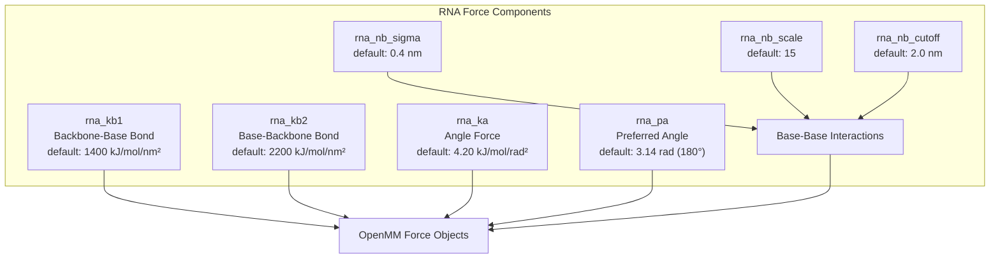
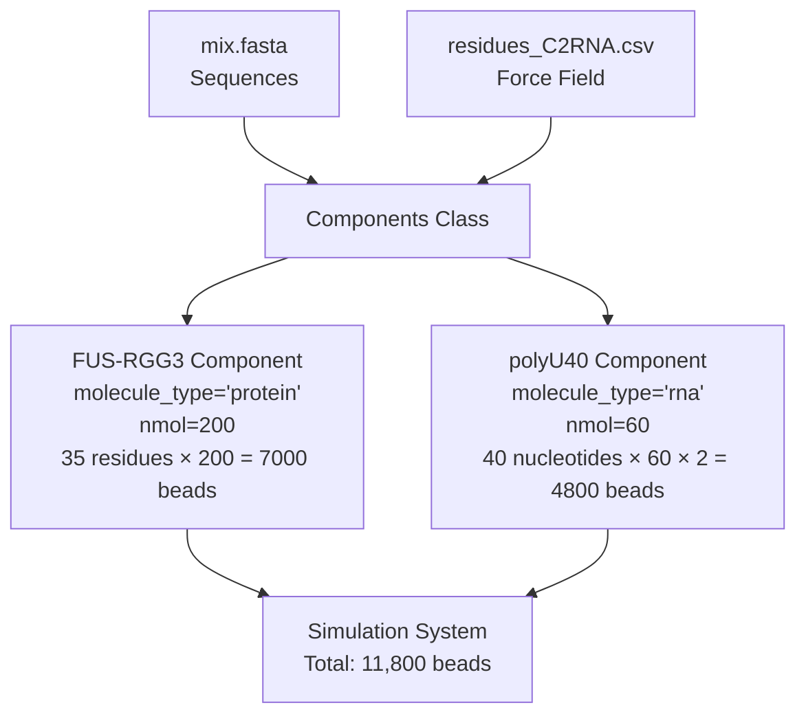
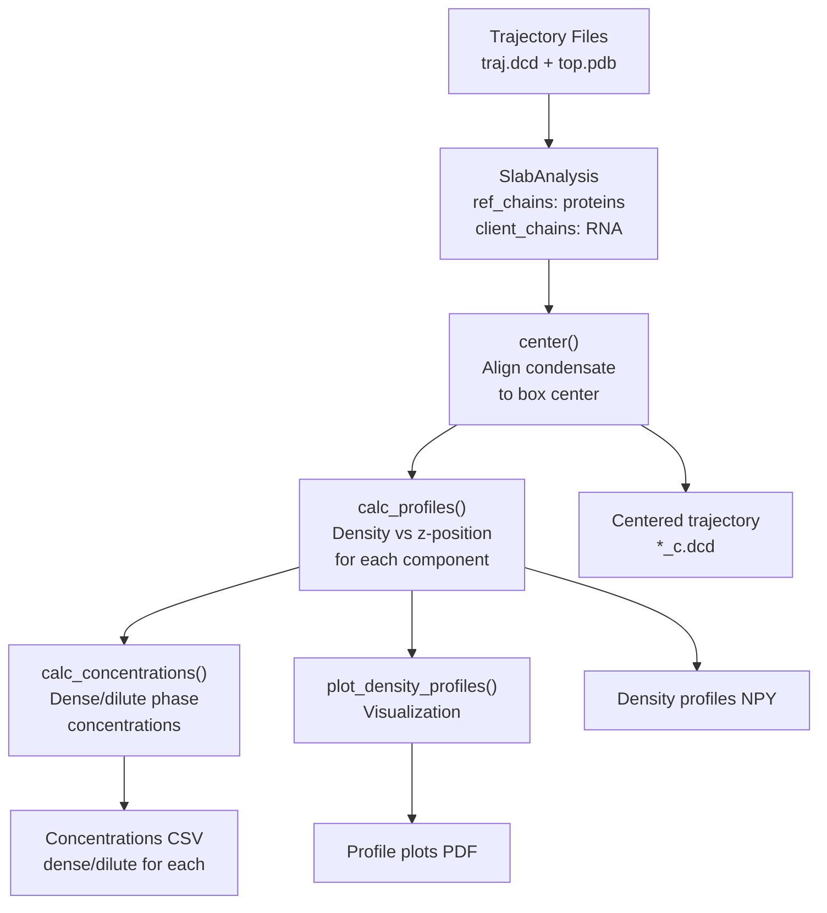
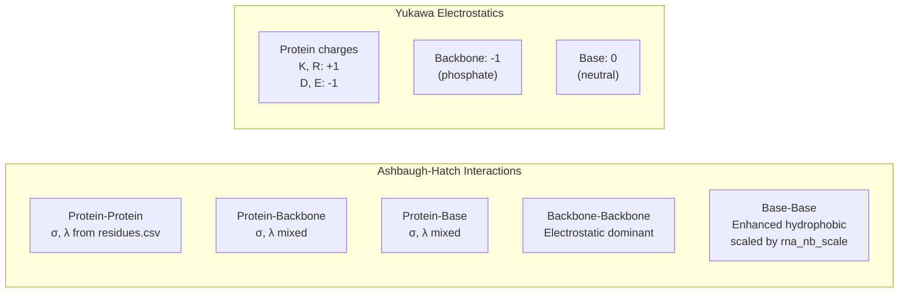

# Mixed Protein-RNA Systems

<details>
<summary>Relevant source files</summary>

The following files were used as context for generating this wiki page:

- [calvados/build.py](calvados/build.py)
- [calvados/sequence.py](calvados/sequence.py)
- [examples/single_RNA/residues_C2RNA.csv](examples/single_RNA/residues_C2RNA.csv)
- [examples/single_RNA/rna.fasta](examples/single_RNA/rna.fasta)
- [examples/single_dsRNA/input/domains.yaml](examples/single_dsRNA/input/domains.yaml)
- [examples/single_dsRNA/input/dspolyR12.pdb](examples/single_dsRNA/input/dspolyR12.pdb)
- [examples/single_dsRNA/input/fastalib.fasta](examples/single_dsRNA/input/fastalib.fasta)
- [examples/single_dsRNA/input/residues_C2RNA.csv](examples/single_dsRNA/input/residues_C2RNA.csv)
- [examples/single_dsRNA/prepare.py](examples/single_dsRNA/prepare.py)
- [examples/slab_mixed/input/mix.fasta](examples/slab_mixed/input/mix.fasta)
- [examples/slab_mixed/input/residues_C2RNA.csv](examples/slab_mixed/input/residues_C2RNA.csv)
- [examples/slab_mixed/prepare.py](examples/slab_mixed/prepare.py)

</details>


This page demonstrates how to simulate protein-RNA interactions using CALVADOS. It covers the C2RNA force field, RNA component configuration, RNA-specific force parameters, and analysis of mixed protein-RNA systems. For simulating proteins alone, see [Single IDR Simulation](#7.1). For phase separation studies with multiple protein species, see [Multi-Component Phase Separation](#6.3).

## Overview

CALVADOS supports simulations of RNA molecules and protein-RNA mixtures through the **C2RNA force field**, which extends the CALVADOS2 protein force field with a two-bead coarse-grained model for RNA. Each RNA nucleotide is represented by two beads: one for the backbone (phosphate-sugar) and one for the nucleobase. This enables efficient simulation of protein-RNA condensates and interactions.



**RNA Representation in CALVADOS**

Sources: [examples/slab_mixed/input/residues_C2RNA.csv:22-23](), [calvados/build.py:316-353]()

## C2RNA Force Field

The C2RNA force field combines protein and RNA parameters in a single `residues.csv` file. This file must include both standard amino acid residues and the two RNA bead types.

### RNA Residue Types

| Residue | One-Letter | MW (Da) | λ | σ (nm) | q | Bond Length (nm) |
|---------|------------|---------|---|--------|---|------------------|
| RBC (backbone) | p | 194.1 | 0.00 | 0.6954 | -1 | 0.59 |
| RNA (base) | r | 126.3 | 1.18 | 0.6238 | 0 | 0.54 |

**Key features:**
- **RBC (p)**: Phosphate-sugar backbone, negatively charged (q=-1), hydrophilic (λ=0.00)
- **RNA (r)**: Nucleobase, neutral (q=0), hydrophobic (λ=1.18)
- Longer bond lengths (0.54-0.59 nm) compared to protein (0.38 nm)

Sources: [examples/slab_mixed/input/residues_C2RNA.csv:22-23](), [examples/single_RNA/residues_C2RNA.csv:22-23]()

### RNA Sequence Format

RNA sequences in FASTA files use the lowercase letter **'r'** for each nucleotide, where each 'r' represents a complete nucleotide (both backbone and base beads):

```
>polyU40
rrrrrrrrrrrrrrrrrrrrrrrrrrrrrrrrrrrrrrrr
```

This 40-character sequence creates an RNA molecule with 80 beads total (40 backbone + 40 base beads).

Sources: [examples/slab_mixed/input/mix.fasta:3-4]()

## RNA Component Configuration

### Basic RNA Component

To add an RNA molecule to your simulation, use the `Components.add()` method with `molecule_type='rna'`:

```python
components = Components(
    fresidues = 'input/residues_C2RNA.csv',
    ffasta = 'input/sequences.fasta',
    
    # RNA-specific force parameters
    rna_kb1 = 1400.0,      # Backbone-base bond force constant
    rna_kb2 = 2200.0,      # Base-backbone bond force constant
    rna_ka = 4.20,         # Angle force constant
    rna_pa = 3.14,         # Preferred angle (radians)
    rna_nb_sigma = 0.4,    # Base-base interaction sigma
    rna_nb_scale = 15,     # Base-base interaction scale
    rna_nb_cutoff = 2.0    # Base-base interaction cutoff
)

components.add(
    name='polyU40',
    molecule_type='rna',
    nmol=60
)
```

Sources: [examples/slab_mixed/prepare.py:77-94]()

### RNA Force Parameters



**RNA Force Parameter Descriptions**

| Parameter | Description | Default Value | Units |
|-----------|-------------|---------------|-------|
| `rna_kb1` | Force constant for backbone-to-base bonds | 1400.0 | kJ/mol/nm² |
| `rna_kb2` | Force constant for base-to-next-backbone bonds | 2200.0 | kJ/mol/nm² |
| `rna_ka` | Angular force constant for bending | 4.20 | kJ/mol/rad² |
| `rna_pa` | Preferred angle between consecutive bonds | 3.14 | radians |
| `rna_nb_sigma` | Sigma for base-base LJ interactions | 0.4 | nm |
| `rna_nb_scale` | Epsilon scale for base-base interactions | 15 | dimensionless |
| `rna_nb_cutoff` | Cutoff distance for base-base interactions | 2.0 | nm |

Sources: [examples/slab_mixed/prepare.py:83-89](), [examples/single_dsRNA/prepare.py:83-89]()

## Complete Workflow: Mixed Protein-RNA System

This example demonstrates setting up a slab simulation with FUS-RGG3 protein and polyU RNA to study protein-RNA phase separation.

### Step 1: Prepare Input Files

**Directory structure:**
```
slab_mixed/
├── prepare.py
└── input/
    ├── residues_C2RNA.csv
    └── mix.fasta
```

**mix.fasta:**
```
>FUS-RGG3
RRGGRGGYDRGGYRGRGGDRGGFRGGRGGGDRGC
>polyU40
rrrrrrrrrrrrrrrrrrrrrrrrrrrrrrrrrrrrrrrr
```

Sources: [examples/slab_mixed/input/mix.fasta:1-5]()

### Step 2: Configure Simulation

```python
import os
from calvados.cfg import Config, Components
import subprocess

cwd = os.getcwd()
sysname = 'mixed_system'

# Slab geometry for phase separation
Lx = 15  # nm
Lz = 80  # nm (elongated z-direction)

N_save = 100000
N_frames = 1000

residues_file = f'{cwd}/input/residues_C2RNA.csv'

config = Config(
    sysname = sysname,
    box = [Lx, Lx, Lz],
    temp = 293.15,
    ionic = 0.15,
    pH = 7.5,
    topol = 'slab',
    
    wfreq = N_save,
    steps = N_frames * N_save,
    platform = 'CUDA',
    restart = 'checkpoint',
    frestart = 'restart.chk',
    verbose = True,
    slab_eq = True,
    steps_eq = 100 * N_save
)
```

Sources: [examples/slab_mixed/prepare.py:8-42]()

### Step 3: Add Molecular Components

```python
components = Components(
    fresidues = residues_file,
    ffasta = f'{cwd}/input/mix.fasta',
    
    # RNA force parameters
    rna_kb1 = 1400.0,
    rna_kb2 = 2200.0,
    rna_ka = 4.20,
    rna_pa = 3.14,
    rna_nb_sigma = 0.4,
    rna_nb_scale = 15,
    rna_nb_cutoff = 2.0
)

# Protein component
components.add(
    name='FUS-RGG3',
    molecule_type='protein',
    nmol=200,
    charge_termini='both'
)

# RNA component
components.add(
    name='polyU40',
    molecule_type='rna',
    nmol=60
)
```

**Component specification diagram:**



**Component Details**

Sources: [examples/slab_mixed/prepare.py:77-94]()

### Step 4: Configure Analysis

Embed analysis code in the configuration to run automatically after simulation:

```python
analyses = f"""
from calvados.analysis import SlabAnalysis

slab_analysis = SlabAnalysis(
    name='mixed_system',
    input_path=f'{cwd}/mixed_system',
    output_path=f'{cwd}/data',
    input_pdb='top.pdb',
    input_dcd=None,
    centered_dcd='traj.dcd',
    # Use proteins as reference for centering
    ref_chains=(0, 199),  # 0-based, inclusive - all 200 proteins
    ref_name='FUS-RGG3',
    # RNA as client molecules
    client_chain_list=[(200, 259)],  # chains 200-259 are RNA
    client_names=['polyU40'],
    verbose=False
)

slab_analysis.center(
    start=250,
    center_target='all'
)
slab_analysis.calc_profiles()
slab_analysis.calc_concentrations()
"""

config.write(path, name='config.yaml', analyses=analyses)
components.write(path, name='components.yaml')
```

**Key analysis parameters:**
- **ref_chains=(0, 199)**: Protein molecules define the condensate reference frame
- **client_chain_list=[(200, 259)]**: RNA molecules are treated as client partitioning into the condensate
- **center()**: Aligns trajectory so condensate center is at box center
- **calc_profiles()**: Computes density profiles along z-axis for both species
- **calc_concentrations()**: Calculates concentrations in dense and dilute phases

Sources: [examples/slab_mixed/prepare.py:52-75]()

## Analysis Workflow for Protein-RNA Systems

### SlabAnalysis for Multi-Component Systems



**Multi-Component Density Profiles**

The analysis separately calculates density profiles for:
1. **Reference molecules** (FUS-RGG3 proteins): Form the condensate scaffold
2. **Client molecules** (polyU RNA): Partition into the condensate

This allows measuring:
- Protein and RNA concentrations in dense phase
- Protein and RNA concentrations in dilute phase
- Enrichment factors for RNA partitioning
- Spatial distribution of each component

Sources: [examples/slab_mixed/prepare.py:52-73]()

### Running the Simulation

```bash
# Generate configuration files
python prepare.py

# Run simulation (produces mixed_system/traj.dcd)
cd mixed_system
calvados sim config.yaml

# Analysis runs automatically via embedded code
# Or run manually:
calvados analyze config.yaml
```

### Output Files

After completion, the workflow produces:

| File | Description |
|------|-------------|
| `mixed_system/traj.dcd` | Raw trajectory |
| `mixed_system/top.pdb` | System topology |
| `data/mixed_system_c.dcd` | Centered trajectory |
| `data/mixed_system_density_profiles.npy` | Density vs z for each component |
| `data/mixed_system_concentrations.csv` | Dense/dilute phase concentrations |
| `data/mixed_system_density_profiles.pdf` | Visualization of profiles |

## Double-Stranded RNA

For structured RNA with restraints (e.g., double-stranded RNA), use the `restraint=True` option with appropriate restraint parameters:

```python
components.add(
    name='dspolyR12',
    molecule_type='rna',
    nmol=1,
    restraint=True,
    restraint_type='harmonic',
    k_harmonic=10,
    cutoff_restr=1.5,
    use_com=False,
    ext_restraint=True
)
```

**Key parameters for structured RNA:**
- **restraint=True**: Enable restraints
- **restraint_type='harmonic'**: Use harmonic restraints (alternative: 'go')
- **k_harmonic**: Force constant (kJ/mol/nm²)
- **cutoff_restr**: Distance cutoff for restraints (nm)
- **use_com=False**: Apply restraints to individual beads (not center of mass)
- **ext_restraint=True**: Use external restraint definitions from PDB or domains file

Sources: [examples/single_dsRNA/prepare.py:93-96]()

## Force Field Parameter Considerations

### Interaction Matrix



**Interaction Features:**

1. **Protein-RNA backbone**: Strong electrostatic attraction between positively charged residues (R, K) and negatively charged phosphate backbone
2. **Protein-RNA base**: Hydrophobic interactions (λ=1.18 for bases)
3. **RNA base-base**: Enhanced stacking via `rna_nb_scale` parameter
4. **Standard mixing rules**: σ_ij = (σ_i + σ_j)/2, λ_ij = (λ_i + λ_j)/2

Sources: [calvados/sequence.py:376-450]()

## Common Parameter Adjustments

### Tuning RNA Flexibility

To increase RNA rigidity:
```python
rna_kb1 = 2000.0  # Increase backbone-base bond stiffness
rna_kb2 = 3000.0  # Increase base-backbone bond stiffness
rna_ka = 8.0      # Increase angle stiffness
```

To increase RNA flexibility:
```python
rna_kb1 = 1000.0
rna_kb2 = 1500.0
rna_ka = 2.0
```

### Adjusting RNA Stacking

The `rna_nb_scale` parameter controls base-base stacking interactions:
```python
rna_nb_scale = 15   # Default - moderate stacking
rna_nb_scale = 30   # Strong stacking (more compact RNA)
rna_nb_scale = 5    # Weak stacking (more extended RNA)
```

### pH Effects

RNA backbone charge remains -1 across pH ranges, but protein residue charges may vary with pH (see [pH-Dependent Simulations](#6.2) for protein charge adjustments).

Sources: [examples/slab_mixed/prepare.py:83-89]()

## Summary

Mixed protein-RNA simulations in CALVADOS require:

1. **C2RNA force field**: Use `residues_C2RNA.csv` containing protein residues plus RBC (backbone) and RNA (base) residue types
2. **RNA sequence format**: Lowercase 'r' in FASTA files, each representing one nucleotide
3. **Component specification**: Set `molecule_type='rna'` in `Components.add()`
4. **RNA force parameters**: Configure seven parameters (kb1, kb2, ka, pa, nb_sigma, nb_scale, nb_cutoff)
5. **Multi-component analysis**: Use `SlabAnalysis` with ref_chains and client_chain_list to separately track proteins and RNA

The two-bead RNA model efficiently captures electrostatic (backbone) and hydrophobic (base) interactions with proteins while maintaining computational efficiency for large-scale phase separation simulations.

Sources: [examples/slab_mixed/prepare.py:1-96](), [examples/single_dsRNA/prepare.py:1-100](), [examples/slab_mixed/input/residues_C2RNA.csv:1-23]()

---