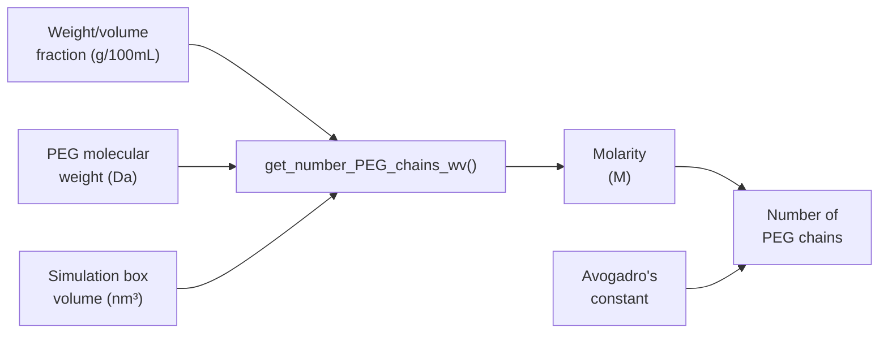
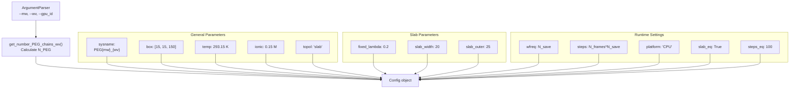
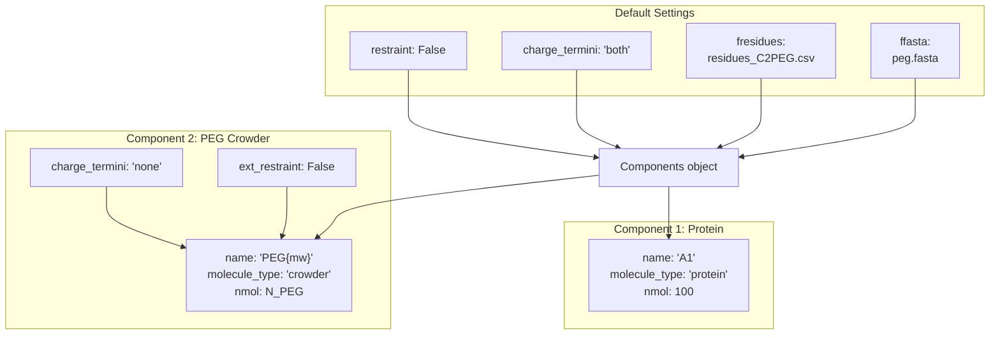
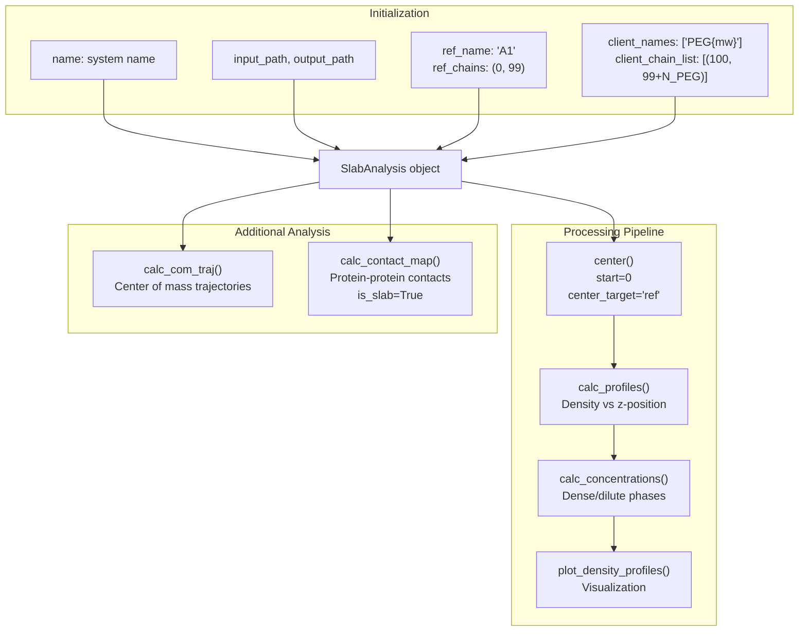
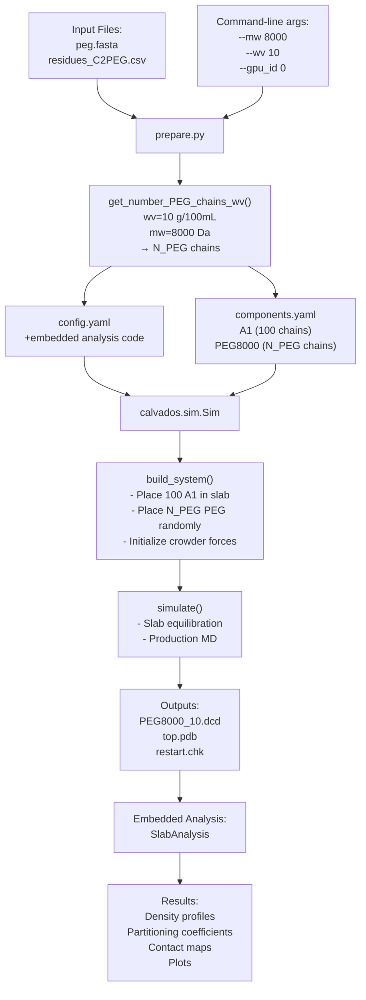

# Crowding Effects with PEG

<details>
<summary>Relevant source files</summary>

The following files were used as context for generating this wiki page:

- [examples/slab_IDR_MDP/prepare.py](examples/slab_IDR_MDP/prepare.py)
- [examples/slab_IDR_PEG/prepare.py](examples/slab_IDR_PEG/prepare.py)

</details>


## Purpose and Scope

This document describes how to simulate molecular crowding effects using polyethylene glycol (PEG) molecules in CALVADOS. PEG crowders are used to mimic the excluded volume effects of the cellular environment on protein behavior and phase separation. This page covers PEG parameterization, calculating the number of crowder molecules from experimental concentrations, and analyzing PEG partitioning into condensates.

For general phase separation simulations without crowders, see [Slab Simulation for Phase Separation](#7.3). For multi-component systems with different protein species, see [Multi-Component Phase Separation](#6.3).

---

## Overview of Molecular Crowding

PEG molecules serve as generic crowding agents that exert excluded volume effects without forming specific interactions with proteins. In CALVADOS, PEG chains are represented using the `crowder` molecule type, which applies only excluded volume interactions (no electrostatics). This allows studying how macromolecular crowding affects protein conformations, phase behavior, and the partitioning of client molecules into condensates.

### Key Features

| Feature | Implementation |
|---------|----------------|
| Molecule type | `crowder` component class |
| Interactions | Excluded volume only (no charges) |
| Concentration specification | Weight/volume fraction (g/100 mL) |
| Typical use case | Slab geometry for phase separation studies |
| Analysis focus | Density profiles and partitioning coefficients |

---

## PEG Parameterization and Force Field

### Residue Parameters

PEG molecules are parameterized in a specialized residues file `residues_C2PEG.csv` that defines the coarse-grained representation of PEG monomers. The force field includes:

- **Excluded volume**: Ashbaugh-Hatch potential with PEG-specific σ and λ parameters
- **No electrostatics**: PEG residues have zero charge (q = 0)
- **Bonded interactions**: Harmonic bonds between consecutive beads

The PEG sequence is provided in FASTA format where each residue represents a PEG monomer unit.

**Sources**: [examples/slab_IDR_PEG/prepare.py:38](), [examples/slab_IDR_PEG/prepare.py:97]()

---

## Setting Up a PEG Crowding Simulation

### Calculating Number of PEG Chains

The number of PEG chains required to achieve a specific crowding concentration is calculated from the weight/volume fraction and molecular weight:

**Concentration Conversion Function**



The conversion uses the formula:

1. Molarity (M) = (wv_fraction × 10) / mw_peg
2. Volume (L) = volume_nm³ × 10⁻²⁴
3. N_chains = round(Molarity × Volume × Avogadro)

**Sources**: [examples/slab_IDR_PEG/prepare.py:9-15]()

### Simulation Configuration

**Command-Line Interface**

The preparation script accepts three key arguments:

```
--mw      : Molecular weight of PEG (Da)
--wv      : Weight/volume fraction (g/100 mL)
--gpu_id  : GPU device ID for acceleration
```

**Example invocation**:
```bash
python prepare.py --mw 8000 --wv 10 --gpu_id 0
```

This creates a system named `PEG8000_10` with 10 g/100mL of 8 kDa PEG crowders.

**Sources**: [examples/slab_IDR_PEG/prepare.py:30-34](), [examples/slab_IDR_PEG/prepare.py:36-37]()

### Box Geometry and Topology

PEG crowding simulations typically use slab topology to study phase separation in the presence of crowding:

| Parameter | Typical Value | Purpose |
|-----------|---------------|---------|
| `Lx`, `Ly` | 15 nm | Cross-sectional dimensions |
| `Lz` | 150 nm | Elongated z-axis for phase separation |
| `topol` | `'slab'` | Slab geometry with periodic boundaries |
| `slab_width` | 20 nm | Initial dense phase thickness |
| `slab_outer` | 25 nm | Outer boundary for placement |

**Sources**: [examples/slab_IDR_PEG/prepare.py:19-22](), [examples/slab_IDR_PEG/prepare.py:43](), [examples/slab_IDR_PEG/prepare.py:47](), [examples/slab_IDR_PEG/prepare.py:49-50]()

### Config Object Construction



**Key Configuration Parameters**:

- `fixed_lambda = 0.2`: Fixed hydrophobicity parameter for PEG-protein interactions
- `slab_eq = True`: Enables slab equilibration mode
- `steps_eq = 100`: Number of equilibration steps

**Sources**: [examples/slab_IDR_PEG/prepare.py:40-62]()

### Component Definition

**Component System Architecture**



**Critical PEG-Specific Settings**:

- `molecule_type = 'crowder'`: Uses the Crowder component class
- `charge_termini = 'none'`: No terminal charges for PEG
- `ext_restraint = False`: No external restraints during slab equilibration

**Sources**: [examples/slab_IDR_PEG/prepare.py:92-102]()

---

## PEG Partitioning Analysis

### SlabAnalysis Configuration

PEG crowding simulations use `SlabAnalysis` to quantify PEG partitioning into protein condensates:

**Analysis Workflow**



**Key Analysis Parameters**:

| Parameter | Value | Purpose |
|-----------|-------|---------|
| `ref_name`, `ref_chains` | `'A1'`, `(0, 99)` | Reference protein forming condensate |
| `client_names` | `['PEG{mw}']` | PEG as client molecule |
| `client_chain_list` | `[(100, 99+N_PEG)]` | Chain indices for PEG molecules |
| `center_target` | `'ref'` | Center trajectory on protein condensate only |
| `start` | `0` | Use all frames for analysis |

**Sources**: [examples/slab_IDR_PEG/prepare.py:69-88]()

### Analysis Outputs

The analysis generates:

1. **Density Profiles**: Spatial distribution of protein and PEG along z-axis
2. **Concentration Dataframe** (`df_results`): Dense and dilute phase concentrations
3. **Partitioning Coefficient**: Ratio of PEG concentration in dense vs dilute phases
4. **Contact Maps**: Protein-protein contacts in slab geometry
5. **Centered Trajectory**: Aligned trajectory for visualization

---

## Complete Workflow

**End-to-End PEG Crowding Simulation**



**Execution Steps**:

1. Run preparation script with PEG parameters
2. Script calculates required number of PEG chains
3. Generates configuration files with slab topology
4. Simulation builds system with protein in slab + PEG crowders
5. Slab equilibration establishes phase separation
6. Production run with PEG partitioning
7. Automated analysis quantifies PEG distribution

**Sources**: [examples/slab_IDR_PEG/prepare.py:1-103]()

---

## Implementation Details

### PEG Molecule Representation

**PEG Sequence Structure**:
- Each line in `peg.fasta` defines a PEG chain
- Each character represents one PEG monomer bead
- Sequence length determines polymer chain length
- Molecular weight determines number of monomers per chain

**Force Field Treatment**:
- PEG uses `molecule_type = 'crowder'` in Components
- Crowder class (see [Component Class Hierarchy](#3.1)) implements:
  - Only Ashbaugh-Hatch excluded volume interactions
  - No electrostatic (Yukawa) forces (q = 0)
  - Standard harmonic bonds between beads
  - No restraints or structural biases

### Crowder-Specific Parameters

The `fixed_lambda` parameter controls PEG-protein interactions:
- `fixed_lambda = 0.2`: Uniform hydrophobicity for all PEG-protein pairs
- Overrides residue-specific λ values from `residues_C2PEG.csv`
- Ensures consistent excluded volume effect regardless of protein sequence

**Sources**: [examples/slab_IDR_PEG/prepare.py:48](), [examples/slab_IDR_PEG/prepare.py:101]()

### Multi-Component Slab Analysis

The analysis distinguishes between:
- **Reference chains** (protein A1, chains 0-99): Form the condensate
- **Client chains** (PEG, chains 100 to 99+N_PEG): Partition into phases

This enables calculating:
- Independent density profiles for each species
- Phase concentrations for protein and crowder separately  
- Enrichment/depletion of PEG in dense phase
- Effect of crowding on protein-protein contacts

**Sources**: [examples/slab_IDR_PEG/prepare.py:74-75]()

---