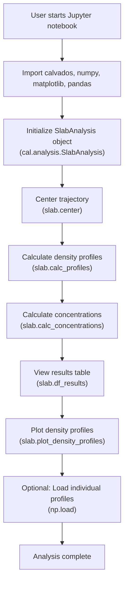
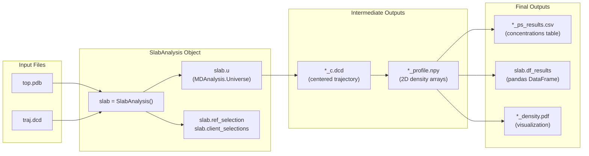
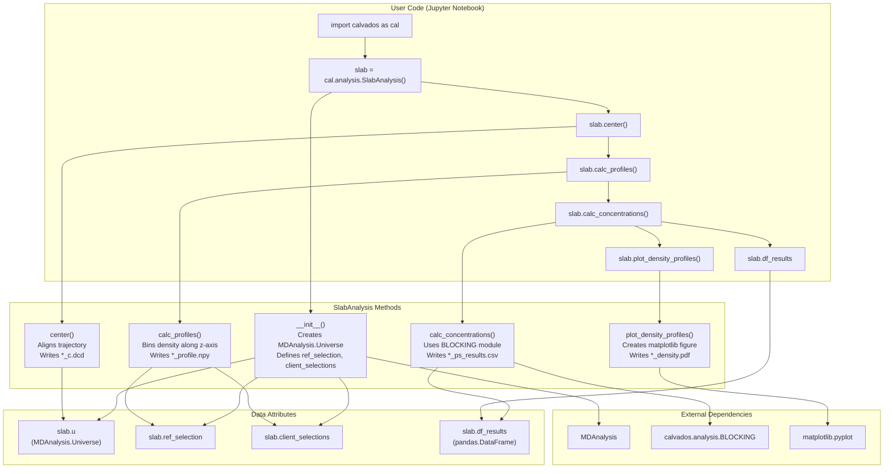

# Analysis Workflow Example

<details>
<summary>Relevant source files</summary>

The following files were used as context for generating this wiki page:

- [calvados/__init__.py](calvados/__init__.py)
- [examples/single_MDP/input/TIA1.pdb](examples/single_MDP/input/TIA1.pdb)
- [examples/slab_IDR/example_slab_analysis.ipynb](examples/slab_IDR/example_slab_analysis.ipynb)
- [examples/slab_mixed/example_slab_analysis.ipynb](examples/slab_mixed/example_slab_analysis.ipynb)

</details>


## Purpose and Scope

This page demonstrates a complete analysis workflow using the `SlabAnalysis` class for post-processing slab geometry simulations. It walks through a typical Jupyter notebook session, from loading trajectory data to generating density profiles and concentration measurements for liquid-liquid phase separation studies.

For detailed documentation of `SlabAnalysis` methods and parameters, see [SlabAnalysis - Phase Separation Studies](#5.1). For setting up slab simulations that generate the input data, see [Slab Simulation for Phase Separation](#7.3). For other trajectory analysis methods beyond phase separation, see [Structural Properties](#5.2) and [Contact & Distance Analysis](#5.3).

---

## Prerequisites

Before running a `SlabAnalysis` workflow, you need the following files generated from a completed slab simulation:

| File | Description | Generated By |
|------|-------------|--------------|
| `top.pdb` | System topology file | `calvados.sim.Sim.simulate()` |
| `traj.dcd` | Binary trajectory file | `calvados.sim.Sim.simulate()` |
| `sim.log` (optional) | Simulation log with energies | `calvados.sim.Sim.simulate()` |

These files should be located in an input directory, typically the same directory where the simulation was run.

Sources: [examples/slab_mixed/example_slab_analysis.ipynb:36-39](), [examples/slab_IDR/example_slab_analysis.ipynb:37-38]()

---

## Workflow Overview

The following diagram illustrates the sequential steps in a typical `SlabAnalysis` workflow:



**Data Flow Through Analysis Pipeline**



Sources: [examples/slab_mixed/example_slab_analysis.ipynb:1-130](), [examples/slab_IDR/example_slab_analysis.ipynb:1-131]()

---

## Step 1: Import Libraries

Start by importing CALVADOS and supporting libraries:

```python
import calvados as cal
import numpy as np
import matplotlib.pyplot as plt
import pandas as pd

import warnings
warnings.filterwarnings("ignore", category=DeprecationWarning)
```

The `calvados` package provides access to `cal.analysis.SlabAnalysis`. NumPy, matplotlib, and pandas are used for numerical operations, visualization, and tabular data handling.

Sources: [examples/slab_mixed/example_slab_analysis.ipynb:10-16](), [examples/slab_IDR/example_slab_analysis.ipynb:10-16]()

---

## Step 2: Initialize SlabAnalysis

Create a `SlabAnalysis` object by specifying the system name, file paths, and molecular components:

### Single-Component System Example

```python
system = 'hnRNPA1LCD'
repl = 0
name = f'{system}_{repl:d}'

slab = cal.analysis.SlabAnalysis(
    name = name,
    input_path = name,
    output_path = 'slab_output',
    ref_name = system,
    verbose = True
)
```

In this example, all molecules belong to the reference component. The `ref_chains` parameter is optional and will auto-detect all chains if not specified.

### Multi-Component System Example

```python
name = 'mixed_system'
ref_chains = (0, 199)          # Chains 0-199 (inclusive)
ref_name = 'FUSR-GG3'

client_chain_list = [(200, 259)]
client_names = ['polyU40']

slab = cal.analysis.SlabAnalysis(
    name = name,
    input_path = 'mixed_system',
    output_path = 'data',
    ref_name = ref_name, 
    ref_chains = ref_chains,
    client_chain_list = client_chain_list,
    client_names = client_names,
    verbose = True
)
```

In this example, chains 0-199 are the reference component (FUSR-GG3 protein), and chains 200-259 are the client component (polyU40 RNA).

### Key Parameters

| Parameter | Type | Description |
|-----------|------|-------------|
| `name` | str | Identifier for the analysis run |
| `input_path` | str | Directory containing `top.pdb` and `traj.dcd` |
| `output_path` | str | Directory for saving analysis results |
| `ref_name` | str | Name of the reference component |
| `ref_chains` | tuple | (start, end) chain indices for reference (0-based, inclusive) |
| `client_chain_list` | list of tuples | List of (start, end) tuples for each client component |
| `client_names` | list of str | Names corresponding to each client component |
| `verbose` | bool | Enable progress messages |

Upon initialization, `SlabAnalysis` creates an `MDAnalysis.Universe` object and defines atom selections for the reference and client components.

Sources: [examples/slab_mixed/example_slab_analysis.ipynb:26-40](), [examples/slab_IDR/example_slab_analysis.ipynb:29-41]()

---

## Step 3: Center the Trajectory

Center the trajectory to align the condensate in the simulation box:

```python
slab.center(start=250, step=1, center_target='all')
```

The `center()` method aligns each frame so that the center of mass of the specified molecules is at the box center. This is essential for calculating accurate density profiles.

### Parameters

| Parameter | Type | Default | Description |
|-----------|------|---------|-------------|
| `start` | int | 0 | First frame to process (skip equilibration) |
| `step` | int | 1 | Frame stride (use >1 for faster processing) |
| `center_target` | str | 'all' | Which molecules to use for centering: 'all', 'ref', or 'client' |

**Centering Strategy:**
- `center_target='all'`: Centers on the combined center of mass of reference + client molecules
- `center_target='ref'`: Centers only on reference molecules (useful when client molecules partition weakly)

The centered trajectory is saved as `{name}_c.dcd` in the output directory.

Sources: [examples/slab_mixed/example_slab_analysis.ipynb:50](), [examples/slab_IDR/example_slab_analysis.ipynb:51]()

---

## Step 4: Calculate Density Profiles

Compute spatial density distributions along the z-axis:

```python
slab.calc_profiles()
```

This method:
1. Reads the centered trajectory (`*_c.dcd`)
2. Divides the simulation box into spatial bins (default: 50 bins along z-axis)
3. Calculates time-averaged density for each component in each bin
4. Saves 2D density profiles as NumPy arrays

### Output Files

For each component, a 2D array is saved:
- Shape: `(n_frames, n_bins)`
- Filename: `{output_path}/{name}_{component_name}_profile.npy`
- Units: Number density (particles per bin)

The profiles capture the spatial distribution over time, enabling statistical analysis of phase separation.

Sources: [examples/slab_mixed/example_slab_analysis.ipynb:60](), [examples/slab_IDR/example_slab_analysis.ipynb:61]()

---

## Step 5: Calculate Concentrations

Quantify the dense and dilute phase concentrations:

```python
slab.calc_concentrations()
```

This method analyzes the density profiles to determine:
- **Dense phase concentration**: Maximum density in the condensate
- **Dilute phase concentration**: Density in the surrounding solution
- **Partition coefficient**: Ratio of dense to dilute concentrations (for client molecules)

The method uses the BLOCKING algorithm (see `calvados.analysis.BLOCKING`) to estimate statistical uncertainties via block averaging.

### Results Storage

Results are stored in two formats:

1. **CSV file**: `{output_path}/{name}_ps_results.csv`
2. **DataFrame attribute**: `slab.df_results`

Example DataFrame structure:

| Component | c_dense (µM) | c_dense_err (µM) | c_dilute (µM) | c_dilute_err (µM) | Kp | Kp_err |
|-----------|--------------|------------------|---------------|-------------------|-----|--------|
| FUSR-GG3 | 1250.3 | 45.2 | 12.4 | 1.8 | N/A | N/A |
| polyU40 | 423.7 | 28.9 | 8.7 | 1.2 | 48.7 | 5.3 |

**Partition Coefficient (Kp):** Only calculated for client molecules, defined as `c_dense / c_dilute`.

Sources: [examples/slab_mixed/example_slab_analysis.ipynb:70](), [examples/slab_IDR/example_slab_analysis.ipynb:71]()

---

## Step 6: View Results

Access the results DataFrame directly:

```python
slab.df_results
```

This displays the calculated concentrations and partition coefficients in tabular format. The DataFrame can be further manipulated using pandas operations for custom analysis or export.

Sources: [examples/slab_mixed/example_slab_analysis.ipynb:80](), [examples/slab_IDR/example_slab_analysis.ipynb:81]()

---

## Step 7: Plot Density Profiles

Generate publication-quality visualizations:

```python
slab.plot_density_profiles()
```

This creates a PDF file (`{output_path}/{name}_density.pdf`) showing:
- Density profiles for all components
- Time-averaged profiles with error bars
- Clear distinction between dense and dilute phases
- Properly labeled axes with units

The plot uses matplotlib and can be customized by modifying `SlabAnalysis.plot_density_profiles()` parameters.

Sources: [examples/slab_mixed/example_slab_analysis.ipynb:90](), [examples/slab_IDR/example_slab_analysis.ipynb:91]()

---

## Step 8: Advanced - Access Raw Profile Data

For custom analysis or visualization, load the raw profile arrays:

```python
# Load individual 2D density profile
test = np.load(f'data/{name}_{slab.ref_name}_profile.npy')
print(test.shape)  # (n_frames, n_bins)

# Visualize as heatmap
fig, ax = plt.subplots()
ax.imshow(test, cmap=plt.cm.Blues)
```

This allows you to:
- Perform time-resolved analysis of phase separation dynamics
- Calculate custom statistics beyond concentrations
- Create specialized visualizations
- Export data for external analysis tools

The 2D array structure enables analysis of temporal fluctuations and transient states during the simulation.

Sources: [examples/slab_mixed/example_slab_analysis.ipynb:100-106](), [examples/slab_IDR/example_slab_analysis.ipynb:101-106]()

---

## Complete Workflow Diagram

The following diagram maps the complete workflow to specific code entities:



Sources: [examples/slab_mixed/example_slab_analysis.ipynb:1-130](), [examples/slab_IDR/example_slab_analysis.ipynb:1-131](), [calvados/__init__.py:1-8]()

---

## Common Parameters and Outputs Reference

### File Naming Conventions

All output files follow a consistent naming pattern:

| File Pattern | Description | Format |
|--------------|-------------|--------|
| `{name}_c.dcd` | Centered trajectory | Binary DCD |
| `{name}_{component}_profile.npy` | 2D density profile | NumPy array (n_frames × n_bins) |
| `{name}_ps_results.csv` | Concentration table | CSV with headers |
| `{name}_density.pdf` | Density profile plot | PDF figure |

### Typical Parameter Values

Based on the example notebooks, common parameter choices are:

| Parameter | Single IDR | Mixed System | Notes |
|-----------|------------|--------------|-------|
| `start` | 600 | 250 | Skip equilibration frames |
| `step` | 10 | 1 | Balance speed vs. statistics |
| `center_target` | 'all' | 'all' | Use 'ref' if clients don't condense |

### Memory Considerations

For large trajectories:
- Use larger `step` values (e.g., `step=10`) to reduce memory usage
- Process trajectories in chunks if needed
- The centered trajectory doubles disk space requirements

Sources: [examples/slab_mixed/example_slab_analysis.ipynb:50](), [examples/slab_IDR/example_slab_analysis.ipynb:51]()

---

## Summary

This workflow demonstrates the standard pipeline for analyzing slab simulations:

1. **Initialize** `SlabAnalysis` with system parameters
2. **Center** the trajectory to align the condensate
3. **Calculate** spatial density profiles along the z-axis
4. **Quantify** dense and dilute phase concentrations with statistical errors
5. **Visualize** results with publication-ready plots
6. **Export** data for further analysis

The modular design allows skipping steps if partial analysis is needed (e.g., only centering, or only calculating profiles). All methods save intermediate results, enabling resumption if the analysis is interrupted.

For detailed API documentation of each method, see [SlabAnalysis - Phase Separation Studies](#5.1). For analysis of non-slab trajectories, see [Structural Properties](#5.2) and [Contact & Distance Analysis](#5.3).

---