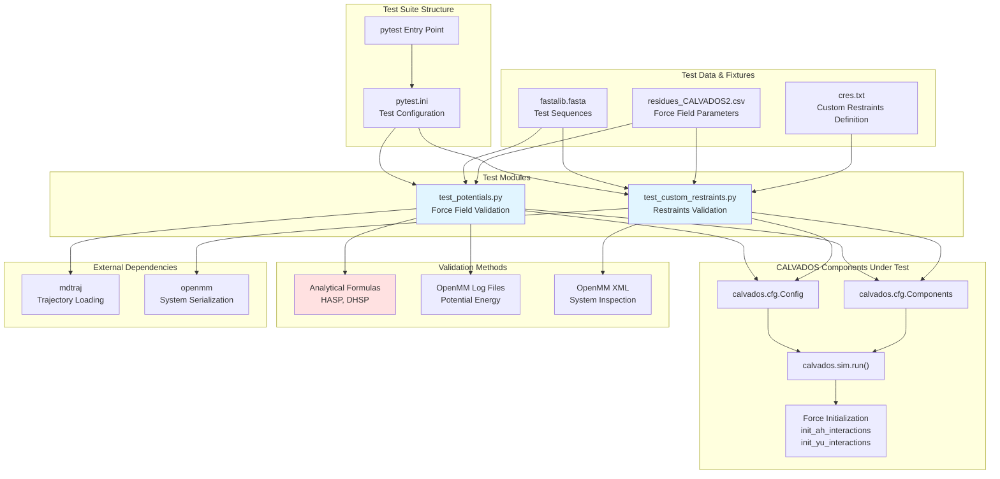
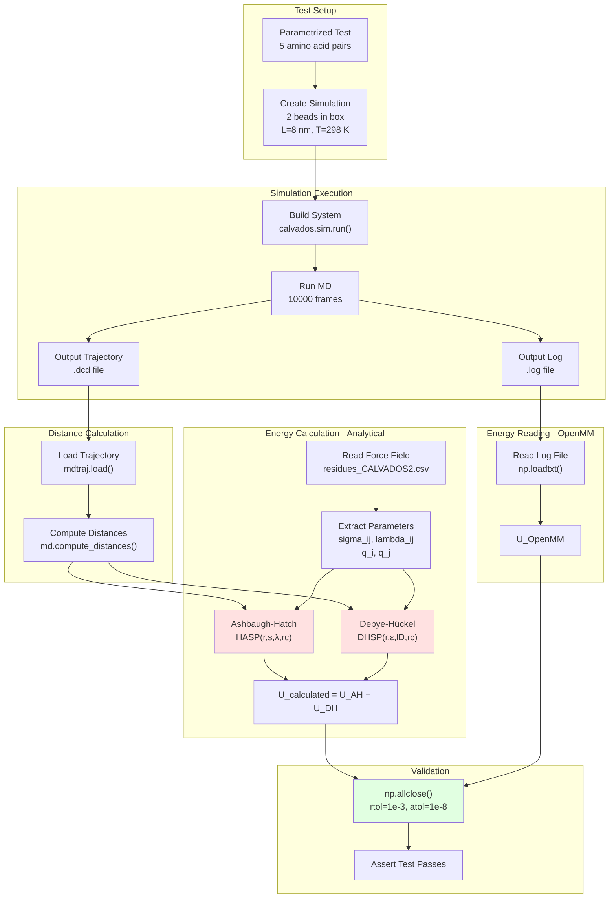
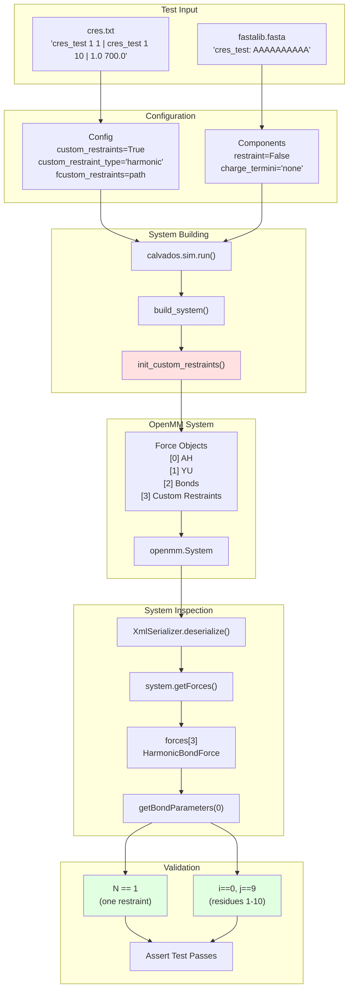

# Testing & Validation

<details>
<summary>Relevant source files</summary>

The following files were used as context for generating this wiki page:

- [README.md](README.md)
- [pytest.ini](pytest.ini)
- [setup.py](setup.py)
- [tests/data/cres.txt](tests/data/cres.txt)
- [tests/data/fastalib.fasta](tests/data/fastalib.fasta)
- [tests/data/residues_C2RNA.csv](tests/data/residues_C2RNA.csv)
- [tests/data/residues_CALVADOS2.csv](tests/data/residues_CALVADOS2.csv)
- [tests/test_custom_restraints.py](tests/test_custom_restraints.py)
- [tests/test_potentials.py](tests/test_potentials.py)

</details>


## Purpose and Scope

This document describes the test suite used to validate CALVADOS functionality. The tests ensure that force field potentials are correctly implemented, that specialized features like custom restraints work as expected, and that the overall simulation system produces reproducible results. The test suite uses pytest and validates computational results against analytical formulas and reference implementations.

For information about force field theory and parameter definitions, see [Force Field & Interaction Potentials](#3.4). For details on restraints implementation, see [Restraints System](#3.5).

## Running the Test Suite

The CALVADOS test suite is executed using pytest:

```bash
python -m pytest
```

The test configuration is defined in [pytest.ini:1-15](), which specifies test paths, import modes, and warning filters. Tests are located in the `tests/` directory and automatically discovered by pytest.

Expected behavior:
- All tests should pass on a correctly installed system
- Tests use CPU platform to ensure reproducibility across different hardware
- Each test creates temporary output in `tests/data/` subdirectories
- Random seeds are fixed to ensure deterministic results

Sources: [README.md:46-52](), [pytest.ini:1-15]()

## Test Architecture Overview



**Test Architecture**: The test suite validates CALVADOS by comparing simulation outputs against independent validation methods. `test_potentials.py` validates force field implementation by comparing OpenMM-computed energies with analytical formulas. `test_custom_restraints.py` validates that custom restraints are correctly added to the OpenMM system by inspecting the serialized system XML.

Sources: [tests/test_potentials.py:1-128](), [tests/test_custom_restraints.py:1-112](), [pytest.ini:1-15]()

## Potential Energy Validation

The `test_potentials.py` module validates that the Ashbaugh-Hatch (AH) and Debye-Hückel (DH) potentials are correctly implemented in OpenMM force objects. This is the primary validation of the force field.

### Test Methodology

The test simulates two free amino acid beads in a periodic box and validates energy calculations:



**Validation Workflow**: The test performs an independent calculation of potential energy using analytical formulas and compares it with OpenMM's internal energy calculations. Agreement within tolerance confirms correct force implementation.

Sources: [tests/test_potentials.py:1-128]()

### Analytical Potential Functions

The test implements reference formulas for both potentials:

**Ashbaugh-Hatch Potential** [tests/test_potentials.py:12-15]():
- `HALR`: Long-range component when r ≥ 2^(1/6)σ
- `HASR`: Short-range component when r < 2^(1/6)σ  
- `HA`: Combined potential
- `HASP`: Shifted potential with cutoff at rc=2 nm

**Debye-Hückel Potential** [tests/test_potentials.py:18-19]():
- `DH`: Yukawa/Debye-Hückel expression
- `DHSP`: Shifted potential with cutoff at rc=4 nm

These formulas are independent implementations that do not rely on CALVADOS code, providing true external validation.

### Test Parameters

The test is parametrized over five amino acid pairs [tests/test_potentials.py:21-30]():

| Pair | Properties Tested |
|------|------------------|
| Y-W | Strong hydrophobic interaction, large σ |
| R-W | Charged-hydrophobic interaction |
| E-D | Charged-charged repulsion (both negative) |
| E-W | Charged-hydrophobic interaction |
| E-R | Charged-charged attraction (opposite signs) |

These pairs cover the parameter space: strong/weak hydrophobicity, positive/negative charges, attraction/repulsion, and various bead sizes.

### Validation Tolerance

The test validates that calculated and OpenMM energies agree to within:
- Relative tolerance: `rtol=1e-3` (0.1%)
- Absolute tolerance: `atol=1e-8` kJ/mol

The assertion [tests/test_potentials.py:126]():
```python
assert np.allclose(u,u_calc,rtol=1e-3,atol=1e-8)
```

Diagnostic output includes maximum relative error and the distance at which it occurs, helping debug any failures.

Sources: [tests/test_potentials.py:12-128]()

### Test Configuration

Each test creates a minimal simulation system [tests/test_potentials.py:56-74]():

| Parameter | Value | Purpose |
|-----------|-------|---------|
| box | [8, 8, 8] nm | Small box for two beads |
| temp | 298 K | Room temperature |
| ionic | 0.15 M | Physiological ionic strength |
| topol | 'grid' | Grid placement |
| wfreq | 10 | Frequent saving for statistics |
| steps | 100000 | 10000 frames for averaging |
| platform | 'CPU' | Reproducibility |
| random_number_seed | 12345 | Determinism |
| report_potential_energy | True | Energy logging enabled |

The components are defined without restraints and with no terminal charges [tests/test_potentials.py:83-93](), ensuring that only the AH and DH potentials contribute to the energy.

Sources: [tests/test_potentials.py:56-93]()

### Physical Constants Calculation

The test independently calculates Debye-Hückel parameters [tests/test_potentials.py:112-118]():

```
RT = 8.3145 × T × 10⁻³  (kJ/mol)
εw = f(T)  (dielectric constant)
lB = e²/(4πε₀εw) × N_A / RT  (Bjerrum length)
lD = 1/√(8πlB × ionic × N_A/10)  (Debye length)
yukawa_eps = q_i × q_j × lB × RT
```

This ensures that the thermodynamic parameters are correctly converted to physical constants, validating the implementation in `calvados.interactions.genParamsDH()`.

Sources: [tests/test_potentials.py:112-119]()

## Custom Restraints Validation

The `test_custom_restraints.py` module validates that custom harmonic restraints specified in external files are correctly applied to the system.

### Custom Restraints Test Workflow



**Custom Restraints Validation**: The test verifies that custom restraints defined in external files are correctly parsed and added to the OpenMM system as harmonic bond forces between the specified residues.

Sources: [tests/test_custom_restraints.py:1-112]()

### Test Setup and Configuration

The test uses a 10-residue alanine sequence with a single custom restraint [tests/data/cres.txt:1]():
```
cres_test 1 1 | cres_test 1 10 | 1.0 700.0
```

This restraint connects:
- Component: `cres_test`, chain 1, residue 1
- Component: `cres_test`, chain 1, residue 10
- Distance: 1.0 nm (equilibrium distance)
- Force constant: 700.0 kJ/(mol·nm²)

The test configuration [tests/test_custom_restraints.py:54-76]() enables custom restraints:
```python
config = Config(
    custom_restraints = True,
    custom_restraint_type = 'harmonic',
    fcustom_restraints = f'{cwd}/tests/data/cres.txt',
    ...
)
```

The component is defined with internal restraints disabled [tests/test_custom_restraints.py:85-93](), so only the custom restraint from the file should be present.

Sources: [tests/test_custom_restraints.py:54-93](), [tests/data/cres.txt:1]()

### System Inspection

The test uses OpenMM's XML serialization to inspect the built system [tests/test_custom_restraints.py:99-107]():

```python
system = openmm.XmlSerializer.deserialize(open(f"{path}/{sysname}.xml").read())
force = system.getForces()[3]  # Custom restraints force
N = force.getNumBonds()
f = force.getBondParameters(0)
i, j = f[0], f[1]
```

The force object at index [3] contains custom restraints (indices [0], [1], [2] are AH, YU, and backbone bonds respectively). The test validates:
- Exactly 1 bond exists: `N == 1`
- Bond connects residues 0 and 9 (0-indexed): `i == 0 and j == 9`

This confirms that the custom restraint was correctly parsed from the text file and applied to the correct residue pair.

Sources: [tests/test_custom_restraints.py:99-108]()

## Test Data Files

The test suite uses several fixture files located in `tests/data/`:

### Force Field Parameters

**residues_CALVADOS2.csv** [tests/data/residues_CALVADOS2.csv:1-22]()
- Standard CALVADOS2 force field parameters
- Used by both test modules
- Contains: one-letter code, three-letter code, MW, lambdas, sigmas, q, bondlength

**residues_C2RNA.csv** [tests/data/residues_C2RNA.csv:1-28]()
- C2RNA force field parameters including RNA residues
- Available for RNA-related tests

### Sequence Definitions

**fastalib.fasta** [tests/data/fastalib.fasta:1-15]()
- Single amino acid sequences for potential tests (Y, E, W, D, R)
- Multi-residue sequence for custom restraints test (AAAAAAAAAA)
- 6-residue arginine test sequence (rrrrrr)

### Custom Restraints

**cres.txt** [tests/data/cres.txt:1]()
- Example custom restraint definition
- Format: `component chain1 res1 | component chain2 res2 | distance force_constant`

Sources: [tests/data/residues_CALVADOS2.csv:1-22](), [tests/data/fastalib.fasta:1-15](), [tests/data/cres.txt:1]()

## Test Coverage Summary

| Test Module | What It Validates | Method |
|-------------|------------------|---------|
| test_potentials.py | Ashbaugh-Hatch potential | Analytical formula vs OpenMM |
| test_potentials.py | Debye-Hückel electrostatics | Analytical formula vs OpenMM |
| test_potentials.py | Physical constants calculation | Independent implementation |
| test_custom_restraints.py | Custom restraint parsing | System inspection |
| test_custom_restraints.py | Restraint application | Bond connectivity check |

### Coverage Gaps

The current test suite does not explicitly validate:
- RNA-specific forces (angle forces, base-base interactions)
- Go-model restraints from PDB structures
- AlphaFold PAE-based restraint weighting
- Lipid forces (cosine angle, charge-nonpolar interactions)
- Multi-component system assembly
- Equilibration modes (slab_eq, box_eq, bilayer_eq)
- Analysis functions in `calvados.analysis`

Users extending CALVADOS should consider adding tests for new features following the patterns established in the existing test suite.

Sources: [tests/test_potentials.py:1-128](), [tests/test_custom_restraints.py:1-112]()

## Adding New Tests

To add new tests to the CALVADOS test suite:

1. **Create test module** in `tests/` directory following naming convention `test_*.py`

2. **Use pytest parametrization** for testing multiple cases:
   ```python
   @pytest.mark.parametrize("param1,param2", [(val1a,val1b), (val2a,val2b)])
   def test_function(param1, param2):
       # test implementation
   ```

3. **Use minimal configurations** to isolate features being tested:
   - Small box sizes to reduce computation
   - Short simulations (10-1000 frames)
   - Fixed random seeds for reproducibility
   - CPU platform for consistency

4. **Implement independent validation**:
   - Analytical formulas (like test_potentials.py)
   - System inspection (like test_custom_restraints.py)
   - Reference data from external sources
   - Conservation laws (energy, momentum for appropriate ensembles)

5. **Add test data** to `tests/data/` as needed with descriptive names

6. **Document the test** with clear assertions and diagnostic output for debugging failures

Sources: [tests/test_potentials.py:21-30](), [tests/test_custom_restraints.py:23-28]()

---