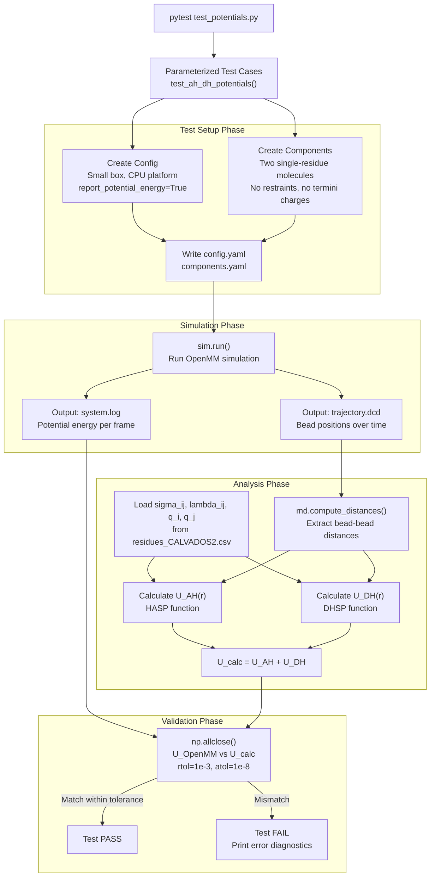
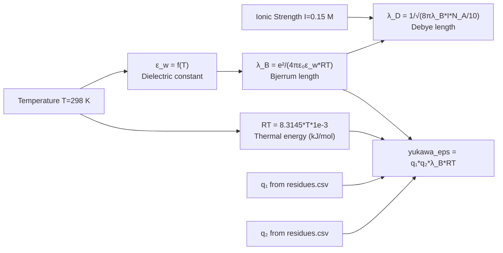
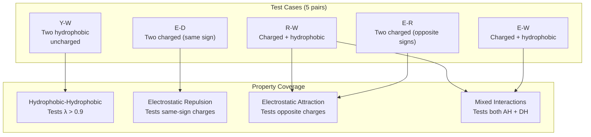
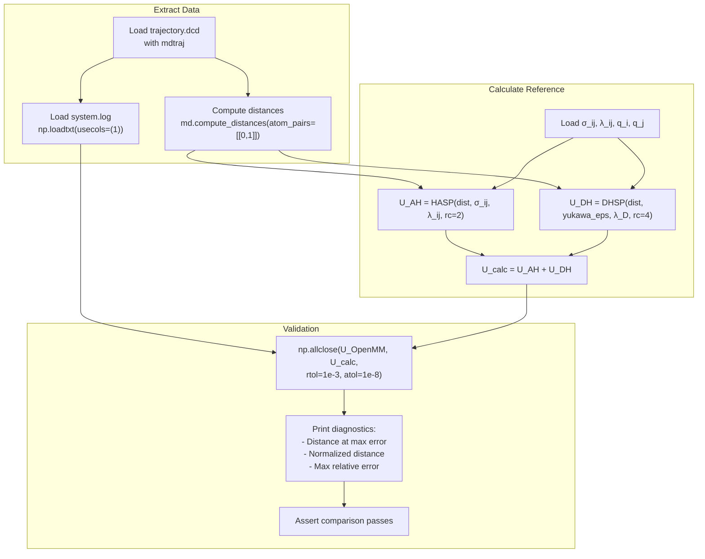
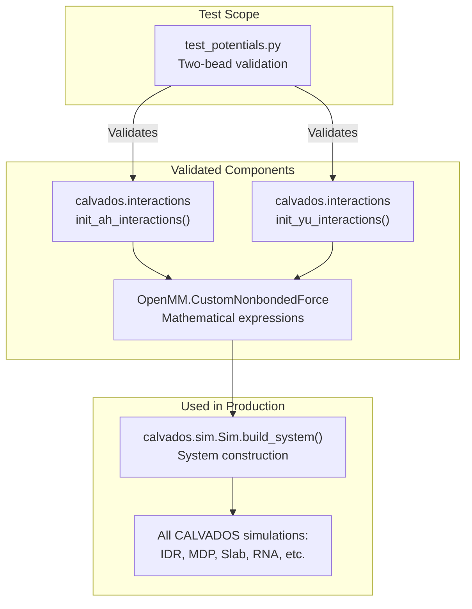

# Potential Energy Tests

<details>
<summary>Relevant source files</summary>

The following files were used as context for generating this wiki page:

- [pytest.ini](pytest.ini)
- [tests/data/residues_CALVADOS2.csv](tests/data/residues_CALVADOS2.csv)
- [tests/test_potentials.py](tests/test_potentials.py)

</details>


## Purpose and Scope

This document describes the validation tests for CALVADOS force field implementations, specifically the Ashbaugh-Hatch (hydrophobic) and Debye-Hückel (electrostatic) potentials. These tests verify that OpenMM's CustomNonbondedForce objects correctly reproduce the theoretical potential energy functions by comparing simulation-reported energies against analytical calculations.

For information about how these potentials are initialized in simulations, see [Force Field & Interaction Potentials](#3.4). For details on force field parameters, see [Residue Parameters Reference](#9.3).

**Sources:** [tests/test_potentials.py:1-128]()

---

## Test Architecture

The potential energy validation system uses a "two-bead simulation" approach where pairs of residues are simulated in a small box, allowing direct comparison between theoretical and computed potential energies.

### Test Workflow Diagram



**Sources:** [tests/test_potentials.py:32-127]()

---

## Analytical Potential Definitions

The test suite defines analytical forms of the CALVADOS potentials as Python lambda functions. These serve as the "ground truth" against which OpenMM's implementation is validated.

### Ashbaugh-Hatch Potential

The Ashbaugh-Hatch potential models hydrophobic interactions with a lambda-dependent Lennard-Jones form:

| Function | Formula | Description |
|----------|---------|-------------|
| `HASR` | `4*0.8368*((σ/r)^12 - (σ/r)^6) + 0.8368*(1-λ)` | Short-range region (r < 2^(1/6)*σ) |
| `HALR` | `4*0.8368*λ*((σ/r)^12 - (σ/r)^6)` | Long-range region (r ≥ 2^(1/6)*σ) |
| `HA` | Piecewise combination of HASR and HALR | Full Ashbaugh-Hatch potential |
| `HASP` | `HA(r) - HA(rc)` for r < rc, else 0 | Shifted potential with cutoff rc=2 nm |

**Key Parameters:**
- `σ` (sigma): Bead diameter in nm
- `λ` (lambda): Hydrophobicity parameter (0 = repulsive, 1 = fully attractive)
- `ε` = 0.8368 kJ/mol: Energy scale
- `rc` = 2 nm: Cutoff distance

**Sources:** [tests/test_potentials.py:12-15]()

### Debye-Hückel Potential

The Debye-Hückel potential models screened electrostatic interactions in solution:

| Function | Formula | Description |
|----------|---------|-------------|
| `DH` | `yukawa_eps * exp(-r/λ_D) / r` | Screened Coulomb potential |
| `DHSP` | `DH(r) - DH(rc)` for r < rc, else 0 | Shifted potential with cutoff rc=4 nm |

**Key Parameters:**
- `yukawa_eps` = q_i * q_j * λ_B * RT (kJ/mol·nm)
- `λ_D`: Debye screening length (nm)
- `λ_B`: Bjerrum length (nm)
- `rc` = 4 nm: Cutoff distance

**Sources:** [tests/test_potentials.py:18-19]()

---

## Parameter Calculation

The test calculates force field parameters using the same formulas as the main simulation code:

### Mixing Rules

For bead pair (i, j):
```
σ_ij = 0.5 * (σ_i + σ_j)
λ_ij = 0.5 * (λ_i + λ_j)
```

**Sources:** [tests/test_potentials.py:108-109]()

### Electrostatic Parameters



**Formulas:**
- **Dielectric constant:** `ε_w(T) = 5321/T + 233.76 - 0.9297*T + 0.1417e-2*T² - 0.8292e-6*T³`
- **Bjerrum length:** `λ_B = e²/(4πε₀ε_w) * N_A / RT` with e=1.6021766, ε₀=8.854188
- **Debye length:** `λ_D = 1/√(8πλ_B*I*N_A/10)` where N_A=6.02214076×10²³

**Sources:** [tests/test_potentials.py:112-117]()

---

## Test Configuration

### Simulation Parameters

The test creates minimal two-bead systems with the following settings:

| Parameter | Value | Purpose |
|-----------|-------|---------|
| `box` | [8, 8, 8] nm | Small cubic box for fast simulation |
| `temp` | 298 K | Room temperature |
| `ionic` | 0.15 M | Physiological ionic strength |
| `topol` | 'grid' | Grid placement of molecules |
| `steps` | 100,000 | 10 ns simulation (dt=0.0001 ps) |
| `wfreq` | 10 | Save every 10 steps (1 ps intervals) |
| `platform` | 'CPU' | CPU platform for reproducibility |
| `report_potential_energy` | True | Enable energy logging |
| `random_number_seed` | 12345 | Fixed seed for reproducibility |

**Sources:** [tests/test_potentials.py:38-74]()

### Component Configuration

Each test adds two single-residue components:

```
components.add(name=resname1, restraint=False, charge_termini='none')
components.add(name=resname2, restraint=False, charge_termini='none')
```

**Key settings:**
- `restraint=False`: No harmonic or Go-model restraints
- `charge_termini='none'`: No additional charges at termini
- `nmol=1`: One molecule of each residue type

This creates a pure test of the non-bonded potentials without complications from restraints or terminal charges.

**Sources:** [tests/test_potentials.py:83-93]()

---

## Test Cases

The test suite is parameterized to validate multiple residue pair combinations:

### Residue Pair Matrix



**Residue Properties:**

| Residue | λ | σ (nm) | q | Property |
|---------|---|--------|---|----------|
| Y (Tyr) | 0.977 | 0.646 | 0 | Highly hydrophobic |
| W (Trp) | 0.989 | 0.678 | 0 | Highly hydrophobic |
| R (Arg) | 0.731 | 0.656 | +1 | Hydrophobic, positive |
| E (Glu) | 0.001 | 0.592 | -1 | Hydrophilic, negative |
| D (Asp) | 0.042 | 0.558 | -1 | Hydrophilic, negative |

**Sources:** [tests/test_potentials.py:21-30](), [tests/data/residues_CALVADOS2.csv:1-22]()

---

## Validation Methodology

### Distance-Energy Comparison

The validation workflow extracts distances and energies from the simulation, then compares:



**Sources:** [tests/test_potentials.py:97-126]()

### Tolerance Criteria

The assertion uses NumPy's `allclose` function with strict tolerances:

```python
np.allclose(u, u_calc, rtol=1e-3, atol=1e-8)
```

**Tolerance meanings:**
- `rtol=1e-3`: Relative tolerance of 0.1% (for large energy values)
- `atol=1e-8`: Absolute tolerance of 1e-8 kJ/mol (for near-zero energies)

This ensures that energy differences are negligible across the full range of distances sampled during the simulation.

**Sources:** [tests/test_potentials.py:126]()

---

## Error Diagnostics

When validation fails, the test prints diagnostic information to help identify the source of discrepancy:

### Diagnostic Output

```python
print('Distance of max abs error:', dist[abs_err.argmax()])
print('Distance of max abs error / sigma_ij:', dist[abs_err.argmax()]/sigma_ij)
print('Max Relative Error:', (abs_err[u_abs>0]/u_abs[u_abs>0]).max())
```

**Diagnostics provided:**
1. **Absolute distance** where maximum error occurs
2. **Normalized distance** (r/σ_ij) to identify potential issues in specific regions (e.g., short-range, long-range)
3. **Maximum relative error** excluding zero-energy frames

This helps distinguish between:
- Short-range issues (r/σ < 1): Numerical precision in steep repulsive region
- Cutoff issues (r ≈ rc): Potential shifting or cutoff implementation
- Parameter issues: Wrong σ, λ, or q values

**Sources:** [tests/test_potentials.py:121-125]()

---

## Running the Tests

### Pytest Execution

To run all potential energy tests:

```bash
pytest tests/test_potentials.py -v
```

To run a specific residue pair:

```bash
pytest tests/test_potentials.py::test_ah_dh_potentials[Y-W] -v
```

### Configuration

The pytest configuration is defined in `pytest.ini`:

| Setting | Value | Purpose |
|---------|-------|---------|
| `testpaths` | tests | Search for tests in tests/ directory |
| `--import-mode` | importlib | Use importlib for module imports |
| `-r a` | Show all test outcomes |
| `-v` | Verbose output |

**Sources:** [pytest.ini:1-15]()

---

## Test Data Files

### Required Files

The tests require the following data files:

| File | Location | Purpose |
|------|----------|---------|
| `residues_CALVADOS2.csv` | tests/data/ | Force field parameters (σ, λ, q) |
| `fastalib.fasta` | tests/data/ | Single-letter residue sequences |

### Residue Parameters

The `residues_CALVADOS2.csv` file provides the force field parameters used in both the test calculations and the actual simulation:

**Format:**
```
one,three,MW,lambdas,sigmas,q,bondlength
R,ARG,156.19,0.730762476752,0.656,1,0.38
E,GLU,129.11,0.000693546096,0.592,-1,0.38
...
```

**Columns used in tests:**
- `one`: Single-letter amino acid code
- `lambdas`: Hydrophobicity parameter λ
- `sigmas`: Bead diameter σ (nm)
- `q`: Electric charge (elementary charge units)

**Sources:** [tests/test_potentials.py:53-54](), [tests/data/residues_CALVADOS2.csv:1-22]()

---

## Integration with CALVADOS

### Validation Coverage

These tests validate the core non-bonded interactions that underpin all CALVADOS simulations:



**Sources:** [tests/test_potentials.py:1-128]()

### What is NOT Tested

These tests do **not** validate:
- Bond forces (handled by OpenMM's HarmonicBondForce)
- Restraint forces (harmonic and Go-model)
- Specialized forces (RNA angles, lipid cosine, base-base)
- Multi-bead systems with many-body effects
- Periodic boundary effects
- Integration accuracy

For testing custom restraints, see [Custom Restraints Tests](#8.2).

---

## Summary

The `test_potentials.py` module provides rigorous validation of CALVADOS force field implementation by:

1. **Defining analytical potentials** as lambda functions (ground truth)
2. **Running minimal two-bead simulations** with energy reporting
3. **Computing reference energies** from trajectory distances and force field parameters
4. **Comparing OpenMM-reported energies** against analytical calculations
5. **Asserting strict tolerances** (rtol=1e-3, atol=1e-8)

This validation ensures that the coarse-grained force field is correctly implemented in OpenMM and matches the theoretical definitions, providing confidence in all downstream CALVADOS simulations.

**Sources:** [tests/test_potentials.py:1-128]()

---