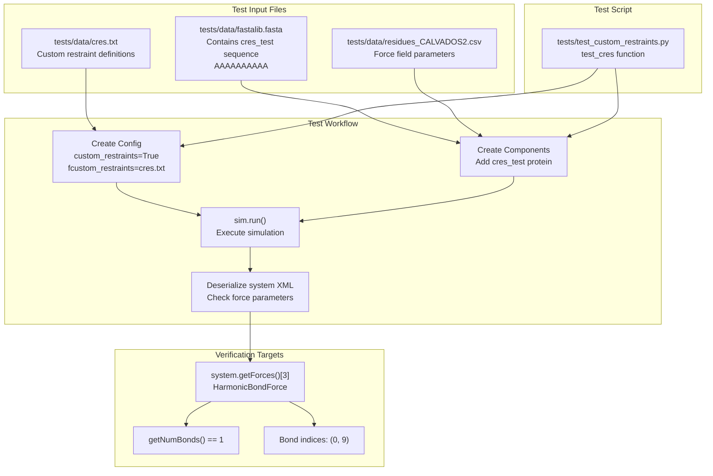
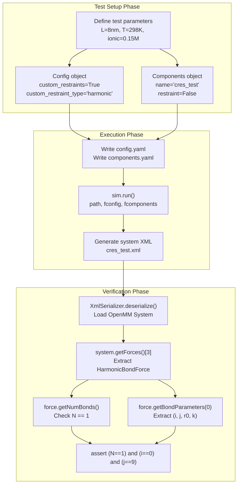
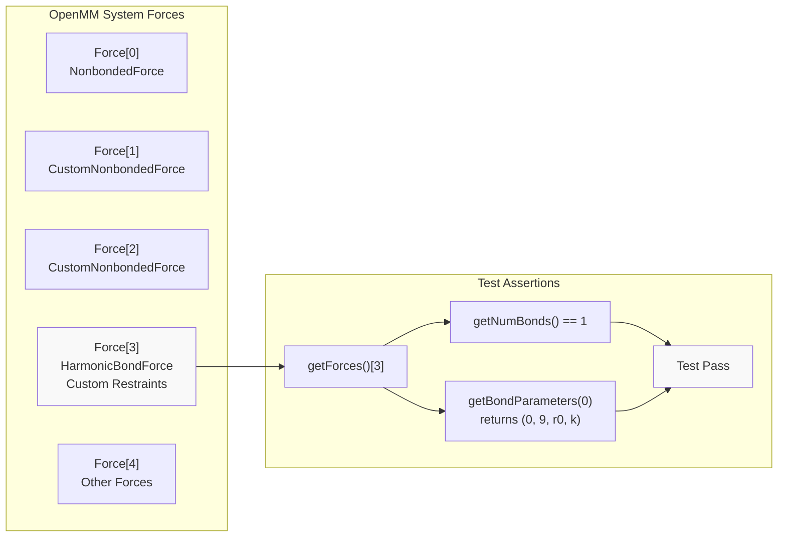
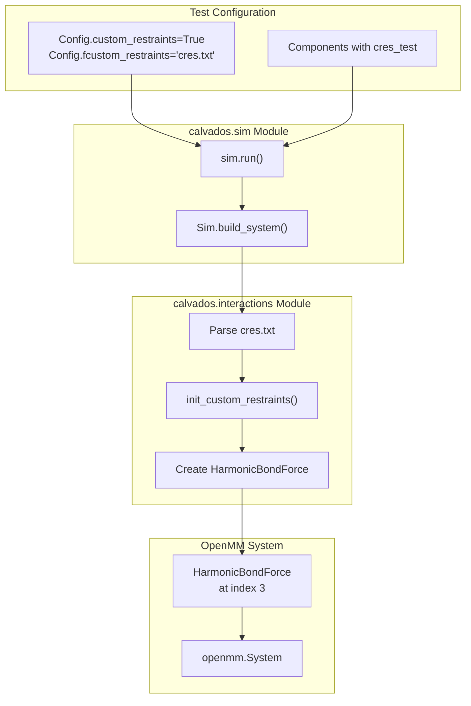

# Custom Restraints Tests

<details>
<summary>Relevant source files</summary>

The following files were used as context for generating this wiki page:

- [tests/data/cres.txt](tests/data/cres.txt)
- [tests/data/fastalib.fasta](tests/data/fastalib.fasta)
- [tests/data/residues_C2RNA.csv](tests/data/residues_C2RNA.csv)
- [tests/test_custom_restraints.py](tests/test_custom_restraints.py)

</details>


This page documents the test suite that validates custom restraint functionality in CALVADOS. These tests ensure that user-defined harmonic restraints specified via `cres.txt` files are correctly interpreted and implemented in the OpenMM system.

For information about using custom restraints in simulations, see [Custom Restraints](#6.1). For general testing overview, see [Testing & Validation](#8).

## Purpose and Scope

The custom restraints test suite validates that:
- Custom restraint files (`cres.txt`) are correctly parsed
- Restraints are applied between the specified residue pairs
- The correct number of restraint forces are created in the OpenMM system
- Force parameters (equilibrium distance, force constant) are correctly assigned

Sources: [tests/test_custom_restraints.py:1-112]()

## Test File Structure



**Test File Organization Diagram**

Sources: [tests/test_custom_restraints.py:30-112](), [tests/data/fastalib.fasta:13-14](), [tests/data/cres.txt:1]()

## Custom Restraint File Format

The `cres.txt` file defines custom harmonic restraints between residue pairs. Each line specifies one restraint using the following format:

| Field | Description | Example |
|-------|-------------|---------|
| Molecule 1 | `molname chain residue` | `cres_test 1 1` |
| Separator | Pipe character | `\|` |
| Molecule 2 | `molname chain residue` | `cres_test 1 10` |
| Separator | Pipe character | `\|` |
| Equilibrium Distance | Distance in nm | `1.0` |
| Force Constant | Spring constant in kJ/(mol·nm²) | `700.0` |

### Example Restraint Definition

```
cres_test 1 1 | cres_test 1 10 | 1.0 700.0
```

This line creates a harmonic restraint between:
- Residue 1 of chain 1 in molecule `cres_test`
- Residue 10 of chain 1 in molecule `cres_test`
- With equilibrium distance of 1.0 nm
- With force constant of 700.0 kJ/(mol·nm²)

Sources: [tests/data/cres.txt:1]()

## Test Implementation



**Test Execution Flow Diagram**

Sources: [tests/test_custom_restraints.py:30-108]()

### Test Function: `test_cres`

The main test function [tests/test_custom_restraints.py:30-108]() follows this workflow:

1. **Configuration Setup** [tests/test_custom_restraints.py:54-76]()
   - Creates `Config` object with `custom_restraints=True`
   - Sets `custom_restraint_type='harmonic'`
   - Specifies `fcustom_restraints` path to `cres.txt`
   - Uses small system: 8×8×8 nm box, 10 frames

2. **Component Definition** [tests/test_custom_restraints.py:85-93]()
   - Creates `Components` object with single molecule
   - Adds `cres_test` protein (10 alanines)
   - Disables standard restraints (`restraint=False`)
   - Uses `charge_termini='none'`

3. **Simulation Execution** [tests/test_custom_restraints.py:97]()
   - Calls `sim.run()` to build system and run simulation
   - Generates system XML file

4. **Verification** [tests/test_custom_restraints.py:99-107]()
   - Deserializes OpenMM system from XML
   - Extracts force at index 3 (custom restraint `HarmonicBondForce`)
   - Verifies exactly 1 bond exists
   - Verifies bond connects particles 0 and 9

Sources: [tests/test_custom_restraints.py:30-108]()

## Particle Indexing

For the test molecule `cres_test` with sequence `AAAAAAAAAA` (10 alanines):

| Residue Number | Particle Index | Amino Acid |
|----------------|----------------|------------|
| 1 | 0 | A |
| 2 | 1 | A |
| 3 | 2 | A |
| 4 | 3 | A |
| 5 | 4 | A |
| 6 | 5 | A |
| 7 | 6 | A |
| 8 | 7 | A |
| 9 | 8 | A |
| 10 | 9 | A |

The custom restraint `cres_test 1 1 | cres_test 1 10` creates a harmonic bond between particle 0 (residue 1) and particle 9 (residue 10), effectively constraining the end-to-end distance of the peptide.

Sources: [tests/data/fastalib.fasta:13-14](), [tests/data/cres.txt:1]()

## Assertion Logic



**Assertion Verification Diagram**

The test makes three critical assertions [tests/test_custom_restraints.py:107]():

1. **`N == 1`**: Exactly one custom restraint bond exists
2. **`i == 0`**: First particle in the bond is index 0 (residue 1)
3. **`j == 9`**: Second particle in the bond is index 9 (residue 10)

This confirms that the `cres.txt` file was correctly parsed and the restraint was applied to the correct particle pair.

Sources: [tests/test_custom_restraints.py:99-107]()

## Running the Test

The test uses pytest parametrization [tests/test_custom_restraints.py:23-28]() to enable easy extension to multiple test cases.

### Command Line Execution

```bash
pytest tests/test_custom_restraints.py::test_cres
```

### Test Configuration Parameters

| Parameter | Value | Purpose |
|-----------|-------|---------|
| `sysname` | `"cres_test"` | Identifies test system |
| `L` | `8` nm | Box size |
| `temp` | `298` K | Temperature |
| `ionic` | `0.15` M | Ionic strength |
| `N_save` | `10` steps | Output frequency |
| `N_frames` | `10` | Total frames |
| `platform` | `"CPU"` | OpenMM platform |
| `random_number_seed` | `12345` | Reproducibility |

Sources: [tests/test_custom_restraints.py:36-71]()

## Helper Function: `bond_check`

The test file includes a helper function `bond_check` [tests/test_custom_restraints.py:13-21]() that was originally designed for RNA bond validation. This function is commented out in the current test [tests/test_custom_restraints.py:109-112]() but demonstrates a pattern for validating bond topology in multi-bead systems:

```python
def bond_check(i: int, j: int):
    """ Define bonded term conditions. """
    condition0 = (i%2 == 0) # phosphate
    condition1 = (j == i+2) # phosphate -- phosphate
    condition2 = (j == i+1) # phosphate -- base
    condition = condition0 and (condition1 or condition2)
    return condition
```

This could be extended for more complex custom restraint validation scenarios.

Sources: [tests/test_custom_restraints.py:13-21]()

## Integration with CALVADOS Build System



**Integration with Core CALVADOS System**

The test validates the complete pipeline from configuration to OpenMM force creation. When `custom_restraints=True`, the simulation builder:

1. Reads the `cres.txt` file specified in `fcustom_restraints`
2. Parses restraint definitions (molecule, chain, residue pairs)
3. Maps residue numbers to particle indices
4. Creates a `HarmonicBondForce` with specified parameters
5. Adds the force to the OpenMM system

Sources: [tests/test_custom_restraints.py:54-98]()

## Test Output Files

The test generates several output files in the `tests/data/cres_test/` directory:

| File | Description |
|------|-------------|
| `config.yaml` | Serialized configuration parameters |
| `components.yaml` | Serialized component definitions |
| `cres_test.xml` | OpenMM system serialization |
| `cres_test.dcd` | Trajectory file (10 frames) |
| `cres_test.log` | Simulation log |
| `top.pdb` | Topology file |

The test specifically validates the system by deserializing `cres_test.xml` [tests/test_custom_restraints.py:99]().

Sources: [tests/test_custom_restraints.py:79-97]()

## Extending the Test Suite

The parametrization decorator [tests/test_custom_restraints.py:23-28]() allows easy addition of new test cases:

```python
@pytest.mark.parametrize(
    ("name"),
    [
        ("cres_test"),
        # Add new test cases here:
        # ("multi_chain_test"),
        # ("long_distance_test"),
    ],
)
def test_cres(name):
    # Test implementation
```

To add a new test case:
1. Add sequence to `tests/data/fastalib.fasta`
2. Create corresponding `cres_*.txt` file with restraint definitions
3. Add test name to parametrization list
4. Update assertion logic if needed

Sources: [tests/test_custom_restraints.py:23-28]()

---