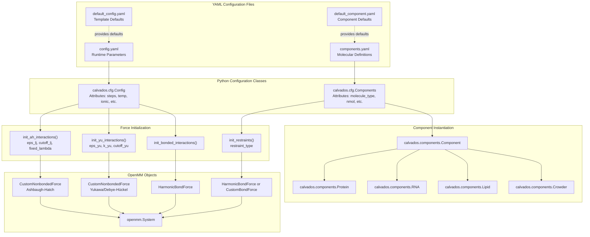
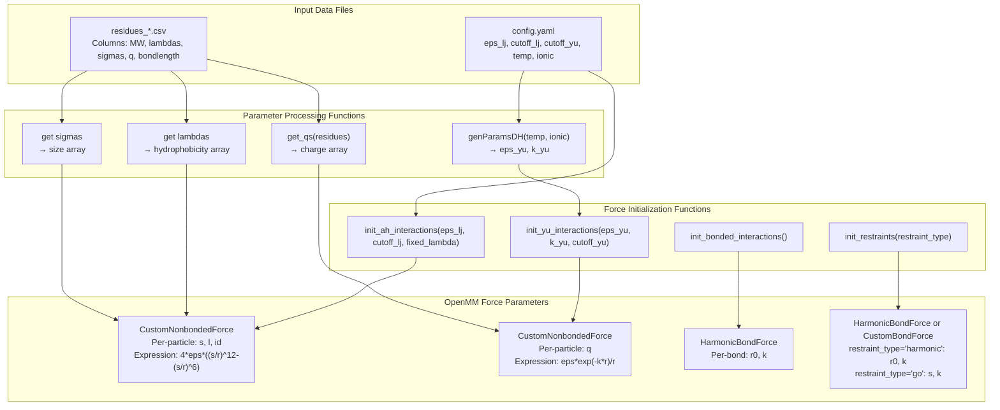
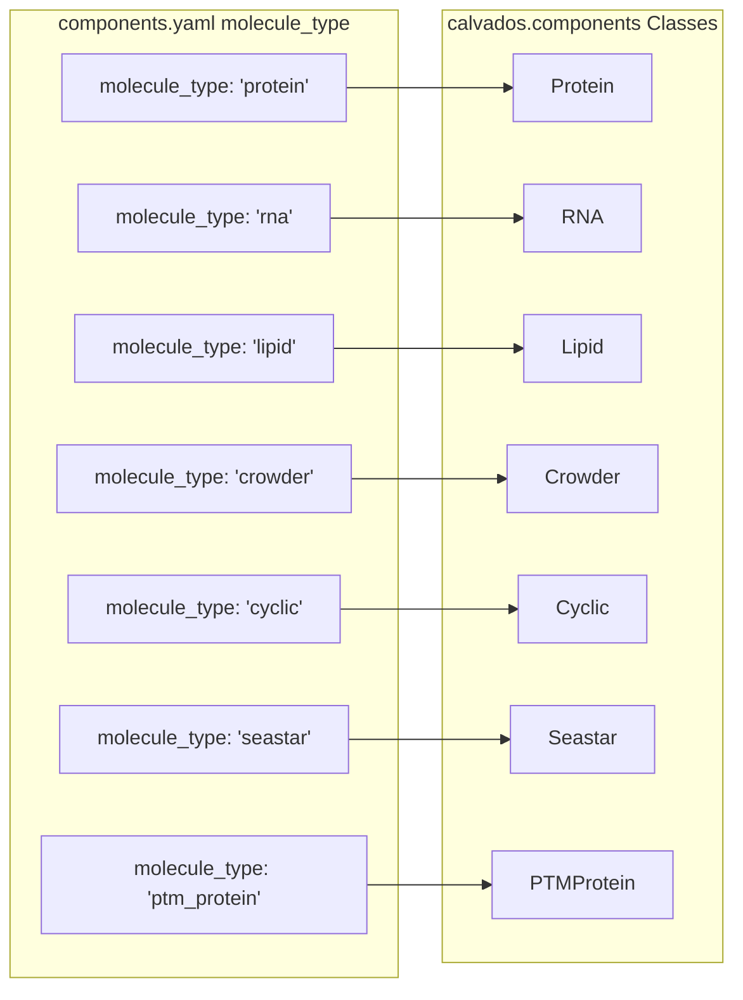

# Reference

<details>
<summary>Relevant source files</summary>

The following files were used as context for generating this wiki page:

- [calvados/data/default_component.yaml](calvados/data/default_component.yaml)
- [calvados/data/default_config.yaml](calvados/data/default_config.yaml)
- [calvados/interactions.py](calvados/interactions.py)

</details>


## Purpose and Scope

This page provides a quick reference guide for CALVADOS configuration parameters, file formats, and API conventions. It is designed for users who need to quickly look up parameter names, understand file format requirements, or verify API conventions without reading through detailed documentation.

For detailed explanations of individual parameters:
- Configuration file parameters: see [Configuration File Reference](#9.1)
- Component configuration parameters: see [Component Configuration Reference](#9.2)  
- Force field residue parameters: see [Residue Parameters Reference](#9.3)
- Input/output file format specifications: see [File Format Specifications](#9.4)

For conceptual understanding of the configuration system, see [Simulation Setup & Configuration](#2).

---

## Configuration System Architecture

The following diagram shows how configuration files map to Python classes and ultimately to OpenMM simulation objects:



**Sources:** [calvados/data/default_config.yaml:1-40](), [calvados/data/default_component.yaml:1-37](), [calvados/interactions.py:17-60]()

---

## Parameter Name Mapping

### Configuration Parameters (config.yaml → Code)

The following table maps YAML parameter names to their usage in Python code:

| YAML Parameter | Python Usage | Purpose | Type | Location |
|----------------|--------------|---------|------|----------|
| `sysname` | `cfg.sysname` | System name for output files | string | config.yaml |
| `topol` | `cfg.topol` | Molecule placement topology | string | config.yaml |
| `eps_lj` | `cfg.eps_lj` | Ashbaugh-Hatch epsilon | float (kJ/mol) | config.yaml → interactions.py |
| `cutoff_lj` | `cfg.cutoff_lj` | AH potential cutoff distance | float (nm) | config.yaml → interactions.py |
| `cutoff_yu` | `cfg.cutoff_yu` | Yukawa potential cutoff | float (nm) | config.yaml → interactions.py |
| `fixed_lambda` | `cfg.fixed_lambda` | Override lambda mixing rule | float (0-1) | config.yaml → interactions.py |
| `temp` | `cfg.temp` | Temperature for genParamsDH | float (K) | config.yaml → interactions.py:4 |
| `ionic` | `cfg.ionic` | Ionic strength for genParamsDH | float (M) | config.yaml → interactions.py:4 |
| `steps` | `cfg.steps` | Total simulation steps | integer | config.yaml |
| `wfreq` | `cfg.wfreq` | Trajectory write frequency | integer | config.yaml |
| `platform` | `cfg.platform` | OpenMM platform ('CPU', 'CUDA', 'OpenCL') | string | config.yaml |
| `friction_coeff` | `cfg.friction_coeff` | Langevin integrator friction | float (ps⁻¹) | config.yaml |
| `slab_eq` | `cfg.slab_eq` | Enable slab equilibration restraints | boolean | config.yaml |
| `box_eq` | `cfg.box_eq` | Enable box size equilibration | boolean | config.yaml |
| `k_eq` | `cfg.k_eq` | Equilibration restraint force constant | float (kJ/mol/nm) | config.yaml |
| `custom_restraints` | `cfg.custom_restraints` | Enable custom restraint file | boolean | config.yaml |
| `fcustom_restraints` | `cfg.fcustom_restraints` | Custom restraint filename | string | config.yaml |

**Sources:** [calvados/data/default_config.yaml:1-40]()

### Component Parameters (components.yaml → Code)

| YAML Parameter | Python Usage | Purpose | Type | Location |
|----------------|--------------|---------|------|----------|
| `molecule_type` | `comp_dict['molecule_type']` | Component class selector | string | components.yaml |
| `nmol` | `comp_dict['nmol']` | Number of molecules | integer | components.yaml |
| `ffasta` | `comp_dict['ffasta']` | FASTA file path | string | components.yaml |
| `charge_termini` | `comp_dict['charge_termini']` | Terminal charge mode ('both', 'N', 'C', 'none') | string | components.yaml |
| `alpha` | `comp_dict['alpha']` | Lipid polarizability parameter | float | components.yaml |
| `kb` | `comp_dict['kb']` | Bond force constant | float (kJ/mol/nm²) | components.yaml |
| `restraint` | `comp_dict['restraint']` | Enable intra-molecular restraints | boolean | components.yaml |
| `restraint_type` | `comp_dict['restraint_type']` | Restraint potential type ('harmonic', 'go') | string | components.yaml → interactions.py:87 |
| `k_harmonic` | `comp_dict['k_harmonic']` | Harmonic restraint strength | float (kJ/mol/nm²) | components.yaml |
| `k_go` | `comp_dict['k_go']` | Go-model restraint strength | float (kJ/mol) | components.yaml |
| `cutoff_restr` | `comp_dict['cutoff_restr']` | Distance cutoff for restraints | float (nm) | components.yaml |
| `fdomains` | `comp_dict['fdomains']` | Domains YAML file path | string | components.yaml |
| `pdb_folder` | `comp_dict['pdb_folder']` | Directory containing PDB files | string | components.yaml |
| `use_com` | `comp_dict['use_com']` | Use center-of-mass for restraints | boolean | components.yaml |
| `periodic` | `comp_dict['periodic']` | Apply PBC to restraints | boolean | components.yaml |
| `colabfold` | `comp_dict['colabfold']` | ColabFold weighting mode | integer (0-2) | components.yaml |
| `bfac_shift` | `comp_dict['bfac_shift']` | B-factor sigmoid shift | float | components.yaml |
| `bfac_width` | `comp_dict['bfac_width']` | B-factor sigmoid width | float | components.yaml |
| `pae_shift` | `comp_dict['pae_shift']` | PAE sigmoid shift | float | components.yaml |
| `pae_width` | `comp_dict['pae_width']` | PAE sigmoid width | float | components.yaml |
| `rna_kb1` | `comp_dict['rna_kb1']` | RNA backbone bond strength | float (kJ/mol/nm²) | components.yaml |
| `rna_ka` | `comp_dict['rna_ka']` | RNA angle force constant | float (kJ/mol/rad²) | components.yaml |
| `rna_pa` | `comp_dict['rna_pa']` | RNA equilibrium angle | float (radians) | components.yaml |

**Sources:** [calvados/data/default_component.yaml:1-37]()

---

## Force Field Parameter Flow

This diagram shows how force field parameters flow from data files through initialization functions to OpenMM forces:



**Sources:** [calvados/interactions.py:4-15](), [calvados/interactions.py:26-44](), [calvados/interactions.py:46-60](), [calvados/interactions.py:87-98]()

---

## Force Expressions and Their Parameters

### Ashbaugh-Hatch Potential

The AH potential is implemented as a `CustomNonbondedForce` with the following expression:

```
eps*select(step(r-2^(1/6)*s), 4*l*((s/r)^12-(s/r)^6-shift), 4*((s/r)^12-(s/r)^6-l*shift)+(1-l))
```

**Per-particle parameters:**
- `s` (sigma): particle size from residues CSV
- `l` (lambda): hydrophobicity scale (0=hydrophilic, 1=hydrophobic) from residues CSV
- `id`: particle identifier for mixing rules

**Global parameters:**
- `eps` = `eps_lj` from config.yaml (default: 0.2 kJ/mol)
- `rc` = `cutoff_lj` from config.yaml (default: 2.0 nm)
- `shift` = (s/rc)^12 - (s/rc)^6

**Mixing rules:**
- `s = 0.5*(s1+s2)` (arithmetic mean)
- `l = 0.5*(l1+l2)` if id1*id2 ≠ 0, else `fixed_lambda` parameter

**Sources:** [calvados/interactions.py:26-44]()

### Yukawa/Debye-Hückel Potential

The electrostatic potential is implemented as a `CustomNonbondedForce`:

```
q*eps_yu*(exp(-k_yu*r)/r - shift)
```

**Per-particle parameters:**
- `q`: particle charge from residues CSV (with terminal modifications)

**Global parameters:**
- `eps_yu`: computed from temperature via `genParamsDH()` using dielectric constant
- `k_yu` (kappa): inverse Debye length, computed from ionic strength
- `shift` = exp(-k_yu*rc)/rc for continuity at cutoff

**Physical relationships:**
- Bjerrum length: `lB = e²/(4πε₀εᵣkT)`
- `eps_yu = lB * kT`
- Debye length: `λD = 1/κ`
- `k_yu = sqrt(8πlB*I*NA/10)` where I is ionic strength in M

**Sources:** [calvados/interactions.py:4-15](), [calvados/interactions.py:46-60]()

### Restraint Potentials

**Harmonic restraints** (restraint_type='harmonic'):
```
k * (r - r0)²
```
- `r0`: equilibrium distance from PDB or domains file
- `k`: `k_harmonic` from components.yaml (default: 700 kJ/mol/nm²)

**Go-model restraints** (restraint_type='go'):
```
k * (5*(s/r)^12 - 6*(s/r)^10)
```
- `s`: native distance from PDB
- `k`: `k_go` from components.yaml (default: 15 kJ/mol)

**Sources:** [calvados/interactions.py:87-98](), [calvados/interactions.py:135-150]()

---

## File Type Quick Reference

| File Type | Purpose | Format | Typical Location | Related Page |
|-----------|---------|--------|------------------|--------------|
| `config.yaml` | Simulation runtime parameters | YAML | Generated by prepare.py | [9.1](#9.1) |
| `components.yaml` | Molecular component definitions | YAML | Generated by prepare.py | [9.2](#9.2) |
| `residues_*.csv` | Force field parameters per residue | CSV | calvados/data/ | [9.3](#9.3) |
| `*.fasta` | Protein/RNA sequences | FASTA | User-provided | [9.4](#9.4) |
| `*.pdb` | Protein structures for restraints | PDB | User-provided | [9.4](#9.4) |
| `domains.yaml` | Structured region definitions | YAML | User-provided | [9.4](#9.4) |
| `*.json` (PAE) | AlphaFold confidence metrics | JSON | User-provided | [9.4](#9.4) |
| `custom_restraints.txt` | Custom restraint pairs | Text | User-provided | [9.4](#9.4) |
| `*.dcd` | Trajectory output | Binary DCD | Simulation output | [9.4](#9.4) |
| `top.pdb` | System topology | PDB | Simulation output | [9.4](#9.4) |
| `restart.chk` | Simulation checkpoint | Binary | Simulation output | [9.4](#9.4) |

**Sources:** [calvados/data/default_config.yaml:1-40](), [calvados/data/default_component.yaml:1-37]()

---

## Common Parameter Patterns

### Temperature and Ionic Strength

These parameters always appear together and determine electrostatic screening:

```yaml
# config.yaml
temp: 300  # Kelvin
ionic: 0.15  # Molar
```

These are passed to `genParamsDH(temp, ionic)` which returns:
- `eps_yu`: electrostatic prefactor (kJ·nm/mol)
- `k_yu`: inverse Debye length (nm⁻¹)

Higher ionic strength → larger `k_yu` → shorter screening length.

**Sources:** [calvados/interactions.py:4-15]()

### Force Cutoffs

Three independent cutoff distances control interaction ranges:

```yaml
# config.yaml
cutoff_lj: 2.0   # Ashbaugh-Hatch cutoff (nm)
cutoff_yu: 4.0   # Yukawa/Debye-Hückel cutoff (nm)
```

For RNA systems, additional parameters control base-base interactions:
```yaml
# components.yaml (molecule_type: 'rna')
rna_nb_cutoff: 0.6  # Base-base interaction cutoff (nm)
```

**Sources:** [calvados/data/default_config.yaml:6-8](), [calvados/data/default_component.yaml:30-32]()

### Restraint Configuration Hierarchy

Restraints are controlled by a hierarchy of settings:

```yaml
# components.yaml
restraint: true                # Enable restraints (boolean)
restraint_type: 'harmonic'     # Type: 'harmonic' or 'go'
cutoff_restr: 0.9              # Distance cutoff (nm)
k_harmonic: 700.0              # Force constant for harmonic (kJ/mol/nm²)
k_go: 15.0                     # Force constant for Go-model (kJ/mol)
use_com: true                  # Center-of-mass distance vs. atomic
periodic: false                # Apply PBC to restraint distances
```

If `restraint=false`, all other restraint parameters are ignored.

**Sources:** [calvados/data/default_component.yaml:9-18]()

### AlphaFold Confidence Weighting

When using AlphaFold structures, restraint strengths can be weighted by confidence:

```yaml
# components.yaml
colabfold: 1                   # 0=pLDDT only, 1=PAE only, 2=both
bfac_shift: 0.8                # pLDDT sigmoid center
bfac_width: 50.0               # pLDDT sigmoid width
pae_shift: 0.3                 # PAE sigmoid center (nm)
pae_width: 15.0                # PAE sigmoid width (nm)
```

The weighting function is: `w = sigmoid(confidence, shift, width)`
where higher confidence → weight closer to 1.0.

**Sources:** [calvados/data/default_component.yaml:20-24]()

---

## Equilibration Modes

CALVADOS supports several equilibration schemes controlled by boolean flags:

| Mode | Parameter | Purpose | Typical Use Case |
|------|-----------|---------|------------------|
| Slab equilibration | `slab_eq: true` | Restrain molecules to slab center in z | Phase separation with slab topology |
| Box equilibration | `box_eq: true` | Allow box size to change | NPT-like ensemble |
| Bilayer equilibration | `bilayer_eq: true` | Restrain lipid bilayer structure | Membrane simulations |
| Pressure coupling | `pressure_coupling: true` | Apply pressure in specific directions | Anisotropic box scaling |

All modes use the same force constant parameter:
```yaml
k_eq: 0.02  # Equilibration restraint strength (kJ/mol/nm)
```

**Sources:** [calvados/data/default_config.yaml:19-26]()

---

## Molecule Type to Component Class Mapping



**Inheritance hierarchy:**
- All classes inherit from `Component` base class
- `Cyclic`, `Seastar`, `PTMProtein` inherit from `Protein`
- Each class adds specialized initialization logic

**Sources:** [calvados/data/default_component.yaml:2]()

---

## Topology Placement Options

The `topol` parameter in config.yaml controls initial molecule placement:

| Topology Value | Description | Typical Box Requirement | Use Case |
|----------------|-------------|-------------------------|----------|
| `'center'` | All molecules at box center | Any | Single molecule studies |
| `'grid'` | Regular 3D grid | Cubic or rectangular | Multiple non-interacting molecules |
| `'random'` | Random positions | Any | Crowded environments |
| `'slab'` | Molecules in center slab | Elongated z-dimension | Phase separation |
| `'bilayer'` | Lipid bilayer at z center | Elongated z-dimension | Membrane simulations |

**Example:**
```yaml
# config.yaml
topol: 'slab'
box: [10, 10, 40]  # Elongated in z for slab
```

**Sources:** [calvados/data/default_config.yaml:3]()

---

## Platform and Performance Parameters

```yaml
# config.yaml
platform: 'CUDA'           # 'CPU', 'CUDA', 'OpenCL', 'Reference'
threads: 1                 # CPU threads (ignored for GPU platforms)
gpu_id: 0                  # GPU device index for CUDA/OpenCL
```

**Performance notes:**
- `'CPU'`: Use for debugging, small systems, or when GPU unavailable
- `'CUDA'`: Best performance on NVIDIA GPUs
- `'OpenCL'`: Cross-platform GPU support
- `'Reference'`: Very slow, for validation only

**Sources:** [calvados/data/default_config.yaml:12-13](), [calvados/data/default_config.yaml:36]()

---

## Checkpoint and Restart

```yaml
# config.yaml
restart: 'checkpoint'      # Restart mode: 'checkpoint' or 'continue'
frestart: 'restart.chk'    # Checkpoint file name
```

**Restart modes:**
- `restart='checkpoint'`: Read checkpoint and continue from that state
- Other values: Start new simulation

The checkpoint file stores complete simulation state (positions, velocities, RNG state).

**Sources:** [calvados/data/default_config.yaml:15-16]()

---

## Output Control Parameters

```yaml
# config.yaml
steps: 100000000           # Total integration steps
wfreq: 100000              # Write trajectory every N steps
logfreq: 1000000           # Write log file every N steps
report_potential_energy: false  # Log detailed energy breakdown
verbose: false             # Print detailed progress
```

**Output files generated:**
- `{sysname}.dcd`: Trajectory at `wfreq` intervals
- `{sysname}.log`: Energy/state data at `logfreq` intervals
- `restart.chk`: Checkpoint at `wfreq` intervals
- `top.pdb`: System topology (written once)

**Sources:** [calvados/data/default_config.yaml:10-17](), [calvados/data/default_config.yaml:34-35]()

---

## Custom Restraints System

Custom restraints allow user-specified atom pairs to be restrained:

```yaml
# config.yaml
custom_restraints: true
custom_restraint_type: 'harmonic'  # 'harmonic' or 'go'
fcustom_restraints: 'custom_restraints.txt'
```

The restraint file format is documented in [File Format Specifications](#9.4).

**Sources:** [calvados/data/default_config.yaml:38-40]()

---

## RNA-Specific Parameters

When `molecule_type: 'rna'`, additional parameters control the two-bead RNA model:

```yaml
# components.yaml
rna_kb1: 8033.0          # Backbone bond (5'-3') force constant (kJ/mol/nm²)
rna_kb2: 8033.0          # Backbone bond (5'-base) force constant (kJ/mol/nm²)
rna_ka: 7.24             # Backbone angle force constant (kJ/mol/rad²)
rna_pa: 3.14             # Equilibrium backbone angle (radians, ~180°)
rna_nb_sigma: 0.4        # Base bead size (nm)
rna_nb_scale: 15         # Base-base interaction strength scale
rna_nb_cutoff: 0.6       # Base-base interaction cutoff (nm)
```

**Physical interpretation:**
- Strong bonds (`kb1`, `kb2` ≈ 8000) keep RNA backbone rigid
- `ka` controls flexibility around phosphate backbone
- `rna_nb_*` parameters define base stacking/pairing

**Sources:** [calvados/data/default_component.yaml:26-32]()

---

## Summary: Most Frequently Used Parameters

For quick reference, these parameters are modified in >80% of simulations:

**Essential config.yaml parameters:**
```yaml
temp: 300              # Temperature (K)
ionic: 0.15           # Ionic strength (M)
steps: 100000000      # Run length
box: [10, 10, 10]     # Box dimensions (nm)
topol: 'center'       # Molecule placement
```

**Essential components.yaml parameters:**
```yaml
molecule_type: 'protein'   # Component type
nmol: 1                    # Number of copies
ffasta: 'sequence.fasta'   # Sequence file
restraint: false           # Enable structure restraints
```

For complete parameter listings and detailed descriptions, see child pages [9.1](#9.1) through [9.4](#9.4).

---