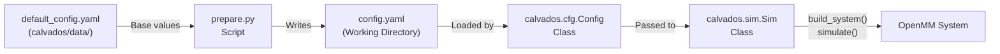
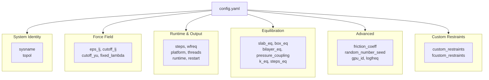
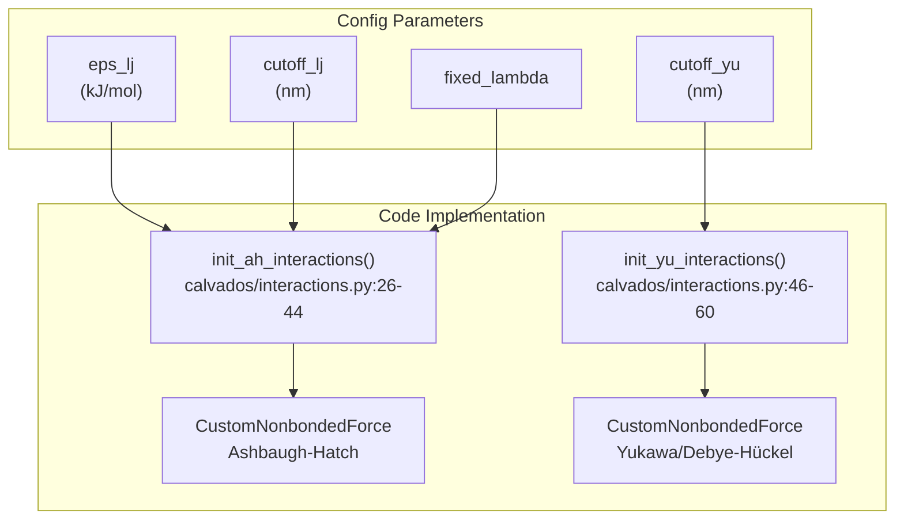
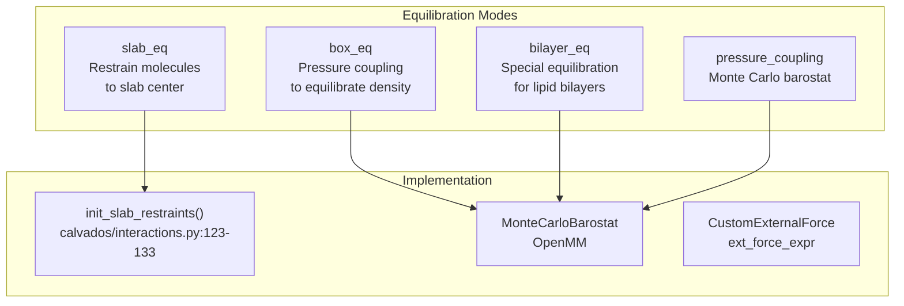
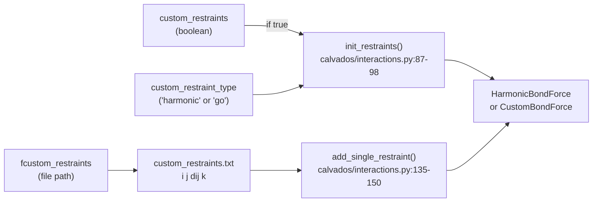
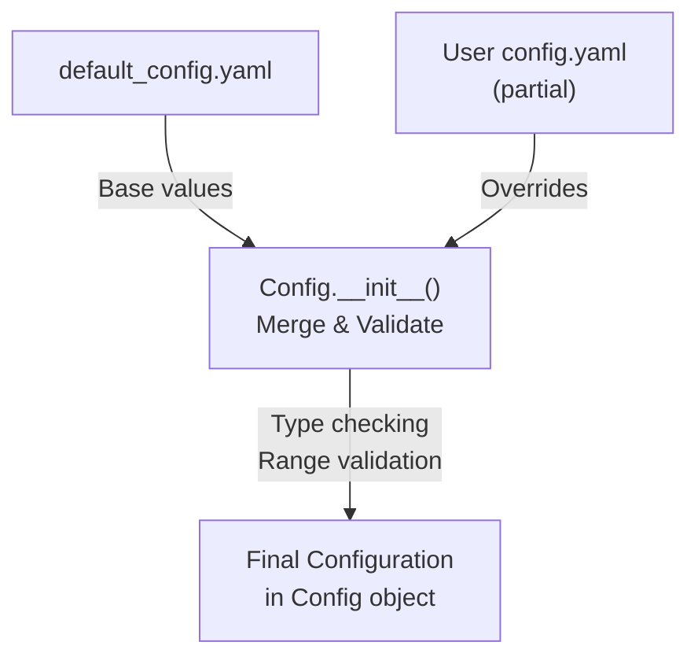

# Configuration File Reference

<details>
<summary>Relevant source files</summary>

The following files were used as context for generating this wiki page:

- [calvados/data/default_config.yaml](calvados/data/default_config.yaml)
- [calvados/interactions.py](calvados/interactions.py)

</details>


This page provides a complete reference for all parameters available in `config.yaml`, the primary configuration file for CALVADOS simulations. Each parameter is documented with its purpose, default value, valid options, and units where applicable.

For information about the `Config` class that loads and validates these parameters, see [Config Class - Simulation Parameters](#2.1). For component-specific configuration, see [Component Configuration Reference](#9.2). For examples of how to generate config files using preparation scripts, see [Preparation Scripts (prepare.py)](#2.3).

## Overview

The `config.yaml` file controls all aspects of simulation execution including force field parameters, runtime settings, equilibration protocols, and output options. The file uses YAML format and is typically generated by a `prepare.py` script, which starts from default values in [calvados/data/default_config.yaml:1-40]() and overrides specific parameters based on the simulation type.

### Configuration Lifecycle



Sources: [calvados/data/default_config.yaml:1-40]()

### Parameter Categories



Sources: [calvados/data/default_config.yaml:1-40]()

## System Identity Parameters

These parameters define the simulation name and initial molecular placement strategy.

| Parameter | Type | Default | Description |
|-----------|------|---------|-------------|
| `sysname` | string | `'default_simulation'` | Name of the simulation system. Used as prefix for output files. |
| `topol` | string | `'center'` | Initial topology/placement strategy. Options: `'center'`, `'grid'`, `'slab'`, `'random'` |

**Details:**

- **`sysname`**: All output files (trajectories, logs, checkpoints) will be prefixed with this name. For example, `sysname: 'my_protein'` produces `my_protein.dcd`, `my_protein.log`, etc.

- **`topol`**: Controls how molecules are initially placed in the simulation box:
  - `'center'`: All molecules at box center (default for single component systems)
  - `'grid'`: Molecules arranged on a grid
  - `'slab'`: Molecules arranged in a slab geometry (for phase separation studies)
  - `'random'`: Random placement throughout the box

Sources: [calvados/data/default_config.yaml:2-3]()

## Force Field Parameters

These parameters control the strength and range of non-bonded interactions using the Ashbaugh-Hatch and Debye-Hückel/Yukawa potentials.



Sources: [calvados/data/default_config.yaml:5-8](), [calvados/interactions.py:26-60]()

| Parameter | Type | Default | Units | Description |
|-----------|------|---------|-------|-------------|
| `eps_lj` | float | `0.2` | kJ/mol | Energy scale for Ashbaugh-Hatch potential (hydrophobic interactions) |
| `cutoff_lj` | float | `2.0` | nm | Cutoff distance for Ashbaugh-Hatch interactions |
| `cutoff_yu` | float | `4.0` | nm | Cutoff distance for Yukawa/Debye-Hückel electrostatic interactions |
| `fixed_lambda` | float | `0` | dimensionless | Fixed lambda value for inter-molecular interactions (0 = use per-residue values) |

**Details:**

- **`eps_lj`**: Sets the energy scale ε for the Ashbaugh-Hatch potential. Standard value is 0.2 kJ/mol. Higher values strengthen hydrophobic interactions. See [calvados/interactions.py:30]() for the potential expression.

- **`cutoff_lj`**: Beyond this distance, Ashbaugh-Hatch interactions are truncated. The potential is shifted to zero at the cutoff. Typical value is 2.0 nm.

- **`cutoff_yu`**: Cutoff for electrostatic interactions. Longer than `cutoff_lj` because electrostatics are longer-ranged. The Yukawa potential is shifted to zero at this distance. See [calvados/interactions.py:49-50]() for shift calculation.

- **`fixed_lambda`**: When non-zero, overrides per-residue lambda values for inter-molecular interactions. Useful for testing uniform hydrophobicity. When 0 (default), uses lambda values from `residues.csv` via the mixing rule: λ_ij = 0.5*(λ_i + λ_j). See [calvados/interactions.py:32]() for implementation.

Sources: [calvados/data/default_config.yaml:5-8](), [calvados/interactions.py:26-60]()

## Runtime & Output Parameters

These parameters control simulation duration, output frequency, computational platform, and restart behavior.

| Parameter | Type | Default | Units | Description |
|-----------|------|---------|-------|-------------|
| `steps` | integer | `100000000` | steps | Total number of MD steps to simulate |
| `wfreq` | integer | `100000` | steps | Frequency for writing trajectory frames |
| `platform` | string | `'CPU'` | - | OpenMM platform: `'CPU'`, `'CUDA'`, `'OpenCL'`, `'Reference'` |
| `threads` | integer | `1` | - | Number of CPU threads (only for CPU platform) |
| `runtime` | integer | `0` | hours | Maximum wall-clock runtime (0 = no limit) |
| `restart` | string | `'checkpoint'` | - | Restart mode: `'checkpoint'`, `'continue'`, or `null` |
| `frestart` | string | `'restart.chk'` | - | Checkpoint file name for restart |
| `verbose` | boolean | `false` | - | Enable verbose output during simulation |

**Details:**

- **`steps`**: With default timestep (typically 10 fs), 100 million steps = 1 μs of simulation time.

- **`wfreq`**: Controls trajectory file size vs. temporal resolution. Writing every 100,000 steps with 10 fs timestep = 1 ns between frames.

- **`platform`**: 
  - `'CPU'`: Runs on CPU cores (use `threads` to control parallelism)
  - `'CUDA'`: Runs on NVIDIA GPU (fastest option, use `gpu_id` to select device)
  - `'OpenCL'`: Runs on GPU or CPU via OpenCL
  - `'Reference'`: Slow but highly accurate reference implementation

- **`threads`**: Only affects CPU platform. Set to number of physical cores for best performance.

- **`runtime`**: Useful for cluster environments with time limits. Simulation will checkpoint and exit gracefully before exceeding this time. Hours are approximate.

- **`restart`**: 
  - `'checkpoint'`: Load positions and velocities from checkpoint file
  - `'continue'`: Continue existing simulation (appends to trajectory)
  - `null`: Start fresh simulation

- **`frestart`**: Path to checkpoint file (`.chk` format). Created by previous simulation for restart capability.

Sources: [calvados/data/default_config.yaml:10-17]()

## Equilibration Parameters

These parameters control special equilibration protocols for slab geometries, pressure coupling, and external forces.



Sources: [calvados/data/default_config.yaml:19-28](), [calvados/interactions.py:123-133]()

| Parameter | Type | Default | Units | Description |
|-----------|------|---------|-------|-------------|
| `slab_eq` | boolean | `false` | - | Enable slab equilibration restraints |
| `bilayer_eq` | boolean | `false` | - | Enable bilayer equilibration mode |
| `pressure_coupling` | boolean | `false` | - | Enable pressure coupling (barostat) |
| `box_eq` | boolean | `false` | - | Enable box equilibration with pressure coupling |
| `pressure` | array | `[0,0,0]` | bar | Target pressure for each axis (x, y, z) |
| `boxscaling_xyz` | array | `[true,true,true]` | - | Allow box scaling in each dimension |
| `k_eq` | float | `0.02` | kJ/(mol·nm) | Force constant for slab equilibration restraints |
| `steps_eq` | integer | `1000` | steps | Number of equilibration steps before production |
| `ext_force` | boolean | `false` | - | Enable custom external force |
| `ext_force_expr` | string | `'step(d2-18)*d2; d2=periodicdistance(x, y, z, 0, 0, z)^2'` | - | Mathematical expression for external force |

**Details:**

- **`slab_eq`**: When enabled, applies harmonic restraints pulling molecules toward the slab center in the z-direction. Used during initial equilibration of phase separation simulations. See [calvados/interactions.py:123-133]() for implementation using `CustomExternalForce`.

- **`bilayer_eq`**: Special mode for lipid bilayer systems. Typically combined with `pressure_coupling`.

- **`pressure_coupling`**: Enables OpenMM `MonteCarloBarostat` to maintain constant pressure. Volume fluctuates to achieve target density.

- **`box_eq`**: Shorthand for enabling pressure coupling with density equilibration. Often used at start of production runs.

- **`pressure`**: Target pressure for each dimension. Common values:
  - `[0,0,0]`: No pressure (NVT ensemble)
  - `[1,1,1]`: 1 bar isotropic pressure (NPT ensemble)
  - `[1,1,0]`: Constant pressure in xy plane, fixed z (slab systems)

- **`boxscaling_xyz`**: Controls which dimensions can change during pressure coupling. For slab systems, typically `[true,true,false]` to prevent z-compression.

- **`k_eq`**: Force constant for slab restraints. Higher values = stronger confinement to slab center. Units: kJ/(mol·nm).

- **`steps_eq`**: Initial equilibration period before main production run. Energy minimization and/or special restraints may be applied.

- **`ext_force`**: Enables arbitrary external force defined by `ext_force_expr`. Advanced feature for custom potentials.

- **`ext_force_expr`**: OpenMM custom force expression. Default expression applies quadratic restraint when distance squared from z-axis exceeds 18 nm². Variables available: `x, y, z` (particle coordinates).

Sources: [calvados/data/default_config.yaml:19-28](), [calvados/interactions.py:123-133]()

## Advanced Parameters

These parameters control low-level simulation settings, random number generation, logging, and GPU selection.

| Parameter | Type | Default | Units | Description |
|-----------|------|---------|-------|-------------|
| `friction_coeff` | float | `0.01` | ps⁻¹ | Friction coefficient for Langevin integrator |
| `slab_width` | float | `100` | nm | Width of slab region for slab topology |
| `slab_outer` | float | `40` | nm | Width of outer buffer regions for slab |
| `random_number_seed` | integer/null | `null` | - | Seed for random number generator (null = random) |
| `report_potential_energy` | boolean | `false` | - | Report potential energy in log file |
| `logfreq` | integer | `1000000` | steps | Frequency for writing state data to log file |
| `gpu_id` | integer | `0` | - | GPU device ID for CUDA platform |

**Details:**

- **`friction_coeff`**: Controls damping in Langevin dynamics. Units are inverse picoseconds (ps⁻¹). Higher values = stronger coupling to heat bath = faster equilibration but less accurate dynamics. Default 0.01 ps⁻¹ = 100 ps damping time.

- **`slab_width`**: For `topol: 'slab'`, defines the z-dimension extent where molecules are initially placed. Total box z-dimension = `slab_width + 2*slab_outer`.

- **`slab_outer`**: Buffer regions above and below slab for observing evaporation/condensation. Should be large enough to contain dilute phase.

- **`random_number_seed`**: 
  - `null` (default): Uses system time for non-reproducible but statistically independent runs
  - Integer value: Reproducible trajectories for testing/debugging

- **`report_potential_energy`**: When `true`, writes detailed force group energies to log file. Useful for debugging force field but increases I/O overhead.

- **`logfreq`**: How often to write state information (time, temperature, potential energy, kinetic energy) to log file. More frequent = larger log files but better temporal resolution for monitoring.

- **`gpu_id`**: When using `platform: 'CUDA'`, selects which GPU device to use. Important for multi-GPU systems. Query available devices with OpenMM utilities.

Sources: [calvados/data/default_config.yaml:30-36]()

## Custom Restraints Parameters

These parameters enable user-defined distance restraints between specific residue pairs via an external file.



Sources: [calvados/data/default_config.yaml:38-40](), [calvados/interactions.py:87-150]()

| Parameter | Type | Default | Description |
|-----------|------|---------|-------------|
| `custom_restraints` | boolean | `false` | Enable custom restraints from file |
| `custom_restraint_type` | string | `'harmonic'` | Type of restraint: `'harmonic'` or `'go'` |
| `fcustom_restraints` | string | `'custom_restraints.txt'` | Path to restraints file |

**Details:**

- **`custom_restraints`**: When `true`, reads restraint definitions from file specified by `fcustom_restraints`. Useful for imposing specific structural constraints beyond automatic Go-model restraints.

- **`custom_restraint_type`**: 
  - `'harmonic'`: V = k*(r - r₀)² harmonic spring
  - `'go'`: V = k*(5*(r₀/r)¹² - 6*(r₀/r)¹⁰) Go-model potential (attractive well)

- **`fcustom_restraints`**: Text file format (whitespace-separated):
  ```
  i j dij k
  ```
  Where:
  - `i, j`: Residue indices (0-based)
  - `dij`: Target distance (nm)
  - `k`: Force constant (kJ/mol/nm² for harmonic, kJ/mol for Go)

  Example file:
  ```
  0 10 1.2 500
  5 15 0.8 300
  ```

For more details on restraints systems, see [Restraints System](#3.5) and [Custom Restraints](#6.1).

Sources: [calvados/data/default_config.yaml:38-40](), [calvados/interactions.py:87-150]()

## Parameter Validation & Defaults

The `calvados.cfg.Config` class validates all parameters and provides sensible defaults:



Sources: [calvados/data/default_config.yaml:1-40]()

### Default Value Loading

1. `calvados.cfg.Config` loads [calvados/data/default_config.yaml:1-40]() as baseline
2. User-provided `config.yaml` overrides specific parameters
3. Unspecified parameters retain default values
4. Invalid values raise validation errors

### Common Validation Rules

- `steps`, `wfreq`, `logfreq`: Must be positive integers
- `eps_lj`, `cutoff_lj`, `cutoff_yu`: Must be positive floats
- `platform`: Must be in `['CPU', 'CUDA', 'OpenCL', 'Reference']`
- `topol`: Must be in `['center', 'grid', 'slab', 'random']`
- `pressure`: Must be 3-element array
- `boxscaling_xyz`: Must be 3-element boolean array

## Configuration Examples

### Minimal IDR Simulation

```yaml
sysname: 'my_idr'
topol: 'center'
steps: 50000000
wfreq: 50000
platform: 'CUDA'
```

All other parameters use defaults from [calvados/data/default_config.yaml:1-40]().

### Slab Phase Separation

```yaml
sysname: 'phase_sep'
topol: 'slab'
slab_eq: true
k_eq: 0.02
steps_eq: 5000
slab_width: 100
slab_outer: 40
steps: 100000000
wfreq: 100000
platform: 'CUDA'
gpu_id: 0
```

### NPT Equilibration

```yaml
sysname: 'npt_equilibration'
box_eq: true
pressure_coupling: true
pressure: [1, 1, 1]
boxscaling_xyz: [true, true, true]
steps: 10000000
wfreq: 10000
```

### Production with Custom Restraints

```yaml
sysname: 'restrained_protein'
custom_restraints: true
custom_restraint_type: 'go'
fcustom_restraints: 'my_restraints.txt'
steps: 200000000
wfreq: 200000
report_potential_energy: true
logfreq: 100000
```

## Related Configuration

- **Component definitions**: See [Component Configuration Reference](#9.2)
- **Force field parameters**: See [Residue Parameters Reference](#9.3)
- **Embedded analysis**: `config.yaml` can include analysis code to be executed post-simulation (see [Trajectory Analysis](#5))
- **Config class API**: See [Config Class - Simulation Parameters](#2.1)

## Configuration File Location

The `config.yaml` file should be placed in the working directory where the simulation will run. The simulation execution script (typically generated by a prepare.py script) loads this file using:

```python
from calvados.cfg import Config
cfg = Config('config.yaml')
```

Checkpoint and output files are written to the same directory.

Sources: [calvados/data/default_config.yaml:1-40](), [calvados/interactions.py:1-211]()

---