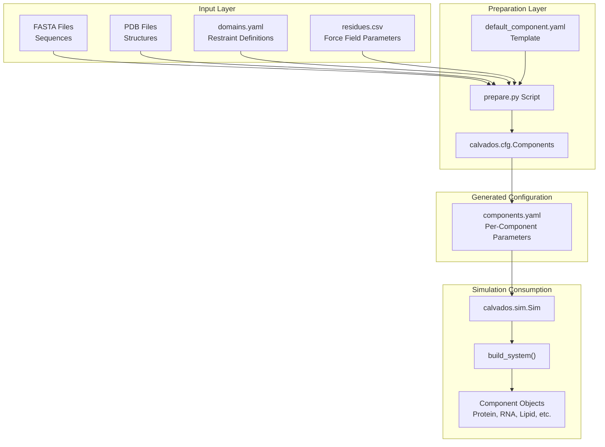
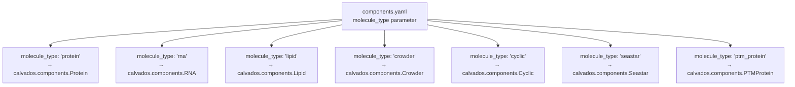
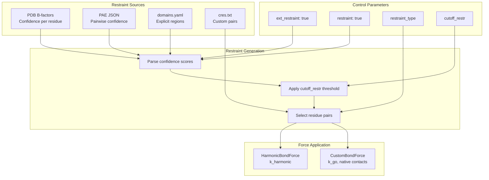
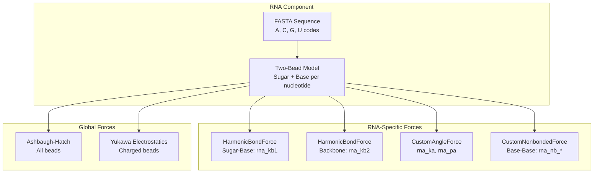
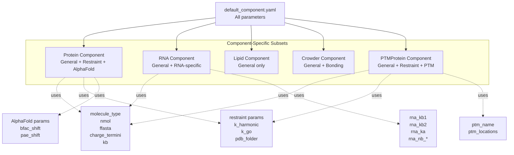

# Component Configuration Reference

<details>
<summary>Relevant source files</summary>

The following files were used as context for generating this wiki page:

- [calvados/data/default_component.yaml](calvados/data/default_component.yaml)

</details>


## Purpose and Scope

This reference documents all parameters that can be specified in `components.yaml` files to define individual molecular components in CALVADOS simulations. Each entry in a `components.yaml` file corresponds to one molecular component (protein, RNA, lipid, crowder, etc.) and controls its properties, interactions, restraints, and simulation behavior.

For information about simulation-level parameters (box size, temperature, runtime, etc.), see [Configuration File Reference](#9.1). For the programmatic API used to construct components, see [Components Class - Molecular Definitions](#2.2). For the Component class hierarchy and specialized component types, see [Component Class Hierarchy](#3.1).

**Sources:** [calvados/data/default_component.yaml:1-37]()

---

## Overview

### What is components.yaml?

The `components.yaml` file defines all molecular entities in a CALVADOS simulation. It is typically generated by a `prepare.py` script that reads input data (FASTA sequences, PDB structures, force field parameters) and outputs a structured YAML file. The CALVADOS simulation engine reads this file to instantiate `Component` objects that represent molecules.

### File Structure

Each top-level key in `components.yaml` is a unique component identifier. Each component contains a dictionary of parameters:

```yaml
my_protein:
  molecule_type: 'protein'
  nmol: 10
  ffasta: 'protein.fasta'
  restraint: true
  pdb_folder: 'structures'

my_rna:
  molecule_type: 'rna'
  nmol: 5
  ffasta: 'rna.fasta'
```

### Parameter Flow Diagram



**Sources:** [calvados/data/default_component.yaml:1-37]()

---

## General Molecule Properties

These parameters define the basic identity and quantity of each molecular component.

| Parameter | Type | Default | Description |
|-----------|------|---------|-------------|
| `molecule_type` | string | `'protein'` | Type of molecule. Valid values: `'protein'`, `'rna'`, `'lipid'`, `'crowder'`, `'cyclic'`, `'seastar'`, `'ptm_protein'` |
| `nmol` | integer | `1` | Number of molecules of this component to include in the system |
| `ffasta` | string | `'fastabib.fasta'` | Path to FASTA file containing the sequence for this component. For proteins, standard one-letter codes. For RNA, nucleotide codes |
| `alpha` | float | `0` | Alpha parameter for component. Used in certain specialized component types |

### molecule_type Values

The `molecule_type` parameter determines which `Component` subclass is instantiated:



**Sources:** [calvados/data/default_component.yaml:2-6]()

---

## Charge and Termini Configuration

| Parameter | Type | Default | Description |
|-----------|------|---------|-------------|
| `charge_termini` | string | `'both'` | Controls terminal charges on the polypeptide chain. Options: `'both'` (N- and C-termini charged), `'N'` (only N-terminus), `'C'` (only C-terminus), `'none'` (no terminal charges) |

Terminal charges affect the electrostatic properties of the molecule. In the coarse-grained model, charged termini contribute to the total charge distribution used in Yukawa/Debye-Hückel electrostatics calculations.

**Sources:** [calvados/data/default_component.yaml:4]()

---

## Bonding Parameters

| Parameter | Type | Default | Description |
|-----------|------|---------|-------------|
| `kb` | float | `8033.0` | Harmonic bond force constant in kJ/(mol·nm²). Controls the stiffness of covalent bonds between adjacent residues |

The `kb` parameter applies to standard backbone bonds in proteins and crowders. RNA components use separate bond constants (`rna_kb1`, `rna_kb2`).

**Sources:** [calvados/data/default_component.yaml:7]()

---

## Restraint Configuration

Restraints maintain structural integrity by applying harmonic or Go-model potentials between specific residue pairs. These parameters control restraint generation and application.

### General Restraint Parameters

| Parameter | Type | Default | Description |
|-----------|------|---------|-------------|
| `ext_restraint` | boolean | `true` | Enable external restraint definition. When `true`, restraints are read from PDB B-factors, PAE files, or domains.yaml |
| `restraint` | boolean | `false` | Apply restraints to this component. Must be `true` to enable any restraint system |
| `cutoff_restr` | float | `0.9` | Cutoff threshold for restraint generation. Interpretation depends on `restraint_type` and confidence score normalization |
| `pdb_folder` | string | `'pdbs'` | Directory containing PDB structure files for this component |
| `fdomains` | string | `'domains.yaml'` | Path to domains.yaml file specifying structured regions and their restraint parameters |
| `use_com` | boolean | `true` | Use center-of-mass distance for restraints instead of bead-to-bead distance |
| `periodic` | boolean | `false` | Apply periodic boundary conditions to restraints |

### Restraint Type Parameters

| Parameter | Type | Default | Description |
|-----------|------|---------|-------------|
| `restraint_type` | string | `'harmonic'` | Type of restraint potential. Options: `'harmonic'` (simple harmonic springs), `'go'` (Go-model with native structure), `'custom'` (user-defined restraints) |
| `k_harmonic` | float | `700.0` | Force constant for harmonic restraints in kJ/(mol·nm²). Used when `restraint_type='harmonic'` |
| `k_go` | float | `15.0` | Force constant for Go-model restraints in kJ/(mol·nm²). Used when `restraint_type='go'` |

### Restraint Parameter Flow



**Sources:** [calvados/data/default_component.yaml:9-18]()

---

## AlphaFold Integration Parameters

These parameters control how AlphaFold/ColabFold confidence metrics are converted into restraint strengths.

| Parameter | Type | Default | Description |
|-----------|------|---------|-------------|
| `colabfold` | integer | `0` | ColabFold mode indicator. `0` = not ColabFold, `1` = ColabFold predictions (affects how PAE is interpreted) |
| `bfac_shift` | float | `0.8` | Shift parameter for B-factor to confidence conversion. Higher values make more residues pass the confidence threshold |
| `bfac_width` | float | `50.0` | Width parameter for B-factor sigmoid transformation. Controls steepness of confidence transition |
| `pae_shift` | float | `0.3` | Shift parameter for PAE (Predicted Aligned Error) to confidence conversion |
| `pae_width` | float | `15.0` | Width parameter for PAE sigmoid transformation. Lower values create sharper confidence boundaries |

### Confidence Score Transformations

AlphaFold outputs two confidence metrics:
1. **pLDDT scores** (stored in PDB B-factor column): per-residue confidence (0-100)
2. **PAE matrix** (JSON file): pairwise confidence in Ångstroms

These are transformed using sigmoid functions:

```
confidence_bfac = 1 / (1 + exp(-(bfac - bfac_shift*100) / bfac_width))
confidence_pae = 1 / (1 + exp((pae - pae_shift*30) / pae_width))
```

Residue pairs with combined confidence > `cutoff_restr` receive restraints.

**Sources:** [calvados/data/default_component.yaml:20-24]()

---

## RNA-Specific Parameters

When `molecule_type='rna'`, these parameters control the two-bead-per-nucleotide RNA model and its specialized force field.

### RNA Bonding Parameters

| Parameter | Type | Default | Description |
|-----------|------|---------|-------------|
| `rna_kb1` | float | `8033.0` | Bond force constant for sugar-base bonds within a nucleotide (kJ/(mol·nm²)) |
| `rna_kb2` | float | `8033.0` | Bond force constant for backbone bonds between consecutive nucleotides (kJ/(mol·nm²)) |
| `rna_ka` | float | `7.24` | Angle force constant for sugar-base-sugar angles (kJ/(mol·rad²)) |
| `rna_pa` | float | `3.14` | Equilibrium angle for RNA angular potential (radians, π = 180°) |

### RNA Non-Bonded Parameters

| Parameter | Type | Default | Description |
|-----------|------|---------|-------------|
| `rna_nb_sigma` | float | `0.4` | Sigma parameter for RNA-specific non-bonded potential (nm) |
| `rna_nb_scale` | float | `15` | Scaling factor for RNA base-base interactions (dimensionless) |
| `rna_nb_cutoff` | float | `0.6` | Cutoff distance for RNA non-bonded interactions (nm) |

### RNA Force Architecture



**Sources:** [calvados/data/default_component.yaml:26-32]()

---

## Topology Parameters

| Parameter | Type | Default | Description |
|-----------|------|---------|-------------|
| `n_ends` | integer | `1` | Number of chain termini. Standard linear chains have `n_ends=2`. Cyclic peptides have `n_ends=0`. Branched structures (Seastar) have `n_ends > 2` |

The `n_ends` parameter affects bonding topology:
- **Linear chains** (`n_ends=2`): Standard N-to-C terminus connectivity
- **Cyclic chains** (`n_ends=0`): C-terminus bonded to N-terminus, forming a ring
- **Branched chains** (`n_ends>2`): Multiple terminal points, used in Seastar components for branched architectures

**Sources:** [calvados/data/default_component.yaml:34]()

---

## Post-Translational Modification Parameters

When `molecule_type='ptm_protein'`, these parameters define modification sites and their properties.

| Parameter | Type | Default | Description |
|-----------|------|---------|-------------|
| `ptm_name` | string | `'example_ptm'` | Identifier for the PTM type. Must correspond to a residue definition in the residues.csv force field file |
| `ptm_locations` | list | `[]` | List of residue indices (0-based) where PTMs are applied. Empty list means no modifications |

### PTM Application Example

```yaml
phospho_protein:
  molecule_type: 'ptm_protein'
  ffasta: 'protein.fasta'
  nmol: 1
  ptm_name: 'pS'  # phosphoserine
  ptm_locations: [10, 25, 42]  # Modify residues at positions 10, 25, and 42
```

The `ptm_name` must exist as a residue type in the force field CSV file (e.g., `residues_pCALVADOS2.csv`), which defines its charge, size, and interaction parameters.

**Sources:** [calvados/data/default_component.yaml:36-37]()

---

## Complete Parameter Reference Table

This table provides a comprehensive listing of all parameters, organized alphabetically for quick lookup.

| Parameter | Type | Default | Component Types | Description |
|-----------|------|---------|----------------|-------------|
| `alpha` | float | `0` | All | Component alpha parameter |
| `bfac_shift` | float | `0.8` | Protein | AlphaFold B-factor confidence shift |
| `bfac_width` | float | `50.0` | Protein | AlphaFold B-factor confidence width |
| `charge_termini` | string | `'both'` | Protein, Crowder | Terminal charge configuration: `'both'`, `'N'`, `'C'`, `'none'` |
| `colabfold` | integer | `0` | Protein | ColabFold prediction mode indicator |
| `cutoff_restr` | float | `0.9` | Protein | Confidence cutoff for restraint generation |
| `ext_restraint` | boolean | `true` | Protein | Enable external restraint definition |
| `fdomains` | string | `'domains.yaml'` | Protein | Path to structured domain definitions |
| `ffasta` | string | `'fastabib.fasta'` | All | Path to FASTA sequence file |
| `k_go` | float | `15.0` | Protein | Go-model restraint force constant (kJ/(mol·nm²)) |
| `k_harmonic` | float | `700.0` | Protein | Harmonic restraint force constant (kJ/(mol·nm²)) |
| `kb` | float | `8033.0` | Protein, Crowder | Backbone bond force constant (kJ/(mol·nm²)) |
| `molecule_type` | string | `'protein'` | All | Component class selector |
| `n_ends` | integer | `1` | Protein, Cyclic | Number of chain termini |
| `nmol` | integer | `1` | All | Number of molecules to create |
| `pae_shift` | float | `0.3` | Protein | AlphaFold PAE confidence shift |
| `pae_width` | float | `15.0` | Protein | AlphaFold PAE confidence width |
| `pdb_folder` | string | `'pdbs'` | Protein | Directory containing structure files |
| `periodic` | boolean | `false` | Protein | Apply periodic boundary conditions to restraints |
| `ptm_locations` | list | `[]` | PTMProtein | List of modification site indices |
| `ptm_name` | string | `'example_ptm'` | PTMProtein | PTM residue type identifier |
| `restraint` | boolean | `false` | Protein | Enable restraints for this component |
| `restraint_type` | string | `'harmonic'` | Protein | Restraint potential type: `'harmonic'`, `'go'`, `'custom'` |
| `rna_ka` | float | `7.24` | RNA | RNA angle force constant (kJ/(mol·rad²)) |
| `rna_kb1` | float | `8033.0` | RNA | RNA sugar-base bond constant (kJ/(mol·nm²)) |
| `rna_kb2` | float | `8033.0` | RNA | RNA backbone bond constant (kJ/(mol·nm²)) |
| `rna_nb_cutoff` | float | `0.6` | RNA | RNA non-bonded interaction cutoff (nm) |
| `rna_nb_scale` | float | `15` | RNA | RNA base-base interaction scaling |
| `rna_nb_sigma` | float | `0.4` | RNA | RNA non-bonded sigma parameter (nm) |
| `rna_pa` | float | `3.14` | RNA | RNA equilibrium angle (radians) |
| `use_com` | boolean | `true` | Protein | Use center-of-mass distance for restraints |

**Sources:** [calvados/data/default_component.yaml:1-37]()

---

## Parameter Inheritance and Defaults

The default values shown in this reference come from `default_component.yaml`, which serves as a template. When a `prepare.py` script generates a `components.yaml` file, it typically:

1. Starts with defaults from `default_component.yaml`
2. Overrides specific parameters based on the simulation type
3. Omits parameters that are not relevant to the chosen `molecule_type`

### Component-Specific Parameter Subsets



Not all parameters are meaningful for all component types. For example:
- RNA components ignore restraint parameters
- Lipid and Crowder components ignore AlphaFold parameters
- Only PTMProtein uses `ptm_name` and `ptm_locations`

**Sources:** [calvados/data/default_component.yaml:1-37]()

---

## Usage in Prepare Scripts

Prepare scripts typically follow this pattern when building component configurations:

```python
from calvados.cfg import Components

# Create Components object
comp = Components()

# Add a protein component with custom parameters
comp.add_component(
    name='my_protein',
    molecule_type='protein',
    nmol=10,
    ffasta='protein.fasta',
    restraint=True,
    restraint_type='go',
    k_go=15.0,
    pdb_folder='structures'
)

# Add an RNA component
comp.add_component(
    name='my_rna',
    molecule_type='rna',
    nmol=5,
    ffasta='rna.fasta',
    rna_kb1=8033.0,
    rna_ka=7.24
)

# Generate components.yaml
comp.to_yaml('components.yaml')
```

The `Components.add_component()` method accepts any parameter from this reference as a keyword argument. Unspecified parameters take default values from `default_component.yaml`.

**Sources:** [calvados/data/default_component.yaml:1-37]()

---

## Validation and Error Handling

The CALVADOS configuration system performs validation when loading `components.yaml`:

1. **Type checking**: Parameters must match expected types (integer, float, string, boolean, list)
2. **Value validation**: Certain parameters have restricted value ranges or options
3. **Component type consistency**: Parameters must be appropriate for the specified `molecule_type`
4. **File existence**: Paths specified in `ffasta`, `pdb_folder`, and `fdomains` are checked during simulation setup

Invalid configurations will raise exceptions during `Sim.build_system()` execution, typically with descriptive error messages indicating which parameter or component is misconfigured.

---

## See Also

- [Components Class - Molecular Definitions](#2.2) - Programmatic API for building component configurations
- [Component Class Hierarchy](#3.1) - Internal Component subclass implementations
- [Configuration File Reference](#9.1) - Simulation-level parameters in config.yaml
- [Restraints System](#3.5) - Detailed explanation of restraint generation and application
- [RNA Components](#3.3) - Deep dive into RNA model implementation
- [Post-Translational Modifications](#6.5) - Using PTMProtein for modified proteins

---