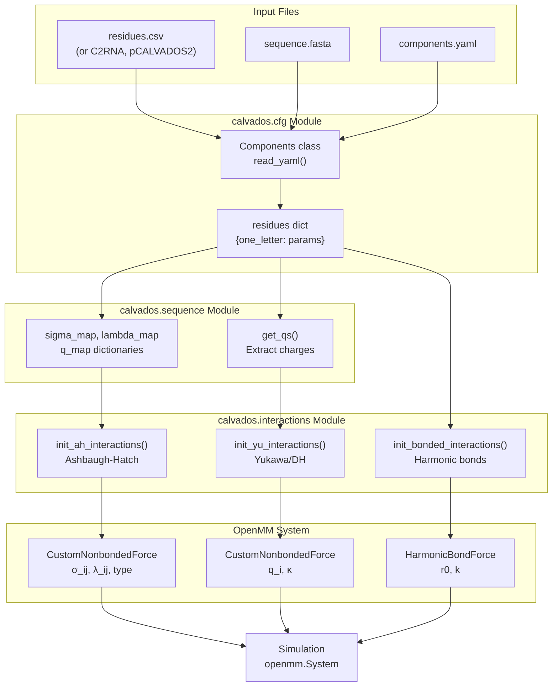

# Residue Parameters Reference

<details>
<summary>Relevant source files</summary>

The following files were used as context for generating this wiki page:

- [examples/single_RNA/residues_C2RNA.csv](examples/single_RNA/residues_C2RNA.csv)
- [examples/single_RNA/rna.fasta](examples/single_RNA/rna.fasta)
- [examples/slab_mixed/input/mix.fasta](examples/slab_mixed/input/mix.fasta)
- [examples/slab_mixed/input/residues_C2RNA.csv](examples/slab_mixed/input/residues_C2RNA.csv)
- [residues.csv](residues.csv)

</details>


This page documents the format and meaning of residue parameter files (e.g., `residues.csv`, `residues_C2RNA.csv`) that define the coarse-grained force field parameters for each residue type in CALVADOS simulations. These files specify the per-residue properties used in the Ashbaugh-Hatch hydrophobic interaction potential and Yukawa/Debye-Hückel electrostatic potential.

For information about how these parameters are used in force field calculations, see [Force Field & Interaction Potentials](#3.4). For configuration of which residue file to use, see [Components Class - Molecular Definitions](#2.2).

## Purpose and Scope

Residue parameter files provide the core force field parameterization in CALVADOS. Each row defines the physical properties of a coarse-grained bead representing one amino acid residue (or other molecule type like RNA nucleotides). These parameters determine:

- Particle size (excluded volume)
- Hydrophobicity (λ parameter for Ashbaugh-Hatch potential)
- Electrostatic charge
- Bond lengths between consecutive beads
- Molecular weight (for analysis and unit conversions)

The CALVADOS system includes several variants of these parameter files optimized for different molecular systems:
- **CALVADOS2**: Standard force field for proteins (default `residues.csv`)
- **CALVADOS3**: Updated parameterization for structured proteins
- **C2RNA**: Extended force field including RNA nucleotides
- **pCALVADOS2**: pH-dependent charge states for phosphorylated proteins

Sources: [examples/slab_mixed/input/residues_C2RNA.csv:1-23](), [examples/single_RNA/residues_C2RNA.csv:1-23](), [residues.csv:1-22]()

## File Format Specification

### Structure

Residue parameter files are CSV (comma-separated values) files with the following characteristics:

- **Header row**: Column names on line 1
- **Data rows**: One row per residue type (lines 2+)
- **Encoding**: UTF-8 text
- **Delimiter**: Comma (`,`)
- **Empty lines**: Ignored (typically at end of file)

### Required Columns

The file must contain exactly seven columns in this order:

| Column | Type | Description |
|--------|------|-------------|
| `one` | string | One-letter residue code (e.g., `R`, `r` for RNA) |
| `three` | string | Three-letter residue code (e.g., `ARG`, `RNA`) |
| `MW` | float | Molecular weight in Daltons |
| `lambdas` | float | Hydrophobicity parameter (0 to ~1) |
| `sigmas` | float | Particle size (excluded volume diameter) in nm |
| `q` | integer | Electrostatic charge in elementary charge units |
| `bondlength` | float | Equilibrium bond length in nm |

**Standard Format Example**:
```csv
one,three,MW,lambdas,sigmas,q,bondlength
R,ARG,156.19,0.730762476752,0.656,1,0.38
D,ASP,115.09,0.041604048061,0.558,-1,0.38
```

**C2RNA Format Example** (note: `three` and `one` columns swapped):
```csv
three,one,MW,lambdas,sigmas,q,bondlength
ARG,R,156.19,0.7307624767517166,0.6559999999999999,1,0.38
RNA,r,126.3,1.18,0.6238,0,0.54
RBC,p,194.1,0.00,0.6954,-1,0.59
```

⚠️ **Note**: C2RNA files have `three,one` instead of `one,three` in the header. The code handles both formats.

Sources: [residues.csv:1-22](), [examples/slab_mixed/input/residues_C2RNA.csv:1-23]()

## Column Definitions

### `one` - One-Letter Code

**Type**: String (single character)  
**Purpose**: Short identifier for the residue type in FASTA sequences and internal representations.

**Values**:
- Standard amino acids: Single uppercase letter (`A`, `R`, `D`, etc.)
- RNA nucleotides (C2RNA): Lowercase `r`
- RNA phosphate backbone (C2RNA): Lowercase `p`

**Usage**: This code appears in FASTA files and is used as a dictionary key throughout the codebase for parameter lookups.

### `three` - Three-Letter Code

**Type**: String (typically 3 characters)  
**Purpose**: Descriptive identifier matching standard biochemical nomenclature.

**Values**:
- Standard amino acids: Three uppercase letters (`ARG`, `ASP`, `GLY`, etc.)
- RNA nucleotides: `RNA`
- RNA phosphate backbone: `RBC` (ribose-phosphate backbone)

**Usage**: Used in PDB files, output structures, and human-readable reports.

### `MW` - Molecular Weight

**Type**: Float  
**Units**: Daltons (g/mol)  
**Purpose**: Physical molecular weight of the residue.

**Typical Range**: 
- Amino acids: 57 Da (Glycine) to 186 Da (Tryptophan)
- RNA: 126 Da (average nucleotide), 194 Da (backbone)

**Usage**: 
- Converting between mass and molar concentrations in analysis
- Calculating system composition statistics
- Not directly used in force field calculations

### `lambdas` - Hydrophobicity Parameter

**Type**: Float  
**Units**: Dimensionless  
**Purpose**: Modulates the strength of hydrophobic (Ashbaugh-Hatch) interactions.

**Physical Meaning**: 
- **λ = 0**: Purely repulsive (hydrophilic residues like ASP, GLU)
- **λ = 1**: Maximum attractive hydrophobic interaction
- **0 < λ < 1**: Intermediate hydrophobicity

**Typical Range**:
- Charged residues: 0.00 - 0.18 (ASP: 0.04, GLU: 0.0007, LYS: 0.18)
- Polar uncharged: 0.27 - 0.56 (ALA: 0.27, SER: 0.46)
- Hydrophobic: 0.54 - 0.99 (TRP: 0.99, PHE: 0.87, TYR: 0.98)
- RNA nucleotides: 1.18 (strongly hydrophobic)
- RNA backbone: 0.00 (fully hydrophilic, charged)

**Force Field Usage**: Combined with inter-particle distance to calculate Ashbaugh-Hatch potential energy. The pairwise λ is computed as `λ_ij = (λ_i + λ_j) / 2`.

Sources: [residues.csv:2-21](), [examples/slab_mixed/input/residues_C2RNA.csv:2-23]()

### `sigmas` - Particle Size

**Type**: Float  
**Units**: Nanometers (nm)  
**Purpose**: Defines the excluded volume diameter of the coarse-grained bead.

**Physical Meaning**: The distance at which the repulsive part of the Ashbaugh-Hatch potential is strongest. Represents the effective size of the residue bead.

**Typical Range**:
- Small residues: 0.45 nm (Glycine)
- Medium residues: 0.50 - 0.62 nm (most amino acids)
- Large residues: 0.64 - 0.68 nm (TRP: 0.678, PHE: 0.636, TYR: 0.646)
- RNA nucleotides: 0.62 nm
- RNA backbone: 0.70 nm

**Pairwise Calculation**: In force field initialization, the pairwise sigma is computed as `σ_ij = (σ_i + σ_j) / 2`.

**Relation to Bond Length**: Typically `bondlength ≈ 0.5 * sigma` to maintain reasonable chain geometry.

### `q` - Electrostatic Charge

**Type**: Integer  
**Units**: Elementary charge units (e)  
**Purpose**: Net electrostatic charge at neutral pH.

**Standard Values**:
- Positive: `+1` (ARG, LYS, HIS in protonated state)
- Negative: `-1` (ASP, GLU)
- Neutral: `0` (all other standard amino acids)
- RNA backbone: `-1` (phosphate group)
- RNA nucleotide: `0`

**pH Dependence**: The standard force field uses fixed charges at pH 7. For pH-dependent simulations, use the pCALVADOS2 variant where charges can be modified based on pKa values and simulation pH.

**Force Field Usage**: Used directly in the Yukawa/Debye-Hückel electrostatic potential: `U_elec ∝ q_i * q_j * exp(-κr) / r`.

### `bondlength` - Equilibrium Bond Length

**Type**: Float  
**Units**: Nanometers (nm)  
**Purpose**: Equilibrium distance for harmonic bonds connecting consecutive beads along the polymer backbone.

**Standard Values**:
- Amino acids: 0.38 nm (universal for all standard residues)
- RNA nucleotides: 0.54 nm (larger due to two-bead model)
- RNA backbone: 0.59 nm

**Force Field Usage**: Sets the `r0` parameter in the `HarmonicBondForce` for backbone connectivity:
```
E_bond = k_bond * (r - r0)^2
```
where `r0 = bondlength` and `k_bond` is specified in the simulation configuration.

**Physical Interpretation**: Represents the average distance between consecutive Cα atoms in a polypeptide chain (for proteins) or between consecutive phosphate groups (for RNA).

Sources: [residues.csv:1-22](), [examples/slab_mixed/input/residues_C2RNA.csv:1-23]()

## Force Field Data Flow



**Data Transformation Pipeline**:

1. **Loading**: `Components.read_yaml()` reads the residue CSV file specified in `components.yaml`
2. **Parsing**: Converts CSV rows into a dictionary keyed by one-letter code
3. **Sequence Mapping**: FASTA sequences are translated into lists of residue parameters
4. **Pairwise Combinations**: For each particle pair (i,j):
   - `σ_ij = (σ_i + σ_j) / 2`
   - `λ_ij = (λ_i + λ_j) / 2`
5. **Force Initialization**: Parameters are passed to OpenMM `CustomNonbondedForce` and `HarmonicBondForce` objects

Sources: Multiple files in `calvados/` directory (cfg.py, sequence.py, interactions.py)

## Force Field Variants

CALVADOS supports multiple residue parameter sets for different simulation types:

### Standard Protein Force Fields

| File | Force Field | Use Case | Key Features |
|------|-------------|----------|--------------|
| `residues.csv` | CALVADOS2 | Default for IDRs and proteins | 20 standard amino acids, optimized for disordered proteins |
| `residues_CALVADOS3.csv` | CALVADOS3 | Structured proteins | Refined parameters for folded domains |

### Extended Force Fields

| File | Force Field | Use Case | Key Features |
|------|-------------|----------|--------------|
| `residues_C2RNA.csv` | C2RNA | Protein-RNA systems | Adds `RNA` (r) and `RBC` (p) residue types |
| `residues_pCALVADOS2.csv` | pCALVADOS2 | pH-dependent simulations | Variable charges for ionizable residues |

### RNA Residue Types (C2RNA)

The C2RNA force field extends CALVADOS2 with two additional residue types for RNA modeling:

**RNA nucleotide (`r`, `RNA`)**:
- Represents the nucleobase (A, U, G, or C - not distinguished)
- `λ = 1.18`: Strongly hydrophobic (mimics base stacking)
- `σ = 0.6238 nm`: Medium-sized bead
- `q = 0`: Neutral charge
- `bondlength = 0.54 nm`: Larger bond length

**RNA phosphate backbone (`p`, `RBC`)**:
- Represents ribose-phosphate backbone unit
- `λ = 0.00`: Fully hydrophilic
- `σ = 0.6954 nm`: Large bead (reflects sugar-phosphate size)
- `q = -1`: Negative charge (phosphate group)
- `bondlength = 0.59 nm`: Longest bond length in system

**RNA Sequence Encoding**: In FASTA files, RNA is encoded as alternating `r` (base) and `p` (backbone) beads:
```fasta
>polyU40
rprprprprprprprprprprprprprprprprprprprp
```
(Simplified notation: `rrrr...` is expanded to `rprprp...` by preprocessing)

Sources: [examples/slab_mixed/input/residues_C2RNA.csv:22-23](), [examples/single_RNA/rna.fasta:1-3]()

## Parameter Usage in Simulations

### Loading Residue Parameters

Residue parameters are loaded during component initialization via the `Components` class:

```yaml
# components.yaml
protein1:
  name: my_protein
  fasta: sequence.fasta
  residues: residues_CALVADOS2.csv  # Specify which parameter file
```

The path can be:
- **Relative**: Resolved relative to the YAML file location
- **Absolute**: Full filesystem path
- **Package default**: If omitted, uses `calvados/data/residues.csv`

### Sequence-to-Parameters Mapping

When a FASTA sequence is loaded, each one-letter code is mapped to its corresponding parameter row:

**Example Sequence**:
```
RGGRGGY  →  [ARG, GLY, GLY, ARG, GLY, GLY, TYR]
```

**Parameter Extraction**:
- Charges: `[1, 0, 0, 1, 0, 0, 0]`
- Sigmas: `[0.656, 0.45, 0.45, 0.656, 0.45, 0.45, 0.646]`
- Lambdas: `[0.73, 0.71, 0.71, 0.73, 0.71, 0.71, 0.98]`

This mapping is performed by functions in `calvados.sequence` module (e.g., `get_qs()`, sigma/lambda map construction).

### Pairwise Parameter Calculation

OpenMM `CustomNonbondedForce` objects use per-particle parameters, but pairwise interactions require combined values:

**Ashbaugh-Hatch Potential**:
```python
# From calvados/interactions.py
sigma_ij = (sigma_i + sigma_j) / 2  # Arithmetic mean
lambda_ij = (lambda_i + lambda_j) / 2  # Arithmetic mean
```

**Yukawa Potential**:
```python
# Charges used directly (multiplicative)
U_elec ∝ q_i * q_j * exp(-kappa * r) / r
```

## Adding Custom Residue Types

### Procedure

To add a new residue type (e.g., a modified amino acid or nucleotide):

1. **Create Modified CSV**:
   ```csv
   one,three,MW,lambdas,sigmas,q,bondlength
   # ... existing residues ...
   X,XYZ,150.0,0.5,0.60,0,0.38
   ```

2. **Update FASTA Sequence**:
   ```fasta
   >my_sequence
   RGGXGGXRGG
   ```

3. **Specify in components.yaml**:
   ```yaml
   protein1:
     fasta: sequence.fasta
     residues: custom_residues.csv
   ```

### Parameter Selection Guidelines

| Parameter | Guideline |
|-----------|-----------|
| **MW** | Use actual molecular weight or estimate from chemical structure |
| **lambdas** | 0.0 for charged/hydrophilic; 0.3-0.6 for polar; 0.7-1.0 for hydrophobic |
| **sigmas** | Estimate from molecular volume: σ ≈ (6V/π)^(1/3), typically 0.45-0.70 nm |
| **q** | Net charge at pH 7 (integer: -2, -1, 0, +1, +2) |
| **bondlength** | 0.38 nm for protein-like; scale with bead size if needed |

### Validation

After adding custom residues:
1. Run a short test simulation
2. Check for energy conservation (no `NaN` energies)
3. Verify particle overlaps don't occur (sigmas not too small)
4. Confirm bond lengths maintain reasonable chain geometry

## Parameter Constraints and Validation

### Physical Constraints

The force field implementation expects these constraints:

| Parameter | Constraint | Reason |
|-----------|------------|--------|
| `sigmas` | > 0.3 nm | Prevents excessive overlaps and numerical instability |
| `sigmas` | < 1.0 nm | Maintains coarse-grained approximation validity |
| `lambdas` | 0.0 ≤ λ ≤ ~1.2 | Negative λ not physical; very high λ can cause collapse |
| `q` | Integer | Force field uses integer charges for efficiency |
| `bondlength` | ~ 0.5 * sigma | Maintains reasonable chain geometry |
| `bondlength` | > 0.2 nm | Prevents bond stretch instability |

### Typical Value Ranges

**Amino Acid Statistics** (from CALVADOS2):

```
Sigmas (nm):    min=0.450 (GLY), max=0.678 (TRP), mean=0.584
Lambdas:        min=0.0007 (GLU), max=0.989 (TRP), mean=0.465
Charges:        -1 (D,E), 0 (most), +1 (R,K,H)
Bond length:    0.38 nm (universal for proteins)
```

### Common Issues

**Problem**: Simulation crashes with `NaN` energies  
**Possible Cause**: `sigma` too small causing particle overlap  
**Solution**: Increase sigma to at least 0.40 nm

**Problem**: Unphysical chain collapse  
**Possible Cause**: `lambda` too high for all residues  
**Solution**: Balance hydrophobic (high λ) with hydrophilic (low λ) residues

**Problem**: RNA chains too stiff/flexible  
**Possible Cause**: Incorrect `bondlength` for RNA  
**Solution**: Use 0.54 nm for RNA nucleotides, 0.59 nm for backbone

Sources: [residues.csv:1-22](), domain knowledge of coarse-grained force fields

## Related Configuration

### Components.yaml Integration

Residue parameters are specified per-component in `components.yaml`:

```yaml
components:
  protein1:
    fasta: protein.fasta
    residues: residues_CALVADOS2.csv  # Standard protein
    
  rna1:
    fasta: rna.fasta
    residues: residues_C2RNA.csv      # Protein + RNA
```

See [Component Configuration Reference](#9.2) for complete YAML specification.

### Force Field Configuration

Global force field parameters (temperature, ionic strength) that work with residue parameters are in `config.yaml`:

```yaml
temp: 300              # Temperature (K)
ionic: 0.15            # Ionic strength (M)
eps_r: 80              # Relative permittivity
lj_eps: 0.2           # Ashbaugh-Hatch energy scale (kJ/mol)
```

These global parameters combine with residue-specific `sigmas`, `lambdas`, and `q` values to define the complete force field.

See [Configuration File Reference](#9.1) for complete parameter list.

## Summary Table

Quick reference for all residue parameter columns:

| Column | Units | Type | Range | Physical Meaning | Force Field Use |
|--------|-------|------|-------|------------------|-----------------|
| `one` | - | str | 1 char | One-letter code | Sequence parsing, dictionary key |
| `three` | - | str | 3+ chars | Three-letter code | PDB output, human-readable |
| `MW` | Da | float | 50-200 | Molecular weight | Concentration conversions |
| `lambdas` | - | float | 0.0-1.2 | Hydrophobicity | Ashbaugh-Hatch attractive strength |
| `sigmas` | nm | float | 0.4-0.7 | Bead diameter | Excluded volume, LJ-like repulsion |
| `q` | e | int | -2 to +2 | Net charge | Yukawa/DH electrostatic potential |
| `bondlength` | nm | float | 0.3-0.6 | Equilibrium bond | Harmonic bond constraint |

Sources: [residues.csv:1-22](), [examples/slab_mixed/input/residues_C2RNA.csv:1-23]()

---