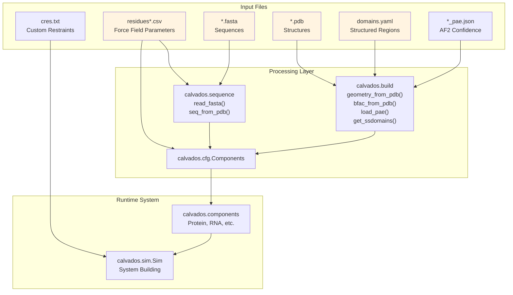
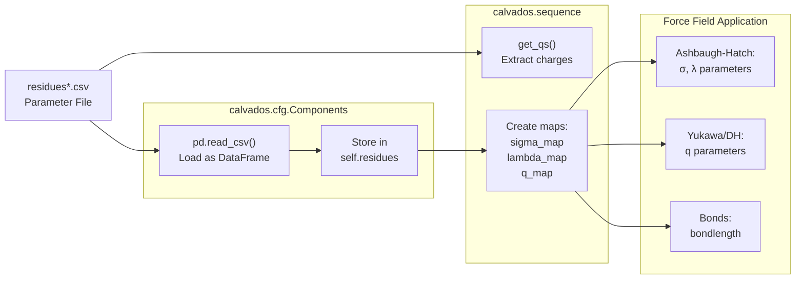
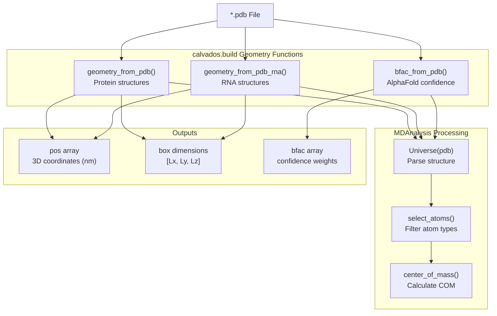
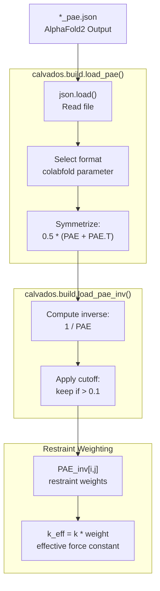
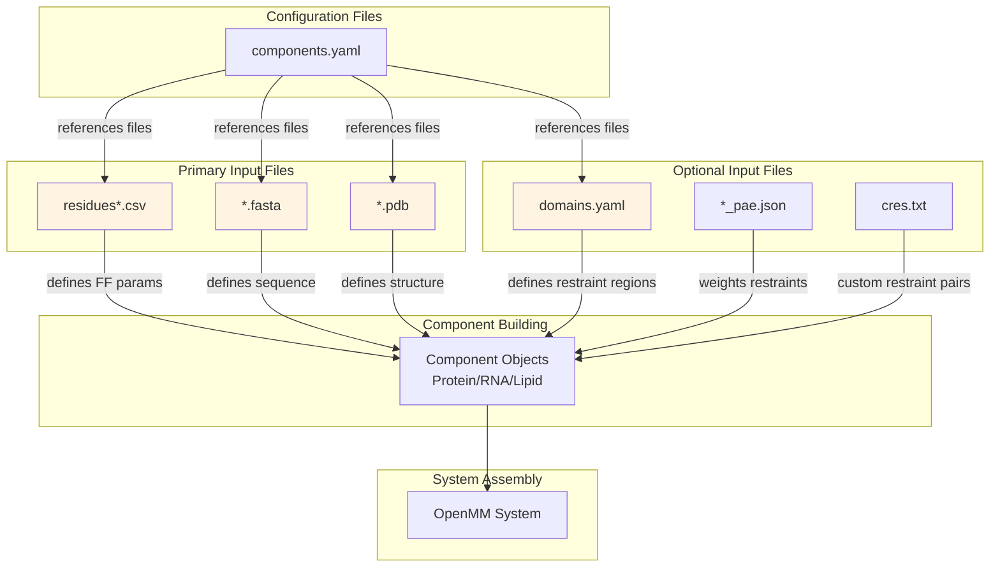

# File Format Specifications

<details>
<summary>Relevant source files</summary>

The following files were used as context for generating this wiki page:

- [calvados/build.py](calvados/build.py)
- [calvados/sequence.py](calvados/sequence.py)
- [examples/custom_restraints/prepare.py](examples/custom_restraints/prepare.py)
- [examples/single_dsRNA/input/domains.yaml](examples/single_dsRNA/input/domains.yaml)
- [examples/single_dsRNA/input/dspolyR12.pdb](examples/single_dsRNA/input/dspolyR12.pdb)
- [examples/single_dsRNA/input/fastalib.fasta](examples/single_dsRNA/input/fastalib.fasta)
- [examples/single_dsRNA/input/residues_C2RNA.csv](examples/single_dsRNA/input/residues_C2RNA.csv)
- [examples/single_dsRNA/prepare.py](examples/single_dsRNA/prepare.py)

</details>


This page documents the input file formats used by CALVADOS for defining molecular systems, force field parameters, and structural constraints. These files are processed during system setup (see [Simulation Setup & Configuration](#2)) and consumed by the build and component systems (see [Molecular Components & Force Fields](#3)).

For runtime configuration parameters, see [Configuration File Reference](#9.1). For component-specific parameters, see [Component Configuration Reference](#9.2).

---

## Overview of Input File Types

CALVADOS accepts several categories of input files:

| File Type | Purpose | Format | Primary Readers |
|-----------|---------|--------|----------------|
| `residues*.csv` | Force field parameters | CSV | `calvados.sequence`, `calvados.cfg.Components` |
| `*.fasta` | Sequence definitions | FASTA | `calvados.sequence.read_fasta()` |
| `*.pdb` | 3D structure coordinates | PDB | `calvados.build` geometry functions |
| `domains.yaml` | Structured region definitions | YAML | `calvados.build.get_ssdomains()` |
| `cres.txt` | Custom restraint pairs | Plain text | Sim class restraint initialization |
| `*_pae.json` | AlphaFold confidence | JSON | `calvados.build.load_pae()` |



**Sources:** [calvados/sequence.py:30-32](), [calvados/build.py:297-353](), [calvados/build.py:388-415]()

---

## Residues CSV Files

### Purpose

Residue CSV files define the coarse-grained force field parameters for each amino acid and nucleotide type. Different variants support different molecular systems and force field versions.

### Available Force Field Files

| File | Molecular Types | Force Field Version | Example Path |
|------|----------------|-------------------|-------------|
| `residues_CALVADOS2.csv` | Proteins | CALVADOS 2.0 | Default for IDR simulations |
| `residues_CALVADOS3.csv` | Proteins | CALVADOS 3.0 | Updated parameters |
| `residues_C2RNA.csv` | Proteins + RNA | CALVADOS 2 + RNA | Protein-RNA systems |
| `residues_pCALVADOS2.csv` | Proteins (pH-dependent) | pCALVADOS 2.0 | Phosphorylation studies |

### Format Specification

**File Structure:** CSV with header row, comma-separated values

**Required Columns:**

| Column | Type | Description | Units |
|--------|------|-------------|-------|
| `three` | string | Three-letter residue code (e.g., `ARG`, `ALA`, `RBC`) | - |
| `one` | string | One-letter residue code (e.g., `R`, `A`, `p`) | - |
| `MW` | float | Molecular weight | Daltons (Da) |
| `lambdas` | float | Hydropathy parameter for Ashbaugh-Hatch potential | dimensionless [0-1] |
| `sigmas` | float | Lennard-Jones size parameter | nanometers (nm) |
| `q` | int/float | Residue charge | elementary charges (e) |
| `bondlength` | float | Equilibrium bond length to next residue | nanometers (nm) |

### Example Entry

From [examples/single_dsRNA/input/residues_C2RNA.csv:2]():

```csv
three,one,MW,lambdas,sigmas,q,bondlength
ARG,R,156.19,0.7307624767517166,0.6559999999999999,1,0.38
```

This defines arginine with:
- MW = 156.19 Da
- λ = 0.731 (high hydropathy, hydrophobic)
- σ = 0.656 nm (particle radius)
- q = +1 (positively charged)
- bondlength = 0.38 nm

### Special Residue Codes

**RNA Residues** (from `residues_C2RNA.csv`):

| Code | Name | Description |
|------|------|-------------|
| `RBC` / `p` | Phosphate backbone | Charged backbone bead, q = -1 |
| `RNA` / `r` | Purine base | Adenine (A) or Guanine (G) base bead |
| `SRN` / `s` | Pyrimidine base | Cytosine (C) or Uracil (U) base bead |

**Phosphorylation** (in `residues_pCALVADOS2.csv`):
- `p`: Phosphorylated residue with pH-dependent charge

### Processing Pipeline



**Sources:** [examples/single_dsRNA/input/residues_C2RNA.csv:1-24](), [calvados/sequence.py:92-108](), [calvados/sequence.py:391-399]()

---

## FASTA Files

### Purpose

FASTA files define amino acid or nucleotide sequences for molecules in the simulation. They use the standard bioinformatics FASTA format.

### Format Specification

**Structure:**
- Header line: `>` followed by molecule name (no spaces recommended)
- Sequence lines: One-letter amino acid or nucleotide codes

**Supported Codes:**
- **Proteins:** Standard 20 amino acids (A, C, D, E, F, G, H, I, K, L, M, N, P, Q, R, S, T, V, W, Y)
- **RNA:** Nucleotides (A, C, G, U) represented as lowercase `r` (purines A/G) or `s` (pyrimidines C/U)
- **Special:** `X` for unknown/modified residues, `p` for phosphorylated residues

### Example

From [examples/single_dsRNA/input/fastalib.fasta:1-4]():

```fasta
>sspolyR12
rrrrrrrrrrrr
>CAPRIN1_N623TN630T
SRGVSRGGSRGARGLMTGYRGPATGFRGGYDGYRPSFSNTPNSGYTQSQFSAPRDYSGYQRDGYQQNFKRGSGQSGPRGAPRGRGGPPRPNRGMPQMNTQQVN
```

This defines:
1. **sspolyR12:** A 12-nucleotide RNA homopolymer (12 `r` residues)
2. **CAPRIN1_N623TN630T:** A 104-residue protein sequence

### Reading FASTA Files

The `read_fasta()` function uses BioPython to parse FASTA files:

```python
# From calvados/sequence.py:30-32
def read_fasta(ffasta):
    records = SeqIO.to_dict(SeqIO.parse(ffasta, "fasta"))
    return records
```

Returns a dictionary with `{name: SeqRecord}` mapping.

### Multi-Sequence Files

A single FASTA file can contain multiple molecules. Each will be processed as a separate component if referenced by name in `components.yaml`:

```fasta
>protein1
MKTAYIAKQRQISFVKSHFSRQ
>protein2
GSRQEQVVQEPVQSVHF
>rna1
rrrssssrrrr
```

**Sources:** [examples/single_dsRNA/input/fastalib.fasta:1-4](), [calvados/sequence.py:30-32]()

---

## PDB Files

### Purpose

PDB (Protein Data Bank) files provide 3D atomic coordinates for structured molecules. CALVADOS uses them to:
1. Extract coarse-grained bead positions (CA atoms or centers of mass)
2. Define restraint networks (Go models, harmonic restraints)
3. Read B-factors encoding AlphaFold confidence (pLDDT scores)

### Format Specification

CALVADOS reads standard PDB format files. Key record types:

**ATOM Records:**
```
ATOM      1  P     G 1   1       2.907  -8.210   3.750     1     1
ATOM      2  OP1   G 1   1       3.090  -9.078   4.940     1     1
```

Format: `ATOM  serial  name  resName chain resSeq  x  y  z  occupancy  tempFactor`

**For Proteins:**
- Uses CA (alpha carbon) atoms for coarse-grained mapping
- Alternative: Uses center of mass per residue if `use_com=True`

**For RNA:**
- Backbone: P (phosphate) atoms → phosphate beads
- Bases: N1 (pyrimidines) or N9 (purines) → base beads

### Processing Functions



### Protein Structure Extraction

From [calvados/build.py:297-314]():

```python
def geometry_from_pdb(pdb, use_com=False):
    """ positions in nm"""
    u = Universe(pdb)
    ag = u.atoms
    ag.translate(-ag.center_of_mass())
    if use_com:
        # Use center of mass per residue
        coms = []
        for res in u.residues:
            com = res.atoms.center_of_mass()
            coms.append(com)
        pos = np.array(coms) / 10.  # Angstroms to nm
    else:
        # Use CA atoms only
        cas = u.select_atoms('name CA')
        pos = cas.positions / 10.
    return pos, box
```

### RNA Structure Extraction

From [calvados/build.py:316-353](), RNA uses a two-bead-per-residue model:

1. **Backbone bead:** Center of mass of backbone atoms (P, O5', C5', C4', C3', O3', etc.)
2. **Base bead:** Center of mass of base atoms (remaining atoms after backbone selection)

Atom selection uses specific backbone atom names defined in [calvados/build.py:318-321]().

### B-Factor Encoding

AlphaFold2 structures encode per-residue confidence (pLDDT) in the B-factor column:

From [calvados/build.py:355-364]():

```python
def bfac_from_pdb(pdb, confidence=70.):
    """ get pLDDT encoded in pdb b-factor column """
    u = Universe(pdb)
    bfac = np.zeros((len(u.residues)))
    for idx, res in enumerate(u.residues):
        bfac[idx] = np.mean(res.atoms.tempfactors)
    bfac = np.where(bfac > confidence, bfac, 0.) / 100.
    return bfac
```

Returns confidence weights [0-1] for restraint weighting (see [Restraints System](#3.5)).

**Sources:** [calvados/build.py:297-314](), [calvados/build.py:316-353](), [calvados/build.py:355-364](), [examples/single_dsRNA/input/dspolyR12.pdb:1-100]()

---

## Domains YAML Files

### Purpose

Domains YAML files (`domains.yaml`) specify structured regions within proteins that should have restraints applied. This defines which residue ranges are folded/structured versus disordered.

### Format Specification

**File Structure:** YAML dictionary mapping molecule names to domain definitions

**Schema:**
```yaml
molecule_name:
  - [start, end]           # Single domain
  - [[start1, end1], [start2, end2]]  # Multi-segment domain
```

**Indexing:** 1-based, inclusive (standard PDB numbering)

### Examples

**Single Domain:**

From [examples/single_dsRNA/input/domains.yaml:1-2]():

```yaml
dspolyR12:
- [1,24]
```

Defines residues 1-24 as structured (the entire dsRNA molecule).

**Multiple Domains:**

```yaml
multi_domain_protein:
- [10, 50]      # Domain 1: residues 10-50
- [80, 120]     # Domain 2: residues 80-120
- [150, 200]    # Domain 3: residues 150-200
```

**Multi-Segment Domain:**

```yaml
complex_protein:
- [[10, 30], [50, 70]]   # Domain with two discontinuous segments
- [100, 150]              # Second domain
```

### Processing Pipeline

From [calvados/build.py:388-415]():

```python
def get_ssdomains(name, fdomains, dpam=False):
    with open(f'{fdomains}','r') as f:
        stream = f.read()
        domainbib = safe_load(stream)
    domains = domainbib[name]
    
    ssdomains = []
    for didx, domain in enumerate(domains):
        xs = []  # restraint residues of domain
        if isinstance(domain[0], list):
            # Multi-segment domain
            for subdom in domain:
                for x in range(subdom[0]-1, subdom[1]):
                    xs.append(x)
        else:
            # Single-segment domain
            for x in range(domain[0]-1, domain[1]):
                xs.append(x)
        ssdomains.append(xs)  # Convert to 0-based indexing
    return ssdomains
```

Returns a list of lists, where each inner list contains 0-based residue indices for a structured domain.

### Usage in Restraint Application

The `check_ssdomain()` function [calvados/build.py:417-432]() determines if residue pairs should have restraints:

```python
def check_ssdomain(ssdomains, i, j, req_both=True):
    """
    Check if one (req_both == False) or both (req_both == True) of
    the residues are in a structured domain.
    """
    ss = False
    for ssdom in ssdomains:
        if req_both:
            if (i in ssdom) and (j in ssdom):
                ss = True
        else:
            if (i in ssdom) or (j in ssdom):
                ss = True
    return ss
```

**Sources:** [examples/single_dsRNA/input/domains.yaml:1-2](), [calvados/build.py:388-432]()

---

## Custom Restraints Files (cres.txt)

### Purpose

Custom restraints files (`cres.txt`) allow manual specification of residue pairs that should have harmonic restraints applied, bypassing automatic domain-based restraint assignment.

### Format Specification

**File Structure:** Plain text, one residue pair per line

**Format:** `residue_i residue_j`
- Space or tab-separated
- 0-based residue indices
- One pair per line

### Example

```
0 5
0 10
5 10
12 20
12 25
20 25
```

This defines restraints between:
- Residues 0-5, 0-10, 5-10 (first restraint network)
- Residues 12-20, 12-25, 20-25 (second restraint network)

### Usage

Enabled via Config parameters:

From [examples/custom_restraints/prepare.py:45-47]():

```python
config = Config(
    custom_restraints = True,
    custom_restraint_type = 'harmonic',
    fcustom_restraints = f'{cwd}/input/cres.txt',
)
```

### Restraint Types

**Harmonic:** Simple distance restraint
```
U = k * (r - r0)^2
```

**Go:** Native contact potential (not applicable to custom restraints)

### Processing

During system building:
1. If `custom_restraints=True`, read pairs from `fcustom_restraints`
2. For each pair (i, j), add `HarmonicBondForce` to OpenMM system
3. Uses force constant `k_harmonic` from Components configuration
4. Reference distance `r0` from PDB structure

**Sources:** [examples/custom_restraints/prepare.py:45-47]()

---

## PAE JSON Files

### Purpose

PAE (Predicted Aligned Error) JSON files contain residue-residue confidence scores from AlphaFold2 predictions. CALVADOS uses these to weight restraints based on structural confidence.

### Format Specification

**File Structure:** JSON with AlphaFold2 schema

**Supported Formats:**

1. **EBI AlphaFold format** (`colabfold=0`):
```json
[{
  "predicted_aligned_error": [[...], [...], ...]
}]
```

2. **ColabFold format v1** (`colabfold=1`):
```json
{
  "predicted_aligned_error": [[...], [...], ...]
}
```

3. **ColabFold format v2** (`colabfold=2`):
```json
{
  "pae": [[...], [...], ...]
}
```

**Matrix Structure:**
- NxN matrix where N = number of residues
- `PAE[i][j]` = predicted error (Angstroms) for residue pair i-j
- Lower values indicate higher confidence
- Diagonal elements typically 0

### Processing Functions



### Loading PAE Data

From [calvados/build.py:374-386]():

```python
def load_pae(input_pae, colabfold=0, symmetrize=True):
    """ pae as json file (AF2 format) """
    with open(input_pae) as f:
        pae = load(f)
        if colabfold == 0:
            pae = np.array(pae[0]['predicted_aligned_error'])
        elif colabfold == 1:
            pae = np.array(pae['predicted_aligned_error'])
        elif colabfold == 2:
            pae = np.array(pae['pae'])
    if symmetrize:
        pae = 0.5 * (pae + pae.T)
    return pae
```

### Inverse PAE for Restraints

From [calvados/build.py:366-372]():

```python
def load_pae_inv(input_pae, cutoff=0.1, colabfold=0, symmetrize=True):
    """ pae as json file (AF2 format) """
    pae = load_pae(input_pae, colabfold=colabfold, symmetrize=True)
    pae = np.where(pae < 1., 1, pae)  # avoid division by zero
    pae_inv = 1/pae  # inverse pae
    pae_inv = np.where(pae_inv > cutoff, pae_inv, 0)
    return pae_inv
```

**Interpretation:**
- `PAE_inv[i,j] → 1`: High confidence pair (low PAE)
- `PAE_inv[i,j] → 0`: Low confidence pair (high PAE)
- `PAE_inv[i,j] = 0` (cutoff): Pair excluded from restraints

### Usage in Components

Specify PAE file in component configuration:

```python
components.add(
    name='myprotein',
    restraint=True,
    restraint_type='harmonic',
    use_pae=True,
    colabfold=1,  # Format version
)
```

The system looks for `myprotein_pae.json` in the `pdb_folder` directory.

**Sources:** [calvados/build.py:366-386]()

---

## File Dependencies and Relationships



**Sources:** [calvados/sequence.py:30-32](), [calvados/build.py:297-432](), [examples/custom_restraints/prepare.py:45-47]()

---

## File Naming Conventions

### Standard Patterns

**Residues Files:**
- `residues_CALVADOS2.csv` - Standard protein force field
- `residues_CALVADOS3.csv` - Updated protein force field
- `residues_C2RNA.csv` - Protein + RNA force field
- `residues_pCALVADOS2.csv` - pH-dependent force field

**FASTA Files:**
- `fastalib.fasta` - Library of sequences
- `<moleculename>.fasta` - Single molecule sequence

**PDB Files:**
- `<moleculename>.pdb` - Structure file
- Must match name used in `components.yaml`

**PAE Files:**
- `<moleculename>_pae.json` - PAE data for molecule
- Must be in `pdb_folder` directory
- Name must match molecule name with `_pae.json` suffix

**Domain Files:**
- `domains.yaml` - Domain definitions for all molecules
- Single file per project

**Custom Restraints:**
- `cres.txt` - Custom restraint pairs
- Path specified in `config.yaml`

### Directory Structure Example

```
project/
├── input/
│   ├── residues_CALVADOS3.csv
│   ├── fastalib.fasta
│   ├── protein1.pdb
│   ├── protein1_pae.json
│   ├── protein2.pdb
│   ├── protein2_pae.json
│   ├── domains.yaml
│   └── cres.txt
├── prepare.py
└── output/
    ├── components.yaml
    └── config.yaml
```

**Sources:** [examples/single_dsRNA/prepare.py:24-26](), [examples/custom_restraints/prepare.py:24]()

---

## Validation and Error Handling

### Common Issues

**Missing Files:**
- **Error:** FileNotFoundError when referenced files don't exist
- **Solution:** Verify paths in `components.yaml` and ensure files exist

**Format Mismatches:**
- **Residues CSV:** Missing columns or incorrect data types
- **FASTA:** Invalid amino acid codes
- **PDB:** Missing CA atoms or corrupted structure
- **YAML:** Invalid YAML syntax in domains.yaml

**Indexing Errors:**
- **Domains:** 1-based (PDB convention)
- **Custom restraints:** 0-based (Python convention)
- **PAE matrices:** 0-based (NumPy convention)

### Validation Functions

From sequence.py and build.py:

```python
# Validates residue exists in force field
residues.loc[residue_name]  # Raises KeyError if missing

# Validates PDB structure
Universe(pdb)  # MDAnalysis raises errors for corrupt PDB

# Validates YAML syntax
yaml.safe_load(stream)  # Raises yaml.YAMLError for invalid YAML
```

**Sources:** [calvados/sequence.py:92-108](), [calvados/build.py:297-432]()

---

## Summary Table

| File Type | Required | Format | Primary Use | Key Functions |
|-----------|----------|--------|-------------|---------------|
| `residues*.csv` | Yes | CSV | Force field parameters (σ, λ, q) | `get_qs()`, `make_sig_lambda_map()` |
| `*.fasta` | Yes* | FASTA | Sequence definitions | `read_fasta()`, `seq_from_pdb()` |
| `*.pdb` | No** | PDB | Structure coordinates | `geometry_from_pdb()`, `bfac_from_pdb()` |
| `domains.yaml` | No | YAML | Structured regions | `get_ssdomains()`, `check_ssdomain()` |
| `cres.txt` | No | Text | Custom restraint pairs | Sim restraint initialization |
| `*_pae.json` | No | JSON | AlphaFold confidence | `load_pae()`, `load_pae_inv()` |

\* Required unless sequence is in PDB file  
\** Required for structured proteins with restraints

**Sources:** [calvados/sequence.py:30-108](), [calvados/build.py:297-432]()