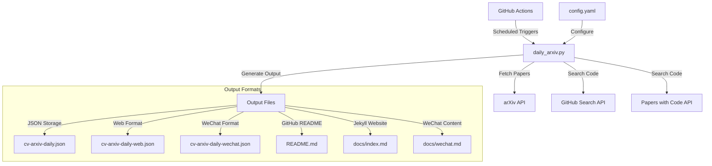
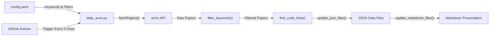
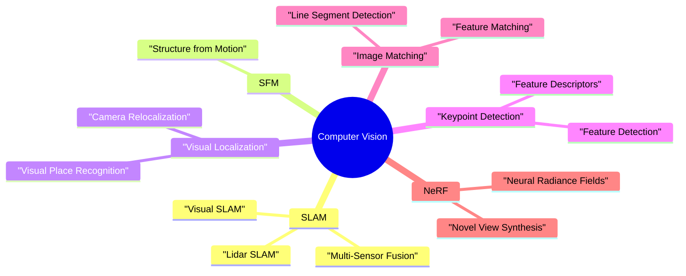

# Overview

Relevant source files

The following files were used as context for generating this wiki page:

- [README.md](README.md)
- [docs/README.md](docs/README.md)
- [docs/_config.yml](docs/_config.yml)
- [docs/index.md](docs/index.md)

The CV-ArXiv-Daily system is an automated tool for collecting, processing, and publishing computer vision research papers from arXiv. It provides regularly updated lists of papers filtered by research areas and makes them available in multiple formats for easy consumption.

For detailed information about system implementation, see [System Architecture](#2). For usage instructions and customization guidance, see [Usage Guide](#5).

Sources: [README.md:1-14](), [docs/README.md:1-46]()

## Purpose and Key Features

CV-ArXiv-Daily helps computer vision researchers and practitioners stay current with the latest research by:

1. Automatically fetching papers from arXiv based on configurable keywords
2. Finding associated code repositories from GitHub and Papers with Code
3. Organizing papers by research categories (SLAM, SFM, Visual Localization, etc.)
4. Publishing results in multiple formats (GitHub README, Jekyll website, WeChat)
5. Running on a scheduled basis via GitHub Actions automation

The system requires minimal maintenance once configured and can be easily customized to focus on specific research areas.

Sources: [README.md:1-14](), [docs/README.md:9-18]()

## System Architecture Overview

The CV-ArXiv-Daily system operates through a core processing script that interacts with external APIs to collect papers and processes them into multiple output formats.

Sources: [docs/README.md:9-18](), [docs/_config.yml:1-22]()

## Data Flow Process

The system follows a well-defined data flow process from paper collection to final presentation:

Sources: [docs/README.md:10-20]()

## Core Components

The system consists of these primary components:

1. **Core Processing Script (`daily_arxiv.py`)**: Performs paper collection, filtering, code repository search, and output generation
2. **Configuration File (`config.yaml`)**: Defines keywords, research categories, and output settings
3. **GitHub Actions Workflows**: Automated execution on schedule
4. **Output Formats**: Various presentation formats for different platforms

Sources: [docs/README.md:16-17]()

## Research Categories

The system focuses on these computer vision research areas:

Sources: [README.md:4-14]()

## GitHub Actions Automation

The system relies on GitHub Actions for automated execution:

| Workflow | File | Schedule | Purpose |
|----------|------|----------|---------|
| Daily Update | `cv-arxiv-daily.yml` | Every 5 days | Update paper list from arXiv |
| Link Update | `update_paper_links.yml` | Weekly | Check and update code repository links |

The workflow automatically triggers the main script, which performs all processing steps and commits the updated files back to the repository.

Sources: [docs/README.md:26-37]()

## Output Formats

CV-ArXiv-Daily produces several output formats to make the collected papers accessible in different contexts:

1. **GitHub README** (`README.md`): Primary display on the repository's main page, showing papers in tabular format
2. **Jekyll Website** (`docs/index.md`): Web interface for browsing papers through GitHub Pages
3. **WeChat Content** (`docs/wechat.md`): Format optimized for sharing on WeChat
4. **JSON Data Files**: Structured data storage for programmatic use:
   - `cv-arxiv-daily.json`: Primary data storage
   - `cv-arxiv-daily-web.json`: Data formatted for web interface
   - `cv-arxiv-daily-wechat.json`: Data formatted for WeChat

Sources: [README.md:1-14](), [docs/index.md:1-10]()

## Current Status and Future Development

The CV-ArXiv-Daily system is actively maintained and has a development roadmap for future enhancements:

- ✅ Configuration file system
- ✅ Code repository link updates
- ⬜ Subscription and alert system
- ⬜ Additional arXiv filters
- ⬜ Paper archiving
- ⬜ Language translation via LLMs
- ⬜ Paper commenting system

Sources: [docs/README.md:48-59]()

## Summary

CV-ArXiv-Daily provides an efficient, automated solution for staying current with computer vision research. It handles the complete pipeline from paper collection to presentation, with customizable filters and multiple output formats. The system runs autonomously through GitHub Actions and can be easily forked and configured for personal use.

Sources: [README.md:1-14](), [docs/README.md:1-59]()

---