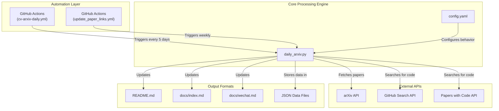
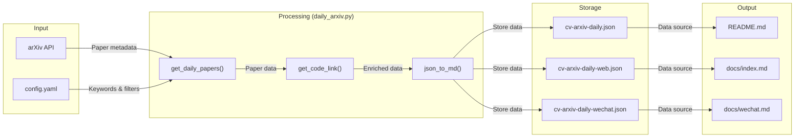
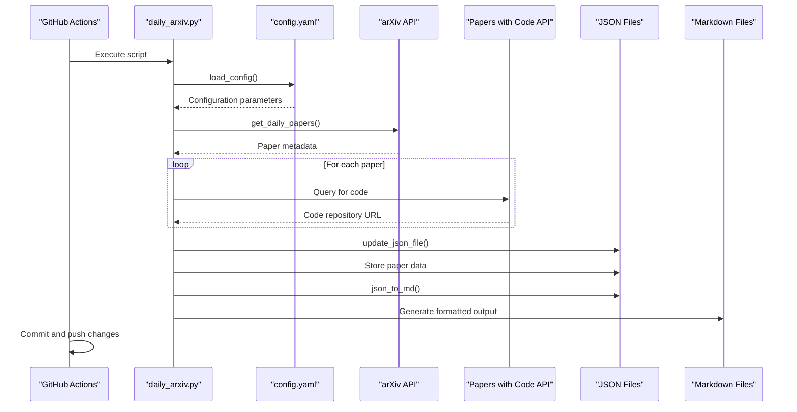

# System Architecture

<details>
<summary>Relevant source files</summary>

The following files were used as context for generating this wiki page:

- [.github/workflows/cv-arxiv-daily.yml](.github/workflows/cv-arxiv-daily.yml)
- [.github/workflows/update_paper_links.yml](.github/workflows/update_paper_links.yml)
- [config.yaml](config.yaml)
- [daily_arxiv.py](daily_arxiv.py)
- [requirements.txt](requirements.txt)

</details>


This document provides a comprehensive overview of the CV-ArXiv-Daily system architecture, detailing how the various components work together to automatically collect, process, and publish computer vision research papers from arXiv. It explains the high-level design, core components, automation workflows, and data flows within the system.

For details about specific components, please refer to the Core Processing Engine [Core Processing Engine](#2.1), Configuration System [Configuration System](#2.2), or Output Formats [Output Formats](#3).

## System Overview

The CV-ArXiv-Daily system employs an automation-first approach, using GitHub Actions to periodically execute a Python-based processing engine that collects papers from arXiv, searches for related code repositories, and publishes the results in multiple formats.

### High-Level Architecture Diagram



Sources: [daily_arxiv.py](), [.github/workflows/cv-arxiv-daily.yml](), [.github/workflows/update_paper_links.yml](), [config.yaml]()

## Core Components

The system consists of several key components that work together:

### 1. Core Processing Script (daily_arxiv.py)

The `daily_arxiv.py` script is the central component that performs all primary functions:

- Fetches papers from arXiv based on configured keywords
- Searches for associated code repositories via Papers with Code API and GitHub Search API
- Processes and formats paper data for different output formats
- Updates various output files with new or updated paper information

Key functions within this script include:

| Function | Purpose |
|----------|---------|
| `load_config` | Loads and processes configuration from YAML file |
| `get_daily_papers` | Fetches papers from arXiv based on queries |
| `get_code_link` | Searches for associated code repositories |
| `update_paper_links` | Updates links for existing papers |
| `update_json_file` | Updates JSON data files with new paper info |
| `json_to_md` | Converts JSON data to Markdown format |
| `demo` | Main execution function that orchestrates the process |

Sources: [daily_arxiv.py:1-444]()

### 2. Configuration System (config.yaml)

The configuration file controls the system's behavior, including:

- Search keywords and filters for different research areas
- Maximum number of results to fetch
- Output file paths for different formats
- Toggle flags for different output formats (README, GitPage, WeChat)

```yaml
# Example configuration (simplified)
keywords:
    "SLAM": 
        filters: ["SLAM", "Visual Odometry"]
    "SFM":
        filters: ["SFM", "Structure from Motion"]
```

Sources: [config.yaml:1-40]()

### 3. Automation Workflows

Two GitHub Actions workflows automate the system:

1. **cv-arxiv-daily.yml**: Runs every 5 days to fetch new papers
   - Schedules execution with `cron: "0 0 */5 * *"`
   - Sets up Python environment and dependencies
   - Executes `daily_arxiv.py` in normal mode
   - Commits and pushes changes to the repository

2. **update_paper_links.yml**: Runs weekly to update code links for existing papers
   - Schedules execution with `cron: "0 8 * * 1"` (Mondays at 8:00)
   - Executes `daily_arxiv.py` with the `--update_paper_links` flag
   - Updates existing paper records with newly found code repositories

Sources: [.github/workflows/cv-arxiv-daily.yml:1-60](), [.github/workflows/update_paper_links.yml:1-59]()

## Data Flow Pipeline

The following diagram illustrates how data flows through the system:



Sources: [daily_arxiv.py:87-161](), [daily_arxiv.py:243-368](), [daily_arxiv.py:370-433]()

### Processing Steps in Detail

1. **Paper Collection**:
   - The system queries the arXiv API with configured keywords
   - Papers are filtered by submission date and relevance to the query
   - Basic metadata is extracted (title, authors, abstract, etc.)

2. **Code Repository Search**:
   - For each paper, the system queries the Papers with Code API
   - If no repository is found, it can optionally search GitHub
   - Repository URLs are added to the paper metadata

3. **Data Storage**:
   - The collected data is stored in JSON format
   - Separate JSON files are maintained for each output format

4. **Output Generation**:
   - JSON data is converted to Markdown format
   - Different templates are applied for different platforms
   - Files are updated in the repository

Sources: [daily_arxiv.py:87-161](), [daily_arxiv.py:217-242](), [daily_arxiv.py:243-368]()

## Architecture Design Patterns

The CV-ArXiv-Daily system implements several architecture patterns:

### 1. Pipeline Processing

The system follows a clear pipeline pattern where data flows through sequential processing stages:
- Collection (from arXiv)
- Enrichment (with code repositories)
- Storage (in JSON)
- Transformation (to Markdown)
- Publication (to various formats)

This approach allows for clean separation of concerns and makes the system more maintainable.

### 2. Configuration-Driven Behavior

The system's behavior is driven by external configuration rather than hardcoded values:
- Research keywords and filters are defined in `config.yaml`
- Output formats can be toggled on/off
- File paths are configurable

This approach makes the system highly customizable without requiring code changes.

### 3. Multiple Output Formats

The system supports multiple output formats from a single data source:
- GitHub README (primary display)
- Jekyll-powered website
- WeChat-formatted content
- JSON data files (for programmatic access)

This pattern allows the same content to be repurposed for different platforms and audiences.

Sources: [daily_arxiv.py:370-433](), [config.yaml:1-40]()

## Component Relationship Sequence

The following sequence diagram shows the timing and interaction between components during a typical execution cycle:



Sources: [daily_arxiv.py:19-48](), [daily_arxiv.py:87-161](), [daily_arxiv.py:217-242](), [daily_arxiv.py:243-368](), [daily_arxiv.py:370-433]()

## System Integration Points

The system integrates with several external services:

### 1. External APIs

- **arXiv API**: Source of research paper metadata
  - Used via the `arxiv` Python package
  - Queried in `get_daily_papers` function

- **Papers with Code API**: Source of code repository links
  - Base URL: `https://arxiv.paperswithcode.com/api/v0/papers/`
  - Used to find official implementations of papers

- **GitHub Search API**: Fallback source of code repository links
  - Used to search for repositories by paper title or ID
  - Implemented in the `get_code_link` function

### 2. Output Destinations

- **GitHub Repository**: Updated README file with latest papers
- **GitHub Pages**: Jekyll-powered website showing papers in a web-friendly format
- **WeChat**: Specially formatted content for sharing on WeChat

Sources: [daily_arxiv.py:15-17](), [daily_arxiv.py:66-85](), [daily_arxiv.py:87-161]()

## Conclusion

The CV-ArXiv-Daily system architecture follows a clean, modular design that separates concerns and allows for extensive configuration. The automation-first approach with GitHub Actions ensures that the paper collection stays up-to-date with minimal manual intervention. The multi-format output strategy makes the collected papers accessible to different audiences through different platforms.

For more detailed information about specific components, please refer to:
- Core Processing Engine [Core Processing Engine](#2.1)
- Configuration System [Configuration System](#2.2)
- Automation Workflows [Automation Workflows](#2.3)
- Data Flow [Data Flow](#2.4)
- Output Formats [Output Formats](#3)

---