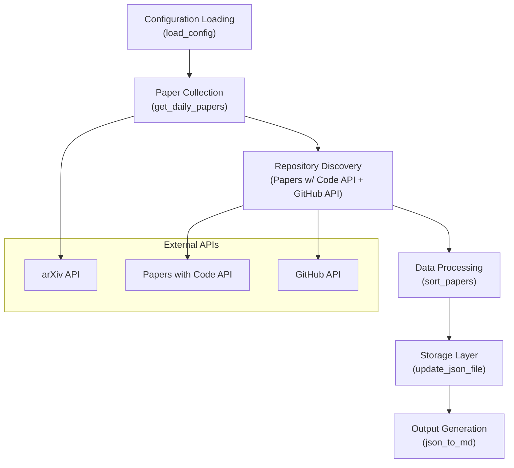
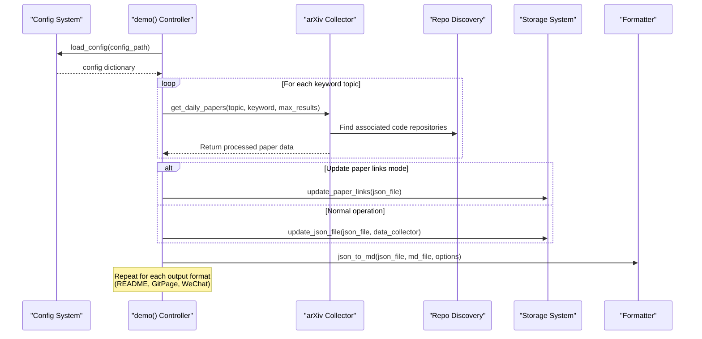
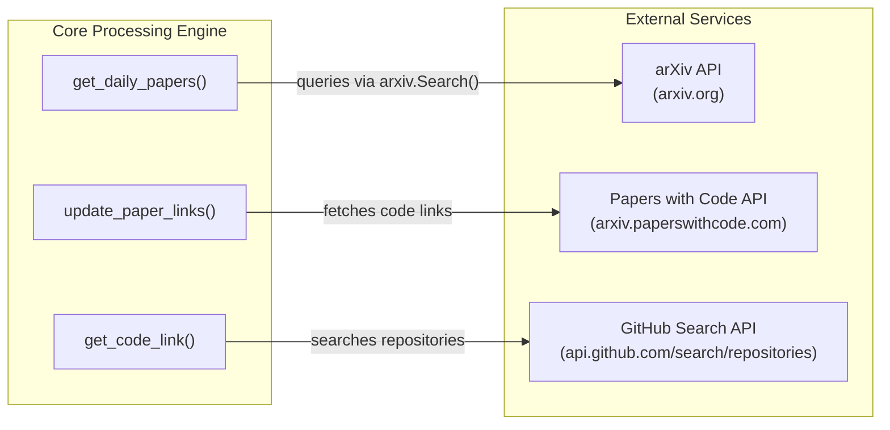
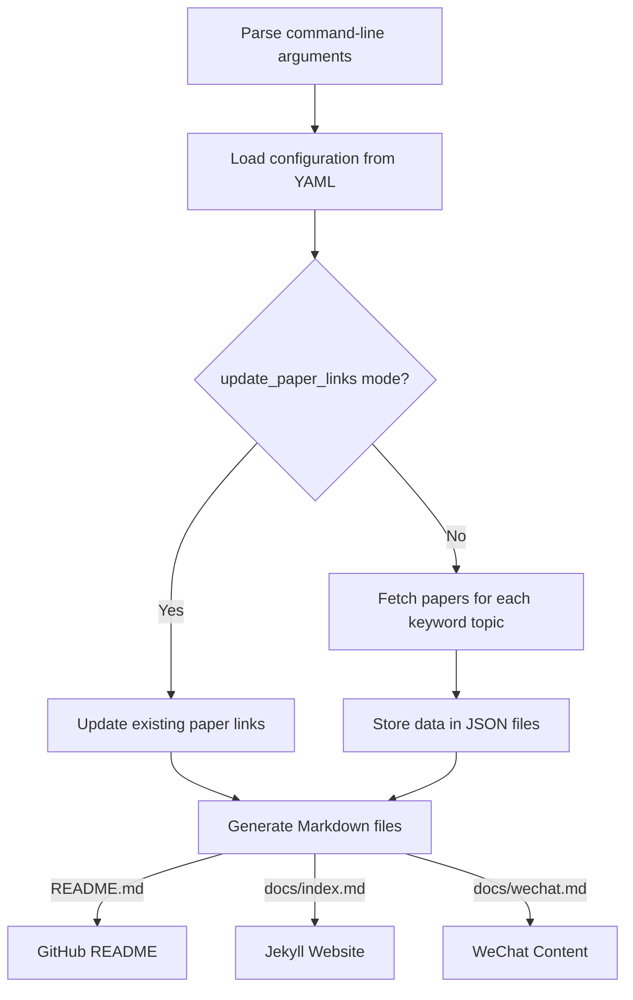

# Core Processing Engine

<details>
<summary>Relevant source files</summary>

The following files were used as context for generating this wiki page:

- [daily_arxiv.py](daily_arxiv.py)

</details>


The Core Processing Engine is the central component of CV-ArXiv-Daily that handles fetching, processing, and publishing computer vision papers from arXiv. Implemented primarily in the `daily_arxiv.py` script, this engine orchestrates the entire paper collection pipeline from retrieving papers from arXiv to generating formatted outputs for various platforms. For information about how this engine is configured, see [Configuration System](#2.2).

## 1. Architecture Overview

The Core Processing Engine follows a modular architecture with distinct processing stages that transform raw arXiv data into organized, formatted paper collections.



Sources: [daily_arxiv.py:19-48](), [daily_arxiv.py:87-161](), [daily_arxiv.py:163-216](), [daily_arxiv.py:217-241](), [daily_arxiv.py:243-368]()

## 2. Main Processing Pipeline

The engine's workflow is orchestrated by the `demo()` function, which serves as the controller for the entire paper collection process:



Sources: [daily_arxiv.py:370-433](), [daily_arxiv.py:434-443]()

## 3. Key Components and Functions

### 3.1 Configuration Management

The `load_config()` function parses the YAML configuration file and prepares filter expressions for arXiv queries:

```
load_config(config_file) → configuration dictionary
└── pretty_filters() → formats keyword filters for arXiv query
```

The configuration controls the engine's behavior, including which keywords to search for, how many results to fetch, and which output formats to generate.

Sources: [daily_arxiv.py:19-48]()

### 3.2 Paper Collection

The `get_daily_papers()` function is responsible for fetching papers from arXiv based on configured queries:

```
get_daily_papers(topic, query, max_results) → (data, data_web)
└── arxiv.Search() → queries arXiv API
    └── process each paper's metadata
        └── attempt to find code repository
```

This function returns two dictionaries:
1. `data`: Paper information formatted for standard display
2. `data_web`: Paper information formatted for web display

Sources: [daily_arxiv.py:87-161]()

### 3.3 Repository Discovery

The engine attempts to find associated code repositories for each paper through multiple methods:

```
Code Repository Discovery
├── Primary: paperswithcode.com API
└── Fallback: GitHub Search API (currently commented out)
```

The engine uses the Papers with Code API as the primary source for finding official implementations, with a fallback to GitHub search when necessary (though this is currently disabled in the code).

Sources: [daily_arxiv.py:66-85](), [daily_arxiv.py:126-137]()

### 3.4 Data Storage

The engine uses JSON files as an intermediate storage format:

```
update_json_file(filename, data_dict) → updates JSON with new paper data
└── merges new papers with existing data
```

This function handles the persistence layer, ensuring that new papers are added to the existing collection without duplication.

Sources: [daily_arxiv.py:217-241]()

### 3.5 Output Generation

The `json_to_md()` function converts the JSON data into formatted Markdown:

```
json_to_md(filename, md_filename, options) → generates Markdown file
├── Adds headers, table of contents
├── Formats paper entries in tables or lists
└── Sorts papers by date
```

The function generates different formats based on the target platform (GitHub README, Jekyll website, WeChat).

Sources: [daily_arxiv.py:243-368]()

## 4. Data Models and Structures

The Core Processing Engine uses several key data structures:

| Data Structure | Purpose | Format |
|----------------|---------|--------|
| `config` | Stores configuration parameters | Dictionary from YAML |
| `data_collector` | Collects paper data for standard display | List of dictionaries |
| `data_collector_web` | Collects paper data for web display | List of dictionaries |
| `json_data` | Persistent storage of paper information | Nested dictionary |

The JSON data structure follows this pattern:

```
{
  "topic1": {
    "paper_id1": "formatted_paper_entry1",
    "paper_id2": "formatted_paper_entry2",
    ...
  },
  "topic2": {
    ...
  }
}
```

Sources: [daily_arxiv.py:372-379](), [daily_arxiv.py:217-241]()

## 5. External API Integration

The Core Processing Engine interacts with several external APIs:



Sources: [daily_arxiv.py:15-17](), [daily_arxiv.py:96-100](), [daily_arxiv.py:74-84](), [daily_arxiv.py:127-128]()

## 6. Output Formats

The Core Processing Engine generates three primary output formats:

| Output Format | Target File | Purpose |
|---------------|-------------|---------|
| GitHub README | `README.md` | Primary display on GitHub repository |
| Jekyll Website | `docs/index.md` | Web interface for browsing papers |
| WeChat Format | `docs/wechat.md` | Content formatted for sharing on WeChat |

Each format has specific formatting requirements handled by the `json_to_md()` function with different parameters.

Sources: [daily_arxiv.py:395-432]()

## 7. Execution Flow

When executed, the Core Processing Engine follows this sequence:



The engine can run in two modes:
1. Normal mode: Fetch new papers and update the collection
2. Update mode: Update code repository links for existing papers

Sources: [daily_arxiv.py:434-443](), [daily_arxiv.py:370-433]()

## 8. Error Handling and Logging

The Core Processing Engine implements logging and error handling:

```
Exception Handling and Logging
├── Basic logging setup with timestamps
└── Try-except blocks around API calls
    └── Logging of errors with paper IDs
```

This ensures that the process can continue even if individual paper processing fails, and provides diagnostics for troubleshooting.

Sources: [daily_arxiv.py:11-13](), [daily_arxiv.py:156-157](), [daily_arxiv.py:211-212]()

## 9. Integration with GitHub Actions

The Core Processing Engine is designed to be run by GitHub Actions, which provides the automation layer for the system. The engine is invoked with specific command-line arguments that control its behavior:

```
python daily_arxiv.py [--config_path CONFIG_PATH] [--update_paper_links]
```

This enables the system to run on a scheduled basis or in response to manual triggers.

Sources: [daily_arxiv.py:434-443]()

---